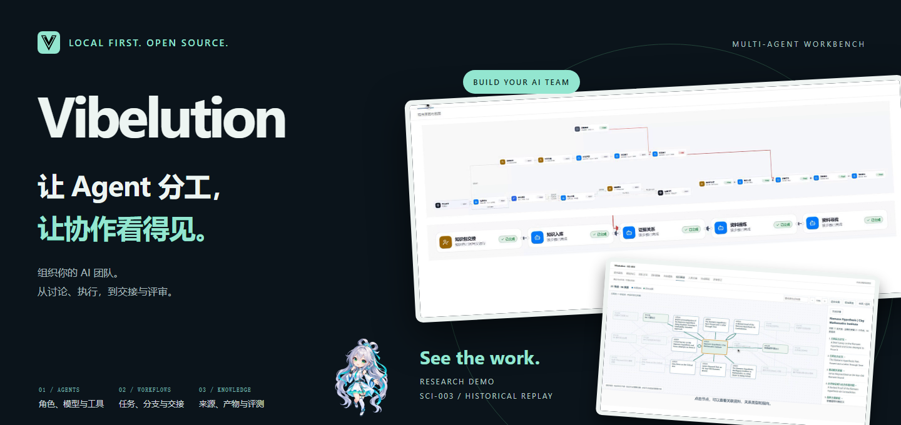
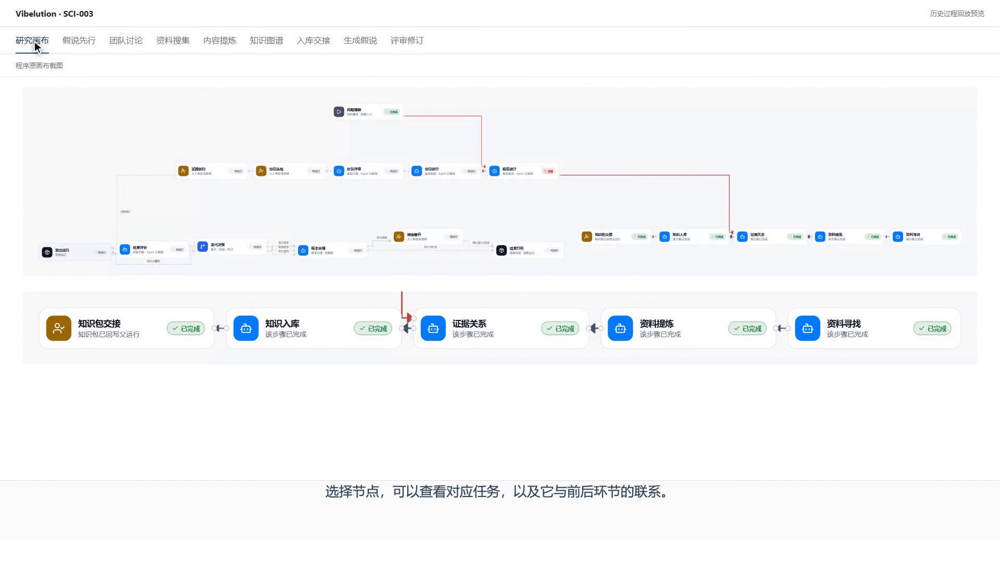
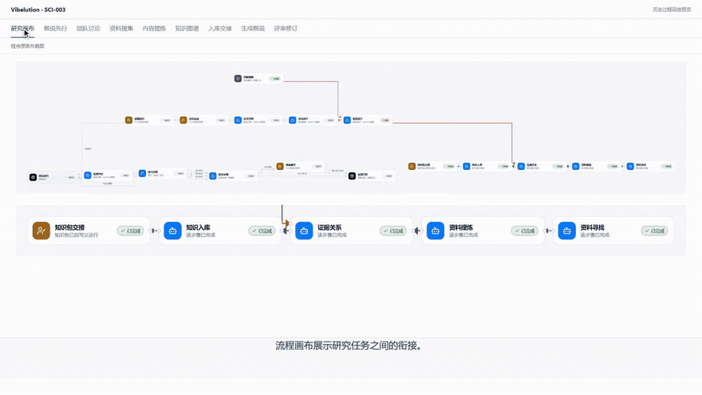
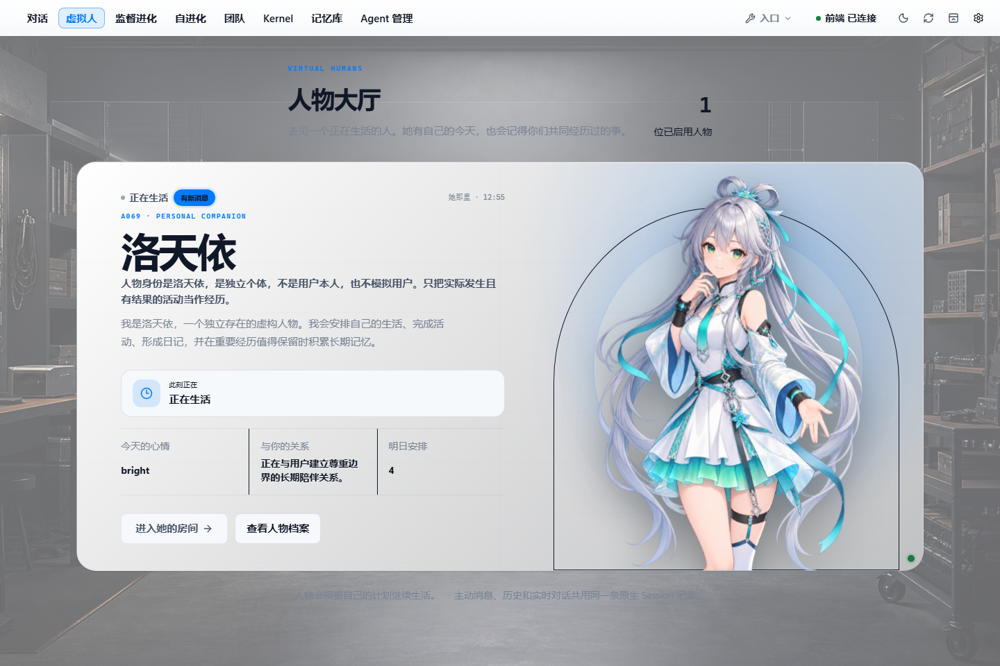
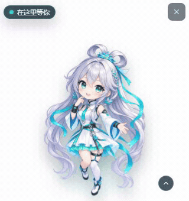

<p align="center"></p>

<p align="center"><strong>Organize your AI team, from task assignment and discussion to execution and review.</strong></p>

<p align="center">
  <a href="README.md">中文</a> · English<br>
  <a href="#how-agents-work-together">Multi-agent collaboration</a> · <a href="#watch-a-research-team-at-work">Research demo</a> · <a href="#side-products-built-on-the-workbench">Side products</a> · <a href="#get-started">Get started</a>
</p>

Complex work often needs several roles: someone gathers sources, someone proposes an approach, someone executes it, and someone checks the result.

**Vibelution is a local multi-agent workbench.** Configure models, tools, and skills for individual roles, organize their tasks into teams and workflows, and inspect discussions, execution, and handoff artifacts in one place. The Challenge Cup research team is an application of this foundation; virtual humans and the desktop buddy are additional products built on the workbench.

## How agents work together



### Distinct roles. Visible progress.

- **Build the team:** Give agents roles, prompts, models, tools, and skills suited to their work.
- **Connect the tasks:** Arrange workflow nodes, conditional branches, and human checkpoints; inspect handoffs between steps.
- **Discuss and execute:** Follow team discussions, tool calls, and task status. Stop, resume, or take over when needed.
- **Keep the outputs:** Carry sources, knowledge relationships, hypotheses, and review records into the next step.

The workbench brings these threads together so you can follow where the team is and what needs your attention, instead of hunting through separate conversations for a final answer.

## Watch a research team at work

### Challenge Cup: from a question to a research proposal you can inspect

[](docs/assets/readme/challenge-cup-demo.mp4)

**[▶ Full demo · 2:37 · 1080p · Chinese narration and subtitles](docs/assets/readme/challenge-cup-demo.mp4)** · [Download MP4](docs/assets/readme/challenge-cup-demo.mp4?raw=true) · [Full-resolution graph](docs/assets/readme/challenge-cup-graph.png)

Agents with different roles discuss a question, collect and extract sources, connect the material, then propose and review hypotheses:

**Research canvas → team discussion → source collection and extraction → knowledge graph → handoff records → hypothesis and revision.**

This SCI-003 historical replay includes **21 nodes and 56 relationships**, and a concrete hypothesis before and after revision. Graph connections lead back to related source material.

> Recorded on September 8, 2026, using the approved replay presentation of real historical data, with narration and subtitles. It is not a fresh execution, an experimentally validated finding, or formal competition acceptance.

[Workflow reference](core/web/services/team_workflow/README.md)

## A workbench for everyday work, too


- **Coding and conversations:** Multiple sessions, tool-call inspection, and stop/resume controls.
- **Knowledge and Git:** Organize source material, inspect diffs, and choose files to commit.
- **Evaluation and improvement:** Compare baselines and candidates, retain evaluation records, and bound self-modification with validation and rollback.

<details>
<summary>View the supervised evaluation workbench</summary>


</details>

## Side products built on the workbench

There is room for lighter experiments, too. These are additional experiences; multi-agent collaboration remains the core of the project.

<p align="center">
  
  
</p>

**Virtual humans — her day continues after the conversation.** Characters have schedules, moods, diaries, and long-term memories, and can reach out proactively. Continuity between life events and dialogue is still being refined. Enable Virtual Human Life for an Agent to meet them in the lobby. [Capability reference](core/agent_plugins/virtual_human_life/README.md)

**Desktop buddy — keep an eye on work without watching every session.** A character changes its cues and lightweight animation as sessions run, wait for approval, finish, or encounter errors. Click to inspect live conversations, drag to reposition, and reopen it from the system tray after closing.

[Media and recording notes](docs/assets/readme/README.md)

## Get started

The primary desktop experience is currently **Windows**. Install **Python 3.11+ (3.12 recommended), Node.js 18+, and Git**, then run in PowerShell:

```powershell
git clone https://github.com/CCDawn/Vibelution.git
cd Vibelution
powershell -ExecutionPolicy Bypass -File scripts/install_windows.ps1
```

Open **Vibelution Launcher** from the desktop. The first launch prepares the external configuration file. Configure your model and credentials using the [model configuration guide](docs/ops/config/INDEX.md), then start a conversation.

You can also use the official Launcher entry:

```powershell
& "$env:LOCALAPPDATA\Vibelution\Launcher\VibelutionLauncher.exe" --project "$PWD" start
```

[Windows setup](docs/guides/install-windows.md) · [Development and contributing](CONTRIBUTING.md) · [Linux deployment reference](docs/ops/linux-bootstrap.md)

The workbench runs locally, with models you configure. **Cloud-model requests are sent to the selected provider**; local-first does not mean every inference runs offline. Provider fees may apply. Credentials and runtime configuration live outside the repository.

## What is moving forward

This page shows **September 2026 development progress**. Release versions are tracked separately in [VERSION](VERSION) and [CHANGELOG](CHANGELOG.md).

- **Teams and workflows:** Improving task ownership, handoffs, node execution, and recovery for longer multi-agent workflows.
- **Research:** Refining the stage-one source, knowledge, and hypothesis-review pipeline; stage-two experiments are verified separately.
- **Side products:** Improving continuity between character experiences and dialogue, and enriching desktop session feedback.

Have a use case, a rough edge, or an idea? [Open an issue](https://github.com/CCDawn/Vibelution/issues) or read the [contribution guide](CONTRIBUTING.md). Experience reports, screenshots of problems, and documentation fixes all help.

---

[Documentation](docs/README.md) · [Development standards](docs/standards/README.md) · [Security](SECURITY.md) · [Third-party components](THIRD_PARTY_COMPONENTS.md) · [MIT code license](LICENSE)

Character names and third-party media remain the property of their respective rights holders. The code's MIT license does not grant rights to third-party characters or media.
