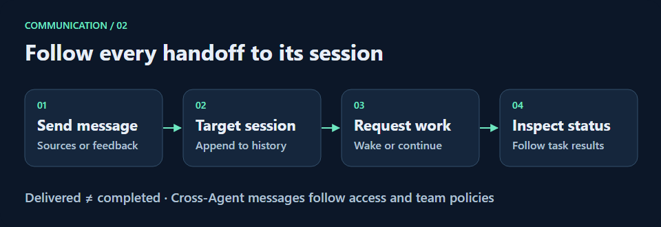
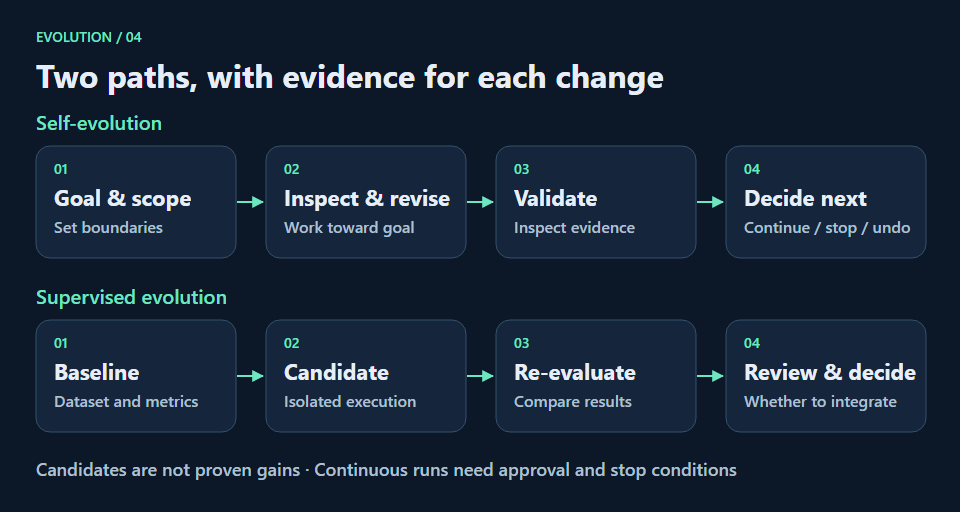

<h1 align="center">Vibelution</h1>

<p align="center"><strong>Build AI teams that communicate, collaborate, and evolve.</strong></p>
<p align="center">Organize research in a local workbench, with traceable sources, discussions, and outputs.</p>

<p align="center">
  <a href="README.md">中文</a> · English<br>
  <a href="#quick-start">Quick start</a> · <a href="docs/assets/readme/challenge-cup-demo.mp4">Watch demo</a> · <a href="docs/README.md">Documentation</a>
</p>

<p align="center">
  <a href="LICENSE"></a>
  <a href="docs/guides/install-windows.md"></a>
  <a href="https://github.com/CCDawn/Vibelution/issues"></a>
</p>

[](docs/assets/readme/challenge-cup-demo.mp4)

<p align="center"><a href="docs/assets/readme/challenge-cup-demo.mp4"><strong>▶ Full demo · 2m 37s · 1080p</strong></a> · <a href="docs/assets/readme/challenge-cup-demo.mp4?raw=true">Download MP4</a></p>

*Historical research-data replay recorded on 2026-09-08, with Chinese narration and subtitles. It illustrates the workflow, not live execution or experimental findings. [Media sources](docs/assets/readme/README.md)*

## Quick start

The primary experience is a **local Windows desktop app**. Install **Python 3.11+ (3.12 recommended), Node.js 22.12+, and Git**, then run in PowerShell:

```powershell
git clone https://github.com/CCDawn/Vibelution.git
cd Vibelution
powershell -ExecutionPolicy Bypass -File scripts/install_windows.ps1
```

Open **Vibelution Launcher** from your desktop and configure a provider and API key using the [model configuration guide](docs/ops/config/INDEX.md). Then: **create Agents → configure models and tools → assign team roles → submit a research question**.

[Windows installation](docs/guides/install-windows.md) · [macOS](docs/guides/install-macos.md) · [Linux](docs/guides/install-linux.md)

*On macOS / Linux, follow the platform guide to launch the browser workbench from a terminal. The workbench runs locally; cloud-model requests go to your chosen provider and may incur charges. Configuration and keys live outside the repository.*

## 01 · Give each Agent a specialty

**Configure different roles, models, and tools for research, analysis, coding, and review.**


*Historical configuration example; the current interface may differ. Product captures use Chinese UI text.*

- Manage identity, prompts, models, tool permissions, and personal memory independently.
- Work with one Agent or assign members to reusable team roles.

[Agent management](core/web/services/agent_directory/README.md) · [Model configuration](docs/ops/config/INDEX.md) · [Tool permissions](docs/agents/tool-authorization-entrypoints.md)

## 02 · Pass information between Agents

**Send sources, questions, and review feedback to another Agent’s specific session.**



*Conceptual diagram, not a runtime capture. Cross-Agent communication follows permissions and team policies.*

- Exchange information through member messages, team broadcasts, and group chat.
- Track delivery, wake requests, and execution separately to follow each handoff.

[Communication model](docs/adr/0002-agent-collaboration-session-addressing.md) · [Session workbench](web/src/routes/chat/README.md)

## 03 · Make the research process traceable

**See roles, task dependencies, human checkpoints, and intermediate outputs on one research canvas.**


*Historical replay; the lower portion enlarges the source-collection stage.*

- **Collect and organize:** inspect papers, web pages, and code; distill material with source references.
- **Discuss and review:** propose hypotheses, record feedback and revisions, and hand work to the next stage.
- **Experiment and retain:** manage datasets, metrics, plan versions, run records, and team knowledge.

<details>
<summary><strong>Explore the research knowledge graph</strong></summary>

[](docs/assets/readme/challenge-cup-graph.png)

Click the image for the original. The graph organizes and traces material; scientific conclusions still require original sources and experiments. Execution depends on adapters, data, and environment. Passing a preliminary check does not validate an experiment.

</details>

[Research workflow](core/web/services/team_workflow/README.md) · [Team knowledge](core/web/services/team_knowledge/README.md) · [Memory and retrieval](core/web/services/memory_rag_services.md)

## 04 · Let validation guide improvement

**Inspect and revise against a goal, or compare a candidate against an evaluated baseline.**



*Conceptual diagram, not an improvement report. A proposal or candidate does not establish a gain. Continuous self-evolution requires user approval and stopping conditions.*

- Inspect changes, validation evidence, audit trails, and rollback records.
- Manage evaluation datasets and review candidates; use isolated validation before deciding whether to integrate.

[Evolution modes](core/web/services/evolution_services.md) · [Evolution configuration](docs/ops/config/06-agent-evolution.md)

## 05 · Build continuity with virtual characters

**Give an Agent a character identity whose schedule, mood, and memories carry into future conversations.**


*Lobby captured on 2026-09-08. Life and conversation continuity are still being refined; these capabilities apply only to Agents with the plugin explicitly enabled.*

- Manage schedules, activities, goals, habits, diaries, and long-term memory.
- Receive proactive messages based on character state; desktop companions offer session access and status cues.

[Virtual-life plugin](core/agent_plugins/virtual_human_life/README.md) · [Desktop companion idle animation](docs/assets/readme/desktop-pet.gif)

## Explore further

[Model and usage configuration](docs/ops/config/INDEX.md) · [Files, terminal, and tools](tools/README.md) · [MCP integration](docs/agents/mcp-managed-agent-gateway.md) · [Changelog](CHANGELOG.md)

Report issues through [GitHub Issues](https://github.com/CCDawn/Vibelution/issues), or start with the [contributing guide](CONTRIBUTING.md). [Documentation map](docs/README.md) · [Testing](tests/README.md) · [Security](SECURITY.md)

**Related projects:** [briefbound-skills](https://github.com/CCDawn/briefbound-skills) · [Codex-Dynamic-Skin](https://github.com/CCDawn/Codex-Dynamic-Skin) · [harmony-codex](https://github.com/CCDawn/harmony-codex) · [pc-touchpad](https://github.com/CCDawn/pc-touchpad)

[MIT code license](LICENSE) · [Third-party components](THIRD_PARTY_COMPONENTS.md) · [Media sources](docs/assets/readme/README.md). Character names and third-party assets belong to their respective rights holders; the code license does not grant rights to those assets.
