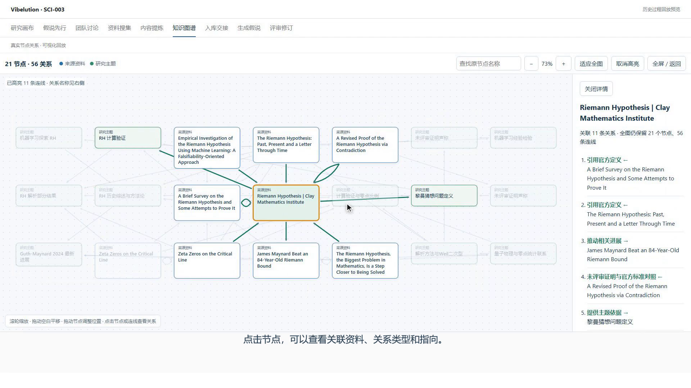

<h1 align="center">Vibelution</h1>

<p align="center"><strong>搭建能沟通、协作与进化的 AI 团队。</strong></p>
<p align="center">原生多 Agent · Agent 通信 · 团队协作 · 自进化与监督进化 · 虚拟人</p>

<p align="center">
  中文 · <a href="README.en.md">English</a><br>
  <a href="#原生多-agent-搭建">搭建 Agent</a> · <a href="#agent-通信">Agent 通信</a> · <a href="#团队协作">团队协作</a> · <a href="#自进化与监督进化">进化</a> · <a href="#虚拟人">虚拟人</a> · <a href="#开始使用">开始使用</a>
</p>

<p align="center">
  <a href="LICENSE"></a>
  <a href="docs/guides/install-windows.md"></a>
  <a href="https://github.com/CCDawn/Vibelution/issues"></a>
</p>

<p align="center">
  
</p>

**Vibelution 是一个本地多 Agent 平台，面向需要组织 AI 团队开展学术研究的用户。** 在工作台内创建 Agent，为各自配置角色、模型、工具与记忆，让成员通过消息、群聊和团队工作流协作，再用评测和进化机制改进 Agent／项目实现。

从科研分工到长期角色体验，首页重点展示五项能力：

| 核心能力 | 你可以做什么 |
| --- | --- |
| **原生多 Agent 搭建** | 创建和管理独立 Agent，分别配置身份、职责、模型、提示词、工具与记忆，再组织为团队 |
| **Agent 通信** | 让 Agent 向指定会话发送消息、请求对方处理；通过成员通信、团队广播与群聊交换信息 |
| **团队协作** | 分配角色、连接任务与人工确认节点，在研究画布里推进调研、知识整理、假说评审和实验设计 |
| **自进化与监督进化** | 以明确目标进行自检、修改和验证，或通过数据集、基线与候选对照评估改进 |
| **虚拟人** | 为 Agent 绑定人物生活能力，提供日程、情绪、日记、长期记忆与主动消息 |

## 看一支科研团队如何工作

**团队讨论 → 资料搜集 → 内容提炼 → 知识图谱 → 假说生成 → 评审修订。**

[](docs/assets/readme/challenge-cup-demo.mp4)

**[▶ 观看完整演示 · 2 分 37 秒 · 1080p](docs/assets/readme/challenge-cup-demo.mp4)** · [下载 MP4](docs/assets/readme/challenge-cup-demo.mp4?raw=true)

重点看成员如何分工、资料如何交给下一阶段，以及一条假说经过评审后具体改了什么。科研是这些平台能力共同工作的一个场景：研究者决定方向与结论，Agent 分担搜集、整理、讨论和执行，留下可追溯的研究记录。

> 挑战杯科研场景，2026-09-08 录制的真实历史数据回放，含中文配音和字幕。展示研究流程与修订记录，不代表当次现场执行、实验结论或正式比赛验收。[素材来源与日期](docs/assets/readme/README.md)

## 原生多 Agent 搭建

**在 Vibelution 内创建有独立配置、会话和个人记忆的 Agent，再按任务需要组建团队。** 从角色创建到成员管理、模型绑定和工具授权，都有对应的工作台入口。

- **定义角色与职责：** 创建、编辑、归档和批量管理 Agent，为不同成员配置身份与任务提示词。
- **按角色选择模型：** 分别绑定服务商和模型，配置运行参数，让调研、分析、编码和评审使用各自需要的模型。
- **配置能力与积累：** 授予文件、终端、搜索等工具，复用提示词和技能，绑定可选插件；个人记忆可供同一 Agent 的后续会话使用。
- **从个人到团队：** 单独与一个 Agent 工作，也可以把成员绑定到团队角色，复用团队模板与分工。

例如，围绕一个研究课题配置“资料调研、假说提出、实验设计、结果评审”几个角色，分别设置模型和工具，再让他们参与同一条研究流程。

[Agent 配置与管理](core/web/services/agent_directory/README.md) · [模型配置](docs/ops/config/INDEX.md) · [工具授权](docs/agents/tool-authorization-entrypoints.md)

## Agent 通信

**Agent 可以把消息发到另一个 Agent 的指定会话，并请求对方继续处理。** 资料交接、方案讨论和评审反馈可以通过平台内的通信能力完成。

| 通信方式 | 用途 |
| --- | --- |
| **Agent 间消息** | 将资料、问题或反馈发送到目标会话；消息进入该会话历史，可请求唤起目标会话处理 |
| **团队群聊** | 让多个成员围绕同一主题讨论，集中查看团队任务轮次与对话记录 |
| **团队广播** | 向团队传达共同信息，查看广播记录和成员通信 |
| **投递与任务追踪** | 查看消息投递、会话唤起和任务执行状态，区分“已送达”与“已完成” |

例如，调研 Agent 将资料交给假说 Agent，评审 Agent 再把修改意见发回对应会话。通信面向明确的目标，并受角色权限和团队通信规则约束；研究者可以查看记录，跟进每一步交接。

[Agent 通信机制](docs/adr/0002-agent-collaboration-session-addressing.md) · [会话工作台](web/src/routes/chat/README.md)

## 团队协作

**把多个 Agent 的工作组织成一条可见的流程。** 团队工作台管理成员与角色关系，研究画布展示任务节点、上下游依赖、条件分支、人工确认和阶段产物。


*研究画布与知识搜集段的历史回放截图。选择节点可查看对应任务及前后环节。*

在学术研究场景中，团队协作可以覆盖：

| 研究环节 | 协作内容与留下的记录 |
| --- | --- |
| **资料与代码调研** | 按工具配置搜索论文、网页和公开项目，筛选候选资料、提炼内容并保留来源；GitHub 项目库支持本地浅克隆与索引，供 Agent 查阅可复用实现 |
| **知识整理与交接** | 将资料组织为团队知识，保留提案、审核与入库记录；个人记忆、共享知识和统一检索支持后续任务复用 |
| **假说与评审** | 提出候选方向，记录评审意见与修订，比较修改前后的方案及其依据 |
| **实验设计与运行** | 管理数据集、指标、基线和初步检查计划，修订并冻结方案版本，关联初步及正式运行记录 |
| **迭代与成果交接** | 将结果整理入库，通过迭代与导出入口把本轮记录交给下一阶段 |

[](docs/assets/readme/challenge-cup-graph.png)

*[点击放大图谱](docs/assets/readme/challenge-cup-graph.png)。图谱用于组织和追溯材料，学术结论仍需核对原始来源与实验。*

实验执行取决于已接入的适配器、数据、环境与运行条件。初步检查通过只说明该检查完成，实验效果以对应正式运行结果为准。

[研究工作流与实验模块](core/web/services/team_workflow/README.md) · [团队知识库](core/web/services/team_knowledge/README.md) · [记忆与检索](core/web/services/memory_rag_services.md)

## 自进化与监督进化

**让 Agent／项目的改进有目标、有对照，也有可检查的过程。** Vibelution 提供两种进化模式。

### 自进化：围绕目标自检、修改与验证

在明确目标和范围内，发起自检、自修改与验证，查看运行状态、改动事务、审计和回滚记录。需要持续迭代时，由用户批准并设置停止条件。

**目标 → 自检 → 修改 → 验证 → 检查结果与后续决策。**

### 监督进化：用基线与候选对照检验改进

管理评测数据集和测试包，运行基线与候选对照，复查改进提案。工作台提供当前运行、历史结果、会话样本审核、提案库和建议基线；候选执行与集成经过隔离验证。

**基线评测 → 改进提案 → 候选执行与复评 → 审核 → 集成决策。**


*仓库已有的监督进化界面截图，展示流程布局；图中尚未开始运行，不是效果提升的证明。*

这两种模式用于评估和改进 Agent／项目实现。研究假说的科学有效性仍需对应实验验证，生成提案本身也不代表能力已经提升。

[进化模式与运行说明](core/web/services/evolution_services.md) · [Agent 与进化配置](docs/ops/config/06-agent-evolution.md)

## 虚拟人

**让 Agent 拥有人物身份、生活状态与长期互动。** 通过按角色绑定的虚拟人生活插件，为人物配置对话之外的日程、活动和记忆，在人物大厅查看并进入角色会话。


- **日程与生活：** 管理日常安排、活动、长期目标、项目和习惯，让角色保留跨日状态。
- **情绪与关系：** 从互动和生活事件形成心情与关系变化，影响人物表达。
- **日记与长期记忆：** 为已发生的活动留下记录，通过反思和有来源的记忆保留经历。
- **主动交流：** 根据角色状态和互动情况产生主动消息，结合未完话题与承诺继续交流。

生活与对话连续性仍在打磨。人物能力只对显式绑定并启用插件的 Agent 生效。

<p align="center">
  
</p>

桌面伙伴还能提示会话状态、打开对话；宠物空间展示等级、经验、状态与成就。

[虚拟人生活插件](core/agent_plugins/virtual_human_life/README.md)

## 模型、工具与研究工作环境

| 能力 | 工作台提供什么 |
| --- | --- |
| **模型与用量** | 多服务商、按 Agent 绑定模型、协议与缓存配置；按 Agent、会话或模型查看 Token、缓存读取与延迟，区分回传、估算和缺失数据 |
| **Prompt、技能与插件** | 维护提示词、查看实际会话上下文、复用角色能力；技能库当前以搜索和浏览为主 |
| **文件、终端与 Git** | 阅读和修改研究代码、执行命令与测试，查看 diff、历史并按文件提交 |
| **外部 Agent 接入** | 接入配置好的 CLI Agent；外部开发工具可通过 MCP 网关调用项目内非团队受管 Agent，提交任务并查询结果 |
| **浏览器与图像工具** | 按需配置服务并授予 Agent 工具权限；浏览器自动化默认关闭 |
| **运行管理与诊断** | Launcher 统一管理启停、分支实例隔离、任务时间线、日志与运行现场，便于排查长任务问题 |

[模型配置](docs/ops/config/INDEX.md) · [工具目录](tools/README.md) · [MCP 接入指南](docs/agents/mcp-managed-agent-gateway.md)

## 开始使用

目前以 **Windows 本地桌面体验**为主。准备好 **Python 3.11+（推荐 3.12）、Node.js 18+ 和 Git**，在 PowerShell 中执行：

```powershell
git clone https://github.com/CCDawn/Vibelution.git
cd Vibelution
powershell -ExecutionPolicy Bypass -File scripts/install_windows.ps1
```

安装完成后，打开桌面上的 **Vibelution Launcher**。首次启动会准备外部配置文件；按[模型配置指南](docs/ops/config/INDEX.md)配置模型与密钥。

**从一个研究课题开始搭建：**

1. 创建 Agent，配置各自的角色、模型、提示词与所需工具。
2. 创建或选择研究团队，将 Agent 绑定到团队角色。
3. 给出研究问题、已有资料和本轮目标，通过会话、团队讨论与研究流程推进任务。
4. 查看成员通信、阶段产物和评审意见，再决定下一步研究方向。

[Windows 安装说明](docs/guides/install-windows.md) · [开发环境与贡献](CONTRIBUTING.md) · [Linux 部署参考](docs/ops/linux-bootstrap.md)

工作台运行在本机，模型由你配置。使用云端模型时，相应请求会发送给所选服务商并可能产生费用；密钥与运行配置保存在仓库之外。

## 文档与贡献

首页展示 2026 年 9 月的开发进展，发布记录见 [CHANGELOG](CHANGELOG.md)。欢迎通过 [Issue](https://github.com/CCDawn/Vibelution/issues)反馈研究场景、多 Agent 协作问题和功能建议，或从[贡献指南](CONTRIBUTING.md)参与开发。

[文档地图](docs/README.md) · [开发规范](docs/standards/README.md) · [安全问题](SECURITY.md) · [第三方组件](THIRD_PARTY_COMPONENTS.md) · [MIT 代码许可证](LICENSE)

角色名称与第三方素材的权利归各自权利人所有；代码的 MIT 许可不授予第三方角色或素材的权利。
