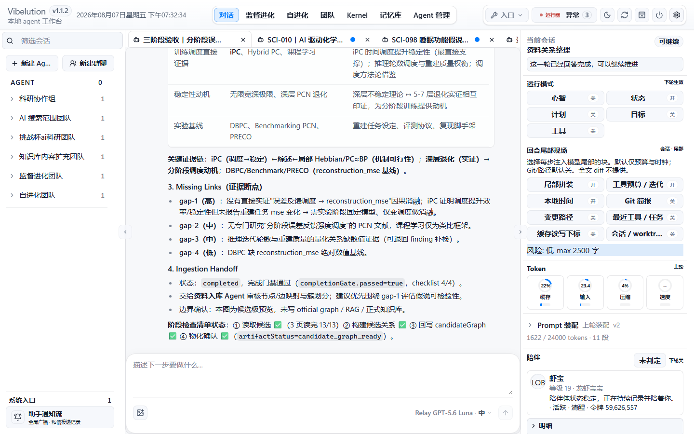
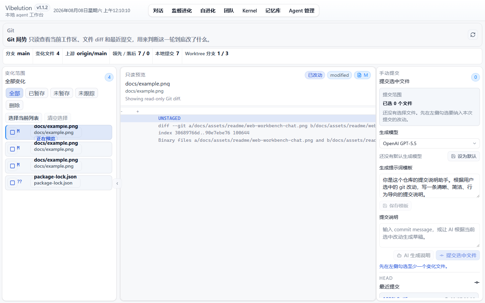
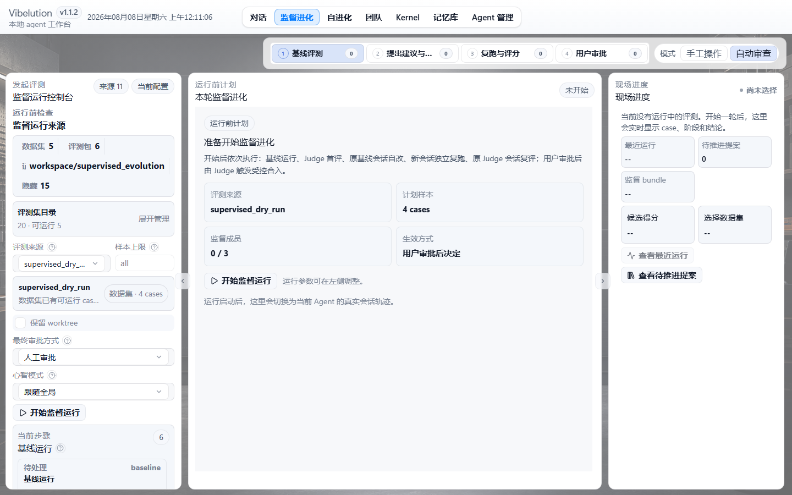

# Vibelution

[](LICENSE)
[](https://www.python.org/)
[](web/)

本地优先的 AI Agent 工作台。把编码对话、Agent 管理、Git、Teams 科研流程、自进化、监督评测和运行日志收在同一套 **本机** runtime 里（Python / FastAPI + React 界面 + launcher）。

不是托管聊天壳，也不打算把你的仓库默认送上云端。配置和密钥放在用户目录的外部 `config.toml`，不进这个 git 仓库。

当前版本 **1.1.1**（见 [VERSION](VERSION) · [CHANGELOG.md](CHANGELOG.md)）。

文档入口：[快速开始](#快速开始) · [当前能力](#当前能力) · [CONTRIBUTING.md](CONTRIBUTING.md) · [docs/product](docs/product/README.md) · [LICENSE](LICENSE)

## 界面预览

演示数据截图，路径 / 密钥 / 真实聊天内容都已拿掉。







## 当前能力

| 面 | 做什么 |
| --- | --- |
| Chat | 多会话编码协作，文件树、只读预览、消息流、停/续、任务状态 |
| Agent | 注册表、提示词、工具与技能边界、模型槽位、权限 |
| Teams | 组织画布 + 阶段（知识搜集 → 实验设计 → 执行），偏课题 / 挑战杯一类流程 |
| Git | 顶栏状态、diff、选文件提交、commit message 草稿 |
| Self Evolution | 有边界的自检 / 自改，带审计和回滚记录 |
| Supervised Evolution | dataset / bundle 对比、run、提案和建议基线 |
| Runtime Scenes | 按次打包前后端、浏览器、生命周期日志，方便查卡住或失败 |
| Config / Reset / Pet | 模型与运行配置、白名单清理、陪伴体状态 |

默认按本机 workbench 用：能装 Python 3.11+、Node 18+（npm）和 Git 再往下走。没有零安装的在线 SaaS 形态。

## 运行模式

| 模式 | 作用 | 常用入口 |
| --- | --- | --- |
| `chat` | 日常对话式编码协作、文件阅读、会话状态管理 | Web `/chat` 或 `python agent.py --mode chat` |
| `self_evolution` | 在当前仓库内执行有界自检、自修改、验证和回滚记录 | Web `/self-evolution` 或 headless 模式 |
| `supervised_evolution` | 用 dataset / bundle 比较 baseline 与 candidate，生成决策、lineage 和 proposal | Web `/supervised-evolution` 或 CLI 参数 |

模式定义与策略入口位于 [core/orchestration/agent_modes.py](core/orchestration/agent_modes.py)。

## 项目结构

```text
Vibelution/
├── agent.py                    # Agent 主入口与主循环编排
├── config/                     # 配置模型库、provider、runtime defaults 与 public config 同步
├── core/
│   ├── chat/                   # Chat session、结果格式与任务状态
│   ├── evaluation/             # 监督进化、dataset registry、dashboard、chat case review
│   ├── gym/                    # proposal lifecycle、advisory baseline、promotion 记录
│   ├── infrastructure/         # session、tool executor、git memory、security、workspace
│   ├── orchestration/          # 模式策略、委托、输出边界、回合收束
│   ├── prompt_manager/         # prompt 组装、任务分析、代码库地图
│   ├── runtime_manager/        # Web workbench 与运行进程生命周期
│   ├── web/                    # FastAPI app、routes、services
│   └── logging/                # transcript、tool tracker、runtime scene 日志
├── tools/                      # Agent 可见工具与内部工具封装
├── docs/                       # 文档地图：standards / product / ops / adr / archive
├── web/                        # React + Vite 前端工程
├── workspace/                  # 本地运行态产物、evaluation 数据和日志
├── tests/                      # Python 测试套件
├── scripts/web_workbench.py    # 本地 Web workbench 启动脚本
└── .docs/project-memory/       # 项目记忆与多页 HTML 状态面
```

## 快速开始

依赖：Python 3.11+（建议 3.12）、Node.js 18+（npm）、Git。Windows 若走桌面窗口，建议本机有 Edge。

```bash
git clone https://github.com/CCDawn/Vibelution.git
cd Vibelution
```

### 1. 用 launcher（推荐）

```powershell
# Windows
powershell -ExecutionPolicy Bypass -File scripts/vibelution_launcher.ps1 -Action start
```

```bash
# macOS / Linux（不自动开浏览器）
python scripts/vibelution_launcher.py --action start --no-browser
# 本机打开 http://127.0.0.1:8000（以日志为准）
```

首次会检查系统依赖，缺 `.venv` / 前端依赖 / `web/dist` 时在项目内装齐或构建。缺 Python、Node 会直接报错停住。过程日志在 `.runtime/launcher/launcher-control.log` 和 `logs/runtime_scenes/`。之后启动只做指纹检查，能复用就复用。

正式路径以 npm / `package-lock` 为准；Bun 只是本地辅助，别为了它改锁文件策略。

### 2. 手动装 Python 依赖

```bash
python -m venv .venv
# Windows: .\.venv\Scripts\activate
# macOS / Linux: source .venv/bin/activate
pip install -r requirements.txt
```

### 3. 手动装前端依赖

```bash
cd web
npm install
```

如果本机已安装 Bun，可以在依赖已就绪后使用辅助脚本加快本地开发循环：

```bash
cd web
bun run bun:dev
bun run bun:test
bun run bun:build
```

### 4. 配置 LLM

运行配置统一存放在用户级外部路径（默认：`%USERPROFILE%\\Documents\\Vibelution\\config\\config.toml`）。新环境通过 Launcher 首次启动时会自动创建该目录和 starter 文件；也可以设置 `VIBELUTION_CONFIG_HOME` 或 `VIBELUTION_CONFIG_PATH` 指向其他外部配置位置。

```toml
[runtime]
profile = "safe_remote"
preflight_doctor = true
require_venv = true

[llm.model_library.openai_gpt_4_1]
model = "gpt-4.1"
label = "OpenAI GPT-4.1"
api_key_env = "VIBELUTION_LLM_MODEL_OPENAI_GPT_4_1_API_KEY"
transport = "chat_completions"
contract = "tool_chat"
temperature = 0.7
max_output_tokens = 8192
timeout = 120
streaming = true

[llm.model_library.openai_gpt_4_1.provider]
kind = "openai"
api_key_env = "OPENAI_API_KEY"
base_url = "https://api.openai.com/v1"
compat_mode = "openai"
requires_api_key = true
```

示例环境变量：

```powershell
$env:OPENAI_API_KEY="your-api-key"
$env:DEEPSEEK_API_KEY="your-api-key"
$env:MINIMAX_API_KEY="your-api-key"
```

外部 `config.toml` 不在仓库里，别提交真实密钥。上面示例只有环境变量名。

问题与讨论：[Issues](https://github.com/CCDawn/Vibelution/issues/new/choose) · [Discussions](https://github.com/CCDawn/Vibelution/discussions) · 贡献见 [CONTRIBUTING.md](CONTRIBUTING.md) · 版本 [CHANGELOG.md](CHANGELOG.md) / [VERSION](VERSION)

## Agent 开发

给 coding agent / 维护者看的路由说明（最终用户可跳过；细则在 `docs/standards/`）：

- [docs/guides/README.md](docs/guides/README.md) — 加载顺序
- [docs/guides/route.md](docs/guides/route.md) — 任务类型 → READ / EDIT / TEST
- [docs/guides/ownership.md](docs/guides/ownership.md) — 写入落点
- [docs/guides/loop.md](docs/guides/loop.md) — 分级 / 命令 / 完成报告块

全局红线：[AGENTS.md](AGENTS.md)。

## 本地任务闭环

首次在本仓库开发时配置 tracked pre-commit hook。`scripts/doctor.ps1` 只读检查环境与 `core.hooksPath`；如果配置不匹配，它只在输出中提示下面的修复命令，不会静默改写 Git 配置。

日常提交时，hook 自动调用 `local_quality_gate.py commit`，以 staged paths 驱动快速检查：diff check 与 Python Ruff 读取 Git index 中的 staged 内容。它不是对 unstaged worktree 的完全隔离；gate-definition 文件会额外检查同一路径是否同时存在 staged 与 unstaged 改动，且 gate-definition staged 时会在当前 worktree 运行 focused self-test，因此未 stage 的测试或 `conftest.py` 也可能影响结果。任务内容全部提交、task worktree clean 后，在该 task worktree 运行 `closeout` 和 manifest 复核：

```powershell
git config core.hooksPath .githooks
$claimId = $env:VIBELUTION_CLAIM_ID
if ([string]::IsNullOrWhiteSpace($claimId)) { throw "Set VIBELUTION_CLAIM_ID first." }
powershell -ExecutionPolicy Bypass -File scripts/doctor.ps1 -Json
& .\.venv\Scripts\python.exe scripts/local_quality_gate.py closeout --base main --claim-id $claimId
$taskId = (git branch --show-current).Replace("codex/", "")
& .\.venv\Scripts\python.exe scripts/local_quality_gate.py verify-manifest --manifest ".runtime/quality_gates/$taskId.json" --base main
```

`closeout` 绑定本任务 claim、当前本地 `main` SHA、task HEAD SHA、影响面 selector 命令、fast-forward ancestry 与 merge preflight。`verify-manifest` 会在合并前重查 branch/worktree/HEAD/changed files、active claim、clean 状态、checks 与 commands，而不只复核 schema 和 SHA。manifest 的 `outcome=passed` 只表示这些当前授权证据通过，不代表任务已经 merge；进入 root local `main` 前仍须确认 root clean，并只用 `git merge --ff-only <task-branch>`。如果得到 `stale_main`、`claim_conflict`、`dirty_worktree` 或合并冲突，按 `tests/README.md` 的 outcome matrix 回 task worktree 修复并重新运行 `closeout`。

质量门不会执行 merge、release 或删除。fast-forward 后在 root `main` 做最小 post-merge verification，再由任务拥有者只释放本任务 claim，并只移除本任务创建的 junction（如有）、worktree 与 branch；不得清理其他未完成任务。远端 push、PR 和 CI `workflow_dispatch` 是可选发布/远端验证步骤，不属于默认本地闭环。

## 启动方式

### Web Workbench

统一 launcher 入口：

```bash
# Windows
powershell -ExecutionPolicy Bypass -File scripts/vibelution_launcher.ps1 -Action start

# macOS/Linux headless adapter
python scripts/vibelution_launcher.py --action start --no-browser
```

后端与静态前端入口：

```bash
python scripts/web_workbench.py --reload
```

默认监听 `http://127.0.0.1:8000`，并保持无浏览器窗口；桌面入口和 launcher 负责打开托管窗口。调试时如果确实要打开系统默认浏览器，可显式追加 `--open-browser`。如果只跑前端开发服务器：

```bash
cd web
npm run dev
```

Vite 默认监听 `http://127.0.0.1:5173`，并把 `/api` 代理到本地后端。

本地前端调试也可以使用 `bun run bun:dev`，但不要因此提交 `bun.lock`/`bun.lockb`，除非本轮明确迁移包管理器。

### 统一 Agent 入口

```bash
python agent.py
```

常用 headless / 单轮执行：

```bash
python agent.py --auto
python agent.py --mode chat --prompt "分析当前仓库结构" --single-turn
python agent.py --mode self_evolution --prompt "检查最近变更的回归风险"
```

### 监督进化 CLI

```bash
python agent.py --list-datasets
python agent.py --choose-dataset
python agent.py --supervised-evolution --bundle supervised_evolution_dry_run_v1
python agent.py --dataset custom_prompt_jsonl --dataset-limit 20
python agent.py --supervised-dashboard
```

## Web 工作台页面

| 路由 | 作用 |
| --- | --- |
| `/chat` | 对话式编码工作台，包含会话列表、文件树、只读预览、消息输入和实时状态。 |
| `/git` | 仓库局势页，展示变化文件、diff、最近提交、手动提交和 AI commit message 生成。 |
| `/self-evolution` | 自进化现场，展示 readiness、事务历史、fitness、worktree snapshot、审计尾迹和回滚控制。 |
| `/supervised-evolution` | 监督进化 live 控制台，启动 dataset / bundle 运行并观察 active run。 |
| `/supervised-evolution/runs` | 监督运行记录，查看得分、诊断、动作和关联提案。 |
| `/supervised-evolution/library` | Proposal library 与待推进建议项。 |
| `/supervised-evolution/review` | 对话样本审核面，把聊天片段转为可控监督样本。 |
| `/logs` | Runtime scene 和日志文件观察面。 |
| `/config` | 统一配置工作台，包含模型库、全局运行项、Git 提交说明提示词和高级配置检查。 |
| `/reset` | 受保护的本地清理入口。 |
| `/pet` | 长期陪伴体状态入口。 |

## 自进化与监督进化边界

### Self Evolution

自进化负责在当前仓库中执行一轮有界改进。它关注：

- 当前目标和 readiness
- Git working tree 信号
- 演化事务与 fitness 摘要
- 工具调用、验证、审计尾迹
- 回滚 manifest 与冲突说明

自进化不是无限后台任务。每轮都应有目标、证据、验证和停止条件。

### Supervised Evolution

监督进化负责用评测样本比较 baseline 与 candidate，并把结果沉淀成可审核的 proposal / advisory baseline。它关注：

- dataset / bundle materialization
- baseline / candidate 对比
- decision record 与 lineage
- proposal lifecycle
- active advisory baseline
- chat case review

`active advisory baseline` 是建议和治理语义，不代表系统会自动把新能力重写进 runtime。

## 测试与验证

Python：

```bash
pytest tests -q
```

常用局部验证：

```bash
pytest tests/test_web_app.py -q
pytest tests/test_git_status_service.py -q
pytest tests/test_supervised_evolution.py -q
```

前端：

```bash
cd web
npm run test
npm run build
```

Bun 辅助验证：

```bash
cd web
bun run bun:test
bun run bun:build
```

CI 通常覆盖：

- Windows Python `3.11` / `3.12`
- Python compile 与 pytest
- 变更文件 ruff check
- 前端 `npm ci`、`npm run test`、`npm run build`

## 隐私与安全

- 默认当本地 workbench 用；写接口有本机 control token 和来源校验。
- 截图是脱敏演示，不是某台机器的真实状态。
- 外部 `config.toml` 里的密钥、私有 provider 地址、个人绝对路径不要提交。
- Git 页只提交你勾选的文件；还有未选中的 staged 改动时后端会拒提。
- Reset 走白名单，不能乱清任意路径。
- Runtime scene 包里可能有敏感信息，外传前自己过一遍。
- 安全漏洞按 [SECURITY.md](SECURITY.md) 私下报，别在公开 issue 里贴利用细节。

## 许可证

[MIT](LICENSE)。贡献见 [CONTRIBUTING.md](CONTRIBUTING.md)。可选第三方组件说明见 [THIRD_PARTY_COMPONENTS.md](THIRD_PARTY_COMPONENTS.md)（默认不启用）。

## 进一步阅读

| 文档 | 作用 |
| --- | --- |
| [docs/product/README.md](docs/product/README.md) | 产品定位 |
| [docs/README.md](docs/README.md) | 文档地图 |
| [docs/standards/README.md](docs/standards/README.md) | 开发规范入口 |
| [INDEX.md](INDEX.md) | 项目索引 |
| [docs/agents/domain.md](docs/agents/domain.md) | 领域词 |
| [core/core_prompt/SOUL.md](core/core_prompt/SOUL.md) | 行为边界 |
| [docs/standards/development-standard.md](docs/standards/development-standard.md) | 交付标准 |

根目录若有 `AGENTS.md`，本仓库协作按它来。
