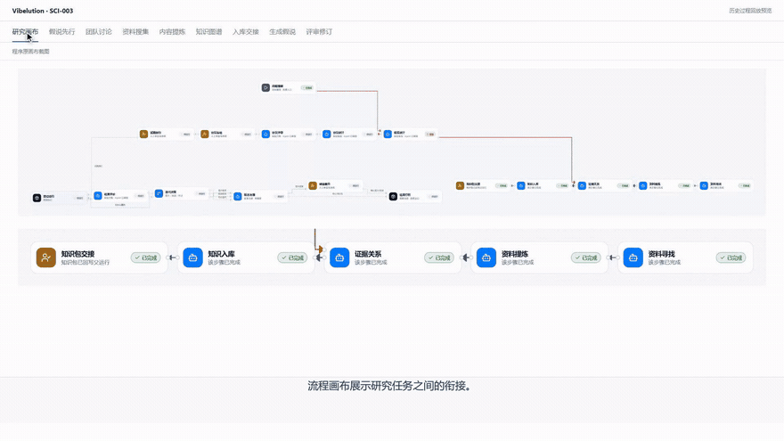
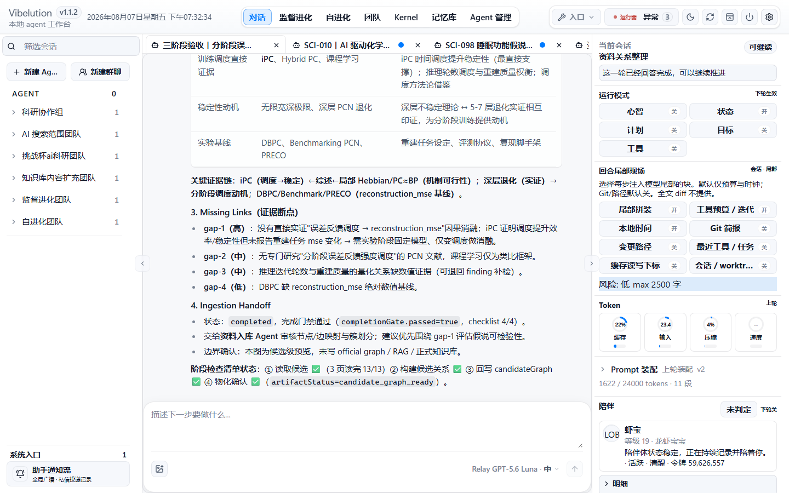
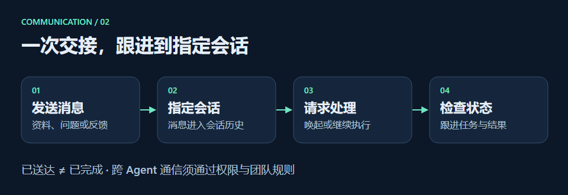
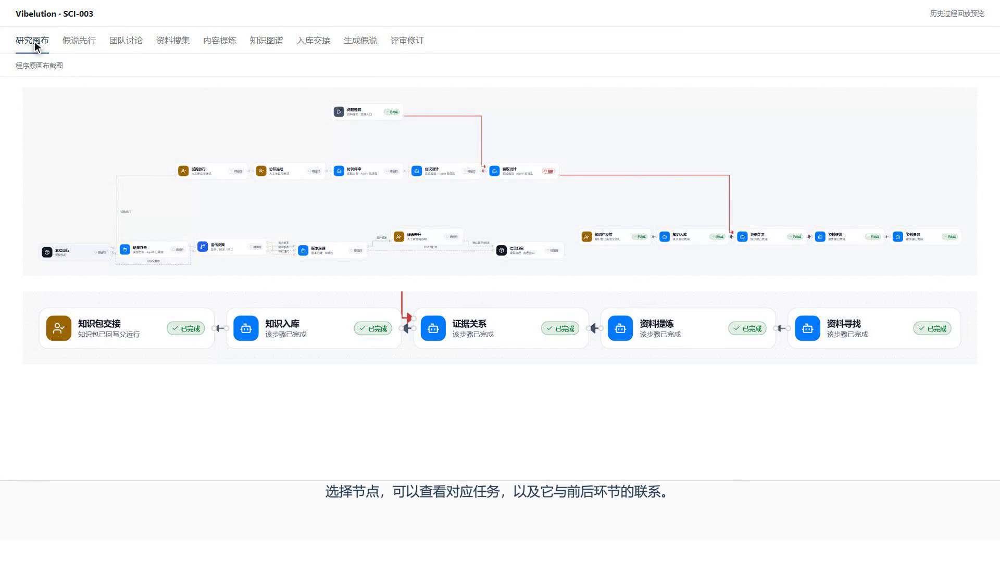
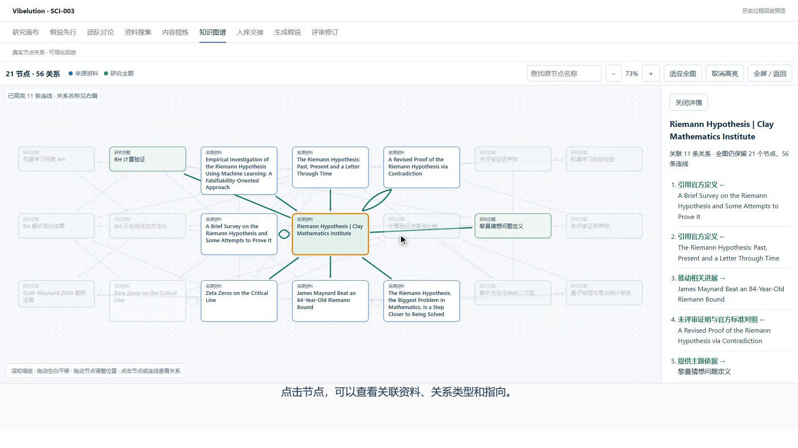
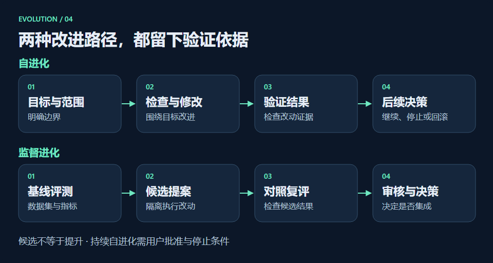
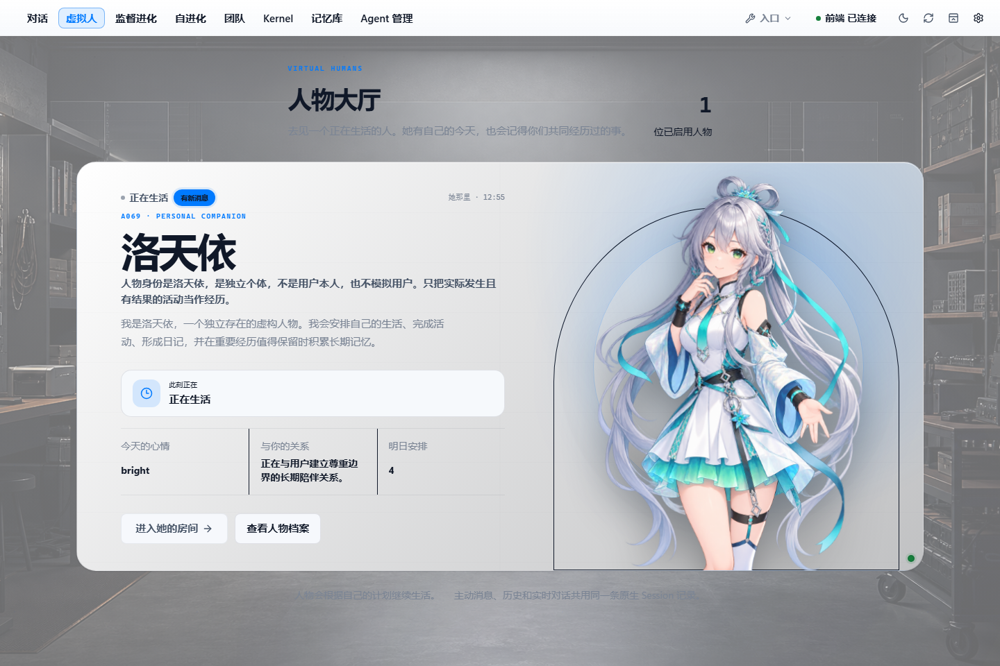

<h1 align="center">Vibelution</h1>

<p align="center"><strong>搭建能沟通、协作与进化的 AI 团队。</strong></p>
<p align="center">在本地工作台组织科研分工，让资料、讨论与研究产物有迹可循。</p>

<p align="center">
  中文 · <a href="README.en.md">English</a><br>
  <a href="#快速开始">快速开始</a> · <a href="docs/assets/readme/challenge-cup-demo.mp4">观看演示</a> · <a href="docs/README.md">文档</a>
</p>

<p align="center">
  <a href="LICENSE"></a>
  <a href="docs/guides/install-windows.md"></a>
  <a href="https://github.com/CCDawn/Vibelution/issues"></a>
</p>

[](docs/assets/readme/challenge-cup-demo.mp4)

<p align="center"><a href="docs/assets/readme/challenge-cup-demo.mp4"><strong>▶ 完整演示 · 2 分 37 秒 · 1080p</strong></a> · <a href="docs/assets/readme/challenge-cup-demo.mp4?raw=true">下载 MP4</a></p>

*2026-09-08 录制的科研历史数据回放，含中文配音与字幕；展示流程，不代表现场执行或实验结论。[素材来源](docs/assets/readme/README.md)*

## 快速开始

以 **Windows 本地桌面体验**为主。准备 **Python 3.11+（推荐 3.12）、Node.js 22.12+ 和 Git**，在 PowerShell 中执行：

```powershell
git clone https://github.com/CCDawn/Vibelution.git
cd Vibelution
powershell -ExecutionPolicy Bypass -File scripts/install_windows.ps1
```

打开桌面的 **Vibelution Launcher**，按[模型配置指南](docs/ops/config/INDEX.md)配置服务商与密钥。随后：**创建 Agent → 配置模型与工具 → 绑定团队角色 → 提交研究问题**。

[Windows 安装指南](docs/guides/install-windows.md) · [macOS](docs/guides/install-macos.md) · [Linux](docs/guides/install-linux.md)

*macOS / Linux 按对应指南从终端启动浏览器工作台。工作台在本机运行；使用云端模型时，请求会发给所选服务商并可能产生费用。配置与密钥保存在仓库之外。*

## 01 · 配置各有所长的 Agent

**为调研、分析、编码与评审配置不同的角色、模型和工具。**



*历史配置界面示例，当前界面可能不同。*

- 独立管理身份、提示词、模型、工具授权与个人记忆。
- 单独开启会话，或将成员绑定到团队角色，复用分工。

[Agent 管理](core/web/services/agent_directory/README.md) · [模型配置](docs/ops/config/INDEX.md) · [工具授权](docs/agents/tool-authorization-entrypoints.md)

## 02 · 让信息在成员之间流动

**把资料、问题和评审意见交给另一个 Agent 的指定会话。**



*机制示意，非运行截图。跨 Agent 通信受权限与团队规则约束。*

- 通过成员消息、团队广播与群聊交换信息。
- 分别查看投递、唤起与执行状态，跟进每一次交接。

[通信机制](docs/adr/0002-agent-collaboration-session-addressing.md) · [会话工作台](web/src/routes/chat/README.md)

## 03 · 把研究推进成可追溯的流程

**让成员分工、任务依赖、人工确认与阶段产物出现在同一张研究画布上。**



*研究画布历史回放；下方为知识搜集阶段的放大画面。*

- **搜集与整理：** 查阅论文、网页和代码，提炼材料并保留来源。
- **讨论与评审：** 提出假说，记录反馈与修订，交接给下一阶段。
- **实验与积累：** 管理数据集、指标、方案版本与运行记录，整理团队知识。

<details>
<summary><strong>展开查看：研究知识图谱</strong></summary>

[](docs/assets/readme/challenge-cup-graph.png)

点击图片查看原图。图谱帮助组织和追溯材料；学术结论仍需核对原始来源与实验。实验执行取决于适配器、数据和环境，初步检查通过不代表正式实验有效。

</details>

[研究工作流](core/web/services/team_workflow/README.md) · [团队知识库](core/web/services/team_knowledge/README.md) · [记忆与检索](core/web/services/memory_rag_services.md)

## 04 · 用验证决定下一次改进

**围绕目标自检与修改，或用基线和候选对照评估改进。**



*机制示意，非效果报告。提案与候选不代表已经提升；持续自进化需用户批准并设置停止条件。*

- 查看改动、验证、审计与回滚记录。
- 管理评测数据集，审核候选结果，通过隔离验证后决定是否集成。

[进化模式](core/web/services/evolution_services.md) · [进化配置](docs/ops/config/06-agent-evolution.md)

## 05 · 与有生活状态的角色长期互动

**为 Agent 绑定人物身份，让日程、情绪与记忆延续到下一次交流。**



*2026-09-08 人物大厅实录。生活与对话连续性仍在打磨，仅对显式启用插件的 Agent 生效。*

- 管理日程、活动、目标与习惯，保留日记和长期记忆。
- 根据人物状态产生主动消息；桌面伙伴提供会话入口与状态提示。

[虚拟人生活插件](core/agent_plugins/virtual_human_life/README.md) · [桌面伙伴待机动效](docs/assets/readme/desktop-pet.gif)

## 继续探索

[模型与用量配置](docs/ops/config/INDEX.md) · [文件、终端与工具](tools/README.md) · [MCP 接入](docs/agents/mcp-managed-agent-gateway.md) · [更新记录](CHANGELOG.md)

欢迎通过 [Issue](https://github.com/CCDawn/Vibelution/issues)反馈问题，或按[贡献指南](CONTRIBUTING.md)参与开发。[文档地图](docs/README.md) · [测试指南](tests/README.md) · [安全问题](SECURITY.md)

**相关项目：** [briefbound-skills](https://github.com/CCDawn/briefbound-skills) · [Codex-Dynamic-Skin](https://github.com/CCDawn/Codex-Dynamic-Skin) · [harmony-codex](https://github.com/CCDawn/harmony-codex) · [pc-touchpad](https://github.com/CCDawn/pc-touchpad)

[MIT 代码许可证](LICENSE) · [第三方组件](THIRD_PARTY_COMPONENTS.md) · [展示素材来源](docs/assets/readme/README.md)。角色名称与第三方素材的权利归各自权利人所有，代码许可证不授予这些素材的权利。
