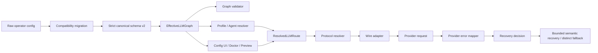

# 模型配置与运行时协议路由准确性改造方案

> **Status**: `active-plan`
> **Owner**: `codex-llm-routing-plan`
> **Date**: 2026-08-14
> **Claim**: `claim-ec638374bf4f`
> **Branch**: `codex/document-llm-wire-compatibility`
> **Worktree**: `.worktrees/document-llm-wire-compatibility`
> **Scope**: 模型配置 schema、有效配置投影、Profile/Agent 绑定、协议解析、配置诊断投影、错误分类、恢复与 fallback；不在本方案阶段修改 operator config、Agent 数据或运行时。
> **Related design**: 多 Agent 配置、A2A/MCP/AG-UI 适配和 Agent 协议绑定见 [`2026-08-14-multi-agent-configuration-and-protocol-routing-research-design.md`](2026-08-14-multi-agent-configuration-and-protocol-routing-research-design.md)。
> **Supersedes**: 不覆盖现行 [`docs/ops/config/`](ops/config/INDEX.md)、[`core/llm/PROTOCOL.md`](../core/llm/PROTOCOL.md)、ADR 或开发标准；历史 LLM 方案仅作背景证据，不再作为实施权威。
> **Implementation link**: `codex/runtime-protocol-routing-implementation`（本地任务分支；完成 closeout 后补充最终提交）。
> **Validation**: 本文需通过链接、格式、Git diff 和计划契约检查；业务实现按第 11 节验证矩阵验收。
> **Close condition**: Critical Path 全部实现、静态与授权后的运行时验收完成、持久规则已提升到 owning docs/ADR，本文状态改为 `implemented` 并移入 `docs/archive/`。

---

## 1. 执行摘要

当前主 Profile 可以静态解析到 `relay_openai/gpt-5.6-luna -> relay_responses -> responses`，但配置系统存在“配置检查通过，不代表所有可选模型和 Agent 真能运行”的结构性缺口。

2026-08-14 只读审查确认：

- 当前 schema v2 公共配置可以成功构建，10 个 Profile 均可静态解析。
- 对 60 个可选模型执行与运行时等价的协议解析时，50 个通过，10 个因 `model_protocol="tool_chat"` 失败。
- 对 53 个当前 Agent dialogue model 绑定执行解析时，48 个通过，5 个引用不存在的模型 ID。
- 配置诊断投影对 60/60 模型产生协议 warning，且 55/60 capability 状态为 unknown；部分本地免认证模型被错误显示为 `missing`。
- schema v2 的多个用户配置面使用 `extra="ignore"` 或 `extra="allow"`，拼写错误会被静默吞掉。
- semantic recovery 会生成 `disable_streaming` / `disable_tools` 决策，但当前调用循环没有真正应用这些标志。
- 当前 Profile 拓扑缺少不同有效路由身份的 provider-level fallback。
- `Insufficient Balance` 会被错误归类为 `provider_protocol_error`。
- 当前 `WireProtocol` 已登记 `chat_completions`、`responses`、`anthropic_messages` 和 `gemini_generate_content`；Chat Completions 与 Responses 使用独立 wire adapter，Anthropic/Gemini 当前使用带正确 wire identity 的 LiteLLM compatibility adapter，并非项目自实现的原生 REST wire。
- 2026-08-14 在 `main@889c162af` 复核协议解析、Chat/Responses wire、出站桥接与会话链，聚焦结果为 70 passed；这是代码级与模拟证据，不代表真实 OpenAI/Anthropic/中转站调用已经验收。
- 聚焦验证基线为：配置核心 312 passed；配置面板/Web route 202 passed；LLM/协议/恢复扩展套件 504 passed、2 项已归因隔离。

本方案采用以下主路径：

1. 先定义严格且不混义的协议字段契约。
2. 建立唯一 `EffectiveLLMGraph` 和统一全图校验器。
3. 用校验器证明当前数据问题，再事务化迁移 operator config 与 Agent 绑定。
4. 让 UI、doctor、preview、Agent picker 和运行时消费同一份解析结果。
5. 修复 semantic recovery、fallback 身份和错误分类。
6. 最后进行静态、模拟和经授权的真实 provider 验收。

禁止先手工批量修改 60 个模型来“消灭报错”。如果先改数据、后补校验，配置系统仍会继续接受未来的错误配置。

---

## 2. Desired Result、边界与成功证据

### 2.1 Desired Result

建立“单一配置语义、单一协议解析器、单一诊断投影”的 LLM 配置链路，使以下命题成立：

> 一个模型只要处于 enabled/selectable 状态，并成功通过配置 preview/apply，就必须能够沿真实运行时路径解析成唯一 `ResolvedLLMRoute`；配置 UI、doctor、Agent 和实际请求必须看到同一个 route identity。

### 2.2 Owning Surface

主要 owning surface：

- 配置模型与公共配置：`config/models.py`、`config/public_config.py`
- schema v2 投影：`config/llm_projection.py`
- Agent/Profile 运行时绑定：`core/llm/agent_runtime.py`
- 协议解析：`core/llm/protocol_resolver.py`
- wire 路由：`core/llm/wire/`
- 请求客户端：`core/llm/client.py`
- 恢复与 fallback：`core/llm/recovery.py`、`core/llm/routing.py`、`core/llm/errors.py`、`agent.py`
- 配置服务诊断：`core/web/services/config_service.py`
- 配置/Agent 前端投影：仅在真实 DTO 或交互变更需要时触及 `web/`
- operator config：`%USERPROFILE%/Documents/Vibelution/config/config.toml`
- Agent registry：必须先通过运行时存储解析确认权威路径，见 2.5。

### 2.3 Acceptance Evidence

完成必须同时具备：

- 启用的 dialogue models 零协议解析错误。
- 活跃 Agent dialogue model 绑定 100% 可解析。
- 所有启用 Profile 100% 可解析。
- UI/doctor/runtime 对同一路由返回相同 `route_fingerprint`。
- 新 schema v2 配置中的未知字段、未知协议、失效引用会被明确拒绝。
- primary 与 fallback 的有效路由身份不同。
- semantic recovery 最多执行一次，且第二次调用的 tools/stream 参数有确定性测试证据。
- 配置迁移幂等、可预览、可回滚，不记录或泄漏 secret。
- 静态、模拟、真实运行时证据分别报告，不互相替代。

### 2.4 非目标

本轮不做：

- 重写整个 `LLMClient` 或替换现有 LangChain/LiteLLM 依赖。
- 为每个 Provider 自建全新 HTTP SDK。
- 通过隐式模型名猜测替代显式协议元数据。
- 自动删除历史模型、Provider、Profile 或 Agent。
- 在没有用户授权时调用付费/远端模型。
- 在方案落地前直接修改 operator config。
- 把 A2A、MCP、AG-UI 的 Agent/工具/UI 协议字段并入模型协议枚举。
- 把历史 `docs/archive/` 方案重新升格为现行规范。

### 2.5 当前存储权威阻塞

本方案编写时运行：

```powershell
python scripts/migrate_project_storage.py inventory --project <project-root>
```

发现两个不同内容的 Agent 文件会映射到同一外部目标：

- `%USERPROFILE%/Documents/Vibelution/data/workspace/agents/agents.json`
- `<project-root>/workspace/agents/agents.json`

在 Task 3 写入 Agent 绑定前，必须通过运行时实际解析路径、storage inventory 和当前 Launcher/runtime 状态确定唯一权威文件。不得基于文件更新时间或既有记忆静默选择其中一个，也不得为了让 inventory 通过而覆盖任一文件。

---

## 3. 目标架构



架构约束：

1. `Raw operator config` 只代表用户输入，不可直接成为运行时真相。
2. 旧字段兼容只能发生在 `Compatibility migration`。
3. `Strict canonical schema v2` 不接受未知字段。
4. `EffectiveLLMGraph` 是所有消费面的唯一解析输入。
5. UI、doctor、preview 不得重新构造 legacy provider 再独立推断协议。
6. wire adapter 不决定产品层模型能力；它只负责把语义请求投影到指定 wire。
7. recovery 必须消费结构化错误分类和 route identity，不能只靠错误文本与 Profile 名称。

---

## 4. 配置与协议字段契约

### 4.1 字段分层

| 字段 | 唯一职责 | 合法示例 | 禁止用法 |
| --- | --- | --- | --- |
| `service_class` | Provider 的部署/服务类别 | `official`、`relay`、`self_hosted`、`local_runtime` | 推断 wire |
| `driver` | Provider 客户端实现 | `openai`、`anthropic`、`gemini` | 表达模型是否支持工具 |
| `interaction_contract` | 模型对话能力契约 | `basic_chat_no_tools`、`tool_chat` | 当作 `model_protocol` |
| `model_protocol` | 语义消息/工具/推理适配契约 | 项目已有显式 protocol enum | 使用任意自由文本 |
| `wire_protocol` | 出站请求形态 | `responses`、`chat_completions` | 表达产品能力 |
| `auth_kind` | 凭据要求 | `api_key`、`none` | 用 `api_key_state=missing` 表示免认证 |
| `context_window` | 上下文硬限制 | 正整数 | enabled dialogue model 留空 |

### 4.2 Canonical schema 规则

- Provider、PinnedModel、Profile、LLMConfig 的 schema v2 用户输入面采用 `extra="forbid"`。
- migration input 可以宽松读取，但必须把所有未知字段转成显式 migration issue。
- `model_protocol`、`wire_protocol`、`interaction_contract` 使用独立枚举或受控 registry。
- 不根据 model display name 或 Provider 名称猜协议。
- Provider default 只能在 canonical projection 中显式继承；最终 `ResolvedLLMRoute` 不允许保留“待运行时猜测”。
- 每个 enabled dialogue model 必须拥有明确的 context、tool policy、auth state 和 capability provenance。

### 4.3 兼容读取与严格写入

采用三阶段策略：

1. **兼容读取**：旧配置可读取；未知/旧字段形成结构化 warning；当前有效 primary 不被静默替换。
2. **标准化迁移**：把旧数据迁移到 canonical 字段，失效但未使用资源进入 disabled/quarantined。
3. **严格写入**：任何新建或编辑后的 schema v2 配置必须通过 strict validation。

不得立即对所有现存旧配置启用硬拒绝，否则当前已知 10 个非法协议和 5 个失效 Agent 引用会被一次性转化为启动/保存阻塞。

### 4.4 与多 Agent 协议路由的边界

本方案中的 `protocol` 只描述 Agent 到 LLM provider 的语义与 wire 请求，不描述 Agent 间、工具或前端事件协议。多 Agent 配置与协议适配由独立的 [`EffectiveAgentGraph` 设计](2026-08-14-multi-agent-configuration-and-protocol-routing-research-design.md)负责：

- `EffectiveAgentGraph` 可以引用已解析的 `model_route_ref` / `model_route_fingerprint`；`EffectiveLLMGraph` 不反向理解 Agent binding。
- `AgentProtocolBinding`、A2A、MCP、AG-UI、endpoint、transport、远端 task/session ref 不进入 `Provider`、`PinnedModel`、`Profile` 或 `ResolvedLLMRoute`。
- `responses`、`chat_completions` 等 model wire 值必须被 Agent protocol schema 拒绝；`a2a`、`mcp`、`ag_ui` 必须被 LLM protocol schema 拒绝。
- 现有 `[external_agent_gateway]` 是 managed-Agent MCP compatibility 配置，不是模型协议配置。

这条边界通过双向负向 contract tests 固化，避免本次模型字段治理完成后，在 Agent 配置层重新产生同类混义。

### 4.5 当前对话 wire 兼容基线与目标

当前对话链路可以解析并运行三类主要 wire，但成熟度不同：

| Wire | 当前实现 | 当前可信范围 | 本方案目标 |
| --- | --- | --- | --- |
| `chat_completions` | 独立 `ChatCompletionsWireAdapter`；大多数 OpenAI-compatible、relay 和本地模型共用 | 独立 encode/decode/stream contract 已有回归；具体 endpoint 的 tools/vision/streaming 仍以能力观测为准 | 保持一等 wire，禁止用“OpenAI-compatible”自动抬升能力 |
| `responses` | 独立 `ResponsesWireAdapter` 与 backend；包含流式事件、continuation、取消和可选 WebSocket | 独立 wire 回归已覆盖；`responses_agent` 尚未启用，`reasoning_chat` 当前只允许 Chat Completions | 保持一等 wire，显式校验 provider、contract、continuation 和 WebSocket 能力 |
| `anthropic_messages` | `AnthropicAdapter` 提供语义与 thinking/content 策略；`AnthropicMessagesWireAdapter` 继承 Chat adapter，以 OpenAI-shaped payload 交给 LiteLLM 转换 | 可通过 LiteLLM 调用 Anthropic，但不是项目自实现 `/v1/messages` body、SSE 和原生 error mapper | 新增原生 Anthropic Messages wire adapter；保留并显式命名 LiteLLM compatibility fallback |

当前 `anthropic_messages` 的“wire identity 正确”不能被描述为“原生 Anthropic transport 已完成”。实施后两条 Anthropic adapter route 必须可区分：

```text
anthropic_messages_native
anthropic_messages_litellm_compat
```

二者共享 `WireProtocol.ANTHROPIC_MESSAGES`，但拥有不同 `adapter_id`、backend identity、route fingerprint、错误来源和验收证据。禁止 native 初始化失败后静默切换 compatibility adapter。

所有厂商、relay 与本地模型统一通过内部 semantic request 进入 route resolver；统一不等于把全部服务伪装成 OpenAI：

```text
SemanticModelRequest
  -> ResolvedLLMRoute
  -> ProviderAdapter（厂商语义）
  -> WireAdapter（请求/事件形态）
  -> Transport/Backend（官方、relay、本地 runtime）
  -> TurnOutcome
```

`service_class` 只表达 `official/relay/self_hosted/local_runtime`；`driver`、`wire_protocol`、`interaction_contract`、endpoint、auth 和 capability provenance 分别校验。relay 后面的模型品牌和本地 runtime 名称均不得用于猜测 wire 或工具能力。

---

## 5. EffectiveLLMGraph

### 5.1 建议结构

```text
EffectiveLLMGraph
├── providers: provider_id -> EffectiveProvider
├── models: model_ref -> EffectiveModel
├── profiles: profile_id -> EffectiveProfile
├── aliases: alias -> canonical_model_ref
├── agent_bindings: agent_id -> canonical_model_ref
└── routes: route_key -> ResolvedLLMRoute
```

`ResolvedLLMRoute` 至少包含：

```text
provider_id
model_ref
upstream_model_id
profile_id
driver
service_class
interaction_contract
model_protocol
wire_protocol
runtime_endpoint
credential_state
context_window
tool_policy
capabilities
capability_provenance
route_fingerprint
warnings
```

### 5.2 Route identity

`route_fingerprint` 用规范化后的非 secret 字段计算，至少覆盖：

- provider identity
- normalized runtime endpoint
- upstream model ID
- driver
- model protocol
- wire protocol
- credential reference identity，但不包含 secret 值
- tool/stream 相关有效 overrides

用途：

- UI/doctor/runtime 一致性断言。
- 判断 primary 与 fallback 是否实际上是同一路由。
- 缓存协议决策，避免不同投影产生不同结论。
- runtime-scene 关联配置版本，不记录敏感信息。

### 5.3 Graph validator

建议形成唯一入口：

```python
validate_effective_llm_graph(graph, *, mode, agent_bindings=None)
```

`mode` 只表达验证阶段，不改变协议解析语义：

- `preview`: 返回全部 blocking/warning/action。
- `apply`: 阻止新增或仍启用的无效资源。
- `startup`: 保留最后一份已成功构建的有效配置，报告 stale，不静默切换模型。
- `runtime_selection`: 对目标路由 fail-closed。

诊断项至少包括：

```text
code
severity
config_path
resource_type
resource_id
message
suggested_action
blocking_modes
```

必须遍历：

- 所有 enabled providers。
- 所有 enabled/selectable pinned models。
- 所有 Profile。
- 所有 Alias，含循环与多跳解析。
- 所有活跃 Agent dialogue model 绑定。
- fallback 引用和有效 route identity。

---

## 6. 迁移行为决策

### 6.1 当前 10 个 `tool_chat` 错配

迁移规则：

1. 保留 `tool_chat` 的能力含义，迁移到 `interaction_contract`。
2. `model_protocol` 必须来自 Provider/Model 已声明的 canonical protocol，不以模型名称猜测。
3. 如果 Provider 没有足够元数据决定 canonical protocol，则该模型进入 `quarantined`，由配置 preview 要求操作者选择。
4. 不允许 migration 用一个全局默认协议掩盖差异。

### 6.2 当前 5 个失效 Agent 引用

采用“两步迁移”：

1. 增加有时限的旧 ID → canonical model ref Alias，保证读取兼容。
2. 在确认 Agent registry 权威路径后，事务化改写绑定到 canonical ref。

验收后 Alias 可移除，但必须先证明所有 live reference 已归零。

### 6.3 非对话、测试和重复模型

- 图像、audio、realtime、probe/heal 模型保留目录记录，但默认不能用于 Agent dialogue selection。
- 同一 `provider_id + upstream_model_id` 的 discovery/canonical 重复项合并显示；observed 数据不能反向覆盖 pinned canonical contract。
- 缺少 `context_window` 或关键能力元数据的模型不能成为默认 selectable dialogue model。

### 6.4 Profile 命名

- 当前名为 `local`、实际指向 relay 的 Profile 改名为不误导的 `relay_default` 或等价明确名称。
- 只有存在真实 `service_class="local_runtime"` 的有效路由时，才创建 `local` Profile。
- Profile 改名必须同时迁移引用，不能只改显示名。

### 6.5 Operator config 写入保护

- 通过现有配置事务/preview/apply/rollback 路径写入。
- migration preview 必须列出 before/after 引用数量、阻塞项和 rollback token。
- 不在日志、计划、测试 fixture 或 migration manifest 中存储 secret。
- 迁移可重复执行且第二次为 no-op。

---

## 7. 配置 UI、Doctor 与 Agent Picker

### 7.1 同源投影

`core/web/services/config_service.py` 不再从 legacy inline provider 字段重建诊断上下文，而是直接消费 `EffectiveLLMGraph`/`ResolvedLLMRoute`。

配置 API 对模型选项至少返回：

```text
model_ref
display_name
provider_id
usage_surfaces
availability
credential_state
interaction_contract
model_protocol
wire_protocol
context_window
capabilities
capability_provenance
route_fingerprint
blocking_issues
warnings
```

### 7.2 认证状态

统一枚举：

- `ready`
- `missing`
- `not_required`
- `invalid_ref`
- `unavailable`

`auth_kind="none"` 必须映射到 `not_required`，不得再显示为 `missing`。

### 7.3 Picker 过滤

默认 Agent picker 只展示：

- `usage_surfaces` 包含 `dialogue`。
- graph validation 无 blocking issue。
- Provider 与凭据状态可用，或本地免认证。
- context/tool/protocol 契约完整。

高级模式可以查看 quarantined/unsupported 资源及原因，但不能无提示选中。

---

## 8. 恢复、Fallback 与错误分类

### 8.1 错误分类分层

优先级：

1. Provider 结构化 error code/type。
2. HTTP status 和响应头。
3. 受控文本 fallback。

至少区分：

- authentication
- permission
- quota/balance/credit exhausted
- rate limit
- timeout/network
- provider server
- invalid request
- provider protocol
- tool protocol
- empty content
- cancellation

`Insufficient Balance` 必须归入 quota/billing 类错误，不得归入 provider protocol。

### 8.2 RecoveryDecision

结构应明确区分：

```text
transport_retryable
semantic_recoverable
retry_delay
disable_streaming
disable_tools
fallback_profile_id
max_attempts
reason
```

行为：

- transport retry 处理网络、限流和服务端短暂错误。
- semantic recovery 处理 tool protocol/empty content 等需要改变请求形态的错误。
- 每个 invocation 最多执行一次 semantic recovery。
- 第二次调用必须实际应用 `disable_tools` / `disable_streaming`。
- fallback 只在其 `route_fingerprint` 与已失败路由不同且凭据可用时执行。
- 不能用同一路由换一个 Profile 名称伪装 fallback。

### 8.3 观测

runtime-scene 记录：

- config/route fingerprint
- error category 与安全 provider code
- recovery action
- attempt ordinal
- 是否改变 tools/stream
- fallback route 是否不同
- terminal outcome

不得记录：

- API key
- 完整 Prompt
- 完整 provider response body
- 无界工具输出

---

## 9. 实施任务图

### Critical Path

```text
Task 1 协议字段契约
  ├──> Task 2 EffectiveLLMGraph + validator
  └──> Task 2A Chat / Responses / Anthropic wire 一等化

Task 2 + Task 2A 汇合
  -> Task 3 当前数据迁移
  -> Task 4 UI/doctor/runtime 同源
    -> Task 5 recovery/fallback/error mapper
      -> Task 6 模型目录与 Profile 治理
        -> Task 7 全链路验收与文档升格
```

Task 3 与 Task 4 可在 Task 2 的 graph/DTO 契约冻结后分支实施，但 shared config projection 和最终验收由同一主负责人串行整合。

### Task 1：协议类型与 strict schema

- **Owner/Boundary**: `config/models.py`、协议枚举/registry、对应 schema tests。
- **Dependency**: 无。
- **Mode**: `BDD_TDD`。
- **Deliverable**:
  - 分离 `interaction_contract`、`model_protocol`、`wire_protocol`。
  - canonical schema v2 对未知字段 fail-closed。
  - 兼容只留在 migration input。
- **Verification/Stop**:
  - `model_protocol="tool_chat"` RED 用例先失败，修复后明确拒绝或迁移。
  - `protcols`、`wire_protcol`、`overides` 返回精确路径。
  - 不修改 operator config。

### Task 2：EffectiveLLMGraph 与统一校验器

- **Owner/Boundary**: `config/llm_projection.py`、`config/public_config.py`、`core/llm/protocol_resolver.py`、`core/llm/agent_runtime.py`。
- **Dependency**: Task 1。
- **Mode**: `BDD_TDD`。
- **Deliverable**:
  - graph builder、route fingerprint、structured diagnostics。
  - Provider/Model/Profile/Alias/Agent/fallback 全图遍历。
- **Verification/Stop**:
  - 使用脱敏的当前配置 fixture 重现 10 个模型错误和 5 个 Agent 引用错误。
  - `inspect_public_config` 不再在 schema v2 下静默跳过模型检查。
  - 所有消费面只调用一个 resolver。

### Task 2A：Chat、Responses 与 Anthropic wire 一等化

- **Owner/Boundary**: `core/llm/protocols.py`、`core/llm/wire/`、`core/llm/adapters.py`、`core/llm/client.py` 与对应 protocol/wire/conversation tests。
- **Dependency**: Task 1；可与 Task 2 并行，但切换 runtime、迁移和全链路验收前必须汇合。
- **Mode**: `BDD_TDD`。
- **Deliverable**:
  - 保持 Chat Completions 与 Responses 独立 encode/decode/stream adapter。
  - 实现 `anthropic_messages_native`：原生 `/v1/messages` request、content/tool/thinking 投影、SSE event decode、usage/cache token 归一化和 Anthropic error mapper。
  - 将现有 LiteLLM 桥接明确为 `anthropic_messages_litellm_compat`；保留兼容读取，不伪装 native。
  - route fingerprint 包含 wire、adapter、backend 与 endpoint identity。
  - relay、本地 runtime 和官方 Provider 只按显式 adapter/wire/capability 进入路线，不根据品牌名猜测。
- **Verification/Stop**:
  - 同一 semantic fixture 在 Chat、Responses、Anthropic native 下得到语义等价的 text/tool/usage `TurnOutcome`。
  - Anthropic native 与 compatibility adapter 的 request、stream、error、fingerprint 有明确差异测试。
  - unsupported contract、tool、stream 或 thinking 能力 fail-closed；禁止静默换 wire/adapter。
  - 真实 Anthropic smoke 仍需用户授权和有效 credential；模拟测试不能替代。

### Task 3：当前配置与 Agent 数据迁移

- **Owner/Boundary**: operator config、权威 Agent registry、migration service/tests。
- **Dependency**: Task 2；先解决 2.5 存储权威阻塞。
- **Mode**: `BDD_TDD` + 事务化迁移。
- **Deliverable**:
  - 10 个协议错配修复。
  - 5 个 Agent 引用迁移。
  - 临时 Alias 和 live reference 归零证据。
  - 非 dialogue/test 模型隔离。
- **Verification/Stop**:
  - preview 明确 before/after。
  - apply 后 graph 零 blocking issue。
  - rollback 恢复原引用关系。
  - 未得到 operator config 写入授权时只停在 preview。

### Task 4：配置 API、Doctor 与 Picker 同源

- **Owner/Boundary**: `core/web/services/config_service.py`；必要时触及 config/Agent frontend DTO 与 VUI 页面。
- **Dependency**: Task 2。
- **Mode**: `BDD_TDD`。
- **Deliverable**:
  - API 直接返回 resolved route 与 graph diagnostics。
  - picker usage/capability/auth 过滤。
  - `credential_state="not_required"`。
- **Verification/Stop**:
  - UI/API/runtime fingerprint 全量一致性测试。
  - 本地免认证、Responses、Chat、no-tools fixture 各一组。
  - 触及 `web/` 时必须跑 `npx tsc -b --pretty false`、VUI contract、相关 route/layout tests。

### Task 5：Recovery、Fallback 与错误 mapper

- **Owner/Boundary**: `core/llm/recovery.py`、`core/llm/routing.py`、`core/llm/errors.py`、`agent.py` 相关调用循环。
- **Dependency**: Task 2 route identity；建议在 Task 4 的 DTO 契约后整合。
- **Mode**: `BDD_TDD`。
- **Deliverable**:
  - transport retry 与 semantic recovery 分离。
  - 一次性 changed-request recovery。
  - distinct fallback route guard。
  - balance/quota 分类修复。
- **Verification/Stop**:
  - 第二次请求的 stream/tools 参数被直接断言。
  - 同 route fingerprint 不触发 fallback。
  - 相同错误不会无限恢复。

### Task 6：Profile 与模型目录治理

- **Owner/Boundary**: catalog/profile 配置、selection policy、对应 UI projection。
- **Dependency**: Tasks 2–5。
- **Mode**: `BDD_TDD`。
- **Deliverable**:
  - dialogue eligibility、capability provenance、context 完整性。
  - `local` Profile 名实一致。
  - 独立 provider fallback。
- **Verification/Stop**:
  - picker 不含非 dialogue 和测试模型。
  - enabled dialogue model 元数据 100% 完整。
  - primary/fallback fingerprint 不同。

### Task 7：全链路验收与权威文档收口

- **Owner/Boundary**: tests、`docs/ops/config/`、`core/llm/PROTOCOL.md`、必要 ADR。
- **Dependency**: Tasks 1–6。
- **Mode**: `SIMPLE`，真实 provider smoke 另设授权闸门。
- **Deliverable**:
  - 静态/模拟/运行时证据包。
  - owning docs/ADR 更新。
  - 与多 Agent 配置方案的边界 contract test 和双向文档链接。
  - 本文状态关闭并归档。
- **Verification/Stop**:
  - 第 11 节所有静态门通过。
  - 未授权真实调用时，明确保留 runtime acceptance gap。

---

## 10. 文件影响面

### 必然候选

- `config/models.py`
- `config/llm_projection.py`
- `config/public_config.py`
- `core/llm/protocol_resolver.py`
- `core/llm/protocols.py`
- `core/llm/adapters.py`
- `core/llm/client.py`
- `core/llm/wire/registry.py`
- `core/llm/wire/chat_completions.py`
- `core/llm/wire/responses.py`
- `core/llm/wire/compat_native.py`
- `core/llm/wire/anthropic_messages.py`（新增候选）
- `core/llm/agent_runtime.py`
- `core/llm/recovery.py`
- `core/llm/routing.py`
- `core/llm/errors.py`
- `core/web/services/config_service.py`
- `agent.py` 的 `_invoke_llm` 恢复循环
- `tests/test_llm_config_schema_v2.py`
- `tests/test_llm_config_v2_integration.py`
- `tests/test_llm_protocol_resolver.py`
- `tests/test_agent_llm_runtime.py`
- `tests/test_provider_error_recovery.py`
- 配置 route/service tests

### 条件候选

- `core/llm/client.py`
- `core/llm/wire/*`
- `web/src/api/types.ts`
- config/Agents route 与 VUI 设计登记
- operator config 与权威 Agent registry
- `docs/ops/config/*`
- `core/llm/PROTOCOL.md`
- ADR

### 保护边界

- `agent.py`、`web/src/api/types.ts` 属于 hot files，改前需独立 preflight/claim。
- operator config 是外部用户数据，不能通过普通 repo patch 修改。
- `.docs/project-memory/**` 是 legacy read-only projection，不手改。
- live registry 不入 Git，只由 coordination tool 原子更新。
- 不覆盖并行 Agent 的 Provider、config UI、runtime 或 launcher 改动。

---

## 11. 验证矩阵

| 层级 | 必须证明 | 建议命令/证据 | 不能替代 |
| --- | --- | --- | --- |
| Schema | 未知字段和混义协议被拒绝 | schema/config tests | 运行时一次成功 |
| Graph | 所有启用资源和 Agent 绑定被遍历 | graph fixture + active sanitized snapshot | 只检查 Profile |
| Resolver | 每条有效模型得到唯一 route | protocol resolver tests | UI 文本 |
| Wire parity | Chat、Responses、Anthropic native 对同一 semantic fixture 产生等价 `TurnOutcome`，且 native/compat identity 不混淆 | protocol/wire/conversation contract tests | 仅注册 enum/adapter |
| Projection | UI/doctor/runtime fingerprint 一致 | service/DTO contract tests | 手工查看配置页 |
| Recovery | changed-request recovery 实际执行一次 | deterministic mock tests | 日志里出现 action 名 |
| Fallback | 与失败路由身份不同 | fingerprint assertion | 不同 Profile 名称 |
| Error mapper | balance/quota 分类正确 | provider error fixtures | 通用 bad request 测试 |
| Migration | preview/apply/rollback 幂等 | isolated temp config + Agent store | 修改真实数据后能启动 |
| Frontend | 类型、VUI、交互状态正确 | `tsc -b`、VUI contracts、route tests | Launcher 自动重建 |
| Runtime | 真实 provider/wire/stream/tool 成功 | runtime-scene + terminal completion | dev server/build |

### 11.1 静态回归基线

至少恢复并超过本次审查基线：

- 配置核心：312 passed。
- 配置面板与 Web route：202 passed。
- LLM/协议/恢复扩展套件：504 passed。
- 当前 wire 聚焦基线：`test_llm_protocol_resolver.py`、Chat/Responses wire、outbound bridge、conversation chain 共 70 passed。
- 修正并重新纳入：
  - Responses stream cancellation Windows 冷启动时序测试。
  - semantic projector reasoning replay state 旧预期测试。

最终不应长期依赖 `deselect` 或 `xfail` 来隐藏确定性契约失败。

### 11.2 当前配置离线验收

对脱敏后的真实资源图执行：

- enabled dialogue model traversal。
- Profile traversal。
- Alias traversal。
- Agent binding traversal。
- fallback identity check。
- credential reference existence check，但不读取或输出 secret 值。

### 11.3 真实运行时验收

需要用户明确授权远端调用后，按有界矩阵执行：

1. primary Responses 非工具流式调用。
2. Chat Completions 官方或已声明 OpenAI-compatible endpoint 的非工具与工具调用。
3. Anthropic native 非工具流式与受控工具调用；另跑 LiteLLM compatibility smoke，分别记录 adapter/backend identity。
4. semantic recovery 模拟或受控 fault injection，不用故意制造付费无限重试。
5. 独立 fallback 直接 smoke，再模拟 primary failure 验证切换。
6. 本地 Provider 在线时验证 `auth_kind="none"`，且未验证 tools/streaming 时保持 capability disabled/unknown。

每项记录：配置 fingerprint、请求模式、终态、错误分类和 runtime-scene。不能记录完整 Prompt 或 secret。

---

## 12. 发布、刷新与回滚

### 12.1 开发与合入

- 每个实施单元使用 `.worktrees/<task-slug>` 与 `codex/<task-slug>`。
- 高风险 shared contract 先 RED test，再实现。
- 每个任务只 stage 自己的文件。
- 根 `main` 只接受通过 claim、验证和 merge gate 的本地合入。
- 未经授权不 push、不建 PR、不发布。

### 12.2 配置 rollout

建议顺序：

1. 只合入 strict schema + graph validator，但对旧配置采用 compatibility report。
2. 运行 operator migration preview。
3. 用户确认 preview 后 apply。
4. 验证当前主路由和 Agent bindings。
5. 再启用严格 apply gate。
6. 最后移除临时 Alias。

### 12.3 回滚

代码：

- 使用 Git revert 或回退尚未合入的任务分支。
- 不对共享 `main` 使用 `reset --hard`。

配置：

- 使用 migration rollback artifact 恢复资源和引用关系。
- secret 继续保留在原 credential store，不进入 rollback manifest。
- 如果新配置构建失败，运行时保留上一份成功的 effective graph 并明确标记 stale；不得静默采用另一模型。

Agent 数据：

- Alias 在 live references 归零之前不得删除。
- 如果权威路径仍不明确，停止 apply，不对两个 `agents.json` 同时写入。

Launcher/runtime：

- 仅文档、测试或离线迁移 preview 不需要 refresh。
- 修改 `agent.py`、`core/llm` 请求链或配置加载行为后，用户测试前至少 `recommended before user testing`。
- release 前 runtime refresh 为 required，并使用正式 Launcher 路径。
- 遵守 Windows 无可见控制台红线。

---

## 13. 风险登记

| 风险 | 影响 | 控制措施 | 失败信号 |
| --- | --- | --- | --- |
| 立即 strict 导致旧配置无法加载 | 启动/保存阻塞 | compatibility-read，strict-write 分阶段 | 当前 primary 也被 blocking |
| UI 与运行时继续各自推断 | 展示错误、误选模型 | 统一 EffectiveLLMGraph 与 fingerprint | 同模型 fingerprint 不一致 |
| Agent store 权威路径选错 | 覆盖用户 Agent 数据 | 先解决 inventory 冲突 | 两个源映射同目标且内容不同 |
| Alias 长期残留 | 双命名系统 | 记录 live ref 归零门 | 新配置仍写旧 Alias |
| fallback 实际是同一路由 | 重复失败/额外费用 | distinct fingerprint guard | fallback fingerprint 相同 |
| recovery 重复执行 | 无限重试/重复工具调用 | 每 invocation 一次预算 | attempt ordinal 超限 |
| 能力通过模型名推断 | 新模型误路由 | explicit provenance | unknown 被当 supported |
| 测试为过门而放宽 fail-closed | 安全语义回退 | 先确认 test intent | 无 replay_state 仍接受 opaque ID |
| 真实 smoke 产生费用 | 外部成本 | 用户授权、有限请求和 timeout | 未授权发生 provider 调用 |

---

## 14. 实施检查表

### 2026-08-14 实施快照

已完成代码级实现：

- `config/llm_canonical_schema.py`：canonical v2 strict ingress，未知字段给出精确 path，LLM wire / model protocol / interaction contract 分层校验，拒绝 inline secret。
- `config/effective_llm_graph.py`：Provider、Model、Profile、Alias 的确定性图解析；official / relay / local、wire、adapter、backend、endpoint 进入稳定 fingerprint；Alias 循环/悬空与同身份 fallback fail-closed。
- Anthropic 拆分为 `anthropic_messages_native` 与 `anthropic_messages_litellm_compat`；native 使用 `/v1/messages` body、独立 HTTP backend 和 SSE decoder，不静默回退 compat。
- migration preview 将误放在 `model_protocol` 的 `tool_chat` 等 interaction contract 迁回正确层，并输出 before/after/blocking 摘要与 rollback plan id；已知 legacy typo 输出 path 化 blocking issue。
- 代码级聚焦验证 291 passed；未调用真实厂商、中转站或本地模型。

仍被外部状态阻断：当前 storage inventory 发现两份内容不同的 legacy `agents.json` 指向同一 active destination；解决权威冲突前不得 apply Agent 数据迁移，也不能宣称 active Agent snapshot 已验收。

### 契约冻结

- [x] 三类协议字段和继承规则写入测试。
- [x] migration input 与 canonical schema 边界明确。
- [x] `EffectiveLLMRoute`/fingerprint 契约冻结。
- [x] graph diagnostic error code 列表冻结。

### 核心实现

- [ ] EffectiveLLMGraph 成为唯一投影源。
- [ ] 60 模型/10 Profile/Agent binding 全图校验。
- [ ] config UI/doctor/runtime 同源。
- [ ] semantic recovery 实际应用 tools/stream 变更。
- [x] fallback distinct route guard。
- [ ] Provider error mapper 修复 balance 分类。

### 数据迁移

- [ ] Agent storage authority 冲突解决。
- [ ] 10 个 `tool_chat` 模型完成 canonical migration。
- [ ] 5 个失效 Agent 绑定完成 Alias + canonical rewrite。
- [ ] 非 dialogue/test/重复模型治理。
- [ ] `local` Profile 名实一致。
- [x] migration preview/apply/rollback 的既有 50 项回归保持全绿；真实 Agent 数据 apply 仍受 storage authority 冲突阻断。

### 验收与收口

- [x] 本轮相关静态测试 291 passed。
- [ ] frontend typecheck/VUI contract 通过（若触及 `web/`）。
- [ ] operator config 离线全图零 blocking。
- [ ] 经授权的 runtime smoke 通过。
- [ ] Launcher/runtime refresh 决策有证据。
- [x] `core/llm/PROTOCOL.md` 已更新 native/compat 身份；operator recipe 未改动。
- [ ] 项目记忆仅由同步 owner 更新。
- [ ] 本文状态设为 `implemented` 并移入 `docs/archive/`。

---

## 15. 完成定义

只有同时满足以下条件，才可宣称“模型配置与运行时协议路由准确性改造完成”：

1. 新配置错误不能静默通过。
2. 所有启用模型、Profile 和活跃 Agent 绑定都被统一校验。
3. 配置 UI、doctor、runtime 使用同一 route identity。
4. 当前数据问题完成可回滚迁移，而不是被删除或隐藏。
5. semantic recovery 和 fallback 在确定性测试中真实执行。
6. 相关静态测试全绿，没有长期隔离的契约失败。
7. 修改后的 operator config 有新鲜的运行时验收；如果未授权远端调用，必须明确标记该缺口。
8. 新的长期规则已进入 owning docs/ADR，不只留在本计划。
9. Git、claim、worktree、project-memory proposal 和 Launcher refresh 均完成收口。

本文是改造期间的执行契约，不是长期运行规范。实现完成后必须归档。
