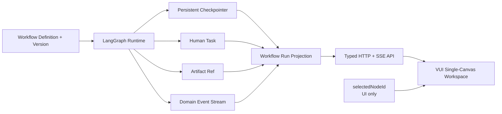

# ADR 0006 · 挑战杯科研工作流使用 LangGraph 运行权威与单画布三阶段投影

## Status

Accepted — 2026-08-07

## Context

挑战杯科研功能已经包含知识搜集、实验、迭代、组织拓扑、证据图和 Agent 绑定，但这些能力没有共享一个明确的工作流运行事实源。

当前实现存在两个关键问题：

1. `/api/research/flow-canvas` 的读取结果由科研组织图生成并锁定；
2. 节点执行接口读取另一份保存流程定义。

因此页面展示的节点与实际执行节点可能不属于同一张图。仅增加节点画布不能解决这个问题。

项目开发环境中已经存在 LangGraph 相关包，但仓库尚未将 LangGraph 声明为直接运行依赖，也没有形成 `StateGraph`、checkpointer、interrupt、thread 和 checkpoint lineage 的产品集成。

产品侧已经确认：

- 知识搜集、实验设计、执行迭代必须同处一个连续画布；
- 三个阶段必须在画布内明确分区；
- 第一版使用固定科研流程模板；
- 不开发自由低代码流程编辑器；
- 另一个开发 Agent 按本 ADR 和配套 PRD 实施。

## Decision

### 1. 一个运行事实源

系统新增明确的科研工作流领域，不再让 `ResearchFlowCanvas` 同时表示组织、流程定义和运行状态。

权威对象：

| 对象 | 职责 |
| --- | --- |
| `WorkflowDefinition` | 固定科研模板的规范化定义 |
| `WorkflowVersion` | 不可变定义版本及结构 hash |
| `WorkflowRun` | 一次完整科研运行 |
| `NodeRun` | 某节点在某 run 中的一次执行 |
| `CheckpointRef` | LangGraph checkpoint 与 run lineage |
| `HumanTask` | 持久人工等待与处理结果 |
| `ArtifactRef` | 输入、输出、证据和报告引用 |
| `AgentBinding` | 节点到稳定 Agent identity 的绑定 |

前端画布是这些对象的只读运行投影，不是第二写入者。



### 2. LangGraph 是运行引擎

仓库必须把 LangGraph 声明为直接依赖，并锁定兼容版本；不得依赖其他包的传递安装。

采用：

- `StateGraph` 表达固定科研拓扑；
- parent graph 表达三个宏阶段和阶段门禁；
- subgraph 表达各阶段内部节点；
- `thread_id` 绑定 `WorkflowRun`；
- persistent checkpointer 保存每个 super-step；
- `interrupt()` 表达人工确认；
- `Command(resume=...)` 恢复人工任务；
- checkpoint fork 表达重跑和时间回溯；
- stream modes `updates`、`tasks`、`checkpoints` 生成服务端运行事件。

不采用：

- 浏览器直接运行 LangGraph；
- 前端根据按钮点击自行推导下一个运行节点；
- 用本地 React state 代替 checkpoint；
- 修改历史 checkpoint 模拟“重试”；
- 运行时动态编辑固定拓扑。

### 3. 固定定义、可配置运行

v1 workflow topology 由代码拥有。

- 定义构建器生成规范化 JSON snapshot 和结构 hash；
- `WorkflowVersion` 记录代码版本、schema version 和定义 hash；
- 每次 run 保存其定义 snapshot；
- 用户可配置输入、运行参数、Agent 绑定和获准的门禁策略；
- 结构变更必须创建新 version；
- 历史 run 永远引用原 version。

这使第一版不需要通用流程编辑器，同时保证运行可追溯。

### 4. 三阶段与 subgraph

parent graph 包含三个阶段 subgraph：

```text
knowledge_collection
  -> knowledge_handoff
experiment_design
  -> smoke_gate
execution_iteration
  -> result_package
```

阶段 subgraph 默认使用 per-invocation persistence。需要跨节点共享的长期知识写入 Store/Artifact，不依赖 subgraph 私有 state 被父图隐式读取。

阶段门禁是显式节点，不用一条边上的 UI 文案代替。

### 5. 状态模型

#### WorkflowRun

```text
queued
running
waiting_human
succeeded
failed
cancelled
```

#### NodeRun

```text
pending
ready
running
waiting_human
succeeded
failed
blocked
skipped
stale
cancelled
```

`selectedNodeId` 不属于服务端运行状态，仅属于前端 UI state / URL。

运行当前节点由活跃 tasks 与最新 checkpoint 推导，并通过投影明确返回 `runtimeCurrentNodeIds`。允许并行节点，因此不能只保留单个 current node。

### 6. 持久化

桌面 v1 使用持久 SQLite checkpointer，放在活跃 operator workspace：

```text
%USERPROFILE%\Documents\Vibelution\data\research_workflows\checkpoints.sqlite
```

不得写入仓库、`web/localStorage` 或仅内存 saver。

存储要求：

- 原子事务；
- run / thread / checkpoint 索引；
- checkpoint retention policy；
- schema migration version；
- 进程重启后恢复；
- artifact 只保存引用，不把大 payload 塞入 checkpoint；
- 未来可替换 Postgres checkpointer，不改变服务和前端 DTO。

### 7. 人工中断

所有必须由人确认的步骤使用 `HumanTask` + LangGraph interrupt。

`HumanTask` 至少包含：

```text
taskId
workflowId
workflowVersionId
runId
threadId
checkpointId
nodeId
status
promptSchema
inputSnapshot
resolution
resolvedBy
resolvedAt
```

规则：

- 中断前的外部副作用必须幂等；
- 中断恢复不得重复写 Knowledge、实验记录或产物；
- 解决人工任务后只能恢复关联 checkpoint；
- 拒绝、修改、通过必须作为结构化 resolution 保存；
- 客户端断开不等于取消人工任务。

### 8. 事件与命令

采用 **SSE 下行事件 + HTTP POST 命令**。

理由：

- 当前产品已有 HTTP/SSE 使用经验；
- 运行事件主要是服务端单向推送；
- 命令需要显式鉴权、幂等键和审计；
- 不需要为了 v1 引入双向 WebSocket 协议。

事件 envelope：

```json
{
  "eventId": "evt-...",
  "sequence": 42,
  "workflowId": "challenge-cup-research",
  "workflowVersionId": "wf-v1-...",
  "runId": "run-...",
  "threadId": "thread-...",
  "checkpointId": "checkpoint-...",
  "nodeId": "protocol_review",
  "nodeRunId": "node-run-...",
  "type": "node.waiting_human",
  "occurredAt": "2026-08-07T00:00:00Z",
  "summary": {},
  "artifactRefs": []
}
```

SSE 必须支持：

- 单调 `sequence`；
- `Last-Event-ID` 恢复；
- 断线后 snapshot + delta；
- 重复事件幂等；
- 有界 summary；
- 不传 secrets、完整 Prompt 或无界节点输出。

### 9. API 边界

推荐 API：

```text
GET  /api/research/workflows/{workflowId}/definition
GET  /api/research/workflows/{workflowId}/versions
GET  /api/research/workflows/{workflowId}/runs
POST /api/research/workflows/{workflowId}/runs

GET  /api/research/workflow-runs/{runId}
GET  /api/research/workflow-runs/{runId}/events
POST /api/research/workflow-runs/{runId}/commands
GET  /api/research/workflow-runs/{runId}/nodes/{nodeId}

GET  /api/research/workflow-runs/{runId}/human-tasks
POST /api/research/workflow-runs/{runId}/human-tasks/{taskId}/resolve

GET  /api/research/workflows/{workflowId}/agent-bindings
PUT  /api/research/workflows/{workflowId}/agent-bindings
```

命令例：

```text
start
cancel
retry_node
fork_from_checkpoint
```

暂停/恢复只有在 LangGraph 运行语义和 checkpointer 能可靠支持时开放；不能只切一个 UI 状态。

Route 保持薄层，DTO 明确，业务落入 service/pack。旧 `/research/flow-canvas` 仅保留兼容适配，不能继续作为新运行写入口。

### 10. 后端落点

推荐职责边界：

```text
core/research/workflow/
├── models.py                 # 领域对象与枚举
├── definition.py             # 固定模板与版本 hash
├── graph_builder.py          # StateGraph / subgraphs
├── checkpoint_store.py       # checkpointer adapter
├── runtime.py                # invoke / resume / fork
├── events.py                 # LangGraph event -> domain event
├── human_tasks.py            # interrupt / resolution
├── artifacts.py              # ArtifactRef
└── projection.py             # API read model

core/web/services/team_workflow/research_runtime/
├── service.py                # web facade
├── commands.py               # command validation
├── queries.py                # run/node projections
└── migration.py              # legacy adapter

core/web/routes/team_workflows/
└── research_runtime.py       # thin HTTP/SSE routes
```

一个文件持有一个独立职责；不得把 graph builder、持久化、命令、投影和 HTTP route 堆入同一 service 巨石。

最终落点须先对照 `core/web/services/README.md` 和 `team_workflow/README.md`；若已有等价 pack，应扩展现有 owner，而不是建立平行 facade。

### 11. 前端渲染

采用 `@xyflow/react` 作为画布内核，但只允许在 VUI renderer 中引用。

```text
web/src/components/vui/
├── VWorkflowCanvas.tsx
├── renderers/shadcn/
│   ├── ShadcnWorkflowCanvas.tsx
│   ├── WorkflowStageRegionNode.tsx
│   ├── WorkflowTaskNode.tsx
│   └── workflowCanvasLayout.ts
└── designs/
    └── product/workflow.md
```

业务层：

```text
web/src/routes/teams/research-workflow/
├── ResearchProcessWorkspace.tsx
├── ResearchProcessCanvas.tsx
├── ResearchProcessNodeInspector.tsx
├── ResearchRunSwitcher.tsx
├── ResearchRunTimeline.tsx
├── researchProcessGraphModel.ts
├── researchProcessNavigation.ts
└── useResearchWorkflowRun.ts
```

API：

```text
web/src/api/researchWorkflow.ts
web/src/api/types/researchWorkflow.ts
```

规则：

- Route 只导入 VUI 产品 API；
- React Flow node/edge renderer 不进入业务路由；
- `StageRegion` 使用 React Flow parent/group node 形成三阶段分割；
- v1 固定模板使用确定性布局，不引入 ELK；
- 后续只有动态复合图确有需要时才评估 `elkjs`；
- selection/viewport 可由前端 store 持有，运行状态必须来自服务端查询/SSE；
- 每个业务组件和模型文件保持单一职责。

### 12. 三阶段画布投影

画布投影同时返回 definition 与 run overlay：

```ts
type WorkflowCanvasProjection = {
  definition: {
    workflowId: string;
    workflowVersionId: string;
    stages: WorkflowStageSpec[];
    nodes: WorkflowNodeSpec[];
    edges: WorkflowEdgeSpec[];
  };
  run: {
    runId: string | null;
    status: WorkflowRunStatus | null;
    runtimeCurrentNodeIds: string[];
    nodeRuns: Record<string, WorkflowNodeRunProjection>;
    pendingHumanTasks: HumanTaskSummary[];
  };
};
```

`StageRegion` 只做视觉和导航分组，不成为新的运行状态层。

### 13. 重试、恢复与 fork

- `retry_node` 创建新的 `NodeRun`，保留原失败记录；
- 从历史 checkpoint 重跑必须创建 fork lineage；
- 不修改已完成 run 的历史事件；
- 外部副作用使用 idempotency key，至少包含 `runId + nodeId + attempt`；
- pending writes 和 checkpoint 一起用于故障恢复；
- 失败恢复后前端通过 snapshot 校准，不自行拼接缺失状态。

### 14. 安全与内容边界

- 导入资料、网页、PDF 和知识文本仍是不可信输入；
- Prompt、节点输入和 artifact 进入模型前执行来源、隔离和清洗；
- SSE 和日志不输出完整 Prompt、凭据或大对象；
- Agent binding 必须使用稳定 identity，不用显示名授权；
- 命令进行 team/run 权限检查；
- 人工任务 resolution 记录操作者与时间；
- 若实现引入后台子进程，必须使用项目无控制台 helper / `CREATE_NO_WINDOW`。

### 15. 迁移

迁移遵循 expand-and-contract：

1. 新领域模型和持久化并存，不改旧入口。
2. 建立 LangGraph 最小垂直切片和新 API。
3. 新 VUI 画布只读消费新 projection。
4. 现有知识、实验、迭代操作通过适配器挂载到 NodeInspector。
5. 旧深链 redirect 到 workflow 壳。
6. 停止旧 flow canvas 执行写入。
7. 观察无 legacy writer 后删除重复执行模型。

迁移不得删除现有组织配置、证据、Knowledge Package、协议或历史运行数据。

### 16. Consequences

正向结果：

- 前端图与真实运行图一致；
- 三个阶段可同时理解和操作；
- refresh/restart/HITL/retry 有明确语义；
- 历史可追溯；
- UI 不再用路由和本地状态模拟工作流；
- 固定模板避免第一版低代码编辑器复杂度。

成本：

- 需要新增直接依赖和 checkpoint migration；
- 后端不再是“零 API 改动”；
- 必须拆分现有 flow canvas 的组织与执行职责；
- 旧阶段页面需要逐步适配；
- 开发 Agent 必须同时验证运行时、API、VUI 和真实浏览器。

### 17. Rejected Alternatives

#### 只改前端横向阶段卡

拒绝。无法解决展示图与执行图分裂，也不支持 checkpoint、人工中断和历史。

#### 继续扩展自研 SVG 画布

拒绝。现有 route 已混合几何、编辑、历史、模板、验证和业务，继续扩展会扩大结构债。

#### 第一版做完整低代码编辑器

拒绝。会同时引入 schema editor、图验证、动态执行、安全和迁移问题，阻塞科研闭环本身。

#### 三个独立画布或三个 Tab

拒绝。破坏用户明确要求的三阶段同时可见和连续关系。

#### 前端直接读取 LangGraph checkpoint

拒绝。泄露运行内部结构并绕过 service、权限、投影和兼容边界。

## Research Basis

| 项目 | 采用方式 | 一手资料 |
| --- | --- | --- |
| LangGraph / Studio | 复用运行、checkpoint、interrupt、thread、fork 和 streaming 模型 | [Studio](https://docs.langchain.com/langsmith/use-studio) · [Persistence](https://docs.langchain.com/oss/python/langgraph/persistence) · [Interrupts](https://docs.langchain.com/oss/python/langgraph/interrupts) · [Subgraphs](https://docs.langchain.com/oss/python/langgraph/use-subgraphs) · [Streaming](https://docs.langchain.com/oss/python/langgraph/streaming) |
| React Flow | 复用画布、节点、边、viewport、键盘与可访问能力；经 VUI renderer 隔离 | [React Flow API](https://reactflow.dev/api-reference/react-flow) · [Layouting](https://reactflow.dev/learn/layouting/layouting) |
| Galaxy | 仅参考科研 workflow definition、invocation、step status 和可复现报告 | [Galaxy Workflows](https://docs.galaxyproject.org/en/latest/get-started/explore-workflows.html) · [Galaxy repository](https://github.com/galaxyproject/galaxy) |
| Dify | 仅参考 Workflow、WorkflowRun、NodeExecution 分层和 HITL | [Dify workflow model](https://github.com/langgenius/dify/blob/main/api/models/workflow.py) · [Dify repository](https://github.com/langgenius/dify) |
| n8n | 仅参考历史 execution、等待状态、部分重跑和运行数据映射 | [n8n executions](https://docs.n8n.io/workflows/executions/) · [n8n repository](https://github.com/n8n-io/n8n) |

Dify、n8n、Galaxy 和 Argo 等成熟系统不作为 v1 代码依赖；只吸收产品与运行模型，避免把其授权、部署和平台复杂度带入 Vibelution。

## Related

- [挑战杯科研流程单画布 PRD](../prds/2026-08-07-research-process-flow-single-page-workspace.md)
- [ADR 0004 · VUI + shadcn/Radix](0004-product-ui-uses-vui-shadcn-only.md)
- [Teams owning map](../../web/src/routes/teams/README.md)
- [VUI implementation map](../../web/src/components/vui/README.md)
