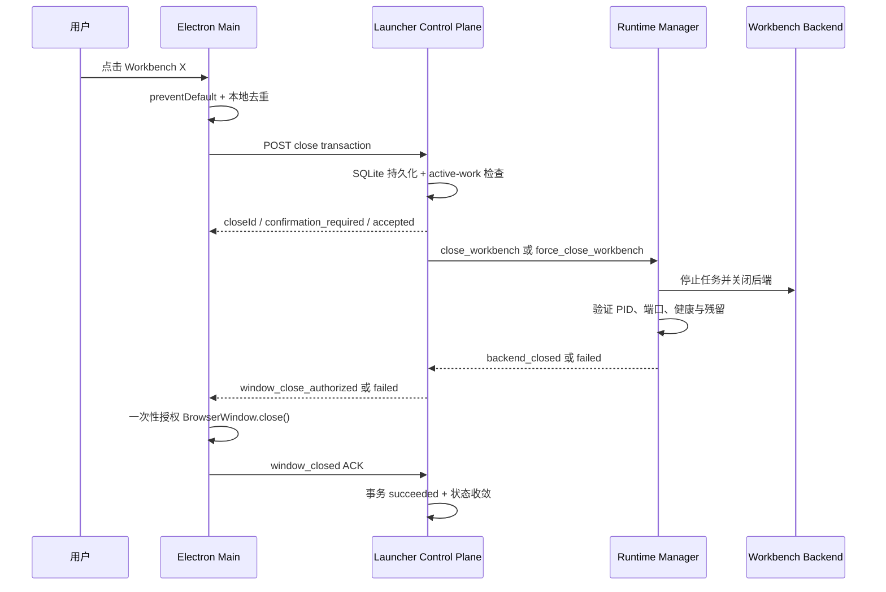

# Electron Workbench 事务式协同关闭实施规划

> Status: **Proposed / ALIGNMENT_PENDING**
> Created: 2026-08-10
> Baseline: `main@8d2ec48eeb8b827be674d12d6e2aef5d52c7eb4d`
> Scope: Electron Workbench 窗口关闭、Launcher 生命周期事务、Runtime Manager 后端收口、Edge App 兼容回退
> Authority: 本文是 dated implementation plan，属于历史/执行材料，不覆盖 `AGENTS.md`、`docs/standards/`、ADR、模块 README 或用户后续明确决定。
> Close condition: 四项产品行为完成用户校准，Critical Path 全部实现、测试、打包和 Windows 真实验收通过后，将状态改为 `Completed`；若取消或被新 ADR 取代，则改为 `Superseded` 并记录替代文档。

## 1. 背景与问题定义

当前仓库已经具备完整 Electron 桌面壳：

- `desktop/electron/` 包含 `BrowserWindow`、preload、IPC、桌面会话、Launcher 服务监督和 shutdown coordinator；
- `core/launcher/lifecycle_intent_store.py` 已提供 SQLite/WAL 生命周期意图、幂等键和 desktop action 租约；
- `core/runtime_manager/` 已提供持久命令队列、active-work guard、进程清理、PID/端口验证、失败恢复与 runtime-scene；
- `core/launcher/desktop_session_store.py` 已能投影 Electron launcher/workbench 窗口状态。

但正式运行链路仍使用 `windowProvider=edge_app`。当前 Edge App 的 Workbench X 只能依赖浏览器 `beforeunload/pagehide` 发起 `keepalive` 请求：窗口可在请求成功入队前退出，因而只能提供最终一致的尽力关闭，不能保证关闭意图已持久化。

Electron 工程也尚未完整接管 Workbench X：

- Launcher 窗口 `close` 已进入原生 shutdown flow；
- Workbench `BrowserWindow.close()` 仍直接关闭并上报状态；
- Workbench X 没有 `preventDefault -> 后端收口 -> 授权关窗` 的协调器；
- 现有 Electron 打包产物早于当前源码，不能作为发布验收证据。

因此本计划的目标不是宣称跨进程“同一时刻原子退出”，而是建立可证明的事务式协同关闭：

> 用户点击 X 后，要么窗口继续保持打开并明确提示阻塞/失败；要么关闭事务已经持久化，Runtime Manager 必须把 Workbench 后端与 Electron 窗口收敛到一致关闭状态，不能静默留下孤儿后端。

## 2. 待校准产品决策

以下是推荐默认值。本文落盘不等于用户已冻结这些行为；实施写入前必须取得“按推荐”或逐项纠正。

| 决策 | 推荐默认 | 行为差异 | 错判影响 |
| --- | --- | --- | --- |
| Workbench X 的关闭范围 | 关闭 Workbench 窗口与 8002 后端；保留 Launcher 控制面和 Runtime Manager daemon | 重新打开速度快，托盘仍可管理项目 | 若用户期望退出整个产品，会觉得后台仍有进程 |
| 有 active work 时 | 默认取消关闭；用户明确选择“停止任务并关闭”后才走 force | 防止误杀长任务，同时保留显式强制出口 | 若默认强杀，会造成任务和证据丢失 |
| 后端收口失败时 | 窗口保持打开，展示失败原因与重试入口 | 失败可见、可恢复，不制造孤儿后端 | 若窗口仍关闭，用户无法区分成功与残留 |
| 默认 provider 迁移 | Electron canary 验收后再替换 Edge App；Edge fallback 保留一个版本 | 可回滚、降低桌面发布风险 | 直接全量切换会把打包/协议问题放大到全部用户 |

## 3. 目标、非目标与成功定义

### 3.1 目标

1. Electron 原生层接管 Workbench 窗口 X。
2. X 关闭必须先获得 Launcher 持久化 ACK，窗口不得先消失。
3. Launcher 作为关闭事务协调者；Runtime Manager 继续作为后端生命周期和进程验证权威。
4. 无 active work 时完成 normal close；用户确认后允许 force close。
5. 后端关闭、窗口关闭和最终状态都有可恢复、可审计的证据。
6. Electron、Launcher、Runtime Manager、Workbench backend 的后台路径全程无可见控制台。
7. Edge App 保留显式 degraded fallback，且不与 Electron 双写关闭状态。

### 3.2 非目标

- 不把 Workbench X 等同于退出整个 Vibelution Desktop Shell。
- 不关闭 Launcher 控制面或 Runtime Manager daemon，除非用户走独立的“退出 Vibelution”动作。
- 不修改 Chat、Teams、Agent 的业务终态协议。
- 不把前端 projection 变成第二个生命周期写入者。
- 不依赖 Workbench 8002 API 承载自身关闭事务。
- 不承诺跨进程物理同时退出；承诺的是持久化、幂等、可恢复和最终一致。

### 3.3 成功定义

关闭操作必须满足：

1. **Durable-before-disappear**：Electron Workbench 窗口消失前，Launcher 已返回持久化关闭事务 ID。
2. **At-most-once intent**：重复 X 复用同一 `idempotencyKey/closeId`。
3. **Authoritative active-work decision**：Launcher 与 Runtime Manager 都执行 active-work guard；normal close 不静默越权。
4. **Verified backend close**：后端 PID、8002 端口、健康探针和残留进程均证明已关闭。
5. **Window-last commit**：后端收口成功后，Electron 才获得窗口关闭授权。
6. **Terminal evidence**：只有后端关闭和窗口 ACK 都完成，事务才进入 `succeeded`。
7. **Fail visible**：任一阶段失败时窗口保持或状态可恢复，且 runtime-scene 有明确错误。

## 4. 推荐架构



### 4.1 权威边界

| 组件 | 唯一职责 |
| --- | --- |
| Electron Main | 原生 X 拦截、原生确认、轮询事务、获得授权后关窗、窗口 ACK |
| Launcher | 控制令牌、关闭事务持久化、幂等、active-work 首检、Runtime Manager dispatch、最终事务协调 |
| Runtime Manager | active-work 复检、normal/force 语义、后端/任务停止、进程和端口验证、结果文件 |
| Workbench Web | 展示生命周期状态；Electron 下不发起浏览器卸载关闭请求 |
| Desktop session store | Electron 窗口事实、heartbeat/lease、window closed 证据 |

## 5. 持久化事务与 API 契约

### 5.1 存储复用

复用 `.runtime/launcher/lifecycle.sqlite3` 和现有 WAL、busy timeout、幂等约束。不得新建第二个生命周期状态数据库。

推荐给 `lifecycle_intents` 增加 additive 字段，或增加同库关联表；不删除、不重命名现有字段。关闭事务至少包含：

```text
closeId / intentId
desktopSessionId
idempotencyKey
mode: normal | force
phase
commandId
activeWorkCount
requestedAt
backendClosedAt
windowClosedAt
failureCode
failureMessage
resultJson
```

推荐 phase：

```text
requested
confirmation_required
backend_closing
window_close_authorized
window_closing
succeeded
failed
superseded
```

终态仍是：

```text
succeeded | failed | superseded
```

### 5.2 Capability 与协议版本

新增 Bootstrap capability：

```text
workbench_close.transaction.v1
```

Electron 启动时必须检查 capability：

- capability 存在：启用原生事务式 Workbench X；
- capability 缺失：禁止假装成功，保留窗口并给出协议不兼容提示；
- Edge fallback 由 Launcher 明确切换，不由 Workbench 静默决定。

### 5.3 内部控制面接口

接口部署在 Launcher control origin（默认 8765），使用 `X-Vibelution-Control-Token`：

```http
POST /api/launcher/workbench-close-transactions
GET  /api/launcher/workbench-close-transactions/{closeId}
POST /api/launcher/workbench-close-transactions/{closeId}/window-closed
```

创建请求建议形状：

```json
{
  "desktopSessionId": "desktop-session-id",
  "idempotencyKey": "desktop-session-id:workbench-window-id:close-generation",
  "mode": "normal",
  "reason": "electron_workbench_window_x"
}
```

响应建议形状：

```json
{
  "schemaVersion": 1,
  "closeId": "close-...",
  "phase": "backend_closing",
  "commandId": "cmd_...",
  "activeWorkCount": 0,
  "rejectionReason": "",
  "message": ""
}
```

约束：

- `normal` 遇 active work 返回 `confirmation_required`，不关闭窗口；
- 用户确认后提交 `force`，必须携带同一 close generation 的审计关联；
- 错误 `desktopSessionId`、过期 lease 或不匹配窗口 revision 必须 fail closed；
- GET 负责将 Runtime Manager command result reconcile 到事务 phase；
- `window-closed` 只能在 `window_close_authorized/window_closing` 阶段接受；
- 所有接口必须幂等，重复 ACK 不改变已成功结果。

## 6. Runtime Manager 改造

### 6.1 命令语义

保持现有命令名：

- `close_workbench`：normal close，受 active-work guard 保护；
- `force_close_workbench`：用户明确确认后的 force close。

增加内部参数：

```text
externalWindowOwner=electron
desktopSessionId=<id>
lifecycleIntentId=<id>
```

当 `externalWindowOwner=electron` 时：

1. Runtime Manager 只负责 Workbench backend、Chat/Room/Evolution active work 和仓库内残留进程；
2. Electron Supervisor、Launcher、Runtime Manager 自身 PID 必须进入保护集合；
3. Electron 窗口仍存活不能导致后端关闭阶段死锁；
4. command 成功表示 `backend_closed`，不表示整个关闭事务 `succeeded`；
5. Launcher 必须等待 Electron window ACK 才完成事务。

### 6.2 Normal/Force 竞态

Launcher 首检后仍可能启动新任务，因此 Runtime Manager 必须复检：

- normal 被新任务阻塞：command 返回结构化 `ActiveWorkBlocked`；Launcher 将事务置为 `confirmation_required`；Electron 保持窗口；
- force：标记被停止的 run/session，调用既有 force-stop 收口，禁止静默丢弃 active-work 证据。

### 6.3 后端关闭验证

至少验证：

- backend PID 不存活；
- 8002 端口无可信 owner；
- `/api/health` 不再可达；
- repo-owned residual process 列表为空；
- active work snapshots 已进入对应停止终态；
- Launcher/Runtime Manager/Electron Supervisor 保护 PID 仍存活。

### 6.4 状态收敛

阶段中：

```text
desiredState=closed
observedState=open|partial
phase=closing
```

后端关闭但窗口未 ACK：

```text
desiredState=closed
observedState=partial
phase=closing
closePhase=window_close_authorized
```

最终：

```text
desiredState=closed
observedState=closed
phase=steady
```

不得在后端刚关闭时提前清掉 desktop window 事实，也不得用前端 optimistic projection 覆盖 Runtime Manager 结果。

## 7. Electron Workbench Close Coordinator

建议新增：

```text
desktop/electron/src/shutdown/workbenchCloseCoordinator.ts
```

### 7.1 Window provider 改造

`ElectronWindowProvider` 增加：

```text
shouldInterceptWorkbenchClose
onWorkbenchCloseRequest
approveWorkbenchCloseOnce
isWorkbenchCloseInFlight
```

Workbench `close` 事件流程：

1. 未获得一次性授权：`event.preventDefault()`；
2. 已有 in-flight close：不重复创建事务；
3. 启动 coordinator；
4. 只有收到 `window_close_authorized` 后设置一次性 bypass；
5. 再调用 `BrowserWindow.close()`；
6. `closed` 事件清空引用、上报 closed window state、发送最终 ACK。

Launcher 下发的 `close_workbench` desktop action 也必须使用同一授权机制，避免自拦截。

### 7.2 Active-work 原生确认

使用 Electron `dialog.showMessageBox`，默认安全按钮：

```text
继续运行（默认）
停止任务并关闭（破坏性）
```

第一版不增加“任务完成后自动关闭”，避免引入新的长期订阅和待关闭状态。

### 7.3 失败 UX

- Launcher 不可达、协议不兼容或事务持久化失败：窗口保持打开；
- 后端关闭失败：窗口保持打开，原生对话框提供“重试”与“取消”；
- 重试复用原 closeId 或显式 generation，不允许并发两个 close transaction；
- 关闭期间现有 Workbench runtime status 可展示 `closing`，但 Web 不写事务状态。

## 8. Web 与 Edge fallback 收敛

Electron 通过 preload 暴露 `window.vibelutionLauncher`。Web 侧维持以下边界：

- `useStableBeforeUnload` 在 Electron 下不注册浏览器 guard；
- Electron 下 `pagehide` 不发送 `stop/force-stop`；
- Edge App 下保留现有 `beforeunload/pagehide + keepalive` fallback；
- F5、Ctrl+R、chunk recovery 仍只刷新前端；
- Edge fallback 在文档和日志中标记为 degraded，不能宣称事务式关闭；
- AppShell 只读取 Launcher/Runtime Manager phase，不成为关闭 SSOT。

## 9. Provider、打包与迁移

### 9.1 当前事实

- `desktop/electron/desktop-entry-catalog.json` 已把 Electron 声明为 public product entry；
- 当前运行仍由 Edge App 提供窗口；
- 现有 `dist/desktop/win-unpacked/Vibelution.exe` 与 Electron `dist/main.js/preload.cjs` 早于当前源码，必须重新构建；
- 当前正式 Launcher/runtime refresh 仍服从 active-work guard。

### 9.2 迁移阶段

1. **Source gate**：协议和 Electron 单测通过，尚不改变默认入口。
2. **Unpacked canary**：构建最新 `win-unpacked/Vibelution.exe`，使用隔离 profile 执行 smoke。
3. **Developer canary**：在当前项目启用 Electron provider，Edge 仍可手动回退。
4. **Release candidate**：真实 X、active work、失败注入、无控制台、deep link、tray/launcher 回归全部通过。
5. **Default switch**：产品快捷方式切换至 Electron。
6. **Compatibility window**：Edge fallback 至少保留一个版本，再决定是否删除。

### 9.3 无控制台要求

Electron 启动 Python Launcher/Runtime Manager/Workbench backend 必须继续使用：

- `pythonw.exe`；
- `CREATE_NO_WINDOW` / `DETACHED_PROCESS` / `windowsHide` 等项目共享路径；
- 禁止裸 `cmd.exe`、PowerShell、npm script shell 作为产品后台入口；
- Electron 自身错误展示通过日志/窗口，不弹控制台。

## 10. 故障恢复矩阵

| 故障点 | 推荐恢复 |
| --- | --- |
| 事务持久化前 Launcher 不可用 | Electron 保持窗口，提示控制面不可用 |
| 事务已持久化、Electron renderer 崩溃 | Main process 继续协调；renderer 不拥有事务 |
| 事务已持久化、Electron Main 崩溃 | Runtime Manager 继续后端收口；desktop lease 过期后记录 `shell_lost_after_prepare` |
| 后端停止超时 | 事务 `failed`；窗口不关闭；允许 retry/force |
| 后端已关闭、窗口 ACK 丢失 | Electron Main 重试 ACK；Launcher结合 desktop session revision/lease 收敛 |
| Runtime Manager 重启 | 从 inbox/processing/results 和 lifecycle intent 恢复 |
| 重复 X | 返回同一 closeId，不重复停止任务 |
| normal close 与新任务竞态 | 转 `confirmation_required`，不得自动升级 force |
| close 与 reopen/restart 竞态 | 复用现有 supersede/deferred reopen 规则，单队列串行 |
| Electron provider 启动失败 | 明确降级并记录 runtime-scene；不得静默声称 Electron 已启用 |

## 11. 日志、指标与审计

新增或规范化事件：

```text
electron.workbench.close_requested
launcher.workbench_close.persisted
launcher.workbench_close.confirmation_required
runtime.workbench_backend_close.started
runtime.workbench_backend_close.succeeded
runtime.workbench_backend_close.failed
electron.workbench.close_authorized
electron.workbench.window_closed
launcher.workbench_close.completed
launcher.workbench_close.recovered
```

允许字段：

```text
closeId
commandId
desktopSessionId
mode
phase
activeWorkCount
backendPid
windowId
rendererProcessId
failureCode
timingsMs
```

禁止记录完整 Prompt、对话正文、工具参数、密钥或无界进程输出。

## 12. 验证矩阵

### 12.1 Launcher/Runtime Manager

- lifecycle intent/close transaction SQLite 幂等；
- wrong desktop session/revision fail closed；
- normal active-work 阻塞；
- force 只有显式确认路径可进入；
- command result reconcile 到正确 phase；
- protected PID 不会被 cleanup；
- 后端 PID/端口残留导致失败而非假成功；
- Runtime Manager 重启可恢复；
- close/reopen/restart supersede 保持现有语义。

### 12.2 Electron

- Workbench X 被 `preventDefault`；
- 空闲关闭只创建一次事务；
- active work 默认取消；
- force 需要用户显式选择；
- 后端失败时窗口保留；
- `window_close_authorized` 后只 bypass 一次；
- `closed` 后窗口状态与 ACK 顺序正确；
- Launcher window/app exit 既有流程不回归；
- capability 不匹配 fail closed；
- renderer crash 不丢 Main-process transaction。

### 12.3 Web/Edge fallback

- Electron 下不注册 browser beforeunload guard；
- Electron 下 pagehide 不提交 stop；
- Edge 下现有 close guard 保留；
- F5/Ctrl+R 不触发 Workbench shutdown；
- VUI contract、AppShell layout、TypeScript build 通过。

### 12.4 命令门禁

```text
desktop/electron: npm test
desktop/electron: npm run build
desktop/electron: npm run package:dir
web: focused Vitest
web: vuiShadcnRouteContract
web: vuiComponentDesignContract
web: npx tsc -b --pretty false
web: npm run build
backend: focused Pytest for launcher/runtime/web routes
Ruff fatal
git diff --check
claim-bound closeout
```

### 12.5 Windows 真实验收

必须使用当前 HEAD 构建的 Electron 包，不能用旧 dist：

1. 空闲点击 X：后端先验证关闭，窗口最后关闭；Launcher/Runtime Manager 保留。
2. active Chat 点击 X 后取消：任务、窗口、后端均继续。
3. active Chat 确认关闭：任务进入停止终态、后端关闭、窗口最后关闭。
4. 故意制造后端关闭失败：窗口不消失，显示错误。
5. 连续点击 X：只有一个 closeId/commandId。
6. 关闭过程中重启 Electron renderer：事务不丢失。
7. 最终 Launcher status 为 `desired=closed / observed=closed / phase=steady`。
8. 8002 无监听、无 repo-owned residual，Electron Launcher 窗口仍可重新打开 Workbench。
9. runtime/frontend commit 与待发布 HEAD 一致。
10. 全程无 `cmd.exe`、PowerShell、Windows Terminal、OpenConsole 弹窗。

## 13. 实施任务图

Critical Path：

```text
产品校准
  -> Task 1 协议与事务
  -> Task 2 Runtime Manager 收口
  -> Task 3 Electron 协调器
  -> Task 4 Web/Edge 收敛
  -> Task 5 打包迁移
  -> Task 6 Windows 真实验收与默认入口切换
```

### Task 1: Launcher 持久化关闭事务

- Owner/Boundary: `core/launcher/` + Launcher routes/contracts；不改 Electron UI。
- Dependency: 四项产品决策完成校准。
- Mode: BDD_TDD。
- Deliverable: capability、close transaction API、SQLite 幂等、phase reconcile、审计事件。
- Verification/Stop: wrong-session、active-work、重复提交、command success/failure/recovery 全部有契约测试；协议不明确时停止。

### Task 2: Runtime Manager Electron-owned-window 收口模式

- Owner/Boundary: `core/runtime_manager/`；不改 Launcher 前端。
- Dependency: Task 1 请求/结果契约冻结。
- Mode: BDD_TDD。
- Deliverable: backend-only close evidence、protected PID、normal/force、结果状态。
- Verification/Stop: 端口/PID/active work/残留/manager recovery 测试；任何可能终止 Electron Supervisor 的路径必须停止集成。

### Task 3: Electron Workbench 原生关闭协调器

- Owner/Boundary: `desktop/electron/src/windows|shutdown|process|protocol`。
- Dependency: Task 1/2 的 capability 和 phase 已冻结。
- Mode: BDD_TDD。
- Deliverable: X 拦截、原生确认、轮询、失败保窗、授权关窗、window ACK。
- Verification/Stop: Electron focused tests + build；窗口可在 durable ACK 前关闭时停止。

### Task 4: Web 与 Edge fallback 收敛

- Owner/Boundary: `web/src/app` + `web/src/api/launcher.ts`；不新增第二套 UI 组件。
- Dependency: Electron detection/capability 确定。
- Mode: SIMPLE，确定性回归补 focused test。
- Deliverable: Electron 不发 pagehide stop，Edge fallback 保留，刷新路径不回归。
- Verification/Stop: focused Vitest、VUI contracts、`tsc -b`、production build。

### Task 5: Electron 打包与 provider 灰度

- Owner/Boundary: `desktop/electron` packaging、desktop entry、Launcher provider 配置。
- Dependency: Task 1-4 全绿。
- Mode: BDD_TDD。
- Deliverable: 最新 unpacked 包、capability handshake、canary/fallback、无控制台。
- Verification/Stop: package smoke、deep link、single-instance、tray/launcher、Windows process inventory；旧 dist 不得进入验收。

### Task 6: 集成、故障注入和真实运行态验收

- Owner/Boundary: 单一 integration/main owner + Launcher runtime owner。
- Dependency: 所有实现任务 merge-ready，activeWork=0。
- Mode: SIMPLE integration with explicit acceptance ledger。
- Deliverable: 主线集成、Launcher 安全刷新、真实 X 矩阵、回滚验证、claim/worktree cleanup。
- Verification/Stop: source/runtime/frontend SHA、health、steady、browser-visible result、进程/端口/log 全部绑定同一版本；任一缺失不得切默认 provider。

### 13.1 并行边界

- Task 1 与 Task 2 共享协议/命令语义，先串行冻结；
- Task 3 与 Task 4 在协议冻结后可以使用独立 worktree 并行；
- Task 5 消费 Task 1-4 的产物；
- Task 6 必须单 owner 串行，禁止多个 Agent 同时刷新 Launcher 或写 main。

若用户授权实施阶段使用子 Agent：

- 主 owner 持有 Launcher/Runtime Manager 共享协议；
- `DeepSeek V4 Flash execution agent` 可在独立 worktree 实现 Electron-only Task 3；
- 普通 review Agent 可只读审查故障矩阵与测试覆盖；
- 所有 Agent 结果必须由主 owner 独立检查 diff 并重跑测试。

## 14. 发布、回滚与版本影响

### 14.1 发布门

- Electron protocol/capability version 更新；
- Desktop package 版本递增；
- 当前 HEAD 重建 Electron 包；
- canary 通过后才能切默认 provider；
- activeWork=0 才允许 Launcher refresh；
- 默认入口变更属于 release gate，不因源码合入自动生效。

### 14.2 回滚

1. provider 配置切回 `edge_app`；
2. 恢复上一版 Electron 产品目录/快捷方式；
3. 新 SQLite 字段仅 additive，不执行破坏性 down migration；
4. Edge `pagehide` fallback 保留至少一个版本；
5. 回滚前仍执行 active-work guard；
6. 回滚失败时保持 Launcher control plane 可用，不直接杀进程。

### 14.3 兼容策略

- 新 Electron + 旧 Launcher：capability 缺失，保留窗口并报协议不兼容；
- 旧 Electron + 新 Launcher：旧 desktop action 继续工作，不强制新事务协议；
- Electron 不可启动：Launcher 可明确提供 Edge fallback，但必须写 degraded runtime-scene；
- Web bundle 与 Electron preload 版本不匹配：fail closed，不启用事务关闭。

## 15. 预期文件影响面

实际实施前必须再次按当前 main/claim 校准，以下只是预计 owning surface：

```text
core/launcher/api_contract.py
core/launcher/lifecycle_intent_store.py
core/launcher/lifecycle_action_dispatcher.py
core/launcher/service.py
core/launcher/app.py
core/web/routes/launcher.py
core/runtime_manager/command_queue.py
core/runtime_manager/daemon.py
core/runtime_manager/process_inventory.py
core/runtime_manager/workbench_controller.py

desktop/electron/src/main.ts
desktop/electron/src/ipc.ts
desktop/electron/src/preload.ts
desktop/electron/src/windows/electronWindowProvider.ts
desktop/electron/src/shutdown/workbenchCloseCoordinator.ts
desktop/electron/src/process/launcherServiceClient.ts
desktop/electron/desktop-entry-catalog.json

web/src/app/AppShell.tsx
web/src/app/projectCloseGuard.ts
web/src/app/useStableBeforeUnload.ts
web/src/api/launcher.ts

tests/test_launcher_service.py
tests/test_web_runtime_routes.py
tests/test_runtime_manager.py
desktop/electron/tests/*close*.test.ts
desktop/electron/tests/windowProvider.test.ts
web/src/app/*.test.ts(x)
```

共享热文件必须由一个 owner 持有；发现 active claim 重叠时停止写入并协调，不得覆盖。

## 16. 完成检查表

只有全部满足才能把本计划改为 `Completed`：

- [ ] 四项产品决策获得用户明确校准；
- [ ] 关闭事务 capability/API/SQLite migration 完成；
- [ ] Runtime Manager normal/force/backend verification 完成；
- [ ] Electron Workbench X 原生拦截与 window-last commit 完成；
- [ ] Web Electron/Edge 双路径无双写；
- [ ] Electron tests/build/package 全绿；
- [ ] Launcher/runtime focused tests 全绿；
- [ ] Web focused/VUI/tsc/build 全绿；
- [ ] Windows 空闲、active cancel、active force、failure injection 验收通过；
- [ ] 无可见控制台；
- [ ] runtime/frontend/package SHA 与发布 HEAD 一致；
- [ ] Edge rollback 经过验证；
- [ ] main integration、claim release、worktree cleanup 完成；
- [ ] Launcher refresh 和 version impact 已记录。

## 17. 下一执行入口

实施前的自然闸门是产品行为校准。用户可回复：

```text
按推荐
```

或逐项纠正第 2 节。校准后，从 Task 1 建立新的实施 worktree/claim；本规划 worktree 不复用为实现 worktree。
