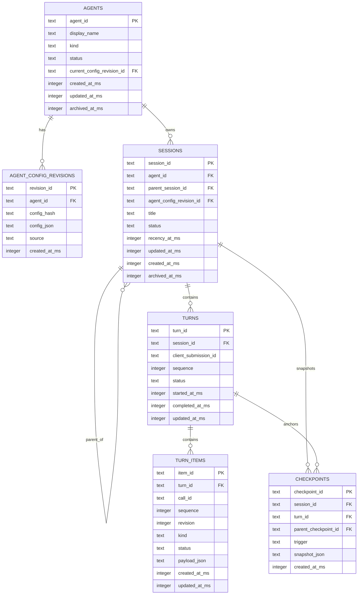

# Agent 配置与会话统一 SQLite 迁移方案（复用优先）

> Status: **Proposed / CALIBRATED**
> Created: 2026-08-11
> Baseline: `main@852d74af4ac81ac82289f090296ecb1852bdbe50`
> Scope: Agent 配置权威、会话父子关系、Turn/Item 持久化、前端状态边界、旧测试会话清理与可恢复切换
> User decisions: 旧 Agent 会话均为测试数据，不迁移；每个会话必须绑定一个 Agent 父节点；Agent 配置进入 SQLite；数据访问采用 DAO + Repository + Unit of Work；前端继续使用 React Query + Zustand；优先复用现有能力。
> Authority: 本文是 dated implementation plan，不覆盖 `AGENTS.md`、`docs/standards/`、ADR、模块 README 或用户后续明确决定。

## 1. 结论先行

本次不重写聊天系统，也不引入新的 ORM 或 Agent 框架。推荐目标是：

1. 将现有 `SessionCatalog` 从“JSON/JSONL 的目录索引”升级为 **Agent、配置、会话、Turn、TurnItem 的唯一 SQLite 权威库**。
2. 每条 `sessions.agent_id` 强制非空，前端目录固定为 `Agent -> Sessions`，不存在无父节点的裸会话。
3. Agent 配置使用不可变 revision；会话创建时冻结 `agent_config_revision_id`，后续修改 Agent 不改变历史会话的运行事实。
4. 继续复用 `SessionTurnItem v3`、现有稳定 ID、`assistant_delta` SSE 全量快照，不建立第二套消息/工具事件协议。
5. React Query 管服务端状态，Zustand 只管选择、标签、面板尺寸等本地工作台状态；禁止把会话正文复制到 Zustand 形成第二权威。
6. 旧测试会话不做内容迁移。切换时先做一次项目外只读备份，再清空旧索引与 journal；备份不进入产品目录、不被前端展示，只用于短期回滚。
7. 不使用 Drizzle，不引入 CrewAI Runtime，不复制 OpenCode/Codex/Grok 的整套实现；只复用许可证允许且与本项目契合的结构、协议和测试思想。

## 2. 当前问题与迁移目标

### 2.1 当前事实

- `core/chat/session_catalog.py` 已有 SQLite、WAL、`busy_timeout`、外键、迁移 checksum、lease 与目录索引，但正文权威仍散落在 JSON/JSONL。
- `sessions` 已包含 `agent_id`、`parent_session_id`、状态、journal 路径/大小/mtime 等字段，说明数据库目前更像 projection/catalog，而不是完整会话存储。
- Agent 配置仍分散在 `workspace/agents/agents.json`、`workspace/agent_config/mode_bindings.json`、`workspace/agent_config/prompt_templates.json` 等文件。
- `agent_config_authority.py` 已有 `configRevision/configHash`，可直接成为数据库 revision 身份。
- 前端已经使用 React Query 和 `chatWorkbenchStore.ts`（Zustand），无需增加另一套状态库。

### 2.2 目标

- 一个数据库事务可以原子写入：用户提交、Turn、TurnItem revision、会话活跃时间和 Agent 绑定。
- 目录查询不读取或扫描正文 journal；打开会话时才按游标读取 Turn/Item。
- SSE 中的运行态与最终数据库记录使用同一组 `turnId/itemId/callId/revision`。
- 进程异常退出后，通过 SQLite 中的 running Turn 和 checkpoint 恢复或明确标记 interrupted，不依赖前端猜测。
- Agent 删除采用 archive，不级联删除历史会话；配置更新产生新 revision，不原地改写历史快照。

### 2.3 非目标

- 不迁移旧测试会话内容。
- 不把 runtime-scene、运行日志或调试 trace 混入产品会话正文。
- 不改变现有公开 SSE event type，不新建第二个 EventSource。
- 不在第一阶段建设完整长期记忆/RAG 系统。
- 不让浏览器直接访问 SQLite，也不在 TypeScript 前端引入 Drizzle。

## 3. 成熟项目复用决策

| 来源 | 可吸收设计 | 在 Vibelution 中的落点 | 不采用的部分 |
| --- | --- | --- | --- |
| [OpenCode session schema](https://github.com/anomalyco/opencode/blob/dev/packages/opencode/src/session/session.sql.ts) | `Session -> Message -> Part` 的稳定关系层、父子 session、关系字段 + JSON payload、按父键/时间建索引 | 映射为 `Agent -> Session -> Turn -> TurnItem`；结构字段单列，provider 扩展进入有界 JSON | 不引入 Drizzle；不让 JSON payload 代替应有的外键、状态和顺序列 |
| [Codex app-server](https://github.com/openai/codex/blob/main/codex-rs/app-server/README.md) | `Thread -> Turn -> Item`、`clientUserMessageId/clientId`、item started/delta/completed、turn completed、resume/fork、cursor pagination、`recencyAt` 与 `updatedAt` 分离 | 直接对齐现有 TurnItem v3；新增 `client_submission_id` 唯一约束、`recency_at`、游标目录和明确 resume/fork | 不采用 SQLite + JSONL 双 canonical；JSONL 只可作为切换前只读遗留数据或运行日志 |
| [Grok Build](https://github.com/xai-org/grok-build) / [headless mode](https://github.com/xai-org/grok-build/blob/main/crates/codegen/xai-grok-pager/docs/user-guide/14-headless-mode.md) | session SQLite 与 memory/log/trace/worktree 分目录；显式 new/resume/continue/fork；稳定 `toolCallId` 和 `tool_call_update` | 数据目录按权威类型隔离；工具生命周期继续复用稳定 `callId/itemId/revision`；API 显式区分 resume/fork | 拒绝只读数据目录时静默进入 ephemeral session；Vibelution 必须 fail visible |
| [CrewAI memory](https://docs.crewai.com/en/concepts/memory) / [checkpointing](https://docs.crewai.com/en/concepts/checkpointing) | scope、来源/provenance、只读切片、写屏障、事件驱动 checkpoint、lineage、SQLite WAL、checkpoint 保留上限 | v1 先落 checkpoint/lineage；长期 memory 作为 v2 独立表与服务，保持 scope/source/private 边界 | 不引入 CrewAI Runtime；不在每个细粒度事件写完整 checkpoint |

### 3.1 直接复用（优先）

- `SessionCatalog` 的连接、WAL、外键、`busy_timeout`、schema migrations、checksum 和 lease 基础设施。
- `configRevision/configHash` 的配置身份算法。
- `SessionTurnItem v3`、稳定 `turnId/itemId/callId/revision/sequence` 和 `assistant_delta` 全量快照。
- React Query 的服务端查询、缓存失效和分页。
- Zustand 的活动 Agent、活动会话、标签页和布局持久化。
- 现有 runtime-scene 作为诊断证据，不作为产品数据源。

### 3.2 适配复用（借鉴契约，重写为项目代码）

- OpenCode 的稳定关系层与 JSON 扩展列。
- Codex 的 Turn/Item 生命周期、submission identity、recency 与 cursor pagination。
- Grok 的 session/memory/log/trace/worktree 分区和工具 update 语义。
- CrewAI 的 scope/provenance/checkpoint lineage 与有界保留。

### 3.3 明确拒绝

- SQLite 与 JSONL 同时作为会话正文权威。
- 文件写失败后静默继续为临时会话。
- Drizzle、Prisma 或另一套 TypeScript ORM。
- 将 CrewAI、OpenCode 或 Grok Build 作为运行时依赖。
- 用 Zustand 保存服务端会话正文、Agent 配置或 TurnItem canonical 副本。

## 4. 目标数据模型



### 4.1 关键约束

- `sessions.agent_id NOT NULL REFERENCES agents(agent_id)`。
- `sessions.agent_config_revision_id NOT NULL`，保证历史会话可解释。
- `UNIQUE(session_id, sequence)` 约束 Turn 顺序。
- `UNIQUE(session_id, client_submission_id)` 保证乐观提交、accepted 与最终写入幂等。
- `UNIQUE(turn_id, sequence)` 约束 Item 权威顺序。
- `revision >= 1`；相同 `item_id/call_id` 只能更新 revision，不能创建重复工具行。
- Agent archive 后历史 Session 仍可读取；禁止级联删除会话。
- `recency_at_ms` 仅在新 Turn 开始或用户明确 touch 时更新；后台索引、标题修复、状态对账只更新 `updated_at_ms`。

### 4.2 建议索引

```sql
CREATE INDEX idx_sessions_agent_recency
  ON sessions(agent_id, archived_at_ms, recency_at_ms DESC, session_id DESC);
CREATE INDEX idx_sessions_parent
  ON sessions(parent_session_id, recency_at_ms DESC);
CREATE INDEX idx_turns_session_sequence
  ON turns(session_id, sequence DESC);
CREATE UNIQUE INDEX idx_turns_submission
  ON turns(session_id, client_submission_id)
  WHERE client_submission_id IS NOT NULL;
CREATE INDEX idx_items_turn_sequence
  ON turn_items(turn_id, sequence ASC, revision DESC);
CREATE INDEX idx_items_call
  ON turn_items(turn_id, call_id)
  WHERE call_id IS NOT NULL;
```

结构化查询字段不得藏入 `payload_json`；provider/model usage、工具参数摘要、展示 metadata 等扩展内容才进入 JSON，并继续执行脱敏与长度上限。

## 5. 数据访问层

### 5.1 分层

| 层 | 责任 | 示例 |
| --- | --- | --- |
| DAO | 单表 SQL、row mapping、游标、批量 upsert | `AgentDao`、`SessionDao`、`TurnDao`、`TurnItemDao`、`CheckpointDao` |
| Repository | 领域聚合与不变量 | `AgentRepository.create_revision()`、`ConversationRepository.append_turn_snapshot()` |
| Unit of Work | 单事务协调、提交/回滚、after-commit publish | `ConversationUnitOfWork` |
| Service | 权限、业务流程、SSE、运行态协调 | 现有 session/agent services |

DAO 不得被 route 或 React 直接调用。Service 通过 Repository/UoW 完成业务写入；projection 只读，不成为第二写入者。

### 5.2 事务边界

一次用户提交至少在同一事务中完成：

1. 校验 Agent 与 frozen config revision；
2. 幂等创建或取得 Turn；
3. 写入 user Item 与初始 assistant/runtime Item；
4. 更新 session `recency_at_ms`；
5. commit 后才发布 accepted/SSE 通知。

工具开始、参数、成功/失败复用同一 `item_id/call_id`，每次 revision 在小事务中提交；发布发生在 commit 后，避免浏览器看到数据库中不存在的状态。

## 6. Agent 配置进入数据库

### 6.1 权威模型

- `agents` 保存稳定身份、显示名、类型、当前 revision 和 archive 状态。
- `agent_config_revisions` 保存不可变配置 JSON、`configHash`、来源和时间。
- 配置修改流程为：读取 current revision -> 校验 patch -> 生成 canonical JSON/hash -> 插入新 revision -> CAS 更新 `agents.current_config_revision_id`。
- 会话创建后绑定当时 revision；会话内切模型需要显式创建/选择新 revision，并记录切换发生的 Turn，禁止静默改写历史。

### 6.2 文件配置的处置

- 第一阶段提供只读 importer，把现有 Agent/模式/模板文件导入 SQLite。
- 切换后数据库成为唯一运行权威；文件只保留显式 export/backup 能力，不参与启动时双向合并。
- 若导入发现重复 Agent ID、无效模型或 hash 冲突，fail closed 并列出具体记录，不自动猜测。

## 7. 前端状态边界

### React Query：服务端状态

- Agent 目录与配置 revision；
- Session 游标页、Session detail、Turn/Item 页；
- mutation、失效、后台刷新和 reconnect 后 canonical refetch。

### Zustand：本地工作台状态

- 当前 Agent、当前 Session、打开的 tab；
- 分栏尺寸、展开/折叠、草稿和临时选择；
- 允许持久化 stable ID，不持久化服务端实体副本。

### SSE：运行增量

- 继续使用 `assistant_delta` 与 `SessionTurnItem v3`。
- SSE 更新 React Query 中当前 Session 的 transient view；terminal 后以数据库 detail 做一次 canonical reconcile。
- Zustand 不接管 SSE 内容，避免切换 Agent/Session 时出现旧内容覆盖新内容。

## 8. 读取与分页策略

- Agent 目录只查 `agents + session summary/count`，禁止 hydrate TurnItem。
- Session 列表使用 `(recency_at_ms, session_id)` 游标，不使用 offset 深分页。
- 打开 Session 默认加载最近 N 个 Turn；向上滚动再读取更早页。
- `updated_at_ms` 不参与用户可见排序，避免后台 projection/标题修复导致会话跳位。
- API DTO 维持清晰的 summary/detail 边界；列表不得携带无界 transcript。
- 目录空、DB 忙、schema 不兼容、文件只读均显示真实错误；禁止伪装成“暂无会话”或临时会话。

## 9. Checkpoint、resume、fork 与 memory

### 9.1 v1 checkpoint

- 默认只在 `turn_completed`、用户审批、显式 fork 前创建 checkpoint。
- checkpoint 包含 session/turn lineage、frozen config revision、必要运行摘要和 bounded snapshot。
- 每个 session 默认保留最近 20 个自动 checkpoint；用户命名 checkpoint 不自动删除。
- `resume` 继续同一 session；`fork` 创建新 session，填写 `parent_session_id` 与 `parent_checkpoint_id`。

### 9.2 v2 scoped memory（不阻塞本次迁移）

借鉴 CrewAI，但单独实施：

- scope 示例：`/agent/{agentId}`、`/team/{teamId}`、`/project/{projectId}`；
- 每条 memory 有 source、visibility、owner、revision 与删除语义；
- 只允许按授权 scope 读取子树；
- 写入采用异步队列时，关键读取前提供 drain/read barrier；
- memory 与 transcript 分表、分服务，禁止把会话数据库变成无界知识库。

## 10. 实施任务图

| 阶段 | 交付物 | 依赖 | 验证与停止条件 |
| --- | --- | --- | --- |
| T0 基线冻结 | 当前 schema/数据路径/接口/性能基线；旧会话清理清单 | 无 | `quick_check`、现有目录/打开会话基准；任何未知生产会话立即停止清理 |
| T1 SQLite 核心 | 复用 SessionCatalog 基础设施；新增表、索引、DAO、迁移 checksum | T0 | migration upgrade/downgrade、WAL 并发、锁超时、FK、checksum、损坏检测 |
| T2 Agent 配置权威 | Agent importer、不可变 revision、Repository/UoW、读写 API | T1 | hash/revision/CAS、重复 ID、无效模型、archive、历史 revision 测试 |
| T3 会话写入权威 | Session/Turn/TurnItem 原子写；稳定 submission/item/call identity；after-commit SSE | T1-T2 | crash/retry/同名工具/失败重试/重连/幂等/终态测试 |
| T4 查询与前端 | Agent 父节点目录、cursor pagination、detail lazy load、RQ/Zustand 边界 | T2-T3 | 目录不 hydrate 正文；切换无串线；重启后完整；VUI/Chat/build 门禁 |
| T5 切换与清理 | live authority 切为 SQLite；旧测试会话与 journal 清空；短期项目外备份 | T1-T4 | clean startup、UI 空目录、创建首个新会话、重启恢复、旧数据不再被扫描 |
| T6 checkpoint/fork | checkpoint lineage、resume/fork、保留策略 | T3-T5 | fork 不污染父会话；resume 接续正确 revision；恢复测试 |
| T7 scoped memory | 独立 ADR/计划后再实施 | T1-T6 | scope 隔离、provenance、删除、barrier、容量上限 |

T1-T5 是本次迁移的 Critical Path；T6 可紧随切换，T7 不得扩大本轮交付。

## 11. 切换步骤

1. 关闭新提交入口并确认 `activeWork=0`。
2. 校验当前数据库与配置文件可读；生成项目外、只读、带 SHA-256 的一次性回滚包。
3. 创建新 schema，导入 Agent 与 config revisions；不导入旧 Session/Turn 内容。
4. 清空旧测试 Session 索引和产品数据根下的 journal/派生索引。
5. 打开 SQLite canonical feature gate，关闭 legacy scan/write。
6. 创建一个临时 Agent 会话，执行 user -> reasoning -> tool -> assistant 完整回合。
7. 重启 Launcher，验证 Agent 父节点、Session、TurnItem、配置 revision 与排序全部恢复。
8. 删除临时验收会话；观察一个版本窗口后删除项目外回滚包。

切换后不保留双写。若验收失败，只能整体关闭新入口并恢复切换前数据库/配置包；不得一部分读 SQLite、一部分写 JSONL。

## 12. 性能与可观测性目标

以下是待实测的验收预算，不是当前性能结论：

- 1000 个 Session、50 个 Agent：目录查询本机 p95 <= 150 ms，且正文 hydrate 次数为 0。
- 打开最近 50 个 Turn：后端 p95 <= 200 ms；前端保持现有 skeleton/内容稳定策略。
- 一次 TurnItem revision 提交 p95 <= 30 ms（不含模型/工具执行）。
- SQLite busy 超时必须产生可诊断错误，不允许静默丢写或退化到内存会话。
- runtime-scene 记录 migration version、query class、rows、durationMs、busy/retry、checkpoint prune；不记录完整 Prompt/正文/secret。

## 13. 测试矩阵

### 后端

- 空库初始化、逐版本升级、checksum 不一致、只读目录、磁盘满/锁冲突。
- Agent import、config hash、CAS 冲突、archive、会话绑定 revision。
- `client_submission_id` 重试、Turn sequence、Item revision、同名并行工具、失败后重试。
- commit 前进程崩溃、commit 后 publish 失败、SSE 重连、terminal reconcile。
- cursor pagination、`recency_at` 不被后台更新污染、目录无正文 I/O。
- checkpoint retention、resume、fork lineage。

### 前端

- Agent -> Session 父子选择与刷新恢复。
- Session 列表分页、空态、错误态、DB busy/不可读真实呈现。
- React Query canonical reconcile；Zustand 仅保存 ID/布局。
- 多 Session 切换不串内容，terminal 后无重复 Item/运行灯。
- VUI contract、Chat/Agent layout、`npx tsc -b --pretty false`、production build。

### 真实运行验收

- 创建两个不同模型的 Agent，各运行一个多工具回合。
- 修改其中一个 Agent 配置，验证旧会话仍指向旧 revision，新会话使用新 revision。
- Launcher 重启后目录、会话内容、工具状态、模型头像和 revision 一致。
- `PRAGMA quick_check` 通过；浏览器 console 无 error/warn；active work 归零。

## 14. 完成定义

- SQLite 是 Agent、配置、Session、Turn、TurnItem 的唯一产品权威。
- 所有 Session 都有有效 `agent_id` 和 `agent_config_revision_id`。
- 旧测试会话不再出现在磁盘扫描、API、前端目录或恢复路径中。
- JSONL 只剩 runtime log/诊断用途，不参与产品会话读写。
- DAO/Repository/UoW 边界有契约测试，route 与 projection 不直接写表。
- React Query/Zustand/SSE 的责任不重叠。
- 性能预算、故障恢复、Launcher 重启与真实多 Agent 会话验收通过。
- 项目文档、ADR、数据目录说明与删除/备份运维说明同步更新。

## 15. 风险与控制

| 风险 | 控制 |
| --- | --- |
| 双写造成漂移 | 切换前可 shadow-read 对比，但禁止双 canonical；切换点一次完成 |
| 锁竞争拖慢对话 | 短事务、批量 DAO、commit 后 publish、busy 指标、列表查询索引 |
| Agent 配置更新污染历史 | immutable revision + Session FK 冻结 |
| 误删有价值会话 | T0 列出清理集；项目外 checksum 备份；只清用户已授权的测试会话 |
| JSON payload 重新变成垃圾桶 | 结构字段单列；payload schema/version/大小限制与脱敏测试 |
| 前端形成第二权威 | React Query 保存服务端实体；Zustand 只保存 UI ID 与布局 |
| checkpoint 写放大 | 只在 turn completed/审批/fork 写，有界保留 |
| 外部方案过度照搬 | 复用契约和测试思想；实现保持 Python backend 与现有 VUI/SSE 技术栈 |

## 16. 推荐的首个实现批次

第一批只做 T0-T1，不立刻清会话：

1. 给现有 `SessionCatalog` 增加 schema vNext 和迁移测试；
2. 落 `AgentDao/SessionDao/TurnDao/TurnItemDao`，但暂不切换正式读写；
3. 建立 1000 Session/50 Agent 的可重复性能 fixture；
4. 证明 WAL、FK、幂等和游标索引正确后，再开始 T2 配置导入。

这样能最大化复用，又把最高风险的“数据切换与清理”延后到基础设施被证明可靠之后。
