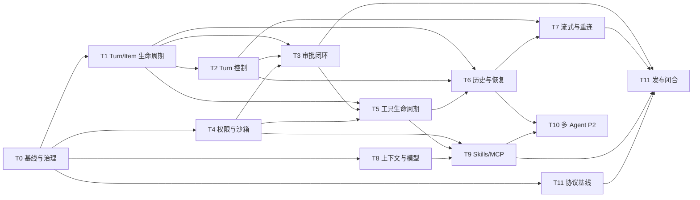

# 借鉴 Codex app-server 优秀设计的 Vibelution 内核改造规划

| 字段 | 值 |
| --- | --- |
| **Status** | `proposed`（参考设计与实施任务图；尚未授权实施） |
| **Created** | 2026-08-21 |
| **Decision** | `REFERENCE_ONLY + TASK_GRAPH` |
| **Priority** | P0：生命周期、安全、恢复、协议治理；P1：上下文、Skills/MCP；P2：多 Agent 设计验证 |
| **Vibelution baseline** | 本地 `main`：`a941edacf55bd0b3fad1bd936fbd4de06f449ae1` |
| **Codex source** | `openai/codex` `main` 快照：`536f86e5cc9ec1ff38457d099bf320b9d08eeeba` |
| **License** | Apache-2.0 |
| **Close when** | P0/P1 条目分别形成可审查实现或明确拒绝记录；现行架构文档与契约测试已更新；无第二套事实源、Turn 管线或流式连接 |

> **归档说明：** 本文是候选改造清单，不是现行规范、ADR 或已实现能力。实施时必须重新对照最新 `main`、当前 active claim 和上游 Codex 快照；权威顺序见 [ADR 0005](../../../adr/0005-docs-authority-and-archive-policy.md)。

---

## 1. 结论

可以借鉴，而且比直接引入 `app-server` 更适合 Vibelution。正确做法是吸收它已经验证过的**协议分层、Thread/Turn/Item 生命周期、审批闭环、权限配置、流式事件、恢复语义、生成式 Schema 与稳定/实验能力隔离**，再用 Vibelution 现有 Python/FastAPI/Electron/React 架构实现；不把 Codex Rust 内核、进程或传输层引入产品运行时。

本计划不替换 Vibelution 内核。Vibelution 已经有自己的 Agent、进化、团队、知识、工具、Launcher 与会话事实源；真正需要做的是把现有能力进一步收敛成可证明的契约，消除状态漂移和边界含糊。

### 1.1 借鉴优先级裁决

| 排名 | Codex app-server 设计 | 项目贴合度 | Vibelution 处理方式 |
| ---: | --- | --- | --- |
| 1 | Thread → Turn → Item 三层生命周期与类型化通知 | 极高 | 映射到现有 Session/Turn/`SessionTurnItem`，补齐单一状态机与终态约束 |
| 2 | 中断请求与最终 `turn/completed(status=interrupted)` 分离 | 极高 | 停止接口只代表受理；最终以 journal/detail 终态为准 |
| 3 | 审批请求/响应关联、过期与拒绝语义 | 极高 | 加固现有 `requestId`、`turnId`、`callId`、指纹、配置修订与 pending 恢复 |
| 4 | 权限 profile 高层选择，服务端解析实际沙箱/授权 | 极高 | 保留 Vibelution permission preset，服务端生成每 Turn 不可变有效快照 |
| 5 | 类型化事件、序号、恢复读取与有界背压 | 极高 | 继续使用现有 SSE；强化 `ledgerSeq`、缺口校准、队列优先级与重连 |
| 6 | 生成 TypeScript/JSON Schema、稳定/实验 API 隔离 | 高 | 以 Vibelution DTO 为源生成或校验前端契约，实验字段默认不进入稳定面 |
| 7 | Tool item 的 started/delta/completed 与稳定 call identity | 高 | 收敛工具生命周期，保证每个 started 恰好一个可解释终态 |
| 8 | Skills/MCP 的发现、读取、调用、启动状态和重认证诊断 | 中高 | 对齐现有 Skills 与受管 MCP 网关，不新增插件运行时 |
| 9 | 分页历史、fork/resume 与投影重建 | 中 | 只借恢复/投影原则；保留 `turn_journal.jsonl`，不迁移到 Codex 存储 |
| 10 | 子 Agent lineage 与状态通知 | 中低 / P2 | 只做与 Team/Session ACL 对齐的设计实验，不进入生产关键路径 |
| 11 | Realtime、Apps、Project API、remote control、unsandboxed process | 低或风险高 | 本轮拒绝；有独立产品需求时重新立项 |

---

## 2. 目标与非目标

### 2.1 目标

- 让一个会话 Turn 从接收、执行、审批、工具调用、中断到终态只有一套可验证状态语义。
- 让 `SessionTurnItem` 成为文本、推理、工具、重试、状态和错误的统一 UI 投影，不让顶层兼容字段反向成为事实源。
- 让审批和权限决策绑定准确的 Session/Turn/Tool/配置快照，过期或错配时 fail-closed。
- 让 SSE 断线、切换会话、丢序和服务重启后都能由权威 snapshot/journal 校准。
- 让后端 DTO、前端类型、事件 fixture 与兼容策略由机器验证。
- 让 Skills/MCP 复用同一工具生命周期、审批与诊断语义。
- 在不复制内核的前提下，保留上游来源、版本和许可证追溯。

### 2.2 非目标

- 不把 `codex app-server` 二进制、Rust crate、stdio/WebSocket server 作为 Vibelution 运行时依赖。
- 不复制 Codex Rust 内核，不照搬其线程存储、认证、账号、限流或远端控制实现。
- 不建立第二套 Session/Turn worker、第二份 Turn journal、第二个 Item store 或第二条提交路径。
- 不以 SQLite 替换 `turn_journal.jsonl` 的 transcript/replay 权威；SQLite 继续只承担现行会话目录与控制态职责。
- 不建立第二个 `EventSource`、WebSocket 或 JSON-RPC 通道与现有会话 SSE 竞争。
- 不让前端直接决定有效权限、审批政策或沙箱边界。
- 不新增裸 `process/spawn`、无沙箱命令接口或能弹出 Windows 控制台的后台进程路径。
- 不把实验性 Multi-Agent、Plugins、Apps、Realtime 或 remote control 放进生产 Critical Path。
- 不借计划之名修改业务代码；每个实施任务仍需独立对齐、调研、claim、测试与验收。

---

## 3. 当前权威与保护边界

实施前必须以 [对话链路地图](../../../agents/conversation-flow-map.md) 和实际代码为准，不能因为 Codex 的命名更完整就覆盖 Vibelution 已锁定的事实源。

| 领域 | 当前 Vibelution 权威 | 允许的借鉴 | 禁止产生的第二权威 |
| --- | --- | --- | --- |
| 会话目录、归档、父子、recency、控制态 | `workspace/chat/conversations.sqlite3` + `ConversationStore` | 更明确的 Thread 状态与分页契约 | 独立 Codex thread DB/索引 |
| Turn transcript/replay | `turn_journal.jsonl` + `core/chat/turn_journal.py` | Turn/Item 事件分类、终态不变量、恢复规则 | 另一个 event log 或把 SSE 当事实源 |
| UI Turn 主包 | `SessionTurnItem[]` | 更完整的 Item 类型、状态与 revision 语义 | `content`、timeline、transcript 反向写主包 |
| 运行中输出 | `SessionLiveOutputState` + live checkpoint | started/delta/completed 生命周期和重连校准 | 长期并行 live store |
| 传输顺序 | session ledger `ledgerSeq` | 明确 envelope、缺口检测和背压策略 | 第二套 sequence 或无序 UI 合并 |
| 会话事件传输 | `/api/sessions/{id}/events` SSE | 类型化通知、订阅与恢复原则 | 新 EventSource/WebSocket/JSON-RPC |
| 最终回答 | journal 的 committed assistant item/final answer | Item 终态与一次性 settle | delta 或前端 cache 变成最终真相 |
| 当前页面/会话 | committed React Router URL | 无 | 后端 pointer、事件或重连触发导航 |
| 工具审批 | `core/web/services/session/tool_approvals.py` | 请求/响应、指纹、过期、恢复闭环 | UI 本地 grant 或绕过政策的快捷路径 |
| Agent/Session/Knowledge 操作 | [项目操作目录](../../../agents/project-operation-catalog.md) 中的受管入口 | 统一权限/审批 envelope | 裸存储写入或自造生命周期工具 |
| MCP 外部 Agent | [受管 Agent 网关](../../../agents/mcp-managed-agent-gateway.md) | 启动状态、认证诊断、统一 Tool Item | 第二个不受管 MCP 执行器 |

### 3.1 首批 owning surfaces

以下是实施时优先核验的候选落点，不是预先授权的修改清单：

- 后端入口：`core/web/routes/sessions.py`、`core/web/services/session_service.py`。
- Turn 生命周期：`core/web/services/session/{submit,schedule,worker,control,persist}.py`。
- 事件与流：`core/web/services/session/{events,publish,stream_capture,live_output,live_output_write}.py`。
- 事实源与投影：`core/chat/turn_journal.py`、`core/web/services/session/{journal_bridge,projection,projection_codex_transcript}.py`。
- 审批：`core/web/services/session/tool_approvals.py`。
- 前端契约：`web/src/api/types/chat.ts`、`web/src/api/chat.ts`。
- 前端流式与控制：`web/src/routes/chat/useSessionDetailStream.ts`、`chatSessionStreamConnect.ts`、`chatActiveTurnLayer.ts`、`chatStopTurnModel.ts`、`useChatToolApprovalBridge.ts`。
- UI 主投影：`web/src/routes/ConversationView.tsx` 及 `web/src/routes/chat/` 下的相关 view-model。

---

## 4. 统一设计原则

1. **适配，不移植。** 先写 Vibelution 契约，再用 Codex 作为反例和成熟实现对照。
2. **一条主链。** 所有增强都进入现有 submit → worker → journal/live → SSE → projection 链路。
3. **事实与传输分离。** journal/SQLite 是事实；SSE、cache、live overlay 是可丢失投影。
4. **终态由事实确认。** HTTP 202、停止按钮点击、审批响应或工具 callback 都不是 Turn 最终完成证据。
5. **服务端裁决。** 模型、权限、审批、Skills、MCP 和上下文的 effective settings 由服务端解析并记录。
6. **稳定与实验隔离。** 实验字段必须显式能力协商或内部开关，默认不进入稳定 DTO。
7. **兼容只读、单向投影。** 允许旧字段被读取或从新主包生成，禁止双写与双向同步。
8. **有界与可恢复。** 队列、delta、日志和诊断都有上限；断线后从权威 snapshot 校准。
9. **安全默认拒绝。** stale approval、未知 permission profile、错配 Turn、越界路径和恢复不确定性均 fail-closed。
10. **证据分层。** 单测、契约、集成、故障注入、真实 Launcher/browser 验收分别记录，互不冒充。

---

## 5. 任务总览

| ID | 任务 | 优先级 | 主要依赖 | 规模 | 关键产物 |
| --- | --- | --- | --- | --- | --- |
| T0 | 借鉴治理与现状基线 | P0 | 无 | S | 差距矩阵、保护不变量、来源追溯 |
| T1 | Turn/Item 生命周期契约 | P0 | T0 | M | 单一生命周期、Item taxonomy、终态不变量 |
| T2 | Turn 控制状态机 | P0 | T1 | M | submit/steer/stop/cancel 的确定性状态机 |
| T3 | 审批闭环 | P0 | T1、T2、T4 | M | 可恢复、可过期、可审计的审批请求/决策 |
| T4 | 权限与沙箱治理 | P0 | T0 | M/L | 服务端 effective permission snapshot |
| T5 | 工具生命周期 | P0 | T1、T3、T4 | M | 每个 Tool Call 的稳定身份与终态 |
| T6 | 历史、恢复与投影 | P0 | T1、T2、T5 | L | crash/restart/reconnect 后单源重建 |
| T7 | 流式、重连与背压 | P0 | T2、T6 | L | 单 SSE、缺口校准、有界队列 |
| T8 | 上下文与模型治理 | P1 | T0、T1、T4 | M | 每 Turn effective settings 与上下文指纹 |
| T9 | Skills/MCP 生命周期 | P1 | T4、T5、T8 | M/L | 统一发现、启动、调用、认证与诊断 |
| T10 | 多 Agent 设计借鉴 | P2 | T6、T9 | M（设计） | 与 Team/Session ACL 对齐的实验设计 |
| T11 | 协议治理与发布 | P0 横切 | T0；关闭依赖 T1–T9 | M | Schema/fixture/兼容矩阵/发布闸 |

---

## 6. 完整实施清单

### T0 — 借鉴治理与现状基线

**目的：** 在任何行为改动前，固定来源、事实源、差距和拒绝边界，避免“看到 Codex 有就照搬”。

**Checklist**

- [ ] 重新运行 project storage inventory，确认 `activePaths.memory/github-projects/INDEX.md` 中 Codex 仓状态为 `ready`。
- [ ] 记录研究使用的 Codex 完整 SHA、默认分支、许可证和调研日期。
- [ ] 若上游 SHA 变化，只审阅与当前任务有关的 `app-server`/protocol diff，不把最新即最优当结论。
- [ ] 逐项核验现行 Session/Turn/Item、审批、权限、流式、Skills/MCP 实现和测试。
- [ ] 形成 `已有 / 部分具备 / 缺失 / 明确拒绝` 四态差距矩阵。
- [ ] 为每个候选改造标出 canonical owner、读取方、写入方、缓存和兼容投影。
- [ ] 固定保护不变量：journal 权威、`SessionTurnItem` 单向投影、单 SSE、URL 导航权威、服务端权限裁决。
- [ ] 确认没有 active claim 与目标 owning surface 重叠；热文件任务串行化。
- [ ] 直接复制任何上游代码前单独做许可证/NOTICE 评估；默认采用独立实现，只记录设计来源。
- [ ] 把“无需改造”的成熟现有能力记为保留，不以重命名制造无价值 churn。

**验收证据**

- [ ] 差距矩阵中的每个结论能链接到 Vibelution 代码/测试和 Codex 本地快照。
- [ ] 后续 T1–T11 没有未声明的新事实源、传输或运行时依赖。
- [ ] 明确列出本轮拒绝项，而不是只列可做项。

**回退：** 纯调研任务，无运行时回退；若基线与现行文档冲突，先修正唯一权威再继续。

---

### T1 — Turn/Item 生命周期契约

**借鉴点：** Codex 的 Thread → Turn → Item 层次、`turn/started`/`turn/completed`、`item/started`/delta/`item/completed` 和 typed item。

**目标状态：** Vibelution 保留 Session 命名与现有 journal，但一个 Turn 和每个 Item 都有稳定 identity、合法迁移和唯一终态。

**Checklist**

- [ ] 盘点现有 `turn_started`、assistant delta、tool start/result、retry、error、`turn_completed`/`failed`/`interrupted` 事件。
- [ ] 定义 canonical Turn phase；至少区分 accepted/queued、preparing、running、waiting approval、cancelling 和 terminal。
- [ ] 定义 terminal 集合及互斥规则：completed、failed、interrupted；同一 Turn 只能提交一次终态。
- [ ] 明确 queued Turn 与 active Turn 的差异，防止二者共享含糊的 `running`。
- [ ] 保留现有 `SessionTurnItem` 类型，评估是否只需补充状态映射而非增加新类型。
- [ ] 对 agent message、reasoning、tool call、retry、status、error 建立允许的 Item 状态迁移表。
- [ ] 保证 `itemId` 为逻辑身份、`id` 为 revision 身份、`revision` 单调、`sequence` 稳定。
- [ ] 给未知/未来 Item 类型定义前向兼容策略：保留安全摘要，不能崩溃或静默伪装成文本。
- [ ] 确认兼容 `content`/timeline/codexTranscript 只能从主包单向生成。
- [ ] 将 Turn/Item 不变量集中在一个后端 contract owner，route 和 UI 不各自维护状态枚举。
- [ ] 在前端生成或校验对应 discriminated union，杜绝任意字符串绕过。
- [ ] 更新 [对话链路地图](../../../agents/conversation-flow-map.md) 中实际落地后的生命周期，不把本文升格为权威。

**验收证据**

- [ ] 状态表覆盖正常完成、模型失败、工具失败、审批拒绝、用户中断、worker crash 和重复回调。
- [ ] 属性测试或参数化测试证明非法迁移被拒绝、terminal 不可重开、revision/sequence 不倒退。
- [ ] 所有历史兼容 fixture 仍能投影；新 Turn 不依赖 legacy 字段反向补包。

**回退：** 回退新增状态解释和 DTO 字段即可；journal 事件名与物理格式不做破坏性迁移，不需要双写。

---

### T2 — Turn 控制状态机

**借鉴点：** Codex 将 `turn/start`、`turn/steer`、`turn/interrupt` 分开，并要求等待最终 completed/interrupted 通知。

**目标状态：** submit、follow-up、steer、stop、cancel 对 queued/active Turn 的行为可预测，所有控制操作带预期 Turn identity 并具备幂等语义。

**Checklist**

- [ ] 为提交、排队、启动、steer、stop request、实际中断、终态持久化画出单一状态图。
- [ ] 所有 stop/steer/approval 写操作绑定 `sessionId + expectedTurnId`；错配返回明确 conflict。
- [ ] HTTP 受理与最终终态分离：202/accepted 只表示请求进入控制面。
- [ ] 停止后 UI 保持“停止中”直到相同 Turn 的 committed interrupted/failed/completed 事实到达。
- [ ] 重复 stop 对同一 Turn 幂等；对已 terminal Turn 返回稳定结果，不创建第二个 interruption marker。
- [ ] queued Turn 取消与 active Turn 中断采用不同内部路径，但对外有统一可解释结果。
- [ ] steer 只作用于当前可接收输入的 active Turn；排队、审批等待、terminal 和错配场景明确拒绝或排队规则。
- [ ] 定义中断检查边界：上下文组装、模型调用前后、工具调用前后、持久化前，不在持锁区做慢操作。
- [ ] 明确 Turn 中断不自动等价于终止所有后台进程；仅由受管进程 owner 执行精确 cleanup。
- [ ] worker crash/restart 时，把开放 Turn 一次性 reconcile 为 interrupted 或可证明的 terminal。
- [ ] 防止旧 Turn 的晚到 callback、delta、tool result 污染新 Turn。
- [ ] 停止路径不得通过裸 PowerShell/cmd/taskkill 实现后台控制。

**验收证据**

- [ ] 并发测试覆盖 submit↔stop、stop↔complete、steer↔complete、queued cancel↔schedule。
- [ ] 故障注入证明 worker 在各阶段退出后 journal 没有不可解释开放 Turn。
- [ ] 前端测试证明 stop 受理不提前清空 active layer，终态到达后只 settle 一次。
- [ ] 真实 Launcher/browser 验收包含长上下文、工具等待和快速重复停止。

**回退：** 控制状态适配器可独立撤回；不得回退 journal 事实或通过遗留直写恢复旧行为。

---

### T3 — 审批闭环

**借鉴点：** Codex 用服务端请求/客户端响应完成命令与文件变更审批，并把权限请求、用户输入和 MCP elicitation 区分为不同交互。

**目标状态：** 审批是绑定具体 Tool Call 与配置快照的受管状态机，断线、过期、拒绝和 stale response 都有确定结局。

**Checklist**

- [ ] 保留并验证现有 `requestId/sessionId/turnId/callId/toolName` 组合身份。
- [ ] 验证 `argumentsHash`、`decisionFingerprint`、`configRevision`、`configHash` 覆盖所有会改变审批含义的事实。
- [ ] 区分 `pending/accepted/accepted_for_session/declined/cancelled/expired`，每个 request 只能终结一次。
- [ ] stale、重复、错 Session、错 Turn、错 callId、配置已变化的响应全部 fail-closed。
- [ ] `accept once`、`accept for session`、`accept always` 必须由服务端策略声明可用，UI 不得自行展示越权选项。
- [ ] durable grant 明确绑定 Agent、Tool、参数/风险范围和策略版本；禁止泛化为任意命令许可。
- [ ] 网络、破坏性、外部消息和敏感文件访问不得被低风险 grant 覆盖。
- [ ] SSE 重连后能重新投影当前 pending approval；服务重启后无法安全恢复的 pending request 变为 expired/interrupted。
- [ ] Turn stop、session archive/delete、Agent archive、permission profile 变化会原子取消相关 pending request。
- [ ] 审批 UI 展示清洗后的参数摘要、风险、作用域和一次/会话/长期含义，不显示 secret 或完整 Prompt。
- [ ] 审批结果写入可审计事件，但不把敏感原始参数写入 journal/日志。
- [ ] MCP elicitation、`request_user_input` 和 Tool permission request 使用不同类型，不把业务提问伪装为权限审批。

**验收证据**

- [ ] 单元与集成测试覆盖全部正向决策和 stale/重复/过期/错配负向路径。
- [ ] 断线重连、服务重启、Turn 中断和 Session 删除后没有永远 pending 的审批。
- [ ] UI 不能构造服务端未声明的 decision，后端也不信任前端 label。
- [ ] 审计记录可回答谁在何时基于什么已清洗事实批准了什么范围。

**回退：** 回退 UI/DTO 增量字段；已有高风险审批约束不能在回退中被放宽，无法解释的 grant 必须失效。

---

### T4 — 权限与沙箱治理

**借鉴点：** Codex 倾向用命名 permission profile，由服务端解析具体 filesystem/network/approval policy；低层 sandbox 字段只是兼容面。

**目标状态：** Vibelution 继续使用项目自己的 permission preset 和工具政策，服务端在 Turn 开始时生成不可变的 effective permission snapshot。

**Checklist**

- [ ] 盘点 `request_approval/auto_review/full_access` 与 Agent ToolPolicy、外部 Agent、MCP、文件和命令执行的实际关系。
- [ ] 为每个 profile 定义来源、适用对象、文件范围、网络范围、命令边界、审批策略和禁止项。
- [ ] profile 名称只是选择器；实际权限必须由服务端权威配置解析。
- [ ] 在 Turn start 固化 `profileId + provenance + policyRevision + effective summary`，后续 UI 只读展示。
- [ ] 配置在 Turn 运行中变化时，不静默改变该 Turn；下一 Turn 使用新快照。
- [ ] 未知 profile、损坏策略、路径无法解析、范围交叉不明时拒绝执行。
- [ ] 文件权限使用解析后的 literal roots，防止 `..`、junction/symlink、大小写和跨盘逃逸。
- [ ] 网络权限区分禁用、受限和显式允许，不让 Tool 自报“只读”替代政策。
- [ ] 命令执行统一 argv/受管 helper；后台 Windows 进程遵守 no-console 红线。
- [ ] 外部 sandbox 只在宿主确有等价隔离且可证明时使用，不能作为跳过 Vibelution 治理的声明。
- [ ] 权限摘要进入诊断与 Turn metadata，但 secrets、完整规则和用户路径按需脱敏。
- [ ] 不引入 Codex 的 unsandboxed `process/spawn` 或 host remote-control surface。

**验收证据**

- [ ] 权限矩阵测试覆盖每个 profile 的允许/拒绝边界以及路径、网络、命令逃逸。
- [ ] 配置修订竞态测试证明同一 Turn 的 effective snapshot 不漂移。
- [ ] Windows 桌面级验收确认所有新增后台执行路径无控制台弹窗。
- [ ] 安全审查确认审批不能扩大 sandbox，sandbox 也不能绕过审批。

**回退：** 新 profile 解析器可回退，但回退必须落到更严格的旧策略；禁止回退成默认 full access。

---

### T5 — 工具生命周期

**借鉴点：** Codex 将命令、文件变更、MCP、动态工具等作为 typed Item，使用稳定 call identity 与开始/完成事件。

**目标状态：** 每次工具调用从请求、审批、运行到结果只有一条生命周期，UI、journal、诊断和恢复共享同一 call identity。

**Checklist**

- [ ] 盘点内建 Tool、命令、文件、MCP、外部 Agent Tool 的 start/result/error/cancel 信号。
- [ ] 统一 `callId` 的生成和作用域；同 Turn 内不可复用为不同参数或不同 Tool。
- [ ] 规定 Tool Call 状态：pending approval、running、completed、failed、interrupted/cancelled。
- [ ] 每个 started Tool Call 必须恰好一个 terminal result；重复 callback 幂等，缺失结果在 Turn 终态时 reconcile。
- [ ] Tool Item revision 单调更新，不用追加多个相互竞争的“同一次调用”行。
- [ ] 输入只保存清洗摘要/哈希；输出有界、可截断并标注截断，secret 不进 journal。
- [ ] 将 progress/delta 视为可丢失 transport；最终 Tool result 必须进入 durable Turn record。
- [ ] Tool failure 与 Turn failure 分离：可恢复失败允许模型继续，不可恢复失败由 Turn 状态机裁决。
- [ ] Turn 中断时为开放 Tool 写入明确 interrupted/cancelled 结果，保证 replay tool chain 完整。
- [ ] 后台进程建立 owner/handle/退出状态；清理必须精确定位任务所有权。
- [ ] 统一 MCP 与内建 Tool 的审批入口，不让 MCP 形成旁路。
- [ ] 前端只从 `SessionTurnItem` 渲染工具状态，legacy timeline 仅作旧会话 fallback。

**验收证据**

- [ ] invariant 测试证明无孤儿 Tool Call、无重复终态、无 callId 参数漂移。
- [ ] 输出截断、二进制/大输出、超时、进程丢失、中断和 MCP error 均有稳定安全摘要。
- [ ] replay 后模型可见 tool chain 与 UI 可见 Tool Item 来自同一 journal 事实。
- [ ] 性能测试确认高频 progress 不导致 journal/SSE 无界增长。

**回退：** 仅撤回新的 projection/状态字段；已记录的安全 Tool terminal event 保留并向旧 UI 降级为 status/error。

---

### T6 — 历史、恢复与投影

**借鉴点：** Codex 的 resume/fork/read、历史投影和进行中 Turn 的中断标记；不借其具体存储实现。

**目标状态：** 进程崩溃、Launcher 重启、会话恢复、编辑重提和前端重连都从现有权威数据重建，无 silent repair、双写或旧 cache 反向覆盖。

**Checklist**

- [ ] 固定 SQLite control state 与 `turn_journal.jsonl` transcript 的边界，不发起 Turn/Item SQLite 迁移。
- [ ] 定义 open Turn 恢复规则：有 durable terminal 则采用；无 terminal 且 worker 不存在则追加一次 interrupted marker。
- [ ] 定义开放 Tool、pending approval、live checkpoint 在恢复时的 reconcile 顺序。
- [ ] 保证 journal replay fail-closed；不从内存消息链静默补齐孤儿 Tool Call。
- [ ] `SessionDetail.messages.turnItems` 继续作为 UI 主包；legacy content/timeline 只覆盖无包旧会话。
- [ ] snapshot/windowed detail 不得丢 final answer 或 Turn terminal 语义。
- [ ] live overlay 只桥接同一 `turnId`；durable final 到达后立即清理，不能双行。
- [ ] fork/edit-resubmit 明确复制/截断边界，不复制未确认的运行中后缀。
- [ ] 历史分页若实施，只读取同一 journal/projection；不建立第二个分页 Item store。
- [ ] cache/checkpoint 带 source fingerprint/ledger position，过期时丢弃并重建。
- [ ] 恢复流程不得改 committed Router URL 或把最近活动会话导航到前台。
- [ ] 诊断能说明本次 detail 来自 durable、live bridge、legacy fallback 还是恢复 reconcile。

**验收证据**

- [ ] crash point 矩阵覆盖 Turn start、assistant delta、审批等待、Tool running、final persist 前后。
- [ ] 重启多次不会重复追加 interrupted/terminal，也不会丢 committed final。
- [ ] journal → model messages、journal → `SessionTurnItem`、detail → UI 三条投影在 fixture 上一致。
- [ ] 大历史分页/窗口化测试证明顺序、边界、final 和 Item identity 不漂移。

**回退：** 删除新增恢复适配器/索引即可；不重写历史 journal，不删除旧 checkpoint，不做逆向数据迁移。

---

### T7 — 流式、重连与背压

**借鉴点：** Codex 的类型化通知、连接初始化、订阅/退订、有界 ingress/egress queue 与 overload 重试建议。

**目标状态：** Vibelution 只保留现有 Session SSE，但 envelope、序号、缺口、重连和背压有明确契约。

**Checklist**

- [ ] 盘点 `session_initial`、`assistant_delta`、`session_detail`、approval/tool/runtime notice 的 envelope。
- [ ] 统一事件最小字段：schema version、event type、sessionId、turnId（适用时）、`ledgerSeq`、payload。
- [ ] 规定同一 Session 的 `ledgerSeq` 单调和客户端 stale-event rejection。
- [ ] 定义序号缺口处理：停止盲合并 delta，拉取权威 detail 校准后再继续。
- [ ] 评估并优先使用标准 SSE `Last-Event-ID`；若服务端无法 replay，则明确返回 snapshot-first 恢复。
- [ ] 终态、审批、错误与 control event 不得被 delta 合并或背压丢弃。
- [ ] 文本/思考 delta 可批处理和合并，但必须有字节、条数与等待时间上限。
- [ ] ingress/egress queue 有界；过载返回可识别的 retryable 结果并使用带 jitter backoff。
- [ ] 会话切换时同步关闭旧 EventSource、取消 scheduler、丢弃旧会话 queued UI payload。
- [ ] 重连不能导航、不能重复 final、不能把旧 Turn delta 合并到新 Turn。
- [ ] 多会话并行时每个 live Turn 独立 settle，单槽 legacy active work 不得成为事实源。
- [ ] 保持单 SSE transport；不引入 app-server stdio/WebSocket/JSON-RPC。

**验收证据**

- [ ] 测试覆盖乱序、重复、丢序、断线、快速切换、服务端重启、终态与 delta 同时到达。
- [ ] 背压测试证明内存有界且 terminal/approval/error 零丢失。
- [ ] 重连后的最终 UI 与 fresh `session_detail` 深度等价。
- [ ] 真实浏览器验证旧大流切换不会 renderer 饥饿或应用排队 payload。

**回退：** 客户端 envelope 解析保持向后兼容；服务端新字段可忽略。不得保留并行 EventSource 作为回退。

---

### T8 — 上下文与模型治理

**借鉴点：** Codex 在 Thread/Turn 上区分配置、effective settings、instruction sources、model override 与 config warning。

**目标状态：** 每个 Vibelution Turn 可回答“实际用了哪个模型、协议、权限、Skill、上下文和配置修订”，同时不把完整 Prompt 写入日志。

**Checklist**

- [ ] 盘点 Agent 配置、Operator config、provider/model routing、缓存策略和 Turn override 的权威顺序。
- [ ] Turn start 时记录 effective model/provider/protocol/service tier（适用时）与来源。
- [ ] 记录 permission profile、Skill hash、MCP capability、instruction source 摘要和配置修订。
- [ ] 为上下文组装记录 segment count/token、来源类别和 fingerprint，不记录完整 Prompt。
- [ ] 同一 Turn 的 effective settings 不因配置热更新静默漂移。
- [ ] 不可用模型 fallback 必须有受管策略、显式 reason 和 runtime notice；不能默默换模型。
- [ ] 配置解析失败用类型化 warning/diagnostic，区分 recoverable 与阻断执行。
- [ ] 下一 Turn 设置更新与当前 Turn override 分离，避免 UI 看见值与运行值不一致。
- [ ] cache 命中/失效与 context fingerprint 关联，不能仅按 UI 选择推断。
- [ ] 模型、权限和 Skills 的摘要可被 detail/诊断读取，但敏感 provider 凭证永不进入。

**验收证据**

- [ ] 同一输入在固定配置下产生稳定 effective settings fingerprint。
- [ ] 配置竞态、模型不可用、协议 fallback、Skill 变更和 cache 失效有覆盖测试。
- [ ] runtime scene 能关联 sessionId/turnId/config revision/trace，而不泄漏 Prompt 或 secret。

**回退：** 诊断元数据为附加投影，可撤回显示；实际模型与权限裁决仍以现行服务端权威为准。

---

### T9 — Skills/MCP 生命周期

**借鉴点：** Codex 对 Skills 的 list/read/invoke 分离，对 MCP startup 使用 starting/ready/failed/cancelled 与 reauthenticationRequired 诊断。

**目标状态：** Skills 和 MCP 继续使用 Vibelution 现有 registry/受管网关，但发现、启用、启动、调用、审批、失败和恢复共享统一生命周期。

**Checklist**

- [ ] 盘点 `core/chat/skill_registry.py`、active skill contract、前端 Skills API 与 MCP 受管网关。
- [ ] 区分 Skill metadata list、完整内容 read、Turn invoke；列表不无界加载全文。
- [ ] Skill 调用绑定 name/path/hash/owner environment，内容变化时标记 stale 而非静默沿用。
- [ ] MCP capability 在 Session/连接初始化时固定；单次 Tool Call 不得私自扩大 capability。
- [ ] MCP server 状态统一为 starting/ready/failed/cancelled，并保留安全 failure reason。
- [ ] 认证失效单独标记 reauthentication required，不把凭证错误降级成普通 Tool failure。
- [ ] MCP Tool Call 进入 T5 的统一 Item 生命周期和 T3 的统一审批闭环。
- [ ] 外部 Agent MCP 继续走受管任务、lease、ACL 和显式 approval，不新增裸 adapter 入口。
- [ ] 对插件/Apps 只保留未来扩展点；本阶段不启用 Codex plugin/app runtime。
- [ ] warning 说明超出模型可见上限、启动失败或 capability 不匹配，不静默忽略。
- [ ] Session stop/archive 时精确关闭其拥有的 MCP/外部任务资源，不能影响其他 Session。
- [ ] 更新现行 MCP 指南与 operation catalog，只记录已实现入口。

**验收证据**

- [ ] Skill hash 变化、缺失、不可读、内容过大和错误环境路径均有测试。
- [ ] MCP startup/reauth/timeout/cancel/reconnect 状态可由 UI 和诊断一致读取。
- [ ] MCP 调用无法绕过 ToolPolicy、审批或 Session ACL。
- [ ] 受管外部 Agent 真实 Host 验收与普通 MCP Tool fixture 分开记录。

**回退：** 保留现有 Skills/MCP registry；新增状态映射可降级为安全 warning，不改变 ACL 或凭证存储。

---

### T10 — 多 Agent 设计借鉴（P2，非生产 Critical Path）

**借鉴点：** Codex 的 parent/child thread lineage、子 Agent 状态与协作 Tool Item；不借自动生成策略和 remote control。

**进入条件：** T1/T6/T9 已稳定，且有明确 Vibelution 产品场景、可量化收益和用户批准。

**Checklist**

- [ ] 先映射 Vibelution Team、Agent、Session、Project Agent Bus、external-agent task 的现有身份与 ACL。
- [ ] 证明 parent/child lineage 能解决真实问题，而不是复制 Codex UI 结构。
- [ ] 选择唯一 lineage 权威；禁止在 Team graph、Session metadata 和 MCP task 中三写。
- [ ] 子 Agent 的创建、输入、等待、中断、完成使用现有受管操作目录。
- [ ] 每个子任务有 owner、scope、权限交集、预算、终态和可审计 handoff。
- [ ] 父 Agent 不自动继承子 Agent 的长期 grant；子 Agent 不扩大父级权限。
- [ ] UI 只投影 lineage/status，不让客户端成为调度事实源。
- [ ] 子 Agent 输出通过有界摘要/引用回到父 Turn，不把完整内部 transcript 注入上下文。
- [ ] 失败、超时、父级中断和 Session archive 的级联规则明确。
- [ ] 先在 isolated experiment/preview 验证，不接入默认 Turn pipeline。
- [ ] 设定 go/no-go 指标：成功率、人工干预、时延、token/成本、冲突率和恢复率。
- [ ] 未达指标则关闭实验并删除适配层，不保留长期双轨。

**验收证据**

- [ ] ACL 与权限交集有负向测试；父子任何一方不能越权。
- [ ] lineage 在 crash/restart 后可从唯一事实源恢复。
- [ ] 与单 Agent 基线做可重复对比，收益不足时明确拒绝生产化。
- [ ] 不把实验能力写进默认稳定协议或发布阻塞链。

**回退：** 删除实验入口和 projection；保留普通 Team/Session/外部任务语义，不迁移既有数据。

---

### T11 — 协议治理与发布

**借鉴点：** Codex 可从同一版本生成 TypeScript/JSON Schema，并让 stable 与 experimental 输出、运行时 opt-in 分离。

**目标状态：** Vibelution 会话契约有单一 schema owner、生成/校验链、golden fixture、兼容规则和发布证据。

**Checklist**

- [ ] 决定 schema source：优先复用现有后端 DTO/OpenAPI；禁止 Python 与 TypeScript 双方手工各定一套真相。
- [ ] 为 Session/Turn/Item、approval、permission snapshot、SSE envelope 建立版本化 contract。
- [ ] 生成或机器校验 `web/src/api/types/chat.ts`，避免漂移；不要求一次性改造全仓 DTO。
- [ ] 保存稳定 golden fixtures：正常 Turn、工具 Turn、审批、中断、失败、恢复与旧会话 fallback。
- [ ] experimental 字段/方法必须显式标识，默认 schema 与客户端不暴露。
- [ ] 未识别 experimental 字段保持忽略兼容；未识别 stable required 字段明确失败。
- [ ] 定义 additive change、breaking change、deprecation 和 removal 规则。
- [ ] 不建立长期 v1/v2 双写；兼容通过单向 projection 或一次性 upgrader 完成。
- [ ] 协议错误使用稳定 code + 安全 summary，内部堆栈不直接暴露前端。
- [ ] 建立上游来源登记：设计借鉴点、Codex SHA、许可证、是否含直接代码。
- [ ] 每个实现批次用测试选择器生成聚焦命令，并在 merge 前完成 closeout。
- [ ] 所有 `web/` 改动在建议 Launcher rebuild/restart 前主动完成 TypeScript build gate。
- [ ] 用户可见行为完成真实 Launcher/browser 验收；纯 contract 任务不得声称产品验收。
- [ ] 最终更新 living docs/ADR，只提炼已实现且稳定的规则；本文保留为历史计划。

**验收证据**

- [ ] schema generation/check 在 CI 或本地质量门中可重复，生成结果无未提交漂移。
- [ ] 后端 fixture 与前端 parser/render tests 使用相同样本。
- [ ] stable client 不依赖 experimental 能力也能完成核心 Turn。
- [ ] release evidence 明确版本影响、迁移方式、运行验收和未完成项。

**回退：** 回退新增稳定字段前先确认消费者；实验字段可整体删除。禁止用永久兼容服务或第二 schema owner 兜底。

---

## 7. 依赖图与关键路径



### 7.1 Critical Path

`T0 → T1 → T2 → T3/T4 → T5 → T6 → T7 → T11 发布闭合`

### 7.2 可并行边界

- T4 可在 T1 之后的实现阶段并行，但 T3/T5 只能消费已冻结的权限 contract。
- T8 可与 T2/T3 并行，不能改 Turn effective settings 的 ownership。
- T11 的 schema 基线可从 T0 后开始；发布闭合必须等待 P0/P1 实际产物。
- T10 只能在 P0/P1 稳定后进行，不得抢占热路径 owner。
- 涉及 `session_service.py`、`turn_journal.py`、`projection.py`、`chat.ts`、`useSessionDetailStream.ts` 的任务必须检查 active claim 并串行。

### 7.3 不应并行的组合

- T1 与 T6 同时改 journal/projection contract。
- T2 与 T7 同时改 stop settle/active-turn 清理。
- T3 与 T4 同时修改相同 permission/approval DTO，除非先冻结共享 fixture。
- T5 与 T9 同时建立不同 Tool lifecycle。
- 任意两个任务同时修改同一个 schema owner 或 golden fixture。

---

## 8. 验证矩阵

| 层级 | 必须证明 | 代表性场景 | 证据形式 |
| --- | --- | --- | --- |
| 静态契约 | Python DTO、TS 类型、fixture 一致 | stable/experimental、unknown item、required field | schema check、typecheck、golden diff |
| 生命周期单测 | 合法迁移、唯一终态、幂等 | repeat stop、late callback、duplicate result | 参数化/属性测试 |
| 审批与安全 | stale/错配/越权 fail-closed | config revision race、grant scope、path escape | 负向测试、安全审查 |
| Journal/replay | transcript 与 Tool chain 完整 | crash at every boundary、open tool、interrupted turn | fixture replay、invariant test |
| 服务集成 | route→worker→journal→detail 闭环 | normal/tool/approval/stop/failure | FastAPI integration tests |
| SSE/前端 | 顺序、缺口、重连、settle | duplicate/out-of-order/gap/session switch | hook/model/component tests |
| 背压/性能 | 队列与输出有界，终态不丢 | 高频 delta、大工具输出、慢客户端 | benchmark/pressure test |
| Windows 运行时 | 后台进程无可见控制台 | Tool/MCP/cleanup/Launcher | 桌面级观察 + process evidence |
| 浏览器验收 | 用户行为与状态一致 | 停止中、审批重连、会话切换、恢复 | Launcher 启动后的真实浏览器步骤 |
| 兼容与迁移 | 旧会话可读，新会话不双写 | 无 turnItems legacy、旧 cache、旧 fixture | compatibility suite |
| 可观测性 | 可关联但不泄密 | session/turn/call/config/trace | runtime scene、redaction test |
| 来源与许可 | 借鉴可追溯 | 上游 SHA/License/直接复制判定 | provenance record |

### 8.1 每个实现任务的最低命令序列

实际命令由当时 changed files 经项目测试选择器决定，不能把下列示例当作固定跳过矩阵：

```powershell
.\.venv\Scripts\python.exe tests\select_tests.py --from-git main --commands-only
git diff --check
```

若触及 `web/`，在宣称完成或建议 Launcher rebuild 前至少执行：

```powershell
Set-Location web
npx tsc -b --pretty false
```

行为、恢复或用户界面变化还必须执行聚焦测试与相应 Launcher/browser 验收；仅文档或 schema 静态检查不能替代它们。

---

## 9. 统一成功标准

完成 P0/P1 后，必须同时满足：

- [ ] Vibelution 运行时不依赖 `codex app-server`、Rust crate、Codex 进程或其存储目录。
- [ ] Session/Turn/Item 仍走唯一现有执行链和事实源。
- [ ] 同一 Turn 只有一个 terminal outcome，重复/晚到事件不改变事实。
- [ ] 每个 started Tool Call 都有且只有一个可解释 terminal result。
- [ ] stop/steer/approval 都绑定 expected Turn/call identity，stale 请求被拒绝。
- [ ] effective permission/model/context/Skill 设置由服务端解析并可安全诊断。
- [ ] pending approval 在断线/停止/重启/归档后不会永久悬空。
- [ ] SSE 只保留一条产品路径；乱序、重复和缺口能由 `ledgerSeq` + detail 校准。
- [ ] 重连或重启后的最终 UI 与权威 `session_detail`/journal 等价。
- [ ] `SessionTurnItem` 是新会话 UI 主包，legacy 字段只作旧数据 fallback。
- [ ] stable schema 不依赖 experimental surface；breaking change 有明确版本/迁移决策。
- [ ] 日志、journal、fixture 和审批摘要不包含 secret、完整 Prompt 或无界输出。
- [ ] 新增后台进程路径通过 Windows 无控制台弹窗验收。
- [ ] Multi-Agent、plugin、app、realtime、remote control 不阻塞核心发布。
- [ ] living docs 只记录已经实现的权威规则；本文保持归档计划身份。

---

## 10. 分批实施建议

### Batch A — 契约冻结（T0 + T11 基线）

**范围：** 差距矩阵、状态表、schema owner、golden fixtures、来源追溯。

**Go 条件：** 事实源/owner 无争议，fixture 能描述现有行为。

**No-go 条件：** 现行文档与代码冲突、热文件 active claim 未解决、schema owner 不明确。

### Batch B — 安全执行核心（T1–T5）

**范围：** Turn/Item、控制、审批、权限、Tool lifecycle。

**Go 条件：** 每个子任务独立提交和验证，共享 contract 先冻结。

**No-go 条件：** 需要第二条 worker/approval/tool pipeline，或必须放宽现有安全默认值。

### Batch C — 恢复与传输（T6–T7）

**范围：** crash reconcile、projection、SSE gap/reconnect/backpressure。

**Go 条件：** Batch B 终态和 Item identity 已稳定。

**No-go 条件：** 方案要求第二个 EventSource、双 journal 或由 cache 决定最终事实。

### Batch D — 上下文与扩展（T8–T9）

**范围：** effective settings、context fingerprint、Skills/MCP lifecycle。

**Go 条件：** 权限/Tool contract 可被复用，MCP 不形成旁路。

**No-go 条件：** 必须引入 Codex plugin/app runtime 或复制其认证体系。

### Batch E — 实验研究（T10）

**范围：** 多 Agent lineage/状态的 isolated experiment。

**Go 条件：** 有真实产品问题、用户批准、基线指标和 ACL 设计。

**No-go 条件：** 只因 Codex 已实现而跟随，或收益不能超过复杂度/风险。

### 10.1 批次回滚原则

- 每批先做 additive contract，再迁移读取方，最后删除确定死的兼容分支。
- 不建立长期 feature flag、双写、shadow store 或并行 worker 来拖延收敛。
- 回滚优先撤 adapter/projection，不回写或删除 durable journal。
- 安全策略回滚只能同等或更严格，不能回退为默认放行。
- 任何 migration/upgrader 必须一次性、幂等、可审计并有 fixture；不以观察窗口代替验证。

---

## 11. 明确拒绝的方案

| 方案 | 裁决 | 原因 |
| --- | --- | --- |
| 直接用 app-server 替换 Vibelution 内核 | 拒绝 | 产品领域、语言、生命周期、存储和 Launcher 边界不同，替换成本远高于收益 |
| 把 app-server 作为本地 sidecar | 拒绝 | 增加进程、传输、认证、版本和 Windows 生命周期复杂度，形成第二控制面 |
| 复制 Codex Rust 模块到项目 | 拒绝 | 无法复用 Python/FastAPI owner，维护和许可证追踪成本高 |
| 同时运行 Vibelution Turn 与 Codex Turn | 拒绝 | 双事实源、双终态、双审批、恢复不可证明 |
| 新增 WebSocket/JSON-RPC 与 SSE 并行 | 拒绝 | 当前无必要，且 Codex WebSocket 自身仍标为 experimental/unsupported |
| 因 Codex 有 SQLite thread store 就迁移 journal | 拒绝 | Vibelution 已锁定 transcript/replay 权威，存储形态不是本轮问题 |
| 照搬 Codex auth/account/rate-limit | 拒绝 | 属于 OpenAI 产品控制面，不是 Vibelution 内核通用能力 |
| 引入 unsandboxed process API | 拒绝 | 违反权限与 Windows 后台进程红线 |
| 把 Multi-Agent/Plugins/Apps/Realtime 纳入 P0 | 拒绝 | 实验性强、产品收益未证，不应阻塞可靠性主链 |
| 1:1 复制所有协议类型 | 拒绝 | 会把 Codex 产品语义泄漏到 Vibelution，制造无效兼容负担 |

---

## 12. 决策记录模板

每个实施任务完成时，用下表记录，不把整段任务日志追加到本文：

| 字段 | 内容 |
| --- | --- |
| Task | Tn + 子范围 |
| Upstream reference | Codex SHA + 文件/设计点 |
| Vibelution owner | canonical module/ADR/living doc |
| Decision | adopt / adapt / reject |
| Changed authority | 必须为 none 或明确的单一 owner 迁移 |
| Compatibility | 旧读路径、upgrader、删除触发 |
| Security | permission/approval/redaction 影响 |
| Evidence | focused tests、contract、runtime、browser |
| Version impact | none/patch/minor/major + 理由 |
| Follow-up | 仅真实未完成项 |

---

## 13. 参考资料

### 13.1 Codex

- GitHub：[openai/codex](https://github.com/openai/codex)
- 官方 app-server 文档：[Build with the Codex app server](https://learn.chatgpt.com/docs/app-server)
- 本次固定快照：`536f86e5cc9ec1ff38457d099bf320b9d08eeeba`
- 许可证：Apache-2.0
- 项目记忆库逻辑位置：`%LOCALAPPDATA%\Vibelution\projects\ccdawn-vibelution\memory\github-projects\repos\openai__codex`
- 本机调研路径：`C:\Users\Administrator\AppData\Local\Vibelution\projects\ccdawn-vibelution\memory\github-projects\repos\openai__codex`
- 核心研究入口：`codex-rs/app-server/README.md`、`codex-rs/app-server-protocol/src/protocol/v2/`、生成的 JSON Schema/TypeScript fixtures。

### 13.2 Vibelution 现行权威

- [根 Agent 规则](../../../../AGENTS.md)
- [开发标准](../../../standards/development-standard.md)
- [对话链路地图](../../../agents/conversation-flow-map.md)
- [项目操作目录](../../../agents/project-operation-catalog.md)
- [MCP 受管 Agent 网关](../../../agents/mcp-managed-agent-gateway.md)
- [LLM 协议](../../../../core/llm/PROTOCOL.md)
- [Session service ownership](../../../../core/web/services/session/README.md)

---

## 14. 最终裁决

本计划推荐借鉴 Codex app-server 的**契约设计与验证方法**，不引入它的运行时。实施顺序从现状基线和协议治理开始，先闭合 Turn/审批/权限/工具，再处理恢复与流式，最后才考虑 Skills/MCP 和多 Agent 实验。任何子任务如果需要第二套事实源、第二条传输或放宽安全边界，应直接判定为 no-go 并重新设计。
