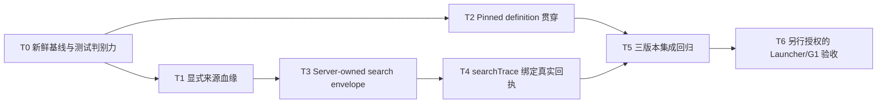

# 挑战杯 1–7 节点链路高 ROI 修复方案

> 文档 ID：`CC-NODES-1-7-HIGH-ROI-REPAIR-20260831`
>
> 状态：`IMPLEMENTED / DEV CLOSED / T6 NOT RUN`
>
> 证据复核基线：首次审查 `main@9207d3df4d65a6d0b39ba00ee7d411daf493b22c`；修订复核 `main@fc700e8e2f079be81a61b0b0e4fcda1cb39c26dd`，复核时间 `2026-08-31 +08:00`
>
> 适用范围：挑战杯 2.1.0 的节点 1–7，以及 3.0.0 中由主流程 `problem_understanding`、知识搜集 sideflow、主流程 `hypothesis_design` 共同构成的等价链路
>
> 非完成声明：本文是实施合同，不是代码完成、测试通过、Launcher 真实运行、G1 放行、模型调用回执或正式研究结果证据

## 1. 结论

当前 1–7 节点链路存在四个高 ROI 缺口，值得优先修复：

1. **P0：来源血缘按数组位置拼接。** 无效、重复或物化失败的 lead 会让后续 `recordId/candidateId` 与错误来源绑定，污染节点 2 产物并向节点 3–7 传播。
2. **P0：运行时已 pin 的 workflow definition 没有贯穿下游。** 3.0.0 run 的 artifact、handoff、reconcile 仍可能按 2.1.0 默认定义解释，造成错误前驱、错误 successor 和错误 artifact kind。
3. **P1：检索事务预算与质量合同互相冲突。** 默认仅允许 `1 × 5`，Prompt 却要求滚动多批写回并覆盖四类研究视角；现有 gate 只要求两个 perspective，无法证明节点 2 已完成有边界的研究搜集。
4. **P1：`searchTrace.resultRefs` 是 Agent 自报值，没有绑定真实检索回执。** 这使“查过什么、为何没找到、来源是否真的来自工具调用”无法审计。

推荐的最小架构不是新增工作流引擎或日志系统，而是：

- 以 canonical fingerprint 为稳定主键，在服务端写回准入时补发 `leadId`，用显式 `fingerprint/leadId → record → candidate` 血缘替代位置配对；
- 对 definition 读取做语义分类：既有 run 的权威解释只使用 run-scoped pinned definition，新 run 创建和当前配置展示仍可读取默认定义；
- 在任务创建时固化唯一 resolved search envelope，把总来源预算、单批事务大小、最大批次数和停止条件拆开，同时保留现有环境变量作为兼容输入；
- 从现有 tool event / provider receipt 投影 `searchTrace`，不建立第二套 receipt store。

完成代码与测试只代表 DEV 链路闭合。真实 Launcher/G1 验收必须另行授权，并继续受 `CatalogRunAuthorization`、正式模型回执与人工门约束。

## 2. 节点范围与版本映射

### 2.1 2.1.0 的 1–7 节点

| 序号 | `nodeId` | 中文节点 | 关键产物 |
| --- | --- | --- | --- |
| 1 | `problem_understanding` | 问题理解 | `problem_understanding` |
| 2 | `source_finding` | 资料寻找 | `source_candidate_batch` |
| 3 | `source_extraction` | 资料提炼 | `evidence_card_batch` |
| 4 | `evidence_relations` | 证据关系 | `evidence_relation_graph` |
| 5 | `knowledge_ingestion` | 知识入库 | `knowledge_package_draft` |
| 6 | `knowledge_handoff` | 知识包交接 | `knowledge_package` |
| 7 | `hypothesis_design` | 假设设计 | `hypothesis_set` |

### 2.2 3.0.0 的等价链路

3.0.0 把节点 2–6 移到 `challenge-cup-knowledge-sideflow@1.0.0`；主流程只保留节点 1 与节点 7 的直接拓扑。审查和验收必须按以下跨定义链路进行，不能把 3.0.0 误当成“没有知识搜集”：

```text
main 3.0.0: problem_understanding
       ↓ 绑定同一 question/run 的知识搜集权限与输入
knowledge sideflow 1.0.0:
source_finding → source_extraction → evidence_relations
→ knowledge_ingestion → knowledge_handoff
       ↓ 受治理的 knowledge_package / handoff
main 3.0.0: hypothesis_design
```

因此所有修复必须同时验证三种身份：

- 2.1.0 主流程；
- 3.0.0 主流程；
- 3.0.0 对应的 knowledge sideflow 1.0.0。

## 3. 当前证据与根因

| 问题 | 根因证据 | 影响 | ROI 判断 |
| --- | --- | --- | --- |
| 来源错绑 | `research_runtime/agent_task_artifact_builder.py::_source_finding_payload` 以相同 index 读取 `candidateLeads[]`、`createdRecords[]`、`importedCandidates[]`；物化阶段会因无 locator、重复、record 创建失败、candidate 导入失败而跳项。即使没有失败，命中已有 record 时也不会进入 `createdRecords[]`，但仍会继续导入 candidate，三个数组同样错位 | 错误 `sourceId/recordId/candidateId` 进入 `source_candidate_batch`，后续提炼、证据关系、知识包和假说均可能引用错误来源 | **P0**；改动集中、能直接阻止证据污染 |
| 定义漂移 | `_source_artifact_ids`、`handoff_builder`、`external_agent_task_reconciliation` 以及其他 run-driven owner 仍存在默认 `build_challenge_cup_workflow_definition()` 读取；run 本身已有 `workflowVersionId/structureHash`，registry 也已有 fail-closed resolver | 3.0.0 的 `hypothesis_design` 可能读取 2.1.0 的 `knowledge_package` 要求；successor、edge、actor/session policy 也可能按错误版本解释 | **P0**；已有 definition registry 可复用，但必须按调用语义审计真实范围，不能只改最初点名的三个调用点 |
| 预算/质量冲突 | `stage_writeback_prompt_contracts.py` 默认 `max_batches=1, max_leads=5`，同时要求“多次小批滚动写回”和四类视角；`artifact_quality_gate.py` 只要求两个 perspective、query 和 candidate | Agent 无法同时满足事务约束和研究质量；通过 gate 也不代表四类视角已闭合 | **P1**；能减少无效重试与低质量通过 |
| trace 无真实回执 | Prompt 要求真实 `resultRefs[]`，artifact builder 却复制 task result 内的 `searchTrace`；gate 未核对现有 tool/provider event | 支持来源或 `no_credible_source` 都可能无法追溯到真实调用 | **P1**；复用已有事件即可闭合审计，不需要新账本 |
| 更宽测试基线不绿 | 本轮审查的聚焦合同测试为 `151 passed`；更宽测试发现 14 个失败，其中 12 个是旧 Team `workflowDefaults` fixture 未适配 Team member/AgentDirectory SSOT，2 个 hypothesis-first E2E 仍假设 meeting 停留在 `open`，未适配后台推进到 `awaiting_approval` | 会掩盖后续真实回归，但不等于当前产品运行失败 | **P2**；先恢复测试判别力，不借机改产品语义 |

### 3.1 已确认的最小复现

- `candidateLeads[0]` 无有效 locator、`candidateLeads[1]` 有效时，物化结果只包含第二条来源；当前位置配对会把第二条的 `record-good/candidate-good` 填到第一条 lead。
- lead 命中已有 record 时不会追加到 `createdRecords[]`，但 candidate 仍可继续导入；因此即使没有任何失败或显式 skip，位置配对也会错绑。
- 多批写回目前会合并部分后续阶段数组，但 `candidateLeads[]` 仍可能被后批覆盖；artifact builder 读取的 lead 集合可能与完整物化循环不一致。现有 `[:24]` child/log 摘要也不能承载完整权威 lineage。
- 3.0.0 run 的 `hypothesis_design` 若走默认 2.1.0 definition，可能误读 `knowledge_package` 依赖；`problem_understanding` 的 successor 也会被解释成 `source_finding`，而不是 3.0.0 的 `hypothesis_design`。
- 单批 5 条无法稳定表达四类视角、重复剔除和负面检索结果；把 batch 数继续设为 1 又与“滚动写回”相冲突。
- Agent 可以自报任意 URL 到 `resultRefs[]`；当前 artifact quality gate 没有证明 URL、query、provider call 与真实 tool event 相互对应。

### 3.2 不应误判为根因的现象

- 旧 fixture 失败不是 workflow runtime 本身失败，修复时只更新已经过时的 Team/meeting 预期。
- 3.0.0 节点数减少不是资料搜集能力被删除；知识搜集已迁到 sideflow。
- 当前默认检索 provider 已覆盖 `crossref_rest_api + arxiv_api + openalex_api`，hypothesis 自动链也没有显式锁死 Crossref；provider 的真实可用性只能由 T6 的逐 provider 回执证明，不能预先写成已确认阻断或已确认可用。
- DEV fixture、计划文本和通过的单元测试都不等于真实检索、真实研究或 G1。

## 4. 外部项目调研与采用边界

外部项目均为 `REFERENCE_ONLY`。固定提交用于保证后续复核时看到相同材料；只借鉴合同，不引入其 runtime、存储或 agent 框架。

| 项目与固定提交 | 可借鉴点 | 本项目采用方式 | 明确不采用 |
| --- | --- | --- | --- |
| [LangGraph@11ee185](https://github.com/langchain-ai/langgraph/tree/11ee185999b86bfea2d8c0e69cef9a5e37acf686)；[checkpoint base](https://github.com/langchain-ai/langgraph/blob/11ee185999b86bfea2d8c0e69cef9a5e37acf686/libs/checkpoint/langgraph/checkpoint/base/__init__.py) | `thread_id` 是 checkpoint 主身份，`checkpoint_id` 精确定位恢复点；状态解释必须绑定同一持久身份 | 把 `(workflowId, workflowVersionId, structureHash)` 作为 run 的 pinned definition 身份，并在 artifact/handoff/reconcile 中显式传递 | 不新增 LangGraph checkpoint store，不让 LangGraph 成为第二个 Workflow Ledger |
| [GPT Researcher@6f99857](https://github.com/assafelovic/gpt-researcher/tree/6f998577d547b1e54ec662dac63583aa11e3b84b)；[deep_research.py](https://github.com/assafelovic/gpt-researcher/blob/6f998577d547b1e54ec662dac63583aa11e3b84b/gpt_researcher/skills/deep_research.py)、[researcher.py](https://github.com/assafelovic/gpt-researcher/blob/6f998577d547b1e54ec662dac63583aa11e3b84b/gpt_researcher/skills/researcher.py) | 先生成 research plan/subquery，再追踪 research sources；跨子主题保留 `visited_urls`，避免重复抓取 | 四类 perspective 先成为 server-owned search envelope；用规范化 DOI/URL fingerprint 去重，并保留 query→result refs 血缘 | 不复制整套 researcher agent，不把网页抓取结果直接当正式 evidence card |
| [RD-Agent@6762f84](https://github.com/microsoft/RD-Agent/tree/6762f84f9bc0f5c6486c50a00e128a57ac6c3683)；[evolving_framework.py](https://github.com/microsoft/RD-Agent/blob/6762f84f9bc0f5c6486c50a00e128a57ac6c3683/rdagent/core/evolving_framework.py) | `evolving_trace` 将历史方案与 feedback 按步骤保留，下一轮基于同一 trace 改进 | 检索批次不覆盖旧 trace；每批追加可验证的 query、receipt refs、结果与停止原因 | 不新增独立进化 Agent，不让 trace 成为第二套 transcript |
| [AI Scientist v2@96bd516](https://github.com/SakanaAI/AI-Scientist-v2/tree/96bd51617cfdbb494a9fc283af00fe090edfae48)；[journal.py](https://github.com/SakanaAI/AI-Scientist-v2/blob/96bd51617cfdbb494a9fc283af00fe090edfae48/ai_scientist/treesearch/journal.py)、[perform_experiments_bfts_with_agentmanager.py](https://github.com/SakanaAI/AI-Scientist-v2/blob/96bd51617cfdbb494a9fc283af00fe090edfae48/ai_scientist/treesearch/perform_experiments_bfts_with_agentmanager.py) | Journal 节点保留父子、执行结果、反馈与指标；阶段有 `max_iterations`，并持续保存当前进度 | search envelope 记录每批次状态、终止原因和最终 readiness；只有合同满足才交给节点 3 | 不引入树搜索，不用“最佳节点”替代挑战杯的人类 gate 或正式授权 |

外部对照后的共同结论是：**身份、血缘、预算与停止条件应由服务端持有；Agent 负责生成候选，不负责自证其运行事实。**

## 5. 目标合同

### 5.1 来源血缘合同

在现有 `materializedSources` 中增加服务端生成的逐 lead 权威结果。canonical fingerprint 是稳定主键；`leadId` 由服务端在写回准入时补发并作为本次任务内的可读关联键，不能依赖 Agent 自报值。例如：

```json
{
  "lineage": [
    {
      "fingerprint": "doi:...",
      "leadId": "lead-...",
      "record": {
        "status": "reused",
        "recordId": "record-..."
      },
      "candidate": {
        "status": "created",
        "candidateId": "candidate-..."
      },
      "reason": ""
    }
  ]
}
```

状态按两个物化阶段表达，避免一个扁平状态同时混淆 record 与 candidate：

- `record.status`：`created / reused / failed`；
- `candidate.status`：`created / reused / failed / not_attempted`。

`reason` 复用现有 `insufficient_source_identity`、`data_record_create_failed`、`duplicate_source_candidate`、`candidate_import_failed` 等 materialization reason；不要另建同义原因体系。

不变量：

- canonical fingerprint 是主关联键；服务端生成的 `leadId` 是同任务内辅助键，Agent 提交的 `leadId` 不能成为唯一权威；
- artifact builder 只按 fingerprint/服务端 `leadId` 读取 lineage，不按数组位置关联；
- `recordId` 与 `candidateId` 必须来自同一条物化结果；
- 同 locator/DOI 重放返回已有身份或明确 duplicate 状态，不产生错绑；
- 多批写回必须累计去重后的 `candidateLeads[]` 与 lineage，后批不得覆盖前批；artifact builder 与物化循环必须读取同一完整 lead 集合；
- 权威 lineage 不得复用现有 `[:24]` 截断 child/log 摘要；这些摘要可以继续用于诊断展示，但不能用于 artifact 构建或重放；
- 失败 lead 可出现在诊断摘要中，但不能借用相邻 lead 的身份；
- `sourceId` 只能是真实 `candidateId`，或同 lineage 的 `recordId`；两者都没有的 lead 只能留在诊断/失败摘要，不能以 locator 冒充正式来源身份进入 authoritative `candidateSources`。

### 5.2 Pinned definition 合同

复用 `core.research.workflow.definition_registry.resolve_definition_for_run_record`，形成既有 run 的唯一权威 definition 入口。实施时先对所有默认 definition 读取做语义分类，不机械替换每个调用点：

1. 当前配置展示、definition catalog 与新 run 创建可以继续使用默认 definition；
2. artifact、handoff、reconcile、node execution、budget/readback 等对既有 run 作权威解释的路径必须在靠近 run record 的 owner 处解析并显式传递；
3. 无生产调用方的 helper 只记录为 dead/legacy surface，不为满足搜索结果而强行修改；当前 `core/research/workflow/handoff.py` 不列为必改 owner，除非实施时发现真实生产调用方。

不变量：

- definition 必须与 `workflowId + workflowVersionId + structureHash` 同时匹配；
- `_source_artifact_ids` 只读取当前 run definition 中进入目标节点的 edge；
- handoff successor、edge、required artifact kind 均来自当前 run definition；
- external Agent reconcile 的 `actorKind/sessionScopePolicy/node spec` 来自当前 run definition；
- 空 `workflowVersionId` 只可在已明确标注的 legacy 路径保留当前图 fallback；非空 unknown version、definition 缺失或 hash mismatch 在 authoritative run 路径必须 fail closed，不得经通用 helper 回退到 2.1.0；
- `WorkflowDefinitionRegistryError` 必须被精确映射到已有 reconciliation/block 语义并终止本次外部任务收口，不能逃逸成无限重试；禁止为此泛化捕获所有 `RuntimeError`。

### 5.3 检索预算与覆盖合同

在任务创建时固化一个 resolved search envelope，把当前混在一起的“1 批 5 条”拆成四个独立字段：

| 字段 | 推荐初始值 | 含义 |
| --- | --- | --- |
| `totalAcceptedLeadBudget` | `8` | 整个 source_finding 任务最多接受的去重后 lead 数 |
| `maxLeadsPerWriteback` | `4` | 单次写回事务大小，避免一次性大 payload |
| `maxWritebackBatches` | `4` | 最多滚动写回次数，限制 tool 调用与重试成本 |
| `requiredPerspectives` | 四类 | `mechanism`、`independent_baseline`、`limitation_or_null`、`falsification` |

兼容与单一权威规则：

- 现有 `VIBELUTION_FINDING_MAX_WRITEBACK_BATCHES_PER_TASK`、`VIBELUTION_FINDING_MAX_LEADS_PER_WRITEBACK_BATCH` 继续作为任务创建时的兼容输入；解析后只写入 resolved envelope，不再在任务执行中成为第二套动态权威；
- 不新增与上述环境变量并行竞争的 batches/per-writeback 配置键；`totalAcceptedLeadBudget` 与 `requiredPerspectives` 由既有任务预算/质量合同或代码默认值补齐；
- 有效来源上限为 `min(totalAcceptedLeadBudget, maxWritebackBatches × maxLeadsPerWriteback)`；推荐值下即 `min(8, 4 × 4) = 8`；
- duplicate/reused lead 保留 lineage 与诊断事实，但不消耗去重后的 accepted-lead budget。

推荐停止条件：

1. 四类 perspective 都已有 terminal trace；
2. `mechanism` 与 `independent_baseline` 各有至少一条已物化可信来源；
3. `limitation_or_null` 与 `falsification` 各有真实来源，或有绑定回执的 `no_credible_source`；
4. 至少存在一条真实反证/边界候选才可直接 `passed`；若两类负面视角都只有可信的 `no_credible_source`，结果为 `needs_review`，不得伪造反证；
5. 达到总 lead 预算、批次数、deadline 或 token/cost guard 时停止并写明原因，不能继续隐式搜索。

这些值是代码默认建议，不触碰 operator config；若现有正式质量标准要求更多来源，以更严格标准为准，但不得把“单批事务大小”再次当成“总研究预算”。所有 Prompt、写回拒绝和 quality gate 必须读取任务上已固化的同一 resolved envelope。

### 5.4 检索回执绑定合同

`searchTrace` 最终由服务端基于现有 tool event/provider receipt 投影，Agent result 只可提交 query/perspective 与候选 refs，不可自证调用成功。执行事件挂在 source collection run 上，不是天然的 per-task receipt；canonical 关联键固定为 `sourceCollectionRunId + assignmentId + queryId + provider`，并保存命中的 `eventId`。

每个 terminal trace 至少能关联：

- `perspective` 与 canonical query；
- provider/tool call identity；
- `sourceCollectionRunId`、`assignmentId`、`queryId`、`provider` 与 `eventId`；
- 调用时间与 terminal status；
- 规范化后的真实结果 refs；
- `no_credible_source` 时的调用回执与 bounded failure reason。

校验规则：

- `found` 的每个 `resultRef` 必须出现在该 query 对应的真实 tool result 中；
- terminal 结果必须结合 `eventType` 解释；`search.excluded_source_filtered`、`search.duplicate_skipped` 等事件也会使用 `status="completed"`，不能只凭 status 把它们误判为 found；
- URL/DOI 先 canonicalize 再比对，避免参数和大小写造成假不匹配；
- `no_credible_source` 必须证明发生过 terminal 检索调用，不能只有自然语言声明；
- 不匹配时使用现有 quality/reconciliation failure 机制阻断，不新建 receipt 表或第二份搜索日志。

## 6. 实施任务图



### T0：新鲜基线、失败缩表与测试恢复

- **目标：** 从届时最新本地 `main` 重跑聚焦与更宽 selector，先分离真实产品失败、过时 fixture 与环境失败。
- **工作：** 以 fresh main 的实际失败文件为 owner 清单；只有旧 Team binding/AgentDirectory fixture 或 hypothesis-first meeting 预期仍失败时，才修正对应测试与支持模块。旧 fixture 当前散布在聚焦测试文件及 `binding_config_ssot.py`、`agent_execution.py` 等支持面，不把 `tests/_support/team_workflow/` 当成固定 owner；若 fresh main 已修复则不制造重复 diff。
- **禁止：** 为让测试变绿而改变 AgentDirectory SSOT、meeting 自动推进或业务状态机。
- **验收：** 先复现并记录 fresh main 的真实基线，再只修改精确失败预期；历史 `151 passed / 14 failed` 是审查证据，不是实施时必须维持的固定数量。meeting-open 断言不得批量替换，未失败的语义预期保持不动。
- **停止：** fresh main 出现与本计划无关的新失败，先归因，不把它并入 1–7 节点修复。

### T1：显式 `lead → record → candidate` 血缘

- **目标：** 物化函数输出完整逐 lead lineage，artifact builder 按稳定身份关联。
- **工作：** 写回准入时计算 canonical fingerprint 并补发服务端 `leadId`；逐 lead 记录 record/candidate 两阶段结果；累计多批 `candidateLeads[]` 与 lineage；移除 `_source_finding_payload` 的 index join，权威数据不走 `[:24]` 摘要。
- **验收用例：** 首项无效、中项重复、record 创建失败、candidate 导入失败、命中已有 record 但创建新 candidate、同 locator/DOI 去重与重放、跨批累计、超过 24 条时权威 lineage 不截断。
- **成功标准：** 任一失败、跳项、复用或批次边界不会改变其他 lead 的 record/candidate 绑定；artifact 与物化读取同一完整 lead 集合。

### T2：Run-scoped pinned definition 贯穿下游

- **目标：** 所有对既有 run 的 artifact、handoff、reconcile、execution、budget/readback 解释都使用同一 pinned definition，同时保留新 run/配置展示的合法默认读取。
- **工作：** 先产出默认 definition 调用点的语义分类清单；在 run-driven owner 靠近 run record 处调用 `resolve_definition_for_run_record` 并显式传递。对 registry 精确错误做已有 reconciliation/block 映射；不机械改无生产调用方的 helper，也不泛化捕获 `RuntimeError`。
- **验收用例：** 2.1.0、3.0.0、knowledge sideflow 三定义的 predecessor/successor、artifact kind、actor/session policy；空 version 的明确 legacy 场景；非空 unknown version/hash mismatch 精确 fail closed；definition 错误不会进入无限外部任务重试。
- **成功标准：** 3.0.0 `problem_understanding → hypothesis_design` 不被解释为 2.1.0 路径，sideflow 能独立解释自己的五节点拓扑，合法默认读取不被误删。

### T3：Server-owned search envelope 与四类覆盖 gate

- **目标：** 预算、滚动事务、质量覆盖和停止原因成为可验证服务端状态。
- **工作：** 在任务创建时解析现有环境变量兼容输入并固化 resolved envelope；拆分总 lead 预算、单批上限、批次数；累积去重 lead 与 perspective coverage；更新 Prompt 只描述与服务端完全一致的合同；升级 artifact quality gate。
- **验收用例：** 四类 found、负面视角 `no_credible_source`、duplicate 消耗规则、跨批累计、总预算耗尽、批次耗尽、`needs_review` 与 `passed` 分流。
- **成功标准：** Prompt、写回拒绝原因与最终 quality gate 使用同一 envelope，不再出现“要求多批但只允许一批”。

### T4：`searchTrace.resultRefs` 对真实回执强绑定

- **目标：** 每个 found/no-result 声明都可追到现有检索调用。
- **工作：** 从 source collection run 的 tool events/provider receipts 按 `sourceCollectionRunId + assignmentId + queryId + provider` 投影 canonical trace，保存 `eventId`；校验 Agent 提交 refs；将验证后的 trace 写入 artifact payload。
- **验收用例：** 正常 URL、canonical DOI、带 tracking query 的重复 URL、Agent 伪造 URL、跨 run/assignment/query/provider receipt、无调用却声明 `no_credible_source`、真实空结果回执、`status=completed` 但 `eventType` 为 excluded/duplicate。
- **成功标准：** 伪造或跨 scope 引用 fail closed；真实空结果能形成可审计的 `needs_review`，不要求伪造来源。

### T5：三版本集成回归与 closeout

- **目标：** 证明修复没有破坏节点 1–7、3.0.0 主流程或知识 sideflow。
- **工作：** selector-selected tests、固定三版本集成场景、diff 自审；只在所有门通过后合入本地 `main`。
- **成功标准：** 2.1.0 完整 1–7 artifact/handoff 链绿；3.0.0 主流程与 sideflow 的身份/交接绿；无第二 runtime、第二 receipt store 或普通 Session 语义 diff。
- **停止：** 需要改普通 Session admission/Journal/SSE、operator config、Launcher 生命周期或正式授权时停止并拆任务。

### T6：真实 Launcher/G1 验收（本计划不自动授权）

- **前置：** T5 已合入；用户明确授权运行；正式 provider、预算、`CatalogRunAuthorization` 与数据范围就绪。
- **场景：** 选择一题跑节点 1–7/等价 sideflow，收集 provider/tool receipt、lineage、artifact manifests、handoff 与 gate 结果。
- **成功标准：** 所有来源可追到真实检索回执；没有错绑；run definition identity 全程一致；需要人工 gate 的节点没有被自动越权；逐 provider 回执说明 Crossref/arXiv/OpenAlex 在该次运行中的实际成功、空结果或失败状态，不预设 provider 覆盖结论。
- **声明边界：** G1 通过仍不是 G5/G12/G125、论文结论或正式提交。

## 7. 预计文件影响面

实施时必须从 fresh main 重新定位 owner；下表是预计范围，不是一次性修改授权。

| 任务 | 主要 owner | 预计测试 |
| --- | --- | --- |
| T0 | fresh main 实际失败的测试/支持文件；已知候选包括 `tests/test_research_workflow_hypothesis_first_e2e.py` 及 binding/agent-execution 支持面，但不预先锁定目录 | Team workflow selector、hypothesis-first E2E |
| T1 | `source_collection/writeback_materialize.py`、必要的 stage writeback owner、`research_runtime/agent_task_artifact_builder.py` | `test_research_workflow_v21_agent_completion_reconciliation.py`、source collection cases |
| T2 | 首轮已知 run-driven owner：`agent_task_artifact_builder.py`、`handoff_builder.py`、`external_agent_task_reconciliation.py`、`agent_node_execution.py`、`session_binding_bridge.py`、`service.py`、`node_command_adapter.py`、`node_budget_allocation.py`、`command_service.py`、`artifact_readback_registry.py`；复用 `core/research/workflow/definition_registry.py`。最终范围由语义分类清单收敛；`core/research/workflow/handoff.py` 当前不是必改项 | `test_workflow_definition_registry.py`、`test_knowledge_sideflow_run.py`、handoff/reconciliation/execution tests |
| T3 | task 创建/预算 owner、`source_collection/stage_writeback_prompt_contracts.py`、`writeback_materialize.py`、`research_runtime/artifact_quality_gate.py` | `test_source_collection_stage_writeback_prompt_contracts.py`、`test_research_workflow_v21_quality_efficiency.py` |
| T4 | `source_collection/search_execution.py` 与现有 event/receipt owner、`agent_task_artifact_builder.py`、`artifact_quality_gate.py` | 新增 receipt binding focused tests；复用现有 run/assignment isolation tests |
| T5 | 测试与必要 fixture；不新增产品 owner | 见验证矩阵 |

实现阶段采用单一 writer 串行处理共享 hot surface；T1/T2 的探索可以并行，但对 `agent_task_artifact_builder.py` 的写入必须由同一 owner 完成。

## 8. 验证矩阵

| 层 | 必须证明 | 建议命令/证据 |
| --- | --- | --- |
| 静态范围 | 只改已 claim 文件；run-driven 默认 definition 读取已分类并收口；没有位置 join | `git diff --check`、默认 definition 调用点分类清单、窄范围 `rg`、diff 自审 |
| 来源血缘 | 跳项/失败/复用/重放/跨批/超过摘要上限场景无错绑 | focused pytest + 逐 lead 完整 lineage 断言 |
| 定义身份 | 2.1.0、3.0.0、sideflow 按自身 edge/node policy 解释；registry 精确错误 settle/block | `tests/test_workflow_definition_registry.py`、`tests/test_knowledge_sideflow_run.py` 与新增下游版本/错误收口测试 |
| 检索质量 | 四类覆盖、预算、跨批累计、停止原因一致 | `tests/test_source_collection_stage_writeback_prompt_contracts.py`、`tests/test_research_workflow_v21_quality_efficiency.py` |
| 回执审计 | found 与 no-result 都绑定同 run/assignment/query/provider 的真实 event，并保存 eventId | focused receipt/tool-event tests；伪造、跨 scope、completed excluded/duplicate 负例 |
| 1–7 集成 | 节点 artifact、handoff、quality gate 顺序正确 | v2.1 lifecycle/completion/handoff tests |
| 更宽回归 | 旧 fixture 不再制造假失败，当前自动推进语义保持 | selector-selected Team/hypothesis-first suite |
| 真实运行 | Launcher/G1 一题完整 receipt 与 artifact 包，逐 provider 记录真实终态 | 仅 T6，另行授权 |

实施时至少运行以下聚焦集合，最终命令由 selector 和实际 diff 追加，不得删减命中的更宽测试：

```powershell
.\.venv\Scripts\python.exe -m pytest `
  tests/test_research_workflow_v21_agent_completion_reconciliation.py `
  tests/test_research_workflow_v21_quality_efficiency.py `
  tests/test_research_workflow_v21_runtime_lifecycle.py `
  tests/test_research_workflow_v21_handoff_recovery.py `
  tests/test_workflow_definition_registry.py `
  tests/test_knowledge_sideflow_run.py `
  tests/test_source_collection_stage_writeback_prompt_contracts.py -q
```

计划、fixture 与测试结果必须分别标记，不得用任何一层替代真实运行证据。

## 9. 兼容、迁移与回滚

- **历史 artifact 读取：** 旧 `materializedSources` 没有 lineage 时仅保持只读兼容；不能重新用 index join 生成权威映射。需要重算时走明确 reconciliation，并标记来源证据不足。
- **新写入：** 新 task 必须写完整 lineage、definition identity 与任务创建时固化的 resolved search envelope；不允许新旧两套写入者长期并存。
- **灰度：** 先在 DEV fixture 与固定 run snapshot 验证，再决定是否让新 gate 进入正式 run；不得通过 operator config 偷开。
- **回滚：** 回滚代码时不得删除已写 receipt/tool events/artifacts；新字段保持向后可忽略。若 gate 过严，回滚 gate 启用点而不是恢复 Agent 自报或位置配对。
- **无数据迁移优先：** 本轮不批量改写历史运行数据；只有真实验收证明历史记录必须修复时，另开有备份、dry-run 与逐 run 审核的数据任务。

## 10. 与既有计划的去重边界

[2026-08-30 挑战杯自动运行链路可靠性方案](../../../plans/2026-08-30-challenge-cup-automatic-chain-reliability-plan.md) 负责 meeting deadline、durable meeting work、review timeout/cancel、reconcile zero-work、run 隔离和自动推进可靠性。

本文只负责节点 1–7 的：

- 来源物化血缘；
- workflow definition 身份贯穿；
- source_finding 预算/质量合同；
- 检索 trace 与真实回执绑定；
- 三版本节点链集成回归。

若实施发现问题属于 meeting driver、摘要、Workflow Ledger durable recovery 或自动批准，应回到 8 月 30 日计划，不在本文中重复设计。

### 10.1 DEV 实施结果（2026-09-01）

T0–T5 已按本计划闭合，并与本归档文档作为同一任务变更进入受管 closeout：

- 来源物化使用服务端 canonical fingerprint 与稳定 `leadId`，逐 lead 保存完整 record/candidate lineage；artifact builder 已删除数组位置关联，并仅对 finding/source_finder 累计跨批 `candidateLeads[]`。
- 既有 run 的 artifact、handoff、reconcile、execution、budget、command 与 artifact readback 使用 run-scoped pinned definition；空 version 保留明确 legacy 路径，非空 unknown/hash mismatch fail closed。
- finding task 创建时冻结 `8` 条总接受预算、每批 `4` 条、最多 `4` 批和四类视角；实际接受上限取小，环境变量只在创建时解析为兼容输入。
- canonical `searchTrace` 从现有 `search_events.jsonl` 按 run、assignment、query、provider 投影并保存 eventId；Agent 自报 trace 不再作为权威，真实空结果进入可审计的 `needs_review`。
- 聚焦验证通过：三版本/生命周期/quality/handoff/definition/sideflow/prompt 合同 `89 passed`，command transaction/idempotency/version/team/fork 回归 `31 passed`；此前分组验证另有 artifact readback/adapters `62 passed`、quality/lineage/prompt `39 passed`、source collection 宽回归 `164 passed`。相同测试可能在分组间重叠，数字不作总计。
- 外部挑战杯研究流程站的唯一生成器已同步上述合同并重新生成 13 页；派生 HTML 未手改。

本次未启动 Launcher、未执行 G1、未调用付费模型、未修改 operator config，也未产生真实 provider 可用性结论。Crossref/arXiv/OpenAlex 的实际成功、空结果或失败仍只能由另行授权的 T6 回执证明。

## 11. 停止条件与完成定义

### 11.1 立即停止并重新对齐

- 需要修改普通 Agent Session admission、Journal、SSE、`ConversationStore` 或 transcript 语义；
- 需要新增 workflow runtime、第二套 receipt store、第二套 transcript 或第二个 projection writer；
- active claim 与预计 owner 重叠，或 fresh main 已改变根因；
- 默认 definition 调用点无法判定是“新 run/展示”还是“既有 run 权威解释”，或 registry 错误只能靠捕获所有 `RuntimeError` 才能收口；
- 预算实现需要让新字段与现有环境变量在任务执行期同时充当权威，无法在任务创建时解析成单一 envelope；
- 需要读取/写入 operator config、启动 Launcher、执行 G1 或调用付费模型；
- 需要批量改写历史运行数据；
- 外部项目建议与 Vibelution 已有事实源冲突。

### 11.2 代码阶段完成定义

只有同时满足以下条件，T0–T5 才算完成：

1. 四个根因均有对应失败测试与根因级最小修复；
2. 完整 lineage 覆盖 record reused、失败/跳项、跨批累计和超过摘要上限场景，artifact builder 已移除位置关联；
3. 所有默认 definition 读取已有语义分类，既有 run 只走 pinned resolver；非空 unknown/hash mismatch 精确 block/reconcile，未引入宽泛 `RuntimeError` 兜底；
4. resolved search envelope 在任务创建时固化，现有环境变量仅作为兼容输入；有效来源上限、duplicate 计费、Prompt、写回拒绝与 quality gate 数学一致；
5. receipt binding 使用 `sourceCollectionRunId + assignmentId + queryId + provider + eventId`，found/no-result/excluded/duplicate 的 `eventType` 负例全部通过；
6. 2.1.0、3.0.0 与 knowledge sideflow 三版本测试通过，更宽 selector 无本任务引入的新失败；
7. diff 自审确认未引入第二 runtime/store，也未改变普通 Session；代码、测试与文档已 ff-only 合入本地 `main`，任务资源完成受控清理。

T6 的真实 Launcher/G1 证据不属于 T0–T5 的自动完成条件；没有 T6 时只能宣称“DEV 链路闭合”。

### 11.3 计划关闭与归档

当 T0–T5 完成后，把状态改为 `IMPLEMENTED / DEV CLOSED`；若 T6 同时完成，可另记 `G1 VERIFIED` 及证据索引。随后将本文迁入 `docs/archive/plans/<yyyy-mm>/`，并同步 `docs/plans/README.md` 与 `docs/README.md`。被新方案替代时标记 `SUPERSEDED` 后归档，不让 active plan 长期滞留。
