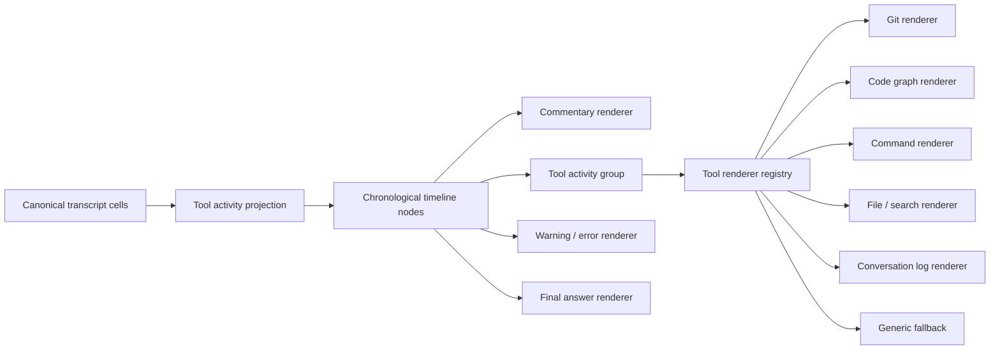

# Codex 风格对话时间线一次性改造方案

## 1. 文档状态

- 日期：2026-07-18
- 项目：Vibelution
- 状态：已完成需求对齐，待一次性实施
- 交付方式：单一任务 worktree、单一实现批次、单一功能提交、一次合入、一次 Launcher 刷新
- 版本影响：patch
- Runtime 刷新：合入后必须执行

## 2. 改造目标

本轮不再对现有工具行做零散 CSS 修补，而是一次性替换为接近 Codex 的规范化对话时间线：

```text
用户消息
模型公开的思考摘要 / commentary
工具活动组
中间说明
工具活动组
警告或失败
最终回答
```

必须同时解决：

- 连续十几次工具调用铺满页面。
- 原始 JSON 直接暴露，信息密度失控。
- 工具名、状态、耗时、目标缺乏清晰层级。
- 思考、工具、最终回答的时间顺序不稳定。
- Streaming 更新引起上下跳动、重复渲染。
- 小屏幕排版溢出，箭头与内容相距过远。
- 未知工具、失败工具、审批工具缺少统一展示。
- 大型结果展开后拖慢整个对话页面。

只展示协议明确提供的 `reasoning summary`、`commentary` 等公开内容，不尝试展示模型内部隐藏思维链。

## 3. 最终界面形态

### 3.1 默认折叠状态

```text
白听澜  00:14

我会先定位 token 用量写入与汇总路径，再判断重复发生在哪一层。

✓ 代码分析 · 16 次调用 · 1m 18s · 15 成功 · 1 次重试       >
  当前：已检查 ConversationLogger、审计工具和响应投影链路

我确认重复计数发生在审计聚合阶段，而不是生产端重复写入。

最终回答
……
```

### 3.2 展开状态

```text
代码分析 · 16 次调用 · 1m 18s

✓ Git 状态        检查当前工作树                       0.2s
✓ 查看最近改动    定位相关提交                         0.2s
✓ 代码图谱        检查 ConversationLogger              3.0s
✓ 代码图谱        查找 token_usage 写入方               4.4s
! 代码图谱        首次目标未索引，刷新后重试             15s
✓ 搜索代码        定位聚合函数                         0.1s
✓ 对话日志        核对真实事件                         2.3s
```

### 3.3 展示规则

| 场景 | 行为 |
|---|---|
| 1～2 次连续调用 | 直接显示紧凑工具行 |
| 3 次及以上连续调用 | 自动形成工具活动组 |
| 正在运行 | 显示当前调用，历史调用保持折叠 |
| 调用失败 | 自动展开失败项，保留错误摘要 |
| 未知工具 | 使用通用工具渲染器，不显示“命令”占位名 |
| 工具循环警告 | 独立警告节点，不合并进普通工具组 |
| 大型结果 | 点击后惰性挂载，内部滚动 |
| 原始 JSON | 只出现在展开后的“结果”区域 |
| Commentary | 保持原始时间位置，绝不被工具组吞掉 |
| 最终回答 | 始终位于本轮最后，不与中间说明合并 |

## 4. 目标架构



核心原则：

- 后端 canonical transcript 继续作为唯一事实源。
- 分组只是前端派生结果，不写回协议、不修改历史。
- `callId`、cell ID、turn ID 和实际顺序全部保留。
- 不跨 commentary、警告、审批、错误、最终回答或 turn 边界分组。
- 分组算法为单次线性遍历 `O(n)`。
- React key 使用稳定 ID，禁止使用数组下标。
- Running 到 completed 更新同一个节点，不卸载重建。

## 5. 源头统一

| 数据 | 唯一来源 | 前端职责 |
|---|---|---|
| 时间顺序 | Canonical transcript cells | 只按原顺序派生 |
| 工具状态 | Tool lifecycle projection | 转换为 running/success/error/approval |
| 耗时 | 工具生命周期时间戳 | 统一格式化 |
| 工具类别 | Tool renderer registry | 映射图标、名称、目标摘要 |
| 分组关系 | 纯前端 grouping function | 不持久化 |
| 展开状态 | 本地 UI state | 使用稳定 group ID |
| 原始参数和结果 | Canonical tool details | 展开时才渲染 |
| 思考内容 | Provider 明确输出的 summary/commentary | 按时间线展示 |
| 最终回答 | Canonical final answer cell | 保持本轮末尾 |

## 6. 文件改造范围

### 6.1 新增模块

| 文件 | 职责 |
|---|---|
| `web/src/components/conversation/conversationToolActivityModel.ts` | 时间线分类、工具分组、稳定 ID、状态聚合 |
| `web/src/components/conversation/ConversationToolActivity.tsx` | 工具组、工具行、展开区域和运行状态 |
| `web/src/components/conversation/ConversationToolActivity.styles.ts` | 紧凑布局、响应式、状态与动效 |
| `web/src/components/conversation/conversationToolRendererRegistry.tsx` | 按工具类别选择专用渲染器 |
| 对应测试文件 | 分组、渲染器、Streaming 稳定性和无障碍测试 |

### 6.2 修改现有模块

- `web/src/components/conversation/ConversationView.tsx`：只负责把 canonical cells 交给新时间线投影，不再内联堆积工具展示逻辑。
- `web/src/components/conversation/ConversationView.styles.ts`：统一对话宽度、段落节奏、用户与 Agent 消息锚点。
- `web/src/components/conversation/conversationToolPresentation.ts`：升级为语义描述注册表。
- `web/src/components/conversation/ConversationMarkdownRenderer.tsx`：保持 Markdown SSOT，只补齐与新时间线的间距契约。
- `web/src/components/conversation/ConversationView.nativeTranscript.test.tsx`：覆盖最终时间顺序和长链路。
- `web/src/components/conversation/timelineMessageCanonicalInterleave.test.ts`：确保分组不破坏 canonical interleave。

默认不修改后端协议。只有确认 canonical cell 缺少必要的 `callId`、`status` 或 `timestamp` 时，才补最小投影字段。

## 7. 工具渲染器体系

统一 `ToolShell` 提供：

- 状态图标。
- 语义动作名称。
- 操作目标。
- 耗时。
- 展开按钮。
- 错误、重试和审批状态。
- 键盘操作和 `aria-expanded`。

专用渲染器包括：

| 类型 | 紧凑摘要示例 |
|---|---|
| Git | `检查工作树状态` |
| 代码图谱 | `检查 ConversationLogger 的引用` |
| 文件读取 | `读取 core/llm/client.py` |
| 搜索 | `搜索 token_usage 写入位置` |
| 命令 | `运行聚焦测试` |
| 文件修改 | `更新 ConversationView.tsx` |
| 对话日志 | `检查 turn 9f8f… 的事件链` |
| 浏览器/Computer Use | `检查对话页面渲染结果` |
| 通用 fallback | `调用 tool_name`，保留状态、目标和详情 |

工具结果详情统一为按需出现的区域：

```text
输入 | 摘要 | 结果 | 诊断
```

不存在的区域不显示，避免空标签和模板化噪声。

## 8. 一次性实施顺序

1. 在单一任务 worktree 中冻结时间线契约和真实长链路 fixture。
2. 先完成纯函数分组模型及顺序测试。
3. 完成 `ToolShell`、活动组和工具注册表。
4. 接入 `ConversationView`，一次性替换旧工具渲染路径。
5. 处理 Streaming 节点稳定、乐观消息稳定和滚动锚点。
6. 完成文字排版、Markdown、错误、警告和最终回答样式。
7. 完成桌面端与 390px 移动端响应式。
8. 添加低成本诊断日志。
9. 运行全部聚焦测试与生产构建。
10. 通过 Launcher 只刷新一次。
11. 执行真实 20 次以上工具调用长链路。
12. 截图验收桌面端、窄屏、运行中、失败和展开状态。
13. 自审后形成一个功能提交，一次性合入本地 `main`。

不会把半完成组件分批合入 `main`，也不会让新旧两套渲染逻辑长期并存。

## 9. 性能设计

- 分组计算 `O(n)`，通过 `useMemo` 绑定 canonical cell 引用。
- 默认只渲染活动组摘要和当前运行项。
- 历史详情折叠时不挂载大型 JSON DOM。
- 大型结果限定高度，并在详情内部滚动。
- 摘要提取限制字符数和遍历深度。
- 只更新当前活动组，不重建整轮消息。
- 100 次工具调用默认只产生一个组摘要和必要状态节点。
- 禁止每次 React render 写日志。
- 不引入新的 UI 框架或状态管理依赖。

## 10. Agent 诊断日志

每轮或活动组状态发生实质变化时记录一次有界事件：

```text
turnIdPresent
groupCount
toolCallCount
collapsedCallCount
runningGroupCount
failedCallCount
unknownRendererCount
projectionGapCount
renderDurationBucket
```

明确禁止记录：

- 完整提示词。
- 工具原始参数。
- 工具完整结果。
- Response ID。
- 文件正文。
- 大型 JSON。

日志按稳定签名去重，避免为了透明度再次拖慢链路。

## 11. 验收标准

必须全部通过才允许合入：

1. 16 次连续代码图谱调用默认只显示一个工具活动组。
2. 展开后 16 次调用顺序与 canonical transcript 完全一致。
3. 中间 commentary 不被移动、不被合并。
4. Running 到 completed 不产生上下跳动或重复节点。
5. 失败调用自动显露，错误摘要可读。
6. 工具循环警告独立展示并切断分组。
7. 折叠状态不出现原始 JSON。
8. 未知工具不再显示无意义的“命令”。
9. 最终回答稳定处于工具链之后。
10. 用户消息与 Agent 消息不因缓存收敛而重排。
11. 390px 页面无整体横向滚动。
12. 键盘可以展开、折叠并看到焦点。
13. 状态不只依赖颜色表达。
14. 100 次工具调用 fixture 不产生大型 DOM。
15. 不丢失、复制或重新绑定任何 `callId`。
16. 前端遥测不存在事件风暴或敏感内容。
17. 聚焦测试、conversation 测试和生产 build 全部通过。
18. Launcher 刷新后的真实长链路截图通过人工验收。

## 12. 验证命令

```powershell
npm --prefix web run test -- src/components/conversation/conversationToolActivityModel.test.ts src/components/conversation/ConversationToolActivity.test.tsx src/components/conversation/conversationToolRendererRegistry.test.tsx src/components/conversation/ConversationView.nativeTranscript.test.tsx src/components/conversation/timelineMessageCanonicalInterleave.test.ts src/components/conversation/conversationToolPresentation.test.ts --reporter=dot

npm --prefix web run test -- src/components/conversation --reporter=dot

npm --prefix web run build
```

真实验收需要构造包含以下内容的长链路：

- 至少 20 次工具调用。
- 至少 5 段公开 commentary。
- Git、代码图谱、文件读取、搜索和对话日志工具。
- 一次可恢复错误或重试。
- 一次工具循环警告 fixture。
- 一个完整最终回答。

## 13. 回滚与交付

- 交付形式：一个任务分支、一个完整功能提交、一次本地 `main` 合入。
- 回滚形式：直接回退单个功能提交。
- 数据风险：无，因为 canonical transcript 和后端协议保持不变。
- Runtime refresh：合入后必须通过 Launcher 刷新。
- 外部依赖：不新增。
- 开源复用：复用交互模式，不直接复制第三方组件代码，避免样式系统和协议层被外部实现绑架。
- 实施中不再进行普通确认；仅在 active claim 冲突、未知脏改动或破坏性操作风险出现时暂停。
## 14. 外部参考

- assistant-ui ToolFallback：https://www.assistant-ui.com/docs/ui/tool-fallback
- assistant-ui：https://github.com/assistant-ui/assistant-ui
- LibreChat：https://github.com/danny-avila/LibreChat
- Deep Agents UI：https://github.com/langchain-ai/deep-agents-ui
- Cline：https://github.com/cline/cline
- OpenHands：https://github.com/OpenHands/OpenHands
