# Vibelution 监督进化：反思驱动、多候选与 Pareto 治理完整方案

**Date:** 2026-07-25
**Status:** in-progress — T0 已完成并等待 root `main` 清理后集成
**Owner:** `codex-supervised-evolution-t0`
**Implementation:** `codex/supervised-evolution-t0` @ `53c507c1d`
**Validation:** claim-bound closeout passed; 217 selected supervised/Gym/Web evolution tests passed
**Mode:** `TASK_GRAPH`
**Risk:** `HIGH_RISK`（涉及 Agent 行为、LLM 路由、监督决策、运行控制与晋升治理）
**Version impact:** `minor`（兼容性扩展；实施任务不直接修改版本文件）
**Research decision:** `ADAPT`（吸收 GEPA、DSPy、TextGrad、OpenEvolve、A-Evolve、AFlow 的机制，不引入第二套 Agent Runtime）
**Research note:** `C:\Users\Administrator\Desktop\Agent论文\search-results\2026-07-25-supervised-evolution-github-designs.md`

## 0. 执行结论

Vibelution 已经具备监督进化的安全骨架：

- `Dataset / Bundle / Split` 数据边界；
- `AgentHarnessAdapter`、隔离 `HarnessVariant`、`Attempt / Trace / Score / EvaluationRun`；
- baseline/candidate 对照、训练层级门禁、Decision Record；
- `PROMOTE / HOLD / ROLLBACK` 与 proposal apply/activate/rollback；
- provenance、证据路径、工作树隔离和运行态控制；
- `PROMOTE` 与 active advisory 不自动改变 Runtime，`runtime_effect=not_applied`。

当前主要缺口不是“再建一个评估平台”，而是现有 `EvolutionEngine` 仍接近一次性流程：

> 一组 baseline evidence → 一个粗粒度 diagnosis → 一个 candidate → 一次比较。

本方案将其升级为：

> 多来源证据 → 可行动反思 → 多候选生成/变异/合并 → 预算控制 → 分层评估 → Pareto/质量多样性归档 → 冻结门禁 → 仅生成晋升提案。

首个生产目标只进化 `prompt / skill / tool description` 等可控文本资产，不自动修改代码，不自动覆盖 accepted baseline，不自动改运行配置。

## 1. 目标与非目标

### 1.1 目标

1. 让失败 trace、约束冲突、评分分解和成功模式形成结构化 `ReflectiveFeedback`。
2. 允许一次 episode 生成多个候选，并保留父代、策略、预算、证据和评估谱系。
3. 使用硬门禁 + Pareto 排序替代单一成功率差值，降低“高质量但更贵”和“更快但不安全”被错误折叠的问题。
4. 明确 train/dev/observe/regression/frozen-holdout 的可见性和使用权限，抑制数据污染与过拟合。
5. 支持 pause/resume/terminate、checkpoint、预算耗尽和进程异常后的确定性恢复。
6. 在 Web Workbench 中展示候选谱系、目标向量、预算、门禁、决策和真实 runtime effect。
7. 每个监督结论都能由 artifact refs 重放和审计。

### 1.2 非目标

1. 第一阶段不引入外部优化框架运行时或其 Agent/Tool/Memory 抽象。
2. 第一阶段不做任意源码自治修改、自动提交、自动合并或自动发布。
3. 第一阶段不做 AFlow 式任意工作流拓扑搜索。
4. 不允许 proposer 看到 frozen holdout 的样例、trace、标签或评分解释。
5. 不把单次真实评分胜出直接等同于可上线。
6. 不把 `PROMOTE`、proposal applied 或 advisory active 解释成 runtime 已采用。

## 2. 借鉴边界

| 项目 | 吸收机制 | Vibelution 落点 | 不直接复用原因 |
|---|---|---|---|
| GEPA | rich actionable feedback、反思、变异、Pareto、候选合并 | `ReflectiveFeedbackBuilder`、策略层、Pareto archive | 保留 Vibelution 现有 evidence、Harness 与治理契约 |
| DSPy | Program/Metric/Trainset/Optimizer 分离 | evolvable artifact、评分策略、split policy、strategy protocol | 避免把产品 Runtime 改造成 DSPy Runtime |
| TextGrad | 文本损失与局部 textual gradient | prompt/skill/tool-description mutation | 只作为一种策略，不承担完整控制面 |
| OpenEvolve | MAP-Elites、island、预算、级联评估、checkpoint | Phase 2 的质量多样性、budget、resume | 首版不需要完整分布式 island 系统 |
| A-Evolve | workspace manifest、BenchmarkAdapter、版本/回滚 | Phase 3 的 evolvable workspace contract | 源码级进化必须晚于文本资产闭环稳定 |
| AFlow | workflow-as-code 与 MCTS 拓扑搜索 | Phase 4 的 Workflow IR | 搜索成本和失败面远高于当前成熟度 |

**依赖决策：** 首版不新增这些项目为运行依赖，先用内部协议复现必要机制；只有在真实评估证明维护成本过高时，再单独评估依赖引入。

## 3. 目标架构

```mermaid
flowchart LR
    D["Dataset Registry<br/>train / dev / observe / regression / frozen holdout"]
    H["AgentHarnessAdapter<br/>isolated HarnessVariant"]
    E["Attempt / Trace / Score<br/>Evidence Artifacts"]
    F["ReflectiveFeedback Builder<br/>failure + success + constraints"]
    S["EvolutionStrategy<br/>propose / mutate / merge"]
    P["Candidate Pool<br/>lineage + budget + status"]
    C["Cascade Evaluation<br/>smoke → dev → regression → holdout"]
    A["Pareto / Quality-Diversity Archive"]
    G["Hard Gates + Selection Policy"]
    R["Decision Record<br/>PROMOTE / HOLD / REJECT / INCONCLUSIVE"]
    Q["Promotion Proposal<br/>manual lifecycle"]
    U["Workbench UI<br/>monitor + audit"]

    D --> H --> E --> F --> S --> P
    P --> C --> A --> G --> R --> Q
    E --> R
    A --> S
    R --> U
    P --> U
    Q -. "runtime_effect=not_applied" .-> U
```



### 3.1 三个平面

1. **评估平面（保持稳定）**
   由 Dataset Registry、Harness、Attempt/Trace/Score、证据 artifact 和 frozen evaluator 组成。优化器只能消费其公开结果，不能重写 evaluator 或 holdout。

2. **优化平面（本方案新增）**
   由反馈构建、策略、候选池、预算、级联评估、Pareto/质量多样性归档和 checkpoint 组成。

3. **治理平面（强化而非放宽）**
   由 Decision Record、proposal 生命周期、人工 review、apply/activate/rollback、审计日志和 runtime effect 组成。

## 4. 核心领域契约

新优化模型建议放在 `core/gym/optimization_models.py`，避免继续扩张通用 `models.py`；通过 `core/gym/__init__.py` 进行显式兼容导出。

### 4.1 `ReflectiveFeedback`

必填字段：

- `feedback_id`
- `episode_id`
- `case_ids`
- `trace_refs`
- `score_breakdown`
- `failure_taxonomy`
- `constraint_violations`
- `successful_patterns`
- `actionable_lessons`
- `target_components`
- `confidence`
- `source_fingerprint`
- `redaction`
- `created_at`

约束：

- 只保存有界摘要和 artifact refs，不复制完整 prompt、秘密或大段 tool output；
- 每条 lesson 必须能回指 trace、score 或 constraint；
- 明确区分环境不可用、传输错误、Evaluator 不完整与 Agent 行为失败；
- holdout 只产生最终 gate 结果，不产生 proposer 可见 feedback。

### 4.2 `EvolutionCandidate`

必填字段：

- `candidate_id`
- `parent_ids`
- `generation`
- `strategy_id` / `strategy_version`
- `artifact_type`
- `target`
- `payload` 或 `patch_ref`
- `fingerprint`
- `status`
- `budget_usage`
- `objective_vector`
- `per_split_scores`
- `lineage_refs`
- `evidence_refs`
- `runtime_effect`

候选状态：

`generated → validating → evaluated → pareto|dominated → selected|rejected|superseded`

异常终态：

`invalid`、`blocked`、`inconclusive`、`budget_exhausted`、`cancelled`

兼容策略：

- 现有 `CandidateImprovement` 保留为 Gym v1 兼容 DTO；
- 新候选可投影为 `CandidateImprovement` 供现有 adapter 使用；
- `self_evolution_candidate_pool.py` 中的 prompt/skill candidate 通过 intake adapter 进入统一候选池，不再建立第二套评估逻辑；
- 旧 JSON artifact 继续可读，新字段使用缺省值完成 schema migration。

### 4.3 `EvolutionStrategy`

```python
class EvolutionStrategy(Protocol):
    def supports(self, artifact_type: str) -> bool: ...
    def propose(self, context: StrategyContext, budget: EvolutionBudget) -> list[EvolutionCandidate]: ...
    def mutate(self, candidate: EvolutionCandidate, feedback: ReflectiveFeedback) -> list[EvolutionCandidate]: ...
    def merge(
        self,
        left: EvolutionCandidate,
        right: EvolutionCandidate,
        feedback: ReflectiveFeedback,
    ) -> EvolutionCandidate | None: ...
```

首批内部策略：

1. `ReflectiveTextStrategy`：面向 prompt/skill/tool description；
2. `BaselineCopyStrategy`：验证评估链不会凭空制造提升；
3. `RuleBasedMutationStrategy`：确定性测试与故障恢复用；
4. `TextualGradientStrategy`：Phase 2 可选，借鉴 TextGrad。

所有 LLM 调用复用 Vibelution 统一模型链和现有绑定，不新增旁路 Provider。

### 4.4 `EvolutionBudget`

- `max_generations`
- `max_candidates`
- `max_concurrent_evaluations`
- `max_model_calls`
- `max_metric_calls`
- `max_input_tokens` / `max_output_tokens`
- `max_cost`
- `max_wall_seconds`
- `per_candidate_timeout_seconds`

任何预算耗尽均产生可恢复 checkpoint 和 `budget_exhausted` 事件，而不是静默截断。

### 4.5 `CandidateArchive`

排序分两步：

1. **硬门禁先行**
   - schema / provenance / evidence 完整；
   - foundation 不退化；
   - validation、safety、regression 在阈值内；
   - 无 holdout 泄漏；
   - 运行和工具边界合法；
   - 预算未越界。

2. **Pareto 排序**
   - 最大化：success、quality、validation；
   - 最小化：cost、latency、tool_errors、regression_risk、safety_risk；
   - 相同 objective vector 时以 evidence completeness、稳定性、复杂度和 fingerprint 做确定性 tie-break。

首版只实现单 archive + Pareto frontier；MAP-Elites/islands 等质量多样性结构放在 Phase 2 后半，避免首版过度设计。

### 4.6 数据分层与信息流

| Split | proposer 可见 | 用途 | 是否可直接决定晋升 |
|---|---:|---|---:|
| `train` | 是 | 反思、生成、变异 | 否 |
| `dev` | 仅分数和允许的有界反馈 | 候选筛选、Pareto 更新 | 否 |
| `observe` | 诊断可见 | 发现漂移，不参与晋升 | 否 |
| `regression` | 仅 gate 结果和允许摘要 | 阻断已知能力退化 | 仅能阻断 |
| `frozen holdout` | 否 | 最终独立确认 | 是，且仍只生成 proposal |
| `smoke` | 是 | 低成本淘汰无效候选 | 否 |

生成样例继续只允许进入 `train/observe`；进入 dev/regression/holdout 必须走独立审阅和来源隔离。

## 5. TASK_GRAPH

```text
T0 契约与基线冻结
 ├─> T1 ReflectiveFeedback
 │    └─> T3 ReflectiveTextStrategy
 ├─> T2 CandidateArchive + Budget + Pareto
 │    └─> T4 多候选 Orchestrator
 T3 ────────────────────────┘
 T4 ─> T5 分层评估与冻结门禁
 T5 ─> T6 控制面/API/UI/恢复
 T6 ─> T7 真实评分与消融验收

T0 ─> T8 Evolvable Workspace Manifest ─┐
T7 ────────────────────────────────────┴─> T9 源码级受控进化（后续）
T9 ─> T10 Workflow IR / 拓扑搜索（延期）
```

**关键路径：** `T0 → T1/T2 → T3 → T4 → T5 → T6 → T7`

**并行边界：**

- T1 与 T2 可在冻结共享 schema 后并行；
- T3 可在 T1 稳定后开发，T4 必须等待 T2 和 T3；
- Web UI 只能在 API/DTO 契约冻结后并行；
- `supervised_evolution.py`、`core/gym/__init__.py`、共享 DTO 和 projection 属于串行热文件；
- T8 可以做纯 manifest 设计，但源码变异执行必须等待 T7。

## 6. 分阶段实施任务

### T0：冻结兼容契约与可重放基线

**目的：** 先证明当前 Gym v1、监督评估和 proposal 边界，避免新控制面破坏已有闭环。

**主要文件：**

- `core/gym/models.py`
- `core/gym/engine.py`
- `core/gym/__init__.py`
- `core/evaluation/supervised_evolution.py`
- `core/evaluation/supervised_artifacts.py`
- `core/evaluation/self_evolution_candidate_pool.py`

**输出：**

1. 新 `optimization_models.py` 与 schema version；
2. 旧 `CandidateImprovement / ImprovementEpisode` 的兼容投影；
3. artifact fingerprint、source commit、strategy version、seed、model binding 快照；
4. 一个固定 fixture 的 replay contract；
5. 明确 `runtime_effect=not_applied` 不可缺省。

**测试：**

- 扩展 `tests/test_gym_engine.py`
- 扩展 `tests/test_supervised_artifacts.py`
- 扩展 `tests/test_self_evolution_candidate_pool.py`
- 新增 schema round-trip / old-artifact compatibility 测试

**完成门禁：**

- 旧 artifact 可读；
- 新 artifact 序列化确定；
- 无 runtime 或 baseline 写入；
- 固定 fixture 可以只依赖 artifact refs 重建决策输入。

### T1：构建可行动反思

**目的：** 将现有 failure taxonomy、case diagnostics、trace、score breakdown 和成功证据统一成候选生成可消费的反馈。

**建议新增：**

- `core/gym/feedback.py`
- `tests/test_gym_feedback.py`

**复用：**

- `supervised_evolution._build_failure_taxonomy`
- `supervised_artifacts.build_case_diagnostics`
- `Attempt / Trace / Score`
- conversation harness 的结构化事件与 artifact refs

**行为：**

1. 规则层先分类 environment/provider/evaluator/agent；
2. 只有 Agent 可改善的问题进入 proposer；
3. LLM reflection 只对有界 evidence summary 工作；
4. 成功案例也产出 reusable patterns；
5. feedback 带 confidence、target component 与反事实建议；
6. redaction 和 prompt-injection isolation 为强制 gate。

**完成门禁：**

- 相同输入生成相同规则层 fingerprint；
- provider error 不被误判为 prompt 缺陷；
- 每条 actionable lesson 至少有一个 evidence ref；
- holdout 内容不会出现在 feedback artifact。

### T2：候选池、预算、谱系与 Pareto Archive

**目的：** 支持多候选和多目标比较，保持确定性与审计性。

**建议新增：**

- `core/gym/candidate_archive.py`
- `core/gym/budget.py`
- `tests/test_gym_candidate_archive.py`
- `tests/test_gym_budget.py`

**行为：**

1. append-only candidate event ledger + 可重建 index；
2. parent/child/merge lineage；
3. candidate 状态机和非法转换阻断；
4. objective normalization；
5. hard gate 后做 nondominated sorting；
6. 相同 fingerprint 去重；
7. crash 后由 ledger 恢复 archive 与 budget usage。

**完成门禁：**

- 排序结果不依赖输入顺序；
- dominated candidate 不会覆盖 frontier；
- safety/foundation blocker 不能靠其他目标补偿；
- budget 不允许重复扣费或恢复后超发；
- candidate pool 与现有 self-evolution intake 边界一致。

### T3：反思驱动文本候选策略

**目的：** 首先在低风险、可审阅资产上产生有意义差异。

**建议新增：**

- `core/gym/strategies.py`
- `core/gym/text_artifacts.py`
- `tests/test_gym_strategies.py`

**首批 artifact type：**

1. `prompt_candidate`
2. `skill_candidate`
3. `tool_description_candidate`
4. `proposal_candidate`（只辅助排序，不可直接执行）

**策略输出约束：**

- target 必须来自 allowlist；
- payload 有长度、diff 与结构限制；
- 生成原因必须引用 feedback；
- 禁止改变 evaluator、holdout、权限、Provider 密钥和 Launcher；
- 候选内容视为不可信输入，进入 Harness 前做结构校验和注入隔离；
- LLM 返回非法时记录 invalid candidate，不进行宽松猜测修复。

**完成门禁：**

- deterministic fake model 可覆盖 propose/mutate/merge；
- 真实模型失败、限流和无效 JSON 有受控终态；
- baseline-copy 候选不会被虚假评为改进；
- 不产生任何 runtime 写入。

### T4：多候选优化 Orchestrator

**目的：** 将 feedback、strategy、archive、budget 和 Harness 组成可暂停、可恢复的闭环。

**建议新增/调整：**

- 新增 `core/gym/orchestrator.py`
- 保持 `EvolutionEngine.run_proposal_only_episode()` 兼容
- 由 `core/web/services/supervised_worktree_evolution_service.py` 承担 Vibelution host integration
- 复用 `scripts/evolution_harness.py` 的 worktree、进程与证据保全

**状态机：**

`preflight → baseline → feedback → proposing → smoke_evaluation → dev_evaluation → archive_update → regression → holdout → decision → completed`

可中断状态：

`pause_requested / paused / stop_requested / cancelled / failed / budget_exhausted`

**级联策略：**

1. schema + static validation；
2. smoke 子集；
3. dev；
4. 仅 frontier 候选进入 regression；
5. 最终少量候选进入 frozen holdout；
6. 任一高优先级 blocker 立即停止该候选。

**完成门禁：**

- pause/resume 不重复执行已完成 candidate；
- terminate 能清理子进程、lease、临时 worktree；
- retry 使用相同 fingerprint/seed/model snapshot；
- checkpoint 损坏时转为 `INCONCLUSIVE`，不猜测继续；
- 同一时刻仍只允许受控的 active run。

### T5：选择、冻结门禁与晋升治理

**目的：** 把 Pareto frontier 映射到 Vibelution 的正式 Decision Record 和 proposal 生命周期。

**调整：**

- `core/gym/selection.py`
- `core/evaluation/selection_policy.py`
- `core/evaluation/supervised_evolution.py`
- `core/gym/promotion.py`
- ADR：补充“优化器不得直接应用 Runtime”的决策

**决策语义：**

- `PROMOTE`：有合格 frontier winner，生成 proposal；
- `HOLD`：证据不足、差异不显著或成本/质量权衡需要人工判断；
- `REJECT`：明确退化或非法；
- `INCONCLUSIVE`：环境、Evaluator、证据完整性或重复性不足；
- `ROLLBACK`：只针对已经 applied/active 的 proposal 生命周期。

**晋升最低条件：**

1. foundation 非退化；
2. regression 无关键退化；
3. frozen holdout 支持；
4. 至少两个独立 seed/repeat，或明确标为实验性 HOLD；
5. improvement 超过最小效应阈值；
6. evidence completeness 满足；
7. 预算与安全 gate 通过；
8. proposal 中保留 preimage、candidate fingerprint 和 rollback reference；
9. 最终仍为 `runtime_effect=not_applied`。

**完成门禁：**

- 单次胜出不能绕过重复性要求；
- holdout 泄漏时必须 `INCONCLUSIVE/BLOCKED`；
- proposal apply/activate 不会改 Runtime；
- 旧 `PROMOTE/HOLD/ROLLBACK` 消费方保持兼容。

### T6：控制面、API、UI 与可观测性

**目的：** 让用户能够理解和控制多候选进化，而不是只看到一个最终分数。

**后端：**

- `core/web/services/supervised_control_service.py`
- `core/web/services/supervised_worktree_evolution_service.py`
- `core/web/services/supervised_runtime_contract.py`
- web evolution routes / DTO

**前端：**

- `web/src/api/types/evolution.ts`
- supervised evolution route/components
- 复用现有 VUI，不创建第二套 UI primitive

**必须显示：**

- baseline 与候选版本/fingerprint；
- 当前 generation、候选数量、剩余预算；
- candidate lineage；
- 每个目标的原始值和方向；
- hard gate blocker；
- Pareto / dominated / selected 状态；
- evidence refs；
- pause/resume/terminate 状态；
- proposal lifecycle；
- `runtime_effect=not_applied` 的持续可见提示。

**事件：**

- `feedback_built`
- `candidate_proposed`
- `candidate_validation_failed`
- `candidate_evaluated`
- `pareto_updated`
- `candidate_selected`
- `promotion_proposed`
- `budget_exhausted`
- `checkpoint_saved`
- `run_recovered`

日志必须有界、脱敏，并携带 `run_id / episode_id / candidate_id / phase / duration_ms / error_type`。

**完成门禁：**

- SSE/轮询重连后状态一致；
- pause/resume/terminate 与后端真实状态一致；
- 页面不把 advisory active 显示为 Runtime 已生效；
- API schema 兼容旧 run；
- Web build、路由测试和真实浏览器验收通过。

### T7：真实评分、消融与生产准入

**目的：** 用受控真实运行验证“优化机制有效且治理没有被放松”，不以一次分数上涨宣告完成。

**实验矩阵：**

| 组别 | 候选生成 | 候选选择 |
|---|---|---|
| A | baseline copy | 单候选旧策略 |
| B | rule-based mutation | 单候选旧策略 |
| C | reflective strategy | 单候选 |
| D | reflective strategy | Pareto archive |
| E（可选） | reflective + merge | Pareto archive |

**记录：**

- seed、模型/Provider 绑定、prompt/skill fingerprint；
- candidate 数、调用数、token、成本、耗时；
- train/dev/regression/holdout 指标；
- frontier 变化；
- HOLD/REJECT 原因；
- 人工评审意见和运行场景日志。

**生产准入：**

1. 至少完成一轮端到端真实评分；
2. 至少一个候选产生可解释、可重放的差异；不强制必须提升；
3. A 组证明评估链不会偏爱复制候选；
4. D 相比 C 的额外成本和判别收益有记录；
5. holdout、runtime effect、proposal boundary 均无违规；
6. 故障注入覆盖 provider error、timeout、invalid candidate、checkpoint 恢复和 terminate；
7. 研究严谨性复核通过后，才允许默认启用 reflective multi-candidate。

### T8：Evolvable Workspace Manifest

**时机：** T0 后可设计；T7 前只用于文本资产 allowlist，不开放源码执行。

**建议文件：**

- `evolution.manifest.toml` 或 workspace 内等价受控 artifact；
- manifest parser/validator；
- 只读 UI 预览。

**字段：**

- evolvable artifact types 与路径；
- forbidden paths；
- max diff/files/bytes；
- allowed tools/commands；
- required tests；
- evaluator/holdout protected paths；
- apply mode；
- runtime effect；
- owner/reviewer；
- rollback policy。

### T9：源码级受控进化（后续独立 HIGH_RISK 方案）

开放条件：

- T7 稳定通过；
- manifest、sandbox/worktree、命令 allowlist、secret boundary 均完成；
- 事务化 apply 具备 preimage hash、backup、focused tests、rollback；
- 用户对每次 apply 有明确确认；
- 不得自动 merge local main 或刷新 Launcher。

第一批只允许小型 policy/verifier patch，不允许 Runtime、权限、Evaluator、holdout、Launcher 或配置源修改。

### T10：Workflow IR 与拓扑搜索（延期）

只有以下条件同时满足才启动：

- 文本资产多候选闭环已有稳定正收益；
- 评分噪声、成本模型和预算控制可靠；
- workflow 可表达为受约束 IR；
- 每个 operator 有稳定输入输出和可复现实验；
- 有独立的高成本实验预算。

首选先做 beam/evolutionary search，再评估是否需要 AFlow 式 MCTS；不直接搜索任意 Python。

## 7. 验证矩阵

| 层级 | 必测内容 | 证据 |
|---|---|---|
| 单元 | schema、状态机、去重、预算、Pareto、tie-break、redaction | 聚焦 pytest |
| 契约 | Adapter、旧 artifact 兼容、API DTO、runtime effect | contract tests |
| 集成 | baseline→feedback→multi-candidate→archive→decision | 固定 fixture |
| 恢复 | pause/resume/terminate、checkpoint、进程崩溃 | 状态快照 + scene log |
| 安全 | holdout blind、prompt injection、secret redaction、protected path | negative tests |
| 前端 | lineage、目标向量、blocker、预算和状态重连 | Vitest + build |
| 真实运行 | 受控模型绑定、真实评分、消融 | Decision Record + artifact refs |
| 运行态 | Launcher 刷新后 API、SSE、UI | health + browser evidence |

建议实施批次的基础命令集合：

```powershell
python -m pytest tests/test_gym_engine.py tests/test_gym_feedback.py tests/test_gym_candidate_archive.py tests/test_gym_budget.py tests/test_gym_strategies.py -q
python -m pytest tests/test_supervised_evolution.py tests/test_supervised_artifacts.py tests/test_supervised_control_service.py tests/test_supervised_worktree_evolution_service.py -q
npm --prefix web test -- --run
npm --prefix web run build
git diff --check
```

具体任务只运行与改动匹配的最小集合；合入前再运行该批次完整门禁。真实模型测试与确定性单元测试分开，不让网络波动污染主测试套件。

## 8. 风险与控制

| 风险 | 影响 | 控制 |
|---|---|---|
| 评估过拟合/holdout 泄漏 | 虚假提升 | proposer blind、split ACL、fingerprint 与污染检测 |
| LLM 自评偏差 | 候选和 Judge 同源偏置 | 硬 validation、独立 gate、必要时不同绑定 |
| 多目标被错误压成单分 | 隐藏成本或安全退化 | hard gate + Pareto + 原始目标展示 |
| 候选爆炸 | 成本与延迟失控 | budget、去重、级联淘汰、并发上限 |
| provider/环境错误被当成 Agent 缺陷 | 错误变异 | failure taxonomy 前置分类 |
| checkpoint 恢复重复执行 | 重复扣费/污染证据 | event ledger、幂等键、阶段 fingerprint |
| 多套 candidate pool 漂移 | 事实源分裂 | self-evolution intake 适配到统一 archive |
| 自动晋升越界 | 运行态不可控 | proposal-only、显式 runtime effect、人工事务 |
| 热文件并发冲突 | 集成回归 | claims、串行共享 DTO、窄 staging、最终 reconciliation |
| 日志泄露 prompt/secret | 安全问题 | artifact refs、有界摘要、统一 redaction |

## 9. 发布与运行策略

1. 新控制面默认 feature-gated，旧单候选路径保持可用。
2. 先启用 artifact/schema 写入和只读 UI，再启用真实候选生成。
3. 先对内部固定数据集启用，再对用户选择的数据集启用。
4. reflective single-candidate 稳定后，再打开 multi-candidate/Pareto。
5. 所有阶段默认 proposal-only。
6. 后端、API、运行控制或前端 build 输入变化后，用户验收前必须通过 Launcher 刷新。
7. docs/tests-only 批次无需刷新；真实运行验收批次必须刷新。
8. 任一阶段出现证据不完整、运行状态不一致或污染疑点，结果降级为 `INCONCLUSIVE`，不继续晋升。

## 10. 完成定义

完整主阶段（T0–T7）只有在以下条件全部满足时才算完成：

1. 多候选闭环可运行、暂停、恢复和终止；
2. 每个候选都有 lineage、strategy、fingerprint、budget 和 evidence；
3. Pareto 选择稳定、可解释，hard blocker 不可被补偿；
4. train/dev/regression/frozen-holdout 信息边界被自动化测试保护；
5. Decision Record 可以从 artifact refs 重放；
6. UI 能准确展示候选谱系、目标、预算、门禁和 runtime effect；
7. provider/环境/Agent 失败被可靠区分；
8. 一轮真实评分和消融产生完整证据；
9. proposal 生命周期没有造成任何未经确认的 Runtime 变更；
10. claim、临时 worktree、lease、进程与临时 artifact 均完成清理；
11. 项目 memory、ADR、测试说明和版本影响判断完成；
12. local main 集成后通过聚焦测试、构建、Launcher 刷新和运行态验收。

## 11. 推荐交付批次

| 批次 | 范围 | 用户可见结果 | 默认开关 |
|---|---|---|---|
| R1 | T0–T1 | Decision 中出现结构化反馈和证据引用 | 仅记录 |
| R2 | T2–T3 | 可生成多个文本候选并展示谱系/Pareto | 默认关闭真实 LLM |
| R3 | T4–T6 | 完整可控多候选运行和 UI | feature-gated |
| R4 | T7 | 真实评分、消融和生产准入结论 | 人工临时启用 |
| R5 | T8–T9 | 受控 workspace/源码候选 | 独立授权 |
| R6 | T10 | workflow topology search | 延期研究 |

下一步建议: 为 T0 创建独立 worktree 和 `evolution-control-plane` development claim，先用失败测试冻结旧 artifact 兼容、runtime_effect 与 replay 契约。
