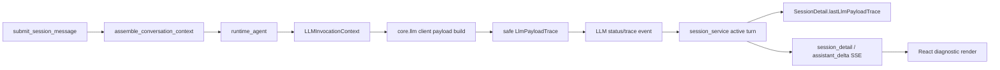

# Chat LLM Payload Trace Design

## Goal

Make the Vibelution chat-to-model chain transparent enough to debug and teach without logging raw prompts, secrets, full tool output, or unbounded model payloads.

The user-visible result is a safe turn-level diagnostic trace that answers:

- which session turn triggered the model call;
- which agent, LLM slot, model, provider, transport, and protocol were used;
- what shape of messages/tools/images/cache/thinking payload was sent;
- how that trace correlates with existing session context assembly and frontend streaming/render protocol.

## Current Evidence

The frontend stream/render path has already been split into focused protocol modules:

- `web/src/routes/chatTurnProtocol.ts`
- `web/src/routes/chatSessionStreamProtocol.ts`
- `web/src/routes/sessionAssistantDeltaScheduler.ts`
- `web/src/routes/chatStreamApplyController.ts`
- `web/src/routes/ChatCodingRoute.tsx`

The backend already carries most of the required identifiers:

- `agent.py` builds `LLMInvocationContext` with `sessionId`, `agentId`, `runId`, `llmSlot`, `modelId`, `promptPurpose`, and `dialogueChainMode`.
- `core/llm/invocation.py` merges the invocation context into metadata for `invoke_llm` and `stream_llm`.
- `core/llm/client.py` already computes safe summaries for message roles, payload route, payload shape, prompt cache, protocol, and thinking options.
- `core/web/services/session_service.py` records turn lifecycle, context composition, assistant deltas, LLM status, and conversation ledger events.

The missing piece is one durable, safe, turn-scoped trace object connecting these facts.

## Non-Goals

- Do not log full system prompts, user prompts, assistant text, tool results, attachments, secrets, API keys, raw provider payloads, or unbounded model output.
- Do not replace the current unified LLM invocation chain.
- Do not migrate the whole product to Codex JSON-RPC `turn/item` protocol in this round.
- Do not change provider routing, model selection, retry behavior, prompt cache behavior, or streaming semantics.
- Do not expose hidden prompt content through the frontend.

## Recommended Architecture

Add a safe `LlmPayloadTrace` object at the LLM payload boundary, then propagate it back into the active session turn.

The canonical creation point is after `core/llm/client.py` builds the provider payload and computes the existing safe summaries. That is the only layer that sees the final protocol-adapted payload shape and the provider/model route. The trace should be emitted through a bounded event hook rather than by importing `session_service.py` into `core/llm`, keeping the LLM layer independent of web services.

`session_service.py` should subscribe through the existing event/status context and persist the latest matching trace into the active turn/session projection. The public API should expose the latest safe trace as `SessionDetail.lastLlmPayloadTrace`, and optionally include it in live output while the turn is running.

The frontend should render this in an existing operational/debug surface near context/cache/model status, not as a large new page. It should show compact labels such as protocol, provider, model, role counts, message count, tool count, image block count, prompt cache mode, and trace id. Raw prompt viewing is explicitly excluded.

## Trace Shape

`LlmPayloadTrace` fields:

- `traceId`: stable short id for this model call.
- `recordedAt`: timestamp.
- `sessionId`: session id from `LLMInvocationContext`.
- `turnId`: turn id from `LLMInvocationContext.llmRunId`.
- `agentId`: runtime agent id.
- `llmSlot`: slot such as `dialogue` or `vision`.
- `modelId`: model id requested by runtime.
- `profileId`: resolved LLM profile id.
- `provider`: provider kind.
- `model`: resolved provider model.
- `transport`: resolved payload transport.
- `selectedProtocol`: protocol route selected by the LLM layer.
- `protocolSource`: source of protocol selection.
- `dialogueChainMode`: normalized mode such as `tool_chat`, `responses_agent`, `reasoning_chat`, or `basic_chat`.
- `stream`: whether this call used streaming.
- `promptPurpose`: prompt purpose such as `main_reply`.
- `messageCount`: logical message count.
- `messageRoleCounts`: safe count by role.
- `messageRoles`: ordered role summary without content.
- `toolCount`: bound/requested tool count.
- `imageBlockCount`: number of image blocks seen in the final payload summary.
- `payloadShape`: safe structural fields already computed by `core/llm/client.py`.
- `promptCache`: safe prompt-cache design and payload fields.
- `thinking`: safe thinking/reasoning request fields.
- `contextAssembly`: optional copy of already-safe session context assembly counts when available.
- `metadata`: only bounded, already-redacted route metadata.

The implementation may split this into nested objects if that matches the existing TypeScript/Python style, but the public API must keep the same facts visible.

## Data Flow

## Source Of Truth

| Fact | Canonical source | Writer | Readers / derived surfaces | Refresh or invalidation | Old source cleanup |
| --- | --- | --- | --- | --- | --- |
| LLM payload trace | safe trace emitted by `core/llm/client.py` after payload build | LLM client event emission | runtime-scene logs, session live state, session detail API, frontend diagnostics | overwritten per active turn by matching `sessionId` and `turnId`; persisted latest trace follows session projection | no old source; existing logs remain historical evidence |
| Session context assembly | `session_service.py` context composition record | session worker | session detail, live output, trace correlation | refreshed each turn before model call | unchanged |
| Frontend render protocol | `chatSessionStreamProtocol` and scheduler telemetry | frontend stream router | browser logs, render diagnostics | per SSE frame/drain | unchanged |

## Backend Design

1. Add a small safe trace builder/helper in `core/llm/client.py` or a focused `core/llm/payload_trace.py`.
2. Reuse existing safe summary functions instead of recomputing or inspecting raw prompt text.
3. Emit a bounded trace event from both `invoke` and `stream_events` after payload summaries are available.
4. Include trace metadata in runtime-scene logging for `llm.invoke.started`, `llm.stream.started`, success, failure, and downgrade paths where practical.
5. In `session_service.py`, listen for matching trace events under `llm_status_context(session_id, turn_id)` and update live/session projection.
6. Persist the latest safe trace into the session detail projection as `lastLlmPayloadTrace`.

## Frontend Design

1. Add TypeScript types for `SessionLlmPayloadTrace`.
2. Expose `lastLlmPayloadTrace?: SessionLlmPayloadTrace | null` on `SessionDetail`.
3. Render a compact diagnostic block in `ChatCodingRoute.tsx` near the existing context/cache/model status area.
4. Show trace facts as short rows or badges: provider, model, protocol, chain mode, messages, roles, tools, images, cache, thinking, trace id.
5. Keep copy operational and concise. Do not add tutorial prose inside the UI.

## Tests

Backend tests:

- Verify the trace builder includes protocol/provider/model/message/tool/cache/thinking facts.
- Verify raw message content is absent from the trace.
- Verify stream and invoke paths both emit trace metadata.
- Verify session detail exposes the latest matching trace for the active turn.

Frontend tests:

- Verify `SessionDetail` accepts `lastLlmPayloadTrace`.
- Verify the chat route source/render logic includes the diagnostic surface without changing assistant delta rendering.
- Keep existing stream protocol tests passing.

Validation commands:

- `pytest` focused backend tests for LLM trace/session detail.
- `npm --prefix web run test -- ...` focused route/API tests.
- `npm --prefix web run build`.
- `git diff --check`.

## Risks And Decisions

- Risk: accidental prompt leakage. Decision: trace uses counts, enums, hashes, and existing safe summaries only.
- Risk: coupling `core/llm` to web services. Decision: emit a generic trace/status event and let `session_service.py` subscribe.
- Risk: frontend clutter. Decision: compact operational diagnostics only, no raw prompt viewer and no large new page.
- Risk: hot-file conflicts. Decision: implement in isolated worktree with guard claim and scoped staging.

## Completion Criteria

- A new session turn can be correlated from user submit to LLM payload trace to frontend stream render.
- The trace is visible in session detail and in frontend diagnostics.
- Tests prove raw prompt content is not exposed.
- Existing assistant delta rendering behavior remains unchanged.
- The root workspace stays on `main`; work is committed on `codex/chat-llm-payload-trace` before merge.
