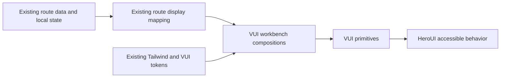

# HeroUI Frontend Unification Phase 3A Design

- **Date:** 2026-07-10
- **Status:** Approved in conversation; awaiting written-spec review
- **Scope:** Kernel, Usage, Logs, and Git operational routes
- **Parent design:** `docs/superpowers/specs/2026-07-10-heroui-frontend-unification-design.md`
- **Prior delivery:** Phase 1 AppShell/Chat and Phase 2 Agents/Teams/Memory
- **Deferred follow-up:** Phase 3B Evolution and Config
- **Version impact:** Design document `none`; implemented Phase 3A is expected to be `patch`

## Decision Summary

Phase 3 is split by behavioral risk. Phase 3A migrates the four operational routes whose product semantics can remain unchanged while their visible hierarchy converges on the Phase 1/2 VUI system:

- `/kernel` through `KernelTaskCenterRoute`;
- `/usage` through `UsageRoute`;
- `/logs` through `LogsRoute`;
- `/git` through `GitRoute`.

Evolution and Config remain Phase 3B because they combine larger route modules, workflow state machines, and operator configuration semantics. They require a separate design and implementation plan rather than sharing one broad multi-route change set with Phase 3A.

Phase 3A is a frontend visual and interaction-geometry migration. It does not change backend APIs, DTOs, query keys, cache behavior, Git commands, log deletion behavior, usage accounting, task lifecycle semantics, permissions, or operator configuration.

## User And Outcome

The primary user is the local Vibelution maintainer or operator. On each route, the first viewport must make it possible to answer quickly:

1. What is the current operational state?
2. Is there an anomaly or blocker?
3. Which object is selected?
4. What evidence or action should be inspected next?

The success criterion is not merely that components use HeroUI. The four routes must become a coherent, dense operational console while preserving their existing workflows and data ownership.

## Scope Boundaries

### In scope

- visual hierarchy, layout geometry, spacing, surfaces, rows, dividers, selection, and state treatment;
- replacement of repeated nested card walls with flat rows, metric strips, and a bounded number of meaningful panels;
- use or focused extension of existing VUI primitives and workbench compositions;
- content-sized text buttons and fixed square icon buttons;
- light and dark theme parity;
- stable desktop behavior at `1280×720`, `1440×900`, and `1920×1080`;
- explicit loading, empty, error, ready, busy, disabled, selected, and long-content contracts;
- focused route layout tests, VUI boundary tests, visual-matrix coverage, production build, and browser evidence.

### Out of scope

- `/supervised-evolution`, `/self-evolution`, and `/config` migration;
- route renaming, router redesign, or navigation-model changes;
- backend service, API, DTO, query-key, cache, or persistence changes;
- Git command, staging, commit, worktree, or repository semantics changes;
- log discovery, preview, cleanup, deletion, retention, or confirmation semantics changes;
- token/usage aggregation or source-of-truth changes;
- task queue, lifecycle, status, filtering, or orchestration behavior changes;
- new dependencies, a second design system, or direct route-level `@heroui/react` imports;
- a new mobile or touch design contract;
- unrelated component extraction or global design-foundation redesign.

## Shared Architecture

Phase 3A reuses the established ownership chain:

The route remains responsible for query, mutation, selection, scroll, resize, and product-state orchestration. VUI owns product visual semantics and geometry. HeroUI remains behind VUI and owns accessible interaction behavior, not product meaning.

Each major column receives at most one primary `VSurface`. Repeated content inside that surface is rendered as rows, metric cells, status strips, action groups, or state surfaces. A nested bordered child surface is allowed only when it has an independent selection, interaction, ownership, or error boundary.

The existing compositions are preferred before creating a new one:

- `VRouteHeader` for route identity and nearby actions;
- `VMetricStrip` or the established status-strip equivalent for comparable facts;
- `VStateSurface` for loading, empty, error, unavailable, and clean states;
- `VActionGroup` for local primary, secondary, and destructive actions;
- `VSurface` for the major workspace columns.

Any new composition must be justified by a pattern shared by at least two Phase 3A routes. Route-local product components remain acceptable when their meaning is not shared.

## Route Design

### Kernel

Kernel keeps its three-column task-center workflow:

- left: queue, filtering, and task selection;
- center: selected-task facts and detail;
- right: lifecycle and evidence history.

The large task-button wall becomes a compact semantic row list. A task row may remain a full-width action because selecting the whole row is the intended interaction target. Each row shows only the task identity, status, owner or Agent when available, and the most useful time fact. Supplemental explanation belongs in a Tooltip or the selected detail panel.

The selected task uses a visible background, border, and type-weight change; selection never relies on color alone. The center panel uses a compact fact/metric strip followed by bounded sections. Lifecycle entries are flat timeline rows with stable alignment, not individual cards.

Loading, no tasks, filter-empty, missing selection, and API error states preserve the three-column geometry. A filter-empty state must distinguish “no matching tasks” from “the queue contains no tasks.” Existing filtering, selection, queue actions, status mapping, and lifecycle semantics remain unchanged.

### Usage

Usage remains the lightest Phase 3A route. Its top comparable totals become a single metric strip rather than separate statistic cards. The main content remains a two-column operational layout: usage composition and recent/source detail.

Composition data is shown as aligned rows or bars inside one surface. Recent records remain flat rows. No-data states must say “尚未调用” or “暂无记录” according to the existing data meaning; absence must not be presented as a successful zero-valued measurement.

Usage source, freshness, partial data, or unsupported data remains directly legible through the existing route facts or a compact status strip. This phase does not recalculate usage, infer missing values, or change usage normalization.

### Logs

Logs preserves its resizable three-column workspace:

- left: runtime-scene or package selection;
- center: summary and raw/structured preview;
- right: files, sections, or navigation within the selected package.

The left and right collections become flat selected rows. The preview remains one bounded panel or code surface with its own scroll region. Resizers, selection, raw preview behavior, file navigation, and existing loading paths remain intact.

Long paths and identifiers use `min-width: 0`, truncation, and a hover/focus Tooltip or equivalent accessible full-value disclosure. They must not widen the page or hide the complete value permanently. Page-level horizontal scrolling is forbidden; horizontal scrolling is allowed only inside a content surface whose data intrinsically requires it, such as a raw code preview.

The route distinguishes index loading, preview loading, missing log root, empty package, partial package, unsupported preview, and request error without discarding trustworthy adjacent data. Cleanup or deletion stays visually separated as a destructive action, preserves the existing confirmation flow, and never becomes automatic.

### Git

Git preserves its three-part workflow:

- left: changed-file selection;
- center: repository overview or selected diff;
- right: manual commit controls and related facts.

Changed files become compact selectable rows. The center workspace uses one surface for overview, diff, loading, clean, or error content. The right panel keeps commit input and action semantics close together. Existing selected-file, staging, commit, branch, repository, and worktree behavior remains unchanged.

The clean state is informative rather than blank: it should retain existing branch, worktree, repository, and local-commit facts that are already available to the route. It must not manufacture server synchronization or remote-readiness claims.

Commit controls keep stable labels and geometry while busy. Disabled controls directly expose critical blockers and use a concise Tooltip for local disabled reasons where appropriate. No existing confirmation, repository guard, or command boundary may be weakened by the visual migration.

## Shared State Contract

### Loading

- Render inside the final column and panel geometry.
- Reserve expected toolbar, row, and action dimensions with stable placeholders or skeletons.
- Do not replace a known three-column route with a blank full-page spinner.
- Separate independently loading regions when adjacent data remains trustworthy.

### Empty and clean

- Identify the empty scope precisely.
- Provide one recommended next action only when the existing product workflow offers one.
- Distinguish globally empty, filter-empty, no selection, no recent data, and clean repository states.
- Avoid tutorial prose and decorative empty bands.

### Error, unavailable, and partial

- Name the failed scope and its user impact.
- Preserve usable adjacent data.
- Show retry or recovery only when the existing route provides it.
- Label partial, stale, unsupported, or unavailable data honestly.
- Keep full errors and critical blockers directly visible rather than Tooltip-only.

### Selected, hover, and focus

- Selected rows use more than color alone.
- Hover must not resize rows or action groups.
- Keyboard focus remains visible in both themes.
- Icon-only actions have accessible names and concise hover/focus Tooltips.

### Disabled and busy

- Preserve control dimensions and stable labels.
- Prevent duplicate actions through the existing behavior.
- Directly show critical permission, repository, destructive, or state blockers.
- Use `aria-busy` or the established VUI equivalent when applicable.

### Destructive

- Visually separate destructive actions from primary actions.
- Preserve existing confirmation, failure, and backend convergence behavior.
- Never hide irreversible consequences in a Tooltip.

## Desktop Layout Contract

Phase 3A is desktop-only and validates exactly three viewports:

| Viewport | Contract |
| --- | --- |
| `1920×1080` | Keep the complete multi-column workspace with comfortable but bounded spacing and no oversized empty bands. |
| `1440×900` | Reference layout; retain the full information architecture with compact operational spacing. |
| `1280×720` | Minimum supported desktop; narrow auxiliary rails before the primary workspace, retain existing resizers, and avoid page-level horizontal overflow. |

The implementation does not add a new mobile contract. Existing narrow-width compatibility must not be removed or deliberately broken. Normal resizing must not clip actions, overlap controls, cover content with fixed elements, or cause selection/loading transitions to shift the whole layout.

All route checks include realistic long Chinese and English labels, task IDs, paths, branch names, and diff lines.

## Interaction Geometry

- Text buttons hug their content with stable height and bounded padding.
- Icon-only actions are square and match the corresponding text-button height.
- A full-width button is allowed only when the complete row is the semantic target, such as a selectable task or file row.
- Toolbars do not stretch short-label actions across unused width.
- One local primary action is visible per action group; secondary and destructive actions are visually distinct.
- Loading indicators, badges, and changing labels do not resize their container.
- Explanatory text that is not critical leaves the primary operational surface for a Tooltip or bounded detail disclosure.

## Implementation Sequence

The implementation plan must keep Phase 3A as one bounded program but split delivery into two internally reviewable groups:

1. **Kernel and Usage:** establish shared operational row, metric, state, and selection treatments on the lower-destructive-risk routes.
2. **Logs and Git:** apply the proven treatments while preserving preview, resizer, cleanup, repository, and commit boundaries.

The second group does not start until the first group’s focused tests and scoped diff review pass. Commits may be split by group so a failed Logs/Git migration can be reverted without losing Kernel/Usage progress.

## Validation Contract

### Focused automated tests

At minimum, update and run:

- `web/src/routes/KernelTaskCenterRoute.layout.test.ts`;
- `web/src/routes/UsageRoute.layout.test.ts`;
- `web/src/routes/LogsRoute.layout.test.ts`;
- `web/src/routes/GitRoute.layout.test.ts`;
- affected VUI primitive or composition tests;
- `web/src/components/vui/vuiImportBoundary.test.ts`;
- `web/src/visual-regression/workbenchvisualmatrix.test.ts`.

Tests assert product-visible contracts rather than mocked HeroUI implementation details. They cover primary surface count, flat repeated rows, content-width controls, selected state, stable loading geometry, explicit empty/error states, long-content containment, destructive-action separation, and absence of direct route-level HeroUI imports.

### Build and static review

- run the narrowest relevant Vitest command for the four routes and touched VUI contracts;
- run `npm --prefix web run build`;
- run scoped `git diff --check`;
- review the exact current-task diff and final file list;
- confirm no backend, API, DTO, query-key, usage-source, Git-command, or log-delete behavior entered the diff.

### Browser evidence

The stable-state matrix is four routes × two themes × three desktop viewports, for 24 checks:

| Route | Light | Dark | Viewports |
| --- | --- | --- | --- |
| Kernel | required | required | `1280×720`, `1440×900`, `1920×1080` |
| Usage | required | required | `1280×720`, `1440×900`, `1920×1080` |
| Logs | required | required | `1280×720`, `1440×900`, `1920×1080` |
| Git | required | required | `1280×720`, `1440×900`, `1920×1080` |

Browser verification also checks representative loading, empty/clean, error/unavailable, selected, disabled/busy, destructive, and long-content states. Where a live state cannot be safely forced, a focused render test or controlled fixture supplies the evidence. Every live route check includes page-level overflow, inner-scroll containment, visible focus/action geometry, and application console error review.

## Logging, Launcher, Memory, And Version

- **Logging:** Phase 3A is visual-only and does not add runtime-scene logging. If implementation discovers a required action or behavior change, that change leaves Phase 3A scope and requires a new decision before proceeding.
- **Launcher:** a Launcher refresh is required before final runtime/browser verification because frontend build inputs change. Active-work guards remain authoritative; force takeover is not implied by this design.
- **Project memory:** the design-doc round does not update durable project memory. A completed implementation must sync or hand off the `web-workbench-surface` lane after fresh mainline validation.
- **Version:** this design document has no version impact. The localized user-visible frontend migration is expected to have patch impact; no implementation Agent edits `VERSION`, `CHANGELOG.md`, or package versions without a separate release decision.
- **Remote:** no push, PR, publication, force operation, or remote branch cleanup is authorized.

## Risks And Mitigations

- **Task and file rows become oversized buttons.** Permit full-row actions only for semantic selection and keep their internal geometry compact.
- **Soft surfaces recreate a card wall.** Limit primary surfaces to major columns and render repeated records flat.
- **Long paths or diffs break the workspace.** Require `min-width: 0`, truncation/full-value disclosure, and inner scrolling for intrinsically wide content.
- **Empty states hide operational facts.** Preserve route facts around Kernel selection, Usage provenance, Git repository state, and trustworthy Logs metadata.
- **Visual work changes destructive behavior.** Keep existing cleanup, commit, and confirmation paths untouched and verify their existing focused tests.
- **Four routes create an unverifiable diff.** Deliver Kernel/Usage before Logs/Git, use scoped claims and commits, and stop on shared-hot-file or semantic drift.
- **Evolution/Config scope leaks back in.** Treat any edit to their route modules as out of scope and defer it to Phase 3B.

## Recovery Strategy

- Implement in a scoped `codex/` task worktree based on current local `main`.
- Keep Kernel/Usage and Logs/Git in separately reviewable commits.
- If a shared VUI change regresses a completed route, repair the shared contract or revert that scoped commit; do not add route-specific HeroUI exceptions.
- Preserve existing data/state contracts so visual commits remain reversible.
- Do not reset, delete, or overwrite unrelated root or worktree changes.

## Completion Criteria

Phase 3A is complete only when:

- Kernel, Usage, Logs, and Git use the established VUI ownership boundary without new direct route-level HeroUI imports;
- repeated operational content is flat and compact instead of a nested card wall;
- major columns use a bounded number of meaningful surfaces;
- buttons, icon actions, selected rows, metrics, state surfaces, and destructive groups follow the shared geometry contract;
- existing query, mutation, selection, resize, preview, cleanup, usage, Git, and task-lifecycle semantics remain unchanged;
- loading, empty/clean, error/unavailable, partial, selected, disabled/busy, destructive, and long-content states are explicit and stable;
- all 24 stable browser combinations and representative boundary states have evidence;
- focused tests, VUI import boundary, visual matrix, production build, diff check, browser overflow, and console review pass;
- Launcher refresh and live verification are complete or explicitly blocked by the standard active-work message;
- scoped diff review, Git status, project-memory decision, version-impact judgment, and claim release are recorded;
- Evolution and Config remain untouched and explicitly deferred to Phase 3B.
