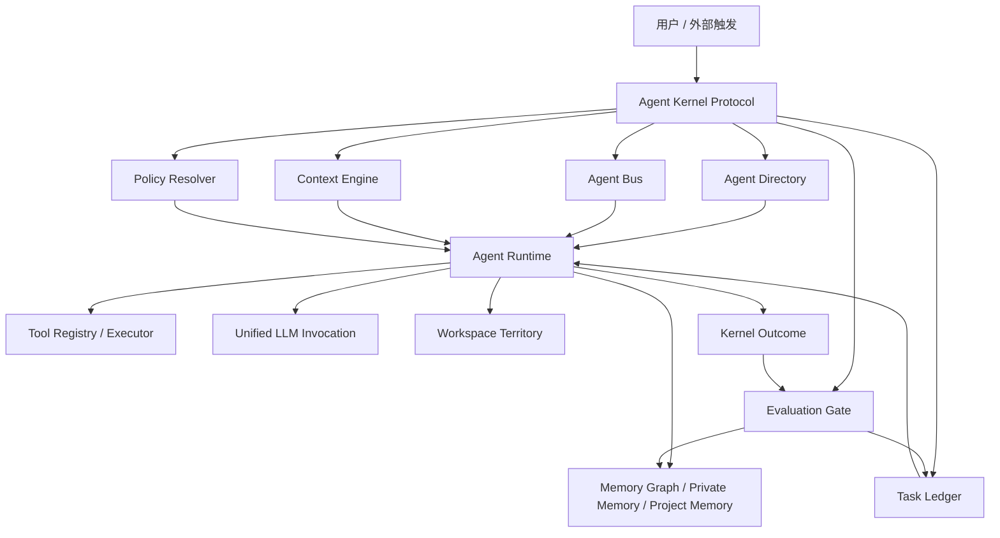

# Vibelution Agent Kernel Protocol 规划草案

日期：2026-06-19
状态：供用户与架构评审的草案
归属分线：agent-runtime-core
范围：仅规划文档，不包含实现改动

## 1. 文档目的

本文提出 Vibelution 的第一版 Agent 内核协议规划，暂名为 `VAKP`，即 `Vibelution Agent Kernel Protocol`。

这个协议的目标不是立刻做一个庞大的中央调度器，而是先把 Vibelution 现有的会话、群聊、科研、监督进化、自进化、工具、模型、记忆、工作区、Agent 配置等能力收束到一组稳定对象和事件协议上。

换句话说，Vibelution 下一阶段要先成为一套清晰的 Agent OS，再逐步承载更通用的智能行为。

## 2. 当前基础判断

Vibelution 已经具备很多关键底座：

- `AgentInstance` 和 Agent Directory 已经形成长期 Agent 身份方向。
- 统一 Agent 配置规划已经把模型、提示词、工具、记忆、workspace、mode binding 分层。
- WorkRun 规划已经把 chat turn、supervised run、self-evolution run 统一到运行基底方向。
- Runtime scene 已经能记录启动、运行、失败、恢复等证据。
- Tool Registry、Tool Executor、Tool Governance、LLM 调用链、Context Engine、Memory Graph、Project Memory、Teams、ChatRoom、Supervised Evolution 等模块已经存在。

现在的关键问题不是缺功能，而是这些功能还没有被同一套“内核协议”约束。不同页面和模式仍可能各自维护状态、绑定、任务和事件，导致用户难以判断：

- 当前谁在工作；
- 谁有权限做什么；
- 哪个任务成功或失败；
- 哪些内容进入了记忆；
- 哪些自进化建议只是参考，哪些真的生效了。

## 3. 产品目标

目标体验如下：

1. 用户只在一个 Agent Center 中创建和配置长期 Agent。
2. 每个 Agent 都有稳定名字、代号、模型策略、工具权限、记忆边界、workspace 领地、会话能力、群聊能力和监督策略。
3. 用户提出一个高层目标后，平台能把它登记为任务，并分配给一个或多个 Agent。
4. Agent 可以和用户、群聊、其他 Agent 交流，交流统一走 Agent Bus。
5. Agent 即使未运行，也可以接收 inbox 消息，后续按唤醒策略处理。
6. 所有重要执行都进入 Task Ledger，用户能看到状态、负责人、证据、结果和失败原因。
7. 记忆写入、工具权限调整、自进化建议、代码修改都通过 Evaluation Gate，而不是静默生效。

一句话目标：

```text
把 Vibelution 从“多个 Agent 功能页面”收束成“一个可治理、可扩展、可观察的 Agent 操作系统”。
```

## 4. 非目标

第一版内核协议不做这些事：

- 不直接重写所有现有服务。
- 不把 chat、research、supervised evolution、self-evolution 合成一个巨大服务。
- 不绕过现有 LLM invocation chain 新建模型调用路径。
- 不让 Agent 默认拥有写长期记忆、改工具权限、改项目代码的自由。
- 不在同一阶段重做全部 UI。
- 不一次性删除兼容读取逻辑。
- 不做无限自我复制式 sub-agent。
- 不把自进化建议直接变成长期原则。

## 5. 设计原则

### 5.1 协议先于页面

页面只是展示和编辑协议对象。不要再让每个页面私有维护一套 Agent、任务、消息或记忆状态。

### 5.2 Agent 身份是一等对象

会话 Agent、群聊 Agent、科研 Agent、监督角色 Agent、自进化角色 Agent，本质上都应该来自同一种长期身份对象。

临时 sub-agent 是一次运行，不是长期配置项。

### 5.3 策略引用，不重复配置

Agent 卡片上应绑定策略，而不是复制完整配置。

例如：

- 模型配置在设置页维护，Agent 绑定 `ModelPolicy`。
- 工具定义在工具库维护，Agent 绑定 `ToolPolicy`。
- 记忆系统维护存储与图谱，Agent 绑定 `MemoryPolicy`。
- workspace 管理领地和写入规则，Agent 绑定 `WorkspacePolicy`。

### 5.4 每个重要动作都有证据

任何可能失败、卡住、重试、降级、修复、写入、删除、调用工具的行为，都应该留下有界证据。

证据不应包含密钥、完整提示词、完整私有记忆、完整大输出。

### 5.5 长期沉淀默认走提案

Agent 可以提出记忆、策略、提示词、工具权限、代码修改建议，但不应默认直接写入项目级长期状态。

### 5.6 用户要看得懂系统正在做什么

Vibelution 的通用化不是“后台越来越自动”，而是“自动化过程越来越可见、可控、可回滚”。

## 6. 内核核心对象

第一版协议建议包含七组核心对象：

```text
AgentIdentity
CapabilityPolicy
TaskLedgerEntry
AgentEvent
ContextPacket
KernelOutcome
EvaluationGate
```

## 7. AgentIdentity

`AgentIdentity` 表示长期 Agent 身份。

建议字段：

```ts
type AgentIdentity = {
  agentId: string;
  codeName: string;
  displayName: string;
  kind: "persistent";
  primaryMode:
    | "chat"
    | "group_chat"
    | "research"
    | "self_evolution"
    | "supervised_evolution"
    | "operations"
    | "custom";
  roleKey: string;
  status: "active" | "paused" | "archived";
  modelPolicyId: string;
  promptTemplateId: string;
  toolPolicyId: string;
  memoryPolicyId: string;
  workspacePolicyId: string;
  communicationPolicyId: string;
  supervisionPolicyId: string;
  childAgentPolicyId: string;
  directSessionId?: string;
  createdAt: string;
  updatedAt: string;
};
```

和现有设计的关系：

- 它应基于已有 `AgentInstance` 扩展，而不是重建一套 Agent。
- 现有 `agentCode`、`profileId`、`toolPolicyId`、`memoryPolicyId`、`workspacePath` 等字段可以映射进来。
- UI 可以继续叫 Agent 卡片或 Agent Center，协议层保持稳定即可。

## 8. CapabilityPolicy

能力策略用于回答“这个 Agent 能做什么、不能做什么、需要谁批准”。

建议拆成几类策略。

### 8.1 ModelPolicy

```ts
type ModelPolicy = {
  modelPolicyId: string;
  dialogueModelRef?: string;
  reasoningModelRef?: string;
  imageModelRef?: string;
  embeddingModelRef?: string;
  fallbackModelRefs: string[];
};
```

模型本身仍由设置页模型库维护。Agent 只选择策略或模型模板引用。

### 8.2 ToolPolicy

```ts
type ToolPolicy = {
  toolPolicyId: string;
  allowedTools: string[];
  deniedTools: string[];
  approvalRequiredFor: string[];
  sideEffectLevel: "none" | "read" | "write" | "destructive";
};
```

后续“顾问 Agent 给其他 Agent 分配工具权限”应当通过修改或提议修改 `ToolPolicy` 完成。

### 8.3 MemoryPolicy

```ts
type MemoryPolicy = {
  memoryPolicyId: string;
  readableScopes: string[];
  writableScopes: string[];
  defaultWriteMode:
    | "none"
    | "private_proposal"
    | "private_direct"
    | "project_proposal";
  promotionRequired: boolean;
};
```

建议默认：

- 私有记忆可以先走 proposal-first；
- 项目记忆必须走项目级审查；
- 自进化建议只作为参考，除非显式提升。

### 8.4 WorkspacePolicy

```ts
type WorkspacePolicy = {
  workspacePolicyId: string;
  root: string;
  allowedPaths: string[];
  forbiddenPaths: string[];
  claimRequired: boolean;
  destructiveActionPolicy: "deny" | "approval_required" | "allow";
};
```

这个策略用于解决“每个 Agent 都有自己的领地”的问题。

## 9. TaskLedgerEntry

`TaskLedgerEntry` 是平台中“正在做什么”的统一事实。

建议字段：

```ts
type TaskLedgerEntry = {
  taskId: string;
  goal: string;
  requester: {
    type: "user" | "agent" | "system";
    id: string;
  };
  assignedAgentIds: string[];
  status:
    | "queued"
    | "running"
    | "waiting"
    | "succeeded"
    | "failed"
    | "cancelled"
    | "blocked";
  priority: "low" | "normal" | "high" | "urgent";
  mode:
    | "chat"
    | "group_chat"
    | "research"
    | "supervised"
    | "self_evolution"
    | "background";
  parentTaskId?: string;
  workRunId?: string;
  sessionId?: string;
  roomId?: string;
  teamId?: string;
  requiredCapabilities: string[];
  evidenceRefs: EvidenceRef[];
  resultSummary?: string;
  failureReason?: string;
  createdAt: string;
  updatedAt: string;
};
```

Task Ledger 最终应统一显示：

- 会话回合；
- 群聊轮次；
- Agent 对 Agent 消息；
- 科研工作流阶段；
- Teams 阶段；
- 监督进化运行；
- 自进化提案；
- 工具后台任务；
- image2 生图任务；
- worktree 代码任务。

## 10. AgentEvent

`AgentEvent` 是 Agent Bus 的基础事件。

建议字段：

```ts
type AgentEvent = {
  eventId: string;
  type:
    | "agent.message.sent"
    | "agent.message.received"
    | "agent.reply.requested"
    | "agent.task.assigned"
    | "agent.task.updated"
    | "agent.tool.requested"
    | "agent.tool.completed"
    | "agent.memory.proposed"
    | "agent.supervision.required"
    | "agent.result.submitted"
    | "agent.failure.reported";
  sender: {
    type: "user" | "agent" | "system";
    id: string;
  };
  recipients: Array<{
    type: "user" | "agent" | "room" | "team";
    id: string;
  }>;
  taskId?: string;
  sessionId?: string;
  roomId?: string;
  workRunId?: string;
  payload: Record<string, unknown>;
  deliveryPolicy: "online_only" | "inbox" | "wake_if_needed";
  requiresReply: boolean;
  status: "queued" | "delivered" | "handled" | "failed" | "cancelled";
  createdAt: string;
};
```

核心规则：

- 普通会话消息是事件。
- 群聊消息是事件。
- Agent 给 Agent 发消息也是事件。
- 离线 Agent 接收 inbox 事件。
- 是否唤醒 Agent 是调度策略，不是消息写入本身决定。

## 11. ContextPacket 与 ContextManifest

`ContextPacket` 定义 Agent 在一次运行前看到什么。

实现上不建议把每次完整上下文都作为大对象持久化。第一版协议应把上下文拆成：

```text
ContextManifest = 可追踪、可保存、可复现的上下文清单
ContextPacket = 运行时实际交给 Agent 的上下文视图
ContextResolver = 按权限和引用延迟解析上下文内容
```

也就是说，协议层保留 `ContextPacket` 作为概念，但实现层优先使用 `ContextManifest + lazy resolver`，避免每次执行都复制大段会话、记忆、工具输出和 workspace 状态。

建议字段：

```ts
type ContextPacket = {
  packetId: string;
  agentId: string;
  taskId?: string;
  workRunId?: string;
  sessionId?: string;
  roomId?: string;
  mode: string;
  conversationWindow: ContextSegment[];
  roomMessages: ContextSegment[];
  inboxMessages: ContextSegment[];
  privateMemory: ContextSegment[];
  projectMemory: ContextSegment[];
  toolState: ContextSegment[];
  workspaceState: ContextSegment[];
  constraints: string[];
  expectedOutput: string;
  omittedContextSummary?: string;
  createdAt: string;
};
```

上下文规则：

- 默认最小上下文。
- 每段记忆都要能说明来源和权限原因。
- 群聊内容必须保留发言者身份。
- 工具结果过大时只进入摘要和引用。
- 未授权项目记忆不能默认进入 Agent 上下文。
- 长上下文应保存引用、摘要、hash、range，而不是无界复制全文。
- 持久化优先保存 `ContextManifest`，运行时再解析成 `ContextPacket`。

建议补充的 `ContextManifest` 字段：

```ts
type ContextManifest = {
  manifestId: string;
  agentId: string;
  taskId?: string;
  workRunId?: string;
  sessionId?: string;
  roomId?: string;
  sourceRefs: ContextSourceRef[];
  omittedRefs: ContextSourceRef[];
  resolverPolicyId: string;
  tokenBudget?: number;
  summary: string;
  createdAt: string;
};
```

这样未来可以支持：

- 运行时按需取上下文；
- 失败后重建“当时看到了什么”；
- 大上下文缓存；
- 权限审计；
- context diff；
- 后续多 Agent 共享部分上下文但不共享全部私有记忆。

## 12. KernelOutcome

`KernelOutcome` 统一 Agent 执行后的返回结果。

建议字段：

```ts
type KernelOutcome = {
  outcomeId: string;
  taskId?: string;
  workRunId?: string;
  agentId: string;
  visibleReply?: string;
  taskResult?: {
    status: "succeeded" | "failed" | "partial" | "blocked";
    summary: string;
  };
  memoryProposals: MemoryProposal[];
  policyProposals: PolicyProposal[];
  codeChangeProposals: CodeChangeProposal[];
  followupTaskProposals: FollowupTaskProposal[];
  evidenceRefs: EvidenceRef[];
  createdAt: string;
};
```

它要明确区分：

- 用户看见的回复；
- 任务账本记录的结果；
- 可以进入记忆的提案；
- 需要监督或用户确认的变更；
- 后续任务建议。

## 13. EvaluationGate

`EvaluationGate` 决定哪些结果可以沉淀。

可处理对象：

- 私有记忆；
- 项目记忆；
- 工具权限变更；
- 模型或提示词策略变更；
- 自进化参考；
- supervised case；
- worktree 代码变更。

建议状态：

```text
draft
needs_review
approved
rejected
applied
superseded
rolled_back
```

默认规则：

- 普通可见回复不需要 promotion。
- 私有记忆可以 proposal-first。
- 项目记忆需要用户或项目治理确认。
- 工具权限和策略变化需要审查。
- 代码和配置变化必须走 worktree、claim、validation、merge。
- 自进化输出默认是参考，不能直接变成长期原则。

第一版不应把 `EvaluationGate` 做成同步阻塞函数。它应是异步 proposal state machine。

建议状态机：

```text
draft
queued
reviewing
needs_user_decision
approved
rejected
applied
expired
conflict
superseded
rolled_back
```

关键规则：

- runtime 可以继续执行，不必等待所有 proposal 立刻评审。
- proposal 进入 `queued` 后由用户、监督 Agent、或指定 reviewer 处理。
- 需要用户确认的 proposal 不能被普通 Agent 自动批准。
- 自动批准只允许用于低风险、明确授权、可回滚的 proposal。
- `applied` 必须记录 applied evidence。
- `conflict` 必须说明冲突对象，例如 memory version、policy version、workspace file 或 task status。
- proposal 超时不能静默应用，应进入 `expired` 或升级为 `needs_user_decision`。

## 14. 高层架构



## 15. 现有模块映射

| 内核职责 | 当前或规划中的模块 |
|---|---|
| Agent 身份 | `core/web/services/agent_directory_service.py` |
| Agent 模式绑定 | `core/web/services/agent_mode_binding_service.py` |
| 工具注册 | `core/web/services/tool_registry_service.py` |
| 工具执行 | `core/infrastructure/tool_executor.py` |
| 工具治理 | `core/web/services/agent_tool_governance_service.py` |
| LLM 调用 | `core/llm/*` |
| 上下文组装 | `core/orchestration/context_engine.py` |
| 会话 | `core/web/services/session_service.py` |
| 群聊 | `core/web/services/chat_room_service.py` |
| Agent 消息总线 | `core/web/services/project_agent_bus_service.py` |
| 记忆图谱 | `core/web/services/memory_graph_service.py` |
| 记忆服务 | `core/web/services/memory_service.py` |
| 团队知识 | `core/web/services/team_knowledge_service.py` |
| 任务运行 | WorkRun substrate, `core/runtime_manager/*` |
| 监督进化 | `core/web/services/supervised_*`, `core/evaluation/supervised_evolution.py` |
| 自进化 | `core/web/services/self_evolution_*`, `core/evaluation/self_evolution_*` |
| 运行证据 | `logs/runtime_scenes/*` |

## 16. 核心流程

### 16.1 用户发起普通会话

1. 用户在会话中发送消息。
2. Session Service 创建或解析 `TaskLedgerEntry`。
3. Agent binding 解析为 `AgentIdentity`。
4. Kernel 产生 `agent.message.sent` 和 `agent.task.assigned` 事件。
5. Context Engine 构建 `ContextPacket`。
6. Agent Runtime 通过统一 LLM 调用链和 Tool Registry 执行。
7. Runtime 返回 `KernelOutcome`。
8. 可见回复写入会话。
9. Task Ledger 记录状态、结果和证据。
10. 记忆或策略建议进入 `EvaluationGate`。

### 16.2 Agent 给另一个 Agent 发消息

1. 发送方 Agent 产生 `agent.message.sent`。
2. Agent Bus 将事件写入接收方 inbox。
3. 如果策略允许唤醒，Scheduler 创建后续任务。
4. 接收方 Agent 获取包含 inbox 消息的 `ContextPacket`。
5. 接收方回复也通过 Agent Bus。
6. 回复可以投影到会话、群聊或任务账本。

### 16.3 群聊轮次

1. Room 保存参与者 Agent ID。
2. 用户或系统创建群聊任务。
3. Scheduler 选择讨论模式：轮询、抢占式、主持人主导。
4. 每个参与者拿到包含 room messages 和 speaker identity 的上下文。
5. 每次回复都是 AgentEvent，也是 room message。
6. Task Ledger 记录轮次、参与者、状态和总结。

### 16.4 科研工作流阶段

1. Team workflow stage 进入 Task Ledger。
2. stage binding 解析到 Agent ID。
3. Agent 获取科研上下文、工具权限和知识范围。
4. 来源、证据、图谱、产物通过 `EvidenceRef` 关联。
5. 正式记忆写入走 proposal 和 promotion。

### 16.5 自进化建议

1. 自进化 Agent 产出记忆、提示词、工具权限、策略或代码建议。
2. 建议作为 `KernelOutcome` 记录。
3. Evaluation Gate 标记为 `needs_review`。
4. 用户、监督 Agent 或 supervised run 评审。
5. 只有批准后的建议才能应用。
6. 代码变更仍必须走 worktree、claim、validation、merge。

## 17. 存储方向

第一版可以沿用 Vibelution 当前 local-first 风格，先用 JSON/JSONL，后续再根据性能证据决定是否引入 SQLite 或混合索引。

建议初始目录：

```text
workspace/agent_kernel/
  agents/
  policies/
  task_ledger/
    tasks.jsonl
    indexes/
  agent_bus/
    events.jsonl
    inboxes/
  outcomes/
  proposals/
  context_packets/
```

待确认问题：

- Task Ledger 用 JSONL、SQLite，还是混合？
- Agent inbox 是每个 Agent 一个 JSONL，还是统一事件表加索引？
- ContextPacket 是否完整持久化，还是只保留摘要和证据引用？
- 中间上下文和 inbox 事件保留多久？

## 18. API 草案

### 18.1 Kernel Task API

```http
GET /api/kernel/status
GET /api/kernel/tasks
GET /api/kernel/tasks/{taskId}
POST /api/kernel/tasks
PATCH /api/kernel/tasks/{taskId}
```

### 18.2 Agent Bus API

```http
GET /api/kernel/events
POST /api/kernel/events
GET /api/agents/{agentId}/inbox
POST /api/agents/{agentId}/inbox/{eventId}/ack
```

### 18.3 Policy API

```http
GET /api/agent-policies
GET /api/agent-policies/{policyId}
PATCH /api/agent-policies/{policyId}
```

实现时可以按 policy 类型拆分服务，避免单个服务过大。

### 18.4 Proposal API

```http
GET /api/kernel/proposals
GET /api/kernel/proposals/{proposalId}
POST /api/kernel/proposals/{proposalId}/approve
POST /api/kernel/proposals/{proposalId}/reject
POST /api/kernel/proposals/{proposalId}/apply
```

## 19. UI 方向

协议稳定后，UI 最终应收束成四个主入口。

### 19.1 Agent Center

唯一长期 Agent 配置点。

应展示：

- 身份和代号；
- 模式分组；
- 模型策略；
- 提示词模板；
- 工具策略；
- 记忆策略；
- workspace 策略；
- 通信策略；
- 监督策略；
- 子 Agent 策略；
- 直接会话；
- 正在使用它的 room、team、task。

### 19.2 Task Center

回答“平台现在在做什么”。

应展示：

- queued、running、waiting、failed、blocked、succeeded；
- owner Agent；
- linked session、room、team、worktree；
- evidence refs；
- failure reason；
- approval needs；
- next action。

### 19.3 Communication Center

专门管理群聊和 Agent 消息。

应包含：

- rooms；
- participants；
- discussion mode；
- inboxes；
- direct Agent messages；
- wake policies；
- moderation policies。

### 19.4 Governance Center

专门处理提案和沉淀。

应包含：

- memory proposals；
- policy proposals；
- tool permission proposals；
- self-evolution suggestions；
- code/worktree proposals；
- supervised review results。

现有页面不需要立刻消失。第一阶段目标是让它们逐步读写同一批协议对象。

## 20. 分阶段实施路线

### Phase 0：评审与 ADR

交付：

- 本文档由用户评审和修改；
- 增加一份 ADR，确认 Agent Kernel Protocol 方向；
- 锁定第一实现切片。

不改运行行为。

验证：

- markdown review；
- 和已有统一 Agent 配置、WorkRun 规划做一致性审查。

### Phase 1：Kernel DTO 与存储骨架

目标：

- 增加低风险协议对象和 JSONL 存储 helper，不接入真实运行。

候选文件：

```text
core/agent_kernel/models.py
core/agent_kernel/store.py
core/agent_kernel/events.py
tests/test_agent_kernel_models.py
tests/test_agent_kernel_store.py
```

行为：

- 定义 `TaskLedgerEntry`、`EventEnvelope`、`SemanticPayload`、`AgentEvent`、`KernelOutcome`、`EvidenceRef`、`ContextManifest`；
- 支持 JSONL append/read；
- 做字段校验；
- 支持 `correlationId`、`causationId`、`idempotencyKey`；
- 不改 session、room、research 运行逻辑。

验证：

- DTO normalization tests；
- JSONL append/read tests；
- `py_compile`；
- `git diff --check`。

### Phase 2：Agent 身份与策略桥接

目标：

- 把现有 Agent Directory 和 policy 服务映射到内核模型。

行为：

- `AgentInstance` 映射为 `AgentIdentity`；
- 暴露 policy refs；
- 不复制完整模型、工具、提示词内容；
- 缺失 policy link 时给出 repair warning。

验证：

- Agent Directory tests；
- Agent config workspace tests；
- 不触碰 UI 写入路径，除非另行确认。

### Phase 3：Task Ledger 最小切片

目标：

- 选择一个入口，把真实动作登记到 Task Ledger。

建议入口：

- direct chat turn，或
- Agent-to-Agent message。

行为：

- 创建任务；
- 更新任务状态；
- 记录 evidence refs；
- 记录 outcome。
- 用 `idempotencyKey` 防止同一输入重复创建 task。
- 明确 TaskLedger 是用户态任务事实源，Session/Room 只是 projection。

验证：

- service test 证明一次消息会创建和关闭 task；
- 原有会话可见行为不变，最多增加任务元数据。

### Phase 4：Agent Bus 最小切片

目标：

- 支持 Agent inbox 事件。

行为：

- Agent A 可以给 Agent B 发消息；
- Agent B inbox 记录事件；
- 未运行 Agent 不丢消息；
- wake policy 默认可以先设为不自动唤醒；
- 后续再支持自动唤醒。

验证：

- event append/read tests；
- inbox ack tests；
- denied wake policy test；
- failed delivery runtime scene event。

### Phase 5：会话与群聊收束

目标：

- direct session 和 group room 都逐步通过 Agent Bus 和 Task Ledger 表达。

行为：

- room message 是 AgentEvent；
- session message 是 AgentEvent；
- participant 来自 Agent Directory；
- 群聊讨论模式成为 task metadata。

验证：

- ChatRoom service tests；
- session service tests；
- 如果改 UI，补 React Query/cache invalidation tests。

### Phase 6：Evaluation Gate 与提案治理

目标：

- 统一 memory、policy、自进化、代码建议的 proposal lifecycle。

行为：

- Agent outcome 可以包含 proposals；
- proposal 进入 `queued` 或 `reviewing`；
- 用户或监督 Agent 可以 approve/reject；
- `needs_user_decision` 的 proposal 只能由用户确认；
- `applied` 必须记录 applied evidence；
- 项目记忆和代码变更继续走现有治理路径。

验证：

- proposal lifecycle tests；
- memory write boundary tests；
- supervised review integration tests。

### Phase 7：UI 收束

目标：

- UI 围绕 Agent Center、Task Center、Communication Center、Governance Center 重组。

行为：

- 现有页面逐步变成内核协议对象的视图；
- 旧控件只有在 source-of-truth 完成迁移后再删除。

验证：

- frontend layout tests；
- browser checks；
- route/API contract tests。

## 21. 日志协议

建议新增有界 runtime event code：

```text
agent_kernel.task.created
agent_kernel.task.updated
agent_kernel.event.queued
agent_kernel.event.delivered
agent_kernel.event.failed
agent_kernel.context.built
agent_kernel.outcome.recorded
agent_kernel.proposal.created
agent_kernel.proposal.reviewed
agent_kernel.policy.resolve_failed
agent_kernel.agent.resolve_failed
```

允许记录字段：

- `taskId`
- `eventId`
- `agentId`
- `agentCode`
- `sessionId`
- `roomId`
- `teamId`
- `workRunId`
- `status`
- `failureClass`
- `evidenceRefCount`
- `proposalCount`

禁止记录：

- API key；
- 完整提示词；
- 完整私有记忆；
- 完整 transcript；
- 无界工具输出；
- provider raw payload。

## 22. 测试策略

### 22.1 Unit tests

- DTO 校验；
- event type normalization；
- task status transitions；
- policy reference validation；
- proposal state transitions。

### 22.2 Service tests

- chat turn 创建 task；
- Agent inbox event 创建；
- inbox ack；
- Agent Directory 解析身份；
- missing/archived Agent 被阻断；
- KernelOutcome 关联 evidence refs。

### 22.3 Integration tests

- Agent direct message 进入 inbox，并可调度回复；
- 群聊轮次记录 task 和 event history；
- 自进化建议进入 review，而不是直接写记忆；
- tool call outcome 关联 Tool Registry result。

### 22.4 Frontend tests

- Agent Center 展示 policy bindings；
- Task Center 按状态和负责人分组；
- Communication Center 展示 room/inbox；
- Governance Center 展示 proposal lifecycle。

### 22.5 Runtime evidence checks

- runtime scene 包含有界 kernel events；
- failed delivery 能从 summary 和 timeline 重建；
- missing Agent 或 policy 有清晰的用户态与 Agent 态错误。

## 23. 安全边界

必须遵守：

- Agent-to-Agent 消息不授予额外工具权限。
- 收到消息不等于允许唤醒或回复。
- offline inbox 不绕过 policy check。
- memory promotion 必须符合 MemoryPolicy。
- tool use 必须经过 Tool Registry 和 ToolPolicy。
- workspace write 必须符合 WorkspacePolicy 和项目 guard。
- 自进化代码变更必须走 worktree 和监督评审。
- 跨 Agent 通信必须保留 sender identity 和 source task。

## 24. 迁移策略

迁移应先 additive，再 terminal。

短期允许：

- 现有 session records；
- 现有 ChatRoom participant records；
- 现有 Team workflow agent bindings；
- 现有 ModeBinding repair readers；
- 现有 WorkRun summary paths；
- 现有 supervised/self-evolution stores。

长期不允许：

- 页面创建隐藏 Agent-like records；
- Agent-to-Agent 直接写文件绕过 Agent Bus；
- runtime code 绕过 ToolPolicy 选择工具；
- 无 proposal 或 policy check 的长期记忆写入；
- 同一运行有多个互相冲突的 task status source。

退出兼容的条件：

- direct chat、group chat、research、supervised、self-evolution 都能引用 kernel task ID；
- 长期 Agent 都通过 Agent Directory 解析；
- Agent 消息都通过 Agent Bus；
- 可见任务状态来自 TaskLedger 或 WorkRun bridge；
- proposals 使用 Evaluation Gate；
- compatibility readers 可命名、可审查、可删除。

## 25. 需要用户确认的关键决策

实施前建议确认这些问题：

1. 协议命名是否采用 `VAKP`，还是使用更产品化的名称？
2. 第一版存储用 JSONL、SQLite，还是混合？
3. 第一实现切片选 direct Agent message、group chat convergence，还是 Task Center？
4. Task Center 是新页面，还是先嵌入现有 Runtime/Sessions 页面？
5. 私有 Agent 记忆是否允许 direct-write，还是也默认 proposal-first？
6. offline Agent 是否默认允许自动唤醒，还是每个 Agent 单独开启？
7. 群聊抢占式讨论由 scheduler 控制，还是由 moderator Agent 控制？
8. ContextPacket 和 inbox event 保留多久？
9. 哪些 proposal 可由监督 Agent 批准，哪些必须用户确认？
10. TaskLedger 是否作为用户态任务事实源，WorkRun 是否作为执行事实源？
11. AgentEvent v0 是 append-only audit/routing log，还是从第一版就做 replayable event sourcing？
12. ContextManifest 是否默认持久化，ContextPacket 是否只在短上下文和调试场景持久化？
13. 哪些场景允许 bypass EvaluationGate，是否只允许 emergency/manual repair？
14. Policy version 是否作为第一版必做字段，还是第二阶段补齐？
15. MVP 是否明确只实现 Minimal Kernel Loop，把 ContextManifest、完整 EvaluationGate、Task Center UI 放到后续阶段？

## 26. 推荐第一实现切片

建议第一切片：

```text
Agent-to-Agent inbox with TaskLedger and KernelOutcome
```

理由：

- 它直接支撑“Agent 可以给其他 Agent 发消息”的核心需求。
- 它比群聊全量改造小。
- 它不需要先重做 Agent Center UI。
- 它可以复用现有 Agent Directory。
- 它能自然引出 Task Center、Agent Bus、Evaluation Gate。

最小行为：

1. 定义 kernel DTO。
2. 增加 JSONL event store。
3. 增加 TaskLedger store。
4. 增加服务方法：`send_agent_message(senderAgentId, recipientAgentId, content)`。
5. 接收方 inbox 记录事件。
6. wake policy 先记录但默认不自动唤醒。
7. 记录 outcome 和 evidence refs。
8. 对本切片跑通一次 `event -> task -> execution -> outcome` runtime 闭环。
9. 如果 outcome 产生 proposal，只触发 side workflow 记录，不阻塞 runtime loop。

验收标准：

- 发送 Agent 消息会创建一条 task；
- 产生一条 queued AgentEvent；
- 接收方 inbox 能看到；
- inbox event 能 ack；
- recipient missing 时有明确失败状态和 runtime evidence；
- 不发生直接 memory write 或 tool permission change。
- 同一个 idempotency key 重试不会创建重复 task；
- 一个 WorkRun 最多提交一个 terminal outcome；
- proposal 不进入 runtime critical path；即使自动通过，也必须留下 EvaluationGate 记录；
- Session/Room 只接收 projection，不直接成为任务状态事实源。

## 27. 系统不变量

为了让 VAKP 从对象草案变成可实现协议，必须明确系统不变量。否则 Task、Event、Outcome、Session、Room、WorkRun 会在运行中互相覆盖状态。

第一版建议锁定以下不变量。

### 27.1 Task 创建不变量

```text
一个 Task 必须有且只有一个 creator source。
```

`creator source` 可以是：

- user message；
- AgentEvent；
- room round；
- team workflow stage；
- supervised run；
- self-evolution proposal；
- system recovery task。

如果同一个外部输入被重复处理，必须通过 `idempotencyKey` 或 `correlationId` 合并，而不是创建多个等价 Task。

### 27.2 Task / Event / Outcome 生命周期关系

建议关系：

```text
AgentEvent may create Task
Task may emit many AgentEvents
Task may create one or more WorkRuns
WorkRun may produce partial KernelOutcomes
Task has at most one terminal KernelOutcome
KernelOutcome may create Proposals
Proposal enters EvaluationGate
```

说明：

- 一个 Task 可以有多个 partial outcome。
- 一个 WorkRun 可以有自己的 outcome。
- 一个 Task 最多只有一个 terminal outcome。
- terminal outcome 之后不能再把 Task 改回 running，除非创建 recovery task 或 reopen event。

### 27.3 Event append-only 不变量

```text
AgentEvent 一旦写入，不允许原地修改业务含义。
```

允许追加：

- delivery status event；
- ack event；
- failure event；
- compensation event；
- supersede event。

不允许：

- 修改原始 sender；
- 修改原始 recipient；
- 修改原始 payload 语义；
- 删除失败事件来制造成功历史。

### 27.4 Outcome 提交不变量

```text
同一个 WorkRun 可以提交多个 partial outcome，但只能提交一个 terminal outcome。
```

`terminal outcome` 包括：

- succeeded；
- failed；
- cancelled；
- blocked。

如果 Agent 之后发现需要补充，应创建 followup task 或补充 proposal，而不是覆盖 terminal outcome。

### 27.5 Memory write 不变量

```text
长期记忆写入必须符合 MemoryPolicy，并经过 EvaluationGate 或明确 direct-write 授权。
```

默认：

- session transcript 是交互记录，不等于长期记忆；
- private memory direct-write 必须由 Agent 的 MemoryPolicy 显式允许；
- project memory 默认 proposal-first；
- self-evolution 原则默认不直接写入长期记忆。

### 27.6 Policy version 不变量

```text
Policy change must be versioned.
```

所有模型、工具、记忆、workspace、communication、supervision policy 的变更都应记录：

- previous version；
- next version；
- changed by；
- reason；
- approval ref；
- applied at。

运行中的 Task 应记录自己解析到的 policy version，避免事后无法判断“当时到底按哪个权限执行”。

### 27.7 Projection 不变量

```text
Session、Room、UI view 是 projection，不应成为内核状态事实源。
```

这些投影视图可以缓存、展示、索引，但当它们和 TaskLedger / WorkRun / AgentEvent 冲突时，应通过 repair 或 projection rebuild 收敛。

## 28. 状态权威模型

VAKP 不应让所有对象都声称自己是事实源。建议采用三层状态模型。

```text
System of Record Layer
  TaskLedger
  AgentEvent append log
  Policy version records
  Proposal records

Execution Layer
  WorkRun
  RuntimeScene
  ToolCall records
  LLM invocation metadata

Projection Layer
  Session
  Room
  Team UI state
  Agent Center summaries
  Task Center summaries
  derived indexes
```

### 28.1 TaskLedger 的权威范围

`TaskLedger` 是用户和系统理解“任务是否存在、谁负责、当前状态是什么、最终结果是什么”的事实源。

它负责：

- task identity；
- owner / assignee；
- task status；
- priority；
- linked session / room / workrun；
- final result summary；
- failure reason；
- evidence refs。

它不负责保存：

- 完整模型上下文；
- 完整 transcript；
- 完整工具输出；
- 每个底层执行步骤。

### 28.2 WorkRun 的权威范围

`WorkRun` 是执行事实源。

它负责：

- execution status；
- runtime phase；
- leases；
- process / background run；
- start / stop / cancel；
- partial execution snapshot。

当 TaskLedger 与 WorkRun 冲突时：

- WorkRun 用于诊断执行实际发生了什么；
- TaskLedger 用于用户态任务结论；
- repair 逻辑必须产生 reconciliation event，而不是静默覆盖。

### 28.3 RuntimeScene 的权威范围

`RuntimeScene` 是诊断证据源。

它负责让未来 Agent 重建：

- 什么时候启动；
- 哪个动作失败；
- 哪个路径被执行；
- 哪些日志和 artifact 支持结论。

RuntimeScene 不应替代 TaskLedger，也不应成为业务状态写入入口。

### 28.4 Session / Room 的权威范围

`Session` 和 `Room` 是交互投影。

它们负责：

- 用户和 Agent 看见的消息；
- speaker identity；
- room participant projection；
- conversation UI display；
- room round projection。

它们不应独立决定：

- task 是否成功；
- Agent 是否有工具权限；
- 记忆是否正式写入；
- policy 是否生效。

### 28.5 冲突处理规则

建议冲突状态统一进入 repair event：

```text
agent_kernel.state_conflict.detected
agent_kernel.state_conflict.repaired
agent_kernel.state_conflict.needs_review
```

冲突例子：

- TaskLedger 显示 running，但 WorkRun 已 failed。
- Session 显示回复完成，但 Task 没有 terminal outcome。
- Room 里存在 archived Agent 发言投影。
- Proposal 显示 approved，但没有 applied evidence。

## 29. 事件模型分层

审查意见指出 `AgentEvent` 目前偏业务语义，未来可能出现事件类型膨胀。第一版应把事件拆成 envelope 和 semantic payload。

### 29.1 EventEnvelope

`EventEnvelope` 是底层事件外壳，负责传输、追踪、投递、幂等和诊断。

```ts
type EventEnvelope = {
  eventId: string;
  schemaVersion: number;
  kernelEventType:
    | "emit"
    | "deliver"
    | "ack"
    | "fail"
    | "schedule"
    | "cancel"
    | "supersede";
  semanticType: string;
  causationId?: string;
  correlationId?: string;
  idempotencyKey?: string;
  sender: EventActor;
  recipients: EventRecipient[];
  status: "queued" | "delivered" | "handled" | "failed" | "cancelled";
  createdAt: string;
};
```

### 29.2 SemanticPayload

`SemanticPayload` 表达业务语义。

```ts
type SemanticPayload = {
  semanticType:
    | "agent.message.sent"
    | "agent.task.assigned"
    | "agent.tool.requested"
    | "agent.memory.proposed"
    | "agent.result.submitted"
    | "agent.failure.reported";
  payload: Record<string, unknown>;
};
```

### 29.3 AgentEvent 兼容形态

文档中的 `AgentEvent` 可以视为：

```text
AgentEvent = EventEnvelope + SemanticPayload
```

这样第一版实现可以保持简单，但后续能自然支持：

- replay；
- idempotency；
- delivery ack；
- event correlation；
- task duplication prevention；
- runtime scene diagnosis。

### 29.4 v0 的事件定位

第一版不承诺完整 event sourcing。

建议定位：

```text
AgentEvent v0 = append-only audit/event log + routing input
TaskLedger v0 = current task state snapshot + status history
```

也就是说：

- Event 可以用于追踪和投递；
- TaskLedger 仍保存当前任务状态；
- 暂不要求完全通过 replay 重建所有状态；
- 如果未来需要，再升级为 replayable state machine。

## 30. ContextManifest 与延迟解析

`ContextPacket` 如果直接持久化完整内容，会带来性能、隐私、缓存和权限问题。第一版建议实现为 lazy graph。

### 30.1 上下文三层结构

```text
ContextManifest
  保存来源、范围、摘要、hash、权限、resolver policy。

ContextResolver
  按权限、预算、模式和运行目标解析 manifest。

ContextPacket
  运行时实际传入 Agent / LLM 的上下文视图。
```

### 30.2 SourceRef

建议统一上下文引用：

```ts
type ContextSourceRef = {
  refId: string;
  sourceType:
    | "session"
    | "room"
    | "agent_inbox"
    | "private_memory"
    | "project_memory"
    | "tool_result"
    | "workspace_file"
    | "runtime_scene"
    | "task_ledger";
  sourceId: string;
  range?: {
    start?: string | number;
    end?: string | number;
  };
  summary: string;
  hash?: string;
  permissionReason: string;
};
```

### 30.3 保存策略

建议：

- 默认保存 `ContextManifest`。
- 对短上下文可保存 packet snapshot。
- 对长上下文保存 refs + summary。
- 对敏感上下文只保存 ref 和 redacted summary。
- 对工具大输出保存 tool result ref，不复制全文。

### 30.4 调试策略

为了可诊断，manifest 至少要能回答：

- 本轮引用了哪些 session / room / memory；
- 哪些内容被省略；
- 为什么省略；
- 哪个 policy 允许读取；
- 哪个 token budget 限制了上下文；
- 是否使用了压缩摘要。

## 31. EvaluationGate 异步状态机

`EvaluationGate` 应作为异步治理状态机，而不是同步布尔判断。

### 31.1 Proposal 类型

建议第一版支持：

```text
memory_proposal
policy_proposal
tool_permission_proposal
prompt_proposal
self_evolution_reference
supervised_case_proposal
code_change_proposal
followup_task_proposal
```

### 31.2 Proposal 状态

建议状态：

```text
draft
queued
reviewing
needs_user_decision
approved
rejected
applied
expired
conflict
superseded
rolled_back
```

### 31.3 审批主体

建议将审批主体写入 policy：

```text
user_required
supervisor_agent_allowed
auto_allowed
deny
```

默认建议：

- project memory：`user_required` 或 `supervisor_agent_allowed + user audit`
- private memory：按 Agent MemoryPolicy 决定
- tool permission：`user_required`
- prompt / policy：`user_required`
- self-evolution reference：`supervisor_agent_allowed`
- code change：必须 worktree + claim + validation

### 31.4 超时和升级

Proposal 不应无限挂起。

建议字段：

```ts
type ProposalReviewPolicy = {
  reviewerPolicy: "user_required" | "supervisor_agent_allowed" | "auto_allowed" | "deny";
  timeoutSeconds?: number;
  onTimeout: "expire" | "escalate_to_user" | "keep_waiting";
  conflictPolicy: "block" | "supersede" | "manual_review";
};
```

### 31.5 应用证据

进入 `applied` 必须记录：

- applied by；
- applied at；
- target object；
- previous version；
- next version；
- validation result；
- rollback ref，如果适用。

## 32. Kernel Minimal Execution Spec

第二轮架构审查指出：当前 VAKP 已经接近 Agent OS 规范，但 MVP 需要一个更小的 kernel runtime contract。否则实现者会被 TaskLedger、EventEnvelope、ContextManifest、EvaluationGate、WorkRun、Projection Layer 同时牵引，不知道第一步到底实现哪一个。

因此第一版必须额外定义最小执行闭环。

### 32.1 MVP 只实现一条 CPU 级路径

第一版 kernel runtime 只保证这条路径跑通：

```text
input event
  -> task created or matched
  -> minimal context resolved
  -> execution run
  -> outcome produced
  -> side workflows triggered
```

压缩成一句话：

```text
Event -> Task -> Execution -> Outcome
```

其中：

- `Event` 是入口；
- `Task` 是用户态任务事实；
- `Execution` 是一次实际执行，可以映射为 WorkRun；
- `Outcome` 是执行结果；
- `EvaluationGate` 是 outcome 后的 side workflow，不阻塞 runtime loop。

### 32.2 MVP 层级边界

第一版把系统分成三层，但只完整实现第一层。

```text
Layer 1: Kernel Runtime
  Event -> Task -> Execution -> Outcome
  MVP 必做。

Layer 2: Governance Layer
  Outcome -> Proposal -> Review -> Apply
  MVP 只记录入口和状态，不实现完整治理自动化。

Layer 3: Context Layer
  Task -> ContextManifest -> ContextPacket
  MVP 使用 minimal runtime context，ContextManifest 可选保存。
```

这条边界的目的：

- 防止第一版被 OS 级完整设计拖慢；
- 让 Agent-to-Agent inbox 能先落地；
- 保留后续 ContextGraph、EvaluationGate、Task Center 的扩展入口；
- 避免把 EvaluationGate 做成第二个 WorkRun 或 workflow engine。

### 32.3 Event Runtime Contract

MVP runtime 的 primary input 是 `EventEnvelope`。

```text
Kernel consumes EventEnvelope.
SemanticPayload is carried by the envelope and interpreted by handlers.
AgentEvent is a convenience composition, not the runtime authority.
```

具体规则：

- routing 使用 `EventEnvelope.sender`、`recipients`、`status`、`correlationId`、`idempotencyKey`。
- task creation 使用 `EventEnvelope.idempotencyKey` 和 `SemanticPayload.semanticType`。
- debug 使用 `EventEnvelope.eventId`、`causationId`、`correlationId`。
- domain handler 读取 `SemanticPayload.payload`。
- runtime 不直接消费裸 `SemanticPayload`。

MVP 不做完整 replayable event sourcing。事件定位保持：

```text
append-only audit/routing log
```

### 32.4 Task Runtime Contract

MVP 的 Task 只需要支持：

```text
queued
running
succeeded
failed
cancelled
blocked
```

最小字段：

```ts
type MinimalTask = {
  taskId: string;
  creatorEventId: string;
  idempotencyKey: string;
  goal: string;
  assignedAgentIds: string[];
  status: "queued" | "running" | "succeeded" | "failed" | "cancelled" | "blocked";
  workRunId?: string;
  outcomeId?: string;
  evidenceRefs: EvidenceRef[];
  createdAt: string;
  updatedAt: string;
};
```

MVP 约束：

- 一个 input event 最多创建一个 task。
- 重试必须命中同一个 `idempotencyKey`。
- terminal status 后不能回到 running。
- 需要重开时创建 followup task。

### 32.5 Minimal Context Contract

MVP 不实现完整 `ContextManifest + Resolver`。

MVP 只需要：

```text
minimal runtime context
```

包含：

- sender message；
- recipient Agent identity；
- task goal；
- 最近必要的 direct session / inbox 摘要；
- policy refs；
- hard constraints。

MVP 可选保存 `ContextManifest`，但不要求完整 lazy graph。

建议第一版字段：

```ts
type MinimalContext = {
  agentId: string;
  taskId: string;
  eventId: string;
  messageSummary: string;
  recentContextRefs: ContextSourceRef[];
  policyRefs: string[];
  constraints: string[];
};
```

明确不做：

- 大规模 memory graph resolver；
- RAG 检索；
- 多源上下文排序算法；
- context diff；
- 长上下文缓存系统。

### 32.6 Execution Contract

MVP 的 execution 可以是一个轻量 WorkRun。

最小状态：

```text
created
running
succeeded
failed
cancelled
blocked
```

最小字段：

```ts
type MinimalExecution = {
  workRunId: string;
  taskId: string;
  agentId: string;
  status: "created" | "running" | "succeeded" | "failed" | "cancelled" | "blocked";
  startedAt?: string;
  endedAt?: string;
  evidenceRefs: EvidenceRef[];
};
```

第一版可以先让 execution 调用现有 Agent runtime、LLM invocation、或 test double。重点不是模型能力，而是 kernel state transition 正确。

### 32.7 Outcome Contract

MVP 的 outcome 必须可终结 task。

最小字段：

```ts
type MinimalOutcome = {
  outcomeId: string;
  taskId: string;
  workRunId: string;
  agentId: string;
  status: "succeeded" | "failed" | "partial" | "blocked";
  visibleReply?: string;
  resultSummary: string;
  proposalRefs: string[];
  evidenceRefs: EvidenceRef[];
  createdAt: string;
};
```

规则：

- 一个 WorkRun 最多一个 terminal outcome。
- `partial` 不终结 task。
- `succeeded`、`failed`、`blocked` 可以终结 task。
- outcome 可触发 proposal side workflow。

### 32.8 EvaluationGate Side Workflow

MVP 中 EvaluationGate 不属于 runtime loop。

```text
Runtime loop:
  Event -> Task -> Execution -> Outcome

Side workflow:
  Outcome -> Proposal -> Review -> Apply
```

MVP 只需要：

- 如果 outcome 生成 proposal，记录 proposal stub。
- proposal stub 状态为 `queued`。
- 不自动应用。
- 不阻塞 task terminal outcome。

最小字段：

```ts
type MinimalProposal = {
  proposalId: string;
  sourceOutcomeId: string;
  proposalType: string;
  status: "queued" | "approved" | "rejected" | "applied";
  summary: string;
  createdAt: string;
};
```

### 32.9 MVP 存储建议

MVP 不需要一开始就全 SQLite。

建议混合策略：

```text
workspace/agent_kernel/events.jsonl
workspace/agent_kernel/tasks.jsonl
workspace/agent_kernel/outcomes.jsonl
workspace/agent_kernel/proposals.jsonl
workspace/agent_kernel/index.json
```

其中：

- JSONL 保存 append-only 历史；
- `index.json` 保存当前 task / inbox / latest outcome 快速索引；
- 后续如果查询变慢，再迁移到 SQLite；
- 迁移前不要让业务逻辑依赖复杂 SQL。

### 32.10 MVP API Contract

第一版 API 控制在最小集合：

```http
POST /api/kernel/events
GET /api/kernel/tasks/{taskId}
GET /api/agents/{agentId}/inbox
POST /api/agents/{agentId}/inbox/{eventId}/ack
```

可选：

```http
GET /api/kernel/tasks
GET /api/kernel/events/{eventId}
```

暂不做：

- 完整 proposal approval API；
- Task Center UI；
- ContextManifest UI；
- group chat 抢占式 scheduler；
- policy editor。

### 32.11 MVP 伪代码

```python
def handle_kernel_event(envelope: EventEnvelope, payload: SemanticPayload) -> KernelResult:
    event = event_store.append(envelope, payload)

    task = task_store.get_by_idempotency_key(envelope.idempotencyKey)
    if task is None:
        task = task_store.create_from_event(event)

    if task.status in {"succeeded", "failed", "cancelled", "blocked"}:
        return KernelResult(task=task, reused=True)

    task_store.mark_running(task.taskId)

    context = minimal_context_resolver.resolve(task=task, event=event)
    execution = execution_store.create(task=task, context=context)

    try:
        result = agent_executor.run(execution, context)
        outcome = outcome_store.create_success(task, execution, result)
        task_store.mark_succeeded(task.taskId, outcome.outcomeId)
    except KernelBlocked as error:
        outcome = outcome_store.create_blocked(task, execution, error)
        task_store.mark_blocked(task.taskId, outcome.outcomeId)
    except Exception as error:
        outcome = outcome_store.create_failed(task, execution, error)
        task_store.mark_failed(task.taskId, outcome.outcomeId)

    proposal_store.create_stubs_from_outcome(outcome)
    return KernelResult(task=task_store.get(task.taskId), outcome=outcome)
```

### 32.12 Two-week MVP Scope

两周 MVP 应只交付：

1. Kernel DTO。
2. JSONL stores + index。
3. `POST /api/kernel/events`。
4. Agent inbox read / ack。
5. Minimal task lifecycle。
6. Minimal execution runner，允许先用 fake executor 或现有 direct Agent runtime wrapper。
7. Minimal outcome。
8. Proposal stub side workflow。
9. 聚焦测试覆盖 idempotency、missing recipient、terminal outcome、inbox ack、proposal non-blocking。

不交付：

- Task Center 完整 UI；
- ContextGraph；
- 完整 EvaluationGate；
- 群聊 scheduler；
- 自进化自动应用；
- policy editor；
- SQLite migration。

## 33. 复杂度收敛规则

为了避免过度系统化，后续实现必须遵守这些降维规则。

### 33.1 MVP 优先级

```text
先跑通 loop，再扩展 OS。
```

优先级：

1. EventEnvelope 可写入。
2. Task 可创建和去重。
3. Execution 可运行并终结。
4. Outcome 可产生并关联 task。
5. Proposal 可作为 side workflow 记录。

低优先级：

- 完整 ContextManifest resolver；
- 完整 EvaluationGate；
- UI 重组；
- replayable event sourcing；
- 多 Agent scheduler。

### 33.2 Context 降级规则

第一版只做 minimal context。

如果实现中遇到上下文不足：

- 先增加明确的 `ContextSourceRef`；
- 再增加摘要；
- 最后才考虑完整 resolver。

不要第一版就实现 memory OS。

### 33.3 EvaluationGate 降级规则

第一版只记录 proposal stub。

不允许：

- runtime 等待 proposal 审批；
- proposal 自动修改 policy；
- proposal 自动写 project memory；
- proposal 自动应用 code change。

### 33.4 Event 降级规则

第一版事件是 audit/routing log，不是完整 replay state machine。

必须做：

- append-only；
- idempotency；
- correlation；
- failure event。

暂不做：

- full replay；
- event compaction；
- event schema migration UI；
- timeline reconstruction engine。

## 34. 后续文档建议

本草案确认后，建议继续补三份文档：

1. `ADR: Adopt Vibelution Agent Kernel Protocol`
2. `Agent-to-Agent Inbox MVP Implementation Plan`
3. `Agent Center Policy Binding UX Spec`

这三份文档可以分别承接：

- 架构决策；
- 第一切片实现；
- 用户可见配置收束。
