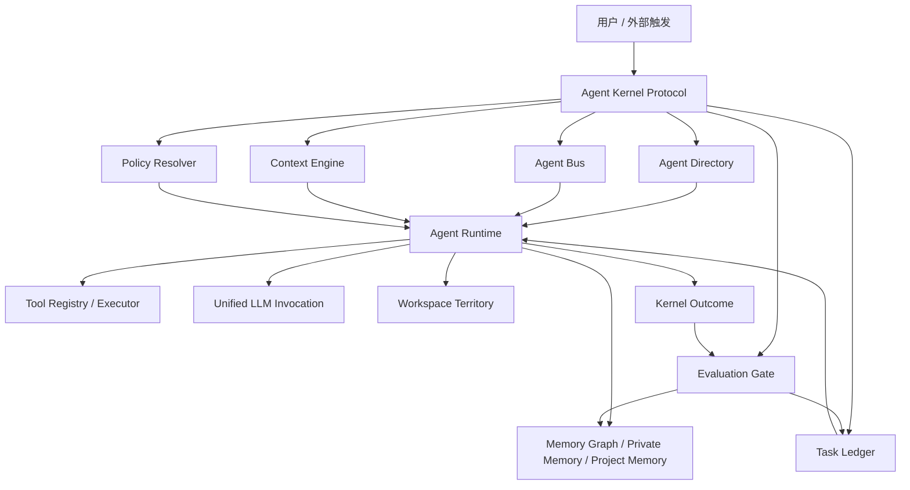

# Vibelution Agent Kernel Protocol 规划草案

日期：2026-06-19
状态：供用户与架构评审的草案
归属分线：agent-runtime-core
范围：仅规划文档，不包含实现改动

## 1. 文档目的

本文提出 Vibelution 的第一版 Agent 内核协议规划，暂名为 `VAKP`，即 `Vibelution Agent Kernel Protocol`。

这个协议的目标不是立刻做一个庞大的中央调度器，而是先把 Vibelution 现有的会话、群聊、科研、监督进化、自进化、工具、模型、记忆、工作区、Agent 配置等能力收束到一组稳定对象和事件协议上。

换句话说，Vibelution 下一阶段要先成为一套清晰的 Agent OS，再逐步承载更通用的智能行为。

## 2. 当前基础判断

Vibelution 已经具备很多关键底座：

- `AgentInstance` 和 Agent Directory 已经形成长期 Agent 身份方向。
- 统一 Agent 配置规划已经把模型、提示词、工具、记忆、workspace、mode binding 分层。
- WorkRun 规划已经把 chat turn、supervised run、self-evolution run 统一到运行基底方向。
- Runtime scene 已经能记录启动、运行、失败、恢复等证据。
- Tool Registry、Tool Executor、Tool Governance、LLM 调用链、Context Engine、Memory Graph、Project Memory、Teams、ChatRoom、Supervised Evolution 等模块已经存在。

现在的关键问题不是缺功能，而是这些功能还没有被同一套“内核协议”约束。不同页面和模式仍可能各自维护状态、绑定、任务和事件，导致用户难以判断：

- 当前谁在工作；
- 谁有权限做什么；
- 哪个任务成功或失败；
- 哪些内容进入了记忆；
- 哪些自进化建议只是参考，哪些真的生效了。

## 3. 产品目标

目标体验如下：

1. 用户只在一个 Agent Center 中创建和配置长期 Agent。
2. 每个 Agent 都有稳定名字、代号、模型策略、工具权限、记忆边界、workspace 领地、会话能力、群聊能力和监督策略。
3. 用户提出一个高层目标后，平台能把它登记为任务，并分配给一个或多个 Agent。
4. Agent 可以和用户、群聊、其他 Agent 交流，交流统一走 Agent Bus。
5. Agent 即使未运行，也可以接收 inbox 消息，后续按唤醒策略处理。
6. 所有重要执行都进入 Task Ledger，用户能看到状态、负责人、证据、结果和失败原因。
7. 记忆写入、工具权限调整、自进化建议、代码修改都通过 Evaluation Gate，而不是静默生效。

一句话目标：

```text
把 Vibelution 从“多个 Agent 功能页面”收束成“一个可治理、可扩展、可观察的 Agent 操作系统”。
```

## 4. 非目标

第一版内核协议不做这些事：

- 不直接重写所有现有服务。
- 不把 chat、research、supervised evolution、self-evolution 合成一个巨大服务。
- 不绕过现有 LLM invocation chain 新建模型调用路径。
- 不让 Agent 默认拥有写长期记忆、改工具权限、改项目代码的自由。
- 不在同一阶段重做全部 UI。
- 不一次性删除兼容读取逻辑。
- 不做无限自我复制式 sub-agent。
- 不把自进化建议直接变成长期原则。

## 5. 设计原则

### 5.1 协议先于页面

页面只是展示和编辑协议对象。不要再让每个页面私有维护一套 Agent、任务、消息或记忆状态。

### 5.2 Agent 身份是一等对象

会话 Agent、群聊 Agent、科研 Agent、监督角色 Agent、自进化角色 Agent，本质上都应该来自同一种长期身份对象。

临时 sub-agent 是一次运行，不是长期配置项。

### 5.3 策略引用，不重复配置

Agent 卡片上应绑定策略，而不是复制完整配置。

例如：

- 模型配置在设置页维护，Agent 绑定 `ModelPolicy`。
- 工具定义在工具库维护，Agent 绑定 `ToolPolicy`。
- 记忆系统维护存储与图谱，Agent 绑定 `MemoryPolicy`。
- workspace 管理领地和写入规则，Agent 绑定 `WorkspacePolicy`。

### 5.4 每个重要动作都有证据

任何可能失败、卡住、重试、降级、修复、写入、删除、调用工具的行为，都应该留下有界证据。

证据不应包含密钥、完整提示词、完整私有记忆、完整大输出。

### 5.5 长期沉淀默认走提案

Agent 可以提出记忆、策略、提示词、工具权限、代码修改建议，但不应默认直接写入项目级长期状态。

### 5.6 用户要看得懂系统正在做什么

Vibelution 的通用化不是“后台越来越自动”，而是“自动化过程越来越可见、可控、可回滚”。

## 6. 内核核心对象

第一版协议建议包含七组核心对象：

```text
AgentIdentity
CapabilityPolicy
TaskLedgerEntry
AgentEvent
ContextPacket
KernelOutcome
EvaluationGate
```

## 7. AgentIdentity

`AgentIdentity` 表示长期 Agent 身份。

建议字段：

```ts
type AgentIdentity = {
  agentId: string;
  codeName: string;
  displayName: string;
  kind: "persistent";
  primaryMode:
    | "chat"
    | "group_chat"
    | "research"
    | "self_evolution"
    | "supervised_evolution"
    | "operations"
    | "custom";
  roleKey: string;
  status: "active" | "paused" | "archived";
  modelPolicyId: string;
  promptTemplateId: string;
  toolPolicyId: string;
  memoryPolicyId: string;
  workspacePolicyId: string;
  communicationPolicyId: string;
  supervisionPolicyId: string;
  childAgentPolicyId: string;
  directSessionId?: string;
  createdAt: string;
  updatedAt: string;
};
```

和现有设计的关系：

- 它应基于已有 `AgentInstance` 扩展，而不是重建一套 Agent。
- 现有 `agentCode`、`profileId`、`toolPolicyId`、`memoryPolicyId`、`workspacePath` 等字段可以映射进来。
- UI 可以继续叫 Agent 卡片或 Agent Center，协议层保持稳定即可。

## 8. CapabilityPolicy

能力策略用于回答“这个 Agent 能做什么、不能做什么、需要谁批准”。

建议拆成几类策略。

### 8.1 ModelPolicy

```ts
type ModelPolicy = {
  modelPolicyId: string;
  dialogueModelRef?: string;
  reasoningModelRef?: string;
  imageModelRef?: string;
  embeddingModelRef?: string;
  fallbackModelRefs: string[];
};
```

模型本身仍由设置页模型库维护。Agent 只选择策略或模型模板引用。

### 8.2 ToolPolicy

```ts
type ToolPolicy = {
  toolPolicyId: string;
  allowedTools: string[];
  deniedTools: string[];
  approvalRequiredFor: string[];
  sideEffectLevel: "none" | "read" | "write" | "destructive";
};
```

后续“顾问 Agent 给其他 Agent 分配工具权限”应当通过修改或提议修改 `ToolPolicy` 完成。

### 8.3 MemoryPolicy

```ts
type MemoryPolicy = {
  memoryPolicyId: string;
  readableScopes: string[];
  writableScopes: string[];
  defaultWriteMode:
    | "none"
    | "private_proposal"
    | "private_direct"
    | "project_proposal";
  promotionRequired: boolean;
};
```

建议默认：

- 私有记忆可以先走 proposal-first；
- 项目记忆必须走项目级审查；
- 自进化建议只作为参考，除非显式提升。

### 8.4 WorkspacePolicy

```ts
type WorkspacePolicy = {
  workspacePolicyId: string;
  root: string;
  allowedPaths: string[];
  forbiddenPaths: string[];
  claimRequired: boolean;
  destructiveActionPolicy: "deny" | "approval_required" | "allow";
};
```

这个策略用于解决“每个 Agent 都有自己的领地”的问题。

## 9. TaskLedgerEntry

`TaskLedgerEntry` 是平台中“正在做什么”的统一事实。

建议字段：

```ts
type TaskLedgerEntry = {
  taskId: string;
  goal: string;
  requester: {
    type: "user" | "agent" | "system";
    id: string;
  };
  assignedAgentIds: string[];
  status:
    | "queued"
    | "running"
    | "waiting"
    | "succeeded"
    | "failed"
    | "cancelled"
    | "blocked";
  priority: "low" | "normal" | "high" | "urgent";
  mode:
    | "chat"
    | "group_chat"
    | "research"
    | "supervised"
    | "self_evolution"
    | "background";
  parentTaskId?: string;
  workRunId?: string;
  sessionId?: string;
  roomId?: string;
  teamId?: string;
  requiredCapabilities: string[];
  evidenceRefs: EvidenceRef[];
  resultSummary?: string;
  failureReason?: string;
  createdAt: string;
  updatedAt: string;
};
```

Task Ledger 最终应统一显示：

- 会话回合；
- 群聊轮次；
- Agent 对 Agent 消息；
- 科研工作流阶段；
- Teams 阶段；
- 监督进化运行；
- 自进化提案；
- 工具后台任务；
- image2 生图任务；
- worktree 代码任务。

## 10. AgentEvent

`AgentEvent` 是 Agent Bus 的基础事件。

建议字段：

```ts
type AgentEvent = {
  eventId: string;
  type:
    | "agent.message.sent"
    | "agent.message.received"
    | "agent.reply.requested"
    | "agent.task.assigned"
    | "agent.task.updated"
    | "agent.tool.requested"
    | "agent.tool.completed"
    | "agent.memory.proposed"
    | "agent.supervision.required"
    | "agent.result.submitted"
    | "agent.failure.reported";
  sender: {
    type: "user" | "agent" | "system";
    id: string;
  };
  recipients: Array<{
    type: "user" | "agent" | "room" | "team";
    id: string;
  }>;
  taskId?: string;
  sessionId?: string;
  roomId?: string;
  workRunId?: string;
  payload: Record<string, unknown>;
  deliveryPolicy: "online_only" | "inbox" | "wake_if_needed";
  requiresReply: boolean;
  status: "queued" | "delivered" | "handled" | "failed" | "cancelled";
  createdAt: string;
};
```

核心规则：

- 普通会话消息是事件。
- 群聊消息是事件。
- Agent 给 Agent 发消息也是事件。
- 离线 Agent 接收 inbox 事件。
- 是否唤醒 Agent 是调度策略，不是消息写入本身决定。

## 11. ContextPacket

`ContextPacket` 定义 Agent 在一次运行前看到什么。

建议字段：

```ts
type ContextPacket = {
  packetId: string;
  agentId: string;
  taskId?: string;
  workRunId?: string;
  sessionId?: string;
  roomId?: string;
  mode: string;
  conversationWindow: ContextSegment[];
  roomMessages: ContextSegment[];
  inboxMessages: ContextSegment[];
  privateMemory: ContextSegment[];
  projectMemory: ContextSegment[];
  toolState: ContextSegment[];
  workspaceState: ContextSegment[];
  constraints: string[];
  expectedOutput: string;
  omittedContextSummary?: string;
  createdAt: string;
};
```

上下文规则：

- 默认最小上下文。
- 每段记忆都要能说明来源和权限原因。
- 群聊内容必须保留发言者身份。
- 工具结果过大时只进入摘要和引用。
- 未授权项目记忆不能默认进入 Agent 上下文。

## 12. KernelOutcome

`KernelOutcome` 统一 Agent 执行后的返回结果。

建议字段：

```ts
type KernelOutcome = {
  outcomeId: string;
  taskId?: string;
  workRunId?: string;
  agentId: string;
  visibleReply?: string;
  taskResult?: {
    status: "succeeded" | "failed" | "partial" | "blocked";
    summary: string;
  };
  memoryProposals: MemoryProposal[];
  policyProposals: PolicyProposal[];
  codeChangeProposals: CodeChangeProposal[];
  followupTaskProposals: FollowupTaskProposal[];
  evidenceRefs: EvidenceRef[];
  createdAt: string;
};
```

它要明确区分：

- 用户看见的回复；
- 任务账本记录的结果；
- 可以进入记忆的提案；
- 需要监督或用户确认的变更；
- 后续任务建议。

## 13. EvaluationGate

`EvaluationGate` 决定哪些结果可以沉淀。

可处理对象：

- 私有记忆；
- 项目记忆；
- 工具权限变更；
- 模型或提示词策略变更；
- 自进化参考；
- supervised case；
- worktree 代码变更。

建议状态：

```text
draft
needs_review
approved
rejected
applied
superseded
rolled_back
```

默认规则：

- 普通可见回复不需要 promotion。
- 私有记忆可以 proposal-first。
- 项目记忆需要用户或项目治理确认。
- 工具权限和策略变化需要审查。
- 代码和配置变化必须走 worktree、claim、validation、merge。
- 自进化输出默认是参考，不能直接变成长期原则。

## 14. 高层架构



## 15. 现有模块映射

| 内核职责 | 当前或规划中的模块 |
|---|---|
| Agent 身份 | `core/web/services/agent_directory_service.py` |
| Agent 模式绑定 | `core/web/services/agent_mode_binding_service.py` |
| 工具注册 | `core/web/services/tool_registry_service.py` |
| 工具执行 | `core/infrastructure/tool_executor.py` |
| 工具治理 | `core/web/services/agent_tool_governance_service.py` |
| LLM 调用 | `core/llm/*` |
| 上下文组装 | `core/orchestration/context_engine.py` |
| 会话 | `core/web/services/session_service.py` |
| 群聊 | `core/web/services/chat_room_service.py` |
| Agent 消息总线 | `core/web/services/project_agent_bus_service.py` |
| 记忆图谱 | `core/web/services/memory_graph_service.py` |
| 记忆服务 | `core/web/services/memory_service.py` |
| 团队知识 | `core/web/services/team_knowledge_service.py` |
| 任务运行 | WorkRun substrate, `core/runtime_manager/*` |
| 监督进化 | `core/web/services/supervised_*`, `core/evaluation/supervised_evolution.py` |
| 自进化 | `core/web/services/self_evolution_*`, `core/evaluation/self_evolution_*` |
| 运行证据 | `logs/runtime_scenes/*` |

## 16. 核心流程

### 16.1 用户发起普通会话

1. 用户在会话中发送消息。
2. Session Service 创建或解析 `TaskLedgerEntry`。
3. Agent binding 解析为 `AgentIdentity`。
4. Kernel 产生 `agent.message.sent` 和 `agent.task.assigned` 事件。
5. Context Engine 构建 `ContextPacket`。
6. Agent Runtime 通过统一 LLM 调用链和 Tool Registry 执行。
7. Runtime 返回 `KernelOutcome`。
8. 可见回复写入会话。
9. Task Ledger 记录状态、结果和证据。
10. 记忆或策略建议进入 `EvaluationGate`。

### 16.2 Agent 给另一个 Agent 发消息

1. 发送方 Agent 产生 `agent.message.sent`。
2. Agent Bus 将事件写入接收方 inbox。
3. 如果策略允许唤醒，Scheduler 创建后续任务。
4. 接收方 Agent 获取包含 inbox 消息的 `ContextPacket`。
5. 接收方回复也通过 Agent Bus。
6. 回复可以投影到会话、群聊或任务账本。

### 16.3 群聊轮次

1. Room 保存参与者 Agent ID。
2. 用户或系统创建群聊任务。
3. Scheduler 选择讨论模式：轮询、抢占式、主持人主导。
4. 每个参与者拿到包含 room messages 和 speaker identity 的上下文。
5. 每次回复都是 AgentEvent，也是 room message。
6. Task Ledger 记录轮次、参与者、状态和总结。

### 16.4 科研工作流阶段

1. Team workflow stage 进入 Task Ledger。
2. stage binding 解析到 Agent ID。
3. Agent 获取科研上下文、工具权限和知识范围。
4. 来源、证据、图谱、产物通过 `EvidenceRef` 关联。
5. 正式记忆写入走 proposal 和 promotion。

### 16.5 自进化建议

1. 自进化 Agent 产出记忆、提示词、工具权限、策略或代码建议。
2. 建议作为 `KernelOutcome` 记录。
3. Evaluation Gate 标记为 `needs_review`。
4. 用户、监督 Agent 或 supervised run 评审。
5. 只有批准后的建议才能应用。
6. 代码变更仍必须走 worktree、claim、validation、merge。

## 17. 存储方向

第一版可以沿用 Vibelution 当前 local-first 风格，先用 JSON/JSONL，后续再根据性能证据决定是否引入 SQLite 或混合索引。

建议初始目录：

```text
workspace/agent_kernel/
  agents/
  policies/
  task_ledger/
    tasks.jsonl
    indexes/
  agent_bus/
    events.jsonl
    inboxes/
  outcomes/
  proposals/
  context_packets/
```

待确认问题：

- Task Ledger 用 JSONL、SQLite，还是混合？
- Agent inbox 是每个 Agent 一个 JSONL，还是统一事件表加索引？
- ContextPacket 是否完整持久化，还是只保留摘要和证据引用？
- 中间上下文和 inbox 事件保留多久？

## 18. API 草案

### 18.1 Kernel Task API

```http
GET /api/kernel/status
GET /api/kernel/tasks
GET /api/kernel/tasks/{taskId}
POST /api/kernel/tasks
PATCH /api/kernel/tasks/{taskId}
```

### 18.2 Agent Bus API

```http
GET /api/kernel/events
POST /api/kernel/events
GET /api/agents/{agentId}/inbox
POST /api/agents/{agentId}/inbox/{eventId}/ack
```

### 18.3 Policy API

```http
GET /api/agent-policies
GET /api/agent-policies/{policyId}
PATCH /api/agent-policies/{policyId}
```

实现时可以按 policy 类型拆分服务，避免单个服务过大。

### 18.4 Proposal API

```http
GET /api/kernel/proposals
GET /api/kernel/proposals/{proposalId}
POST /api/kernel/proposals/{proposalId}/approve
POST /api/kernel/proposals/{proposalId}/reject
POST /api/kernel/proposals/{proposalId}/apply
```

## 19. UI 方向

协议稳定后，UI 最终应收束成四个主入口。

### 19.1 Agent Center

唯一长期 Agent 配置点。

应展示：

- 身份和代号；
- 模式分组；
- 模型策略；
- 提示词模板；
- 工具策略；
- 记忆策略；
- workspace 策略；
- 通信策略；
- 监督策略；
- 子 Agent 策略；
- 直接会话；
- 正在使用它的 room、team、task。

### 19.2 Task Center

回答“平台现在在做什么”。

应展示：

- queued、running、waiting、failed、blocked、succeeded；
- owner Agent；
- linked session、room、team、worktree；
- evidence refs；
- failure reason；
- approval needs；
- next action。

### 19.3 Communication Center

专门管理群聊和 Agent 消息。

应包含：

- rooms；
- participants；
- discussion mode；
- inboxes；
- direct Agent messages；
- wake policies；
- moderation policies。

### 19.4 Governance Center

专门处理提案和沉淀。

应包含：

- memory proposals；
- policy proposals；
- tool permission proposals；
- self-evolution suggestions；
- code/worktree proposals；
- supervised review results。

现有页面不需要立刻消失。第一阶段目标是让它们逐步读写同一批协议对象。

## 20. 分阶段实施路线

### Phase 0：评审与 ADR

交付：

- 本文档由用户评审和修改；
- 增加一份 ADR，确认 Agent Kernel Protocol 方向；
- 锁定第一实现切片。

不改运行行为。

验证：

- markdown review；
- 和已有统一 Agent 配置、WorkRun 规划做一致性审查。

### Phase 1：Kernel DTO 与存储骨架

目标：

- 增加低风险协议对象和 JSONL 存储 helper，不接入真实运行。

候选文件：

```text
core/agent_kernel/models.py
core/agent_kernel/store.py
core/agent_kernel/events.py
tests/test_agent_kernel_models.py
tests/test_agent_kernel_store.py
```

行为：

- 定义 `TaskLedgerEntry`、`AgentEvent`、`KernelOutcome`、`EvidenceRef`；
- 支持 JSONL append/read；
- 做字段校验；
- 不改 session、room、research 运行逻辑。

验证：

- DTO normalization tests；
- JSONL append/read tests；
- `py_compile`；
- `git diff --check`。

### Phase 2：Agent 身份与策略桥接

目标：

- 把现有 Agent Directory 和 policy 服务映射到内核模型。

行为：

- `AgentInstance` 映射为 `AgentIdentity`；
- 暴露 policy refs；
- 不复制完整模型、工具、提示词内容；
- 缺失 policy link 时给出 repair warning。

验证：

- Agent Directory tests；
- Agent config workspace tests；
- 不触碰 UI 写入路径，除非另行确认。

### Phase 3：Task Ledger 最小切片

目标：

- 选择一个入口，把真实动作登记到 Task Ledger。

建议入口：

- direct chat turn，或
- Agent-to-Agent message。

行为：

- 创建任务；
- 更新任务状态；
- 记录 evidence refs；
- 记录 outcome。

验证：

- service test 证明一次消息会创建和关闭 task；
- 原有会话可见行为不变，最多增加任务元数据。

### Phase 4：Agent Bus 最小切片

目标：

- 支持 Agent inbox 事件。

行为：

- Agent A 可以给 Agent B 发消息；
- Agent B inbox 记录事件；
- 未运行 Agent 不丢消息；
- wake policy 默认可以先设为不自动唤醒；
- 后续再支持自动唤醒。

验证：

- event append/read tests；
- inbox ack tests；
- denied wake policy test；
- failed delivery runtime scene event。

### Phase 5：会话与群聊收束

目标：

- direct session 和 group room 都逐步通过 Agent Bus 和 Task Ledger 表达。

行为：

- room message 是 AgentEvent；
- session message 是 AgentEvent；
- participant 来自 Agent Directory；
- 群聊讨论模式成为 task metadata。

验证：

- ChatRoom service tests；
- session service tests；
- 如果改 UI，补 React Query/cache invalidation tests。

### Phase 6：Evaluation Gate 与提案治理

目标：

- 统一 memory、policy、自进化、代码建议的 proposal lifecycle。

行为：

- Agent outcome 可以包含 proposals；
- proposal 进入 `needs_review`；
- 用户或监督 Agent 可以 approve/reject；
- 项目记忆和代码变更继续走现有治理路径。

验证：

- proposal lifecycle tests；
- memory write boundary tests；
- supervised review integration tests。

### Phase 7：UI 收束

目标：

- UI 围绕 Agent Center、Task Center、Communication Center、Governance Center 重组。

行为：

- 现有页面逐步变成内核协议对象的视图；
- 旧控件只有在 source-of-truth 完成迁移后再删除。

验证：

- frontend layout tests；
- browser checks；
- route/API contract tests。

## 21. 日志协议

建议新增有界 runtime event code：

```text
agent_kernel.task.created
agent_kernel.task.updated
agent_kernel.event.queued
agent_kernel.event.delivered
agent_kernel.event.failed
agent_kernel.context.built
agent_kernel.outcome.recorded
agent_kernel.proposal.created
agent_kernel.proposal.reviewed
agent_kernel.policy.resolve_failed
agent_kernel.agent.resolve_failed
```

允许记录字段：

- `taskId`
- `eventId`
- `agentId`
- `agentCode`
- `sessionId`
- `roomId`
- `teamId`
- `workRunId`
- `status`
- `failureClass`
- `evidenceRefCount`
- `proposalCount`

禁止记录：

- API key；
- 完整提示词；
- 完整私有记忆；
- 完整 transcript；
- 无界工具输出；
- provider raw payload。

## 22. 测试策略

### 22.1 Unit tests

- DTO 校验；
- event type normalization；
- task status transitions；
- policy reference validation；
- proposal state transitions。

### 22.2 Service tests

- chat turn 创建 task；
- Agent inbox event 创建；
- inbox ack；
- Agent Directory 解析身份；
- missing/archived Agent 被阻断；
- KernelOutcome 关联 evidence refs。

### 22.3 Integration tests

- Agent direct message 进入 inbox，并可调度回复；
- 群聊轮次记录 task 和 event history；
- 自进化建议进入 review，而不是直接写记忆；
- tool call outcome 关联 Tool Registry result。

### 22.4 Frontend tests

- Agent Center 展示 policy bindings；
- Task Center 按状态和负责人分组；
- Communication Center 展示 room/inbox；
- Governance Center 展示 proposal lifecycle。

### 22.5 Runtime evidence checks

- runtime scene 包含有界 kernel events；
- failed delivery 能从 summary 和 timeline 重建；
- missing Agent 或 policy 有清晰的用户态与 Agent 态错误。

## 23. 安全边界

必须遵守：

- Agent-to-Agent 消息不授予额外工具权限。
- 收到消息不等于允许唤醒或回复。
- offline inbox 不绕过 policy check。
- memory promotion 必须符合 MemoryPolicy。
- tool use 必须经过 Tool Registry 和 ToolPolicy。
- workspace write 必须符合 WorkspacePolicy 和项目 guard。
- 自进化代码变更必须走 worktree 和监督评审。
- 跨 Agent 通信必须保留 sender identity 和 source task。

## 24. 迁移策略

迁移应先 additive，再 terminal。

短期允许：

- 现有 session records；
- 现有 ChatRoom participant records；
- 现有 Team workflow agent bindings；
- 现有 ModeBinding repair readers；
- 现有 WorkRun summary paths；
- 现有 supervised/self-evolution stores。

长期不允许：

- 页面创建隐藏 Agent-like records；
- Agent-to-Agent 直接写文件绕过 Agent Bus；
- runtime code 绕过 ToolPolicy 选择工具；
- 无 proposal 或 policy check 的长期记忆写入；
- 同一运行有多个互相冲突的 task status source。

退出兼容的条件：

- direct chat、group chat、research、supervised、self-evolution 都能引用 kernel task ID；
- 长期 Agent 都通过 Agent Directory 解析；
- Agent 消息都通过 Agent Bus；
- 可见任务状态来自 TaskLedger 或 WorkRun bridge；
- proposals 使用 Evaluation Gate；
- compatibility readers 可命名、可审查、可删除。

## 25. 需要用户确认的关键决策

实施前建议确认这些问题：

1. 协议命名是否采用 `VAKP`，还是使用更产品化的名称？
2. 第一版存储用 JSONL、SQLite，还是混合？
3. 第一实现切片选 direct Agent message、group chat convergence，还是 Task Center？
4. Task Center 是新页面，还是先嵌入现有 Runtime/Sessions 页面？
5. 私有 Agent 记忆是否允许 direct-write，还是也默认 proposal-first？
6. offline Agent 是否默认允许自动唤醒，还是每个 Agent 单独开启？
7. 群聊抢占式讨论由 scheduler 控制，还是由 moderator Agent 控制？
8. ContextPacket 和 inbox event 保留多久？
9. 哪些 proposal 可由监督 Agent 批准，哪些必须用户确认？

## 26. 推荐第一实现切片

建议第一切片：

```text
Agent-to-Agent inbox with TaskLedger and KernelOutcome
```

理由：

- 它直接支撑“Agent 可以给其他 Agent 发消息”的核心需求。
- 它比群聊全量改造小。
- 它不需要先重做 Agent Center UI。
- 它可以复用现有 Agent Directory。
- 它能自然引出 Task Center、Agent Bus、Evaluation Gate。

最小行为：

1. 定义 kernel DTO。
2. 增加 JSONL event store。
3. 增加 TaskLedger store。
4. 增加服务方法：`send_agent_message(senderAgentId, recipientAgentId, content)`。
5. 接收方 inbox 记录事件。
6. wake policy 先记录但默认不自动唤醒。
7. 记录 outcome 和 evidence refs。

验收标准：

- 发送 Agent 消息会创建一条 task；
- 产生一条 queued AgentEvent；
- 接收方 inbox 能看到；
- inbox event 能 ack；
- recipient missing 时有明确失败状态和 runtime evidence；
- 不发生直接 memory write 或 tool permission change。

## 27. 后续文档建议

本草案确认后，建议继续补三份文档：

1. `ADR: Adopt Vibelution Agent Kernel Protocol`
2. `Agent-to-Agent Inbox MVP Implementation Plan`
3. `Agent Center Policy Binding UX Spec`

这三份文档可以分别承接：

- 架构决策；
- 第一切片实现；
- 用户可见配置收束。
