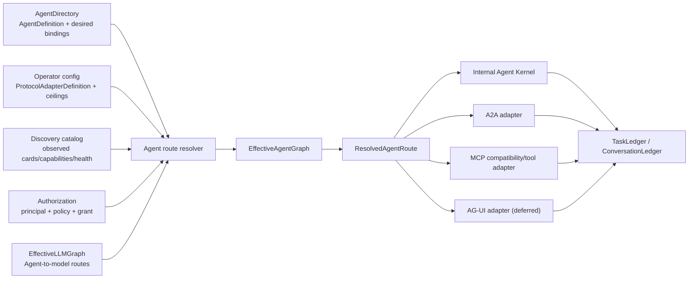
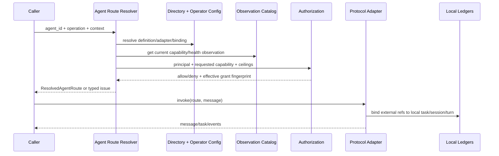

# 多 Agent 配置管理与协议路由研究设计

> **Status**: `user-approved`
> **Owner**: `codex-llm-routing-plan`
> **Date**: 2026-08-14
> **Claim**: `claim-13cbcda6ee33`
> **Branch**: `codex/multi-agent-protocol-config-design`
> **Worktree**: `.worktrees/multi-agent-protocol-config-design`
> **Scope**: 多 Agent 静态配置、协议适配器、Agent 与协议绑定、运行时路由解析、能力发现、权限准入、状态映射和兼容迁移；本轮只形成研究与实施设计，不修改 operator config、Agent 数据或运行时代码。
> **Related plan**: [`2026-08-14-llm-config-runtime-routing-optimization-plan.md`](2026-08-14-llm-config-runtime-routing-optimization-plan.md)
> **Supersedes**: 不替代 [`docs/agents/mcp-managed-agent-gateway.md`](../agents/mcp-managed-agent-gateway.md)、[`docs/ops/config/`](../ops/config/INDEX.md)、[`core/llm/PROTOCOL.md`](../../core/llm/PROTOCOL.md) 或 ADR；实施后将稳定规则提升到各 owning docs。
> **Validation**: 链接、格式、Git diff、术语和项目权威边界检查；实现阶段按第 17 节验证矩阵验收。
> **Close condition**: 目标配置模型、统一路由解析器和首个兼容适配器完成，经静态与授权后的真实运行时验证后，将本文状态改为 `implemented` 并归档。

---

## 1. 执行结论

本次调研后的推荐不是引入某个完整多 Agent 框架，而是采用：

> **ADAPT + REFERENCE_ONLY + BUILD_IN_HOUSE**

- **ADAPT**：吸收 Microsoft Agent Framework 的“协议中立核心、应用持有身份/授权/存储、一个 Agent 可暴露多个协议适配器”结构；吸收 A2A、MCP、AG-UI 的标准对象与交互语义。
- **REFERENCE_ONLY**：参考 AutoGen、Google ADK、CrewAI 的声明式配置体验，以及 LangGraph、OpenAI Agents SDK 的 manager、handoff、router、session 分离模式。
- **BUILD_IN_HOUSE**：在 Vibelution 现有 `AgentDirectory`、`TaskLedger`、`ConversationLedger`、授权系统、LLM 路由和 MCP 网关之上实现 canonical registry、解析器与准入层，不新增整套 Agent 框架依赖。

核心设计决策：

1. `AgentDefinition`、`ProtocolAdapterDefinition`、`AgentProtocolBinding`、运行时实例、观测能力必须分层，不能塞进一个 `AgentConfig`。
2. 一个 Agent 可以绑定零到多个协议适配器；禁止用单值 `agent.protocol` 表达协议归属。
3. A2A 管 Agent 间发现、委派、任务与产物；MCP 管工具、资源、Prompt 及现有兼容网关；AG-UI 管 Agent 到前端的事件流；Responses/Chat/Anthropic/Gemini wire 只管 Agent 到模型。
4. 新建独立 `EffectiveAgentGraph`；它可以引用 `EffectiveLLMGraph` 中的模型路由身份，但不能把 Agent 协议字段混入模型协议字段。
5. 远端 AgentCard、MCP discovery 和其他协议元数据都只是“不可信观测”，不能直接成为本地身份、授权或配置真值。
6. 当前 `[external_agent_gateway]` 保留，先投影为一个 MCP compatibility adapter；不立即改名，不宣称已经实现最新版 MCP Tasks。

## 2. Desired Result、边界与成功证据

### 2.1 Desired Result

建立一条可解释、可校验、可演进的 Agent 路由链：

```text
声明配置
  -> schema / migration
  -> Agent + Adapter + Binding 图
  -> 协议发现与健康观测
  -> 身份映射与授权交集
  -> 唯一 ResolvedAgentRoute
  -> 本地执行或协议适配器
  -> Task / Session / Turn 持久状态
```

系统最终必须能回答并证明：

- 当前调用的是哪个本地 Agent，而不是只看到远端字符串 ID；
- 为什么选中某个协议、版本、transport 和 endpoint；
- 调用者、Agent、适配器、操作和任务的有效权限来自哪里；
- 外部 task/session/message ID 如何映射到本地权威对象；
- 声明能力、适配器能力、实时观测和最终有效能力分别是什么；
- 失败发生在 schema、解析、发现、准入、传输、协议还是 Agent 运行阶段。

### 2.2 本轮范围

- 成熟多 Agent 项目配置管理方式对比。
- A2A、MCP、AG-UI 与模型 wire protocol 的职责对齐。
- Vibelution 当前权威、复用点和缺口审查。
- canonical config/state model、统一解析链、权限与信任边界。
- 对现有 MCP managed-Agent gateway 的兼容迁移方案。
- 分阶段实施任务图与验证契约。

### 2.3 非目标

- 本轮不安装、复制或接管外部 Agent 框架。
- 不修改 `%USERPROFILE%/Documents/Vibelution/config/config.toml`。
- 不迁移现有 Agent 数据，不启用 A2A 或 AG-UI endpoint。
- 不替换现有 `TaskLedger`、`ConversationLedger` 或 `AgentDirectory`。
- 不把远端发现结果自动写回本地声明配置。
- 不把“协议连通”当作“身份可信、权限通过或业务执行成功”。

### 2.4 Acceptance Evidence

- 所有启用 binding 都能解析为唯一 `ResolvedAgentRoute`，或返回可定位的 fail-closed issue。
- 同一输入和同一观测快照得到相同 `route_fingerprint`。
- 一个 Agent 可同时拥有本地、MCP compatibility、A2A expose/consume 等多个 binding，互不覆盖。
- 远端发现元数据不能提升本地权限，也不能覆盖声明配置。
- 外部 ID 在 binding 范围内映射到本地 Task/Session/Turn，不成为全局主键。
- UI/doctor/runtime 对 Agent route identity 与阻塞原因一致。
- 旧 MCP 网关继续可用；新版 MCP 能力必须经过显式协议代际与功能协商。

## 3. 调研方法与候选结论

调研只使用项目源代码、项目现行规范和候选项目/协议的官方资料。活跃度是 2026-08-14 的调研快照，不作为长期保证。

| 候选 | 观察到的成熟模式 | 主要限制 | Vibelution 决策 |
| --- | --- | --- | --- |
| [Microsoft Agent Framework](https://github.com/microsoft/agent-framework) | 协议中立 Agent/Workflow；应用负责 routing、identity、authorization、store；同一 Agent 可组合 A2A、MCP、Responses hosting | 引入会与现有 kernel、ledger、授权和服务边界重叠 | `ADAPT` 架构，不引入框架 |
| [AutoGen component config](https://microsoft.github.io/autogen/stable/user-guide/core-user-guide/framework/component-config.html) | `provider + config` 声明蓝图；配置与运行时状态分离 | 官方仓库已进入 maintenance mode，并推荐新项目转向 Agent Framework | `REFERENCE_ONLY` 配置蓝图模式 |
| [Google ADK Agent Config](https://adk.dev/agents/config/) | YAML/JSON Schema、Agent/工具/子 Agent 声明式组合 | Agent Config 仍标为 Experimental，且对模型、语言和 A2A Agent 有限制 | `REFERENCE_ONLY` schema 与编辑体验 |
| [CrewAI Agents](https://docs.crewai.com/en/concepts/agents) | JSONC/YAML 分文件、Agent 与 crew 组合、LLM 与 function-calling LLM 可分离 | 配置体验强，但协议、身份和授权权威分层不足以直接复用 | `REFERENCE_ONLY` 人工可编辑配置 |
| [LangChain multi-agent patterns](https://docs.langchain.com/oss/python/langchain/multi-agent) | subagents、handoffs、router、selective context；强调上下文工程 | 偏编排模式，不是统一协议和配置注册表 | `REFERENCE_ONLY` 编排分类 |
| [OpenAI Agents SDK](https://openai.github.io/openai-agents-python/) | Agent、RunConfig、Session、handoff、MCP server 分离；工具命名空间可消除冲突 | code-first 运行库，与项目本地权威部分重叠 | `REFERENCE_ONLY` handoff/session/MCP namespace |
| [A2A 1.0](https://a2a-protocol.org/latest/specification/) | AgentCard、Skill、Message、Task、Artifact；多 binding；异步任务、流和 push | 只定义互操作，不替应用做本地身份、授权和存储 | `ADAPT` Agent 间协议语义 |
| [MCP 2026-07-28](https://blog.modelcontextprotocol.io/posts/2026-07-28/) | 无状态核心、请求自描述、可选 discovery、Tasks 扩展 | 与旧 initialize/session 模型存在协议代际差异；本地 SDK/Host 兼容性需实测 | `ADAPT` 工具/资源协议与显式兼容层 |
| [AG-UI](https://docs.ag-ui.com/) | 标准事件流覆盖 run、message、tool、state、activity、interrupt | 是 Agent↔User 层，不是 Agent↔Agent 或模型 wire | `DEFERRED ADAPT`，作为未来前端适配器 |

### 3.1 Dependency Impact

第一阶段不新增生产依赖。标准对象先以项目内 DTO/Protocol 描述实现，并通过 contract tests 固化；只有在真实互操作测试证明官方 SDK 能减少维护成本、且不侵入现有权威边界后，才单独评估 SDK 依赖。

### 3.2 Rejected Alternatives

- **直接引入 Microsoft Agent Framework/ADK/CrewAI 重写内核**：会制造第二套 Agent、状态和权限权威。
- **把所有外部 Agent 都建模为 MCP tools**：可以兼容调用，但会丢失 A2A 的 AgentCard、skill、task、artifact、cancel/subscribe 等对等语义。
- **给 Agent 增加一个 `protocol` 字段**：无法表达同一 Agent 多协议暴露、方向、版本、endpoint 和权限差异。
- **把发现结果写回配置**：网络观测会污染声明真值，并可能通过元数据漂移提升权限。
- **把模型 wire protocol 与 Agent protocol 统一枚举**：两者的参与方、状态机、错误和安全边界不同，会重演现有模型字段混义问题。

## 4. 成熟项目中可复用的共同原则

1. **定义与状态分离**：Agent 配置是可验证蓝图；session、history、task、checkpoint 是运行态。
2. **本地权威优先**：协议 adapter 负责转换和传输，应用负责身份、授权、路由、持久化和生命周期。
3. **组合优于单继承**：Agent、model、tool、protocol、policy 通过引用组合；不把所有字段复制进一个对象。
4. **一对多协议绑定**：同一 Agent 可以本地运行，也可以通过不同 endpoint、版本和方向暴露。
5. **能力需要求交集**：声明“支持”不等于当前 endpoint、调用者和策略允许。
6. **运行路由可追溯**：最终选择应有 stable identity、source digest、观测时间与 fingerprint。
7. **协议输入不可信**：AgentCard、tool schema、message metadata、task ID 都必须经过本地校验和准入。
8. **编排与互操作分离**：manager/handoff/router 是内部决策；A2A/MCP/AG-UI 是跨边界交互契约。

## 5. 协议职责矩阵

| 层 | 参与方 | 主要对象 | Vibelution owning surface | 明确不负责 |
| --- | --- | --- | --- | --- |
| 内部 Agent Kernel | 本地 Agent、Session、Task、工具与策略 | Agent identity、local task/session/turn、handoff、policy | `AgentDirectory`、`TaskLedger`、`ConversationLedger`、授权服务 | 网络协议兼容 |
| A2A | Agent/系统 ↔ 远端 Agent | AgentCard、Skill、Message、Task、Artifact、status | 新 A2A adapter + binding/route 层 | 本地身份真值、工具注册表、模型请求 |
| MCP | Host/Client ↔ tool/resource/prompt server | Tool、Resource、Prompt；新版可选 Tasks extension | 现有 managed-Agent gateway、新 MCP adapter registry | 对等 Agent 身份、前端状态流、模型 wire |
| AG-UI | Agent backend ↔ 用户界面 | run/message/tool/state/activity/interrupt events | 未来 Web/event adapter | Agent 委派、工具发现、模型协议 |
| Model wire | Agent runtime ↔ LLM provider | Responses、Chat Completions、Anthropic/Gemini messages | `EffectiveLLMGraph`、`ResolvedLLMRoute`、`core/llm/wire/` | Agent discovery、task ownership、UI events |

A2A 的发现方式包括 well-known AgentCard、registry/catalog 和 direct/private 配置；这些是发现方式，不是授权证明。MCP 继续作为工具/资源面，现有“把受管 Agent 暴露为五个 MCP tools”的实现定位为 compatibility facade，而非 canonical Agent-to-Agent 模型。

## 6. Vibelution 当前基础与缺口

### 6.1 已有可复用权威

| 现有模块 | 当前权威 | 目标复用方式 |
| --- | --- | --- |
| `core/agent_kernel/source_authority.py` | Agent identity/status/tool/memory policy、Session、Task 的唯一写入者定义 | 保持不变；协议层不得成为第二写入者 |
| `core/web/services/agent_directory/` | Agent profile、policy、lifecycle、mutation | 扩展声明 binding 意图或建立同权威子域 |
| `core/authorization/tool_policy_models.py` | immutable tool policy、turn grant、authorization decision | 用于协议调用权限交集和 decision fingerprint |
| `config/model_catalog.py`、`core/llm/discovery.py` | declared/observed capability 来源模型 | 复用到 Agent endpoint/capability observation |
| `core/llm/PROTOCOL.md` 与 wire adapter | 模型语义协议和出站 wire | 只由 Agent route 引用，不并入 Agent 协议枚举 |
| `core/web/services/external_agent/` | 本地 MCP managed-Agent task gateway | 作为首个 compatibility adapter 投影 |
| `[external_agent_gateway]` | MCP 网关 enable、permission ceiling、allow/deny、并发/lease | 保留兼容，迁移期映射到 adapter + admission policy |

### 6.2 主要缺口

- `AgentConfig` 目前主要是全局 Agent 循环行为，不是 per-Agent protocol binding schema。
- 模型目录已有 declared/observed provenance，但 Agent endpoint 还没有同等级观测目录。
- 现有 MCP 网关定义了任务兼容流，但缺少统一的 adapter、binding 和 resolved route 抽象。
- 外部 Agent 标识、协议 task/session/turn 与本地 ledger 的映射还未形成通用 contract。
- MCP 新旧协议代际、A2A binding、未来 AG-UI event adapter 尚无统一版本/能力协商模型。
- UI/doctor/runtime 尚无同源的 `EffectiveAgentGraph` 与 route fingerprint。

## 7. 目标架构



架构上有两个相邻但独立的图：`EffectiveLLMGraph` 回答“某个 Agent 的模型调用如何到达 provider”；`EffectiveAgentGraph` 回答“某个调用者如何通过本地或外部协议到达某个 Agent”。依赖方向是 `EffectiveAgentGraph -> model_route_ref/route_fingerprint`，模型图不需要理解 A2A、MCP 或 AG-UI。

## 8. Canonical 配置与状态模型

### 8.1 `AgentDefinition`

权威：`AgentDirectory`。建议字段包括 `agent_id`、role/instruction refs、model route ref、declared skills/capabilities、tool/memory/delegation/visibility policy refs、desired binding refs 和 schema version。

禁止放入：endpoint、明文 credential、健康状态、task/session、协商后的协议版本。

### 8.2 `ProtocolAdapterDefinition`

权威：operator config。它描述连接机制，不描述 Agent 人格：

```text
adapter_id
kind                  # local | a2a | mcp | ag_ui
enabled
direction             # expose | consume | both
supported_versions
transports / bindings
endpoint_ref or listener_ref
auth_policy_ref
credential_ref
discovery_policy
timeout / retry / health_policy
protocol_options
schema_version
```

`credential_ref` 只允许引用环境变量、系统 credential store 或项目认可的 secret reference；解析结果和日志禁止携带 secret 值。

### 8.3 `AgentProtocolBinding`

权威建议：AgentDirectory 持有“希望绑定什么”的声明；operator config 持有 adapter 的 endpoint/transport/secret mechanics。解析器组合两者，不复制字段。

```text
binding_id
agent_id
adapter_id
enabled
direction
visibility
skill_mapping
capability_allow / capability_deny
admission_policy_ref
protocol_overrides
```

- `binding_id` 全局唯一；`(agent_id, adapter_id, direction)` 默认不得重复。
- `direction` 必须被 adapter 支持；binding 不得提升 adapter 或 Agent policy ceiling。
- 一个 Agent 可以有多个 binding；关闭一个 binding 不等于停用 Agent。

### 8.4 运行态与观测态

`AgentRuntimeInstance`、Invocation 和 Task state 由 runtime catalog、`TaskLedger`、`ConversationLedger` 持有，包含 active binding、resolved protocol version/transport、principal/tenant、local IDs、external refs、lease、checkpoint 和 health snapshot。它们不是可手工编辑的蓝图配置。

`ObservedAgentCapability` / `AgentEndpointObservation` 由只读 discovery catalog 持有，记录 adapter/endpoint identity、observed version、card/schema digest、skills/capabilities、source、checked/expires time、health、trust evidence 和 issues。观测过期或不可信时不能继续参与安全能力放行。

## 9. 权威与写入矩阵

| 数据 | 唯一写入者 | 可读消费者 | 禁止行为 |
| --- | --- | --- | --- |
| Agent identity、persona、policy refs、desired bindings | `AgentDirectory` | resolver、UI、runtime | adapter/远端 card 回写身份 |
| Adapter endpoint、transport、credential ref、operator ceiling | operator config | resolver、gateway、doctor | Agent profile 保存 secret/endpoint mechanics |
| 远端 card/schema/health | discovery catalog | resolver、doctor、UI | 观测覆盖声明配置 |
| 有效准入与 permission decision | authorization service | runtime、audit、UI | 仅凭协议 metadata 放行 |
| Local Task/Session/Turn | `TaskLedger` / `ConversationLedger` | adapter、runtime、projection | 协议 task ID 直接成为本地主键 |
| Agent→LLM route | `EffectiveLLMGraph` | Agent resolver/runtime | Agent protocol 改写模型 route |
| UI 投影 | projection only | Web | UI 成为第二写入者 |

## 10. Adapter Registry 与统一接口

建议建立项目内 `AgentProtocolAdapter` Protocol/ABC。不同协议不必伪装成完全相同的状态机，但通过 capability matrix 暴露可用操作：

```text
describe()
discover(request)
resolve(binding, observation, principal)
invoke(resolved_route, message)
stream(resolved_route, message)       # optional
get_task(route, external_task_ref)    # optional
cancel(route, external_task_ref)      # optional
subscribe(route, external_task_ref)   # optional
close()
```

- `discover()` 只产出 observation，不自动注册 Agent 或授权。
- 不支持 task 的协议可以直接返回 Message；禁止为了统一接口伪造 durable task。
- 远端 operation 先过本地 admission，再发送网络请求。
- 工具名、远端 Agent 名和 endpoint 名需要确定性 namespace，避免碰撞。
- adapter 的 retry 不能越过任务幂等性和用户审批边界。

## 11. EffectiveAgentGraph 与路由解析

### 11.1 建议结构

```text
EffectiveAgentGraph
  source_digest
  generated_at
  agent_definitions[]
  adapter_definitions[]
  bindings[]
  observations[]
  resolved_routes[]
  issues[]

ResolvedAgentRoute
  route_id
  agent_id / binding_id / adapter_id
  protocol_family / protocol_version / transport
  endpoint_identity / direction
  effective_capabilities / effective_permission_profile
  auth_policy_ref
  model_route_ref / model_route_fingerprint
  observation_digest / source_digest / route_fingerprint
```

### 11.2 能力与权限求交集

```text
effective_capabilities =
  agent_declared
  ∩ binding_allowed
  ∩ adapter_supported
  ∩ observation_current
  ∩ operator_policy
  ∩ caller_grant
```

任一项未知时不得推断为全能力。对安全相关能力默认 fail closed；纯展示信息可以标记 `unknown`，但不得显示为 ready。

### 11.3 确定性解析顺序

1. schema 校验和版本迁移，拒绝未知关键字段。
2. 解析 Agent、adapter、binding 引用与启用状态。
3. 校验 direction、协议版本、transport、endpoint policy。
4. 获取仍在 TTL 内的 observation；需要时执行受控 discovery。
5. 认证调用 principal，并映射到本地 actor/tenant。
6. 计算 capability/policy/grant 交集。
7. 解析所需 `model_route_ref`，但不改变模型路由语义。
8. 生成 route fingerprint 和可诊断 issues。
9. 执行前再次检查 task-bound capability token/approval。



## 12. 协议专项设计

### 12.1 A2A：外部 Agent 对等互操作

A2A 1.0 的核心对象包括 `AgentCard`、`AgentSkill`、`AgentInterface`、`Message`、`Task`、`TaskStatus/TaskState` 和 `Artifact`，并支持 JSON-RPC、gRPC、HTTP+JSON/REST 等 binding。Vibelution 应：

- 将 AgentCard 解析为 observation，不直接创建本地 Agent。
- 支持 well-known、受管 registry/catalog、direct/private 三种 discovery policy，但默认仅启用显式 direct/private 或受控 registry。
- 对每个请求执行 HTTP 层身份认证和本地授权；payload 中的身份字段不是认证结果。
- 显式协商 `A2A-Version`、binding、capability 和 extension；不兼容即失败。
- 将 SendMessage/stream/get/list/cancel/subscribe/push 支持情况声明在 adapter capability matrix。
- 允许直接 Message 或异步 Task；不要强制每次调用都创建本地 durable task。
- 将远端 task/context/message ID 保存为 `(binding_id, remote_ref)`，再映射本地 ID。

### 12.2 MCP：工具/资源协议与 managed-Agent 兼容面

MCP 2026-07-28 版将核心改为无状态请求：退役旧 `initialize`/`initialized` 与 `Mcp-Session-Id`，请求通过 `_meta` 和 HTTP headers 自描述；`server/discover` 可选，Tasks 移入 `io.modelcontextprotocol/tasks` 扩展。Vibelution 必须把协议代际写进配置和解析结果：

```text
mcp_legacy_initialize
mcp_2026_stateless
```

具体规则：

- 当前本地 `mcp==2.0.0` 网关继续按已验证的 compatibility contract 工作。
- 只有 SDK、Host 和真实交互测试均通过，才能声明 `mcp_2026_stateless` 或 Tasks extension。
- 不允许“新版失败后静默切旧版”；fallback 必须由显式兼容策略和诊断事件触发。
- HTTP transport 使用 OAuth 资源服务器语义、resource indicator 和最小 scope；stdio 凭据来自受控环境，不写入协议 payload。
- 当前五工具 task flow 可映射到 adapter operations，但 canonical task ownership 仍在本地 service/ledger。
- `server/discover` 或 list 结果可缓存，但必须带 protocol version、adapter identity、TTL/digest；缓存不等于授权。

旧版架构材料仍可能描述 stateful session/initialize；实现与文档引用时必须固定 spec date/version，禁止只写“支持 MCP”。

### 12.3 AG-UI：未来 Agent 到前端事件适配器

AG-UI 将 Agent↔User 交互建模为 run lifecycle、text/message、tool call、state snapshot/delta、activity 和 interrupt 等事件。Vibelution 若引入，应把它实现为 projection/event adapter：

- 从本地权威事件生成 AG-UI events，不成为 task/session 状态写入者。
- 远端 state delta 必须经过 schema、来源和权限校验。
- interrupt 只能请求本地审批/输入流程，不能绕过 authorization。
- 不用 AG-UI 代替 A2A 委派，也不用它承载模型 wire 请求。

该项在 A2A/MCP canonical route 稳定前保持 deferred。

### 12.4 Model wire：严格保持独立

`interaction_contract`、`model_protocol`、`wire_protocol` 仍由 LLM 方案定义。Agent route 只能引用已解析的 `model_route_ref` 或 `model_route_fingerprint`。以下值必须被 Agent binding schema 拒绝：

- 把 `responses`、`chat_completions` 写成 Agent protocol；
- 把 `a2a`、`mcp`、`ag_ui` 写成 model/wire protocol；
- 用 AgentCard 或 MCP discovery 动态覆盖模型 provider/profile。

## 13. 身份、信任、授权与安全

### 13.1 信任边界

来自网络和导入内容的 AgentCard、skill 描述、tool/resource schema、endpoint URL、redirect metadata、protocol IDs、message metadata、artifact links、AG-UI state delta 一律不可信。

最低控制：

- endpoint scheme/hostname/IP/port allowlist，解析后 IP 复核，防 DNS rebinding；
- 生产默认 TLS；证书、签名或 registry trust 证据可审计；
- 外部 principal 映射本地 actor/tenant，不能复用远端 display name 当身份；
- 每个请求重新授权，不因发现成功或 task 已存在而跳过；
- tool/resource/artifact 内容进入 Prompt、索引或 UI 前执行来源标记、清洗、隔离和删除语义；
- 日志只记录 refs、digest、decision 和有限错误，不记录 secret、完整 Prompt 或无界 payload。

### 13.2 准入公式

```text
admitted =
  adapter_enabled
  AND binding_enabled
  AND identity_authenticated
  AND endpoint_trusted
  AND protocol_compatible
  AND operation_supported
  AND policy_intersection_allows
  AND task_grant_valid
  AND approval_satisfied_if_required
```

准入结果应生成 immutable decision fingerprint，绑定 `agent_id + binding_id + operation + principal + task/turn + policy versions`。

### 13.3 ID 与状态映射

- 外部 agent/task/context/message ID 都作为 opaque refs。
- 映射键至少包含 `adapter_id/binding_id + protocol_family + remote_ref`。
- 本地 task/session/turn ID 由各自 ledger 生成。
- webhook/push/subscribe 回调先验证 endpoint、principal、route 和映射，再更新本地状态。
- cancel/timeout/lease expiry 必须区分“本地请求已发出”“远端确认取消”“本地观察超时”。

## 14. 建议配置形态

以下只是目标 schema 草案，不代表当前 `config.toml` 已支持：

```toml
[agent_protocols]
schema_version = 1

[agent_protocols.adapters.local]
kind = "local"
enabled = true
direction = "both"

[agent_protocols.adapters.managed_mcp_compat]
kind = "mcp"
enabled = false
direction = "expose"
protocol_era = "legacy_initialize"
transport = "stdio"
auth_policy_ref = "external_agent_default"
permission_ceiling_ref = "external_agent_gateway"

[agent_protocols.adapters.a2a_private_lan]
kind = "a2a"
enabled = false
direction = "both"
version_range = ">=1.0,<2.0"
transports = ["http_json"]
endpoint_ref = "operator:a2a_private_lan"
auth_policy_ref = "a2a_private_lan"
credential_ref = "credential-store:a2a_private_lan"
discovery_policy = "direct"
```

AgentDirectory 中的 binding 建议形态：

```json
{
  "bindingId": "researcher-a2a-private",
  "agentId": "researcher",
  "adapterId": "a2a_private_lan",
  "enabled": false,
  "direction": "expose",
  "visibility": "private",
  "capabilityAllow": ["message", "task.get", "task.cancel"],
  "admissionPolicyRef": "private-peer-agents"
}
```

### 14.1 Schema 规则

- 用户可写层默认 `extra="forbid"`；协议扩展只能进入有命名空间、带 schema 的 `protocol_options`。
- `adapter_id`、`binding_id`、policy ref、endpoint ref 必须可验证且稳定。
- protocol version/era 必填；“auto”只能用于候选探测，最终 route 必须记录 resolved version。
- 明文 token/key/password 直接拒绝。
- 配置 apply 前必须构建完整 `EffectiveAgentGraph`，不可只校验局部表。
- 兼容迁移必须 preview、backup、事务写入、重载验证、失败自动回滚。

## 15. 兼容迁移方案

### Phase 0：冻结契约与审计基线

- 定义 DTO、枚举、issue taxonomy、route fingerprint 和 authority tests。
- 对当前 AgentDirectory、`[external_agent_gateway]`、本地 Agent/task/session 数据做只读投影。
- 固定 MCP 当前实际行为、SDK 版本和可验证 Host 路径，不用文档推断运行能力。

### Phase 1：建立只读 `EffectiveAgentGraph`

- 新 resolver 读取现有权威，不改存储。
- 将 local Agent 路由和 `[external_agent_gateway]` 投影为兼容 adapter/binding。
- doctor/API/UI 先消费只读 graph 与 issues；运行时仍走旧路径。

### Phase 2：统一准入与 route identity

- 将现有 external-agent policy、tool grant、permission ceiling 接到 route resolver。
- 新旧执行路径并行生成 route fingerprint 和 decision，比较结果但不切流。
- 建立外部 ref 到本地 ledger 的通用映射 contract。

### Phase 3：切换 MCP compatibility adapter

- 旧五工具接口保持不变，内部改由 `ResolvedAgentRoute` 驱动。
- 通过 legacy Host 回归和明确的 modern discover 兼容测试。
- 未验证 Tasks extension 前，不改变对外能力声明。

### Phase 4：按真实需求增加 A2A

- 先 `consume` 私有 direct endpoint，再评估 `expose`。
- 先 message + get/cancel task，后 streaming/subscribe/push。
- 每个新增 operation 都需要身份、授权、状态映射和故障注入验收。

### Phase 5：按 UI 场景增加 AG-UI

- 仅在需要跨框架前端互操作时增加。
- 从本地事件投影，不改变本地状态权威。

## 16. 实施任务图

```text
Task 1 契约与 schema
  -> Task 2 EffectiveAgentGraph + resolver
      -> Task 3 观测目录 + health/discovery
      -> Task 4 身份/授权/ID 映射
          -> Task 5 MCP compatibility adapter 切换
              -> Task 6 经授权的 Host/runtime 验收
                  -> Task 7 owning docs/ADR 与迁移收口

Task 8 A2A adapter（独立产品需求批准后）依赖 Task 2-4
Task 9 AG-UI adapter（独立 UI 需求批准后）依赖稳定事件权威
```

### Task 1：契约与 schema

- 新建 Agent protocol DTO/Protocol、协议代际枚举和 typed issues。
- RED tests：单值 protocol 混义、未知版本、重复 binding、明文 secret、失效引用。
- 与 `EffectiveLLMGraph` 建立单向引用 contract test。

### Task 2：统一图与解析器

- 构建只读 `EffectiveAgentGraph`、`ResolvedAgentRoute` 和稳定 fingerprint。
- 同源输出 runtime、doctor、API/UI projection。
- 明确 declared/observed/effective 三态。

### Task 3：发现与健康观测

- 实现 TTL、digest、source、trust evidence 和 health。
- discovery 失败不覆盖最后声明值；过期观测不参与安全能力放行。

### Task 4：身份、授权与状态映射

- 复用本地 policy/grant/decision 模型。
- 固化 remote refs → local Task/Session/Turn 映射和回调校验。
- 增加 DNS rebinding、mapped-IP、scope escalation、stale grant 测试。

### Task 5：MCP compatibility adapter

- 保留原对外工具名、参数和错误合同。
- 内部接入新 route 和 admission；验证 legacy/modern era 行为。
- 若 SDK 不支持最新版能力，明确保持兼容模式，不临时造协议分支。

### Task 6：运行时验收

- 经授权启动真实 Host/adapter；证明 discover/invoke/poll/cancel/timeout/approval。
- runtime-scene 记录 route/decision/error fingerprints，不记录敏感内容。
- Windows 后台路径验证无可见控制台。

### Task 7：治理收口

- 将稳定规则提升到 config index、Agent/MCP guide、模块 README 和必要 ADR。
- 完成 migration/rollback runbook、版本影响与 release note。

## 17. 验证矩阵

| 层 | 必测内容 | 证据 |
| --- | --- | --- |
| Schema | 未知字段、引用、方向、版本、secret、重复 binding | unit/contract tests |
| Graph | 全图、循环/冲突、稳定 fingerprint、declared/observed/effective | deterministic tests + snapshot |
| Authority | adapter/discovery/projection 不可写 Agent/Task/Session 权威 | source-authority tests |
| Admission | principal、endpoint、protocol、capability、policy、grant、approval 全求交 | table-driven security tests |
| Protocol | A2A/MCP operation 与 error mapping；可选能力不冒充 | protocol contract tests |
| Compatibility | 现有 MCP 五工具名/参数/状态保持；旧配置投影一致 | regression tests |
| State | remote refs 与本地 ledger 映射、cancel/timeout/lease/checkpoint | integration tests |
| UI/Doctor | 同一 route fingerprint、同一 issue code、来源/观测时间可见 | API/frontend tests |
| Runtime | 真实 Host/endpoint 的 discover/invoke/stream/poll/cancel | 授权后的 runtime scenes |
| Windows | 后台启动、停止、重试、Git/轮询无可见控制台 | process helper tests + 人工可见性确认 |

真实运行时验收必须区分 schema/build/test、本地 adapter 与模拟 peer、真实双端协议互操作、生产网络/身份提供方/运维策略四级；前三级不能自动宣称第四级成立。

## 18. 风险与控制

| 风险 | 影响 | 控制 |
| --- | --- | --- |
| MCP 新旧规范混用 | Host 握手或 Tasks 声明错误 | protocol era 必填；SDK/Host contract tests；禁止静默 fallback |
| 远端发现污染本地权威 | 身份/权限被抬升 | observation 只读；本地 identity mapping + policy intersection |
| 一个 Agent 多 binding 路由不确定 | 请求到错 endpoint/权限域 | 显式 binding ref 或确定性选择；route fingerprint |
| 配置与运行时状态混写 | 重启后漂移、不可重放 | blueprint/runtime/observation 分层 |
| 外部 ID 冲突或注入 | 错绑 task/session/turn | binding-scoped opaque ref mapping |
| 统一接口过度抽象 | 伪造协议能力 | capability matrix；optional operations；直接 Message 合法 |
| 一次性迁移旧网关 | 回归面过大 | 先只读投影，再双跑决策，最后内部切换 |
| 新依赖接管核心权威 | 第二套内核与升级风险 | 第一阶段零生产依赖，后续依赖单独 ADR/评估 |

## 19. 完成定义

### 设计阶段（本文）

- [x] 外部候选与标准使用官方资料完成对比。
- [x] 明确 reuse decision、dependency impact、implementation boundary、verification strategy。
- [x] 明确 LLM route 与 Agent protocol route 的边界。
- [x] 给出 canonical model、authority matrix、adapter 接口、迁移和验收计划。
- [ ] 用户确认本文后，将它作为实现任务的输入，而不是把研究结论直接视为运行时完成。

### 实施阶段

2026-08-14 代码级进度：

- 新增 immutable `ProtocolAdapterDefinition`、`AgentProtocolBinding`、`EndpointObservation`、`EffectiveAgentGraph`、`ResolvedAgentRoute` 与稳定 fingerprint。
- 有效能力按 `Agent 声明 ∩ binding ∩ adapter ∩ 当前 observation ∩ operator policy ∩ caller grant` 处理；过期 observation 不再提供能力。
- 新增 principal / tenant / binding / operation / policy version 绑定的 fail-closed admission decision；外部 identity 使用 binding/principal/tenant-scoped opaque ref。
- 现有 managed MCP gateway 只投影成 compatibility adapter/binding，`external_agent.service` 继续是唯一 task lifecycle authority，没有新增第二 store。
- A2A 与 AG-UI 本轮仅落 adapter interface、family/operation contracts 与 graph tests，没有注册 listener、endpoint 或真实运行连接。
- Agent/LLM/MCP/迁移相关聚焦验证合计 291 passed；真实 Host、A2A、AG-UI 和 active Agent 数据均未运行验收。

- [ ] `EffectiveAgentGraph` 成为 runtime/doctor/API/UI 的唯一 Agent route 解析源。
- [x] 现有 MCP 网关通过只读 compatibility projection 接入，原五工具/生命周期回归保持全绿。
- [x] 权限交集、过期 observation、外部 ID scope、binding mismatch 与未认证 principal 有负向测试。
- [ ] 经授权的真实 Host/runtime 验收完成，且证据与模拟测试分开记录。
- [ ] 稳定规则提升到 owning docs/ADR，旧临时路径有删除或保留理由。

## 20. 官方资料

- Microsoft Agent Framework：[repository](https://github.com/microsoft/agent-framework)、[self-hosting](https://learn.microsoft.com/en-us/agent-framework/hosting/self-hosting)、[A2A hosting](https://learn.microsoft.com/en-us/agent-framework/hosting/self-hosting/a2a)、[workflow state](https://learn.microsoft.com/en-us/agent-framework/workflows/state)
- AutoGen：[component configuration](https://microsoft.github.io/autogen/stable/user-guide/core-user-guide/framework/component-config.html)、[repository](https://github.com/microsoft/autogen)
- Google ADK：[repository](https://github.com/google/adk-python)、[Agent Config](https://adk.dev/agents/config/)、[A2A introduction](https://adk.dev/a2a/intro/)
- CrewAI：[Agents documentation](https://docs.crewai.com/en/concepts/agents)
- LangChain/LangGraph：[subagents](https://docs.langchain.com/oss/python/langchain/multi-agent/subagents)、[handoffs](https://docs.langchain.com/oss/python/langchain/multi-agent/handoffs/)、[router](https://docs.langchain.com/oss/python/langchain/multi-agent/router)
- OpenAI Agents SDK：[agents](https://openai.github.io/openai-agents-python/agents/)、[multi-agent orchestration](https://openai.github.io/openai-agents-python/multi_agent/)、[handoffs](https://openai.github.io/openai-agents-python/handoffs/)、[sessions](https://openai.github.io/openai-agents-python/sessions/)、[MCP](https://openai.github.io/openai-agents-python/mcp/)
- A2A：[specification](https://a2a-protocol.org/latest/specification/)、[discovery](https://a2a-protocol.org/latest/topics/agent-discovery/)、[enterprise/security](https://a2a-protocol.org/latest/topics/enterprise-ready/)
- MCP：[2026-07-28 release](https://blog.modelcontextprotocol.io/posts/2026-07-28/)、[authorization](https://modelcontextprotocol.io/specification/2026-07-28/basic/authorization)
- AG-UI：[documentation](https://docs.ag-ui.com/)、[events](https://docs.ag-ui.com/concepts/events)、[repository](https://github.com/ag-ui-protocol/ag-ui)
