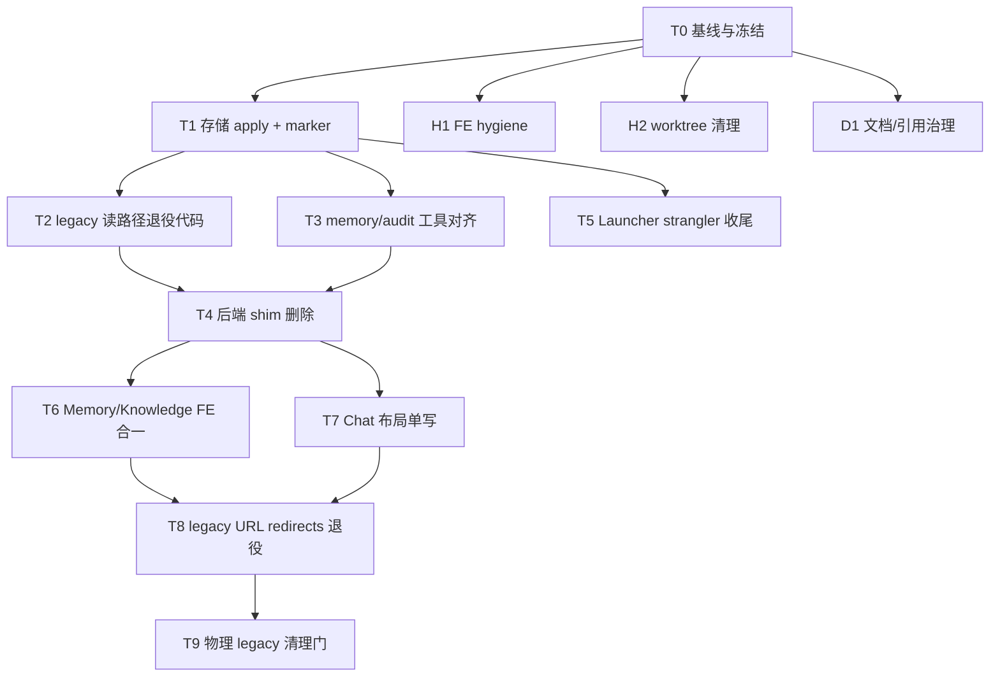

# 兼容层收敛与单一事实源（SSOT）优化方案

| 字段 | 值 |
| --- | --- |
| **Status** | `active-plan` |
| **Created** | 2026-08-16 |
| **Tier** | `HIGH_RISK`（整体）；子任务按 `FAST_PATCH` / `STANDARD_TASK` / `HIGH_RISK` 分级 |
| **Related ADR** | [0002](../adr/0002-agent-collaboration-session-addressing.md) · [0003](../adr/0003-operator-config-lives-outside-repo.md) · [0004](../adr/0004-product-ui-uses-vui-shadcn-only.md) · [0005](../adr/0005-docs-authority-and-archive-policy.md) · [0008](../adr/0008-external-project-storage.md) · [0009](../adr/0009-launcher-control-plane-lives-in-electron-main.md) |
| **Related docs** | [development-standard §24](../standards/development-standard.md) · [web/src/api/README.md](../../web/src/api/README.md) · [worktree-collaboration](../agents/worktree-collaboration.md) |
| **Close when** | 全部 Critical Path 任务验收通过；`activePaths.migrated=true` 稳定 ≥14 天；living doc 无 legacy 误引 |

> **草案说明：** 本文件是实施计划，不是现行规范。权威顺序见 [ADR 0005](../adr/0005-docs-authority-and-archive-policy.md)。关闭后 `git mv` 至 `docs/archive/plans/2026-08/`。

---

## 1. 背景与问题陈述

项目在 ADR 0003 / 0008 / 0009 等决策下已定义 **目标 SSOT**，但代码、工具与运行时仍维护大量 **过渡兼容层**：

- **存储双轨：** `targetPaths.migrated=true` 而 `activePaths.migrated=false` 时，外部目标树已有数据，运行时仍读仓库内 `.runtime/`、`logs/`、`.docs/project-memory/` 等 legacy 路径。
- **域双轨：** 前端 Memory/Knowledge 双 API 模块、Chat 布局三写、Launcher HTTP/IPC + stale runtime shim、后端 LLM v1 / capability cache / chat_state JSON 等。
- **协作双轨：** audit、reset、quality gate 仍硬编码 `.docs/project-memory`；磁盘 `.worktrees` 孤儿目录与 Git 注册不一致。

**目标：** 每个域保留 **一个 authoritative SSOT**；兼容层仅保留 **有 ADR 或明确 removal trigger 的只读 recover**，其余删除或冻结新增。

---

## 2. 目标与非目标

### 2.1 目标（In）

| 域 | 收敛方向 |
| --- | --- |
| 项目可变状态 | 外部 `%LOCALAPPDATA%\Vibelution\projects\...` 为唯一 active 读路径 |
| Project memory | 外部 `memory/`；`.docs/project-memory/` 只读归档 |
| Operator 配置 | Documents `config.toml`；消除「改仓库 config 无效」 |
| Launcher | Electron IPC 为控制面 SSOT；移除 Python `:8765` strangler 与 stale runtime 合成 |
| 后端 shim | LLM v1、capability cache import、`storage_paths` re-export 等 |
| 前端域 | Memory/Knowledge 合一、Chat 布局单写、legacy URL redirects 退役 |
| 协作/工具 | audit / reset / quality gate 使用 resolved paths |
| Worktree 卫生 | orphan `.worktrees`、已 merge 分支清理 |

### 2.2 非目标（Out）

- 删除 `docs/archive/` 正文（仅治理 living 引用）
- 移除 `[storage].data_home` / `VIBELUTION_DATA_HOME` operator override
- 一次性 HeroUI prop 全仓 codemod（单独大 slice）
- 远端 push / 未经确认的物理删 legacy 目录
- 合并 Session 与 chat-rooms **产品概念**（仅评估 `/api/conversations` 索引是否可删）

---

## 3. 本机基线（Phase 0 证据，2026-08-16）

运行：

```powershell
python scripts/migrate_project_storage.py inventory --project "<project-root>"
```

**观测结果（Vibelution 集成 checkout）：**

| 项 | 值 |
| --- | --- |
| `targetPaths.migrated` | `true` |
| `activePaths.migrated` | `false` |
| `activePaths.runtime` | `<repo>/.runtime` |
| `activePaths.logs` | `<repo>/logs` |
| `activePaths.memory` | `<repo>/.docs/project-memory` |
| `activePaths.data` | `Documents/Vibelution/data` |
| 外部 target | `%LOCALAPPDATA%\Vibelution\projects\ccdawn-vibelution\...` |
| `.worktrees` 磁盘目录 | 20（Git 注册约 6） |
| `Vibelution-worktrees` 兄弟目录 | 不存在 |

**结论：** 迁移 **数据侧已就绪**，**路由侧未 authoritative** — 这是当前最大双 SSOT 根因。

---

## 4. North Star SSOT 地图（完成后态）

| 域 | SSOT | 允许的唯一「兼容」 |
| --- | --- | --- |
| 可变状态 | 外部 instance `{data,runtime,logs,cache}` | rollback 窗口内 legacy 目录只读存在 |
| Memory | 外部 `projects/<id>/memory/` | ADR 0002 inbox legacy body 只读 recover |
| Config | Documents `config.toml` | 仓库 template + bootstrap 升级 |
| Launcher 控制 | `desktop/electron/` IPC | 浏览器 dev 仍 HTTP `/api/launcher/*` |
| FE JSON API | `web/src/api/<domain>.ts` | route 层 SSE 例外（见 [web/src/api/README.md](../../web/src/api/README.md)） |
| Chat 布局 | `vibelution.pane-layouts.v1` + `WORKBENCH_LAYOUT_IDS` | server ui-preferences 作 mirror，不作第三写源 |
| Agent claim | Git common-dir registry | memory 为 durable 投影，非第二 writer |
| 会话消息 body | SQLite session / ledger | `chat_state.json` 消息 blob（退役中） |

---

## 5. 总体策略



**主链：** T0 → T1 → T2/T3 → T4 → T6/T7 → T8 → T9

**并行轨：** H1、H2、D1 可与 T0 起并行；T5 在 T1 后与 T4 部分并行。

---

## 6. Critical Path 任务

### Phase 0 — 基线、冻结、账本

**Task T0: 兼容收敛基线包**

| 项 | 内容 |
| --- | --- |
| **Owner** | 基础设施 / 协调 |
| **Tier** | `STANDARD_TASK` |
| **Worktree** | `codex/compat-ssot-baseline` |
| **交付** | ① inventory JSON 归档；② `git worktree list` vs 磁盘 `.worktrees/*` 差异表；③ living doc 对 legacy 路径/`:8765`/`Vibelution-worktrees` 引用清单 |
| **冻结（至 T1 完成）** | 禁止新增 legacy 读路径；禁止提高 guard budget；禁止向 `.docs/project-memory/` 新增写入 |
| **验证** | 基线 artifact 可审阅；无代码变更或仅 docs |

---

### Phase 1 — 存储 SSOT 切换（最高风险门）

**Task T1: 存储 migration apply + authoritative 切换**

| 项 | 内容 |
| --- | --- |
| **Owner** | `scripts/migrate_project_storage.py` · `vibelution_storage.py` · ADR 0008 |
| **Tier** | `HIGH_RISK` |
| **Mode** | BDD_TDD（marker / rollback） |
| **前置门控** | Launcher + RM + 后台轮询已 stop；inventory SHA 一致；无 dirty 存储相关 worktree；**用户确认 apply 窗口** |
| **步骤** | `python scripts/migrate_project_storage.py apply --project "<root>"` → 验证 marker → 重启 Launcher → `inventory` 显示 `activePaths.migrated=true` |
| **Rollback** | `rollback` 子命令（归档 marker，保留双份数据） |
| **验证** | storage pytest；新 runtime scene 落外部 `logs/`；`activePaths.memory` 指向 external |

**Task T2: 删除/收缩 legacy 存储读分支**

| 项 | 内容 |
| --- | --- |
| **Owner** | `vibelution_storage.py` · `storage_migration.py` |
| **Dependency** | T1 稳定 ≥48h，无 rollback |
| **交付** | marker 存在时不再 fallback 到 repo 内路径；删除 `core/infrastructure/storage_paths.py` re-export（codemod → `vibelution_storage`） |
| **Tier** | `HIGH_RISK` |

**Task T3: 工具与 audit 路径对齐**

| 项 | 内容 |
| --- | --- |
| **Owner** | `integration_audit.py` · `maintenance_reset.py` · `local_quality_gate.py` |
| **Dependency** | T1（可与 T2 并行） |
| **交付** | hot-file / protected-path 改用 `resolve_project_memory_home()` 等 resolved API |
| **Tier** | `STANDARD_TASK` |
| **Worktree** | `codex/storage-tool-path-align` |

---

### Phase 2 — 后端 shim 与 Launcher

**Task T4: 后端兼容 shim 批次删除**

| 子任务 | 内容 | 门控 |
| --- | --- | --- |
| **T4a** | LLM config v1 / `role_bindings` → 升级脚本 + fail-closed | 外部 config 无 v1 |
| **T4b** | `runtime_capabilities` legacy import 删除 | catalog 均完成 import |
| **T4c** | `chat_state.json` 消息路径删除 | 无 legacy 消息保留流量 |
| **T4d** | `legacy_xml_tool_decoder` 退役 | wire 无 XML-only 模型 |

**Dependency：** T2 后；T4c 建议 storage 稳定后。

**Task T5: Launcher strangler 收尾**

| 项 | 内容 |
| --- | --- |
| **Owner** | `core/launcher/` · `desktop/electron/` · `web/src/api/launcher.ts` |
| **Tier** | `HIGH_RISK` |
| **交付** | 确认无 `:8765` living 引用 → 删/降级 `core/launcher/app.py` HTTP → 删 `legacyBranchInstanceRuntime()` → profile 只写 `operatorConfigPath` |
| **验证** | electron vitest · `test_launcher_*` · 打包冒烟 |
| **Worktree** | `codex/launcher-strangler-closeout` |

---

### Phase 3 — 前端域收敛

**Task H1: 前端 hygiene（可与 T0 并行）**

| 项 | 内容 |
| --- | --- |
| **Tier** | `FAST_PATCH` |
| **交付** | 删 dead query keys；`listChildSessions` dedupe；contract test |
| **验证** | vitest api tests · `npx tsc -b` |
| **Worktree** | `codex/fe-api-hygiene` |

**Task T6: Memory / Knowledge 前端单域**

| 项 | 内容 |
| --- | --- |
| **Tier** | `STANDARD_TASK` |
| **Dependency** | 与 backend pack README ownership 对齐（半天对齐） |
| **交付** | 单一 canonical FE module；打破 `types/memory` ↔ `types/teams` 循环；统一 queryKeys；更新 [web/src/api/README.md](../../web/src/api/README.md) |
| **Worktree** | `codex/fe-memory-knowledge-unify` |

**Task T7: Chat 布局单写 SSOT**

| 项 | 内容 |
| --- | --- |
| **Tier** | `STANDARD_TASK` |
| **交付** | `WORKBENCH_LAYOUT_IDS.chat` + `vibelution.pane-layouts.v1` 为唯一 mutation；`shellStore` 宽度 hydrate 后删除；ui-preferences 作 mirror |
| **验证** | layout gate · chat layout tests · `tsc -b` |
| **Worktree** | `codex/fe-chat-layout-ssot` |

---

### Phase 4 — 路由与文档收尾

**Task T8: Legacy URL redirects 退役**

| 项 | 内容 |
| --- | --- |
| **Dependency** | T6/T7；T0 起 30 天 access log / telemetry |
| **交付** | 移除零流量 `Legacy*Redirect` |
| **Tier** | `STANDARD_TASK` |

**Task D1: 文档与引用治理（全程并行）**

| 项 | 内容 |
| --- | --- |
| **交付** | living doc 清 legacy 误引；closed plans → archive；可选在 development-standard 增「兼容退役 checklist」链到本文 |
| **Tier** | `FAST_PATCH` ~ `STANDARD_TASK` |

**Task H2: Worktree / 分支卫生**

| 项 | 内容 |
| --- | --- |
| **Dependency** | T0 差异表 |
| **规则** | 禁止删 dirty / 未 merge worktree |
| **交付** | 已 merge 分支删除；orphan 目录移除；`git worktree prune` |

---

### Phase 5 — 物理清理（破坏性门）

**Task T9: Legacy 目录物理清除**

| 项 | 内容 |
| --- | --- |
| **Tier** | `HIGH_RISK` |
| **Dependency** | T1–T8 全绿；T1 后 ≥14 天无 rollback；连续两次 inventory `activePaths.migrated=true` |
| **用户授权** | 显式确认后删除 repo 内 `.runtime/`、`logs/`、`.cache/`、`.docs/project-memory/`（可选留 MOVED 指针） |
| **验证** | 全量 pytest · Launcher 重启 · inventory |

---

## 7. 兼容层清单（审计摘要）

### 7.1 P0 — 须先收敛

| # | 兼容层 | SSOT | 主要路径 |
| --- | --- | --- | --- |
| 1 | 存储双轨 | 外部 instance 树 | `vibelution_storage.py` · `storage_migration.py` |
| 2 | Memory 双 home | 外部 `memory/` | `.docs/project-memory/` |
| 3 | FE Memory/Knowledge 双域 | backend pack ownership | `web/src/api/memory.ts` · `knowledge.ts` |
| 4 | Chat 布局三写 | `pane-layouts.v1` | `shellStore` · `workbenchUiPreferencesSync` |

### 7.2 P1 — 可较快减兼容

| # | 兼容层 | 任务 |
| --- | --- | --- |
| 5 | Living doc 误引 archive / HeroUI / 8765 | D1 |
| 6 | 仓库 config 被当运行时 | D1 + doctor 提示 |
| 7 | Legacy URL redirects | T8 |
| 8 | Dead query keys / duplicate API exports | H1 |
| 9 | `storage_paths.py` re-export | T2 |
| 10 | orphan `.worktrees` | H2 |
| 11 | audit/reset 硬编码 memory 路径 | T3 |

### 7.3 P2 — 需迁移门后再删

LLM v1 materialization · capability cache import · `chat_state.json` · legacy inbox body · XML tool decoder · `legacyBranchInstanceRuntime` · `core/launcher/app.py` HTTP · agent `legacyWorkspacePath` · user env fallback

### 7.4 P3 / 保留

HeroUI prop 别名 · route re-export barrels · Vitest shims · archive 正文 · operator `data_home` override · VButton/VNative 产品分界

---

## 8. 风险矩阵

| 兼容层 | 误删/误用后果 | 优先级 |
| --- | --- | --- |
| 未 migration 的 active 读路径 | 数据丢失、Agent 读错树 | **P0** |
| 活 task worktree / dirty 目录 | 未合入代码丢失 | **P1** |
| 仓库 config 当运行时 | 「改了无效」 | **P1** |
| `core/launcher/app.py` HTTP | 双控制面 | **P2** |
| archive 当规范 | 错误实现 | **P2** |
| archive 文件本身 | 丢考古材料 | **P3**（保留） |

---

## 9. 验证与成功证据

| 阶段 | 成功证据 |
| --- | --- |
| T0 | 基线 JSON + worktree 差异表 + 引用清单 |
| T1 | `activePaths.migrated=true`；外部 logs 有新 scene |
| T2–T3 | 无代码写 repo 内 `.runtime`；工具用 resolved paths |
| T4 | `test_full_stack_contract_guards.py` 仍 0 budget |
| T5 | 无 `:8765` listen；Electron lifecycle 绿 |
| T6–T7 | 单 query tree；Chat 单 mutation 路径；`tsc -b` 绿 |
| T8 | redirect 零流量或已删除 |
| T9 | 物理 legacy 空；inventory 仅 external |

**每 slice 完成块（[loop.md](../guides/loop.md) §4）：** 变更摘要 · 验证命令 · Launcher refresh · merge + cleanup · version impact

| 任务组 | Version impact |
| --- | --- |
| T1 / T2 / T9 | **major**（路径语义；需 release note） |
| T4–T8 | minor ~ patch |

---

## 10. 建议 Sprint 排期

| Sprint | 任务 | 产出 |
| --- | --- | --- |
| **S1** | T0 + H1 + H2 + D1（部分） | 基线账本、FE hygiene、worktree 干净 |
| **S2** | **T1 + T3**（用户授权窗口） | 存储 authoritative；工具路径对齐 |
| **S3** | T2 + T5 + T4a | legacy 读分支删除、Launcher 收尾、LLM shim 首批 |
| **S4+** | T6 · T7 · T8 · T4b–d · T9 | 域合并与物理清理 |

---

## 11. 执行纪律

- 所有开发在 `<integration-root>/.worktrees/<task-slug>` + `codex/<task-slug>` 分支；根 `main` 只 ff-only 合入。
- 多 Agent 并行：每 slice `claim`；T1 前全员停 Launcher/RM。
- Windows 无控制台：后台仍走 `pythonw` / launcher helper。
- 触及 `web/`：slice 结束前 `npx tsc -b --pretty false`。
- Project memory 决策：T1 后写入 **external memory**，不向 `.docs/project-memory/` 新增。

---

## 12. Deferred（非 Critical Path）

| 项 | 触发条件 |
| --- | --- |
| HeroUI prop 重命名 | VUI codemod 就绪 |
| 删除 `/api/conversations` | Backend 确认 sessions 覆盖 |
| 删除 `VIBELUTION_ENABLE_USER_ENV_FALLBACK` | 全环境默认 off ≥6 个月 |
| XML tool decoder | Provider 矩阵无 XML 工具 |
| 压缩 archive | 仅存储成本驱动 |

---

## 13. 关闭与归档

当以下条件 **全部** 满足：

1. T1–T8 验收证据已闭合（T9 按用户授权可选）；
2. 本文 Status 改为 `implemented` 或 `superseded`；
3. 更新 [plans/README.md](README.md) 与 [docs/README.md](../README.md) 白名单；

执行：

```powershell
git mv docs/plans/2026-08-16-compat-ssot-closeout-plan.md docs/archive/plans/2026-08/
```

并在 archive 条目注明 superseding ADR / standard 章节（若规范已吸收要点）。

---

## 14. 附录：关键命令

```powershell
# Phase 0 / 持续验证
python scripts/migrate_project_storage.py inventory --project "<project-root>"

# Phase 1 apply（HIGH_RISK — 停 Launcher 后）
python scripts/migrate_project_storage.py apply --project "<project-root>"

# 测试选取
.\.venv\Scripts\python.exe tests\select_tests.py --from-git main --commands-only

# FE guard
cd web
npx vitest run src/api/fullStackApiBoundary.test.ts --fileParallelism=false
npx tsc -b --pretty false

# Worktree 卫生
git worktree list
git worktree prune
```
