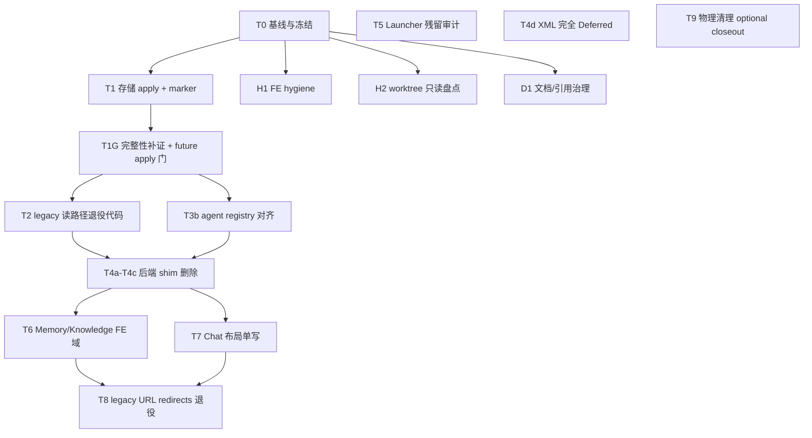

# 兼容层收敛与单一事实源（SSOT）优化方案

| 字段 | 值 |
| --- | --- |
| **Status** | `active-plan` |
| **Created** | 2026-08-16 |
| **Reviewed** | 2026-08-16（仓库审查结论重放至最新 main） |
| **Implementation status** | T1 apply 已执行（2026-08-16）；**T1G 代码门已落地**（readiness / SQLite bundle / quiescence / integrity_check / rollback delta）；T2 / T3b **未完成**；未执行真实 apply / reapply / rollback / delete |
| **Tier** | `HIGH_RISK`（整体）；子任务按 `FAST_PATCH` / `STANDARD_TASK` / `HIGH_RISK` 分级 |
| **Related ADR** | [0002](../adr/0002-agent-collaboration-session-addressing.md) · [0003](../adr/0003-operator-config-lives-outside-repo.md) · [0004](../adr/0004-product-ui-uses-vui-shadcn-only.md) · [0005](../adr/0005-docs-authority-and-archive-policy.md) · [0008](../adr/0008-project-mutable-state-lives-outside-source-tree.md) · [0009](../adr/0009-launcher-control-plane-lives-in-electron-main.md) |
| **Related docs** | [development-standard §24](../standards/development-standard.md) · [web/src/api/README.md](../../web/src/api/README.md) · [worktree-collaboration](../agents/worktree-collaboration.md) |
| **Close when** | Critical Path（T0→T1→T1G→T2/T3b→T4a–T4c→T6/T7→T8）验收通过；支持关闭 H1(done) / H2 / T5 / D1；`activePaths.migrated=true` 稳定 ≥14 天；living doc 无 legacy 误引；T4d / T9 不阻塞 |

> **草案说明：** 本文件是实施计划，不是现行规范。权威顺序见 [ADR 0005](../adr/0005-docs-authority-and-archive-policy.md)。关闭后 `git mv` 至 `docs/archive/plans/2026-08/`。

---

## 1. 背景与问题陈述

项目在 ADR 0003 / 0008 / 0009 等决策下已定义 **目标 SSOT**，但代码、工具与运行时仍维护大量 **过渡兼容层**：

- **存储双轨（T1 前）**：`targetPaths.migrated=true` 而 `activePaths.migrated=false` 时，外部目标树已有数据，运行时仍读仓库内 `.runtime/`、`logs/`、`.docs/project-memory/` 等 legacy 路径。T1 apply 后 `activePaths.migrated=true`，legacy 读分支与双轨代码仍需按 T2 退役。
- **域双轨：** 前端 Memory/Knowledge 双 API 模块、Chat 布局三写、Launcher HTTP/IPC + stale runtime shim、后端 LLM v1 / capability cache / chat_state JSON 等。
- **协作双轨：** audit、reset、quality gate 曾硬编码 `.docs/project-memory`（T3a 已用 resolved API）；agent live registry 仍取 memory 侧 `agent-registry.json`（T3b 未完成）；磁盘 `.worktrees` 孤儿目录与 Git 注册不一致。

**目标：** 每个域保留 **一个 authoritative SSOT**；兼容层仅保留 **有 ADR 或明确 removal trigger 的只读 recover**，其余删除或冻结新增。

---

## 2. 目标与非目标

### 2.1 目标（In）

| 域 | 收敛方向 |
| --- | --- |
| 项目可变状态 | 外部 `%LOCALAPPDATA%\Vibelution\projects\...` 为唯一 active 读路径 |
| Project memory | 外部 `memory/`；`.docs/project-memory/` 只读归档 |
| Operator 配置 | Documents `config.toml`；消除「改仓库 config 无效」 |
| Launcher | Electron IPC 为控制面 SSOT；ADR0009 迁移已关闭；`T5` 仅做残留审计，删确证死代码，不要求全仓 `:8765` 零命中 |
| 后端 shim | LLM v1、capability cache import、`storage_paths` re-export 等（`runtime_capabilities` facade 不可整删） |
| 前端域 | Memory/Knowledge 保持 one domain→one transport（不合并 `memory.ts`/`knowledge.ts`）、Chat 布局单写、legacy URL redirects 退役 |
| 协作/工具 | audit / reset / quality gate 使用 resolved paths；agent live registry 切 Git common-dir |
| Worktree 卫生 | 只读盘点优先；仅清理归本任务所有或证明 clean+merged+inactive+无 claim 的项 |

### 2.2 非目标（Out）

- 删除 `docs/archive/` 正文（仅治理 living 引用）
- 移除 `[storage].data_home` / `VIBELUTION_DATA_HOME` operator override
- 一次性 HeroUI prop 全仓 codemod（单独大 slice）
- 远端 push / 未经确认的物理删 legacy 目录
- 合并 Session 与 chat-rooms **产品概念**（仅评估 `/api/conversations` 索引是否可删）
- 全仓 `:8765` 零命中（ADR/history/fixture/browser-dev HTTP 合法保留）
- 删除 `runtime_capabilities` facade 整体（需版本窗口 / upgrader）
- 关闭以 T4d / T9 为必要条件

---

## 3. 本机基线（Phase 0 证据，2026-08-16）

运行：

```powershell
python scripts/migrate_project_storage.py inventory --project "<project-root>"
```

**观测结果（Vibelution 集成 checkout）：**

| 项 | 值 |
| --- | --- |
| `targetPaths.migrated` | `true` |
| `activePaths.migrated` | **`true`**（T1 apply 已执行，2026-08-16） |
| `activePaths.runtime` | `%LOCALAPPDATA%\Vibelution\projects\ccdawn-vibelution\instances\bcabd5ca\runtime` |
| `activePaths.logs` | `...\instances\bcabd5ca\logs` |
| `activePaths.data` | `...\instances\bcabd5ca\data` |
| `activePaths.cache` | `...\instances\bcabd5ca\cache` |
| `activePaths.memory` | project-level `%LOCALAPPDATA%\Vibelution\projects\ccdawn-vibelution\memory` |
| 当前 inventory（post-cutover） | 约 **7,807 files / 1,604,130,267 bytes**（data/runtime/logs/cache 在 instance；memory 在 project-level） |
| pre-cutover 对照 | 7,318 files / 1,195,524,004 bytes（**仅作历史对照**；完整 manifest 不入 Git） |
| 外部 target | `%LOCALAPPDATA%\Vibelution\projects\ccdawn-vibelution\...` |
| `.worktrees` 磁盘目录 | 以 `git worktree list` 为准（数量不固定，勿固化数字） |
| `Vibelution-worktrees` 兄弟目录 | 不存在 |
| T1 apply 备份 | `instances\bcabd5ca.pre-legacy-apply-backup-20260816` |

**结论：** 存储 **authoritative 切换已完成**；legacy 目录仍只读保留。**post-cutover 总量已增长**，直接 marker rollback 明确 **blocked**；回退只能停写、reverse delta、显式 reconcile 且用户独立确认。当前 rollback 实现只撤 marker/registration 并保留复制数据、**不回灌新写**。T2 门控见 T1G + 稳定门（至少 2026-08-18），不能只靠 48 小时。

---

## 4. North Star SSOT 地图（完成后态）

| 域 | SSOT | 允许的唯一「兼容」 |
| --- | --- | --- |
| 可变状态 | 外部 instance `{data,runtime,logs,cache}` | rollback 窗口内 legacy 目录只读存在 |
| Memory | 外部 `projects/<id>/memory/` | ADR 0002 inbox legacy body 只读 recover |
| Config | Documents `config.toml` | 仓库 template + bootstrap 升级 |
| Launcher 控制 | `desktop/electron/` IPC | browser-dev HTTP（ADR/history/fixture 合法保留） |
| FE JSON API | `web/src/api/<domain>.ts` | route 层 SSE 例外（见 [web/src/api/README.md](../../web/src/api/README.md)） |
| Chat 布局 | `paneLayouts.chat`（`vibelution.pane-layouts.v1` + `WORKBENCH_LAYOUT_IDS`） | server paneLayouts 仅 durable mirror，不作第二写源 |
| Agent claim | Git common-dir **live registry** | 旧 memory `agent-registry.json` 仅限时只读兼容 + removal trigger |
| 会话消息 body | SQLite session / ledger | `chat_state.json` 消息 blob（退役中） |

---

## 5. 总体策略



**主链：** T0 → T1(applied) → **T1G** → T2/T3b → T4a–T4c → T6/T7 → T8

**支持关闭：** H1(done)、H2、T5（Launcher 残留审计，独立于 storage 主链）、D1。

**不阻塞：** T4d（XML 完全 Deferred）、T9（独立破坏性确认的 optional closeout）。

---

## 6. Critical Path 任务

### Phase 0 — 基线、冻结、账本

**Task T0: 兼容收敛基线包**

| 项 | 内容 |
| --- | --- |
| **Owner** | 基础设施 / 协调 |
| **Tier** | `STANDARD_TASK` |
| **Worktree** | `codex/compat-ssot-baseline` |
| **交付** | ① inventory JSON 归档（仅基线，完整 manifest 不入 Git）；② `git worktree list` vs 磁盘 `.worktrees/*` 差异表（数量以命令为准）；③ living doc 对 legacy 路径/`:8765`/`Vibelution-worktrees` 引用清单 |
| **冻结（至 T1 完成）** | 禁止新增 legacy 读路径；禁止提高 guard budget；禁止向 `.docs/project-memory/` 新增写入 |
| **验证** | 基线 artifact 可审阅；无代码变更或仅 docs |

---

### Phase 1 — 存储 SSOT 切换（最高风险门）

**Task T1: 存储 migration apply + authoritative 切换** — **done / applied**（2026-08-16）

| 项 | 内容 |
| --- | --- |
| **Owner** | `scripts/migrate_project_storage.py` · `vibelution_storage.py` · ADR 0008 |
| **Tier** | `HIGH_RISK` |
| **Mode** | BDD_TDD（marker / rollback） |
| **前置门控** | Launcher + RM + 后台轮询已 stop；inventory SHA 一致；无 dirty 存储相关 worktree；**用户确认 apply 窗口** |
| **步骤** | `python scripts/migrate_project_storage.py apply --project "<root>"` → 验证 marker → 重启 Launcher → `inventory` 显示 `activePaths.migrated=true` |
| **Rollback 现状** | post-cutover 总量已增长，**直接 marker rollback 明确 blocked**；回退只能停写、reverse delta、显式 reconcile 且用户独立确认。当前 `rollback` 实现只撤 marker/registration 并保留复制数据，**不回灌新写** |
| **验证** | storage pytest；新 runtime scene 落外部 `logs/`；`activePaths.memory` 指向 external |

**Task T1G: 迁移后完整性补证 + future apply/reapply 强制门** — **done**（代码门 2026-08-17；T2 仍须稳定门）

| 项 | 内容 |
| --- | --- |
| **Owner** | `scripts/migrate_project_storage.py` · `vibelution_storage.py` · `core/infrastructure/storage_migration.py` · ADR 0008 |
| **Tier** | `HIGH_RISK` |
| **位置** | T1 之后、T2 之前 |
| **已落地** | ① 机器化静止：active-work / Launcher / Runtime Manager / writer 全部静止；② destination conflict（含 orphan WAL/SHM）；③ SQLite bundle fingerprint + staging/atomic no-clobber promote + `quick_check`/`integrity_check`（私有快照，不改源）；④ source-write / quiescence window / bundle / rollback delta（含 `target.memory` 与 sidecar）测试；⑤ cache `cold_rebuild`；⑥ apply / reapply 强制重跑 readiness，窗口内源变化 fail-closed |
| **门语义** | T1G 落地后，**每次** apply / reapply 仍须自身重验，且用户独立确认；禁止真实 checkout 上未经确认的 apply / rollback |
| **验证** | `tests/test_storage_migration.py` |

**Task T2: 删除/收缩 legacy 存储读分支** — **blocked**（至少至 2026-08-18，且满足稳定门）

| 项 | 内容 |
| --- | --- |
| **Owner** | `vibelution_storage.py` · `storage_migration.py` |
| **Dependency** | T1G 全绿；外部读写健康；无 legacy-path 新写；无 rollback trigger / integrity 告警。**不能只靠 T1 后 48 小时** |
| **交付** | marker 存在时不再 fallback 到 repo 内路径；删除 `core/infrastructure/storage_paths.py` re-export（codemod → `vibelution_storage`） |
| **Tier** | `HIGH_RISK` |

**Task T3: 工具与 audit 路径对齐** — **部分完成**

**T3a: resolved storage 对齐** — **done**（2026-08-16；commit `62dbba053`）

| 项 | 内容 |
| --- | --- |
| **Owner** | `maintenance_reset.py` · `local_quality_gate.py` · `integration_audit.py`（仅 resolved-storage slice） |
| **Dependency** | T1（可与 T2 并行） |
| **交付** | hot-file / protected-path 改用 `resolve_project_memory_home()` 等 resolved API |
| **Tier** | `STANDARD_TASK` |
| **Worktree** | `codex/storage-tool-path-align` |

**T3b: agent registry 对齐（live registry）** — **open**（未完成）

| 项 | 内容 |
| --- | --- |
| **Owner** | `integration_audit.py`（agent live registry，归本任务；T3a 只覆盖其 resolved-storage slice） |
| **Dependency** | T1（可与 T2 并行） |
| **现状** | `integration_audit` 仍从 `resolve_project_memory_home(...)/agent-registry.json` 取 **live registry** |
| **目标** | 切 **Git common-dir live registry**；旧 memory `agent-registry.json` 仅限时只读兼容并设 **removal trigger** |
| **Tier** | `STANDARD_TASK` |

---

### Phase 2 — 后端 shim 与 Launcher

**Task T4: 后端兼容 shim 批次删除**

| 子任务 | 内容 | 门控 |
| --- | --- | --- |
| **T4a** | LLM config v1 / `role_bindings` → 升级脚本 + fail-closed | 版本支持窗口 + bootstrap / upgrader 落地，外部 config 无 v1 |
| **T4b** | `runtime_capabilities` legacy import 删除 | 需版本窗口 / upgrader；**facade 不可整删**；本机 schema2 / import complete **非全局**；明确 `public_config` / `config_service` 的 facade 消费关系 |
| **T4c** | `chat_state.json` 消息路径删除 | 正常保存已删 messages；仅 `legacy_messages_preserved` 或 status queued/running/stopping 且 `latest_ledger_sequence<=0` 时保留兜底；任务是测命中、零命中/升级窗口后移除 |

**Dependency：** T2/T3b 后；T4c 建议 storage 稳定后。

**Task T4d: XML tool decoder 退役** — **完全 Deferred**（从 Phase 2 移出）

- 不在本轮交付范围；协议 matrix 完成 + 零命中后 **另立并重新分级**，不预判 version impact。

**Task T5: Launcher 残留审计（独立于 storage 主链）**

| 项 | 内容 |
| --- | --- |
| **Owner** | `core/launcher/` · `desktop/electron/` · `web/src/api/launcher.ts` |
| **Tier** | `HIGH_RISK` |
| **现状** | ADR0009 迁移已关闭；产品控制面 = Electron IPC |
| **交付** | 证明 packaged/product **不依赖 `:8765`** → 删确证死代码；ADR/history/fixture/browser-dev HTTP **合法保留**；profile 只写 `operatorConfigPath` |
| **验证** | electron vitest · `test_launcher_*` · 打包冒烟 |
| **Worktree** | `codex/launcher-strangler-closeout` |

---

### Phase 3 — 前端域收敛

**Task H1: 前端 hygiene（可与 T0 并行）** — **done**（2026-08-16；`ead810014` · `1b7dbd92d`）

| 项 | 内容 |
| --- | --- |
| **Tier** | `FAST_PATCH` |
| **交付** | 删 dead query keys；`listChildSessions` dedupe；contract test |
| **验证** | vitest api tests · `npx tsc -b` |
| **Worktree** | `codex/fe-api-hygiene` |

**Task T6: Memory / Knowledge 前端单域**

| 项 | 内容 |
| --- | --- |
| **Tier** | `STANDARD_TASK` |
| **Dependency** | 与 backend pack README ownership 对齐（半天对齐） |
| **交付** | 保持 **one backend domain → one transport**：**不合并 `memory.ts` / `knowledge.ts`**；拆 DTO 打断 `types/memory.ts` ↔ `types/teams.ts` 循环；统一 queryKeys；更新 [web/src/api/README.md](../../web/src/api/README.md) |
| **Worktree** | `codex/fe-memory-knowledge-unify` |

**Task T7: Chat 布局单写 SSOT**

| 项 | 内容 |
| --- | --- |
| **Tier** | `STANDARD_TASK` |
| **交付** | `paneLayouts.chat`（`WORKBENCH_LAYOUT_IDS.chat` + `vibelution.pane-layouts.v1`）为**唯一写契约**；`shell.chatPanelWidths` 仅在 canonical 缺失时**单向迁移**并**停止 legacy 写**；server `paneLayouts` 仅 **durable mirror** |
| **执行** | 分阶段更新前端 / 后端 / 测试 / VUI docs |
| **验证** | layout gate · chat layout tests · `tsc -b` |
| **Worktree** | `codex/fe-chat-layout-ssot` |

---

### Phase 4 — 路由与文档收尾

**Task T8: Legacy URL redirects 退役**

| 项 | 内容 |
| --- | --- |
| **Dependency** | T6/T7 |
| **步骤** | 先上线 `browser.user_action.legacy_redirect_observed`；fields 至少 `legacyRoute` / `targetRoute` / `pathname` / `search` 分类 |
| **门控** | **30 天自事件上线起**，按 route **零命中**后移除 `Legacy*Redirect` |
| **Tier** | `STANDARD_TASK` |

**Task D1: 文档与引用治理（全程并行）** — **in progress**

| 项 | 内容 |
| --- | --- |
| **交付** | living doc 清 legacy 误引；closed plans → archive；可选在 development-standard 增「兼容退役 checklist」链到本文 |
| **Done slice** | 本 plan 任务状态与 Sprint 表；[01-authority-and-paths](../ops/config/01-authority-and-paths.md) 迁移后路径表述 |
| **Tier** | `FAST_PATCH` ~ `STANDARD_TASK` |

**Task H2: Worktree / 分支卫生（只读盘点优先）**

| 项 | 内容 |
| --- | --- |
| **Dependency** | T0 差异表 |
| **规则** | 禁止删 dirty / 未 merge worktree；**只清理本任务拥有、或证明 clean + merged + inactive + 无 claim 的项**；未知一律保留 |
| **交付** | 只读盘点 + 安全可清项 + **精确残留报告** 即可完成，不要求全部清空 |

---

### Phase 5 — 物理清理（独立 optional closeout，非主链 / 非关闭条件）

**Task T9: Legacy 目录物理清除**

| 项 | 内容 |
| --- | --- |
| **Tier** | `HIGH_RISK` |
| **Dependency** | 主链 T1–T8 验收通过 |
| **稳定门** | 外部读写健康；无 legacy 写 / rollback / integrity 告警；**不要求无 post-cutover 正常写** |
| **用户授权** | **独立破坏性确认**后删除 repo 内 `.runtime/`、`logs/`、`.cache/`、`.docs/project-memory/`（可选留 MOVED 指针） |
| **验证** | 全量 pytest · Launcher 重启 · inventory |

---

## 7. 兼容层清单（审计摘要）

### 7.1 P0 — 须先收敛

| # | 兼容层 | SSOT | 主要路径 |
| --- | --- | --- | --- |
| 1 | 存储双轨 | 外部 instance 树 | `vibelution_storage.py` · `storage_migration.py` |
| 2 | Memory 双 home | 外部 `memory/` | `.docs/project-memory/` |
| 3 | FE Memory/Knowledge 双域 | backend pack ownership（one domain→one transport） | `web/src/api/memory.ts` · `knowledge.ts` |
| 4 | Chat 布局三写 | `paneLayouts.chat` | `shell.chatPanelWidths`（仅单向迁移） · server paneLayouts mirror |

### 7.2 P1 — 可较快减兼容

| # | 兼容层 | 任务 |
| --- | --- | --- |
| 5 | Living doc 误引 archive / HeroUI / 8765 | D1 |
| 6 | 仓库 config 被当运行时 | D1 + doctor 提示 |
| 7 | Legacy URL redirects | T8 |
| 8 | Dead query keys / duplicate API exports | H1 |
| 9 | `storage_paths.py` re-export | T2 |
| 10 | orphan `.worktrees` | H2 |
| 11 | audit/reset 硬编码 memory 路径 | T3a；agent registry → T3b |

### 7.3 P2 — 需迁移门后再删

LLM v1 materialization（T4a） · capability cache import（T4b，facade 不可整删） · `chat_state.json`（T4c，测命中后移除） · legacy inbox body · `legacyBranchInstanceRuntime` · `core/launcher/app.py` HTTP（T5 残留审计后删确证死代码） · agent `legacyWorkspacePath` · user env fallback

### 7.4 P3 / 保留

HeroUI prop 别名 · route re-export barrels · Vitest shims · archive 正文 · operator `data_home` override · VButton/VNative 产品分界 · **T4d XML tool decoder（完全 Deferred）** · ADR/history/fixture/browser-dev HTTP（`:8765` 合法保留）

---

## 8. 风险矩阵

| 兼容层 | 误删/误用后果 | 优先级 |
| --- | --- | --- |
| 未 migration 的 active 读路径 | 数据丢失、Agent 读错树 | **P0** |
| post-cutover 直接 marker rollback | 新写不回灌 / 数据不一致 | **P0** |
| 活 task worktree / dirty 目录 | 未合入代码丢失 | **P1** |
| 仓库 config 当运行时 | 「改了无效」 | **P1** |
| `core/launcher/app.py` HTTP | 误删可能破坏 browser-dev / fixture；仅当残留重新进入 packaged/product 才造成双控制面（当前状态非双控制面） | **P2** |
| archive 当规范 | 错误实现 | **P2** |
| archive 文件本身 | 丢考古材料 | **P3**（保留） |

---

## 9. 验证与成功证据

| 阶段 | 成功证据 |
| --- | --- |
| T0 | 基线 JSON + worktree 差异表 + 引用清单（完整 manifest 不入 Git） |
| T1 | `activePaths.migrated=true`；外部 logs 有新 scene |
| T1G | 机器化静止门 / destination conflict / SQLite DB+WAL+SHM quick+integrity / source-write、quiescence、SQLite bundle、rollback 测试 / cache cold rebuild 全绿 |
| T2–T3b | 无代码写 repo 内 `.runtime`；工具用 resolved paths；agent live registry 走 Git common-dir |
| T4 | `test_full_stack_contract_guards.py` 仍 0 budget；T4b 有版本窗口 / upgrader；T4c 命中测后移除 |
| T5 | packaged/product 不依赖 `:8765`；确证死代码已删；ADR/history/fixture/browser-dev HTTP 保留 |
| T6–T7 | Memory 与 Knowledge 两个 backend domain **各一个 canonical transport、二者不合并**；DTO cycle 打断；Chat 单写契约；`tsc -b` 绿 |
| T8 | `legacy_redirect_observed` 事件上线；30 天按 route 零命中 |
| T9 | （optional）物理 legacy 空；inventory 仅 external |

**每 slice 完成块（[loop.md](../guides/loop.md) §4）：** 变更摘要 · 验证命令 · Launcher refresh · merge + cleanup · version impact

| 任务组 | Version impact |
| --- | --- |
| T1 / T1G / T2 / T3a / T3b | 存储内部切换**不自动 major**；逐公共兼容契约判断 |
| T4a（公开配置兼容移除） | **可能 major**（需 release note） |
| T4b–T4c、T6–T8 | minor ~ patch |
| 本次修订（仅文档） | refresh **not needed**；project-memory **not affected** |

---

## 10. 建议 Sprint 排期

| Sprint | 任务 | 产出 |
| --- | --- | --- |
| **S1** | T0 + ~~H1~~ + H2（只读盘点）+ D1（部分） | 基线账本；**H1 done**；worktree 只读盘点 + 残留报告 |
| **S2** | ~~**T1 + T3a**~~（**T1 applied 2026-08-16**；T3a done `62dbba053`）+ **T1G** + T3b | 存储 authoritative；完整性补证；agent registry 对齐 |
| **S3** | T2 + T4a–T4c + T5（独立残留审计） | legacy 读分支删除、后端 shim 批次、Launcher 收尾 |
| **S4+** | T6 · T7 · T8 · D1 收尾 · T4d（Deferred）· T9（optional） | 域收敛与关闭 |

---

## 11. 执行纪律

- 所有开发在 `<integration-root>/.worktrees/<task-slug>` + `codex/<task-slug>` 分支；根 `main` 只 ff-only 合入。
- 多 Agent 并行：每 slice `claim`；T1 前全员停 Launcher/RM；T1G 机器化验证主动完成。
- Windows 无控制台：后台仍走 `pythonw` / launcher helper。
- 触及 `web/`：slice 结束前 `npx tsc -b --pretty false`。
- Project memory 决策：T1 后写入 **external memory**，不向 `.docs/project-memory/` 新增。
- 任何 future apply / reapply：T1G 已落地，仍须 apply 自身重验并用户独立确认。

---

## 12. Deferred（非 Critical Path）

| 项 | 触发条件 |
| --- | --- |
| HeroUI prop 重命名 | VUI codemod 就绪 |
| 删除 `/api/conversations` | Backend 确认 sessions 覆盖 |
| 删除 `VIBELUTION_ENABLE_USER_ENV_FALLBACK` | 全环境默认 off ≥6 个月 |
| XML tool decoder（T4d） | 协议 matrix + 零命中后另立并重新分级；不预判 version impact |
| 压缩 archive | 仅存储成本驱动 |

---

## 13. 关闭与归档

当以下条件 **全部** 满足：

1. Critical Path（T0→T1→T1G→T2/T3b→T4a–T4c→T6/T7→T8）验收证据已闭合；支持关闭 H1(done)、H2、T5、D1；T4d / T9 **不阻塞**；
2. `activePaths.migrated=true` 稳定 ≥14 天，外部读写健康、无 legacy 写 / rollback / integrity 告警（不要求无 post-cutover 正常写）；
3. 本文 Status 改为 `implemented` 或 `superseded`；
4. 更新 [plans/README.md](README.md) 与 [docs/README.md](../README.md) 白名单；

执行：

```powershell
git mv docs/plans/2026-08-16-compat-ssot-closeout-plan.md docs/archive/plans/2026-08/
```

并在 archive 条目注明 superseding ADR / standard 章节（若规范已吸收要点）。

---

## 14. 附录：关键命令与基线语义

> **基线语义：** §3 inventory 仅为 **基线**（post-cutover 约 7,807 files / 1,604,130,267 bytes），完整 manifest **不入 Git**；pre-cutover 7,318 / 1,195,524,004 仅作历史对照。future apply / reapply 在 T1G 落地后仍须 apply 自身重验并用户独立确认。

```powershell
# Phase 0 / 持续验证
python scripts/migrate_project_storage.py inventory --project "<project-root>"

# Phase 1 apply（HIGH_RISK — 停 Launcher 后；future apply 需 readiness 全绿 + 用户确认）
python scripts/migrate_project_storage.py apply --project "<project-root>"

# 测试选取
.\.venv\Scripts\python.exe tests\select_tests.py --from-git main --commands-only

# FE guard
cd web
npx vitest run src/api/fullStackApiBoundary.test.ts --fileParallelism=false
npx tsc -b --pretty false

# Worktree 卫生
git worktree list
git worktree prune
```
