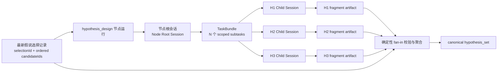
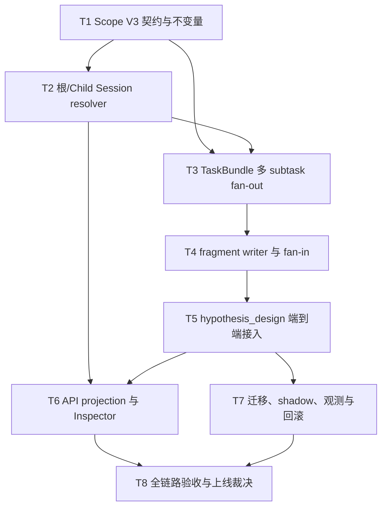

# 挑战杯假说作用域会话与聚合实施方案

> **Status**: `user-approved / active-plan`
>
> **Date**: 2026-08-22
>
> **Decision**: 采用“节点根会话 + 每条假说一个 Child Session + 结构化 artifact 聚合”。本文件是待实施计划，不是现行规范，也不表示功能已经上线。

## 1. 摘要

当前挑战杯正式工作流已经会在**切换工作流节点**时切换绑定会话：会话注册键是 `agentId + workflowRunId + workflowNodeId`。返回同一节点时会恢复该节点原会话；只有正式重试才会创建新的 attempt 会话。

当前缺口不是“所有 checkpoint 都挤在一个会话”，而是**同一节点内部的多个独立研究对象仍共用一个会话**。例如 SCI-096 的 H1、H2、H3 都在 `hypothesis_design` 节点中，现状下会进入同一个节点会话，假说之间的讨论、证据和修订容易互相污染。

目标方案把会话分为两层：

1. 每个 Agent 在每个工作流节点保留一个**节点根会话**，负责节点级编排、进度和最终聚合。
2. 每条被选假说使用一个**隐藏 Child Session**，以 `selectionId + candidateId` 作为稳定作用域；同一假说返回时恢复原 Child Session，正式重试只增加该假说的 attempt。
3. Child Session 只产生结构化 fragment artifact；节点根会话通过确定性 fan-in 聚合成现有 `hypothesis_set`，不把聊天文本直接当业务真源。
4. Child Session 不进入顶层会话列表，只在节点 Inspector/父会话下按需展示，因此不会把用户的会话列表撑爆。

这意味着：**切换节点会切换根会话；切换假说会切换该假说的 Child Session；同一状态 checkpoint 的变化不会无意义地创建新会话。**

## 2. 名词与边界

### 2.1 本文中的 checkpoint

“checkpoint”可能指三种不同对象，必须分开处理：

| 对象 | 示例 | 是否切换会话 |
| --- | --- | --- |
| 工作流节点 | `source_finding` → `hypothesis_design` | 是，切换节点根会话 |
| 节点运行状态 | `queued` → `running` → `summarizing` | 否，仍属于同一逻辑会话 |
| 节点内研究对象 | H1 → H2，或候选 A → 候选 B | 是，切换对应 Child Session |

### 2.2 Agent、Session 与 artifact

- **Agent** 是能力、角色和权限主体，不因切换假说就创建新 Agent。
- **Session** 是模型上下文边界；同一个 Agent 可以拥有多个彼此隔离的 Session。
- **artifact** 是可验证、可聚合的研究产物真源；Session 消息只用于推理和解释，不直接承担最终业务状态。

### 2.3 不在本方案范围内

- 不为每条假说创建新的顶层 Agent。
- 不在每次状态更新时创建会话。
- 不把 Child Session 暴露到普通顶层会话列表。
- 不引入 LangGraph、Temporal 或第二套工作流引擎。
- 不把跨假说的完整聊天历史互相注入。
- 不在本计划阶段修改业务代码、数据或运行时配置。

## 3. 当前机制与真实缺口

### 3.1 现有会话恢复规则

现有 `research_project_agent_sessions.py` 在正式工作流下使用：

```text
recordKey = agentId :: workflowRunId :: workflowNodeId
```

行为是：

1. 首次进入某节点，为该 Agent 创建节点会话。
2. 离开后返回同一 `workflowRunId + workflowNodeId`，恢复当前 attempt。
3. 只有前一任务已终态且调用正式重试时，才创建下一 attempt，并记录 `retryOfSessionId`。
4. 不同节点使用不同 record key，因此正常节点切换已经具备上下文隔离。

### 3.2 假说节点为什么仍会混线

`hypothesis_design` 的会话键只到节点级，没有 `selectionId` 或 `candidateId`。因此 H1、H2、H3 即使是独立假说，也会被视为一个节点任务的上下文。

由此会出现四类风险：

- H2 的反证被模型误当作 H1 的结论。
- 返回 H1 时，必须在长对话中重新定位属于 H1 的上下文。
- H2 失败重试可能迫使整个 `hypothesis_design` 节点换会话。
- 最终 artifact 很难证明每条假说来自哪个会话、哪个 attempt。

### 3.3 已有能力可以复用

项目已经具备本方案的大部分基础：

| 现有能力 | 当前事实 | 本方案用途 |
| --- | --- | --- |
| 节点会话注册与 attempt | 节点键可恢复、正式重试有 lineage | 保留为节点根会话 |
| Child Session | 有 `parentSessionId`、`rootSessionId`、隐藏索引和父子列表 | 承载每条假说的隔离上下文 |
| `ResearchTaskBundle` | 契约支持多个 `subtasks`、`maxConcurrency`、`aggregationContract` | 表达 fan-out/fan-in |
| TaskBundle runtime | 当前固定单 subtask、`maxConcurrency = 1` | 扩展为按候选生成多个 subtask |
| 假说选择记录 | 有 `selectionId`、有序 `selectedCandidateIds`、重选 lineage | 作为逻辑作用域身份 |
| workflow artifact store | 已有 `hypothesis_set` 写入和证据校验 | 增加 fragment 后继续产出 canonical portfolio |
| Node detail / Inspector | 当前只有单 `sessionId` 锚点 | 扩展为根会话 + scoped children 投影 |

## 4. 目标端到端原理



端到端执行顺序：

1. `hypothesis_design` 通过现有 readiness gate，取得最新有效 `HypothesisSelectionRecord`。
2. 解析节点根会话；同一节点返回时继续使用原根会话。
3. 按 `selectedCandidateIds` 创建一个 TaskBundle，每个 candidate 对应一个 subtask。
4. 每个 subtask 以 `selectionId + candidateId` 解析或创建隐藏 Child Session。
5. Child Session 只接收该候选正文、共享约束、允许的证据引用和必要知识包，不接收兄弟假说的聊天历史。
6. 每个 Child Session 产出一个通过契约校验的 `hypothesis_fragment`。
7. fan-in 按选择记录顺序验证“恰好一条候选对应一个有效 fragment”，再生成现有 `hypothesis_set`。
8. 节点根会话只保存进度摘要、fragment 引用和聚合结果，不复制所有子会话全文。

## 5. Session Scope V3 契约

### 5.1 逻辑作用域

新增显式作用域契约，避免继续给函数追加无语义的可选字符串：

```ts
type WorkflowSessionScopeV3 =
  | {
      version: 3;
      kind: "workflow_node_root";
      teamId: string;
      researchProjectId: string;
      agentId: string;
      workflowRunId: string;
      workflowNodeId: string;
    }
  | {
      version: 3;
      kind: "workflow_candidate";
      teamId: string;
      researchProjectId: string;
      agentId: string;
      workflowRunId: string;
      workflowNodeId: string;
      selectionId: string;
      candidateId: string;
    };
```

约束：

- `workflow_node_root` 不允许携带 candidate 字段。
- `workflow_candidate` 必须同时有 `selectionId` 和 `candidateId`。
- `candidateId` 必须属于该 `selectionId` 的 `selectedCandidateIds`。
- scope 字段进入 session binding、TaskBundle subtask、artifact provenance 和 projection，四处必须一致。
- `attempt` 不是逻辑 scope 的组成部分；它描述同一 scope 下的物理执行代次。

### 5.2 稳定 scope key

由 canonical serializer 生成，不允许各模块自行拼字符串：

```text
root      = v3|node|agentId|workflowRunId|workflowNodeId
candidate = v3|candidate|agentId|workflowRunId|workflowNodeId|selectionId|candidateId
```

持久化时可保存 canonical 字符串或其 hash，但 API 和日志必须保留可诊断的结构化字段。禁止仅保存 hash 后丢失来源。

### 5.3 根会话与 Child Session

| 字段 | 根会话 | 假说 Child Session |
| --- | --- | --- |
| `sessionKind` | `main` | `child` |
| `conversationIndexKind` | 现有 team Agent index | `hidden` |
| `parentSessionId` | 空 | 节点根会话 ID |
| `rootSessionId` | 自身 ID | 节点根会话 ID |
| `scope.kind` | `workflow_node_root` | `workflow_candidate` |
| 用户顶层列表 | 可见/按现有规则 | 不可见 |
| 恢复键 | 节点 scope | `selectionId + candidateId` scope |

Child Session 标题使用可读、受限长度的形式，例如：

```text
SCI-096｜假说设计｜H2｜第 1 次
```

标题只用于展示，身份判断必须使用 scope 字段，不能解析标题。

### 5.4 重选与重试

- **返回同一假说**：相同 `selectionId + candidateId`，恢复当前 Child Session。
- **正式重试某条假说**：逻辑 scope 不变，attempt `+1`，新会话通过 `retryOfSessionId` 指向前一 attempt。
- **重新选择假说集**：产生新 `selectionId`；即使包含旧 `candidateId`，也创建新 scope，防止旧选择语境静默污染新选择。
- **节点整体重试**：根会话可增加 root attempt；已完成的 candidate fragment 是否复用由显式 recovery policy 决定，不能隐式搬运。

## 6. 节点作用域策略

不是所有节点都需要 Child Session。新增节点策略表，默认保守：

| 策略 | 适用条件 | 会话行为 |
| --- | --- | --- |
| `node_shared` | 单一顺序任务、节点内没有独立对象 | 仅节点根会话 |
| `candidate_fan_out` | 同一节点并行处理多个被选候选 | 根会话 + 每 candidate 一个 Child Session |
| `round_shared` | 一轮会议是共同决策，必须看到多假说摘要 | 一轮一个共享上下文，只读 fragment 摘要，不读取子会话全文 |

首期只把 `hypothesis_design` 标记为 `candidate_fan_out`。后续若协议设计、实验执行确实需要“一假说一实验”时，再通过同一策略扩展，禁止用节点名称硬编码散落在多个服务中。

## 7. Fan-out 执行设计

### 7.1 TaskBundle 生成

当前 runtime 固定创建一个 subtask。改造后：

```json
{
  "bundleId": "bundle-<nodeRunId>",
  "parentNodeRunId": "<nodeRunId>",
  "subtasks": [
    {
      "subtaskId": "<nodeRunId>:<selectionId>:<candidateId>",
      "scope": {
        "kind": "workflow_candidate",
        "selectionId": "<selectionId>",
        "candidateId": "<candidateId>"
      },
      "sessionId": "",
      "attempt": 1,
      "outputArtifactRefs": []
    }
  ],
  "maxConcurrency": 3,
  "aggregationContract": {
    "mode": "all_required_ordered",
    "identitySource": "hypothesis_selection_record"
  }
}
```

规则：

- subtask 顺序严格跟随 `selectedCandidateIds`。
- `subtaskId`、bundle idempotency key 和 scope key 均可稳定重放。
- `maxConcurrency = min(选中数量, 节点预算上限, 全局并发上限)`；首期默认上限建议为 3。
- 重放创建命令不得生成重复 subtask 或重复 Child Session。
- 一个 Agent 仍可执行多个 subtask，但每个 subtask 必须绑定自己的 Session。

### 7.2 Child Session 输入边界

每个 Child Session 允许注入：

- 该 candidate 的 canonical statement、mechanism/rationale 和预测。
- 当前选择记录身份及候选在选择中的顺序。
- 已批准知识包中允许该任务读取的证据与反证引用。
- 节点统一的输出 schema、预算、截止时间和安全约束。
- 同一 candidate 前一 attempt 的结构化结果摘要（仅正式重试时）。

明确禁止注入：

- 其他 candidate 的完整对话。
- 未批准知识内容或任意顶层会话历史。
- 兄弟 subtask 的中间自由文本。
- 通过 UI 标题推断出的身份。

### 7.3 调度与失败

每个 subtask 独立处于 `pending / running / succeeded / failed / cancelled`。Bundle 状态按聚合契约计算：

- 所有必需 subtask 成功且 fragment 有效 → `succeeded`。
- 任一仍在运行 → `running`。
- 任一失败且尚可重试 → `waiting_retry`（需要扩展现有状态契约）。
- 终态失败或身份/产物不完整 → `failed`，不得生成 canonical `hypothesis_set`。

H2 失败时只重试 H2 scope；H1/H3 的成功 fragment 保留并重新校验，不重跑其会话。

## 8. Fragment artifact 与确定性聚合

### 8.1 `hypothesis_fragment` 契约

建议新增版本化 artifact：

```json
{
  "schemaVersion": 1,
  "kind": "hypothesis_fragment",
  "workflowRunId": "run-sci-096",
  "workflowNodeId": "hypothesis_design",
  "nodeRunId": "nr-...",
  "selectionId": "selection-...",
  "candidateId": "H2",
  "sessionId": "child-...",
  "sessionAttempt": 1,
  "taskId": "task-...",
  "statement": "...",
  "mechanism": "...",
  "predictions": ["..."],
  "falsificationCriteria": ["..."],
  "evidenceRefs": ["..."],
  "counterEvidenceRefs": ["..."],
  "contentHash": "..."
}
```

现有“每条假说必须有反证引用、引用必须来自允许知识包”的 fail-closed 规则继续适用，并前移到 fragment 写入阶段。

### 8.2 Fan-in 不变量

聚合器必须同时满足：

1. 读取的选择记录仍是该 node run 绑定的 `selectionId`。
2. 每个 `selectedCandidateId` 恰好存在一个当前有效 fragment。
3. fragment 的 run、node、node run、selection、candidate、task、session scope 全部匹配。
4. 不接受选择集外 candidate，不接受重复 candidate，不接受缺失 candidate。
5. fragment 按选择记录顺序聚合，不能依赖完成先后或文件遍历顺序。
6. 重放相同输入得到相同 canonical payload/content hash。
7. 聚合器只读取结构化 artifact，不抓取 Child Session 消息做隐式总结。

### 8.3 canonical `hypothesis_set`

最终仍写现有 `hypothesis_set`，保持下游协议设计和现有 API 的业务真源不变，但增加 provenance：

```json
{
  "selectionId": "selection-...",
  "fragmentRefs": ["artifact:h1", "artifact:h2", "artifact:h3"],
  "aggregationMode": "all_required_ordered",
  "candidateSessionAnchors": [
    {
      "candidateId": "H1",
      "sessionId": "child-...",
      "sessionAttempt": 1,
      "fragmentRef": "artifact:h1"
    }
  ]
}
```

消息历史是解释证据，`hypothesis_set` 与 fragment 才是流程推进依据。

## 9. API 与前端交互

### 9.1 后端投影

现有 `ResearchWorkflowNodeDetail.sessionId` 保留为根会话兼容字段，新增：

```ts
type ScopedSessionAnchor = {
  scopeKind: "workflow_candidate";
  selectionId: string;
  candidateId: string;
  sessionId: string;
  sessionAttempt: number;
  taskId?: string | null;
  status: string;
  chatDeepLink: string;
  fragmentRef?: string | null;
};

type ResearchWorkflowNodeDetail = {
  // existing fields...
  sessionId?: string | null; // 节点根会话，兼容
  scopedSessions?: ScopedSessionAnchor[];
};
```

投影要求：

- 只返回当前 node run 和当前 selection 的 scoped sessions。
- 默认只返回摘要，不返回消息正文。
- Child Session 缺失或已损坏时标记 degraded，不静默改绑到兄弟会话。
- 复用现有 Child Session list/service；不新增第二个会话关系真源。

### 9.2 Inspector

在假说节点的 Inspector 中：

- 顶部显示节点根会话入口“查看节点总览”。
- 每条假说显示状态、attempt、fragment 是否就绪和“继续讨论/查看记录”。
- 点击某条假说进入其 Child Session，返回地址保留团队、run、node 和 candidate。
- 同一假说再次点击恢复原会话，不创建重复会话。
- 正式重试必须明确标识“重试 H2”，不得表现为重跑全部假说。

普通顶层会话列表继续只展示根会话；Child Session 通过父会话或节点 Inspector 按需发现。

### 9.3 URL 与恢复

深链仍以真实 `sessionId` 为主，例如：

```text
/chat?session=<childSessionId>&returnTo=<encoded-workflow-url>
```

`selectionId/candidateId` 可作为校验和回到工作流的定位参数，但不能替代 canonical session lookup。

## 10. 持久化、迁移与回滚

### 10.1 v2 → v3 读取策略

- 现有 `agentId + workflowRunId + workflowNodeId` 记录解释为 `workflow_node_root`。
- v3 resolver 先按结构化 scope 查找；root scope 查不到时允许读取现有 v2 节点记录。
- candidate scope 不允许回退到 v2 根会话，否则会重新引入混线。
- 新写入只写 v3 scope/binding；不要长期双写两套 registry。

### 10.2 渐进上线

建议使用节点级 capability/feature flag：

```text
workflowSessionScopeV3.hypothesis_design = off | shadow | on
```

- `off`：完全沿用现状。
- `shadow`：只计算 scope、bundle 和聚合校验结果，不启动 Child Session，不影响正式产物。
- `on`：使用 v3 fan-out/fan-in。

开关必须由服务端决定 effective mode，前端只展示结果。

### 10.3 回滚

- 回滚到 `off` 时保留已经生成的 Child Session 与 fragment，不删除历史。
- 新 node run 可重新走旧单会话路径；已经由 v3 产出的 canonical artifact 继续可读。
- 若 v3 聚合失败，不得自动用根会话自由文本补写 `hypothesis_set`。
- 删除或清理 Child Session 不属于首期回滚动作，避免不可逆丢失研究证据。

## 11. 可观测性与容量控制

新增有界、无正文的结构化事件：

- `workflow.session_scope.resolved`
- `workflow.child_session.created`
- `workflow.child_session.resumed`
- `workflow.scope_attempt.retried`
- `workflow.hypothesis_fragment.recorded`
- `workflow.hypothesis_aggregation.blocked|completed`

字段只保留 run/node/selection/candidate 的受限 ID、session/attempt、状态、耗时和错误码，不记录完整 Prompt、聊天正文或 artifact 正文。

建议指标：

| 指标 | 目标 |
| --- | --- |
| 同 scope 恢复命中率 | 稳定后 ≥ 99% |
| 顶层会话数增量 | 每个节点最多 1 个根会话；Child 不计入 |
| 重复 Child Session 数 | 0 |
| 跨 candidate scope 校验失败 | 0；一旦出现 fail-closed |
| 单 candidate 重试影响面 | 只改变该 candidate attempt |
| 聚合缺失/重复 fragment | 不得推进节点 |

容量边界：

- 一个 selection 最多使用选择契约允许的 candidate 数。
- 活跃并发受 `maxConcurrency` 和预算双重约束。
- 历史 attempt 可保留，但默认 UI 只展开当前 attempt。
- 列表和 node detail 只返回有界摘要，消息正文继续按 session detail 单独加载。

## 12. 实施任务图



### T1：Scope V3 契约与策略注册

主要落点：

- `core/research/workflow/contracts/`
- `core/research/workflow/definition.py` 或同层 canonical node policy owner

内容：

- 新增结构化 scope、canonical serializer/hash 和 parser。
- 新增 `node_shared / candidate_fan_out / round_shared` 策略。
- 为 `hypothesis_design` 登记 `candidate_fan_out`。
- 加入 selection membership、字段成对出现、attempt 不入 scope key 等测试。

完成标准：非法组合 fail-closed；同一结构生成稳定 key；策略只有一个真源。

### T2：根会话与 Child Session resolver

主要落点：

- `core/web/services/team_workflow/research_project_agent_sessions.py`
- `core/web/services/session/agent_sessions.py`（只扩展必要的受管参数/metadata）
- 对应 session tests

内容：

- 把 resolver 输入从两个可选 node 字段升级为 scope。
- root 兼容读取 v2；candidate 必须解析 Child Session。
- 复用隐藏 Child Session 的父子关系，不复制创建逻辑。
- 支持同 scope 恢复与局部 formal retry。

完成标准：H1/H2/H3 得到三个不同 Child Session；重复解析 H1 返回同一 session；Child 不进入顶层列表。

### T3：TaskBundle 多 subtask fan-out

主要落点：

- `core/research/workflow/contracts/task_bundle.py`
- `core/web/services/team_workflow/research_runtime/task_bundle_lifecycle.py`
- `core/web/services/team_workflow/research_project_agent_tasks.py`

内容：

- subtask 增加 scope、attempt、turn 和 fragment refs。
- runtime 不再固定访问 `subtasks[0]`。
- 按选择顺序创建、绑定、取消、过期和恢复每个 subtask。
- Bundle 状态由所有 subtask 确定性计算。

完成标准：创建/重放幂等；单 subtask 失败不覆盖兄弟状态；并发上限生效。

### T4：Fragment writer 与 fan-in

主要落点：

- `core/web/services/team_workflow/research_runtime/hypothesis_artifact_writer.py`
- 可新增同目录聚焦的 `hypothesis_fragment_writer.py` / `hypothesis_fragment_aggregator.py`
- workflow artifact store 与 contract tests

内容：

- 定义、校验、持久化 `hypothesis_fragment`。
- 校验 session scope、task、selection membership 和证据引用。
- 按 selection 顺序聚合，继续调用 canonical `hypothesis_set` writer。

完成标准：缺失、重复、越界或跨 scope fragment 全部阻断；相同输入产生相同结果。

### T5：`hypothesis_design` 端到端接入

主要落点：

- `core/web/services/team_workflow/research_runtime/agent_node_execution.py`
- `core/web/services/team_workflow/research_runtime/experiment_stage_bootstrap.py`
- `core/web/services/team_workflow/research_runtime/hypothesis_first_chain.py`

内容：

- readiness 通过后绑定 selection 快照。
- 从单任务改为 fan-out，结束后 fan-in。
- 节点推进只依赖 canonical `hypothesis_set`。
- 保持人工门、知识包和现有下游协议设计契约不变。

完成标准：正常链、H2 单点失败/重试、重放、取消、超时和重选均有集成测试。

### T6：API projection 与 Inspector

主要落点：

- `core/web/services/team_workflow/research_runtime/service.py`
- `core/web/routes/team_workflows/research_runtime_models.py`
- `web/src/api/types/research-workflow/core.ts`
- `web/src/routes/teams/research-workflow/NodeSessionSection.tsx`
- 对应 VUI 设计登记、route/contract/interaction tests

内容：

- 节点详情投影 scoped session 摘要。
- Inspector 提供根会话与每条假说入口、状态和局部重试。
- 保持 Child Session 在顶层索引隐藏。

完成标准：用户能明确知道当前进入的是 H1/H2/H3；来回切换能恢复；窄屏、键盘与错误态可用。

### T7：迁移、shadow、观测与回滚

内容：

- v2 root fallback、v3 单写。
- 节点级 `off/shadow/on`。
- 结构化事件、指标和 degraded 原因。
- 回滚保留历史 Child Session/artifact。

完成标准：旧 run 可读；shadow 不改变正式产物；开关回退不丢失已生成证据。

### T8：全链路验收与上线裁决

内容：

- 代码自审、focused tests、全量相关 contract/typecheck。
- 真实浏览器从选择 H1/H2/H3 到聚合和下一节点。
- 对比 shadow 与旧产物，确认无下游 schema 漂移。
- 小范围启用后再扩大，不以单次测试通过替代运行时证据。

完成标准见下一节。

## 13. 验收矩阵

### 13.1 核心行为

| 场景 | 必须观察到的结果 |
| --- | --- |
| 首次进入 `hypothesis_design`，选择 H1/H2/H3 | 1 个根会话 + 3 个隐藏 Child Session |
| H1 → H2 → H1 | 第二次进入 H1 恢复原 session 与上下文 |
| H2 正式重试 | 只创建 H2 attempt 2；H1/H3 不变 |
| 重放同一派发命令 | 不增加 bundle、subtask 或 Child Session |
| H2 fragment 缺失 | 聚合阻断，节点不推进 |
| H2 fragment 引用了 H1 scope | fail-closed，并有受限诊断事件 |
| H1/H2/H3 全部成功 | 按 selection 顺序生成唯一 `hypothesis_set` |
| 新 selection 再次包含 H1 | 使用新 selection scope，不静默继承旧聊天 |
| 打开普通会话列表 | 只增加/显示节点根会话，Child 不出现 |
| 回到旧 v2 run | 节点根会话仍可恢复 |

### 13.2 测试层级

1. **契约单测**：scope、selection membership、TaskBundle、fragment、聚合排序。
2. **服务集成测试**：resolver、Child Session 隐藏索引、局部重试、幂等与恢复。
3. **工作流集成测试**：readiness → fan-out → fan-in → 下游推进，以及失败/取消/超时。
4. **API/前端 contract**：根/子投影、深链、degraded 状态、VUI 路由边界。
5. **TypeScript 构建门**：任何 `web/` 改动在交付前主动运行 `npx tsc -b --pretty false` 或完整 build。
6. **真实浏览器验收**：实际切换 H1/H2/H3，确认恢复、列表不膨胀和单点重试。
7. **运行时/迁移验收**：旧 run、shadow 对比、开关回退、重启后的恢复。

## 14. 风险与控制

| 风险 | 控制 |
| --- | --- |
| Child Session 数量增长 | 只对明确 fan-out 节点创建；隐藏顶层；数量受 selection 与 attempt 限制 |
| 身份组合过多 | 单一 Scope V3 contract 和 serializer；禁止各模块自行拼键 |
| 部分成功造成脏聚合 | fragment 独立写入，canonical set 必须 `all_required_ordered` |
| 跨假说泄漏 | 输入白名单 + scope 校验 + 不读取兄弟聊天 |
| 重试重复产物 | 稳定 idempotency key + current attempt + content hash |
| v2/v3 双真源 | v3 单写、v2 仅 root fallback，不长期双写 |
| UI 会话爆炸 | Child 保持 hidden，Inspector 有界投影 |
| 框架迁移扩大范围 | 不引入外部工作流框架，只复用局部设计原则 |

## 15. 本地复用与外部方案裁决

### 15.1 候选排序

1. **项目现有 Child Session + TaskBundle + artifact store（采用）**

   与当前 ownership、ACL、会话列表、工作流状态和测试体系最贴合；需要扩展 runtime 多 subtask 和 scope metadata，但不新增第二套生命周期。

2. **LangGraph persistence/thread namespace（仅借鉴）**

   借鉴“稳定 thread 标识决定 checkpoint 隔离和恢复”的原则，用显式 scope key 替代模糊会话复用；不引入 LangGraph checkpointer。官方参考：[LangGraph Persistence](https://docs.langchain.com/oss/python/langgraph/persistence)。

3. **Temporal Child Workflows（仅借鉴）**

   借鉴父级负责编排、子级独立执行和局部失败/重试的边界；当前 Vibelution 已有工作流 ledger 和 session lifecycle，引入 Temporal 会造成重复控制面。官方参考：[Temporal Child Workflows](https://docs.temporal.io/child-workflows)。

### 15.2 最终裁决

不复制外部框架，也不把现有本地能力原样硬套。具体采用：

- 改造现有节点会话 resolver，使其理解结构化 scope。
- 改造现有 TaskBundle runtime，使契约中已存在的多 subtask 真正落地。
- 复用现有 hidden Child Session 作为上下文隔离层。
- 新增 fragment artifact，把会话隔离与业务聚合解耦。
- 保留现有 `hypothesis_set` 作为下游唯一 canonical 产物。

## 16. 最终产品判定

本方案完成后，用户看到的行为应是：

- 切换工作流节点时，进入该节点自己的根会话。
- 在同一假说节点里切换 H1/H2/H3 时，进入各自独立上下文。
- 返回任一假说时继续原讨论，不需要在一个超长会话里寻找边界。
- 某条假说失败时只重试它，不拖累已经完成的其他假说。
- 最终仍得到一个结构化、可追溯的假说集，不要求用户管理大量顶层会话。

只有当“会话隔离、局部恢复、局部重试、确定性聚合、顶层列表不膨胀、旧 run 可恢复”六项同时通过，才可把该计划标记为 implemented 并迁入 `docs/archive/plans/`。
