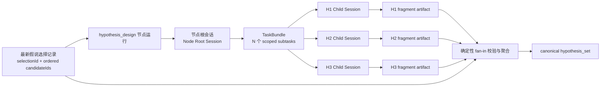
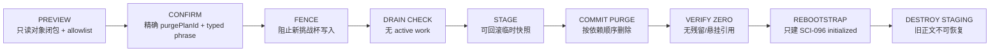
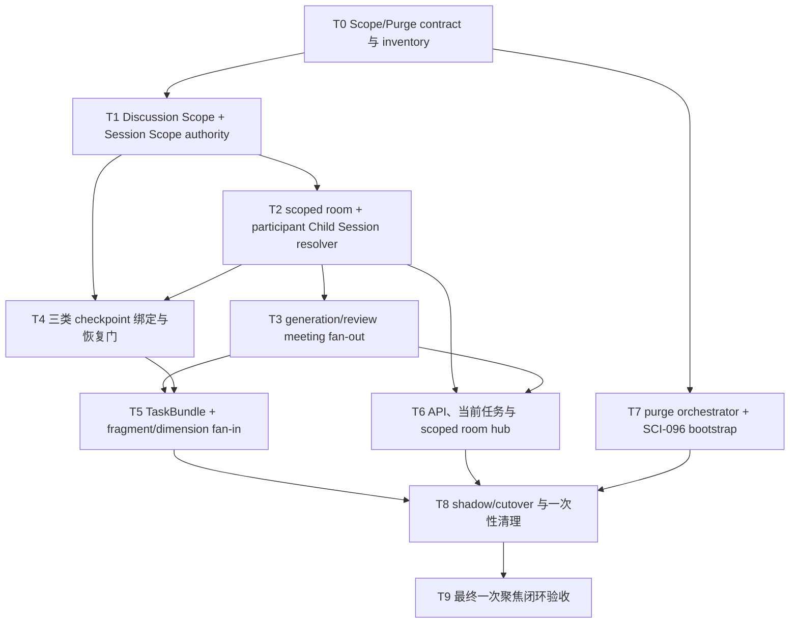

# 挑战杯假说作用域会话、群聊 Checkpoint 与数据重置完整修复方案

> **Status**: `user-approved / active-plan`
>
> **Date**: 2026-08-22
>
> **Updated**: 2026-08-24
>
> **Decision**: 采用“题目/selection/candidate 结构化 scope + 每个参与 Agent 的隐藏 Child Session + scoped room/meeting/checkpoint + 结构化 artifact 聚合”，并在切换前执行一次受管的挑战杯运行数据清空，只重建 `SCI-096` golden-sample 初始化实验。本文件是待实施计划，不是现行规范，也不表示功能已经上线或旧数据已经删除。

## 1. 摘要

当前挑战杯正式工作流已经会在**切换工作流节点**时切换绑定会话：会话注册键是 `agentId + workflowRunId + workflowNodeId`。返回同一节点时会恢复该节点原会话；只有正式重试才会创建新的 attempt 会话。formal graph 也已经能携带 candidate scope，但这套身份尚未贯通团队群聊、参与者会话和恢复校验。

当前有两层污染同时存在：

1. 同一节点内部的多个研究对象共用节点会话，H1、H2、H3 的讨论、证据和修订可能互相进入上下文。
2. `research-team` 只有一个 `linkedChatRoomId`；候选生成和不同题目/selection 的假说评审都写入这个公共房间，参与者又绑定固定 `directSessionId`。Agent 运行前会加载该 Session 的完整 ledger，群聊结束后还会把 transcript 写回同一 Session。因此这不仅是前端把 25 轮历史一起展示的问题，而是模型 Prompt 的真实跨题串线。

目标方案把会话分为两层：

1. 每个 Agent 在每个工作流节点保留一个**节点根会话**，负责节点级编排、进度和最终聚合。
2. 候选生成房间按 `teamId + researchProjectId + workflowRunId + questionId` 隔离；假说评审再加 `selectionId + candidateId`，一条 candidate 一个房间。
3. 每个房间参与者都使用由“房间 scope + agentId”解析出的隐藏 Child Session，禁止使用或回退到公共 `directSessionId`。
4. 同一 candidate 的后续讨论轮次复用自己的房间与 Child Session；新 selection 即使包含旧 candidate，也创建新 scope。
5. Child Session 只产生结构化 fragment/dimension-review artifact；节点根会话通过确定性 fan-in 聚合成现有 `hypothesis_set`，不把聊天文本直接当业务真源。
6. 三类 checkpoint——LangGraph 运行 checkpoint、假说链业务 checkpoint、对话压缩 checkpoint——都绑定同一 scope；恢复时必须验证 workflow checkpoint、business checkpoint、meeting、room、participant session 五方一致。
7. 切换前清空挑战杯旧房间和全部运行/实验内容；只保留 immutable catalog/program/六 Agent 角色契约，并从 `SCI-096` golden-sample 定义重建一个无历史内容的初始化实验。

这意味着：**切换题目、selection 或假说会切换房间和参与者上下文；返回同一假说会恢复它自己的上下文；同一状态 checkpoint 的变化不会无意义地创建新会话；旧房间和旧实验不会继续参与新链路。**

## 2. 名词与边界

### 2.1 本文中的 checkpoint

“checkpoint”可能指三种不同对象，必须分开处理：

| 对象 | 示例 | 是否切换会话 |
| --- | --- | --- |
| 工作流节点 | `source_finding` → `hypothesis_design` | 是，切换节点根会话 |
| 节点运行状态 | `queued` → `running` → `summarizing` | 否，仍属于同一逻辑会话 |
| 节点内研究对象 | H1 → H2，或候选 A → 候选 B | 是，切换对应 Child Session |

### 2.2 Agent、Session 与 artifact

- **Agent** 是能力、角色和权限主体，不因切换假说就创建新 Agent。
- **Session** 是模型上下文边界；同一个 Agent 可以拥有多个彼此隔离的 Session。
- **artifact** 是可验证、可聚合的研究产物真源；Session 消息只用于推理和解释，不直接承担最终业务状态。

### 2.3 不在本方案范围内

- 不为每条假说创建新的顶层 Agent。
- 不在每次状态更新时创建会话。
- 不把 Child Session 暴露到普通顶层会话列表。
- 不引入 LangGraph、Temporal 或第二套工作流引擎。
- 不把跨假说的完整聊天历史互相注入。
- 不在本计划阶段修改业务代码、数据或运行时配置。

## 3. 当前机制与真实缺口

### 3.1 现有会话恢复规则

现有 `research_project_agent_sessions.py` 在正式工作流下使用：

```text
recordKey = agentId :: workflowRunId :: workflowNodeId
```

行为是：

1. 首次进入某节点，为该 Agent 创建节点会话。
2. 离开后返回同一 `workflowRunId + workflowNodeId`，恢复当前 attempt。
3. 只有前一任务已终态且调用正式重试时，才创建下一 attempt，并记录 `retryOfSessionId`。
4. 不同节点使用不同 record key，因此正常节点切换已经具备上下文隔离。

### 3.2 假说节点为什么仍会混线

`hypothesis_design` 的会话键只到节点级，没有 `selectionId` 或 `candidateId`。因此 H1、H2、H3 即使是独立假说，也会被视为一个节点任务的上下文。

由此会出现四类风险：

- H2 的反证被模型误当作 H1 的结论。
- 返回 H1 时，必须在长对话中重新定位属于 H1 的上下文。
- H2 失败重试可能迫使整个 `hypothesis_design` 节点换会话。
- 最终 artifact 很难证明每条假说来自哪个会话、哪个 attempt。

### 3.3 已有能力可以复用

项目已经具备本方案的大部分基础：

| 现有能力 | 当前事实 | 本方案用途 |
| --- | --- | --- |
| 节点会话注册与 attempt | 节点键可恢复、正式重试有 lineage | 保留为节点根会话 |
| Child Session | 有 `parentSessionId`、`rootSessionId`、隐藏索引和父子列表 | 承载每条假说的隔离上下文 |
| `ResearchTaskBundle` | 契约支持多个 `subtasks`、`maxConcurrency`、`aggregationContract` | 表达 fan-out/fan-in |
| TaskBundle runtime | 当前固定单 subtask、`maxConcurrency = 1` | 扩展为按候选生成多个 subtask |
| 假说选择记录 | 有 `selectionId`、有序 `selectedCandidateIds`、重选 lineage | 作为逻辑作用域身份 |
| workflow artifact store | 已有 `hypothesis_set` 写入和证据校验 | 增加 fragment 后继续产出 canonical portfolio |
| Node detail / Inspector | 当前只有单 `sessionId` 锚点 | 扩展为根会话 + scoped children 投影 |

### 3.4 2026-08-24 只读现场快照

以下数字只用于证明根因与制定清理边界，执行清理时必须重新 preview，不能把它们当作永久常量：

- `research-team.linkedChatRoomId = room-20260722-140515-333112-ca99d73f`。
- 该房间包含 25 轮讨论，room config 只有 team 元数据，没有 `workflowRunId / questionId / selectionId / candidateId`。
- `meeting_runtime._ensure_linked_room()` 固定解析团队公共 `linkedChatRoomId`；候选生成与假说评审都从这里取得同一 room。
- `chat_room_service._run_participant_agent()` 读取 participant `sessionId` 的完整 conversation ledger；`_sync_group_round_to_participant_sessions()` 又把群聊 transcript 写回该 Session。
- `research-team` 当前有 12 个 research project；项目目录中可见 23 版 experiment plan，其中 `challenge-sci-096` 单独已有 9 版。
- 正式程序的唯一 MVP golden sample 是 `MVP_GOLDEN_SAMPLE_QUESTION_ID = SCI-096`，当前 active project 也为 `challenge-sci-096`。

因此，前端按当前题目过滤 25 轮历史只能隐藏症状，不能阻止模型加载旧 ledger；单独调用现有 `reset_question_chain()` 也不够，因为它不会完整覆盖公共 room、participant Session、experiment plan、workflow checkpoint 和 result/receipt stores。

## 4. 目标端到端原理



端到端执行顺序：

1. `hypothesis_design` 通过现有 readiness gate，取得最新有效 `HypothesisSelectionRecord`。
2. 解析节点根会话；同一节点返回时继续使用原根会话。
3. 按 `selectedCandidateIds` 创建一个 TaskBundle，每个 candidate 对应一个 subtask。
4. 每个 subtask 以 `selectionId + candidateId` 解析或创建隐藏 Child Session。
5. Child Session 只接收该候选正文、共享约束、允许的证据引用和必要知识包，不接收兄弟假说的聊天历史。
6. 每个 Child Session 产出一个通过契约校验的 `hypothesis_fragment`。
7. fan-in 按选择记录顺序验证“恰好一条候选对应一个有效 fragment”，再生成现有 `hypothesis_set`。
8. 节点根会话只保存进度摘要、fragment 引用和聚合结果，不复制所有子会话全文。

## 5. Session Scope V3 契约

### 5.1 逻辑作用域

新增显式作用域契约，避免继续给函数追加无语义的可选字符串：

```ts
type WorkflowSessionScopeV3 =
  | {
      version: 3;
      kind: "workflow_node_root";
      teamId: string;
      researchProjectId: string;
      agentId: string;
      workflowRunId: string;
      workflowNodeId: string;
    }
  | {
      version: 3;
      kind: "workflow_candidate";
      teamId: string;
      researchProjectId: string;
      agentId: string;
      workflowRunId: string;
      workflowNodeId: string;
      selectionId: string;
      candidateId: string;
    };
```

约束：

- `workflow_node_root` 不允许携带 candidate 字段。
- `workflow_candidate` 必须同时有 `selectionId` 和 `candidateId`。
- `candidateId` 必须属于该 `selectionId` 的 `selectedCandidateIds`。
- scope 字段进入 session binding、TaskBundle subtask、artifact provenance 和 projection，四处必须一致。
- `attempt` 不是逻辑 scope 的组成部分；它描述同一 scope 下的物理执行代次。

### 5.2 稳定 scope key

由 canonical serializer 生成，不允许各模块自行拼字符串：

```text
root      = v3|node|agentId|workflowRunId|workflowNodeId
candidate = v3|candidate|agentId|workflowRunId|workflowNodeId|selectionId|candidateId
```

持久化时可保存 canonical 字符串或其 hash，但 API 和日志必须保留可诊断的结构化字段。禁止仅保存 hash 后丢失来源。

### 5.3 根会话与 Child Session

| 字段 | 根会话 | 假说 Child Session |
| --- | --- | --- |
| `sessionKind` | `main` | `child` |
| `conversationIndexKind` | 现有 team Agent index | `hidden` |
| `parentSessionId` | 空 | 节点根会话 ID |
| `rootSessionId` | 自身 ID | 节点根会话 ID |
| `scope.kind` | `workflow_node_root` | `workflow_candidate` |
| 用户顶层列表 | 可见/按现有规则 | 不可见 |
| 恢复键 | 节点 scope | `selectionId + candidateId` scope |

Child Session 标题使用可读、受限长度的形式，例如：

```text
SCI-096｜假说设计｜H2｜第 1 次
```

标题只用于展示，身份判断必须使用 scope 字段，不能解析标题。

### 5.4 重选与重试

- **返回同一假说**：相同 `selectionId + candidateId`，恢复当前 Child Session。
- **正式重试某条假说**：逻辑 scope 不变，attempt `+1`，新会话通过 `retryOfSessionId` 指向前一 attempt。
- **重新选择假说集**：产生新 `selectionId`；即使包含旧 `candidateId`，也创建新 scope，防止旧选择语境静默污染新选择。
- **节点整体重试**：根会话可增加 root attempt；已完成的 candidate fragment 是否复用由显式 recovery policy 决定，不能隐式搬运。

### 5.5 群聊 Discussion Scope V1

群聊是多 Agent 共享对象，不能直接复用含 `agentId` 的 Session Scope V3。新增一个无 Agent 字段的 canonical discussion scope；每个 participant Session 再在它上面加 `agentId`：

```ts
type WorkflowDiscussionScopeV1 =
  | {
      version: 1;
      kind: "question_generation";
      teamId: string;
      researchProjectId: string;
      workflowRunId: string;
      workflowNodeId: string;
      questionId: string;
    }
  | {
      version: 1;
      kind: "candidate_review";
      teamId: string;
      researchProjectId: string;
      workflowRunId: string;
      workflowNodeId: string;
      questionId: string;
      selectionId: string;
      candidateId: string;
    };
```

canonical key 由统一 serializer 生成：

```text
generation = v1|question_generation|teamId|researchProjectId|workflowRunId|workflowNodeId|questionId
review     = v1|candidate_review|teamId|researchProjectId|workflowRunId|workflowNodeId|questionId|selectionId|candidateId
```

不变量：

- room、MeetingRound、TaskBundle subtask、artifact provenance 和业务 checkpoint 保存同一个结构化 scope 与 `scopeHash`。
- participant Child Session scope = discussion scope + `agentId`；六个 Agent 在同一 candidate 房间中仍有六个不同 Session。
- candidate review 不再把一个 selection 的多条 candidate 放进同一自由文本房间；`selectionId` 是 fan-in 的父级，`candidateId` 是房间边界。
- `discussionRoundIndex`、重试 attempt 和状态不进入逻辑 scope；同一 candidate 的后续轮次复用房间，formal retry 只增加 attempt。
- 新 selection 必须产生新 review scope；禁止只凭相同 `candidateId` 复用旧房间。
- scope 缺字段、membership 不匹配或 hash 不一致时 fail-closed；禁止回退团队公共房间或 `directSessionId`。

## 6. 节点作用域策略

不是所有节点都需要 Child Session。新增节点策略表，默认保守：

| 策略 | 适用条件 | 会话行为 |
| --- | --- | --- |
| `node_shared` | 单一顺序任务、节点内没有独立对象 | 仅节点根会话 |
| `candidate_fan_out` | 同一节点并行处理多个被选候选 | 根会话 + 每 candidate 一个 Child Session |
| `round_shared` | 一轮会议是共同决策，必须看到多假说摘要 | 一轮一个共享上下文，只读 fragment 摘要，不读取子会话全文 |

首期只把 `hypothesis_design` 标记为 `candidate_fan_out`。后续若协议设计、实验执行确实需要“一假说一实验”时，再通过同一策略扩展，禁止用节点名称硬编码散落在多个服务中。

## 7. Fan-out 执行设计

### 7.1 TaskBundle 生成

当前 runtime 固定创建一个 subtask。改造后：

```json
{
  "bundleId": "bundle-<nodeRunId>",
  "parentNodeRunId": "<nodeRunId>",
  "subtasks": [
    {
      "subtaskId": "<nodeRunId>:<selectionId>:<candidateId>",
      "scope": {
        "kind": "workflow_candidate",
        "selectionId": "<selectionId>",
        "candidateId": "<candidateId>"
      },
      "sessionId": "",
      "attempt": 1,
      "outputArtifactRefs": []
    }
  ],
  "maxConcurrency": 3,
  "aggregationContract": {
    "mode": "all_required_ordered",
    "identitySource": "hypothesis_selection_record"
  }
}
```

规则：

- subtask 顺序严格跟随 `selectedCandidateIds`。
- `subtaskId`、bundle idempotency key 和 scope key 均可稳定重放。
- `maxConcurrency = min(选中数量, 节点预算上限, 全局并发上限)`；首期默认上限建议为 3。
- 重放创建命令不得生成重复 subtask 或重复 Child Session。
- 一个 Agent 仍可执行多个 subtask，但每个 subtask 必须绑定自己的 Session。

### 7.2 Child Session 输入边界

每个 Child Session 允许注入：

- 该 candidate 的 canonical statement、mechanism/rationale 和预测。
- 当前选择记录身份及候选在选择中的顺序。
- 已批准知识包中允许该任务读取的证据与反证引用。
- 节点统一的输出 schema、预算、截止时间和安全约束。
- 同一 candidate 前一 attempt 的结构化结果摘要（仅正式重试时）。

明确禁止注入：

- 其他 candidate 的完整对话。
- 未批准知识内容或任意顶层会话历史。
- 兄弟 subtask 的中间自由文本。
- 通过 UI 标题推断出的身份。

### 7.3 调度与失败

每个 subtask 独立处于 `pending / running / succeeded / failed / cancelled`。Bundle 状态按聚合契约计算：

- 所有必需 subtask 成功且 fragment 有效 → `succeeded`。
- 任一仍在运行 → `running`。
- 任一失败且尚可重试 → `waiting_retry`（需要扩展现有状态契约）。
- 终态失败或身份/产物不完整 → `failed`，不得生成 canonical `hypothesis_set`。

H2 失败时只重试 H2 scope；H1/H3 的成功 fragment 保留并重新校验，不重跑其会话。

## 8. Fragment artifact 与确定性聚合

### 8.1 `hypothesis_fragment` 契约

建议新增版本化 artifact：

```json
{
  "schemaVersion": 1,
  "kind": "hypothesis_fragment",
  "workflowRunId": "run-sci-096",
  "workflowNodeId": "hypothesis_design",
  "nodeRunId": "nr-...",
  "selectionId": "selection-...",
  "candidateId": "H2",
  "sessionId": "child-...",
  "sessionAttempt": 1,
  "taskId": "task-...",
  "statement": "...",
  "mechanism": "...",
  "predictions": ["..."],
  "falsificationCriteria": ["..."],
  "evidenceRefs": ["..."],
  "counterEvidenceRefs": ["..."],
  "contentHash": "..."
}
```

现有“每条假说必须有反证引用、引用必须来自允许知识包”的 fail-closed 规则继续适用，并前移到 fragment 写入阶段。

### 8.2 Fan-in 不变量

聚合器必须同时满足：

1. 读取的选择记录仍是该 node run 绑定的 `selectionId`。
2. 每个 `selectedCandidateId` 恰好存在一个当前有效 fragment。
3. fragment 的 run、node、node run、selection、candidate、task、session scope 全部匹配。
4. 不接受选择集外 candidate，不接受重复 candidate，不接受缺失 candidate。
5. fragment 按选择记录顺序聚合，不能依赖完成先后或文件遍历顺序。
6. 重放相同输入得到相同 canonical payload/content hash。
7. 聚合器只读取结构化 artifact，不抓取 Child Session 消息做隐式总结。

### 8.3 canonical `hypothesis_set`

最终仍写现有 `hypothesis_set`，保持下游协议设计和现有 API 的业务真源不变，但增加 provenance：

```json
{
  "selectionId": "selection-...",
  "fragmentRefs": ["artifact:h1", "artifact:h2", "artifact:h3"],
  "aggregationMode": "all_required_ordered",
  "candidateSessionAnchors": [
    {
      "candidateId": "H1",
      "sessionId": "child-...",
      "sessionAttempt": 1,
      "fragmentRef": "artifact:h1"
    }
  ]
}
```

消息历史是解释证据，`hypothesis_set` 与 fragment 才是流程推进依据。

## 9. API 与前端交互

### 9.1 后端投影

现有 `ResearchWorkflowNodeDetail.sessionId` 保留为根会话兼容字段，新增：

```ts
type ScopedSessionAnchor = {
  scopeKind: "workflow_candidate";
  selectionId: string;
  candidateId: string;
  sessionId: string;
  sessionAttempt: number;
  taskId?: string | null;
  status: string;
  chatDeepLink: string;
  fragmentRef?: string | null;
};

type ResearchWorkflowNodeDetail = {
  // existing fields...
  sessionId?: string | null; // 节点根会话，兼容
  scopedSessions?: ScopedSessionAnchor[];
};
```

投影要求：

- 只返回当前 node run 和当前 selection 的 scoped sessions。
- 默认只返回摘要，不返回消息正文。
- Child Session 缺失或已损坏时标记 degraded，不静默改绑到兄弟会话。
- 复用现有 Child Session list/service；不新增第二个会话关系真源。

### 9.2 Inspector

在假说节点的 Inspector 中：

- 顶部显示节点根会话入口“查看节点总览”。
- 每条假说显示状态、attempt、fragment 是否就绪和“继续讨论/查看记录”。
- 点击某条假说进入其 Child Session，返回地址保留团队、run、node 和 candidate。
- 同一假说再次点击恢复原会话，不创建重复会话。
- 正式重试必须明确标识“重试 H2”，不得表现为重跑全部假说。

普通顶层会话列表继续只展示根会话；Child Session 通过父会话或节点 Inspector 按需发现。

### 9.3 URL 与恢复

深链仍以真实 `sessionId` 为主，例如：

```text
/chat?session=<childSessionId>&returnTo=<encoded-workflow-url>
```

`selectionId/candidateId` 可作为校验和回到工作流的定位参数，但不能替代 canonical session lookup。

### 9.4 三类 checkpoint 的统一绑定

checkpoint 不再只保存“当前节点”，而是保存恢复所需的**引用与身份**；聊天正文继续留在各自 Child Session ledger，不能复制进 workflow checkpoint。

| checkpoint | owning surface | 必须保存 | 明确禁止 |
| --- | --- | --- | --- |
| LangGraph 运行 checkpoint | `core/research/workflow/checkpoint_store.py`、`challenge_cup_runtime.py`、`research_runtime/checkpoint_lifecycle.py` | `workflowRunId`、当前 node/attempt、discussion `scopeRef/scopeHash`、room/meeting/business-checkpoint refs、participant binding refs | 房间消息正文、兄弟 candidate 自由文本、公共 direct-session 摘要 |
| 假说链业务 checkpoint | `hypothesis_first_chain.py` 与专用 scoped checkpoint writer | question/selection/candidate、roomId、meetingRoundId、chatRoomRoundId、当前状态、round budget、可恢复性、artifact refs、participant Child Session refs | 通过标题猜 scope、无来源摘要、跨 candidate transcript |
| 对话压缩 checkpoint | `core/chat/context_compression_ledger.py` 所在 conversation ledger | 仅当前 participant Child Session 的 covered-event range、summary/hash、attempt 与 scope metadata | 从父公共 Session 或兄弟 Session 复制 summary；跨 scope 覆盖 event range |

恢复前必须同时验证：

```text
workflow checkpoint scope
  == business checkpoint scope
  == meeting scope
  == room.config scope
  == every participant Child Session scope minus agentId
```

任何一处缺失或不相等都返回可诊断的 `scope_binding_mismatch`，节点保持 blocked；不得降级到团队 `linkedChatRoomId`、旧 MeetingRound 或 Agent `directSessionId`。checkpoint 只在 room/meeting/session binding 全部 durable 后提交；恢复时先校验 binding，再允许继续发言。

## 10. 持久化、迁移与回滚

### 10.1 v2 → v3 读取策略

- purge 前的 shadow/fixture 兼容读取可把现有 `agentId + workflowRunId + workflowNodeId` 记录解释为 `workflow_node_root`，只用于 inventory 与对照，不允许继续启动正式挑战杯讨论。
- live purge 完成后不保留 v2 challenge runtime 记录；root/candidate/discussion scope 都从干净 v3/V1 identity 创建。
- candidate/discussion scope 永远不允许回退 v2 根会话、团队公共房间或 direct Session，否则会重新引入混线。
- 新写入只写 v3 scope/binding；不要长期双写两套 registry。

### 10.2 渐进上线

建议使用节点级 capability/feature flag：

```text
workflowSessionScopeV3.hypothesis_design = off | shadow | on
```

- `off`：阻止新的挑战杯 generation/review discussion，不允许沿用旧公共房间路径。
- `shadow`：只计算 scope、bundle、purge inventory 和聚合校验结果，不启动 Child Session，不影响正式产物。
- `on`：使用 v3 fan-out/fan-in。

开关必须由服务端决定 effective mode，前端只展示结果。

### 10.3 回滚

- 正常功能回滚到 `off` 时保留切换后合法生成的 scoped Child Session 与 fragment，但停止创建/恢复正式挑战杯房间。
- 已经由 v3 产出的 canonical artifact 继续可读；禁止回退旧单会话或公共房间继续写入。
- 若 v3 聚合失败，不得自动用根会话自由文本补写 `hypothesis_set`。
- 一次性 legacy purge 是独立的、用户已要求的破坏性迁移：成功提交并销毁临时 rollback staging 后，旧房间、旧实验与旧 Session 不可恢复，不能用功能开关复活。
- purge 尚未提交时可以从 task-owned staging 原样恢复；purge 已提交但 rebootstrap 未完成时进入 `needs_rebootstrap`，只允许幂等重建 `SCI-096` 初始化状态，不能回灌旧内容。

## 11. 可观测性与容量控制

新增有界、无正文的结构化事件：

- `workflow.session_scope.resolved`
- `workflow.child_session.created`
- `workflow.child_session.resumed`
- `workflow.scope_attempt.retried`
- `workflow.hypothesis_fragment.recorded`
- `workflow.hypothesis_aggregation.blocked|completed`

字段只保留 run/node/selection/candidate 的受限 ID、session/attempt、状态、耗时和错误码，不记录完整 Prompt、聊天正文或 artifact 正文。

建议指标：

| 指标 | 目标 |
| --- | --- |
| 同 scope 恢复命中率 | 稳定后 ≥ 99% |
| 顶层会话数增量 | 每个节点最多 1 个根会话；Child 不计入 |
| 重复 Child Session 数 | 0 |
| 跨 candidate scope 校验失败 | 0；一旦出现 fail-closed |
| 单 candidate 重试影响面 | 只改变该 candidate attempt |
| 聚合缺失/重复 fragment | 不得推进节点 |

容量边界：

- 一个 selection 最多使用选择契约允许的 candidate 数。
- 活跃并发受 `maxConcurrency` 和预算双重约束。
- 历史 attempt 可保留，但默认 UI 只展开当前 attempt。
- 列表和 node detail 只返回有界摘要，消息正文继续按 session detail 单独加载。

## 12. 一次性破坏性清理与初始化保留契约

### 12.1 清理范围

本次“全部清空”限定为挑战杯系统团队 `research-team` 的运行数据与由其派生的实验内容，不波及自进化、监督进化、AI 搜索范围、知识库扩充等其他团队，也不删除仓库代码、测试 fixture 或官方赛题资源。

清理采用“删除所有旧 runtime instance，再从 immutable seed 重建一个初始化实例”，而不是从旧数据中挑一条看起来像初始化记录的 plan。原因是现有 `challenge-sci-096` 已有 9 版 plan 和历史 Session，物理保留任一旧对象都会继续携带污染。

### 12.2 唯一保留 allowlist

执行器只允许保留下表的稳定身份；未命中 allowlist 的 `research-team` runtime 对象全部进入删除集合。禁止按标题、创建时间或“最新一条”判断。

| 保留项 | 稳定身份/权威来源 | 清理后的状态 |
| --- | --- | --- |
| 挑战杯团队 | `teamId = research-team` 与 role contract `challenge-cup-research-team` v2 | 保留团队及六 Agent 成员，不保留旧房间绑定 |
| 六个产品角色 | `challenge_cup_search / extractor / knowledge_manager / execution_steward / experiment_revision / evaluator` | Agent 保留；direct Session 轮换为新的空白 Session |
| 125 题目录 | `core/research/competition/data/science_125_questions.json` 及其 catalog hash | 只读保留，不生成 125 个 runtime project |
| 正式 Program/Policy | `competition_program_core.v2.json`、`full_catalog_execution_core.v1.json` 及冻结 hash | 只读保留 |
| 初始化题 | `MVP_GOLDEN_SAMPLE_QUESTION_ID = SCI-096` | 重建逻辑 project `challenge-sci-096`，状态 `initialized` |
| 初始化实验定义 | 新增稳定 `bootstrapId = challenge-cup-golden-sample-sci-096-v1`，来源为 Program + catalog hash | 只包含身份、题目和 ready-to-start 状态；不包含旧候选、plan、run、result 或 checkpoint |

清理完成且尚未点击“开始”时，live baseline 必须精确为：

```text
research-team: 1
active challenge product agents: 6
research projects: 1 (challenge-sci-096 / SCI-096 / initialized)
experiment plans/runs/results: 0
workflow runs/checkpoints/artifacts/receipts: 0
hypothesis candidates/selections/meetings/rounds: 0
challenge workflow rooms: 0
legacy participant session bindings: 0
```

`SCI-096` 初始化卡片是可开始的产品对象，不是假装已经有实验计划的历史记录。第一次点击开始后才创建新的 `workflowRunId`、question-generation room、MeetingRound、participant Child Sessions 和 checkpoints。

### 12.3 必删对象图

| 对象族 | 删除内容 | 保护边界/实现要求 |
| --- | --- | --- |
| 团队公共房间 | 旧 `research-team.linkedChatRoomId`、当前 25 轮及所有 legacy/unscoped challenge room | 先用受管 reset 清除 participant transcript/group-context，再删除 room；团队正式工作流不再自动回建公共房间 |
| 房间派生状态 | room work runs、SSE/runtime-scene projection、round controls、meeting↔room bindings | active work guard 通过后按 roomId/roundId 闭包清理，不留 `running` 悬挂索引 |
| Meeting/假说链 | candidate、selection、generation/review MeetingRound、digest、decision、hypothesis round、collection request、first-chain records | 删除旧 JSONL 记录；只保留无正文、含对象计数/hash 的 purge audit manifest |
| research project | `research-team` 当前全部 12 个 project 及其 project-scoped workspace | 包括旧 `challenge-sci-096`；提交后由 bootstrap 重建同一逻辑 projectId |
| 实验内容 | 全部 plan/revision/design-freeze、baseline、smoke/full-run、metric、result、progress、research loop、deep-experiment runtime artifact | 保留仓库内 adapter/fixture 源码，不保留 live 执行产物 |
| 资料与派生知识 | project-scoped source runs、candidate store、evidence cards、collection exclusions、question tree、由 challenge scope 写入的 personal memory/knowledge candidate | 不删除无 challenge scope 的 operator-curated 全局知识；历史无 scope 且由六 Agent direct Session 产生的内容按 legacy challenge 数据删除 |
| Workflow runtime | run store、idempotency index、workflow ledger 的 team/run rows、LangGraph checkpoint rows、binding config、TaskBundle/subtask、artifact store | SQLite 是共享容器时只删 manifest 命中的 rows，禁止删除整个 DB 文件 |
| 结果与模型证据 | question-run output、result package、review/publish records、real-batch/dev-control state、model invocation receipts | 目录和 program 定义保留，所有 runtime evidence 归零；Flash 运行也不能冒充 Qwen receipt |
| Session/ledger | 六 Agent 被污染的旧 direct Sessions、旧节点根 Session、隐藏 Child Sessions、conversation ledger、compression checkpoint、group transcript | 先创建并绑定新的空白 direct Sessions，再走正式 Session lifecycle 删除旧 Session；不 archive/purge Agent 本身 |
| 客户端/索引 | persisted query/cache、conversation index、room list、current-task deep-link projection | 服务端 commit 后统一失效；不能靠前端缓存残留“恢复”旧对象 |

### 12.4 受管 purge 状态机

新增单一 owner，例如 `core/web/services/team_workflow/challenge_cup_reset_service.py`；route 保持薄层，禁止让 UI 自己串多个 delete API，也禁止 operator 裸删 JSON/SQLite/Session 目录。



1. **PREVIEW**：重新读取 canonical project data home，计算对象闭包、对象数、byte size、active refs、allowlist 和 `inventoryHash`；返回 `purgePlanId = hash(teamId + allowlist + inventoryHash)`，不修改任何状态。
2. **CONFIRM**：仅 operator 可提交同一 `purgePlanId`，并输入固定确认短语 `RESET research-team KEEP SCI-096`。inventory 变化时旧 plan 失效，必须重新 preview。
3. **FENCE**：写入 `challenge_cup_maintenance` fence，使 question launch、meeting open、room round、workflow dispatch、实验写回和 Session binding 全部 fail-closed。
4. **DRAIN CHECK**：读取正式 active-work authority；任一 chat round、workflow run、source run、experiment run 或 participant turn 为 running/stopping 就拒绝清理。只允许用户通过产品 Stop/Launcher 生命周期结束工作，不强杀进程、不改 PID/lock。
5. **STAGE**：把精确目标的 JSON/JSONL、Session ledger 和 project directories 移入 task-owned staging；共享 SQLite 先在事务内记录目标 row set。staging 只用于本次失败恢复，不进入备份索引。
6. **COMMIT PURGE**：按“leaf artifact/session event → room/meeting/run → project index → team room binding”的逆引用顺序提交。复用 `reset_chat_room()` 的 transcript/group-context 清理、question reset preview 模式和 Session staged purge；补齐它们当前未覆盖的对象。
7. **VERIFY ZERO**：重新跑同一 inventory，断言 delete set 为 0、共享 DB 无目标 rows、旧 room/session/run/project ID 均不可读、其他团队计数/hash 不变。
8. **REBOOTSTRAP**：从 frozen Program/catalog 读取 `SCI-096`，幂等创建唯一 `challenge-sci-096` initialized project；不创建 plan、room、workflow run 或 checkpoint。
9. **DESTROY STAGING**：只有 zero verification 与 bootstrap verification 都通过才删除 staging。成功后只保留 `purgePlanId`、时间、代码版本、allowlist、对象数和前后 hash，不保留标题、Prompt、聊天或实验正文。

### 12.5 失败恢复与不可恢复边界

- fence 前失败：没有写入，重新 preview。
- stage/commit 中途失败：保持 fence，按 manifest 从 staging 恢复原文件与 SQLite rows，再验证 hash；恢复失败则停止，不能继续 bootstrap。
- purge 已完成但 bootstrap 失败：旧内容仍保持删除，状态标为 `needs_rebootstrap`；仅重试幂等 bootstrap。
- zero/bootstrap verification 通过并销毁 staging 后：旧房间和旧实验不可恢复。这是用户要求的最终清理语义。
- purge API 重放：相同 `purgePlanId` 已成功时只返回原 audit summary，不二次删除或创建第二个 SCI-096 project。

## 13. 修复后的端到端数据流与用户体验

### 13.1 候选生成

1. 用户在 `SCI-096` 初始化卡片点击开始。
2. workflow 生成新 `workflowRunId`，解析 `question_generation` scope。
3. scope resolver 创建一个 question-generation room；六个 Agent 各自创建/恢复一个该 scope 的隐藏 Child Session。
4. room detail API 只返回这个 room 的 rounds；Prompt 只读取该 Child Session ledger 和允许的 question-level evidence。
5. 候选结构化写回后，generation room 可关闭但保留在该 run 的历史中。

### 13.2 每条假说评审

1. selection 产生 `selectionId` 和 ordered candidate IDs。
2. runtime 为每个 candidate 创建独立 review MeetingRound、room 和六个 participant Child Sessions。
3. 每个房间只注入本 candidate 正文、证据/反证 refs、维度 schema 与共享约束。
4. 七维 review 和 fragment 按 candidate scope 落盘；selection 父级只读取 digest/artifact refs 做 fan-in，不读取兄弟房间全文。
5. H2 失败只重试 H2；H1/H3 的 room、Session 和 artifact 不变。

### 13.3 “前往当前任务”与群聊入口

- `research-team` 不再把公共 `linkedChatRoomId` 当挑战杯当前任务。团队页展示 scoped room hub：题目 → selection → candidate；默认定位 workflow projection 指向的 active scope。
- “前往当前任务”必须解析服务端 `activeDiscussionAnchor { scope, roomId, meetingRoundId, candidateId, deepLink }`。有 anchor 时整行可点击并进入对应 room；没有时显示明确原因和“返回工作流”，不能渲染成无响应卡片。
- ChatGroupCenter 只渲染 active room 的 rounds；切换 H1/H2/H3 是切换 room query key，不是前端过滤一个大数组。
- room header 固定展示 `questionId / candidateId / selection attempt`，避免用户误认当前上下文。
- 团队普通大厅如未来需要，只能由用户显式创建并明确标记“非正式工作流”；候选生成、评审、checkpoint 和 artifact writer 永远不能引用它。

### 13.4 当前模型边界

本轮闭环继续使用现有 Flash 路径，不把 Qwen 接入作为隔离修复前置条件。所有 Flash 调用标记为 development/non-official evidence，`submission.eligible = false`；不得生成或伪造 DashScope/Qwen official receipt。Qwen provider 切换留到 125 假说闭环稳定之后的独立任务。

## 14. 实施任务图



### T0：scope/purge contract 与只读 inventory

- Owner/Boundary：`core/research/workflow/contracts/`、新增 reset contract/inventory；只读扫描所有相关 store，不删除。
- 产出：`WorkflowDiscussionScopeV1`、retain allowlist、delete-set closure、`purgePlanId`、其他团队保护 hash。
- Verification/Stop：同一现场重复 preview hash 一致；任何 unowned/unscoped 对象无法归属时 stop，不扩大删除。

### T1：统一 scope authority

- Owner/Boundary：workflow scope contract、node policy、canonical serializer/parser；复用 formal state 已有 `session_scope`，不散落拼 key。
- 产出：question-generation 与 candidate-review scope；selection membership、attempt 排除、scopeHash 规则。
- Verification/Stop：非法/缺字段/跨 selection 全部 fail-closed。

### T2：scoped room 与 participant Child Session resolver

- Owner/Boundary：`meeting_runtime.py`、`chat_room_service.py`、`research_project_agent_sessions.py`、必要的 Session service metadata。
- 产出：room 按 discussion scope 幂等解析；participant 按 scope+agentId 解析 hidden Child Session；正式工作流禁用 `directSessionId` fallback 和公共 room fallback。
- Verification/Stop：同 scope 重放不新增 room/Session；不同 question/candidate/selection 必须不同；Child 不进顶层会话列表。

### T3：generation/review Meeting fan-out

- Owner/Boundary：`hypothesis_first_chain.py`、`meeting_rounds.py`、`meeting_runtime.py`。
- 产出：generation 一题一房；review 一 candidate 一房；selection-level fan-in 只读 scoped digest。
- Verification/Stop：旧批量 review room 路径不再可达；任一 room config 缺 scope 时拒绝启动 round。

### T4：三类 checkpoint 绑定与恢复门

- Owner/Boundary：LangGraph checkpoint state、假说链 scoped checkpoint writer、conversation compression ledger metadata。
- 产出：binding refs、五方一致性 validator、`scope_binding_mismatch` 诊断、提交顺序。
- Verification/Stop：重启/恢复不读旧 direct Session；手工制造任一 mismatch 必须 blocked 且不推进 graph。

### T5：TaskBundle、七维 review 与 fragment fan-in

- Owner/Boundary：TaskBundle lifecycle、`hypothesis_fragment`、`dimension_reviews`、`feedback_iterations` 和 canonical `hypothesis_set` writer。
- 产出：每 candidate 独立 subtask/attempt/artifact；selection 按 ordered IDs 聚合。
- Verification/Stop：缺失、重复、越界或跨 scope artifact 阻断；同输入 hash 稳定。

### T6：API、当前任务入口与 scoped room hub

- Owner/Boundary：research workflow projection/routes、chat room detail、`HypothesisFirstNodeInspector.tsx`、`ChatGroupCenterSurface.tsx` 与 VUI 设计登记。
- 产出：`activeDiscussionAnchor`、scoped room list/detail、可点击当前任务、candidate 切换、degraded reason。
- Verification/Stop：UI 不得接收/渲染兄弟 room rounds；无 anchor 时不能出现无响应动作。

### T7：purge orchestrator 与幂等 bootstrap

- Owner/Boundary：新增单一 reset service、正式 Session lifecycle、research project/bootstrap、共享 SQLite row-level cleanup；不修改 immutable catalog/program。
- 产出：preview/confirm/fence/stage/commit/verify/rebootstrap/audit 全流程。
- Verification/Stop：先在临时 data root 用 fixture 证明 rollback 与 idempotency；任何其他团队 hash 改变立即失败并恢复。

### T8：shadow、切换与一次性真实清理

- Dependency：T0-T7 全部完成且独立自审通过。
- 顺序：先部署 scope-aware 新写路径但保持正式启动关闭 → preview 精确删除清单 → active-work 为零 → 执行 purge → 验证 zero baseline → rebootstrap SCI-096 → 开启 scoped path。
- Stop：现场 inventory 与 preview 不一致、active work 非零、rollback staging 无法建立、其他团队保护 hash 不稳定时禁止 commit。

### T9：最终一次聚焦闭环验收

- 只在所有实现合并前运行一次组合式小范围验收，不重复跑全仓测试。
- 后端聚焦：`tests/test_chat_room_service.py`、`tests/test_research_workflow_meeting_runtime.py`、`tests/test_research_workflow_hypothesis_first_chain.py`、`tests/test_research_workflow_interrupt_checkpoint_recovery.py` 以及新增 reset tests 的精确用例。
- 前端聚焦：`ChatGroupCenterSurface.test.tsx`、`HypothesisFirstNodeInspector.test.tsx`、`hypothesisFirstMeetingProjection.test.ts`、VUI route/design contract；因触及 `web/`，最后主动执行一次 `npx tsc -b --pretty false`。
- 浏览器只做一个干净 SCI-096 路径：初始化 → 候选生成 → H1/H2 切换 → H2 继续讨论 → checkpoint 恢复 → selection fan-in；不跑 125 题、不启动深度实验。

## 15. 验收矩阵

### 15.1 清理与保留

| 场景 | 必须观察到的结果 |
| --- | --- |
| purge preview | 列出精确 room/project/session/run/checkpoint/artifact 数量和唯一 `SCI-096` retain seed |
| active round 仍在运行 | purge fail-closed，不删任何对象 |
| purge 提交成功 | 旧 roomId、project/run/plan/session/checkpoint ID 均不可读；其他团队 hash 不变 |
| bootstrap 完成 | 只出现 `challenge-sci-096` initialized 卡片；plan/run/room/checkpoint 仍为 0 |
| 相同 purge 请求重放 | 不二次删除，不创建第二个项目 |
| commit 中途故障 fixture | staging 恢复前后 hash 一致 |

### 15.2 会话与房间隔离

| 场景 | 必须观察到的结果 |
| --- | --- |
| SCI-096 首次候选生成 | 1 个 question-generation room + 每 Agent 1 个 scoped Child Session |
| H1/H2/H3 进入评审 | 3 个不同 review room；每个 room 只显示本 candidate rounds |
| H1 → H2 → H1 | 第二次进入 H1 恢复原 room/Session，不出现 H2 transcript |
| 新 selection 再含 H1 | 创建新 selection scope，不继承旧 H1 room/summary |
| H2 正式重试 | 只增加 H2 attempt；H1/H3 不变 |
| participant binding 被改成 direct Session | 启动/恢复 blocked，错误为 `scope_binding_mismatch` |
| 普通团队大厅 | 不能成为 challenge MeetingRound、checkpoint 或 artifact 的 binding |

### 15.3 checkpoint 与聚合

| 场景 | 必须观察到的结果 |
| --- | --- |
| room/meeting/session 全部 durable 后 checkpoint | checkpoint 只保存 refs/scope，无聊天正文 |
| 重启后恢复 H2 | 校验四方 scope 后继续 H2；不读取父 direct Session 历史 |
| H2 compression checkpoint | covered events 全部属于 H2 Child Session；summary 不出现在 H1 |
| H2 fragment 伪造/缺失/跨 scope | fan-in fail-closed，节点不推进 |
| H1/H2/H3 全部有效 | 按 selection 顺序生成唯一 canonical `hypothesis_set` |

### 15.4 用户实际体验

| 操作 | 期望 |
| --- | --- |
| 点击“前往当前任务” | 整行可点击，直接进入 active scoped room |
| active anchor 尚未创建 | 显示原因和返回工作流动作，不是无响应卡片 |
| 在 room hub 切换 candidate | URL/query key/标题同时变化，正文只来自目标 room |
| 返回团队页 | 仍定位原 question/selection/candidate，不跳公共房间 |

## 16. 风险与控制

| 风险 | 控制 |
| --- | --- |
| 误删非挑战杯数据 | delete-set 必须从 `teamId=research-team` 与 refs 闭包生成；其他团队前后 hash 保护 |
| 把旧 SCI-096 当初始化保留 | 只保留 Program/catalog seed，旧 project 也删除后幂等重建 |
| JSON/SQLite/Session 多存储无法单事务 | maintenance fence + 精确 staging + SQLite transaction + 前后 hash；成功后销毁 staging |
| `delete_chat_room()` 留下 Session transcript | purge 必须先执行 reset semantics，或提供覆盖 transcript/group-context 的原子 room purge |
| active work 与清理并发 | 正式 active-work guard；不手动删 lock/PID，不强杀进程 |
| 公共 direct Session 再次污染 | formal participant resolver 禁止 direct-session fallback；每 scope 创建 Child Session |
| checkpoint 复活旧 binding | 五方 scope validator；任何 mismatch fail-closed |
| Child Session/room 数量增长 | 只对 active run/candidate 创建、hidden index、有界摘要、selection/attempt 上限 |
| 部分成功造成脏聚合 | candidate fragment 独立；canonical set 必须 `all_required_ordered` |
| Flash 被当正式 Qwen 证据 | development evidence 分类，submission ineligible，不生成官方 receipt |
| 验收重新制造噪声 | fixture 验收走临时 data root；live 只跑一条 SCI-096 小闭环，不生成深度实验内容 |

## 17. 本地复用与外部方案裁决

### 17.1 候选排序

1. **项目现有受管能力（采用并改造）**

   - hidden Child Session、parent/root lineage、TaskBundle 与 workflow artifact store 继续作为主干。
   - `reset_chat_room()` 已能清 transcript/group-context，`preview_question_reset()` 已有 preview/active guard/局部回滚，Session purge 已有 staging/manifest；三者合并到单一 challenge reset owner，而不是从 UI 串接或裸删。
   - 现有实现仍有缺口：`delete_chat_room()` 本身不清 participant transcript，question reset 未覆盖 room/experiment/checkpoint/session/result，因此不能原样复用。

2. **LangGraph persistence（借鉴且复用当前依赖）**

   借鉴稳定 thread/config identity 决定 checkpoint 隔离与恢复的原则；继续使用项目已有 checkpointer，不新增第二套。官方参考：[LangGraph Persistence](https://docs.langchain.com/oss/python/langgraph/persistence)。

3. **Temporal Child Workflows（仅借鉴）**

   借鉴父级 fan-out、子级独立失败/重试、父级只消费子结果的边界；不引入 Temporal 控制面。官方参考：[Temporal Child Workflows](https://docs.temporal.io/child-workflows)。

4. **OWASP Multi-Tenant Isolation（仅借鉴）**

   把 question/selection/candidate 当研究数据的隔离上下文，要求每次读写由服务端 scope authority 约束，不能信任前端过滤或客户端传来的标题。官方参考：[OWASP Multi-Tenant Security Cheat Sheet](https://cheatsheetseries.owasp.org/cheatsheets/Multi_Tenant_Security_Cheat_Sheet.html)。

5. **SQLite transactions（仅借鉴）**

   共享 workflow/checkpoint DB 的 row-level 删除必须显式事务、失败回滚；但事务不能覆盖 JSON/Session 目录，因此仍需 maintenance fence 与 staging。官方参考：[SQLite Transaction](https://www.sqlite.org/lang_transaction.html)。

### 17.2 最终裁决

不新增框架或依赖。最符合本项目的组合是：统一 scope authority + scoped room/Child Session + 三类 checkpoint 引用校验 + artifact fan-in + 单一受管 purge orchestrator。前端过滤、保留旧公共房间、只清 `hypothesis_first_chain` 或只删 experiment plan 都被明确否决，因为它们无法消除 Prompt/Session/checkpoint 中的旧上下文。

## 18. 最终产品判定

方案完成后，挑战杯团队从一个混合 25 轮历史的公共房间，变为按题目与假说组织的 scoped room hub。用户进入 H1 只看到 H1，切到 H2 只看到 H2，返回 H1 能继续原上下文；系统重启也只能在 scope 五方一致时恢复。

旧房间、旧项目和全部旧实验内容会被受管清空，live 环境只留下六 Agent、正式 125 题/Program 定义，以及一张无历史内容的 `SCI-096` 初始化卡片。第一次开始之后产生的所有 room、Session、checkpoint 和 artifact 都带 canonical scope，不能回退到公共 room 或 direct Session。

只有当“旧数据归零、SCI-096 初始化唯一、房间隔离、Prompt 隔离、三类 checkpoint 隔离、局部恢复/重试、确定性聚合、当前任务可点击、Flash 非官方证据边界”九项同时通过，才可把本计划标记为 implemented 并迁入 `docs/archive/plans/`。
