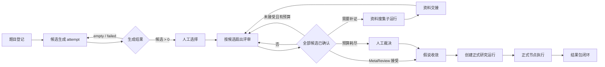
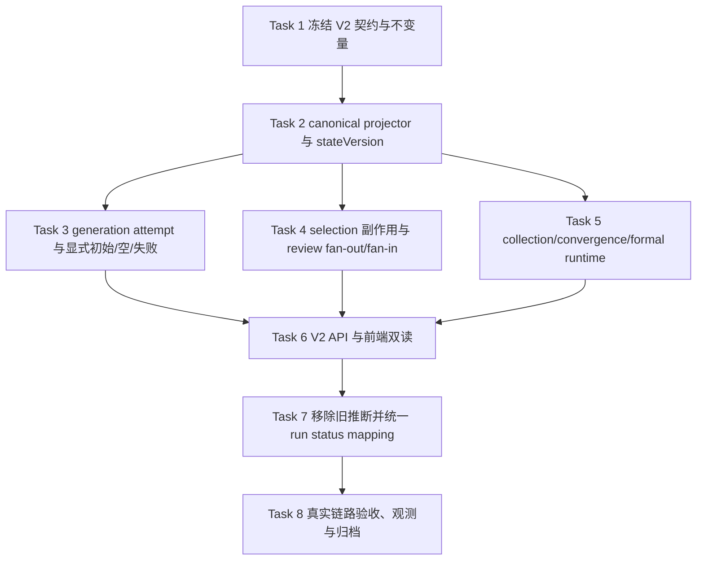

# 挑战杯规范化流程状态 V2 实施计划

> - **Status**：USER-REQUESTED / ACTIVE PLAN
> - **Plan mode**：TASK_GRAPH
> - **日期**：2026-08-25
> - **基线快照**：本地 `main@a0dafb02edf0d60840a096d18d32857d305a9c09`；实施任务开始前必须刷新当前 `HEAD`、active claim 与相关并行改动
> - **计划范围**：题目登记 → 候选生成 → 假说选择 → 候选评审扇出/汇合 → 资料搜集/交接 → 假说收敛 → 正式研究运行 → 结果闭环的规范化状态、动作与前后端契约
> - **本轮授权边界**：只落盘计划，不修改业务代码、不启动或重启产品运行时、不迁移用户数据、不 push/PR
> - **权威边界**：本计划低于 `AGENTS.md`、`docs/standards/`、ADR 与 owning module README；状态投影不是第二写入者
> - **实施 owner**：每个 Task 启动前由独立 worktree + claim 明确；本计划不自动占有业务文件
> - **关闭条件**：Task 1–8 完成或被新 ADR 取代后，将本文件迁入 `docs/archive/plans/<yyyy-mm>/`，并更新两个索引

---

## 1. 结论与决策摘要

当前问题的根因不是少一个按钮，而是前后端之间没有一份可证明、可版本化的“当前流程事实”。后端返回候选数、会议数、收敛布尔值等结果字段，前端再依据数量、URL、会议投影和加载状态猜当前阶段；因此“还没开始”“执行失败”“执行完成但结果为空”“数据损坏”会被压成同一个 `generation_missing`。

本计划采用以下决策：

1. 新增后端权威的 `HypothesisFirstStateV2`。前端只消费状态和服务端给出的动作，不再用候选数量、会议数量、URL 或面板状态判断业务阶段。
2. 顶层必须显式提供 `isInitial`、`stateVersion`、`currentPhase`、`allowedActions` 和 `problems`；所有阶段统一提供 `lifecycle / outcome / actionability / attempt / updatedAt`。
3. `isInitial=true` 的唯一语义是：**最近一次题目运行重置之后，没有任何 generation attempt、selection、review、collection、hypothesis round 或 formal run 流程事实**。题目元数据和模板基线不算流程进展，`candidateCount === 0` 永远不能作为初始态依据。
4. 生命周期、业务结果和“现在能否操作”分层表达，禁止再用一个 `status` 字符串同时承担三种含义。
5. 生成至少区分 `not_started`、`queued`、`running`、`waiting_human`、`completed+succeeded`、`completed+empty`、`failed`、`cancelled`、`superseded`。
6. 旧 `generation_missing` 不再是正常阶段：初始态映射为 `not_started`，空结果映射为 `completed + empty`，失败映射为 `failed`；只有权威事实预期存在却缺失/损坏时才产生 `problem.code`。
7. 扇出评审由后端按 `(selectionId, roundIndex, candidateId, attempt)` 投影逐候选状态，并给出 `total/completed/pending/failed/blocked` 聚合；前端现有候选清单改为消费该聚合。
8. 每个会议拆为 `discussion`、`summarization`、`approval` 三段，避免“会议 open”掩盖讨论已死、纪要未生成或正等待人工确认。
9. 资料搜集拆为 request、child run、per-source progress、handoff 四段；收敛与正式运行也进入同一快照。
10. `allowedActions` 由后端生成，携带命令、幂等键、payload、`expectedStateVersion`、可用性、禁用原因和确认要求；前端只负责呈现与发送。
11. V2 DTO 采用严格声明，嵌套模型 `extra="forbid"`；旧 `ChainStateResponse(extra="allow")` 只在兼容期保留。
12. 不引入 LangGraph、Temporal、Dify、Flowise 或 n8n 作为第二套引擎。只借鉴它们的状态快照、事件历史、attempt、interrupt、node state 与 crash recovery 设计，复用 Vibelution 已有 JSONL/Ledger、outbox、会议运行时、资料搜集子运行和命令幂等机制。

---

## 2. 当前问题与已核验事实

### 2.1 直接证据

| 现状 | 当前事实 | 风险 |
| --- | --- | --- |
| 初始态被推断 | `hypothesisFirstNextAction.ts` 在没有选择且 `candidateCount === 0` 时返回 `generation_missing` | 无法区分未开始、空结果、失败、旧数据缺损 |
| 后端状态过薄 | `hypothesis_first_chain.py::chain_state` 主要返回数量、布尔值和最近 ID | 前端必须跨五类请求自行拼阶段 |
| DTO 会隐藏漂移 | `hypothesis_first_models.py::ChainStateResponse` 使用 `extra="allow"`，部分 generation 字段未显式声明 | OpenAPI、Python 和 TypeScript 可长期不一致 |
| 选择与开会不是一个可观察事务 | `record_hypothesis_selection()` 先落选择，再 best-effort 开评审；失败只临时返回在 `reviewMeeting` | 刷新后丢失副作用失败事实，用户只看到“评审尚未开启” |
| 下一步由浏览器决定 | `ResearchProcessWorkspace.tsx` 调用 `resolveHypothesisFirstNextAction` 汇总链状态、会议、链接、请求和正式运行 | 同一事实可能在不同面板被解释成不同阶段 |
| 正式运行枚举漂移 | Python `WorkflowRunStatus`、`transitions.RunStatus` 与 TypeScript `WorkflowRunStatus` 集合不同 | 新状态可能被前端静默降级或被投影丢失 |

### 2.2 已修复但仍需收权的内容

旧的“同一 `roundIndex` 多个候选会议会整组丢弃”P0 在当前基线已经修复：

- `hypothesisFirstMeetingProjection.ts` 已按 `(selectionId, roundIndex, candidateId)` 建立稳定投影；
- `HypothesisFirstNodeInspector.tsx` 已展示“候选确认清单”与已确认/待确认/阻塞计数。

因此实施时不能把它当作待修 Bug 重做。V2 的任务是把这套**仍由前端推导**的规则迁到后端权威快照，并保留现有 UI 行为和测试作为迁移基线。

### 2.3 为什么单补 `isInitial` 不够

只增加一个布尔值能修正首次按钮，但仍回答不了：

- 生成请求是否已排队、正在运行、等待确认、成功为空、失败或被新尝试取代；
- 已记录选择后，N 个候选会议开了几个、失败几个、还差几个确认；
- “讨论进行中”究竟是 Agent 在运行、纪要在生成，还是进程重启后遗留的僵尸状态；
- 资料搜集是没有启动、子运行执行中、逐源完成、等待交接还是交接失败；
- 收敛完成后是否已经创建正式运行、正式运行是否需要 reconciliation；
- 页面拿到旧快照时，按钮是否仍可安全执行。

所以 `isInitial` 是必须字段，但必须放进完整的状态、attempt、problem 和 action 契约中。

---

## 3. 目标、非目标与成功定义

### 3.1 目标

- 用户从目录登记题目开始，可以依据同一份状态快照持续推进到正式运行结果，任何停顿都能看见“正在做什么、在等谁、还能做什么”。
- 后端拥有阶段判断、扇出聚合、下一动作和问题诊断的唯一权威；前端不再猜业务状态。
- 初始、空结果、失败、取消、被取代、等待人工和数据损坏均有不同的 wire contract。
- 每个写动作可幂等重放，可通过 `expectedStateVersion` 拒绝 stale 操作。
- 旧数据无需大爆炸重写即可投影为 V2；无法无歧义恢复的记录显式降级，不伪造成功。
- 同一状态能同时驱动画布、右栏 current task、团队壳徽标、命令面板和通知。

### 3.2 非目标

- 不替换现有研究运行时、会议运行时、资料搜集 Agent、Ledger 或 outbox。
- 不把投影层变成新的写入数据库或新的工作流调度器。
- 不在本计划中重做已修复的候选评审投影 UI。
- 不承诺所有操作都必须在右栏完成；验收要求是流程可闭环，深链必须有可返回路径。
- 不把轮询本身当状态来源；轮询/SSE 只负责刷新服务端事实。
- 不把第三方仓库代码、协议或依赖整仓复制进产品。

### 3.3 成功定义

以下条件必须同时成立：

1. 对同一题目、同一 `stateVersion`，后端、画布、右栏、命令面板和徽标展示同一 `currentPhase` 与同一主动作。
2. 在无候选时，系统能通过服务端事实稳定区分初始、生成中、完成为空、失败和损坏。
3. 选择 2–16 个候选后，快照包含完整候选集合；全部候选达到规定的人类确认终态之前，fan-in 不会提前发生。
4. 任何副作用在进程重启后仍有 durable attempt/problem 记录，不依赖调用当次的临时 response。
5. stale 动作返回结构化 409 和最新版本，重复幂等请求不产生第二批会议、子运行或正式运行。
6. 旧记录有明确的 legacy 投影规则；歧义数据进入 degraded/problem，而不是猜一个候选或阶段。
7. 使用 operator 已配置的 Flash 模型完成一轮真实挑战杯链路验收；业务代码不得硬编码模型名。

---

## 4. 状态模型

### 4.1 三层状态，不再复用一个字符串

`lifecycle` 表示执行走到哪里：

`not_started | queued | running | waiting_human | completed | failed | cancelled | superseded`

`outcome` 表示业务产出是什么：

`none | succeeded | empty | partial | rejected | exhausted`

`actionability` 表示用户此刻如何继续：

`idle | available | executing | waiting_user | waiting_system | blocked | terminal`

约束：

- `completed` 必须有非 `none` 的 outcome；
- `not_started/queued/running/waiting_human` 的 outcome 必须是 `none`；
- `failed/cancelled/superseded` 的 outcome 默认 `none`，原因放在 `problem`；
- “blocked”不是执行生命周期；它是 actionability，并必须有 problem 或 disabledReason；
- “empty”不是失败，表示生成过程正常结束但产出集合为空；
- “missing”不是正常生命周期，只能作为数据完整性 problem。

### 4.2 顶层阶段

`currentPhase` 的固定集合：

`registration | generation | selection | review | collection | convergence | formal_runtime | completed`

阶段不是只增不减。一次假说迭代可能从 `review` 进入 `collection`，资料交接后再回到下一轮 `review`。历史不能靠覆盖丢失，必须由 `roundIndex`、`attempt` 和 lineage 保留。

### 4.3 `isInitial` 与重置边界

投影先确定最近的 `question_run_reset_audit`：

- 有 reset audit：以其 `resetId/resetAt` 作为 `resetBoundary`；
- 没有 reset audit：以题目最早可见事实之前的虚拟边界 `origin` 作为边界；
- 只统计边界之后、且属于当前 team/question scope 的流程事实。

以下事实会使 `isInitial=false`：

- generation attempt 或候选生成会议；
- candidate record（包括旧记录中没有 attempt 的候选）；
- selection；
- review meeting/link/digest/approval；
- collection request/child run/handoff；
- hypothesis round/meta review；
- formal research run。

题目登记信息、题目正文、Agent 绑定、模板 baseline、纯 UI 选择和 query cache 不改变 `isInitial`。

### 4.4 `stateVersion`

当前事实分散在多个 append-only store，不能伪造一个不存在的全局自增序号。V2 将 `stateVersion` 定义为**不透明的相等性令牌**：

`hf2:<reset-id-or-origin>:<canonical-source-cursor-hash>`

- canonical projector 按固定顺序规范化各来源的 durable cursor/record identity 后计算；
- 任何会改变 V2 可见状态或动作的事实都必须改变令牌；授权/配置若会改变 action，也必须贡献一个不含密钥的版本游标；
- 客户端只比较相等/不相等，不按字符串或数字排序；
- mutating command 发送 `expectedStateVersion`；
- 不匹配时返回 HTTP 409 `state_version_conflict`，响应带 `actualStateVersion` 和最新快照读取地址；
- ETag 可直接使用同一令牌，但 ETag 不能替代 response body 中的 `stateVersion`。`computedAt` 必须由最新 source timestamp/reset boundary 确定，确保相同令牌的响应表示稳定；否则只能发送 weak ETag。

这使投影保持只读，又能可靠阻止 stale action。未来如果所有事实统一进入同一全局 ledger，可以在不改变客户端语义的情况下把令牌内部实现改为 ledger sequence。

### 4.5 V2 契约骨架

以下 TypeScript 是 Task 1 要冻结的最小完整结构；Python Pydantic 模型必须一一对应，不允许 `Record<string, unknown>` 代替核心状态。

```ts
type WorkflowLifecycle =
  | "not_started"
  | "queued"
  | "running"
  | "waiting_human"
  | "completed"
  | "failed"
  | "cancelled"
  | "superseded";

type WorkflowOutcome =
  | "none"
  | "succeeded"
  | "empty"
  | "partial"
  | "rejected"
  | "exhausted";

type WorkflowActionability =
  | "idle"
  | "available"
  | "executing"
  | "waiting_user"
  | "waiting_system"
  | "blocked"
  | "terminal";

type HypothesisFirstPhase =
  | "registration"
  | "generation"
  | "selection"
  | "review"
  | "collection"
  | "convergence"
  | "formal_runtime"
  | "completed";

type WorkflowProblem = {
  code: string;
  category: "validation" | "execution" | "integrity" | "dependency" | "stale";
  severity: "info" | "warning" | "error" | "fatal";
  message: string;
  recoverable: boolean;
  sourceKind: string;
  sourceId: string | null;
  detectedAt: string;
};

type WorkflowAttempt = {
  attemptId: string;
  number: number;
  lifecycle: WorkflowLifecycle;
  queuedAt: string | null;
  startedAt: string | null;
  heartbeatAt: string | null;
  finishedAt: string | null;
  supersedesAttemptId: string | null;
};

type PhaseState = {
  lifecycle: WorkflowLifecycle;
  outcome: WorkflowOutcome;
  actionability: WorkflowActionability;
  attempt: WorkflowAttempt | null;
  updatedAt: string | null;
  problems: WorkflowProblem[];
};

type ActionCommand =
  | "register_question"
  | "open_generation"
  | "retry_generation"
  | "record_selection"
  | "retry_review_dispatch"
  | "resume_discussion"
  | "stop_discussion"
  | "regenerate_summary"
  | "approve_summary"
  | "retry_collection"
  | "continue_collection"
  | "handoff_collection"
  | "human_adjudication"
  | "create_formal_run"
  | "reconcile_formal_run";

type ActionPayloadByCommand = {
  register_question: { draftId: string | null };
  open_generation: { questionId: string };
  retry_generation: { questionId: string; previousAttemptId: string };
  record_selection: { candidateIds: string[] };
  retry_review_dispatch: { selectionId: string; candidateIds: string[] };
  resume_discussion: { meetingRoundId: string };
  stop_discussion: { meetingRoundId: string };
  regenerate_summary: { meetingRoundId: string };
  approve_summary: { meetingRoundId: string; decision: "accepted" | "rejected" | "revised" };
  retry_collection: { requestId: string; childRunId: string | null };
  continue_collection: { requestId: string; childRunId: string };
  handoff_collection: { requestId: string; childRunId: string };
  human_adjudication: { hypothesisRoundId: string };
  create_formal_run: { questionId: string; hypothesisRoundId: string };
  reconcile_formal_run: { runId: string };
};

type ActionBase = {
  actionId: string;
  label: string;
  enabled: boolean;
  disabledReason: string | null;
  idempotencyKey: string;
  expectedStateVersion: string;
  targetPhase: HypothesisFirstPhase;
  targetNodeId: string | null;
  inputSchemaRef: string | null;
  requiresConfirmation: boolean;
  confirmationText: string | null;
};

type AllowedAction = {
  [C in ActionCommand]: ActionBase & {
    command: C;
    payload: ActionPayloadByCommand[C];
  };
}[ActionCommand];

type ReviewCandidateState = PhaseState & {
  candidateId: string;
  candidateOrder: number;
  selectionId: string;
  roundIndex: number;
  meetingRoundId: string | null;
  discussion: PhaseState;
  summarization: PhaseState;
  approval: PhaseState;
};

type CollectionSourceState = PhaseState & {
  sourceId: string;
  label: string;
  itemCount: number;
  error: WorkflowProblem | null;
};

type CollectionRequestState = PhaseState & {
  requestId: string;
  queryCount: number;
  childRun: PhaseState & {
    runId: string | null;
  };
  sources: CollectionSourceState[];
  handoff: PhaseState & {
    handoffId: string | null;
    targetRoundIndex: number | null;
  };
};

type FormalRunViewStatus =
  | "queued"
  | "running"
  | "waiting_human"
  | "blocked"
  | "reconciliation_required"
  | "succeeded"
  | "failed"
  | "cancelled"
  | "superseded"
  | "archived";

type HypothesisFirstStateV2 = {
  schemaVersion: 2;
  contract: "hypothesis-first-state/v2";
  teamId: string;
  questionId: string;
  stateVersion: string;
  computedAt: string;
  resetBoundary: {
    resetId: string;
    resetAt: string | null;
    source: "question_reset_audit" | "origin";
  };
  isInitial: boolean;
  currentPhase: HypothesisFirstPhase;
  overall: PhaseState;
  registration: PhaseState & { questionExists: boolean };
  generation: PhaseState & {
    generationMeetingId: string | null;
    candidateCount: number;
    candidateIds: string[];
  };
  selection: PhaseState & {
    selectionId: string | null;
    selectedCandidateIds: string[];
  };
  review: PhaseState & {
    activeRoundIndex: number | null;
    aggregate: {
      total: number;
      completed: number;
      pending: number;
      failed: number;
      blocked: number;
    };
    candidates: ReviewCandidateState[];
  };
  collection: PhaseState & {
    aggregate: {
      total: number;
      completed: number;
      pending: number;
      failed: number;
      blocked: number;
    };
    requests: CollectionRequestState[];
  };
  convergence: PhaseState & {
    latestHypothesisRoundId: string | null;
    accepted: boolean;
    roundIndex: number;
    roundBudget: number;
  };
  formalRuntime: PhaseState & {
    runId: string | null;
    runVersion: number | null;
    runStatus: FormalRunViewStatus | null;
    currentNodeIds: string[];
  };
  allowedActions: AllowedAction[];
  problems: WorkflowProblem[];
  sourceCursor: Record<string, string>;
};
```

`inputSchemaRef` 仅用于需要用户补充表单值的 action（例如空目录登记题目）；它引用前后端共同注册的版本化表单契约。前端可以收集输入，但不能自行决定命令是否可用，也不能绕过服务端对 payload 和 `expectedStateVersion` 的重新校验。

`CollectionRequestState` 的正式 DTO 必须显式包含：

- request 自身的 `requestId / lifecycle / outcome / queryCount`；
- child run 的 `runId / lifecycle / outcome / attempt / startedAt / heartbeatAt / finishedAt`；
- `sources[]` 的 `sourceId / label / lifecycle / itemCount / error`；
- handoff 的 `handoffId / lifecycle / outcome / targetRoundIndex`；
- request、child run、sources、handoff 各自的问题，不能压成一个 `status`。

### 4.6 初始快照示例

```json
{
  "schemaVersion": 2,
  "contract": "hypothesis-first-state/v2",
  "teamId": "research-team",
  "questionId": "SCI-125",
  "stateVersion": "hf2:origin:8d7d4a2f",
  "computedAt": "2026-08-25T04:00:00Z",
  "resetBoundary": {
    "resetId": "origin",
    "resetAt": null,
    "source": "origin"
  },
  "isInitial": true,
  "currentPhase": "generation",
  "generation": {
    "lifecycle": "not_started",
    "outcome": "none",
    "actionability": "available",
    "attempt": null,
    "updatedAt": null,
    "problems": [],
    "generationMeetingId": null,
    "candidateCount": 0,
    "candidateIds": []
  },
  "allowedActions": [
    {
      "actionId": "generate-candidates",
      "command": "open_generation",
      "label": "生成候选假说",
      "enabled": true,
      "disabledReason": null,
      "idempotencyKey": "hf:SCI-125:generation:attempt:1",
      "expectedStateVersion": "hf2:origin:8d7d4a2f",
      "payload": {
        "questionId": "SCI-125"
      },
      "targetPhase": "generation",
      "targetNodeId": "hf_generation",
      "inputSchemaRef": null,
      "requiresConfirmation": false,
      "confirmationText": null
    }
  ],
  "problems": []
}
```

生产响应必须包含 4.5 定义的全部字段；此处为阅读方便省略了不活跃阶段。

`overall` 不拥有独立状态机：它镜像 `currentPhase` 对应阶段的 lifecycle/outcome/actionability，`updatedAt` 取所有可见阶段与 problem 的最新时间。`sourceCursor` 只暴露不透明 cursor/record identity，不返回磁盘路径、内容摘要、Prompt 或凭据。

---

## 5. 阶段状态与推导规则

### 5.1 登记

| 条件 | lifecycle / outcome | currentPhase | 主动作 |
| --- | --- | --- | --- |
| 题目不存在 | `not_started / none` | `registration` | `register_question` |
| 登记处理中 | `running / none` | `registration` | 无，等待系统 |
| 题目存在 | `completed / succeeded` | 按后续事实决定 | 无 |
| 登记失败 | `failed / none` | `registration` | `retry_registration` |

空目录 CTA 和详情面板必须消费同一个 `register_question` action；不能再由某个挂载点是否传 `onRegisterQuestion` 决定能力是否存在。

### 5.2 候选生成

| durable 事实 | lifecycle / outcome | actionability | 说明 |
| --- | --- | --- | --- |
| reset 后无 attempt/meeting/candidate | `not_started / none` | `available` | 正常初始态，不是 missing |
| generation attempt 已记录，outbox 未领取 | `queued / none` | `waiting_system` | 可显示排队时间 |
| meeting/discussion 有活 lease | `running / none` | `executing` | heartbeat 超时后不能无限 running |
| 生成纪要待人工确认 | `waiting_human / none` | `waiting_user` | 动作指向精确会议 |
| 正常结束且候选 > 0 | `completed / succeeded` | `terminal` | 进入 selection |
| 正常结束且候选 = 0 | `completed / empty` | `available` | 显示“本次无候选”，允许新 attempt |
| attempt/dispatch/provider 失败 | `failed / none` | `available` 或 `blocked` | recoverable 时给 retry |
| 用户取消 | `cancelled / none` | `available` | 新 attempt 不能复用旧 ID |
| 新 attempt 替代旧 attempt | 旧记录 `superseded / none` | `terminal` | 当前状态只取最新 lineage |
| 预期 meeting/candidate payload 损坏 | lifecycle 由最后可信事实决定 | `blocked` | problem code 为 integrity，不伪装成初始 |

生成命令必须先持久化 `GenerationAttemptRecord(queued)`，再通过现有 outbox 打开会议；这样即使开会前进程崩溃，刷新后仍能看到 queued/failed/recoverable。

### 5.3 假说选择

- candidate generation `completed+succeeded` 且没有当前 selection：`selection.lifecycle=waiting_human`，提供 `record_selection`。
- 选择记录落盘后：`selection=completed+succeeded`；评审开会属于独立的 review dispatch，不回滚 selection。
- 同一个 selection 命令以 server-authored idempotency key 重放时必须返回同一 selection。
- 新 selection 必须引用 `previousSelectionId`，旧 selection 下尚未开始的副作用标为 superseded。
- “选择已记录但评审没开”不再由前端猜成 blocked；review dispatch attempt 给出 queued/failed/problem/retry。

### 5.4 评审扇出/汇合

后端从 selection 冻结预期候选集合：

`expected = selectedCandidateIds sorted by candidateOrder`

每个候选使用稳定 identity：

`(selectionId, roundIndex, candidateId, attemptNumber)`

每项包含以下子状态：

1. `discussion`：会议创建、Agent 回合、heartbeat、停止/恢复；
2. `summarization`：纪要生成、草稿校验、失败；
3. `approval`：等待人工、accepted/rejected/revised。

聚合不以“查到多少会议”为分母，而以 selection 冻结的 expected 集合为分母：

- `total = expected.length`；
- `completed`：该候选达到本轮规定的 approval terminal；
- `pending`：queued/running/waiting_human；
- `failed`：不可自动继续的执行失败；
- `blocked`：lineage/数据完整性问题或依赖未满足；
- 五项必须可由 candidates 数组重新计算并与服务端值一致。

fan-in 只在以下条件全部满足时写 hypothesis round：

- candidates 与 expected 一一对应，无缺失/重复；
- 所有候选都达到允许汇合的 approval terminal；
- 当前 selection、roundIndex 和 stateVersion 未被新选择/重置取代；
- fan-in idempotency key 未被不同 payload 使用；
- hypothesis round 的 meetingRefs 覆盖完整候选集合。

### 5.5 资料搜集与交接

每个 collection request 都是四段状态机：

`request recorded → child run queued/running → per-source terminal → handoff waiting/accepted`

推导规则：

- request 已记录但没有 child run：request `completed`，child `not_started`；如果自动启动承诺存在却没有 attempt，则发 `collection_child_missing` problem。
- child run 失败/中断：保留 attempt 和部分 source 结果，提供 `retry_collection` 或 `continue_collection`，不能清空进度。
- sources 可以部分成功；聚合为 `completed+partial`，是否允许 handoff 由后端质量门决定。
- child run 完成但没有 handoff：`handoff.waiting_human` 或 `handoff.failed`，动作精确指向 request/run。
- handoff accepted 后才能让下一 review round 消费该 request。

### 5.6 收敛

`convergence` 必须显式保存/投影：

- latest hypothesis round 与 roundIndex；
- MetaReview accepted/rejected；
- 本轮是否产生新 collection request；
- pending handoff 数量；
- roundBudget 与是否 exhausted；
- 判定依据列表，而不仅是一个中文 `convergenceDetail`。

状态：

- 尚未形成完整 round：`not_started`；
- 等待候选评审 fan-in：`queued` 或 `waiting_human`；
- MetaReview accepted、无新请求且无 pending handoff：`completed+succeeded`；
- 预算耗尽未收敛：`completed+exhausted`，提供 `human_adjudication`；
- 数据缺失或 lineage 冲突：`actionability=blocked` + problem。

### 5.7 正式研究运行

收敛成功且没有 run 时：

- `formalRuntime.lifecycle=not_started`；
- `currentPhase=formal_runtime`；
- `allowedActions` 必须包含 `create_formal_run`，直接接现有启动面板能力。

正式运行 wire status 统一为：

`queued | running | waiting_human | blocked | reconciliation_required | succeeded | failed | cancelled | superseded | archived`

内部 durable `RunStatus.CREATED` 显式映射为 wire `queued`；`reconciliation_required`、`superseded` 和 `archived` 不得被 TypeScript 丢失。Task 7 要把 Python projection enum、transition enum 和 TypeScript union 的映射集中测试，不要求把持久层与展示层强行合成同一个 enum。

run 成功并产生正式结果包后，顶层 `currentPhase=completed`、`overall=completed+succeeded`；run 失败或需 reconciliation 时仍停留在 `formal_runtime` 并给出后端动作。

---

## 6. 当前阶段选择优先级

canonical projector 按以下顺序选择用户当前应该处理的阶段：

1. scope 不存在或登记未完成：`registration`；
2. 已有 formal run 且未终结：`formal_runtime`；
3. formal run 已成功且结果包可读：`completed`；
4. 已收敛但尚无 formal run：`formal_runtime`；
5. 当前 collection 有未完成 child/handoff：`collection`；
6. 当前 selection 有未完成 review candidate，或服务端已允许开启下一轮 review：`review`；
7. 当前 round 正在等待 MetaReview/fan-in 判定，或预算耗尽等待裁决：`convergence`；
8. 已有 candidates 但没有 current selection：`selection`；
9. 否则：`generation`。

完整性 problem 不凭空创造“第九阶段”。它改变对应阶段的 actionability 和 allowedActions；只有 scope 无法解析时返回 409/422，而不是构造一个看似正常的空快照。

流程关系：



---

## 7. 后端 ownership 与写入边界

### 7.1 复用排序

| 优先级 | 现有能力 | 复用裁决 |
| --- | --- | --- |
| 1 | hypothesis-first JSONL records、question reset audit、meeting records、review links、collection request、hypothesis round | 继续作为业务事实源；V2 只读投影 |
| 2 | research runtime command idempotency、runVersion、outbox lease、human task | 改造后复用其 expected version、幂等与恢复模式 |
| 3 | `source_collection_projection.py` 和 formal `projection_builder.py` 的 command offer | 抽取一致的 action offer 语义，不复制两套字段 |
| 4 | SSE query invalidation、可见页轮询策略 | 扩展 state-changed 信号和 window-focus refetch |
| 5 | 前端 `hypothesisFirstMeetingProjection` / `hypothesisFirstNextAction` | 只作为兼容期 adapter 与回归 oracle；最终不再拥有业务判断 |

### 7.2 建议 owning surface

- 新增 `core/web/services/team_workflow/research_runtime/hypothesis_first_state_v2.py`：只读 canonical projector、stateVersion、phase selection、aggregate 与 problem。
- 新增或拆分 `core/web/routes/team_workflows/hypothesis_first_state_models.py`：严格 Pydantic V2 DTO；避免继续扩大 legacy model 文件。
- `hypothesis_first_chain.py`：保留业务命令与现有事实读取入口；只在需要暴露规范化 source reader 时做窄改。
- `hypothesis_selection.py`：selection 与 review dispatch attempt 的写入 owner。
- meeting runtime / rounds：discussion、summarization、approval 的事实 owner，不允许 projector 回写会议状态。
- source collection owner：request、child run、source progress、handoff 的事实 owner。
- research runtime store/projection：formal run 状态 owner。
- route 只调用 projector 并序列化，不实现状态判断。

### 7.3 新增 durable 事实

仅对当前事实无法证明的副作用新增记录：

- `generation_attempt`：在开生成会议前落 queued，记录 attempt、idempotency、lease/heartbeat、terminal；
- `review_dispatch_attempt`：selection 落盘后，记录整个 fan-out 和逐候选 dispatch；
- 如现有 meeting receipt 无法证明 Agent 回合 lease，则新增窄的 `meeting_discussion_attempt`，不能另建会议数据库。

所有新增记录：

- append-only；
- 包含 teamId、questionId、resetId/origin、attemptId、attemptNumber、idempotencyKey、createdAt/updatedAt；
- 由现有锁/事务与 outbox 管理；
- retry 创建新 attempt，旧 attempt 标记/投影为 superseded；
- projector 不补写“推导结果”。

---

## 8. API、DTO 与兼容策略

### 8.1 V2 endpoint

新增：

`GET /teams/{team_id}/workflow-orchestration/hypothesis-first/chain/state-v2?questionId=...`

保留现有 `.../chain/state` 为 V1 兼容端点。V2：

- response model 全字段严格声明，核心嵌套模型 `extra="forbid"`；
- 固定 `schemaVersion=2` 和 `contract="hypothesis-first-state/v2"`；
- 支持 ETag/If-None-Match；
- scope 不存在时仍可返回 registration 状态；非法 scope 返回 422；
- 来源读取失败时不能返回伪初始态，返回结构化错误或带 fatal problem 的 degraded 快照。

### 8.2 command contract

现有 mutating route 分批补齐统一 envelope：

```json
{
  "actionId": "approve-review-candidate",
  "idempotencyKey": "hf:sel-1:r2:candidate-7:approve:v1",
  "expectedStateVersion": "hf2:reset-1:812f...",
  "payload": {
    "meetingRoundId": "meeting-7",
    "decision": "accepted"
  }
}
```

服务端必须重新验证 action 是否仍 enabled，不能信任客户端带回的 label、disabledReason 或 targetNodeId。

### 8.3 前端双读

发布顺序：

1. 后端先上线 V2，V1 不变；
2. 前端并行读取/影子比较 V2 与旧 resolver，记录不含内容数据的阶段差异；
3. V2 成为画布、右栏、命令面板和徽标主来源；
4. 404/501 可回退 V1；500、invalid DTO、fatal problem **不得**静默回退为旧推断；
5. 稳定窗口结束后删除旧 `resolveHypothesisFirstNextAction` 业务分支和跨请求拼装；
6. 确认无消费者后再归档 V1 endpoint。

兼容期不能把 V1 猜测伪装成 V2 `isInitial`。UI 必须知道自己处于 `v1_legacy` 还是 `v2_canonical` 数据源。

---

## 9. 并发、幂等与恢复

### 9.1 stale handling

- 所有按钮都使用快照下发的 `expectedStateVersion`；
- 409 后自动刷新一次，并把用户留在同一逻辑阶段；
- 若动作仍存在，可提示“状态已更新，请再次确认”；不得自动执行需要人工确认的动作；
- 切换 questionId 时旧 query、旧 action 和旧 mutation 结果全部按 scope fencing 丢弃。

### 9.2 fan-out/fan-in

- meeting ID 基于 selectionId、roundIndex、candidateId、attempt 派生或持久化，禁止只用 roundIndex；
- fan-out 每个候选独立重试，不重复已成功候选；
- fan-in 读取 selection 冻结的 expected candidate set，并用幂等 receipt 保证只产生一个 hypothesis round；
- 新 selection/reset 到来时，旧 fan-out 的晚到结果保留审计但不能推进当前链。

### 9.3 crash recovery

- queued/running attempt 必须有 lease 或 heartbeat；
- 超时不直接改写为 failed，由 reconciliation 命令/受管扫描产生 durable terminal/recovery fact；
- 会议讨论、纪要、人工确认分别判断，不能因为 meeting `open` 就认为 Agent 仍在运行；
- recovery action 必须指向精确 attempt/meeting/request，不让用户依赖 `/chat` 里的隐藏停止按钮；
- 深链 action 同时提供 returnTo/returnLabel，离开主工作台后有明确回路。

---

## 10. 旧数据投影与迁移

不做一次性全量重写。先以只读 adapter 生成 V2：

| 旧事实 | V2 投影 |
| --- | --- |
| reset 后无流程事实 | `isInitial=true`，generation `not_started` |
| 有 candidates、无 generation meeting | generation `completed+succeeded`，attempt 标记 `legacy-derived` |
| generation meeting closed、0 candidates | `completed+empty` |
| selection 存在、无 review meeting/dispatch receipt | selection completed；review blocked，`review_dispatch_state_missing` |
| review link 缺 candidateId | 不猜 candidate；candidate blocked，`review_candidate_identity_missing` |
| 同 identity 多个会议 | 不任取一个；`review_lineage_conflict` |
| child run completed、无 runId/handoff | collection blocked，精确 problem |
| 已收敛、无 formal run | formal runtime not_started，提供 create action |
| 未知 formal run status | 保留原值到诊断字段，wire status 为空并产生 `formal_run_status_unknown` |

新写入从发布日开始生成显式 attempt/dispatch facts。只有影子比较证明 legacy adapter 无法稳定解释某类高价值记录时，才另立可回滚、带 preview/receipt 的迁移任务。

---

## 11. Problem taxonomy

首批固定 problem code：

| code | 含义 | 默认恢复 |
| --- | --- | --- |
| `generation_attempt_missing` | 预期有生成副作用但没有 attempt | reconciliation / retry |
| `generation_output_corrupted` | 生成已结束但候选载荷不可读 | 查看诊断后 retry |
| `review_dispatch_failed` | selection 后扇出失败 | 只重试失败候选 |
| `review_candidate_identity_missing` | 旧 link 无法绑定 candidate | 人工修复/迁移 |
| `review_lineage_conflict` | 同一 identity 多个互斥会议 | reconciliation |
| `meeting_discussion_stalled` | open 会议无活 heartbeat | resume/stop/retry |
| `meeting_summary_failed` | 讨论完成但纪要失败 | regenerate summary |
| `collection_child_missing` | request 存在但 child run 缺失 | start/retry |
| `collection_handoff_missing` | child 完成但 handoff 缺失 | create handoff |
| `formal_run_status_unknown` | 持久状态不在映射表 | reconciliation |
| `state_source_unavailable` | projector 读取某事实源失败 | 禁止伪初始，重试读取 |
| `state_version_conflict` | 客户端动作基于旧快照 | 刷新后重新确认 |

message 用于人读，业务分支只能依赖 code/category/recoverable。

---

## 12. 可观测性、刷新与用户提示

- SSE 增加 `hypothesis_first_state_changed`，最小 payload 为 teamId、questionId、stateVersion、currentPhase、awaitingHumanCount；
- 前端收到事件后失效 V2 query，不在 SSE reducer 内重建业务状态；
- polling 只在 queued/running/waiting_human 或 recoverable pending 时启用；
- 页面从后台回到前台、窗口 focus、网络恢复时强制校验 ETag；
- 团队壳徽标由 V2 聚合 `awaitingHumanCount`，覆盖候选纪要确认、搜集交接、人工裁决；
- 每个 phase 展示 updatedAt、attempt number、等待对象和 problem；
- 日志只记录 identity、版本、阶段、problem code、延迟和计数，不记录完整 Prompt、候选正文或资料内容。

---

## 13. 外部成熟方案调研与裁决

调研基于 2026-08-25 项目 active memory 中的浅克隆：

| 排名 | 项目 / 快照 | 借鉴点 | 裁决 |
| --- | --- | --- | --- |
| 1 | [LangGraph](https://github.com/langchain-ai/langgraph) `38031739e551` / MIT | `StateSnapshot.values/next/tasks/interrupts`、checkpoint、人工 interrupt | 最贴合“后端快照 + 下一动作 + 等待人工”；适配字段，不引入运行时 |
| 1 | [Temporal](https://github.com/temporalio/temporal) `3ba31f2ac021` / MIT | event history、execution 与 result 分离、attempt/retry、pending activity | 最贴合 durable attempt 与 crash recovery；复用现有 ledger/outbox |
| 2 | [Dify](https://github.com/langgenius/dify) `fcb380044cd8` / modified Apache family | workflow/node 双层状态、paused/retry/partial succeeded/exception | 借状态分层和 partial，不复制代码或 license-sensitive 实现 |
| 3 | [Flowise](https://github.com/FlowiseAI/Flowise) `9291856d1ea4` / repository license mixed | execution + nodeStates、时间/错误、waiting for input | 借 UI 可见的 node state 与 waiting input |
| 3 | [n8n](https://github.com/n8n-io/n8n) `7821b9c5b722` / Sustainable Use License | crashable 状态、执行恢复、历史保留 | 仅参考概念，不复制代码 |

综合裁决为 `REFERENCE_ONLY + ADAPT`：

- LangGraph 提供“快照里同时有 values、next、tasks、interrupt”的表达参考；
- Temporal 提供“事实历史、attempt、retry、pending work”的耐久性参考；
- Dify/Flowise 提供用户可见的阶段/节点双层状态；
- n8n 只用于校验 crash recovery 场景覆盖；
- Vibelution 保留自己的链事实源、会议和研究运行时，不新增第三方 workflow engine 依赖。

---

## 14. TASK_GRAPH



关键路径：`1 → 2 → 3/4/5 → 6 → 7 → 8`。Task 3/4/5 只有在 owning files 和事实源完全分离时才并行；`hypothesis_first_chain.py`、公共 DTO 和前端 workspace 都是热文件，默认串行。

### Task 1：冻结 V2 契约与状态不变量

- **Owner**：team workflow contract
- **方法**：BDD_TDD
- **Scope**：严格 Pydantic DTO、TypeScript DTO、contract fixtures、状态不变量测试
- **前置**：刷新当前 main、相关 claim、V1 payload 与 reset 实现
- **先写失败场景**：
  - 0 candidates 的 initial/empty/failed 三态不能相等；
  - lifecycle/outcome 非法组合被拒绝；
  - review aggregate 与 candidate items 不一致被拒绝；
  - DTO 多余字段被拒绝；
  - Python/TypeScript fixture 逐字段一致。
- **退出条件**：schema、枚举、problem code、stateVersion 语义、action envelope 被测试冻结；没有业务行为改动。

### Task 2：canonical projector 与版本游标

- **Owner**：hypothesis-first read model
- **方法**：BDD_TDD
- **Scope**：新 projector、source readers、stateVersion、currentPhase、problem 聚合
- **约束**：只读；不得写补偿记录；不得吞掉 source read error
- **测试**：
  - 同一 facts → 同一 stateVersion；
  - 任一可见 fact 变化 → version 变化；
  - reset 前事实不污染 reset 后 initial；
  - 多来源读取顺序变化不改变快照；
  - source unavailable 不返回假 initial。
- **退出条件**：纯函数 fixture 可以覆盖全阶段，投影没有副作用。

### Task 3：generation attempt 与显式 initial/empty/failed

- **Owner**：candidate generation command
- **方法**：BDD_TDD
- **Scope**：generation attempt record、outbox dispatch、retry/supersede、projector source
- **测试**：
  - 命令先落 queued attempt，再发生 side effect；
  - dispatch 前崩溃可恢复；
  - closed + 0 candidates 为 completed_empty；
  - provider/meeting failure 为 failed；
  - retry 生成 attempt N+1，重放不重复开会；
  - stale expectedStateVersion 返回 409。
- **退出条件**：`generation_missing` 不再承担正常状态。

### Task 4：selection 副作用与 review fan-out/fan-in 权威状态

- **Owner**：selection/review orchestration
- **方法**：BDD_TDD
- **Scope**：review dispatch attempt、candidate identity、三段会议状态、聚合、fan-in guard
- **测试**：
  - 2、16 candidates 扇出完整；
  - 一个候选 dispatch 失败只重试该候选；
  - pending summary/approval 不会 fan-in；
  - 重复 link、缺 candidateId 进入 problem；
  - 全部确认后只写一个 hypothesis round；
  - late completion 不推进已 superseded selection。
- **退出条件**：候选清单、计数和主动作均来自 V2 后端。

### Task 5：collection、convergence、formal runtime 纳入 V2

- **Owner**：各事实 owner + V2 projector 单一集成 owner
- **方法**：BDD_TDD
- **Scope**：request/child/source/handoff 状态、收敛依据、formal run mapping/action
- **测试**：
  - request 无 child、child partial、child failed、完成无 handoff；
  - handoff 后返回下一 review；
  - accepted/no-request/pending=0 才收敛；
  - budget exhausted 给 human adjudication；
  - converged/no-run 给 create_formal_run；
  - formal status mapping 覆盖未知值。
- **退出条件**：假说链到正式运行的断点能由同一快照解释。

### Task 6：V2 API 与前端双读迁移

- **Owner**：route/client/workspace integration
- **方法**：BDD_TDD
- **Scope**：V2 route、client、query、state-driven current task/action rendering、V1 fallback
- **UI 约束**：任何新增/修改的用户可见 VUI 元素先更新 `web/src/components/vui/designs/` 和 `designs/INDEX.md`；复用现有 candidate checklist、VStateRow、VStatusChip 和 command offer 组件
- **测试**：
  - V2 404/501 才回退 V1；
  - V2 500/invalid/fatal 不静默回退；
  - 同一 stateVersion 各面板主动作一致；
  - scope switch 丢弃旧 action；
  - returnTo/returnLabel 保留；
  - `npx tsc -b --pretty false` 与相关 VUI contract。
- **退出条件**：V2 成为主读，旧 resolver 只在明确 legacy path 运行。

### Task 7：移除旧推断并统一正式运行状态映射

- **Owner**：workflow contract cleanup
- **方法**：BDD_TDD
- **Scope**：删除 candidate/meeting-count 阶段猜测；集中 formal persisted→wire mapping；收紧 legacy DTO
- **测试**：
  - 源码 contract 禁止 `candidateCount === 0` 决定 initial；
  - 前端不能从 URL/selectedNodeId 决定业务 phase；
  - Python 与 TypeScript formal status fixture 一致；
  - unknown status fail closed。
- **退出条件**：只有后端 projector 拥有 currentPhase 和 allowedActions 规则。

### Task 8：真实链路验收、观测与归档

- **Owner**：integration acceptance
- **方法**：targeted verification + browser/runtime acceptance
- **Scope**：SSE/focus refresh、徽标、真实挑战杯闭环、文档归档
- **场景**：
  1. 登记一题；
  2. 使用 operator 配置的 Flash 模型生成候选；
  3. 选择至少 2 个候选；
  4. 逐候选完成讨论、纪要确认；
  5. 至少走一次资料搜集与 handoff；
  6. 收敛；
  7. 创建正式运行；
  8. 完成正式节点并看到结果包。
- **故障注入**：生成空结果、一个候选会议启动失败、讨论重启中断、child run 失败、stale action、窗口后台后恢复。
- **证据**：每一步保存 stateVersion/currentPhase/allowedAction/problem 的脱敏 trace；浏览器截图证明用户能定位下一步。
- **退出条件**：正常链闭环；故障链能恢复或明确 fatal，不出现“刷新永远无效”的假恢复；计划迁 archive。

---

## 15. 验收矩阵

| 场景 | 预期状态 | 预期动作/行为 |
| --- | --- | --- |
| 新登记题目，无流程事实 | isInitial=true；generation not_started | 生成候选 |
| 生成已排队 | queued | 显示排队，不重复开会 |
| 生成正常但无候选 | completed+empty | 解释空结果，可新建 attempt |
| 生成失败 | failed + problem | 重试，保留错误与 attempt |
| 有候选未选择 | selection waiting_human | 记录选择 |
| 选择 2 个候选，1 个会议未开 | review aggregate total=2/failed=1 | 只重试失败候选 |
| 两个候选均待纪要确认 | waiting_human；awaiting=2 | 清单展示两个精确入口 |
| 仅确认一个候选 | completed=1/pending=1 | 不 fan-in |
| 资料搜集逐源 2/3 完成 | collection running/partial progress | 展示逐源，不伪装完成 |
| child 完成无 handoff | handoff waiting/failed | 交接/重试 |
| 收敛完成无正式 run | formal_runtime not_started | 创建正式研究运行 |
| stale button | 409 state_version_conflict | 刷新并重新确认 |
| reset 后旧任务晚到 | isInitial 由新 reset boundary 计算 | 晚到结果不推进新链 |
| 未知/损坏事实 | phase 保留最后可信状态 + fatal problem | 禁止误显示生成按钮 |

---

## 16. 风险、回滚与 deferred

### 16.1 主要风险

- 多 store 读取时发生跨时刻快照：Task 2 必须用现有读锁/一致性 cursor，或把不一致显式标为 stale/problem。
- action 下发后状态迅速变化：依靠 expectedStateVersion + command 内二次授权，不依赖按钮 disabled。
- 旧数据缺 candidate identity：禁止猜测；这会暴露历史问题，但比错误 fan-in 安全。
- V1/V2 双读增加请求量：优先 ETag、SSE invalidation 和共享 query，影子比较仅在受控窗口启用。
- 并行任务可能改动 reset、meeting receipt、workspace 热文件：每个 Task 开始前重新 preflight，不以本计划基线覆盖新事实。

### 16.2 回滚

- V2 endpoint 与 V1 并存，前端可切回明确的 V1 compatibility path；
- 新 attempt records append-only，旧版本忽略未知 recordKind，不删除历史；
- UI 切换不改变事实写入；
- 任何迁移都必须另有 preview、receipt、restore/discard 语义；
- 回滚不能恢复 `candidateCount===0 => initial` 作为 V2 规则。

### 16.3 Deferred

以下不阻塞 V2 首次交付：

- 全量桌面/系统通知；首批只做壳徽标与 focus refresh；
- 历史聊天室自动归档策略；
- 每个资料源更细的 token/cost/quality 指标；
- 全产品其他 workflow 统一到同一通用状态库；
- 引入单一全局 workflow event sequence；
- 对旧数据做主动批量迁移。

---

## 17. 实施前刷新清单

每个 Task 开始时必须重新确认：

1. 当前 main SHA、origin 关系、root dirty 状态；
2. reset、meeting receipt、hypothesis chain、workspace 的 active claim；
3. 旧扇出 P0 与候选清单是否仍已修复；
4. V1 DTO、前端 resolver、formal status enums 是否已被其他任务改变；
5. operator Flash 配置是否可用，但不得输出密钥或完整配置；
6. 本地复用与外部参考的快照/许可是否变化；
7. scoped tests、TypeScript build、VUI contracts 和真实浏览器验收命令。

本计划完成后不得继续作为现行规范堆在 `docs/plans/`；长期不变量应升格到 ADR/module README，实施记录迁入 archive。
