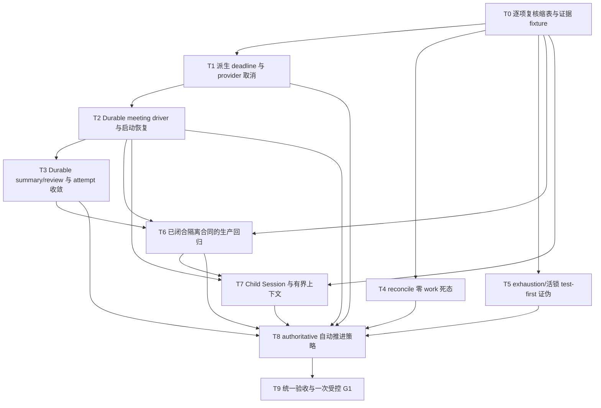

# 挑战杯自动运行链路可靠性完整修复方案

> 文档 ID：`CC-AUTOMATIC-CHAIN-RELIABILITY-20260830`
>
> 状态：`USER-REQUESTED / ACTIVE PLAN / PARTIALLY LANDED（复核缩表见 §2.3）`
>
> 权威路径：根 `main` 的 `docs/plans/2026-08-30-challenge-cup-automatic-chain-reliability-plan.md`；任务 worktree 只用于隔离编辑，不作为交付路径
>
> 证据复核基线：本地 `main@9ea07665d302a01748a178a25a753f86ad35c451`，复核时间 `2026-08-30 22:49 +08:00`；原计划基线 `927ca4858` 已被后续 `77f3dab5a`、`9ea07665d` 等修复推进，实施前仍须重新读取最新 main、active claim 与运行指纹
>
> 适用范围：挑战杯假说生成、群聊评审、摘要、LangGraph/Workflow Ledger 调度、恢复与自动推进
>
> 非完成声明：本文是修复合同，不是代码完成、DEV 通过、生产 G1 或正式研究结果证据

## 1. 结论

本轮不改造普通对话链路。推荐路径是：继续复用原生 Session/Agent/LLM 执行链，在挑战杯 `team_workflow/research_runtime` 内补一层 **Challenge-only durable meeting driver**，把群聊续轮、摘要、评审调用、deadline、父 run 停止和恢复都变成服务端持久化状态机；LangGraph、Workflow Ledger/outbox、MeetingRound 与既有 challenge receipt registry 继续作为事实源，不引入第二个 workflow engine、第二套 transcript 或第二套 receipt 账本。

本版先完成证据缩表，不把旧计划的 11 项判断整体当作开工事实。当前修复优先级为：

1. 先消除无 deadline、无 owner 的 `running`、`summarizing` 永久悬挂和 reconcile zero-work 死态；attempt/exhaustion 活锁先证伪，不预设为已确认事实；
2. 再闭合重启恢复、跨 run 隔离和上下文污染；
3. 最后才把 shadow/preview 自动策略升级为 authoritative 自动推进。

“链路稳定可推进”和“零人工运行”是两项不同验收。前者完成前不得开启自动批准；后者未完成时不得宣称 zero-click。

## 2. 当前问题缩表与证据锚点

状态含义：`OPEN` 才进入代码修复；`PARTIAL` 只修剩余缺口；`CLOSED_REGRESSION` 不重写实现，只补生产形状回归；`VERIFY_FIRST` 必须先复现，未复现不得预授权修改业务代码。

| 原问题 | 当前状态 | 当前证据锚点 | 下一动作 |
| --- | --- | --- | --- |
| preformal Challenge 会议无 deadline | `OPEN / P1` | `chat_room_service.py:3738-3748,4627-4651` 只承认 `workflow_discussion_scope.v1 + receipt authority`；`meeting_rounds.py:296-307` 也只在存在 receipt authority 时写 `challengeDeadlineAtMs`。生产记录 `hf-review-hsel-6468d71e0875691a-c627a33139-r2`、`...-8f951e6d11-r3` 的 deadline 均为空 | T1 让 preformal/formal 都进入服务端派生 deadline，不再用 receipt 是否存在判定 Challenge 身份 |
| 会议续轮依赖进程内 executor/job set | `OPEN / P1` | `meeting_runtime.py:132-137,1643-1729` 的 `_MEETING_DISCUSSION_EXECUTOR/_MEETING_DISCUSSION_JOBS` 是唯一调度 owner | T2 新增 durable work/lease，先绑定 round 再派发，启动时可恢复 |
| `summarizing` 无 durable invocation intent | `OPEN / P1` | `meeting_runtime.py:2365-2435` 先写 `summarizing` 后同步调用；`chat_room_service.py:2004-2009` 会吞 completion hook 异常。生产记录 `hf-candgen-10931892161cf654`、`...-8f951e6d11-r3` 停在 `summarizing` | T3 把 digest/review 变成有 lease、deadline、sourceHash 的 durable work；hook 失败必须留可恢复事实 |
| reconcile zero-work 死态 | `PARTIAL / P1` | `command_service.py:1306-1308` 已做到 `revived > 0` 才 wake；但 `1240-1243` 仍先写 `RUNNING`。Canonical Ledger 中 `run-16cfab646d08` 仍为 `running/knowledge_ingestion`，最新 attempt 与 adapter outbox 已 failed，且无 pending/leased outbox | T4 只修 `revived=0 + zero active work` 的精确落点，不重写已闭合 wake 分支 |
| review LLM 600 秒 daemon timeout | `OPEN / P1` | `llm_review_runners.py:56-67,104-136` 明确 timeout 后 daemon/provider 继续。当前 receipt 221 条成功调用：p50=`28,801ms`、p95=`359,704ms`、max=`506,392ms`；`relay_autodl/GLM-5.3-flash` 73 条 p95=`477,878ms` | T1 复用 provider cancel bridge，并按实测调用延迟派生预算，禁止 orphan daemon |
| workflowRunId 跨 run 隔离 | `CLOSED_REGRESSION` | `hypothesis_first_chain.py:3936-3955,4518-4552` 已按 run 过滤；测试 `test_question_run_scopes_candidate_generation_before_receipt_resolution`、`test_chain_state_ignores_review_artifacts_from_other_workflow_runs` 已覆盖 | T6 只保留生产形状回归，不再把它列为待实现功能 |
| stopped/failed meeting 被 heal/promote/reuse | `CLOSED_REGRESSION` | 测试 `test_stopped_generation_does_not_heal_or_reuse_for_a_new_run`、`test_active_generation_from_cancelled_run_does_not_block_new_run` 已锁定新 run 不复用旧停止会议 | T6 只验证旧 meeting 含部分候选标记、新 authority 变化的生产形状 |
| parent `blocked/cancelled` 未传播 | `CLOSED_REGRESSION` | `meeting_receipt_authority.py:18-21` 已把 `blocked/reconciliation_required` 纳入 execution-inactive；`77f3dab5a` 增加精确人工会议 gate 例外；`test_research_workflow_meeting_runtime.py` 已覆盖 `challenge_workflow_run_blocked` | T6 只补 Session→meeting→active-work 的端到端回归；不重写父 run 权威合同 |
| attempt exhaustion 自动复活/活锁 | `VERIFY_FIRST / P2` | `ledger/repository.py:889-919` 已能把 lease exhaustion 标为 failed；当前没有可复核的 failed↔pending 时间线证明自动 repair sweep 会复活它 | T5 先做时间推进与事件增长测试；只有复现 tight loop 才授权最小代码修复 |
| preformal 长期使用 direct Session | `OPEN / P2` | formal 在 `meeting_runtime.py:458-482` 解析 hidden Child Session；preformal 在 `505-614` 直接用 Agent roster 创建房间，而 `chat_room_service.py:3577-3610` 会解析为 Agent `directSessionId` | T7 改为 meeting/attempt-scoped Child Session 或等价有界 Challenge 投影，普通 Session 零差异 |
| 自动策略仍为 preview/shadow | `OPEN / P2 / DEFERRED` | `automation_policy_service.py:1-6,159-182` 明确 preview-only、`executed=False`；`test_research_workflow_policy_shadow_evaluator.py` 明确 shadow 不发命令 | 稳定性任务全部闭合后再做 T8 authoritative 升级 |

以上结论只代表 `main@9ea07665d` 与 `2026-08-30 22:49 +08:00` 的快照。当前 registry 另有 active writer 占用 `chat_room_service.py`、`meeting_runtime.py`、`hypothesis_first_chain.py`；T0 必须在真正开工时重新读取最新 main/claim/diff，并再次缩表。已有修复必须保留：正式会议持久 deadline、外层/会议 deadline 取最早值、晚到结果隔离、stopped meeting 终态、receipt durability、provider cancellation、Ledger 调用前预算预检和 run-scoped 读写。

### 2.1 开工串行闸门

- T0 的只读复核和 fixture 设计可以先做；任何 T1–T8 代码写入前，必须先确认热文件 active claim 已释放或得到显式交接。
- `run-16cfab646d08` 当前仍停在 `knowledge_ingestion` 的 `running + zero active outbox` 形状。不得停止未知 owner 的 run；必须由其 owner 明确收口，或以可审计方式正式搁置后，才允许进行会触及 Launcher、Ledger worker、meeting runtime 的实现/迁移/运行验收。
- 代码开发、数据 preview/apply、Launcher refresh、DEV/G1 各自串行。运行时有 active work 时不得刷新；迁移只在 Launcher 停止且无 live writer 时执行。

### 2.2 本次生产形状来源

- 路径先由 `scripts/migrate_project_storage.py inventory --project <root>` 解析，不硬编码用户名或旧 Documents 数据根。
- run/outbox/attempt：`<activePaths.data>/research_workflows/workflow-ledger.sqlite`，只读查询 `run-16cfab646d08`。
- meeting：`<activePaths.workspace>/teams/research-team/research_workflow/meeting_rounds.jsonl`，只投影 ID、run、status、deadline、bound round count 与 problem code，不复制 transcript。
- latency：`<activePaths.workspace>/teams/research-team/challenge_program/model_invocation_receipts/`，按唯一 `receiptId` 去重，只统计 `status=succeeded` 的 `latencyMs`；不把 request/response excerpt 写入 fixture 或本文。

### 2.3 T0 复核缩表（2026-09-01，`main@321be72e6`）

本节是 §2 表格在 `2026-09-01` 的只读复核结果（复核窗口内 main 曾由 `00d1ccf73` ff 至 `321be72e6`，差异仅 `challenge-stage1-lineage-writers` 面，锚点已按新 SHA 复验）。§2 原表保留为 `9ea07665d` 历史快照，本节为当前权威。自基线以来共 159+ 提交，其中直接相关的修复：`cd08ef549`（durable deadline 派生）、`5c5cff9ac`（per-call/会议 deadline 分离）、`33bcfc15b`（durable meeting driver + 启动恢复）、`68d9bee4c`（zero-work reconcile fail-closed）、`fd44c0c8b`（评审并发 4 工）、`0a2990bb4`（chat-room 锁序）、`ab8cd9179`（AutoAdvancePolicyV2 受控激活分支）。

| 原问题 | 复核状态 | 复核证据锚点 | 下一动作 |
| --- | --- | --- | --- |
| preformal Challenge 会议无 deadline | `PARTIAL / P1` | 代码面已闭合：`challenge_deadline_policy.py:29-31` 的 `_CHALLENGE_SCOPE_AUTHORITIES` 已含 `preformal_candidate_review_scope.v1`；`meeting_runtime.py:1136` 创建会议即写 `challengeDeadlineAtMs`（`cd08ef549`、`5c5cff9ac`）。生产面：当前唯一正式会议已带 deadline；无新 preformal 样本。**遗留缺口已收口**（`codex/challenge-legacy-meeting-closeout`）：恢复扫描对无 deadline 且无 intent 的会议按身份分流——Challenge 身份会议回填受治理 deadline（`persist_challenge_meeting_deadline_policy`），无身份遗留孤儿经既有终态路径以 `legacy_orphan_closeout` 收口（见 N1/N2 状态） | 生产验证：下次 Launcher 重启后确认 2 个悬挂会议被扫描收口 |
| 会议续轮依赖进程内 executor/job set | `PARTIAL / P1` | `meeting_runtime.py:151-157` 的 `_MEETING_DISCUSSION_EXECUTOR`（max_workers=4，`fd44c0c8b`）仍是唯一调度 owner；但派发前先持久化 intent（`meeting_runtime.py:1791-1794,1894`），`meeting_driver_work.py` 提供 durable intent 存储，`lifecycle.py:91-96,203` 启动挂载恢复扫描（`33bcfc15b`）。lease/heartbeat 未落地（模块 docstring 自述为 T3 future work） | T2 剩余：为 digest/review 工作补 lease/heartbeat 或等价崩溃恢复合同 |
| `summarizing` 无 durable invocation intent | `PARTIAL / P1` | intent 存储只覆盖 `ACTION_RUN_DISCUSSION`（`meeting_driver_work.py:29`）；扫描可 fence deadline 过期的 summarizing 会议（`meeting_driver_work.py:244,276-284`）；digest 调用已有 450s 有限超时与 `summaryDraftError` 暴露（`llm_review_runners.py:70`、`meeting_runtime.py:3113`）。deadline 前崩溃的 summarizing 不会被 re-drive；2 个生产遗留悬挂已按无身份遗留孤儿收口（N2），剩余缺口是 re-drive 合同 | T3：digest/review 变 durable work（lease + deadline + sourceHash） |
| reconcile zero-work 死态 | `CLOSED_REGRESSION` | `command_service.py:1256-1292`：`revived=0 + zero active work` 落 `RECONCILIATION_REQUIRED + reconcile_no_active_work`，不再先写 RUNNING（`68d9bee4c`）。生产锚点更替：`run-16cfab646d08` 已不在 ledger（只读查询无该行）；当前唯一 run `run-882610596ddb` 为 `blocked@source_finding`，outbox 无 pending/leased，reconcile 成功 16 次无错误复活——fail-closed 形状正确 | T4 转入回归保留；新 blocked 根因另立调查（N3） |
| review LLM 600 秒 daemon timeout | `CLOSED_REGRESSION` | `llm_review_runners.py:215-246`：deadline 派生超时（与外层取最早）+ `llm_cancel_context(enable_chat_provider_abort=True)` provider cancel bridge + `challenge_review_deadline_exceeded` 分类；默认上限 450s（`llm_review_runners.py:70`）。小偏差：第 59-69 行注释按 600s 余量行文，常量为 450，二选一修正 | 回归保留；orphan daemon 路径已闭合，禁止重新引入无 cancel 的超时 |
| workflowRunId 跨 run 隔离 | `CLOSED_REGRESSION` | 测试仍在，行号漂移：`tests/test_research_workflow_hypothesis_first_chain.py:651,1719` | T6 保留，不重写 |
| stopped/failed meeting 被 heal/promote/reuse | `CLOSED_REGRESSION` | 测试仍在：`tests/test_research_workflow_hypothesis_first_chain.py:4554,4615` | T6 保留，不重写 |
| parent `blocked/cancelled` 未传播 | `CLOSED_REGRESSION` | `meeting_receipt_authority.py:18-21` 的 `_EXECUTION_INACTIVE_RUN_STATUSES` 仍含 `blocked/reconciliation_required`。原测试 `test_challenge_workflow_run_blocked` 已更名拆分，语义由 `tests/test_chat_room_service.py:2931,3284-3290` 与 `tests/test_research_workflow_hypothesis_first_chain.py:150-154` 覆盖 | T6 补 Session→meeting→active-work 端到端回归 |
| attempt exhaustion 自动复活/活锁 | `VERIFY_FIRST / P2` | 锚点迁移：`ledger/repository.py` 已不存在；现为 `adapter_dispatch_worker.py:288-383` 的 `_repair_terminal_failed_adapter_dispatch` 修复 `lease_attempt_exhausted` 行，且 `command_service.py:1246-1252` 对 `auto_advance_not_ready` 的 blocked attempt 明确不复活。仍无 tight-loop 复现时间线 | T5 不变：先做时间推进与事件增长测试，未复现不得改业务代码 |
| preformal 长期使用 direct Session | `OPEN / P2` | `meeting_runtime.py:526-640` 的 `_resolve_preformal_candidate_review_room` 仍用 roster 直连房间（docstring 自述 formal 才走 child-session）；新增 `PreformalCandidateReviewScopeV1` 身份与内容绑定校验属改善但未解决 Session 有界性；`chat_room_service.py:662,761,864` 仍解析 `directSessionId` | T7 不变：改为 meeting/attempt-scoped Child Session 或等价有界投影，普通 Session 零差异 |
| 自动策略仍为 preview/shadow | `PARTIAL / P2` | `automation_policy_service.py:212-213,265-266` 仍 `previewOnly / executed=False`；shadow 测试 `tests/test_research_workflow_policy_shadow_evaluator.py` 仍在。但 `ab8cd9179` 新增 `automation_policy_executor.py`：activation 阶段（`approved + approvedBy` fail-closed）、安全梯（kill switch env / activation credential / calibration gate / drain / capability switch），链路已接 3 个决策触点（`hypothesis_first_chain.py:204,230,244,5415,7865`）。生产侧未激活 | T8：稳定性任务全绿后按安全梯走受控激活；此前保持 previewOnly |

**复核新发现（不在原 11 项内）：**

| 编号 | 发现 | 证据锚点 | 下一动作 |
| --- | --- | --- | --- |
| N1 | `CLOSED`：悬空引用已由 `codex/challenge-legacy-meeting-closeout` 消除——「无 deadline 且无 intent」不再永久跳过：有 Challenge 身份的走 `persist_challenge_meeting_deadline_policy` 回填（计入 `backfilled`），无身份的经 `terminate_meeting_execution` 以 `legacy_orphan_closeout` 收口（`meeting_driver_work._close_or_backfill_identity_gap`）；原悬空注释（「preformal deadline backfill task owns these meetings」）已删除 | 测试 `test_recovery_backfills_deadline_for_identity_meeting_missing_policy`、`test_recovery_fences_legacy_orphan_meetings_without_identity` | 无 |
| N2 | `CLOSED（待生产验证）`：两个 `summarizing` 遗留悬挂（`hf-candgen-80e9711246ab2b0c`、`hf-candgen-ca2e9a04026b229b`）无身份、无 deadline、无 intent，下次启动扫描将按无身份遗留孤儿经终态路径以 `legacy_orphan_closeout` 收口，无需手工改数据 | `meeting_rounds.jsonl`（2026-09-01 只读投影）；收口逻辑同上 | 下次 Launcher 重启后只读核对两条记录转 `closed/stopped` |
| N3 | 新生产锚点：`run-882610596ddb`（SCI-091，2026-09-01 16:52 创建）`blocked@source_finding`，原因 `adapter_execution_exception → agent_turn_terminal_failed`（`session-20260901-183944-977056`）。fail-closed 生效，但运行中断根因未查 | `workflow-ledger.sqlite` 只读查询（2026-09-01） | 另行根因调查；不并入本计划 T 序列，避免扩大闸门 |

**复核结论：** 11 项中 `CLOSED_REGRESSION` 5 项（4、5、6、7、8）、`PARTIAL` 4 项（1、2、3、11）、`OPEN` 1 项（10）、`VERIFY_FIRST` 1 项（9）。`codex/challenge-legacy-meeting-closeout` 落地后，N1 悬空引用与 N2 生产遗留悬挂已收口。对 [全零人工路线图](2026-09-01-challenge-cup-stage-one-zero-human-roadmap.md) Phase 1 闸门的影响：T1–T7 尚未全绿，剩余代码缺口收敛为 3 处——T2 lease/heartbeat、T3 digest durable work、T7 有界 Session——外加 T5 证伪测试。这些缺口闭合前不得合闸自动推进（路线图 §9 停止条件继续有效）。

## 3. 保护边界

### 3.1 必须保持不变

- 普通 Session 的 admission、turn journal、worker、persist、projection 与 SSE 仍是普通会话唯一权威；
- Challenge receipt、预算累计、延迟与 reasoning Token 留在 challenge registry/Ledger 或只读投影，不写入模型可见 transcript；
- Prompt Cache 保持 `disabled`，能力门未证明 provider 返回缓存字段前不得启用；缓存 miss/unsupported/无遥测永远不能阻止状态转移；
- AgentDirectory、Team、operator config、模型绑定和真实运行数据不属于本计划代码修复的默认写入面；
- 不引入 Temporal、AutoGen、Dify、n8n 等新运行时依赖。

### 3.2 允许扩展

- 在 `core/web/services/team_workflow` 与 `research_runtime` 新增 challenge-scoped driver、intent/outbox、恢复扫描和 read model；
- 在既有 LLM 取消接口上传递 Challenge 绝对 deadline；通用调用在未携带 Challenge scope 时行为零差异；
- 使用原生 Child Session 执行单个 meeting/attempt，但不得让其成为第二套业务状态机或永久共享 transcript。

## 4. 推荐架构

### 4.1 事实源分层

| 事实 | 唯一权威 | 禁止做法 |
| --- | --- | --- |
| workflow run/node/attempt/outbox | Workflow Ledger + LangGraph checkpoint | 从 UI、Session status 或 projection 反推业务状态 |
| meeting 定义、deadline、绑定 rounds、终态 | MeetingRound append-only records | 以内存 job set 作为唯一 owner |
| room/speaker 对话结果 | 原生 chat-room/Child Session transcript | 在 Ledger 或 receipt store 复制整段 transcript |
| digest/review 调用意图与租约 | Challenge meeting work/outbox | 只用 daemon thread 和进程内锁 |
| 模型调用 receipt | 既有 challenge receipt registry/Ledger | 把完整 receipt/excerpt 写回 turn journal |
| 预算/延迟/reasoning/cache | 调用 receipt 的诊断投影 | 让投影写入失败阻止 graph/meeting 状态推进 |
| 自动决策 | durable policy decision record | 由模型自由文本或前端按钮状态决定推进 |

### 4.2 对成熟项目的借鉴

- **LangGraph**：继续使用 checkpoint、thread/run identity、显式 conditional edge 和 recursion/iteration guard；所有恢复必须从 durable state 重新路由，不从内存 continuation 猜测。
- **Temporal**：只借 activity 的 durable intent、lease、heartbeat、绝对 timer、幂等 key 和 retry exhaustion 语义；不引入 Temporal 依赖。
- **PydanticAI/结构化 Agent**：模型输出只进入严格 schema，状态转移由服务端 validator 决定；不把模型自然语言当控制平面。
- **AutoGen/Swarm supervisor**：借“每次 handoff 前检查共享停止条件”和明确终止信号；不新建第二套多 Agent runtime。
- **Dify/Flowise/n8n**：只借用户可见的阶段/问题/恢复动作投影；它们不成为后端状态权威。

## 5. 状态转移合同

### 5.1 WorkflowRun 执行活性

业务终态集合保持 `succeeded/failed/cancelled/archived`。会议执行另定义 execution-inactive 集合：

```text
blocked | succeeded | failed | cancelled | archived
```

`blocked` 不是不可恢复的最终业务终态，但在显式恢复前必须停止所有新 speaker、续轮、summary 和 review provider 调用。恢复命令必须重新读取 run authority，再创建新的 durable work，不能让旧内存任务自行复活。

### 5.2 Meeting execution

MeetingRound 的展示 `status=open/closed` 与执行 `executionStatus` 分离：

```text
queued
  -> running
  -> summarizing
  -> awaiting_approval
  -> completed

queued|running|summarizing
  -> stopped    (deadline / parent inactive / operator stop)
  -> failed     (non-retryable / retry exhausted / corrupt authority)

stopped|failed|completed
  -> immutable historical evidence
```

强制不变量：

- meeting 创建时由服务端写 `meetingAttemptId`、`workflowRunId`、`deadlinePolicyVersion`、`plannedSerialCallCount`、`perCallBudgetMs`、`meetingBudgetMs` 与 `challengeDeadlineAtMs`；
- room round 必须先追加到 `chatRoomRoundIds`，再允许 worker claim；
- 每个 speaker、follow-up round、summary/review 调用前重读 meeting 和 parent run；
- deadline/parent inactive 已成立时，不得写入晚到 `completed` 消息，只写 `stopped/cancelled` 审计证据；
- `stopped/failed` meeting 不得 heal、promote、reuse、作为 review authority 或阻止新 attempt；
- hook 异常必须形成 durable problem/retry intent，禁止 `except: pass` 吞掉。

### 5.3 Generation attempt

```text
queued -> running -> completed(succeeded|empty)
                  -> awaiting_approval
queued|running -> stopped|failed
stopped|failed -> superseded by attempt N+1
```

generation attempt 必须跟随绑定 meeting 的终态收敛。旧 meeting 存在不再等价于“无需生成”：只有当前 `workflowRunId + attemptId` 下存在 active durable work 或已产生足够 canonical candidates 才返回 false。

### 5.4 Durable work/outbox

每个执行动作至少持久化：

```text
workId, workflowRunId, meetingRoundId, meetingAttemptId,
actionKind, sequence, idempotencyKey, status,
leaseOwner, leaseExpiresAtMs, heartbeatAtMs,
attemptCount, availableAtMs, absoluteDeadlineAtMs,
sourceHash, lastProblem, createdAtMs, updatedAtMs
```

推荐 actionKind：`start_round`、`invoke_speaker`、`draft_digest`、`run_review_step`、`finalize_meeting`。幂等 key 至少包含 `workflowRunId/meetingAttemptId/actionKind/sequence/sourceHash`。

worker 顺序固定为：claim lease → 重读 authority/deadline → 执行一次副作用 → 先持久化结果/receipt → CAS 完成 work → 派发唯一后继。CAS false 时不得产生 reconciliation 或领域写回。

## 6. Deadline、进度与取消合同

### 6.1 为什么删除整场固定 300 秒

当前 221 条成功 receipt 的全局 p95 已是 `359,704ms`；`relay_autodl/GLM-5.3-flash` 的 73 条成功调用 p95 为 `477,878ms`、max 为 `506,392ms`。单次合法调用已经可能超过 300 秒；一个 meeting 又可能包含多个串行 speaker、follow-up、digest/review。继续让整场共享固定 `300000ms` 会把正常慢调用系统性误判为超时，无法完成多轮链路。

### 6.2 派生预算

1. node/task deadline 继续服从显式任务合同；不把所有研究节点强行改为统一时长。
2. 单次调用预算按 binding 分桶：

   ```text
   perCallBudgetMs = clamp(ceil(bindingP95Ms * 1.25), 300000, 600000)
   ```

   分桶至少包含 provider、model、角色/调用类型；样本数不少于 20 才使用 binding p95。样本不足时依次回退 provider-class p95、全局 p95，仍不足时使用审计默认值 `450000ms`。按本次样本，`relay_autodl/GLM-5.3-flash` 应接近 `600000ms` 上限，而不是 300 秒。
3. meeting 创建时根据实际执行计划计算 `plannedSerialCallCount`；最长串行路径上的每次调用预算相加，再加每次状态转移/持久化开销，得到 `meetingBudgetMs`。并行 speaker 只取该并行段最大预算，不能虚增为总和；digest/review 若串行发生必须计入。
4. 启动前做可行性预检：若外层 task 的剩余绝对窗口小于派生 `meetingBudgetMs`，不得启动一个注定超时的 meeting。只能按已授权 policy 减少轮数/串行调用、切换到已授权的更快 binding，或持久化 `deadline_budget_insufficient` 并进入可恢复阻塞；不得静默缩短预算后让 provider 半途被杀。
5. 服务端持久化绝对 `challengeDeadlineAtMs = meetingCreatedAtMs + meetingBudgetMs`，并同时保存 `deadlinePolicyVersion`、分桶来源、样本数与 policy hash。不得从 workflow run 创建时间起算。
6. preformal 与 formal meeting 都受该合同；不能用是否存在正式 receipt authority 判断是否属于 Challenge。
7. 同一 meeting 的 speaker、follow-up round、重试和 summary 共享同一持久化 deadline，不得续轮重置；不同下游 meeting 按自己的执行计划获得新窗口。
8. 每次 provider 请求的 effective deadline 取三者最早值：外层 Challenge task 绝对 deadline、meeting 绝对 deadline、`callStartedAtMs + perCallBudgetMs`。`remaining_ms<=0` 时禁止发起请求。
9. 允许 operator/env 做有界覆盖以便 DEV 校准，但覆盖值必须通过服务端校验、写入 deadline policy hash/receipt，并保留来源；不得让未审计环境变量静默改变正式 G1 合同。
10. deadline 到达后调用既有 active-request abort；取消分类为非重试 `cancelled/deadline_exceeded`，不得走普通 provider retry。
11. 无法确认 transport 已停止时，meeting 仍立即终态化并 fencing 晚到结果；同一 idempotency key 不得自动再发一次。

### 6.3 用户可见延迟目标

- 接收请求后首次状态/receipt `<=5s`；运行中的最大静默时间 `<=30s`，以 durable heartbeat/阶段投影实现，不靠伪造模型文本。
- 单次调用和整场 meeting 的墙钟必须分别记录 `actualLatencyMs / perCallBudgetMs / meetingBudgetMs`；超预算要有明确 stop reason。
- G1 只验证一条实际时间线和取消语义；G5/G12 后再按节点、provider、model、角色/调用类型计算 p50/p95。空桶不得写 0，也不得用快模型桶覆盖慢 binding。

## 7. 上下文、缓存、receipt 与预算边界

### 7.1 Challenge-only 上下文

preformal meeting 改用 `meeting/attempt-scoped Child Session` 或同等的 Challenge adapter projection。每次调用只装配：

- 当前题目与 workflow/run/attempt authority；
- 当前 meeting agenda、候选正文与证据 locator；
- 已确认的上一轮有界摘要；
- 本 meeting 最近有界消息；
- 未解决 tool call/result 对；
- stop/deadline 和输出 schema。

禁止把长期 direct Session 的跨题 transcript 整体注入。Child Session 仍走原生 Session/Journal/SSE，不改普通会话核心；meeting 业务状态只保存在 Challenge owning surface。压缩 checkpoint 必须记录 source hash，并保证重启后相同输入得到相同上下文包。

### 7.2 Prompt Cache

保持 disabled。未来启用前必须证明 provider 回报 cache 字段、partition 含 project/run/meeting scope、miss/unsupported 自动退回普通调用且结果等价。Cache 永远不是推进或恢复前置条件。

### 7.3 Receipt 与预算

- 复用既有 durable challenge receipt registry/Ledger；不把完整 receipt 写入 turn journal；
- receipt 持久化失败走既有 restart-safe replay，不能重跑已成功 LLM；
- 每次调用前用 Ledger 权威预算做 preflight，必要时 clamp `max_output_tokens`；
- Token/reasoning/latency/cache 仅作非阻塞投影；投影失败不得覆盖 meeting/run 终态；
- continuation 跨 turn/round 的累计预算不得重置。

## 8. TASK_GRAPH



关键路径：`T0 → T1 → T2 → T3 → T7 → T8 → T9`。T1/T4 与 T5 的 test-first 复核可并行；T6 是已闭合合同的生产回归，可与 T2/T3 的实现验证并行，但必须在 T8 前完成。T8 之前要求 T1–T7 全绿，其中 T5 未复现时以“风险证伪测试通过”视为完成，不产生业务代码 diff。

### Task T0：逐项证据复核、缩表与生产形状 fixture

- **Owner/Boundary**：contract/tests；不改运行数据。
- **Dependency**：最新 main、active claim、canonical Ledger/MeetingRound/receipt 只读快照；相同 HEAD/命令/fixture 不重复跑。
- **Mode**：BDD_TDD。
- **产出**：把本表每项重新标成 `OPEN/PARTIAL/CLOSED_REGRESSION/VERIFY_FIRST`；每项至少保留一个 SHA、代码行、测试名、run/meeting ID 或 canonical Ledger locator；只为仍开放项建立失败 fixture，已闭合项建立生产形状回归。
- **Verification/Stop**：问题无证据锚点不得进入修复；旧测试若锁定错误语义，先说明合同差异；发现最新 main 已闭合或 active writer 正在修改同一事实源，立即缩表/串行等待，不重复实现。

### Task T1：统一派生 deadline、heartbeat 与 provider cancellation

- **Owner/Boundary**：`chat_room_service.py`、`meeting_receipt_authority.py`、`meeting_rounds.py`、`llm_review_runners.py`、既有 LLM cancel bridge；普通 chat 无 Challenge scope 时零差异。
- **Dependency**：T0。
- **Mode**：BDD_TDD。
- **产出**：preformal/formal 都使用 §6 的派生 per-call/meeting clock；持久化 deadline policy；外层/meeting/call 取最早值；30 秒内有 durable heartbeat；review/digest 不再使用孤儿 daemon timeout。
- **Verification/Stop**：快/慢 binding、串行两调用、并行 speaker、续轮不重置、新 meeting 新窗口、operator override 审计、provider abort、canonical cancelled、无晚到 completed、无重复调用；若某 provider transport 不可取消，必须 fail closed 并记录精确残余风险。

### Task T2：Durable meeting driver、先绑定后执行与 startup recovery

- **Owner/Boundary**：`meeting_runtime.py`、`meeting_rounds.py`、chat round completion hook、新的 challenge meeting work/outbox pack；不使用 Session Journal 作为 work queue。
- **Dependency**：T1 的 deadline/stop reason 合同。
- **Mode**：BDD_TDD。
- **产出**：租约化 driver；round 先绑定后执行；启动 sweep 恢复 `open + terminal bound round`、无 owner running、过期 deadline；hook 失败持久化。
- **Verification/Stop**：在任意 speaker 前后、round 绑定前后和 process restart 点故障注入，均能 exactly-once 恢复或终态化。

### Task T3：Durable summarizing/review 与 generation lifecycle

- **Owner/Boundary**：digest/review invocation intent、`meeting_runtime.py`、`llm_review_runners.py`、`hypothesis_first_chain.py` generation attempt；不建立新 receipt store。
- **Dependency**：T2 的 durable driver/outbox。
- **Mode**：BDD_TDD。
- **产出**：summary/review 租约、sourceHash、deadline、幂等结果；`summarizing` 重启可恢复；timeout/retry exhausted 能收敛；generation attempt 跟随 meeting。
- **Verification/Stop**：一次 registry/intent 写失败可重启恢复且不重跑 LLM；enqueue 自身失败立即 fail closed，不伪装 pending 5 分钟。

### Task T4：修复 reconcile zero-work 死态

- **Owner/Boundary**：`research_runtime/command_service.py`、`reconcile_authority.py` 和查询投影。
- **Dependency**：T0；可与 T1/T5 并行。
- **Mode**：BDD_TDD。
- **产出**：`revived=0` 且无 active attempt/outbox 时落 `blocked/reconciliation_required`；只有确实复活 work 才 wake worker。
- **Verification/Stop**：生产形状 fixture 不再出现 `running + zero active outbox`；重复 reconcile 幂等。

### Task T5：attempt exhaustion、repair sweep 与 pump 活锁的 test-first 证伪

- **Owner/Boundary**：Ledger outbox repository、`graph_dispatch_worker.py`、`adapter_dispatch_worker.py`、`outbox_pump.py`；不修改业务研究方法。
- **Dependency**：T0；可与 T1/T4 并行。
- **Mode**：BDD_TDD。
- **产出**：先用时间推进 fixture 同时驱动 lease exhaustion、repair sweep、pump 与显式 reconcile，记录状态/attempt/event 数量；只有复现自动 failed↔pending 才添加最小终态化修复。人工 reconcile 若重置 attempts，必须在同一事务记录 actor/reason/previous count；pump 对同一 action 每轮最多处理一次。
- **Verification/Stop**：未复现时以“现有防线成立 + 回归测试锁定”收口，不改实现；复现时必须证明修复后无 tight loop、CPU busy loop 或无界事件增长。

### Task T6：workflowRunId/attempt、stopped meeting 与 parent inactive 的生产回归

- **Owner/Boundary**：现有 MeetingRound、generation attempt、candidate、selection、review link/read model、state V2 合同；默认只增测试/fixture，发现新缺口才领取精确实现文件。
- **Dependency**：T0；最终集成依赖 T2/T3。
- **Mode**：BDD_TDD。
- **产出**：生产形状回归锁定 server-owned `workflowRunId + attemptId/resetId/selectionId`、stopped/failed/old-authority 不参与 heal/reuse/promote，以及 parent blocked/cancelled 后不派发 speaker/续轮/summary。
- **Verification/Stop**：旧 workflow run 即使有两个完成候选标记也不能污染新 run；新 authority 必须创建全新 attempt且不被旧 receipt 阻塞；父 run inactive 后 active-work 释放。若现有合同已通过，不产生实现 diff。

### Task T7：Challenge-only Child Session 与上下文隔离

- **Owner/Boundary**：meeting/session adapter、`real_domain_ports.py` 或等价 Challenge port、context builder；不得修改普通 Session admission/journal/SSE 语义。
- **Dependency**：T2、T6。
- **Mode**：BDD_TDD。
- **产出**：meeting/attempt-scoped Child Session；有界 context packet；跨题隔离；checkpoint/sourceHash；长期 direct Session 不再写入整轮 transcript。
- **Verification/Stop**：普通聊天、普通 Agent、Companion 全部零差异；Challenge 上下文长度、缓存 partition、tool-call 配对和重启结果稳定。

### Task T8：Authoritative AutoAdvancePolicy

- **Owner/Boundary**：现有 `automation_policy_service.py`、policy shadow evaluator、canonical command；不让 UI 或模型直接改状态。
- **Dependency**：T1–T7 全绿。
- **Mode**：BDD_TDD。
- **产出**：shadow → drain/checkpoint → authoritative 的受控升级；每次自动选择/批准有 policy hash、decision actor、hard gates、reason、rollback；高风险和异常项继续入人工队列。
- **Verification/Stop**：任何 hard gate 缺失、policy hash 漂移、未知 problem 或 budget/deadline 不足都 fail closed；系统决定不得伪装 `human_approved`。

### Task T9：统一 closeout 与一次受控 G1

- **Owner/Boundary**：最终集成、运行刷新和验收；运行操作必须串行。
- **Dependency**：T1–T8 合入最新 clean main，所有 active-work/claim guard 清空；真实模型、Launcher 和 G1 另有明确授权。
- **Mode**：targeted selector + runtime acceptance。
- **产出**：最新 main 自审、selector/manifest、一次 Launcher refresh、一次受控 G1；不并发 DEV/第二 G1。
- **Verification/Stop**：任一 P1、stale runtime、非授权模型、active work、receipt/预算/authority 不一致时停止，不用重试掩盖。

## 9. 预计文件影响面

| 责任面 | 主要文件 | 约束 |
| --- | --- | --- |
| meeting deadline/stop | `core/web/services/chat_room_service.py`、`team_workflow/meeting_rounds.py`、`research_runtime/meeting_receipt_authority.py`、deadline policy/calibration helper | ordinary room 零差异；预算来源和 override 必须可审计 |
| durable meeting/summary | `team_workflow/meeting_runtime.py`、`llm_review_runners.py`、新增 meeting work/outbox pack | 不写 turn journal，不复制 receipt |
| generation/read model | 默认仅改对应测试 fixture；只有 T0/T6 复现新缺口才触及 `research_runtime/hypothesis_first_chain.py`、`hypothesis_first_state_v2.py` | 已闭合 run/attempt fencing 不重写，legacy 只读 |
| Ledger reconcile/outbox | T4 精确触及 `research_runtime/command_service.py`、`reconcile_authority.py`；T5 仅在复现后触及 `graph_dispatch_worker.py`、`adapter_dispatch_worker.py`、`outbox_pump.py`、`core/research/workflow/ledger/*` | 单一 writer；未复现不产生实现 diff；显式 attempt reset 审计 |
| context/session adapter | `research_runtime/real_domain_ports.py`、Challenge context builder、Child Session 创建入口 | 普通 Session 核心不改 |
| automation | `research_runtime/automation_policy_service.py`、`policy_shadow_evaluator.py`、canonical command/projector | T1–T7 之前不 authoritative |
| tests | chat room、meeting runtime/rounds/summary、hypothesis chain/state V2、Ledger attempt gate、session isolation | 使用 production-shaped fixtures |

热文件 `chat_room_service.py`、`meeting_runtime.py`、`hypothesis_first_chain.py` 和 Ledger workers 默认只保留一个 writer。并行任务若触及同一事实源或测试 fixture，必须串行集成。

## 10. 兼容、迁移与回滚

### 10.1 发布顺序

1. 后端先支持新 meeting work/authority 字段，旧 reader 保持只读兼容；
2. startup sweep 只投影和修复可证明有唯一 owner 的 active meeting；不自动重写历史 stopped/failed meeting；
3. 新 meeting 全量使用新 driver；旧 active meeting 仅在 authority、deadline 和 idempotency 完整时接管，否则终态化并提示新建 attempt；
4. 状态稳定后启用 authoritative automation；
5. 最后删除内存 executor 作为唯一调度依据的旧分支。

### 10.2 数据迁移

- append-only 新字段，不批量覆盖旧记录；
- legacy meeting 标记 `legacy_read_only`，不得补猜 `workflowRunId/attemptId`；
- 历史 `summarizing/running` 先 preview：可恢复、需终态化、需人工裁决三类；
- apply 必须在 Launcher 停止且无 live writer 时，带 source hash、preview generation 和 rollback manifest；
- 第二次 apply 必须 no-op。

### 10.3 回滚

- 代码回滚使用新修复 commit 或可审计 revert，不使用 `git reset --hard`；
- 新 records 对旧 reader 可忽略；旧 records 对新 reader仍可展示但不可执行；
- automation 可立即回到 shadow，不回滚 durable meeting/receipt 事实；
- Prompt Cache 保持 disabled，无需参与回滚；
- 运行刷新只通过 Launcher，不能绕过 active-work guard。

## 11. 验证矩阵

| 场景 | 必须证明 |
| --- | --- |
| preformal/formal deadline | 均有服务端派生 clock；binding p95/回退/override 可审计；外层/meeting/call 取最早；续轮不重置；新 meeting 按新计划获得窗口 |
| deadline 尺度 | 单次 240–506 秒合法慢调用不会被整场 300 秒误杀；两次串行调用的 meeting budget 等于最长串行路径预算之和；并行段只计 max |
| deadline 可行性 | 外层剩余窗口不足时不启动注定超时的 meeting；只有已授权的降轮数/更快 binding 可以改变计划，否则持久化可恢复 blocker |
| 可见进度 | 首次状态不超过 5 秒；运行期间每 30 秒内有 heartbeat/阶段更新；heartbeat 不延长 deadline |
| provider abort | deadline 到达关闭实际 request，canonical cancelled，取消不 retry，无晚到 completed/副作用 |
| round durability | 新 round 先绑定；进程在绑定前后、speaker 前后重启均可恢复 |
| parent inactive | run 变 blocked/cancelled 后不再调用下一 speaker、不再开续轮/summary，active work 释放 |
| summarizing | registry/intent 一次失败后重启 exactly-once 恢复，不重复 LLM；enqueue 失败即时 fail closed |
| generation lifecycle | meeting stopped/failed 后 attempt 收敛；新 run 可新建 attempt；历史 meeting 不屏蔽 generation |
| reconcile | `revived=0` 不写 running；有 work 才 wake；重复命令幂等 |
| attempt gate | exhaustion 不自动复活；人工 reset 有审计；pump 不 tight loop |
| run isolation | 新 run 不读旧 meeting/candidate/selection/receipt；late completion 只留审计 |
| context | 跨题零泄漏；bounded packet；checkpoint/sourceHash 稳定；未解决 tool call/result 成对 |
| core isolation | 新 turn journal 无完整 receipt/Challenge 状态；普通 chat/Session/Companion 零差异 |
| active-work | meeting driver、summary、review provider 均被 guard 看见，终态后释放 |
| automation | hard gate 和 policy hash 完整才自动推进；异常进入人工队列；系统决定不伪装人工批准 |

同一 HEAD、命令和 fixture 未变时复用已通过测试；最终 closeout 才运行项目 selector/manifest，不在多个任务机械重复全量测试。

## 12. 生产验收顺序

```text
最新 clean main + T0 已按最新 SHA 再次缩表 + 所有仍开放修复已合入
-> `run-16cfab646d08` 或届时等价的在途验收 run 已由 owner 收口/正式搁置
-> active claim/work/runtime guard 清空
-> 当前 DEV readiness 通过
-> durable catalog authorization 重新绑定当前 policy/readiness hash
-> Launcher 单次刷新并核对 backend/frontend SHA
-> production-shaped DEV：deadline/restart/reconcile/isolation
-> 仅一次受控 G1
-> 保存 run/meeting/work/receipt/budget/terminal 脱敏时间线
-> 人工复核后决定是否进入 G5
```

G1 必须证明：模型路由符合本次正式授权；meeting 使用已持久化的派生 deadline policy，调用/会议实际墙钟不超过各自预算，provider abort 生效；父 run 停止可传播；无重复 LLM；receipt 可重放且不重跑；Ledger 预算不被最终 estimate 覆盖；writeback/terminal/active-work exactly-once；无并发 DEV 或第二 G1。单次 G1 不能计算 p50/p95，也不能直接授权 G125。

## 13. 停止条件与完成定义

出现以下任一项立即停止集成或生产验收：

- `running/summarizing` 没有 active lease/outbox 或可解释的人工门；
- deadline 后仍有新 provider 调用、晚到 completed 或后继派发；
- parent blocked/cancelled 后仍启动 speaker/round/summary；
- failed/exhausted action 被自动 repair sweep 反复复活；
- 新 run 读取旧 authority，或 legacy meeting 被 heal/promote/reuse；
- receipt、预算或诊断投影失败改变业务终态；
- Challenge 字段或完整 receipt 进入普通 turn journal；
- ordinary chat/Session/Companion 回归；
- Launcher active-work guard、模型授权或 runtime SHA 不满足。

只有 T0 缩表新鲜、T1–T7 通过，才能说“链路稳定可推进”；其中 `CLOSED_REGRESSION` 项以生产形状回归为验收，不要求重复改代码，`VERIFY_FIRST` 项未复现时以证伪回归收口。只有 T8 通过，才能说“正常路径可零人工推进”；只有 T9 的受控 G1 通过，才能说“生产形状闭环已验证”。任何计划、fixture、mock 或单元测试都不能替代真实运行证据。

下一步建议：先完成 T0 的最新 main 缩表和串行开工闸门，再按 `{T1,T4,T5-test-first} → T2 → T3 → {T6-regression,T7}` 推进；T8/T9 保持后置闸门。
