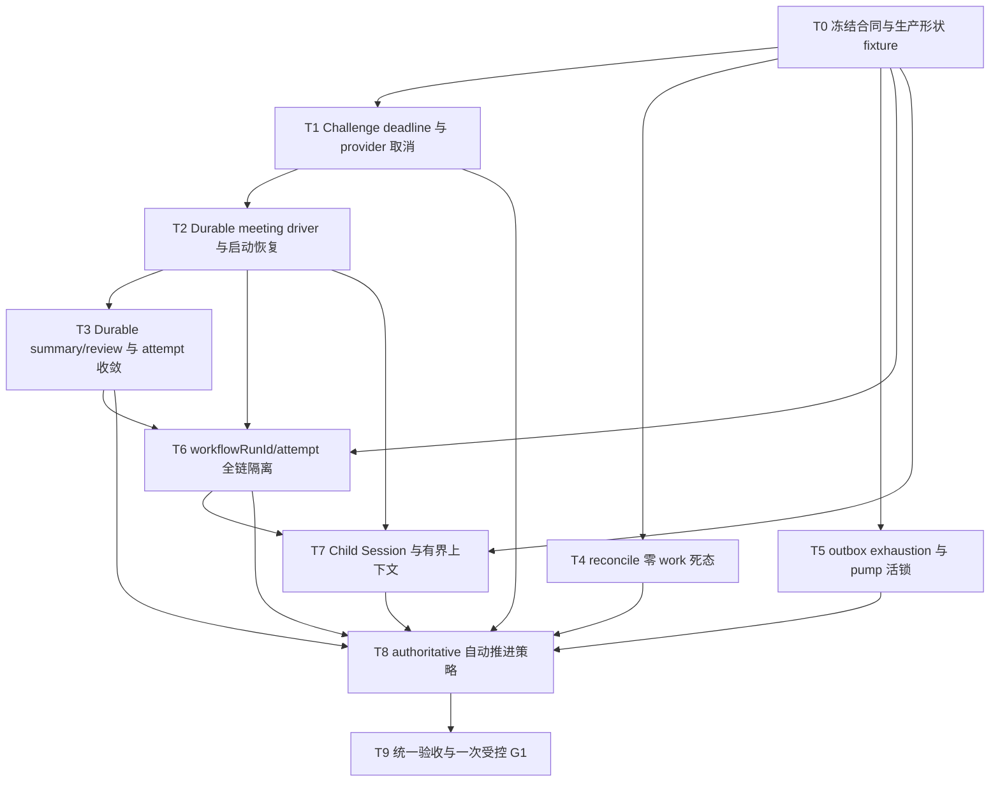

# 挑战杯自动运行链路可靠性完整修复方案

> 文档 ID：`CC-AUTOMATIC-CHAIN-RELIABILITY-20260830`
>
> 状态：`USER-REQUESTED / ACTIVE PLAN / IMPLEMENTATION NOT STARTED`
>
> 代码审查基线：本地 `main@927ca48586492fc351d307dc160acb0dfbe8d6d3`；实施前必须重新读取最新 main、active claim 与运行指纹
>
> 适用范围：挑战杯假说生成、群聊评审、摘要、LangGraph/Workflow Ledger 调度、恢复与自动推进
>
> 非完成声明：本文是修复合同，不是代码完成、DEV 通过、生产 G1 或正式研究结果证据

## 1. 结论

本轮不改造普通对话链路。推荐路径是：继续复用原生 Session/Agent/LLM 执行链，在挑战杯 `team_workflow/research_runtime` 内补一层 **Challenge-only durable meeting driver**，把群聊续轮、摘要、评审调用、deadline、父 run 停止和恢复都变成服务端持久化状态机；LangGraph、Workflow Ledger/outbox、MeetingRound 与既有 challenge receipt registry 继续作为事实源，不引入第二个 workflow engine、第二套 transcript 或第二套 receipt 账本。

修复优先级固定为：

1. 先消除无 deadline、无 owner 的 `running`、`summarizing` 永久悬挂和失败 outbox 活锁；
2. 再闭合重启恢复、跨 run 隔离和上下文污染；
3. 最后才把 shadow/preview 自动策略升级为 authoritative 自动推进。

“链路稳定可推进”和“零人工运行”是两项不同验收。前者完成前不得开启自动批准；后者未完成时不得宣称 zero-click。

## 2. 已确认问题与判定

| 优先级 | 问题 | 当前影响 | 修复判定 |
| --- | --- | --- | --- |
| P1 | preformal Challenge 会议未进入 challenge deadline | 群聊可运行 20 分钟以上，续轮仍无 `challengeDeadlineAtMs` | preformal 与 formal 一律使用服务端会议 deadline |
| P1 | 会议续轮依赖进程内 executor/job set | 重启后无 durable owner；新 room round 可能先运行、后绑定 MeetingRound | 新 round 必须先持久绑定再派发；启动 sweep 可恢复 |
| P1 | `summarizing` 无 durable invocation intent | 进程退出、timeout 或 hook 异常后永久悬挂，generation attempt 仍显示 running | 摘要/评审调用改为租约化 durable work |
| P1 | reconcile 在 `revived=0` 时仍可写 `RUNNING` | 出现 `running + zero active outbox`，不会自动推进 | 无可恢复 work 时落精确 `blocked/reconciliation_required` |
| P1 | review LLM 独立 600 秒 daemon timeout | provider 超时后继续消耗连接、Token 和费用，重试可叠加孤儿调用 | 使用共享取消链和剩余绝对 deadline，禁止 daemon orphan |
| P1 | 会议/候选/selection 的 run authority 曾不完整 | 新 run 可能读旧 meeting/candidate/receipt authority | 所有读写以 server-owned `workflowRunId + attemptId` fencing |
| P1 | 停止/失败会议仍可能被 heal、promote 或 reuse | 旧部分消息可污染新 attempt，旧 receipt authority 可阻塞新 run | stopped/failed/legacy meeting 只读审计，不参与新执行 |
| P1 | 父 run `blocked/cancelled` 后子会议仍可继续 | 后台 speaker/续轮继续调用模型，active-work 不释放 | speaker、续轮、summary 前重读父 run execution-active 状态 |
| P2 | lease attempt exhausted 可被 repair sweep 重新复活 | 可能形成 failed↔pending tight loop | exhaustion 必须终态化；显式人工 reconcile 才可审计重置 |
| P2 | preformal 长期 direct Session 累积整轮 transcript | 跨题历史膨胀、缓存前缀不稳定、模型每次读取大量旧对话 | 改用 meeting/attempt-scoped Child Session 或等价有界投影 |
| P2 | 自动策略仍为 preview/shadow | 修好 bug 后仍会停在候选选择、digest 批准等人工门 | 稳定性闭合后单独启用 authoritative policy |

已有修复必须保留：正式会议的持久 deadline、外层/会议 deadline 取最早值、晚到结果隔离、stopped meeting 终态、receipt durability、provider cancellation、Ledger 调用前预算预检和 workflowRunId 已覆盖部分读写面。实施者必须在最新 main 上逐项复核，已闭合项只补缺失的生产形状回归，不重复重写。

## 3. 保护边界

### 3.1 必须保持不变

- 普通 Session 的 admission、turn journal、worker、persist、projection 与 SSE 仍是普通会话唯一权威；
- Challenge receipt、预算累计、延迟与 reasoning Token 留在 challenge registry/Ledger 或只读投影，不写入模型可见 transcript；
- Prompt Cache 保持 `disabled`，能力门未证明 provider 返回缓存字段前不得启用；缓存 miss/unsupported/无遥测永远不能阻止状态转移；
- AgentDirectory、Team、operator config、模型绑定和真实运行数据不属于本计划代码修复的默认写入面；
- 不引入 Temporal、AutoGen、Dify、n8n 等新运行时依赖。

### 3.2 允许扩展

- 在 `core/web/services/team_workflow` 与 `research_runtime` 新增 challenge-scoped driver、intent/outbox、恢复扫描和 read model；
- 在既有 LLM 取消接口上传递 Challenge 绝对 deadline；通用调用在未携带 Challenge scope 时行为零差异；
- 使用原生 Child Session 执行单个 meeting/attempt，但不得让其成为第二套业务状态机或永久共享 transcript。

## 4. 推荐架构

### 4.1 事实源分层

| 事实 | 唯一权威 | 禁止做法 |
| --- | --- | --- |
| workflow run/node/attempt/outbox | Workflow Ledger + LangGraph checkpoint | 从 UI、Session status 或 projection 反推业务状态 |
| meeting 定义、deadline、绑定 rounds、终态 | MeetingRound append-only records | 以内存 job set 作为唯一 owner |
| room/speaker 对话结果 | 原生 chat-room/Child Session transcript | 在 Ledger 或 receipt store 复制整段 transcript |
| digest/review 调用意图与租约 | Challenge meeting work/outbox | 只用 daemon thread 和进程内锁 |
| 模型调用 receipt | 既有 challenge receipt registry/Ledger | 把完整 receipt/excerpt 写回 turn journal |
| 预算/延迟/reasoning/cache | 调用 receipt 的诊断投影 | 让投影写入失败阻止 graph/meeting 状态推进 |
| 自动决策 | durable policy decision record | 由模型自由文本或前端按钮状态决定推进 |

### 4.2 对成熟项目的借鉴

- **LangGraph**：继续使用 checkpoint、thread/run identity、显式 conditional edge 和 recursion/iteration guard；所有恢复必须从 durable state 重新路由，不从内存 continuation 猜测。
- **Temporal**：只借 activity 的 durable intent、lease、heartbeat、绝对 timer、幂等 key 和 retry exhaustion 语义；不引入 Temporal 依赖。
- **PydanticAI/结构化 Agent**：模型输出只进入严格 schema，状态转移由服务端 validator 决定；不把模型自然语言当控制平面。
- **AutoGen/Swarm supervisor**：借“每次 handoff 前检查共享停止条件”和明确终止信号；不新建第二套多 Agent runtime。
- **Dify/Flowise/n8n**：只借用户可见的阶段/问题/恢复动作投影；它们不成为后端状态权威。

## 5. 状态转移合同

### 5.1 WorkflowRun 执行活性

业务终态集合保持 `succeeded/failed/cancelled/archived`。会议执行另定义 execution-inactive 集合：

```text
blocked | succeeded | failed | cancelled | archived
```

`blocked` 不是不可恢复的最终业务终态，但在显式恢复前必须停止所有新 speaker、续轮、summary 和 review provider 调用。恢复命令必须重新读取 run authority，再创建新的 durable work，不能让旧内存任务自行复活。

### 5.2 Meeting execution

MeetingRound 的展示 `status=open/closed` 与执行 `executionStatus` 分离：

```text
queued
  -> running
  -> summarizing
  -> awaiting_approval
  -> completed

queued|running|summarizing
  -> stopped    (deadline / parent inactive / operator stop)
  -> failed     (non-retryable / retry exhausted / corrupt authority)

stopped|failed|completed
  -> immutable historical evidence
```

强制不变量：

- meeting 创建时由服务端写 `meetingAttemptId`、`workflowRunId`、`challengeDeadlineAtMs`；
- room round 必须先追加到 `chatRoomRoundIds`，再允许 worker claim；
- 每个 speaker、follow-up round、summary/review 调用前重读 meeting 和 parent run；
- deadline/parent inactive 已成立时，不得写入晚到 `completed` 消息，只写 `stopped/cancelled` 审计证据；
- `stopped/failed` meeting 不得 heal、promote、reuse、作为 review authority 或阻止新 attempt；
- hook 异常必须形成 durable problem/retry intent，禁止 `except: pass` 吞掉。

### 5.3 Generation attempt

```text
queued -> running -> completed(succeeded|empty)
                  -> awaiting_approval
queued|running -> stopped|failed
stopped|failed -> superseded by attempt N+1
```

generation attempt 必须跟随绑定 meeting 的终态收敛。旧 meeting 存在不再等价于“无需生成”：只有当前 `workflowRunId + attemptId` 下存在 active durable work 或已产生足够 canonical candidates 才返回 false。

### 5.4 Durable work/outbox

每个执行动作至少持久化：

```text
workId, workflowRunId, meetingRoundId, meetingAttemptId,
actionKind, sequence, idempotencyKey, status,
leaseOwner, leaseExpiresAtMs, heartbeatAtMs,
attemptCount, availableAtMs, absoluteDeadlineAtMs,
sourceHash, lastProblem, createdAtMs, updatedAtMs
```

推荐 actionKind：`start_round`、`invoke_speaker`、`draft_digest`、`run_review_step`、`finalize_meeting`。幂等 key 至少包含 `workflowRunId/meetingAttemptId/actionKind/sequence/sourceHash`。

worker 顺序固定为：claim lease → 重读 authority/deadline → 执行一次副作用 → 先持久化结果/receipt → CAS 完成 work → 派发唯一后继。CAS false 时不得产生 reconciliation 或领域写回。

## 6. Deadline 与取消合同

1. node/task deadline 继续服从显式任务合同；不在本轮把所有研究节点强行改为统一时长。
2. 每个 Challenge meeting 在服务端创建时获得独立 `300000ms` 绝对 deadline。
3. preformal 与 formal meeting 都受该 deadline；不能用是否存在正式 receipt authority 判断是否属于 Challenge。
4. 同一 meeting 的 speaker、follow-up round、重试和 summary 共享同一 deadline，不得重置。
5. 不同下游 meeting 使用自己的新 300 秒窗口，不继承 workflow run 创建时间。
6. 外层 Challenge task deadline 与 meeting deadline 取所有正值的最早值。
7. 每次 provider 请求使用 `remaining_ms`；`remaining_ms<=0` 时禁止发起请求。
8. deadline 到达后调用既有 active-request abort；取消分类为非重试 `cancelled/deadline_exceeded`，不得走普通 provider retry。
9. 无法确认 transport 已停止时，meeting 仍立即终态化并 fencing 晚到结果；同一 idempotency key 不得自动再发一次。

用户可见时间目标：首次进度 `<=5s`，最大静默 `<=30s`，一个 meeting 的硬上限 `<=300s`。G1 只验证单样本时间线；p50/p95 在 G5/G12 后按节点、provider、角色分桶计算，空桶不得写 0。

## 7. 上下文、缓存、receipt 与预算边界

### 7.1 Challenge-only 上下文

preformal meeting 改用 `meeting/attempt-scoped Child Session` 或同等的 Challenge adapter projection。每次调用只装配：

- 当前题目与 workflow/run/attempt authority；
- 当前 meeting agenda、候选正文与证据 locator；
- 已确认的上一轮有界摘要；
- 本 meeting 最近有界消息；
- 未解决 tool call/result 对；
- stop/deadline 和输出 schema。

禁止把长期 direct Session 的跨题 transcript 整体注入。Child Session 仍走原生 Session/Journal/SSE，不改普通会话核心；meeting 业务状态只保存在 Challenge owning surface。压缩 checkpoint 必须记录 source hash，并保证重启后相同输入得到相同上下文包。

### 7.2 Prompt Cache

保持 disabled。未来启用前必须证明 provider 回报 cache 字段、partition 含 project/run/meeting scope、miss/unsupported 自动退回普通调用且结果等价。Cache 永远不是推进或恢复前置条件。

### 7.3 Receipt 与预算

- 复用既有 durable challenge receipt registry/Ledger；不把完整 receipt 写入 turn journal；
- receipt 持久化失败走既有 restart-safe replay，不能重跑已成功 LLM；
- 每次调用前用 Ledger 权威预算做 preflight，必要时 clamp `max_output_tokens`；
- Token/reasoning/latency/cache 仅作非阻塞投影；投影失败不得覆盖 meeting/run 终态；
- continuation 跨 turn/round 的累计预算不得重置。

## 8. TASK_GRAPH



关键路径：`T0 → T1 → T2 → T3 → T6 → T7 → T8 → T9`。T1/T4/T5 可以并行；T6 可先做独立读写面，但必须与 T2/T3 做一次集成验收；T8 之前必须完成 T1–T7。

### Task T0：冻结合同与生产形状 fixture

- **Owner/Boundary**：contract/tests；不改运行数据。
- **Dependency**：最新 main、active claim 和已通过的 52 个相关测试结果；相同 HEAD 不重复跑。
- **Mode**：BDD_TDD。
- **产出**：本文状态机、problem code、deadline、authority、late-result fencing 的失败 fixture；固化 SCI-002/003/004/091 的脱敏生产形状。
- **Verification/Stop**：旧测试若锁定错误语义，先改断言；发现新产品分歧或 active writer 重叠即停止该文件面。

### Task T1：统一 Challenge meeting deadline 与 provider cancellation

- **Owner/Boundary**：`chat_room_service.py`、`meeting_receipt_authority.py`、`meeting_rounds.py`、`llm_review_runners.py`、既有 LLM cancel bridge；普通 chat 无 Challenge scope 时零差异。
- **Dependency**：T0。
- **Mode**：BDD_TDD。
- **产出**：preformal/formal 都有服务端 300 秒 meeting clock；外层/meeting 取 min；review/digest 不再使用孤儿 daemon timeout。
- **Verification/Stop**：provider abort、canonical cancelled、无晚到 completed、无重复调用；若某 provider transport 不可取消，必须 fail closed 并记录精确残余风险。

### Task T2：Durable meeting driver、先绑定后执行与 startup recovery

- **Owner/Boundary**：`meeting_runtime.py`、`meeting_rounds.py`、chat round completion hook、新的 challenge meeting work/outbox pack；不使用 Session Journal 作为 work queue。
- **Dependency**：T1 的 deadline/stop reason 合同。
- **Mode**：BDD_TDD。
- **产出**：租约化 driver；round 先绑定后执行；启动 sweep 恢复 `open + terminal bound round`、无 owner running、过期 deadline；hook 失败持久化。
- **Verification/Stop**：在任意 speaker 前后、round 绑定前后和 process restart 点故障注入，均能 exactly-once 恢复或终态化。

### Task T3：Durable summarizing/review 与 generation lifecycle

- **Owner/Boundary**：digest/review invocation intent、`meeting_runtime.py`、`llm_review_runners.py`、`hypothesis_first_chain.py` generation attempt；不建立新 receipt store。
- **Dependency**：T2 的 durable driver/outbox。
- **Mode**：BDD_TDD。
- **产出**：summary/review 租约、sourceHash、deadline、幂等结果；`summarizing` 重启可恢复；timeout/retry exhausted 能收敛；generation attempt 跟随 meeting。
- **Verification/Stop**：一次 registry/intent 写失败可重启恢复且不重跑 LLM；enqueue 自身失败立即 fail closed，不伪装 pending 5 分钟。

### Task T4：修复 reconcile zero-work 死态

- **Owner/Boundary**：`research_runtime/command_service.py`、`reconcile_authority.py` 和查询投影。
- **Dependency**：T0；可与 T1/T5 并行。
- **Mode**：BDD_TDD。
- **产出**：`revived=0` 且无 active attempt/outbox 时落 `blocked/reconciliation_required`；只有确实复活 work 才 wake worker。
- **Verification/Stop**：生产形状 fixture 不再出现 `running + zero active outbox`；重复 reconcile 幂等。

### Task T5：attempt gate、repair sweep 与 pump 活锁

- **Owner/Boundary**：Ledger outbox repository、`graph_dispatch_worker.py`、`adapter_dispatch_worker.py`、`outbox_pump.py`；不修改业务研究方法。
- **Dependency**：T0；可与 T1/T4 并行。
- **Mode**：BDD_TDD。
- **产出**：`lease_attempt_exhausted` 不被自动 sweep 复活；人工 reconcile 若重置 attempts，在同一事务记录 actor/reason/previous count；pump 对同一 action 每轮最多处理一次。
- **Verification/Stop**：时间推进 fixture 证明没有 failed↔pending tight loop、CPU busy loop或无界事件增长。

### Task T6：workflowRunId/attempt authority 全链隔离

- **Owner/Boundary**：MeetingRound、generation attempt、candidate、selection、review link/read model、state V2；legacy 只读兼容。
- **Dependency**：T0；最终集成依赖 T2/T3。
- **Mode**：BDD_TDD。
- **产出**：所有读取和写入携带 server-owned `workflowRunId + attemptId/resetId/selectionId`；stopped/failed/old-authority meeting 不参与 heal/reuse/promote。
- **Verification/Stop**：旧 workflow run 有两个完成消息也不能污染新 run；新 authority 必须创建全新 attempt，不被旧 receipt 阻塞。

### Task T7：Challenge-only Child Session 与上下文隔离

- **Owner/Boundary**：meeting/session adapter、`real_domain_ports.py` 或等价 Challenge port、context builder；不得修改普通 Session admission/journal/SSE 语义。
- **Dependency**：T2、T6。
- **Mode**：BDD_TDD。
- **产出**：meeting/attempt-scoped Child Session；有界 context packet；跨题隔离；checkpoint/sourceHash；长期 direct Session 不再写入整轮 transcript。
- **Verification/Stop**：普通聊天、普通 Agent、Companion 全部零差异；Challenge 上下文长度、缓存 partition、tool-call 配对和重启结果稳定。

### Task T8：Authoritative AutoAdvancePolicy

- **Owner/Boundary**：现有 `automation_policy_service.py`、policy shadow evaluator、canonical command；不让 UI 或模型直接改状态。
- **Dependency**：T1–T7 全绿。
- **Mode**：BDD_TDD。
- **产出**：shadow → drain/checkpoint → authoritative 的受控升级；每次自动选择/批准有 policy hash、decision actor、hard gates、reason、rollback；高风险和异常项继续入人工队列。
- **Verification/Stop**：任何 hard gate 缺失、policy hash 漂移、未知 problem 或 budget/deadline 不足都 fail closed；系统决定不得伪装 `human_approved`。

### Task T9：统一 closeout 与一次受控 G1

- **Owner/Boundary**：最终集成、运行刷新和验收；运行操作必须串行。
- **Dependency**：T1–T8 合入最新 clean main，所有 active-work/claim guard 清空；真实模型、Launcher 和 G1 另有明确授权。
- **Mode**：targeted selector + runtime acceptance。
- **产出**：最新 main 自审、selector/manifest、一次 Launcher refresh、一次受控 G1；不并发 DEV/第二 G1。
- **Verification/Stop**：任一 P1、stale runtime、非授权模型、active work、receipt/预算/authority 不一致时停止，不用重试掩盖。

## 9. 预计文件影响面

| 责任面 | 主要文件 | 约束 |
| --- | --- | --- |
| meeting deadline/stop | `core/web/services/chat_room_service.py`、`team_workflow/meeting_rounds.py`、`research_runtime/meeting_receipt_authority.py` | ordinary room 零差异 |
| durable meeting/summary | `team_workflow/meeting_runtime.py`、`llm_review_runners.py`、新增 meeting work/outbox pack | 不写 turn journal，不复制 receipt |
| generation/read model | `research_runtime/hypothesis_first_chain.py`、`hypothesis_first_state_v2.py` | run/attempt fencing，legacy 只读 |
| Ledger reconcile/outbox | `research_runtime/command_service.py`、`reconcile_authority.py`、`graph_dispatch_worker.py`、`adapter_dispatch_worker.py`、`outbox_pump.py`、`core/research/workflow/ledger/*` | 单一 writer；显式 attempt reset 审计 |
| context/session adapter | `research_runtime/real_domain_ports.py`、Challenge context builder、Child Session 创建入口 | 普通 Session 核心不改 |
| automation | `research_runtime/automation_policy_service.py`、`policy_shadow_evaluator.py`、canonical command/projector | T1–T7 之前不 authoritative |
| tests | chat room、meeting runtime/rounds/summary、hypothesis chain/state V2、Ledger attempt gate、session isolation | 使用 production-shaped fixtures |

热文件 `chat_room_service.py`、`meeting_runtime.py`、`hypothesis_first_chain.py` 和 Ledger workers 默认只保留一个 writer。并行任务若触及同一事实源或测试 fixture，必须串行集成。

## 10. 兼容、迁移与回滚

### 10.1 发布顺序

1. 后端先支持新 meeting work/authority 字段，旧 reader 保持只读兼容；
2. startup sweep 只投影和修复可证明有唯一 owner 的 active meeting；不自动重写历史 stopped/failed meeting；
3. 新 meeting 全量使用新 driver；旧 active meeting 仅在 authority、deadline 和 idempotency 完整时接管，否则终态化并提示新建 attempt；
4. 状态稳定后启用 authoritative automation；
5. 最后删除内存 executor 作为唯一调度依据的旧分支。

### 10.2 数据迁移

- append-only 新字段，不批量覆盖旧记录；
- legacy meeting 标记 `legacy_read_only`，不得补猜 `workflowRunId/attemptId`；
- 历史 `summarizing/running` 先 preview：可恢复、需终态化、需人工裁决三类；
- apply 必须在 Launcher 停止且无 live writer 时，带 source hash、preview generation 和 rollback manifest；
- 第二次 apply 必须 no-op。

### 10.3 回滚

- 代码回滚使用新修复 commit 或可审计 revert，不使用 `git reset --hard`；
- 新 records 对旧 reader 可忽略；旧 records 对新 reader仍可展示但不可执行；
- automation 可立即回到 shadow，不回滚 durable meeting/receipt 事实；
- Prompt Cache 保持 disabled，无需参与回滚；
- 运行刷新只通过 Launcher，不能绕过 active-work guard。

## 11. 验证矩阵

| 场景 | 必须证明 |
| --- | --- |
| preformal/formal deadline | 均有服务端 300 秒 clock；外层更早时取外层；续轮不重置；新 meeting 获得新窗口 |
| provider abort | deadline 到达关闭实际 request，canonical cancelled，取消不 retry，无晚到 completed/副作用 |
| round durability | 新 round 先绑定；进程在绑定前后、speaker 前后重启均可恢复 |
| parent inactive | run 变 blocked/cancelled 后不再调用下一 speaker、不再开续轮/summary，active work 释放 |
| summarizing | registry/intent 一次失败后重启 exactly-once 恢复，不重复 LLM；enqueue 失败即时 fail closed |
| generation lifecycle | meeting stopped/failed 后 attempt 收敛；新 run 可新建 attempt；历史 meeting 不屏蔽 generation |
| reconcile | `revived=0` 不写 running；有 work 才 wake；重复命令幂等 |
| attempt gate | exhaustion 不自动复活；人工 reset 有审计；pump 不 tight loop |
| run isolation | 新 run 不读旧 meeting/candidate/selection/receipt；late completion 只留审计 |
| context | 跨题零泄漏；bounded packet；checkpoint/sourceHash 稳定；未解决 tool call/result 成对 |
| core isolation | 新 turn journal 无完整 receipt/Challenge 状态；普通 chat/Session/Companion 零差异 |
| active-work | meeting driver、summary、review provider 均被 guard 看见，终态后释放 |
| automation | hard gate 和 policy hash 完整才自动推进；异常进入人工队列；系统决定不伪装人工批准 |

同一 HEAD、命令和 fixture 未变时复用已通过测试；最终 closeout 才运行项目 selector/manifest，不在多个任务机械重复全量测试。

## 12. 生产验收顺序

```text
最新 clean main + 所有修复已合入
-> active claim/work/runtime guard 清空
-> 当前 DEV readiness 通过
-> durable catalog authorization 重新绑定当前 policy/readiness hash
-> Launcher 单次刷新并核对 backend/frontend SHA
-> production-shaped DEV：deadline/restart/reconcile/isolation
-> 仅一次受控 G1
-> 保存 run/meeting/work/receipt/budget/terminal 脱敏时间线
-> 人工复核后决定是否进入 G5
```

G1 必须证明：模型路由符合本次正式授权；meeting 300 秒 deadline 和 provider abort 生效；父 run 停止可传播；无重复 LLM；receipt 可重放且不重跑；Ledger 预算不被最终 estimate 覆盖；writeback/terminal/active-work exactly-once；无并发 DEV 或第二 G1。单次 G1 不能计算 p50/p95，也不能直接授权 G125。

## 13. 停止条件与完成定义

出现以下任一项立即停止集成或生产验收：

- `running/summarizing` 没有 active lease/outbox 或可解释的人工门；
- deadline 后仍有新 provider 调用、晚到 completed 或后继派发；
- parent blocked/cancelled 后仍启动 speaker/round/summary；
- failed/exhausted action 被自动 repair sweep 反复复活；
- 新 run 读取旧 authority，或 legacy meeting 被 heal/promote/reuse；
- receipt、预算或诊断投影失败改变业务终态；
- Challenge 字段或完整 receipt 进入普通 turn journal；
- ordinary chat/Session/Companion 回归；
- Launcher active-work guard、模型授权或 runtime SHA 不满足。

只有 T1–T7 通过，才能说“链路稳定可推进”；只有 T8 通过，才能说“正常路径可零人工推进”；只有 T9 的受控 G1 通过，才能说“生产形状闭环已验证”。任何计划、fixture、mock 或单元测试都不能替代真实运行证据。

下一步建议：按 `T0 → {T1,T4,T5} → T2 → T3 → T6 → T7` 开始实现，T8/T9 保持后置闸门。
