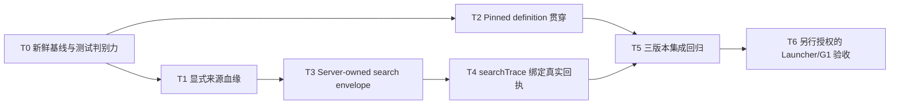

# 挑战杯 1–7 节点链路高 ROI 修复方案

> 文档 ID：`CC-NODES-1-7-HIGH-ROI-REPAIR-20260831`
>
> 状态：`USER-REQUESTED / ACTIVE PLAN / IMPLEMENTATION NOT STARTED`
>
> 证据复核基线：本地 `main@9207d3df4d65a6d0b39ba00ee7d411daf493b22c`，复核时间 `2026-08-31 +08:00`
>
> 适用范围：挑战杯 2.1.0 的节点 1–7，以及 3.0.0 中由主流程 `problem_understanding`、知识搜集 sideflow、主流程 `hypothesis_design` 共同构成的等价链路
>
> 非完成声明：本文是实施合同，不是代码完成、测试通过、Launcher 真实运行、G1 放行、模型调用回执或正式研究结果证据

## 1. 结论

当前 1–7 节点链路存在四个高 ROI 缺口，值得优先修复：

1. **P0：来源血缘按数组位置拼接。** 无效、重复或物化失败的 lead 会让后续 `recordId/candidateId` 与错误来源绑定，污染节点 2 产物并向节点 3–7 传播。
2. **P0：运行时已 pin 的 workflow definition 没有贯穿下游。** 3.0.0 run 的 artifact、handoff、reconcile 仍可能按 2.1.0 默认定义解释，造成错误前驱、错误 successor 和错误 artifact kind。
3. **P1：检索事务预算与质量合同互相冲突。** 默认仅允许 `1 × 5`，Prompt 却要求滚动多批写回并覆盖四类研究视角；现有 gate 只要求两个 perspective，无法证明节点 2 已完成有边界的研究搜集。
4. **P1：`searchTrace.resultRefs` 是 Agent 自报值，没有绑定真实检索回执。** 这使“查过什么、为何没找到、来源是否真的来自工具调用”无法审计。

推荐的最小架构不是新增工作流引擎或日志系统，而是：

- 用服务端生成的显式 `leadId/fingerprint → recordId → candidateId` 血缘替代位置配对；
- 所有下游解释都只使用 run-scoped pinned definition；
- 把总来源预算、单批事务大小、最大批次数和停止条件拆开；
- 从现有 tool event / provider receipt 投影 `searchTrace`，不建立第二套 receipt store。

完成代码与测试只代表 DEV 链路闭合。真实 Launcher/G1 验收必须另行授权，并继续受 `CatalogRunAuthorization`、正式模型回执与人工门约束。

## 2. 节点范围与版本映射

### 2.1 2.1.0 的 1–7 节点

| 序号 | `nodeId` | 中文节点 | 关键产物 |
| --- | --- | --- | --- |
| 1 | `problem_understanding` | 问题理解 | `problem_understanding` |
| 2 | `source_finding` | 资料寻找 | `source_candidate_batch` |
| 3 | `source_extraction` | 资料提炼 | `evidence_card_batch` |
| 4 | `evidence_relations` | 证据关系 | `evidence_relation_graph` |
| 5 | `knowledge_ingestion` | 知识入库 | `knowledge_package_draft` |
| 6 | `knowledge_handoff` | 知识包交接 | `knowledge_package` |
| 7 | `hypothesis_design` | 假设设计 | `hypothesis_set` |

### 2.2 3.0.0 的等价链路

3.0.0 把节点 2–6 移到 `challenge-cup-knowledge-sideflow@1.0.0`；主流程只保留节点 1 与节点 7 的直接拓扑。审查和验收必须按以下跨定义链路进行，不能把 3.0.0 误当成“没有知识搜集”：

```text
main 3.0.0: problem_understanding
       ↓ 绑定同一 question/run 的知识搜集权限与输入
knowledge sideflow 1.0.0:
source_finding → source_extraction → evidence_relations
→ knowledge_ingestion → knowledge_handoff
       ↓ 受治理的 knowledge_package / handoff
main 3.0.0: hypothesis_design
```

因此所有修复必须同时验证三种身份：

- 2.1.0 主流程；
- 3.0.0 主流程；
- 3.0.0 对应的 knowledge sideflow 1.0.0。

## 3. 当前证据与根因

| 问题 | 根因证据 | 影响 | ROI 判断 |
| --- | --- | --- | --- |
| 来源错绑 | `research_runtime/agent_task_artifact_builder.py::_source_finding_payload` 以相同 index 读取 `candidateLeads[]`、`createdRecords[]`、`importedCandidates[]`；物化阶段会因无 locator、重复、record 创建失败、candidate 导入失败而跳项 | 错误 `sourceId/recordId/candidateId` 进入 `source_candidate_batch`，后续提炼、证据关系、知识包和假说均可能引用错误来源 | **P0**；改动集中、能直接阻止证据污染 |
| 定义漂移 | `_source_artifact_ids`、`handoff_builder`、`external_agent_task_reconciliation` 直接调用默认 `build_challenge_cup_workflow_definition()`；run 本身已有 `workflowVersionId/structureHash` | 3.0.0 的 `hypothesis_design` 可能读取 2.1.0 的 `knowledge_package` 要求；successor/edge 也可能按错误版本解释 | **P0**；已有 definition registry 可复用，避免扩大架构 |
| 预算/质量冲突 | `stage_writeback_prompt_contracts.py` 默认 `max_batches=1, max_leads=5`，同时要求“多次小批滚动写回”和四类视角；`artifact_quality_gate.py` 只要求两个 perspective、query 和 candidate | Agent 无法同时满足事务约束和研究质量；通过 gate 也不代表四类视角已闭合 | **P1**；能减少无效重试与低质量通过 |
| trace 无真实回执 | Prompt 要求真实 `resultRefs[]`，artifact builder 却复制 task result 内的 `searchTrace`；gate 未核对现有 tool/provider event | 支持来源或 `no_credible_source` 都可能无法追溯到真实调用 | **P1**；复用已有事件即可闭合审计，不需要新账本 |
| 更宽测试基线不绿 | 本轮审查的聚焦合同测试为 `151 passed`；更宽测试发现 14 个失败，其中 12 个是旧 Team `workflowDefaults` fixture 未适配 Team member/AgentDirectory SSOT，2 个 hypothesis-first E2E 仍假设 meeting 停留在 `open`，未适配后台推进到 `awaiting_approval` | 会掩盖后续真实回归，但不等于当前产品运行失败 | **P2**；先恢复测试判别力，不借机改产品语义 |

### 3.1 已确认的最小复现

- `candidateLeads[0]` 无有效 locator、`candidateLeads[1]` 有效时，物化结果只包含第二条来源；当前位置配对会把第二条的 `record-good/candidate-good` 填到第一条 lead。
- 3.0.0 run 的 `hypothesis_design` 若走默认 2.1.0 definition，可能误读 `knowledge_package` 依赖；`problem_understanding` 的 successor 也会被解释成 `source_finding`，而不是 3.0.0 的 `hypothesis_design`。
- 单批 5 条无法稳定表达四类视角、重复剔除和负面检索结果；把 batch 数继续设为 1 又与“滚动写回”相冲突。
- Agent 可以自报任意 URL 到 `resultRefs[]`；当前 artifact quality gate 没有证明 URL、query、provider call 与真实 tool event 相互对应。

### 3.2 不应误判为根因的现象

- 旧 fixture 失败不是 workflow runtime 本身失败，修复时只更新已经过时的 Team/meeting 预期。
- 3.0.0 节点数减少不是资料搜集能力被删除；知识搜集已迁到 sideflow。
- DEV fixture、计划文本和通过的单元测试都不等于真实检索、真实研究或 G1。

## 4. 外部项目调研与采用边界

外部项目均为 `REFERENCE_ONLY`。固定提交用于保证后续复核时看到相同材料；只借鉴合同，不引入其 runtime、存储或 agent 框架。

| 项目与固定提交 | 可借鉴点 | 本项目采用方式 | 明确不采用 |
| --- | --- | --- | --- |
| [LangGraph@11ee185](https://github.com/langchain-ai/langgraph/tree/11ee185999b86bfea2d8c0e69cef9a5e37acf686)；[checkpoint base](https://github.com/langchain-ai/langgraph/blob/11ee185999b86bfea2d8c0e69cef9a5e37acf686/libs/checkpoint/langgraph/checkpoint/base/__init__.py) | `thread_id` 是 checkpoint 主身份，`checkpoint_id` 精确定位恢复点；状态解释必须绑定同一持久身份 | 把 `(workflowId, workflowVersionId, structureHash)` 作为 run 的 pinned definition 身份，并在 artifact/handoff/reconcile 中显式传递 | 不新增 LangGraph checkpoint store，不让 LangGraph 成为第二个 Workflow Ledger |
| [GPT Researcher@6f99857](https://github.com/assafelovic/gpt-researcher/tree/6f998577d547b1e54ec662dac63583aa11e3b84b)；[deep_research.py](https://github.com/assafelovic/gpt-researcher/blob/6f998577d547b1e54ec662dac63583aa11e3b84b/gpt_researcher/skills/deep_research.py)、[researcher.py](https://github.com/assafelovic/gpt-researcher/blob/6f998577d547b1e54ec662dac63583aa11e3b84b/gpt_researcher/skills/researcher.py) | 先生成 research plan/subquery，再追踪 research sources；跨子主题保留 `visited_urls`，避免重复抓取 | 四类 perspective 先成为 server-owned search envelope；用规范化 DOI/URL fingerprint 去重，并保留 query→result refs 血缘 | 不复制整套 researcher agent，不把网页抓取结果直接当正式 evidence card |
| [RD-Agent@6762f84](https://github.com/microsoft/RD-Agent/tree/6762f84f9bc0f5c6486c50a00e128a57ac6c3683)；[evolving_framework.py](https://github.com/microsoft/RD-Agent/blob/6762f84f9bc0f5c6486c50a00e128a57ac6c3683/rdagent/core/evolving_framework.py) | `evolving_trace` 将历史方案与 feedback 按步骤保留，下一轮基于同一 trace 改进 | 检索批次不覆盖旧 trace；每批追加可验证的 query、receipt refs、结果与停止原因 | 不新增独立进化 Agent，不让 trace 成为第二套 transcript |
| [AI Scientist v2@96bd516](https://github.com/SakanaAI/AI-Scientist-v2/tree/96bd51617cfdbb494a9fc283af00fe090edfae48)；[journal.py](https://github.com/SakanaAI/AI-Scientist-v2/blob/96bd51617cfdbb494a9fc283af00fe090edfae48/ai_scientist/treesearch/journal.py)、[perform_experiments_bfts_with_agentmanager.py](https://github.com/SakanaAI/AI-Scientist-v2/blob/96bd51617cfdbb494a9fc283af00fe090edfae48/ai_scientist/treesearch/perform_experiments_bfts_with_agentmanager.py) | Journal 节点保留父子、执行结果、反馈与指标；阶段有 `max_iterations`，并持续保存当前进度 | search envelope 记录每批次状态、终止原因和最终 readiness；只有合同满足才交给节点 3 | 不引入树搜索，不用“最佳节点”替代挑战杯的人类 gate 或正式授权 |

外部对照后的共同结论是：**身份、血缘、预算与停止条件应由服务端持有；Agent 负责生成候选，不负责自证其运行事实。**

## 5. 目标合同

### 5.1 来源血缘合同

在现有 `materializedSources` 中增加服务端生成的逐 lead 结果，例如：

```json
{
  "lineage": [
    {
      "leadId": "lead-...",
      "fingerprint": "doi:...",
      "status": "imported",
      "recordId": "record-...",
      "candidateId": "candidate-..."
    }
  ]
}
```

状态至少覆盖：`imported`、`duplicate_reused`、`invalid_locator`、`record_create_failed`、`candidate_import_failed`。具体名称实施时可沿用现有 materialization reason，禁止另建同义状态体系。

不变量：

- artifact builder 只按 `leadId` 或 canonical fingerprint 关联，不按数组位置关联；
- `recordId` 与 `candidateId` 必须来自同一条物化结果；
- 同 locator/DOI 重放返回已有身份或明确 duplicate 状态，不产生错绑；
- 失败 lead 可出现在诊断摘要中，但不能借用相邻 lead 的身份；
- `sourceId` 只能是真实 `candidateId`，或同 lineage 的 `recordId`；两者都没有的 lead 只能留在诊断/失败摘要，不能以 locator 冒充正式来源身份进入 authoritative `candidateSources`。

### 5.2 Pinned definition 合同

复用 `core.research.workflow.definition_registry` 的 run identity resolver，形成唯一的 run-scoped definition 入口。下游函数可接收 `definition` 或 run identity，但不得在处理既有 run 时再次调用默认 builder。

不变量：

- definition 必须与 `workflowId + workflowVersionId + structureHash` 同时匹配；
- `_source_artifact_ids` 只读取当前 run definition 中进入目标节点的 edge；
- handoff successor、edge、required artifact kind 均来自当前 run definition；
- external Agent reconcile 的 `actorKind/sessionScopePolicy/node spec` 来自当前 run definition；
- definition 缺失或 hash 不匹配时 fail closed，进入已有 reconciliation/error 路径，不回退到 2.1.0。

### 5.3 检索预算与覆盖合同

把当前混在一起的“1 批 5 条”拆成四个独立字段：

| 字段 | 推荐初始值 | 含义 |
| --- | --- | --- |
| `totalAcceptedLeadBudget` | `8` | 整个 source_finding 任务最多接受的去重后 lead 数 |
| `maxLeadsPerWriteback` | `4` | 单次写回事务大小，避免一次性大 payload |
| `maxWritebackBatches` | `4` | 最多滚动写回次数，限制 tool 调用与重试成本 |
| `requiredPerspectives` | 四类 | `mechanism`、`independent_baseline`、`limitation_or_null`、`falsification` |

推荐停止条件：

1. 四类 perspective 都已有 terminal trace；
2. `mechanism` 与 `independent_baseline` 各有至少一条已物化可信来源；
3. `limitation_or_null` 与 `falsification` 各有真实来源，或有绑定回执的 `no_credible_source`；
4. 至少存在一条真实反证/边界候选才可直接 `passed`；若两类负面视角都只有可信的 `no_credible_source`，结果为 `needs_review`，不得伪造反证；
5. 达到总 lead 预算、批次数、deadline 或 token/cost guard 时停止并写明原因，不能继续隐式搜索。

这些值是代码默认建议，不写入 operator config；实施前用现有任务预算合同确认字段归属。若现有正式质量标准要求更多来源，以更严格标准为准，但不得把“单批事务大小”再次当成“总研究预算”。

### 5.4 检索回执绑定合同

`searchTrace` 最终由服务端基于现有 tool event/provider receipt 投影，Agent result 只可提交 query/perspective 与候选 refs，不可自证调用成功。

每个 terminal trace 至少能关联：

- `perspective` 与 canonical query；
- provider/tool call identity；
- 调用时间与 terminal status；
- 规范化后的真实结果 refs；
- `no_credible_source` 时的调用回执与 bounded failure reason。

校验规则：

- `found` 的每个 `resultRef` 必须出现在该 query 对应的真实 tool result 中；
- URL/DOI 先 canonicalize 再比对，避免参数和大小写造成假不匹配；
- `no_credible_source` 必须证明发生过 terminal 检索调用，不能只有自然语言声明；
- 不匹配时使用现有 quality/reconciliation failure 机制阻断，不新建 receipt 表或第二份搜索日志。

## 6. 实施任务图



### T0：新鲜基线、失败缩表与测试恢复

- **目标：** 从届时最新本地 `main` 重跑聚焦与更宽 selector，先分离真实产品失败、过时 fixture 与环境失败。
- **工作：** 更新仍使用旧 `workflowDefaults` 的 Team fixture；把 hypothesis-first E2E 的 meeting 预期改为当前真实自动推进语义。若 fresh main 已修复，删除本任务中的重复修改。
- **禁止：** 为让测试变绿而改变 AgentDirectory SSOT、meeting 自动推进或业务状态机。
- **验收：** 聚焦 151-test 合同继续绿；14 个已知失败被精确缩表为 0 或记录为新的、可复现的真实回归。
- **停止：** fresh main 出现与本计划无关的新失败，先归因，不把它并入 1–7 节点修复。

### T1：显式 `lead → record → candidate` 血缘

- **目标：** 物化函数输出逐 lead lineage，artifact builder 按身份关联。
- **工作：** 在现有物化摘要中保留 lead identity/fingerprint 与最终 record/candidate；移除 `_source_finding_payload` 的 index join。
- **验收用例：** 首项无效、中项重复、record 创建失败、candidate 导入失败、同 locator/DOI 去重与重放。
- **成功标准：** 任一失败/跳项不会改变其他 lead 的 record/candidate 绑定。

### T2：Run-scoped pinned definition 贯穿下游

- **目标：** artifact、handoff、reconcile 对同一 run 使用同一定义。
- **工作：** 在靠近 run record 的 owner 处解析 definition，并显式传入 `_source_artifact_ids`、handoff helpers 与 external reconciliation；清除这些路径对默认 2.1.0 builder 的静态读取。
- **验收用例：** 2.1.0、3.0.0、knowledge sideflow 三定义的 predecessor/successor、artifact kind、actor/session policy；未知 version/hash mismatch fail closed。
- **成功标准：** 3.0.0 `problem_understanding → hypothesis_design` 不被解释为 2.1.0 路径，sideflow 又能独立解释自己的五节点拓扑。

### T3：Server-owned search envelope 与四类覆盖 gate

- **目标：** 预算、滚动事务、质量覆盖和停止原因成为可验证服务端状态。
- **工作：** 拆分总 lead 预算、单批上限、批次数；累积去重 lead 与 perspective coverage；更新 Prompt 只描述与服务端完全一致的合同；升级 artifact quality gate。
- **验收用例：** 四类 found、负面视角 `no_credible_source`、duplicate 消耗规则、跨批累计、总预算耗尽、批次耗尽、`needs_review` 与 `passed` 分流。
- **成功标准：** Prompt、写回拒绝原因与最终 quality gate 使用同一 envelope，不再出现“要求多批但只允许一批”。

### T4：`searchTrace.resultRefs` 对真实回执强绑定

- **目标：** 每个 found/no-result 声明都可追到现有检索调用。
- **工作：** 从当前 task 的 tool events/provider receipts 投影 canonical trace；校验 Agent 提交 refs；将验证后的 trace 写入 artifact payload。
- **验收用例：** 正常 URL、canonical DOI、带 tracking query 的重复 URL、Agent 伪造 URL、跨 task receipt、无调用却声明 `no_credible_source`、真实空结果回执。
- **成功标准：** 伪造或跨 scope 引用 fail closed；真实空结果能形成可审计的 `needs_review`，不要求伪造来源。

### T5：三版本集成回归与 closeout

- **目标：** 证明修复没有破坏节点 1–7、3.0.0 主流程或知识 sideflow。
- **工作：** selector-selected tests、固定三版本集成场景、diff 自审；只在所有门通过后合入本地 `main`。
- **成功标准：** 2.1.0 完整 1–7 artifact/handoff 链绿；3.0.0 主流程与 sideflow 的身份/交接绿；无第二 runtime、第二 receipt store 或普通 Session 语义 diff。
- **停止：** 需要改普通 Session admission/Journal/SSE、operator config、Launcher 生命周期或正式授权时停止并拆任务。

### T6：真实 Launcher/G1 验收（本计划不自动授权）

- **前置：** T5 已合入；用户明确授权运行；正式 provider、预算、`CatalogRunAuthorization` 与数据范围就绪。
- **场景：** 选择一题跑节点 1–7/等价 sideflow，收集 provider/tool receipt、lineage、artifact manifests、handoff 与 gate 结果。
- **成功标准：** 所有来源可追到真实检索回执；没有错绑；run definition identity 全程一致；需要人工 gate 的节点没有被自动越权。
- **声明边界：** G1 通过仍不是 G5/G12/G125、论文结论或正式提交。

## 7. 预计文件影响面

实施时必须从 fresh main 重新定位 owner；下表是预计范围，不是一次性修改授权。

| 任务 | 主要 owner | 预计测试 |
| --- | --- | --- |
| T0 | `tests/_support/team_workflow/` 中过时 fixture；`tests/test_research_workflow_hypothesis_first_e2e.py` | Team workflow selector、hypothesis-first E2E |
| T1 | `source_collection/writeback_materialize.py`、`source_collection/stage_writeback.py`、`research_runtime/agent_task_artifact_builder.py` | `test_research_workflow_v21_agent_completion_reconciliation.py`、source collection cases |
| T2 | `research_runtime/agent_task_artifact_builder.py`、`handoff_builder.py`、`external_agent_task_reconciliation.py`；复用 `core/research/workflow/definition_registry.py` | `test_workflow_definition_registry.py`、`test_knowledge_sideflow_run.py`、handoff/reconciliation tests |
| T3 | `source_collection/stage_writeback_prompt_contracts.py`、`writeback_materialize.py`、`research_runtime/artifact_quality_gate.py` | `test_source_collection_stage_writeback_prompt_contracts.py`、`test_research_workflow_v21_quality_efficiency.py` |
| T4 | 现有 task tool-event/receipt owner、`agent_task_artifact_builder.py`、`artifact_quality_gate.py` | 新增 receipt binding focused tests；复用现有 task/session isolation tests |
| T5 | 测试与必要 fixture；不新增产品 owner | 见验证矩阵 |

实现阶段采用单一 writer 串行处理共享 hot surface；T1/T2 的探索可以并行，但对 `agent_task_artifact_builder.py` 的写入必须由同一 owner 完成。

## 8. 验证矩阵

| 层 | 必须证明 | 建议命令/证据 |
| --- | --- | --- |
| 静态范围 | 只改已 claim 文件；没有默认 definition 偷读；没有位置 join | `git diff --check`、窄范围 `rg`、diff 自审 |
| 来源血缘 | 五类跳项/失败/去重场景无错绑 | focused pytest + 逐 lead lineage 断言 |
| 定义身份 | 2.1.0、3.0.0、sideflow 按自身 edge/node policy 解释 | `tests/test_workflow_definition_registry.py`、`tests/test_knowledge_sideflow_run.py` 与新增下游版本测试 |
| 检索质量 | 四类覆盖、预算、跨批累计、停止原因一致 | `tests/test_source_collection_stage_writeback_prompt_contracts.py`、`tests/test_research_workflow_v21_quality_efficiency.py` |
| 回执审计 | found 与 no-result 都绑定同 task/query 的真实 receipt | focused receipt/tool-event tests；伪造/跨 scope 负例 |
| 1–7 集成 | 节点 artifact、handoff、quality gate 顺序正确 | v2.1 lifecycle/completion/handoff tests |
| 更宽回归 | 旧 fixture 不再制造假失败，当前自动推进语义保持 | selector-selected Team/hypothesis-first suite |
| 真实运行 | Launcher/G1 一题完整 receipt 与 artifact 包 | 仅 T6，另行授权 |

实施时至少运行以下聚焦集合，最终命令由 selector 和实际 diff 追加，不得删减命中的更宽测试：

```powershell
.\.venv\Scripts\python.exe -m pytest `
  tests/test_research_workflow_v21_agent_completion_reconciliation.py `
  tests/test_research_workflow_v21_quality_efficiency.py `
  tests/test_research_workflow_v21_runtime_lifecycle.py `
  tests/test_research_workflow_v21_handoff_recovery.py `
  tests/test_workflow_definition_registry.py `
  tests/test_knowledge_sideflow_run.py `
  tests/test_source_collection_stage_writeback_prompt_contracts.py -q
```

计划、fixture 与测试结果必须分别标记，不得用任何一层替代真实运行证据。

## 9. 兼容、迁移与回滚

- **历史 artifact 读取：** 旧 `materializedSources` 没有 lineage 时仅保持只读兼容；不能重新用 index join 生成权威映射。需要重算时走明确 reconciliation，并标记来源证据不足。
- **新写入：** 新 task 必须写 lineage 与 definition identity；不允许新旧两套写入者长期并存。
- **灰度：** 先在 DEV fixture 与固定 run snapshot 验证，再决定是否让新 gate 进入正式 run；不得通过 operator config 偷开。
- **回滚：** 回滚代码时不得删除已写 receipt/tool events/artifacts；新字段保持向后可忽略。若 gate 过严，回滚 gate 启用点而不是恢复 Agent 自报或位置配对。
- **无数据迁移优先：** 本轮不批量改写历史运行数据；只有真实验收证明历史记录必须修复时，另开有备份、dry-run 与逐 run 审核的数据任务。

## 10. 与既有计划的去重边界

[2026-08-30 挑战杯自动运行链路可靠性方案](2026-08-30-challenge-cup-automatic-chain-reliability-plan.md) 负责 meeting deadline、durable meeting work、review timeout/cancel、reconcile zero-work、run 隔离和自动推进可靠性。

本文只负责节点 1–7 的：

- 来源物化血缘；
- workflow definition 身份贯穿；
- source_finding 预算/质量合同；
- 检索 trace 与真实回执绑定；
- 三版本节点链集成回归。

若实施发现问题属于 meeting driver、摘要、Workflow Ledger durable recovery 或自动批准，应回到 8 月 30 日计划，不在本文中重复设计。

## 11. 停止条件与完成定义

### 11.1 立即停止并重新对齐

- 需要修改普通 Agent Session admission、Journal、SSE、`ConversationStore` 或 transcript 语义；
- 需要新增 workflow runtime、第二套 receipt store、第二套 transcript 或第二个 projection writer；
- active claim 与预计 owner 重叠，或 fresh main 已改变根因；
- 需要读取/写入 operator config、启动 Launcher、执行 G1 或调用付费模型；
- 需要批量改写历史运行数据；
- 外部项目建议与 Vibelution 已有事实源冲突。

### 11.2 代码阶段完成定义

只有同时满足以下条件，T0–T5 才算完成：

1. 四个根因均有对应失败测试与最小修复；
2. 来源映射负例、四类检索 gate、receipt binding 负例全部通过；
3. 2.1.0、3.0.0 与 knowledge sideflow 三版本测试通过；
4. 更宽 selector 无本任务引入的新失败；
5. diff 自审确认未引入第二 runtime/store，也未改变普通 Session；
6. 代码、测试与文档已 ff-only 合入本地 `main`，任务资源完成受控清理。

T6 的真实 Launcher/G1 证据不属于 T0–T5 的自动完成条件；没有 T6 时只能宣称“DEV 链路闭合”。

### 11.3 计划关闭与归档

当 T0–T5 完成后，把状态改为 `IMPLEMENTED / DEV CLOSED`；若 T6 同时完成，可另记 `G1 VERIFIED` 及证据索引。随后将本文迁入 `docs/archive/plans/<yyyy-mm>/`，并同步 `docs/plans/README.md` 与 `docs/README.md`。被新方案替代时标记 `SUPERSEDED` 后归档，不让 active plan 长期滞留。
