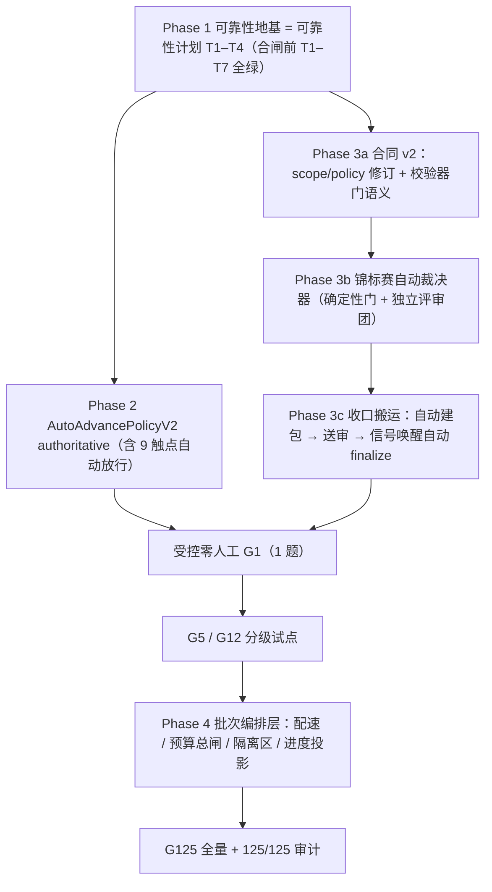

# 挑战杯第一阶段全零人工自动化路线图

> 文档 ID：`CC-STAGE1-ZERO-HUMAN-ROADMAP-20260901`
>
> 状态：`USER-APPROVED DIRECTION / ACTIVE PLAN / IMPLEMENTATION NOT STARTED`
>
> 权威路径：根 `main` 的 `docs/plans/2026-09-01-challenge-cup-stage-one-zero-human-roadmap.md`
>
> 适用范围：挑战杯方向 1A 第一阶段链路（`challenge-cup-research@2.1.0` 节点 1–7）的自动化推进、质量门自动裁决与 125 题批量编排
>
> 上位合同：`挑战杯/125题执行协议.md` v4.0（`ACTIVE_STAGE1_ONLY`，根 checkout 未跟踪治理文档区，非 git 跟踪路径）；仓库外 `03-工程合同/2026-08-31-挑战杯第一阶段高质量假说闭环开发合同.md`（`CC-AIS-STAGE1-HYPOTHESIS-001`）
>
> 非完成声明：本文是路线图合同，不是代码完成、DEV 通过或任何正式研究结果证据

## 1. 结论

用户已于 2026-09-01 拍板：第一阶段链路目标为**全零人工自动化**，包括 G1 质量门（当前 4 道人工门 + Challenge Program 审批）也改为自动裁决；最终规模是 125 个假说批量跑通（`FullCatalogResultSet` 125/125）。推荐路径分四层推进：

1. **可靠性地基**：先完成 [`2026-08-30` 自动链可靠性计划](2026-08-30-challenge-cup-automatic-chain-reliability-plan.md) 的 T1–T4（deadline 治理、durable meeting driver、durable summary/review、reconcile 死态，全部 P1）；T5–T7 按母计划推进（T5 为 test-first 证伪项）。链路会悬挂时把方向盘交给自动化等于失控；**T8 合闸前 T1–T7 必须全绿**（母计划 §8 关键路径约束，本路线图不放宽）。
2. **决策层自动化**：把既有 `AutoAdvancePolicyV2`（当前 `executed` 恒为 `False` 的 shadow 策略）升级为 authoritative，自动放行沿路全部 `waiting_human` 触点；每个自动决策带 policy hash、decision actor、fail-closed 门。
3. **收口搬运自动化 + 合同 v2**：发布第一阶段范围合同 v2，把人工质量门重定义为自动证据门；收口链路变为「证据齐备 → 自动建结果包 → 自动送审 → 批准信号唤醒自动 `finalize`」，无人搬运。
4. **125 批次编排层**：新增批量调度器（并发配速、批次预算总闸、失败隔离区、批次进度投影），按 G1 → G5 → G12 → G125 分级扩容（序列来自协议历史 v3.x 块，扩容启动前须升格为现行条款，见 §2.2），任一阶段失败不扩容。

「零人工」的验收指标是既有投影字段 `awaitingHumanCount`（`hypothesis_first_state_v2.py:3630` 附近）从当前约 9 类触点降到 0；该字段是投影读模型，运行权威仍在 Workflow Ledger，验收以投影与 Ledger 一致为准。

## 2. 合同对齐与冲突声明

### 2.1 一致项

- 125/125 是协议 v4.0 明确的最终扩容目标，方向 1A；本路线图不改变「先单题 G1、G1 后停止」的现行顺序合同。
- 本路线图的自动化范围**只覆盖第一阶段运行内质量门**（节点 7 收口的 4 道人工门与 Challenge Program 审批）；批次/扩容授权门（`CatalogHypothesisFlowReady`、`CatalogRunAuthorization` 等 Human Research Owner 批准动作）默认保留人工，是否自动化另行裁决（见 §2.2）。
- 问题级隔离以代码层 run-scoped 合同为准（`workflowRunId`/attempt fencing，可靠性计划 T6 已锁定）；receipt 证据链与三阶段收据体系保留不变。
- 自动决策以 `automation` actor 如实记录，**不伪装 `human_approved`**——这是可靠性计划 §8 T8 的既有红线，本路线图遵守。

### 2.2 冲突项（必须修订后才能合闸）

| 冲突 | 现状 | 修订方向 |
| --- | --- | --- |
| 第一阶段范围合同未定义门类型 | scope v1 本身**不含人工门字段**（仅 8 类产物 + 3 阶段收据 + deferred 节点 + 题目白名单）；人工门语义由收口校验器（`stage_one_closeout.py`）与完成清单强制；`policySha256` 硬编码于 `stage_one_completion_policy.py` 常量并进 run 身份 | 发布 scope v2：**新增** `gateType: automated_evidence_gate` 与 `adjudication` 合同，重算策略哈希；新 run 绑 v2，旧 run 保持 v1，不追溯 |
| 收口校验器要求人工批准 | `stage_one_closeout.py` 的 `_validated_completion_manifest` 要求 Program 审批 approved 与 4 人工门 | v2 下接受自动裁决记录；`finalize_stage_one_closeout` 的 Program 权威回读改为裁决器权威 |
| 仓库外工程合同 | `03-工程合同/2026-08-31-...开发合同.md` 为 `CURRENT_SCOPE_SSOT`，§4 十条 G1 门按人工口径书写 | 需用户签署合同 v2 修订或废止声明；两份「唯一事实源」不得并存打架 |
| 125 协议分级序列不在现行正文 | 协议 v4.0 现行条款只锁单题 G1（通过后停止、不自动扩容）；G1→G5→G12→G125 序列、`ResearchScopeEnvelope`（§5）、H2/H3/H4 门（§6）全部位于 `<details>` 历史 v3.x 块，标注「只作第二阶段参考」 | 扩容启动前必须发布新协议版本，把分级序列与审计门升格为现行条款；本路线图 §6 的分级扩容以此为前置 |
| 协议人工门 | 125 协议的 H2/H3/H4 门与 Human Research Owner 批准（历史 v3.x 块，第二阶段参考） | 属于深实验与批次授权门；v2 仅覆盖第一阶段运行内质量门自动化，批次授权门默认保留人工 |

## 3. 可靠性地基（Phase 1，前置闸）

完整合同见 [可靠性计划](2026-08-30-challenge-cup-automatic-chain-reliability-plan.md)，此处不重复，只列与本路线图的依赖关系：

- T1（deadline + provider cancel）、T2（durable meeting driver）、T3（durable summary/review）、T4（reconcile 死态）全绿是自动化合闸的**必要条件**；
- 生产证据锚点（2026-09-01 复核更新）：`run-16cfab646d08` 已不在 ledger，当前唯一 run `run-882610596ddb` 为 `blocked@source_finding` 且 fail-closed 形状正确（母计划 §2.3 第 4 项）；遗留无身份悬挂会议由 N1/N2 收口路径处理；
- T5–T7 可与 Phase 3 的开发并行推进，但 **T8/Phase 2 合闸前必须全绿**（母计划 §8：T8 之前要求 T1–T7 全绿）；其中 T7（Child Session 有界上下文）另是 125 批量前的硬前置——批量放大上下文污染风险。**当前状态：T5（证伪，无业务 diff）、T2、T3、T7 已合入，T1–T7 代码门已满足，剩余为 N2 与第 1 项的生产核对（母计划 §2.3 复核结论）。**

## 4. 决策层自动化（Phase 2）

- **载体**：`automation_policy_service.py` 的 `AutoAdvancePolicyV2` / `HumanReviewPolicyV2` 已有 fail-closed 校验与 preview 快照；升级路径按可靠性计划 T8 的 shadow → drain/checkpoint → authoritative 受控序列。
- **模型依赖**：评审团门需要与生成方不同的模型 binding，涉及 operator 模型授权路径（`docs/ops/config/INDEX.md`）；未授权 binding 不得作为裁决器依赖，fail-closed。
- **覆盖触点**（当前 `waiting_human` 全集，目标全部自动放行）：手动启动、会议续轮/审批、候选审批、选择裁决、评审候选、收集请求、收敛确认、Program 交付评审、节点 7 收口补完命令。
- **裁决记录合同**：每个自动决策至少持久化 `decisionId / runId / gateKey / policyHash / decisionActor=automation / inputHash / thresholdEvidence / createdAtMs`；决策可回放、可审计。
- **异常路径**：任何 hard gate 缺失、policy hash 漂移、证据不足 → fail-closed 挂起并进异常队列（`anomaly_inbox_service.py` 已有 `_awaiting_human_item` 投影，v2 下改投异常告警而非等人）。

## 5. 锦标赛自动裁决器（Phase 3 核心）

质量门自动化的设计基线来自外部调研（见 §12），核心是「质量来自对抗式评审与证据核验，不来自人工点头」：

### 5.1 裁决器分层

1. **确定性证据门（优先）**：产物完整性、三阶段收据齐全、哈希一致、预算/延迟达标等可度量项，纯规则裁决，可复现。
2. **独立评审团门**：需要判断的门（假说质量、连贯性、竞赛对齐）由**与生成方不同 binding** 的评审模型做结构化打分；多评委一致性低于阈值即视为未过。评审调用本身走官方调用证据链（复用 `official_call` 规范包语义）。
3. **对辩排名门（可选增强）**：候选假说两两比较 + Elo 式排名（借鉴 Co-Scientist tournament），头部候选进入收口；排名证据写入产物。

### 5.2 不变量

- 所有裁决器输出统一为 `gateVerdict { gateKey, verdict, score?, evidenceRefs, adjudicator, policyHash }`；
- 任一裁决器失败、超时、分歧超阈值 → 该门 `fail-closed`，run 挂起并告警，**不得默认放行**；
- 裁决记录全量可审计、事后可人工抽查（安全阀不在流程内，不增加流程人工）；
- 算力优先花在验证与评审，不花在无限生成轮（预算守卫见 §6）。

## 6. 125 批次编排层（Phase 4）

当前链路按单题运行设计，125 题需要新增批次编排层：

| 能力 | 合同要点 |
| --- | --- |
| 分批并发配速 | 信号量控制同时在跑题数；实测单次调用 p95 已 360s、max 506s，不得无配速全量并发冲垮 provider |
| 单题失败隔离 | 每题独立 run（`workflowRunId` 隔离已有），失败/耗尽进隔离区 + 告警，不阻塞其余题；重试有预算，耗尽不自动复活（可靠性计划 T5 合同） |
| 批次预算总闸 | 复用既有 receipt/预算体系，加批次级累计预算；超支自动暂停批次并进异常队列 |
| 批次进度投影 | `已完成 / 裁决挂起 / 隔离 / 在跑` 计数与清单；前端呈现走 VUI 合同（development-standard.md §9.1），顺带补齐当前前端无收口入口的断点 |
| 分级扩容 | G1 → G5 → G12 → G125（序列来自协议历史 v3.x 块，扩容启动前须升格为现行条款，见 §2.2）；每级自动裁决通过率、隔离率、预算消耗达标才授权下一级；任一失败停止扩容 |
| 隔离 | 沿用代码层 run-scoped 隔离合同（`workflowRunId`/attempt fencing，可靠性计划 T6 已锁定）；批次编排层不得成为第二个事实源，权威仍在 Workflow Ledger |

## 7. 合同 v2 修订草案骨架

```yaml
stageOneScopeV2:
  scopeId: cc-xh-202619-stage1-hypothesis-v2
  workflowBinding: challenge-cup-research@2.1.0
  questionIds: [SCI-003, SCI-091]          # G1 阶段不变；扩容由分级授权另附批次合同
  closureNodeId: hypothesis_design
  completionState: STAGE1_G1_ACCEPTED
  gateType: automated_evidence_gate        # v2 新增字段；scope v1 无门类型定义，人工门语义在校验器
  requiredArtifactKinds: [...]             # 沿用 8 类
  requiredReceiptStages: [generation, review, revision]
  adjudication:
    deterministicGates: [...]              # 5.1-1 规则门清单
    panelGates: [...]                      # 5.1-2 评审团门清单，含独立 binding 约束
    tournamentGate: optional               # 5.1-3
    failClosed: true
  policySha256: <v2 内容哈希，发布时计算>
  deferredNodeIds: [节点 8–17]
  allowPhaseTwoAdvance: false
```

配套改动：`stage_one_completion_policy.py` 常量与解析器支持 v2（保持 v1 解析路径不回归）；`stage_one_closeout.py` 校验器接受 `gateVerdict` 证据；`program_candidate_handoff.py` 的 Program 权威回读在 v2 下由裁决器权威替代。收口命令 `finalize_stage_one` / `build_stage_one_package` 改为编排层自动触发（幂等键语义不变）。

## 8. TASK_GRAPH



关键路径：`Phase 1 → Phase 3a/3b/3c → 零人工 G1 → 分级试点 → 批次编排 → G125`。Phase 2 与 Phase 3 可并行开发，但 Phase 2 合闸以 T1–T7 全绿为前置（母计划 §8），零人工 G1 要求两者都合入最新 clean main。

## 9. 回滚与降级

- Phase 2 可立即降回 shadow（母计划 §10.3 automation 回退路径）；降级**不回滚** durable 决策记录与收据事实；
- 裁决器禁用后，未过的门回到 fail-closed 挂起态，**不得**回退为默认放行；
- 合同 v2 停用：已绑 v2 的在途 run 按冻结身份跑到当前门并挂起，不迁移回 v1；新建 run 恢复 v1 策略；
- 批次编排层暂停：在跑题跑到当前门后挂起；隔离区不清理、不自动复活；批次预算闸冻结新题启动；
- 代码回滚用新修复 commit 或可审计 revert，不用 `git reset --hard`（母计划 §10.3）。

## 10. 验证矩阵

| 场景 | 必须证明 |
| --- | --- |
| 确定性门 | 同一输入重放结果一致；证据缺失/哈希漂移时 fail-closed 挂起 |
| 评审团门 | 独立 binding 生效；多评委分歧超阈值判未过；评审调用有官方收据 |
| 裁决记录 | 每个自动决策可按 `decisionId` 回放，actor=automation，无 `human_approved` 伪装 |
| 收口搬运 | 建包→送审→批准信号→finalize 全链幂等；进程重启后不重复、不丢失 |
| 批次配速 | 并发不超过信号量；慢调用（p95≈360s）不被误杀，也不冲垮 provider 配额 |
| 失败隔离 | 单题失败/耗尽只进隔离区；隔离区不自动复活；其余题不受阻 |
| 预算总闸 | 批次累计超支即暂停新题；在途调用按预算合同收敛 |
| 分级扩容 | 每级通过率/隔离率/预算达标才进下一级；任一失败即停 |
| 零人工验收 | 受控 G1 全程 `awaitingHumanCount=0` 且投影与 Workflow Ledger 一致 |
| 普通会话零差异 | 普通 Session/chat/Companion 回归全绿（AGENTS.md §2 红线） |
| Development Lane | 裁决器/编排层的开发与 DEV 验收仅使用 `DEV-*` 合成题，不读取真实 125 题数据 |

## 11. 停止条件

出现任一项立即停止合闸或扩容：

- Phase 1 任一 P1 项未闭合即尝试自动推进；
- 自动裁决器分歧/失败被默认放行，或裁决记录缺失、不可回放；
- 批次预算总闸失效、隔离区题被自动复活；
- 分级试点任一级失败仍扩大规模；
- 合同 v2 未生效（外部工程合同未修订）即运行零人工正式批次；
- 裁决器/编排层开发或 DEV 验收读取真实 125 题数据（Development Lane 只允许 `DEV-*` 合成题）；
- 任何自动决策以 `human_approved` 身份落账。

## 12. 调研证据锚点（2026-09-01）

| 借鉴点 | 来源 |
| --- | --- |
| 锦标赛自动裁决（Generate/Reflect/Rank/Evolve + Elo 对辩 + 算力优先验证） | Google Co-Scientist，Nature `s41586-026-10644-y`；labcritics 综述 |
| 全自动流水线 + 树搜索自动择优 + 混合模型控成本 + 自动同行评审 | AI-Scientist-v2（Agentic Tree Search） |
| 动态扇出、状态隔离、`max_concurrency` 限流、聚合 | LangGraph Send / MapReduce |
| 子工作流失败隔离、重试耗尽隔离区、continue-as-new | Temporal AI agent 批处理实践 |
| 持久化执行三件套（checkpoint + replay + 幂等键）、durable timer/signal | Temporal / Restate / Inngest 对比；Thoughtworks Radar（忽视持久化为反模式） |
| 审批异步化 + 幂等键 + 上下文包 + 防审批疲劳 | Mastra HITL 模式；HITL escalation design |
| 端到端多智能体科研自动化开源参照 | EvoScientist |

## 13. 协作与串行闸门

- 本路线图只新增计划文档，不触碰在途任务代码面；当前在途 worktree（2026-09-01 快照，共 10 个）：`stage1-clarity`、`stage1-closeout-integrity`、`challenge-stage1-lineage-writers`、`challenge-collection-orphan-recovery`、`chat-room-prior-message-semantics`、`companion-dialogue-v2-tighten`、`fix-source-writeback-arg-contract`、`budget-governance`、`digest-review-budget`、`t6-base-proof`；Phase 1–3 实施前必须按 `docs/agents/worktree-collaboration.md` 复核 claim。
- 热文件（`meeting_runtime.py`、`chat_room_service.py`、`hypothesis_first_chain.py`、`stage_one_closeout.py`）默认单 writer，与可靠性计划串行集成。
- 已知本地事实偏差：`AGENTS.md` §3.0 引用的本机 `briefbound-router/SKILL.md` 在仓库与本机均不存在，本任务按 `docs/guides/route.md` 路由；该偏差需另行治理轮修正文档或补齐 skill。
