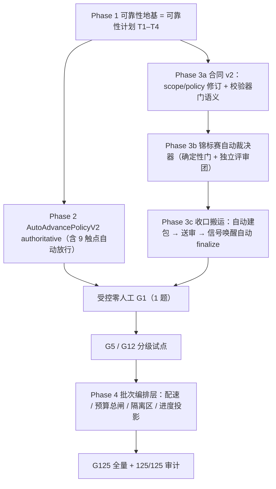

# 挑战杯第一阶段全零人工自动化路线图

> 文档 ID：`CC-STAGE1-ZERO-HUMAN-ROADMAP-20260901`
>
> 状态：`USER-APPROVED DIRECTION / ACTIVE PLAN / IMPLEMENTATION NOT STARTED`
>
> 权威路径：根 `main` 的 `docs/plans/2026-09-01-challenge-cup-stage-one-zero-human-roadmap.md`
>
> 适用范围：挑战杯方向 1A 第一阶段链路（`challenge-cup-research@2.1.0` 节点 1–7）的自动化推进、质量门自动裁决与 125 题批量编排
>
> 上位合同：`挑战杯/125题执行协议.md` v4.0（`ACTIVE_STAGE1_ONLY`，根 checkout 未跟踪治理文档区，非 git 跟踪路径）；仓库外 `03-工程合同/2026-08-31-挑战杯第一阶段高质量假说闭环开发合同.md`（`CC-AIS-STAGE1-HYPOTHESIS-001`）
>
> 非完成声明：本文是路线图合同，不是代码完成、DEV 通过或任何正式研究结果证据

## 1. 结论

用户已于 2026-09-01 拍板：第一阶段链路目标为**全零人工自动化**，包括 G1 质量门（当前 4 道人工门 + Challenge Program 审批）也改为自动裁决；最终规模是 125 个假说批量跑通（`FullCatalogResultSet` 125/125）。推荐路径分四层推进：

1. **可靠性地基**：先完成 [`2026-08-30` 自动链可靠性计划](2026-08-30-challenge-cup-automatic-chain-reliability-plan.md) 的 T1–T4（deadline 治理、durable meeting driver、durable summary/review、reconcile 死态）。链路会悬挂时把方向盘交给自动化等于失控，此层不绿不得合闸自动化。
2. **决策层自动化**：把既有 `AutoAdvancePolicyV2`（当前 `executed` 恒为 `False` 的 shadow 策略）升级为 authoritative，自动放行沿路全部 `waiting_human` 触点；每个自动决策带 policy hash、decision actor、fail-closed 门。
3. **收口搬运自动化 + 合同 v2**：发布第一阶段范围合同 v2，把人工质量门重定义为自动证据门；收口链路变为「证据齐备 → 自动建结果包 → 自动送审 → 批准信号唤醒自动 `finalize`」，无人搬运。
4. **125 批次编排层**：新增批量调度器（并发配速、批次预算总闸、失败隔离区、批次进度投影），按协议 §9 的 G1 → G5 → G12 → G125 分级扩容，任一阶段失败不扩容。

「零人工」的验收指标是既有投影字段 `awaitingHumanCount`（`hypothesis_first_state_v2.py:3630` 附近）从当前约 9 类触点降到 0。

## 2. 合同对齐与冲突声明

### 2.1 一致项

- 125/125 是协议 v4.0 明确的最终扩容目标，方向 1A；本路线图不改变「先单题 G1、分级扩容」的顺序合同。
- `CatalogHypothesisFlowReady`、`CatalogRunAuthorization`、问题级隔离（`ResearchScopeEnvelope`）、receipt 证据链等既有门保留，只把其中**人工裁决动作**改造为自动证据裁决。
- 自动决策以 `automation` actor 如实记录，**不伪装 `human_approved`**——这是可靠性计划 §8 T8 的既有红线，本路线图遵守。

### 2.2 冲突项（必须修订后才能合闸）

| 冲突 | 现状 | 修订方向 |
| --- | --- | --- |
| 第一阶段范围合同冻结人工门 | `core/research/competition/data/challenge_cup_stage_one_scope_v1.json` 要求 8 类产物 + 3 阶段收据 + 人工门；`policySha256` 硬编码，进 run 身份 | 发布 scope v2：质量门类型 `human` → `automated_evidence_gate`，重算策略哈希；新 run 绑 v2，旧 run 保持 v1，不追溯 |
| 收口校验器要求人工批准 | `stage_one_closeout.py` 的 `_validated_completion_manifest` 要求 Program 审批 approved 与 4 人工门 | v2 下接受自动裁决记录；`finalize_stage_one_closeout` 的 Program 权威回读改为裁决器权威 |
| 仓库外工程合同 | `03-工程合同/2026-08-31-...开发合同.md` 为 `CURRENT_SCOPE_SSOT`，§4 十条 G1 门按人工口径书写 | 需用户签署合同 v2 修订或废止声明；两份「唯一事实源」不得并存打架 |
| 协议人工门 | 125 协议 §6 的 H2/H3/H4 与 §9 的 Human Research Owner 批准 | 属于深实验与批次授权门；v2 仅覆盖第一阶段质量门自动化，批次授权门是否自动化另行裁决，默认保留 |

## 3. 可靠性地基（Phase 1，前置闸）

完整合同见 [可靠性计划](2026-08-30-challenge-cup-automatic-chain-reliability-plan.md)，此处不重复，只列与本路线图的依赖关系：

- T1（deadline + provider cancel）、T2（durable meeting driver）、T3（durable summary/review）、T4（reconcile 死态）全绿是自动化合闸的**必要条件**；
- 生产证据锚点：`run-16cfab646d08` 仍为 `running + zero active outbox` 死态；会议无 deadline、`summarizing` 悬挂均已发生；
- T5–T7 与自动化合闸并行推进，但 T7（Child Session 有界上下文）必须在 125 批量前完成——批量放大上下文污染风险。

## 4. 决策层自动化（Phase 2）

- **载体**：`automation_policy_service.py` 的 `AutoAdvancePolicyV2` / `HumanReviewPolicyV2` 已有 fail-closed 校验与 preview 快照；升级路径按可靠性计划 T8 的 shadow → drain/checkpoint → authoritative 受控序列。
- **覆盖触点**（当前 `waiting_human` 全集，目标全部自动放行）：手动启动、会议续轮/审批、候选审批、选择裁决、评审候选、收集请求、收敛确认、Program 交付评审、节点 7 收口补完命令。
- **裁决记录合同**：每个自动决策至少持久化 `decisionId / runId / gateKey / policyHash / decisionActor=automation / inputHash / thresholdEvidence / createdAtMs`；决策可回放、可审计。
- **异常路径**：任何 hard gate 缺失、policy hash 漂移、证据不足 → fail-closed 挂起并进异常队列（`anomaly_inbox_service.py` 已有 `_awaiting_human_item` 投影，v2 下改投异常告警而非等人）。

## 5. 锦标赛自动裁决器（Phase 3 核心）

质量门自动化的设计基线来自外部调研（见 §10），核心是「质量来自对抗式评审与证据核验，不来自人工点头」：

### 5.1 裁决器分层

1. **确定性证据门（优先）**：产物完整性、三阶段收据齐全、哈希一致、预算/延迟达标等可度量项，纯规则裁决，可复现。
2. **独立评审团门**：需要判断的门（假说质量、连贯性、竞赛对齐）由**与生成方不同 binding** 的评审模型做结构化打分；多评委一致性低于阈值即视为未过。评审调用本身走官方调用证据链（复用 `official_call` 规范包语义）。
3. **对辩排名门（可选增强）**：候选假说两两比较 + Elo 式排名（借鉴 Co-Scientist tournament），头部候选进入收口；排名证据写入产物。

### 5.2 不变量

- 所有裁决器输出统一为 `gateVerdict { gateKey, verdict, score?, evidenceRefs, adjudicator, policyHash }`；
- 任一裁决器失败、超时、分歧超阈值 → 该门 `fail-closed`，run 挂起并告警，**不得默认放行**；
- 裁决记录全量可审计、事后可人工抽查（安全阀不在流程内，不增加流程人工）；
- 算力优先花在验证与评审，不花在无限生成轮（预算守卫见 §6）。

## 6. 125 批次编排层（Phase 4）

当前链路按单题运行设计，125 题需要新增批次编排层：

| 能力 | 合同要点 |
| --- | --- |
| 分批并发配速 | 信号量控制同时在跑题数；实测单次调用 p95 已 360s、max 506s，不得无配速全量并发冲垮 provider |
| 单题失败隔离 | 每题独立 run（`workflowRunId` 隔离已有），失败/耗尽进隔离区 + 告警，不阻塞其余题；重试有预算，耗尽不自动复活（可靠性计划 T5 合同） |
| 批次预算总闸 | 复用既有 receipt/预算体系，加批次级累计预算；超支自动暂停批次并进异常队列 |
| 批次进度投影 | `已完成 / 裁决挂起 / 隔离 / 在跑` 计数与清单；前端呈现走 VUI 合同（红线 §9.1），顺带补齐当前前端无收口入口的断点 |
| 分级扩容 | G1 → G5 → G12 → G125（协议 §9.0）；每级自动裁决通过率、隔离率、预算消耗达标才授权下一级；任一失败停止扩容 |
| 隔离 | 全链路遵守 `ResearchScopeEnvelope`（协议 §5）；批次编排层不得成为第二个事实源，权威仍在 Ledger |

## 7. 合同 v2 修订草案骨架

```yaml
stageOneScopeV2:
  scopeId: cc-xh-202619-stage1-hypothesis-v2
  workflowBinding: challenge-cup-research@2.1.0
  questionIds: [SCI-003, SCI-091]          # G1 阶段不变；扩容由分级授权另附批次合同
  closureNodeId: hypothesis_design
  completionState: STAGE1_G1_ACCEPTED
  gateType: automated_evidence_gate        # v1 为 human
  requiredArtifactKinds: [...]             # 沿用 8 类
  requiredReceiptStages: [generation, review, revision]
  adjudication:
    deterministicGates: [...]              # 5.1-1 规则门清单
    panelGates: [...]                      # 5.1-2 评审团门清单，含独立 binding 约束
    tournamentGate: optional               # 5.1-3
    failClosed: true
  policySha256: <v2 内容哈希，发布时计算>
  deferredNodeIds: [节点 8–17]
  allowPhaseTwoAdvance: false
```

配套改动：`stage_one_completion_policy.py` 常量与解析器支持 v2（保持 v1 解析路径不回归）；`stage_one_closeout.py` 校验器接受 `gateVerdict` 证据；`program_candidate_handoff.py` 的 Program 权威回读在 v2 下由裁决器权威替代。收口命令 `finalize_stage_one` / `build_stage_one_package` 改为编排层自动触发（幂等键语义不变）。

## 8. TASK_GRAPH



关键路径：`Phase 1 → Phase 3a/3b/3c → 零人工 G1 → 分级试点 → 批次编排 → G125`。Phase 2 与 Phase 3 可并行开发，但零人工 G1 要求两者都合入最新 clean main。

## 9. 停止条件

出现任一项立即停止合闸或扩容：

- Phase 1 任一 P1 项未闭合即尝试自动推进；
- 自动裁决器分歧/失败被默认放行，或裁决记录缺失、不可回放；
- 批次预算总闸失效、隔离区题被自动复活；
- 分级试点任一级失败仍扩大规模；
- 合同 v2 未生效（外部工程合同未修订）即运行零人工正式批次；
- 任何自动决策以 `human_approved` 身份落账。

## 10. 调研证据锚点（2026-09-01）

| 借鉴点 | 来源 |
| --- | --- |
| 锦标赛自动裁决（Generate/Reflect/Rank/Evolve + Elo 对辩 + 算力优先验证） | Google Co-Scientist，Nature `s41586-026-10644-y`；labcritics 综述 |
| 全自动流水线 + 树搜索自动择优 + 混合模型控成本 + 自动同行评审 | AI-Scientist-v2（Agentic Tree Search） |
| 动态扇出、状态隔离、`max_concurrency` 限流、聚合 | LangGraph Send / MapReduce |
| 子工作流失败隔离、重试耗尽隔离区、continue-as-new | Temporal AI agent 批处理实践 |
| 持久化执行三件套（checkpoint + replay + 幂等键）、durable timer/signal | Temporal / Restate / Inngest 对比；Thoughtworks Radar（忽视持久化为反模式） |
| 审批异步化 + 幂等键 + 上下文包 + 防审批疲劳 | Mastra HITL 模式；HITL escalation design |
| 端到端多智能体科研自动化开源参照 | EvoScientist |

## 11. 协作与串行闸门

- 本路线图只新增计划文档，不触碰在途任务代码面；当前在途 worktree：`stage1-clarity`、`stage1-closeout-integrity`、`challenge-stage1-lineage-writers`、`budget-governance`、`digest-review-budget`、`t6-base-proof` 等，Phase 1–3 实施前必须按 `docs/agents/worktree-collaboration.md` 复核 claim。
- 热文件（`meeting_runtime.py`、`chat_room_service.py`、`hypothesis_first_chain.py`、`stage_one_closeout.py`）默认单 writer，与可靠性计划串行集成。
- 已知本地事实偏差：`AGENTS.md` §3.0 引用的本机 `briefbound-router/SKILL.md` 在仓库与本机均不存在，本任务按 `docs/guides/route.md` 路由；该偏差需另行治理轮修正文档或补齐 skill。
