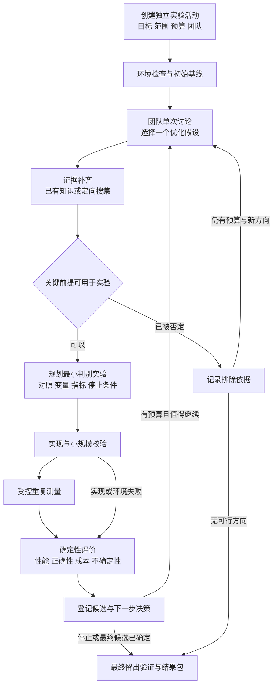

# 独立算子优化实验流程搭建方案

> 日期：2026-09-05
>
> 状态：USER-REQUESTED / PROPOSED FOR REVIEW
>
> 版本：V1.0
>
> 文档用途：对齐产品行为、实验方法、复用边界和实施顺序，供后续开发与验收使用。
>
> 当前完成范围：方案编写与源码调研；未实现新流程，未启动模型调用、知识写入或 GPU 实验。
>
> 本地代码观察基线：`7a109dea3`；本文中的现状是该版本的代码证据，不等于运行验收。
>
> 关闭条件：本方案被替代，或功能、真实实验和交付验收完成后，更新状态并移入 `docs/archive/plans/`，同步移除在研索引。本文不覆盖根 AGENTS.md 和现行规范。

## 1. 目标与已经对齐的需求

搭建一条独立于挑战杯方向 A 的算子优化实验数据流。研究方向固定，团队每轮根据当前实现、真实测量和失败记录提出值得验证的优化假设，补齐证据，规划和执行实验，再把结果带回团队讨论。

系统的主要产出是可复现的优化实现、优化适用范围、失败原因及连续实验记录。假设生成服务于改进指定算子，不承担开放科学选题和 125 题批量假说生产。

已确认的产品要求：

1. 单独的实验入口和数据流，不依赖方向 A 的 125 题生成、整包审批和整包知识发布。
2. 复用现有团队、单次讨论、知识搜集、实验规划、执行和反馈能力；有具体不适配再作有界改造。
3. 每轮只有一次有明确结束点的优化讨论，输出下一项值得测试的优化假设。
4. 讨论后围绕假设补齐资料，随后规划实验；每次实验结束后，真实结果必须进入下一轮讨论。
5. 优先选择高 ROI 的改进；既记录性能收益，也记录模型、编译、搜索和测量成本。
6. 固定初始基线，保留当前最佳实现和失败候选，不把最近运行的候选自动当成下一轮基线。

本方案不把“算子更快”表述为证明 SCI-091 的计算绝对上限。方向 B 的核心是一个真实、可解释、可复现的实验反馈闭环。

## 2. 建议默认值与仍需确定的事项

下表用于让方案具体可审阅，尚未回复的选择不是已批准配置。批准方案也不等于已授权其中的付费调用、依赖安装或真实实验。

| 项目 | V1 建议 | 状态与影响 |
| --- | --- | --- |
| 首个算子 | Softmax，后续再扩展 LayerNorm、逐元素融合等 | 首例建议；不要求一次完成三类算子 |
| 主要目标 | 在正确性和精度约束内降低延迟；同工作量下附带报告吞吐 | 待确认；多目标会改变候选比较与晋升规则 |
| 可改动范围 | 参数、分块、并行布局、融合与数学等价的计算实现 | 待确认；不默认放宽精度或改变算子语义 |
| 每轮选择 | 最多 3 个简短候选，选 1 个主假设执行 | 方案建议，避免候选数量失控 |
| 团队讨论 | 复用已有成员和角色，每轮一次受限会议并形成结构化结论 | “一次会议”不承诺等于一次模型调用 |
| 首期执行并发 | 单 GPU 串行测量，每轮 1 个主候选族 | 方案建议，避免相互干扰和显存竞争 |
| 模型 | 使用符合方向 B 要求、可提供调用凭证的 Qwen 路由 | 具体型号、账号路由和额度在运行前确定 |
| 自动推进 | 在明确批准的活动预算及动作范围内自动推进 | 未批准预算时只可保存方案，不能派发真实调用 |
| 设备环境 | 先评估本机 RTX 4060 Laptop 8GB 的 Linux/WSL2 CUDA 路径 | GPU 型号此前已实查；WSL 发行版与依赖可用性尚未验收 |
| 产品界面 | 团队科研工作区增加“算子优化实验”独立入口 | 本文定义信息与行为，视觉方案需后续预览验收 |

运行预算建议见第 11 节。具体币种金额、GPU 时间和有效模型路由必须显式填写，不以空值或无限值代替授权。

## 3. 成熟项目调研与复用裁决

调研方式为官方文档、GitHub 元数据与固定提交源码只读核对，没有安装、运行或复制外部框架。以下仓库在调研时均未归档；近期提交只表明维护活动，不证明与本项目兼容或科学结果可靠。

### 3.1 方法与项目对照

| 来源 | 实际设计与代码证据 | 本方案借鉴 | 不采用或暂缓的部分 |
| --- | --- | --- | --- |
| NIST 实验设计手册 | 先确定比较、筛选、优化等实验目的，再选择因素、响应和设计；考虑交互效应、随机顺序与区组 | 实验单先写本轮问题，再写变量、对照与评价；按干扰因素组织测量 | 不机械要求每次只改一个因素；不把所有实验都升级为完整统计建模 |
| Microsoft RD-Agent | `Hypothesis2Experiment.convert` 将假设变为具体实验；`Experiment2Feedback` 消费执行结果；`Trace` 保存实验和反馈关系；优化策略区分初始解、改进和组合 | 工作假设、计划、执行、反馈分离；每轮有来源和父候选；讨论使用实际历史 | 不导入整个金融/数据科学场景、路由器和代码生成框架；首期不做多树搜索或候选合并 |
| Ax | 分开配置参数空间、目标和结果约束；用 Trial 记录参数及运行状态；`complete_trial` 不要求全部指标齐全；停止策略综合已完成试验与收益窗口 | 试验身份、指标完整性与优化结论分离；参数范围和停止条件提前确定 | 不直接采用“COMPLETED 即可评估”；首期不引入贝叶斯优化依赖，不照搬 IQR 停止阈值 |
| Kernel Tuner | `tune_kernel` 接收参数、限制、正确答案/校验器、计时配置；串行 runner 预热并分别记录编译、验证、测量时间；限制试验次数和时间 | 正确性优先、参数合法性、测量成本分账、重复配置复用、设备身份记录 | 不把缓存中的旧性能作为新鲜实测；其多后端支持不等于当前 Triton 路径已适配，首期只借结构 |
| AI Scientist-v2 | 实验经理划分可运行实现、基线调优、研究改进、消融四阶段，保留节点日志和阶段预算 | 先建立可信基线，成功改进后补必要消融与复验 | 不导入自动写论文和完整树搜索；不采用“运行太快便扩大模型/数据”的启发式，这不符合成本导向 |

### 3.2 固定源码证据

| 项目 | 核对提交与许可证 | 已核对位置 |
| --- | --- | --- |
| RD-Agent | `32b3d395e73d9db5eee3fe9063d69aec0fdc83bd`；2026-09-04；MIT | [proposal.py](https://github.com/microsoft/RD-Agent/blob/32b3d395e73d9db5eee3fe9063d69aec0fdc83bd/rdagent/core/proposal.py)、[rd_loop.py](https://github.com/microsoft/RD-Agent/blob/32b3d395e73d9db5eee3fe9063d69aec0fdc83bd/rdagent/components/workflow/rd_loop.py)、[优化策略说明](https://github.com/microsoft/RD-Agent/blob/32b3d395e73d9db5eee3fe9063d69aec0fdc83bd/rdagent/scenarios/data_science/proposal/exp_gen/README.md) |
| Ax | `778e22ffdb05fb8a0a5e8527c283d102a598f7da`；2026-09-03；MIT | [client.py](https://github.com/facebook/Ax/blob/778e22ffdb05fb8a0a5e8527c283d102a598f7da/ax/api/client.py)、[收益停止策略](https://github.com/facebook/Ax/blob/778e22ffdb05fb8a0a5e8527c283d102a598f7da/ax/global_stopping/strategies/improvement.py) |
| Kernel Tuner | `24d7c23d7ed86b77153ca2a7079a245a225875b3`；2026-08-21；Apache-2.0 | [interface.py](https://github.com/KernelTuner/kernel_tuner/blob/24d7c23d7ed86b77153ca2a7079a245a225875b3/kernel_tuner/interface.py)、[core.py](https://github.com/KernelTuner/kernel_tuner/blob/24d7c23d7ed86b77153ca2a7079a245a225875b3/kernel_tuner/core.py)、[sequential.py](https://github.com/KernelTuner/kernel_tuner/blob/24d7c23d7ed86b77153ca2a7079a245a225875b3/kernel_tuner/runners/sequential.py)、[策略预算](https://github.com/KernelTuner/kernel_tuner/blob/24d7c23d7ed86b77153ca2a7079a245a225875b3/kernel_tuner/strategies/common.py) |
| AI Scientist-v2 | `96bd51617cfdbb494a9fc283af00fe090edfae48`；2025-12-19；自定义 The AI Scientist Source Code License | [agent_manager.py](https://github.com/SakanaAI/AI-Scientist-v2/blob/96bd51617cfdbb494a9fc283af00fe090edfae48/ai_scientist/treesearch/agent_manager.py)、[预算配置](https://github.com/SakanaAI/AI-Scientist-v2/blob/96bd51617cfdbb494a9fc283af00fe090edfae48/bfts_config.yaml)、[许可证](https://github.com/SakanaAI/AI-Scientist-v2/blob/96bd51617cfdbb494a9fc283af00fe090edfae48/LICENSE) |

NIST 对应依据：[实验目标](https://www.itl.nist.gov/div898/handbook/pri/section3/pri31.htm)、[因素与交互作用](https://www.itl.nist.gov/div898/handbook/pri/section3/pri32.htm)、[随机化](https://www.itl.nist.gov/div898/handbook/pri/section3/pri331.htm)、[区组控制](https://www.itl.nist.gov/div898/handbook/pri/section3/pri332.htm)。

复用结论：优先复用 Vibelution 的运行、讨论、知识和实验合同；参考 RD-Agent 的反馈结构及 Kernel Tuner 的测量设计；Ax 作为未来参数搜索可选能力；AI Scientist-v2 仅参考阶段组织。新流程不新增这些完整框架依赖。真实 GPU runner 所需 PyTorch、Triton 和剖析工具另行做环境准备与版本固定。

## 4. 当前项目能力与准确缺口

| 能力 | 当前证据 | 需要做的工作 |
| --- | --- | --- |
| 实验与反馈模式 | [experiment_contract.py](../../core/research/experiment_contract.py) 已有 `experiment_feedback`，目的包括对照、证伪、消融、复现和稳健性 | 新算子优化配置复用这些语义，不另建相同实验合同 |
| 单轮团队讨论 | [meeting_rounds.py](../../core/web/services/team_workflow/meeting_rounds.py) 有会议创建/闭合和探索草案身份；[chat_room_service.py](../../core/web/services/chat_room_service.py) 可启动一轮群聊 | 增加算子优化议程、上下文与结构化结论，复用现有执行链 |
| 独立知识搜集 | [knowledge_sideflow_definition.py](../../core/research/workflow/knowledge_sideflow_definition.py) 已定义搜集、提炼、关系、入库与交接 | 接受本轮假设和证据缺口；允许复用已有知识快照 |
| 现有自动搜集触发 | [knowledge_sideflow_trigger.py](../../core/web/services/team_workflow/research_runtime/knowledge_sideflow_trigger.py) 在问题理解完成后触发，面向后续假说设计 | 新流程从优化讨论输出触发，不能直接复用该硬编码顺序 |
| 正式假说与规划交接 | [experiment_stage_bootstrap.py](../../core/web/services/team_workflow/research_runtime/experiment_stage_bootstrap.py) 在 `hypothesis_design` 建立实验轮次，要求知识包；[agent_task_artifact_builder.py](../../core/web/services/team_workflow/research_runtime/agent_task_artifact_builder.py) 要求原假说任务聚合产物 | 为优化假设增加合法的结构化交接，不伪造原有假说任务完成 |
| 工作流定义与账本 | [definition_registry.py](../../core/research/workflow/definition_registry.py) 以工作流 ID、版本和结构哈希固定定义 | 注册独立工作流，复用账本和命令；执行器分派仍需检查并补齐注册，注册定义本身不等于可运行 |
| 方向 A/B 阶段依赖 | [challenge_phase_boundary.py](../../core/web/services/team_workflow/challenge_phase_boundary.py)、[research_loop.py](../../core/web/services/team_workflow/research_loop.py)、[experiment_api/plan.py](../../core/web/services/team_workflow/experiment_api/plan.py) 检查方向 A 整包状态 | 新流按服务端保存的实验身份和运行策略进入，不靠遗漏字段或伪造题目 ID 绕过旧入口 |
| 实验执行与结果登记 | [experiment_api/full_run.py](../../core/web/services/team_workflow/experiment_api/full_run.py) 有准备、执行、登记；[iteration_decisions.py](../../core/research/workflow/iteration_decisions.py) 有重跑、修订、晋升、回滚、停止 | 复用一次试验的执行与证据，增加活动级下一轮讨论调度 |
| GPU 适配器 | [gpu_operator.py](../../core/research/experiment_adapters/gpu_operator.py) 当前为 CPU fixture，明确不产生真实性能结论 | 开发可核验的真实 GPU adapter；DEV fixture 保持明确身份，不能作为运行失败后的性能替代 |

主要缺口是独立入口、优化假设合同、讨论后知识交接、活动级循环和真实 GPU 执行。没有必要重写普通 Session、群聊引擎、知识检索引擎或全部科研框架。

## 5. 产品流程与每一步的输入输出



### 5.1 创建与基线

输入包括算子语义、工作负载范围、目标设备、主要指标、正确性要求、可变范围、预算以及参与团队。首次运行先建立可信基线；已有基线也必须检查代码和环境指纹是否仍适用。

基线准备失败时产出环境/复现诊断，不能继续生成性能优化结论。此时的局部修复只恢复已定实验条件，不扩展研究方向。

### 5.2 单次优化讨论

讨论上下文包含：目标与限制、初始基线、当前最佳实现、上一轮原始测量摘要、错误与剖析证据、历史已尝试改动、已有知识和剩余预算。首次讨论使用初始基线报告。

复用团队角色能力，按议程承担瓶颈解释、实现可行性、反证与评价、结论汇总；不为角色名称新建多个常驻 Agent。会议发言次数、输入上下文和模型调用上限可计量，结束后产出结构化记录。

每轮最多保留 3 个简短候选，只选择 1 个主假设。其余只保留理由和是否值得后续考虑，不能在后台自行启动。单次讨论结束后不追加一套多轮假说评分和 Pareto 评审。

### 5.3 补齐资料

先检索本活动和已授权知识来源，已有证据足够则绑定快照直接交接；不足时按缺口定向搜集成熟实现、硬件约束、边界与反证。不是每轮重搜完整课题。

每个检索请求都必须对应一项待判断主张。知识条目区分外部先验和本活动实测，保留来源、适用设备/版本、支持或反对关系及不确定性。

关键前提已被反证时记录该假设被排除，终结当前轮的准备阶段，再由下一轮讨论选择方向；这类记录计入讨论和搜集成本，不计作已执行实验。证据不充分但实验本身能够区分解释时，可以规划验证，不要求先“证明假设成立”。

### 5.4 实验规划

输入为选定假设、证据快照、当前最佳实现和约束。输出具体实验单：目的、对照、变化因素、固定因素、配置组合、输入集合、正确性容差、计时方法、重复方式、预算、停止条件及结果分支。

规划阶段将探索草案整理为可检验的优化假设，不再调用原有开放式假说生成流程。实验组与对照必须能回答本轮问题；因素交互显著时允许小规模组合设计。

计划可先用小样验证可执行性，再锁定正式测量版本。调整语义、容差、主要指标或输入分布属于契约变更，不得为过关静默修改。

### 5.5 实现、运行与评价

候选代码在任务专属工作区生成，保留源代码和编译配置哈希。先校验和编译，再正确性检查，最后运行性能测量；失败留下真实记录，不能用预制数字补齐。

执行器采集原始值，确定性程序计算比较结果。LLM 负责解释和下一轮建议，不生成替代测量数字。一个假设可能需要多个参数配置；每个配置是独立试验，试验完成不等于假设得到支持。

### 5.6 下一轮与最终验证

每轮结束形成三类独立判断：执行是否成功、假设获得支持/反驳/仍不确定、候选是否可成为当前最佳实现。失败也必须回到下一轮讨论；重复已知失败需有新的理由或证据。

相同协议重跑用于确认噪声或可复现性，不是新的优化发现；变更算法或协议则产生新候选/计划版本。预算内的普通下一轮自动推进，具体授权与停止边界见第 11 节。

## 6. 优化假设与 ROI 选择

### 6.1 优化假设最小字段

| 字段 | 内容 |
| --- | --- |
| `hypothesisId / revision` | 唯一身份与修订版本 |
| `campaignId / roundId / parentCandidateRef` | 实验归属与起始实现 |
| `observationRefs` | 触发改进的实测、错误或已有证据 |
| `proposedChange` | 准备改变的参数、布局、融合或计算方式 |
| `mechanism` | 为什么预计有效，哪些步骤构成因果解释 |
| `prediction / scope` | 预期哪一指标在何种输入和环境下怎样变化 |
| `alternativeExplanations / falsifiers` | 竞争解释和削弱该假设的结果 |
| `evidenceGaps` | 需要补齐的资料与判断用途 |
| `estimatedCost / roiRationale` | 成本区间、粗粒度收益预期、依据与不确定性 |
| `selected / rejectionReason` | 本轮选择及未选择的原因 |

示例：大行宽上检测到寄存器使用量上升和吞吐下降；假设采用分块归约可降低单程序资源占用，在指定行宽区间抵消额外读写并改善延迟。竞争解释是额外访存主导、或性能变化来自频率波动。上述数字和现象须由实际基线补齐，目前仅为方案示例。

### 6.2 ROI 排序方法

先排除超范围、不可测、没有可执行路径或已被相同证据否定的候选。对剩余候选比较：观测依据、预期影响范围、实现/验证成本、成熟实现可复用程度、失败后的信息价值。

V1 使用高/中/低与简短依据，不做任意加权总分，不把 LLM 猜测的成功率乘入一个看似精确的收益数值。性能收益优先时，纯诊断实验需说明它会解除哪项阻塞，且不应持续吞噬优化预算。

实验后记录实际模型使用量、编译时间、测量时间、候选收益和覆盖范围。成本不完整时标为未知，不记作零成本。高 ROI 的选择质量由后续结果审计，而不是由讨论结论自我认证。

## 7. 独立数据流与唯一事实源

### 7.1 独立身份

为新流程注册独立的工作流类型，例如 `operator-optimization`，并保存服务端配置的实验模式与版本。名称为拟定，不是已存在 API。

一个实验活动（campaign）固定目标、预算、团队、设备与初始基线；活动下有连续讨论/实验轮次；每轮关联一个工作流 run、会议、选定假设、知识快照和计划；计划下有若干具体配置试验。

```
实验活动
  ├─ 初始基线与当前最佳候选引用
  ├─ 第 1 轮 → 会议 → 假设 → 知识快照 → 计划 → 试验与评价
  ├─ 第 2 轮 → 消费第 1 轮评价与新观测
  └─ 最终候选 → 留出验证 → 可复现结果包
```

普通会话 Session/Journal/SSE 继续是讨论文本与实时输出的权威。活动对象只保存会话和会议引用，不建立第二份聊天全文。

### 7.2 数据所有权

| 数据 | 唯一写入者与权威 | 其他模块的使用方式 |
| --- | --- | --- |
| 活动配置、预算授权、初始基线 | 新活动服务，复用研究项目身份与存储定位 | 不可变配置版本；投影读取 |
| 节点状态、调度命令、取消与恢复 | 现有 Workflow Ledger 和 command service | 活动状态由轮次账本计算，不双写另一套节点状态 |
| 会议文本与结构化结论 | 原生会话链及 MeetingRound 服务 | 保存引用和有界摘要 |
| 优化假设 | 会议闭合后的专属结构化 artifact | 搜集和规划按版本/hash 读取 |
| 知识内容 | 现有 Team Knowledge 写入与来源机制 | 实验使用不可变证据快照与本轮关联 |
| 计划与协议 | 现有实验计划服务，增加优化配置扩展 | runner 只消费冻结版本 |
| 原始测量与环境回执 | 真实实验 adapter 输出 artifact | 评价程序读取；LLM 无权覆盖原始值 |
| 评价与活动级候选选择 | 确定性评价服务；选择通过命令提交 | 会议只提出建议；最佳候选指针按预期旧版本更新 |

存储路径必须由当前研究项目/实例的 resolver 生成。新实验有独立 namespace 和 artifact 根，不硬编码用户名或 Documents 路径，不在 checkout 写真实实验数据。具体布局在实现时落到现有 locator，不增加平行的通用存储框架。

复用同一团队成员不复用同一运行会话和可变上下文。方向 A 的内容只在显式选择后作为有来源的参考输入，不能自动成为新实验的成功证据。

### 7.3 版本、幂等与恢复

每次真实派发绑定 `campaignId / roundId / runId / protocolHash / candidateHash / environmentHash / workloadHash`。同一命令重试不能产生第二次会议或第二次付费实验；已有回执能恢复时，继续读取原回执。

每轮使用开始时固定的最佳候选引用，不能在运行中被另一轮悄悄替换。活动级选择采用现有命令/CAS 思路验证预期旧版本；不新建全局锁服务。

取消通过现有认证命令与可追踪执行器传递。取消或超时留下终态与已发生的成本，不产生成功评价；待执行任务不再派发。恢复时重新检查设备与输入指纹，不能把旧设备测量拼进新环境比较。

## 8. 科学评价和候选晋升

### 8.1 三个独立层次

| 层次 | 示例状态 | 判断依据 |
| --- | --- | --- |
| 执行 | 成功、编译失败、正确性失败、测量无效、取消 | 程序与设备回执 |
| 假设判断 | 支持、反驳、不确定 | 预先声明的预测、对照、反证和不确定性 |
| 候选价值 | 暂定最佳、未优于最佳、适用范围较窄、不可接受 | 同条件比较和固定约束 |

只有必要指标齐全、正确性合格、比较有效时才进入候选选择。`succeeded`、群聊完成或试验结束均不能替代上述判断。

### 8.2 输入集合与调优偏差

至少分开：调优/诊断输入，以及最终审计留出输入。调优集的结果允许反馈给团队并用于更新“当前最佳”；它不是独立泛化验证。

最终候选和评价协议锁定后，才使用留出输入。该结果不得再反馈到同一轮搜索并继续宣称留出集未被使用；若需要据此修订，创建新的研究版本并重新准备独立验证。所有集合都保存版本、种子、shape/dtype 和来源规则。

### 8.3 正确性和测量

- 算子数学语义、layout、边界输入、累加精度与容差在协议中明确；不同 dtype 不机械使用同一个容差。
- 参考输出使用可信实现或更高精度计算，并检查数值范围、极端但合法的有限输入和结构性质。NaN/Inf、任意 stride 等只有声明支持时才纳入，不无边界扩展语义。
- 错误候选不能计入加速收益。参数搜索不能修改验证器、测试输入或计时脚本来获得分数。
- GPU 测量要预热、同步；基线与候选交错或随机安排。记录设备、驱动、运行时、温度/频率观测和其他负载；不可读字段明确缺失。
- 记录独立测量块中的原始样本，报告 median、P95、效应量与适当的不确定性。连续 launch 不是许多独立设备重复；统计以独立块或配对批次为单位。
- 编译、搜索、数据准备、剖析和稳定运行耗时分别报告。能耗无法可靠测量时仅作缺失项，不从功率上限推算实际能耗。

### 8.4 当前最佳与最终结论

初始基线永久固定。当前最佳是通过调优集评价后的活动级候选引用，允许在确认范围内更新；候选既对比当前最佳，也报告相对初始基线的累计改进。

建议在预实验后固定实用收益门槛与退化上限，不预先把任意 10% 当成科学事实。逐 shape 报告，汇总可用延迟比几何平均，但不能隐藏关键工作负载退化。若汇总输入带权重，权重必须在测量前确定。

短期未改善不自动否定机制假设；机制被反证也不妨碍保留独立测得的工程收益，但结论必须分开。更换目标 GPU、精度、主要指标或工作负载分布时，建立新的比较协议，不把分数混入旧榜单。

## 9. 首个 Softmax 实验配置

首例采用按行 Softmax：`y[i,j] = exp(x[i,j] - max(x[i,:])) / sum(exp(x[i,:] - max(x[i,:])))`。首期建议连续二维输入，FP16/FP32，明确归约累加精度；更复杂布局后续扩展。

基线包括 PyTorch 原生实现和适用的 Triton 官方融合示例；`torch.compile` 在环境支持并事先登记时加入。基础融合已有成熟先例，本活动的研究对象是具体硬件、输入范围和优化决策的有效性。

可从行数与行宽组合中选择小型冻结集合。行宽应覆盖 2 的幂及其附近尺寸，以及可能进入不同资源区间的较宽输入。完整组合数量由显存、预实验波动和预算决定，不能只选择最有利的 shape。

候选方向示例包括程序并行度、分块归约、数据布局、减少中间读写、按输入特征选择实现。每轮只能选择其中一个有依据的主假设；候选内部可做受限参数试验。

示例两轮闭环：

| 环节 | 第 1 轮 | 第 2 轮 |
| --- | --- | --- |
| 输入 | 初始性能和资源剖析 | 第 1 轮真实成功/失败、开销与参数记录 |
| 假设 | 分块可能改善大行宽资源压力 | 仅在第 1 轮有依据时，检验另一块大小或并行策略 |
| 证据补齐 | 官方 kernel、资源约束、分块额外读写 | 补第 1 轮仍无法解释的具体缺口 |
| 实验 | 同一语义和输入下对照实现 | 保持评价协议，改变所声明的实现因素 |
| 输出 | 支持/反驳/不确定及候选价值 | 解释改善或未改善，并决定继续或停止 |

此表是待执行路径，不预设第 1 轮必然遇到某个问题，也不为展示反馈而人为制造失败。

## 10. 系统结构、API 与界面

### 10.1 推荐结构

独立注册一份算子优化工作流定义，复用现有版本注册、账本、命令、任务派发和事件投影。活动协调服务只负责固定配置、组织连续轮次和推进最佳候选引用；每轮状态仍来自已有账本。

原科研流程继续按原合同运行。新入口的服务端身份决定所用定义与权限，不通过 `SCI-091` 等题目编号推断类型，也不删除旧流的整包门禁来放行所有实验。

复用模块时引入明确的调用上下文，不复制完整服务。对原 `hypothesis_design` 的知识包和任务聚合要求，新流应提供独立合法产物转换路径；不能伪造已通过的旧节点或建立“缺少就自动成功”的分支。

### 10.2 拟定影响面

以下新增文件名和 API 为方案落点，尚未创建；实施前按当前 owner 和 claim 核对。

| 责任 | 现有落点/拟新增位置 | 边界 |
| --- | --- | --- |
| 优化领域合同 | `core/research/` 下新增紧凑优化合同，扩展 `experiment_contract.py` | 不把讨论调度和设备执行塞入合同文件 |
| 工作流定义 | `core/research/workflow/` 新定义与版本快照 | 复用 registry；同步验证运行器、readiness 和投影注册 |
| 活动与轮次编排 | `core/web/services/team_workflow/` 新增优化 pack | 单一 owner，使用现有 command/ledger 服务 |
| 团队讨论适配 | `meeting_rounds.py`、`meeting_runtime.py` 对应 owner | 修改议程、输入和输出，不修改普通 Session 语义 |
| 知识侧流接入 | `research_runtime/knowledge_sideflow_service.py` 及其消费接口 | 使用本轮假设/缺口，保留原来源与删除重建语义 |
| 计划与评价 | `experiment_api/plan.py`、结果服务及 `iteration_decisions.py` | 保留现有正式合同；新活动消费和连接这些产物 |
| GPU adapter | `core/research/experiment_adapters/` 新真实实现及 registry | fixture 和真实执行显式分离；不重写通用 dispatcher |
| 后端 API | `core/web/routes/team_workflows/` 新薄入口 | DTO 明确，业务/权限归服务 |
| 前端 API | `web/src/api/` 新领域接口或复用 `teamExperiment.ts` | 路由组件不直接写 fetch/path |
| 用户界面 | `web/src/routes/teams/` 独立实验 surface | 使用 VUI 产品 API 和页面 recipe，复用团队壳与结果查看 |

### 10.3 API 行为合同

拟提供活动创建/读取、启动、暂停、恢复、取消、轮次列表/详情、结果包读取。具体 URL 在 DTO 阶段确定，复用已有事件通道。

所有写命令绑定活动身份、期望配置版本与幂等键。运行前检查保存的预算授权和 scope；客户端不能把自己声明为审批人。服务端错误应明确为缺配置、缺证据、待设备、预算不足或执行失败，不要求用户理解内部枚举。

读接口区分活动概览、轮次摘要和按需原始产物，避免每次轮询加载全部历史。停止命令返回已接受的停止请求，最终是否已停止以执行回执为准。

### 10.4 界面信息

独立入口展示目标算子、实验目标、设备和预算。运行页展示当前步骤、上一轮结论、当前最佳、累计成本及停止/恢复动作；轮次详情按“观测 → 假设 → 资料 → 计划 → 执行 → 结果”查看。

用户应能看懂：当前为什么做这个实验，和哪个版本比较，获得了什么真实证据，下一轮为什么继续。源码哈希、内部 ID 等保留在详情或导出，不堆入主流程。

前端必须遵循 VUI 与页面 recipe，涉及的新 VUI 能力须登记 designs；布局记忆使用共享布局 ID。开发顺序先做隔离预览再实现正式界面，相关 route、API 和 VUI 契约在交付前通过。

## 11. 预算、自动推进与人工边界

### 11.1 预算建议

| 维度 | 建议初始值/方式 | 原因 |
| --- | --- | --- |
| 活动轮次 | 首个 pilot 最多 3 个优化轮次 | 足以观察真实反馈，不承诺三轮必然提升 |
| 每轮候选 | 最多 3 个讨论候选，1 个主假设 | 控制讨论与实验分叉 |
| 参数配置试验 | 每轮最多 12 个；以计划实际需要为准 | 避免自动穷举，不要求凑满 |
| 小型实现修复 | 相同候选允许 1 次有界修复；再次失败登记并回讨论 | 不反复维持失败候选 |
| 重测 | 仅因预先定义的不确定性或测量问题追加，计入预算 | 不通过反复重测挑选幸运分数 |
| 资金与设备时间 | 启动前填写总模型/搜索额度、GPU 总时间和单试验超时 | 当前未授权，不能给默认无限额度 |
| 最终验证预留 | 建议预留至少 20% 可用预算 | 防止搜索耗尽后无法独立复验 |

预算检查和费用回执复用现有设施；并发预留与实际结算必须关联同一运行身份。缓存命中等费用事实以实际 provider usage 为依据，未知明确记为未知。

### 11.2 自动推进范围

一次真实运行授权应覆盖活动内已冻结范围的讨论、定向检索、候选实现、受控设备执行、评价与后续轮次。执行范围内无需每个问题、每次讨论、每条资料都重复人工点击。

当前知识交接与协议冻结存在人工行为语义。新流若采用活动级策略自动接受本活动知识快照和符合模板的计划，必须有独立、可审计的策略身份和真实写入回执，明确允许的 namespace、动作和上限。不得把 Agent 伪装成 operator，也不得制造人工审批回执；未授予相应策略时诚实停在该步骤。

需要用户重新决定的情况限于改变算子语义/精度/主要目标、超出设备或费用授权、需要新增不在范围内的外部副作用，以及实验条件无法满足。预算耗尽、用户取消、没有可行高价值候选或计划声明的收敛条件触发时停止。

新流程也应提供只运行一轮和在下一轮前暂停的操作，以便调试和审阅。此功能不等于默认要求每轮人工审批。

## 12. 实施顺序与阶段验收

方案涉及明确依赖，采用同一主 owner 的串行里程碑；不因模块数量自动派遣并行 worker。下列各项包含所属代码、文档、测试和有界修复。

| 阶段 | 可观察产出 | 依赖与主要责任 | 验收证据 |
| --- | --- | --- | --- |
| P0 合同与复用切口 | 冻结优化目标、动作范围、数据身份、预算模型；验证新 workflow 的 registry/dispatch/readiness 可接入点 | 基于本文；领域合同和运行层 owner | 字段、唯一事实源和权限边界清楚；未执行试验不会产生成功证据 |
| P1 独立入口与轮次骨架 | 无方向 A 结果的新研究项目可创建和查看优化活动 | P0；活动服务、定义、DTO | 新身份不依赖 125 题；旧入口门禁仍有效；两活动不串数据 |
| P2 单次讨论与知识交接 | 一轮会议形成 1 个主优化假设，补齐或复用知识后得到实验输入 | P1；meeting 与知识 owner | 结论来自实际会议；支持/反对证据可回读；无需原有假说 fan-out 完成 |
| P3 实验规划与 DEV 闭环 | 生成可执行实验单，fixture 跑通计划、执行、评价和下一轮 | P2；实验合同与迭代服务 | 失败、预算、取消和恢复分支明确；所有 fixture 标为 DEV，不能晋升真实性能结果 |
| P4 真实 GPU 执行 | 在批准环境完成基线、正确性检查、受控测量和结果登记 | P3；设备 adapter owner | 真 GPU/环境回执、源代码、原始 timing、独立评价；错误 kernel 无加速结论 |
| P5 用户界面 | 独立创建入口、运行进度、轮次链、比较、预算和停止操作 | P1–P4 合同稳定；VUI frontend owner | 先预览对齐；API/页面/VUI tests、TypeScript build；真实界面读取真实运行 |
| P6 真实连续实验与交付 | 至少两轮真实闭环，第二轮明确消费第一轮结果；最终结果包 | P4/P5；研究执行 owner | 正/负结果均有效；有同预算固定策略对照；真实 Qwen 凭证、可复现命令和最终留出结果 |

P4 的环境、依赖安装和实际调用授权不得被 P0–P3 的代码或 fixture 验收替代。P6 不是要求伪造两轮“成功改进”，而是要求反馈真的改变下一轮行动。

每个实施阶段按项目规则在任务 worktree 中完成，先核对本地复用，再按实现范围记录复用证据；需要引用上述外部方案时按 active registry 记录 EXTERNAL 证据，不手填失真候选元数据。自审与验证后合入本地 main；远端 push、PR、发布和提交另需授权。

## 13. 验证方案

### 13.1 必须覆盖的行为

1. 在没有 125 题结果的独立项目中启动新流；原方向 A/B 入口仍遵守原合同。
2. 同一团队的两个活动拥有不同会议、知识引用、候选、计划和试验；并发回执不能跨活动写入。
3. 单次讨论只派发一次，有界结束并形成主假设；重复命令不会再付费开会。
4. 知识足够时复用快照，缺口时定向搜集；反证能排除主张；资料不可用不能编造引用。
5. 优化假设能转成实验单，不伪造旧假说节点、人工审批或知识已发布状态。
6. 编译/正确性/指标缺失/测量无效分别留痕；成功状态不自动变成优化有效。
7. 初始基线不变，失败候选不晋升；当前最佳更新时验证旧版本与评价来源。
8. 取消、预算耗尽、暂停与恢复不会重复产生会议、试验或扣费；实际已发生费用仍保存。
9. 第二轮输入包含第一轮真实结果，能追溯调整理由；重复失败没有新证据时不继续无限循环。
10. 最终留出数据不进入调优上下文；检查输入分组和泛化声明一致。

### 13.2 可复用的现有检查入口

实施时在当前代码基线上选取相关测试，不机械重复全量套件。现有入口包括：

- [test_research_experiment_contract.py](../../tests/test_research_experiment_contract.py)：实验目的、方法和协议。
- [test_research_workflow_meeting_rounds.py](../../tests/test_research_workflow_meeting_rounds.py)：会议来源与闭合。
- [test_knowledge_sideflow_run.py](../../tests/test_knowledge_sideflow_run.py)：知识子流程。
- [test_challenge_phase_boundary.py](../../tests/test_challenge_phase_boundary.py)：旧阶段依赖回归。
- 新增优化活动、假设交接、真实 GPU adapter 和评价逻辑的针对性测试；名称在实施时确定。
- 前端复用实际 API/route tests，至少覆盖 VUI 路由契约与新增设计契约；交付前运行 `npx tsc -b --pretty false` 或构建。

### 13.3 产品与科学证据分层

| 验收层 | 证明什么 | 不证明什么 |
| --- | --- | --- |
| 合同与自动测试 | 数据隔离、控制流、权限、确定性评价正确 | 不证明模型实际规划质量 |
| DEV fixture | 新入口到多轮反馈可以连通 | 不证明 GPU 性能或真实资料搜集 |
| 真实单轮 | Qwen/知识/编译/测量能产生可核验产物 | 不证明迭代有效或可泛化 |
| 真实连续轮次 | 实验结果改变后续计划，并保留负结果 | 不保证每轮性能单调提升 |
| 同预算对照与留出 | 在声明范围内比较反馈策略与固定策略的效果 | 不代表所有算子/GPU 或普遍科学能力 |

固定策略对照使用相同算子、可变范围、总试验数或设备时间、评价协议及初始基线；模型成本另行列出。策略自身有随机性时，重复独立活动预算允许的次数并报告差异；单次案例不足以宣称 AI 策略普遍更优。

## 14. 交付物与完成定义

开发交付包括独立入口、可追踪轮次、优化讨论与知识交接、实验合同、真实 adapter、确定性评价、预算/停止能力和用户界面。

每个真实活动的结果包包含：目标与约束、参与模型/团队、调用凭证引用、初始基线、每轮假设和证据、冻结计划、候选源码与环境、原始测量、评价及反馈、累计成本、最终候选、失败清单、留出验证与复现说明。密钥和完整敏感 Prompt 不进入导出。

方向 B 展示需要一条真实的“计划 → 执行 → 数据分析 → 调整 → 再执行”链，可调用测试 API 和交互入口。官网要求的页数、材料与提交渠道在正式交付时重新核对；本文不修改方向 A 的提交候选或替代官方提交回执。

文档完成、代码完成、DEV 连通、真实运行、优化收益和赛事提交分别报告，不合并成一个“全部完成”。

## 15. 主要风险与范围收敛

| 具体风险 | 对应设计 |
| --- | --- |
| 再次被方向 A 整包门禁绑定 | 新流拥有服务端身份、独立定义与启动条件，旧入口保留原合同 |
| 每轮搜集和讨论消耗过高 | 单次受限会议、1 个主假设、按缺口搜集、实际使用量入账 |
| 只有调参得分，没有科学解释 | 实验单包含预测、竞争解释和结果分支，必要时安排机制对照 |
| 用反复测量或修改口径制造提升 | 协议版本固定、原始样本保留、独立留出与总成本报告 |
| GPU 环境不可用或受其他任务干扰 | 准备阶段验证实际设备能力；串行设备调度；环境无效时标记不可比较 |
| 旧代码顺序与新流程混用 | 新定义和交接边界明确，不伪造旧节点完成，不复制全部旧流水线 |

首期不做多 GPU、跨设备性能迁移、无限树搜索、多候选并行演化、降低精度的近似算法或自动论文生成。后续有实测证据表明它们值得投入时再扩展。

不迁移或删除已有研究历史，不保留新流的重复旧实现；开发中实际替换的任务内路径应清理，不建立兼容分支长期并存。本文提出的新工作流使用新身份启动，已有运行仍由其固定定义解释。

## 16. 下一步对齐与实施入口

先确认第 2 节的主要指标与允许改动范围，并评审活动级自动推进/知识交接策略。随后按 P0 开始合同和复用切口开发；在实际运行前单独固定设备、模型路由及可计量预算。

本次任务的完成标志是这份方案可审阅、源码依据可定位、实施依赖与验收清楚。它不自动开启后续实现、安装依赖或真实实验。
