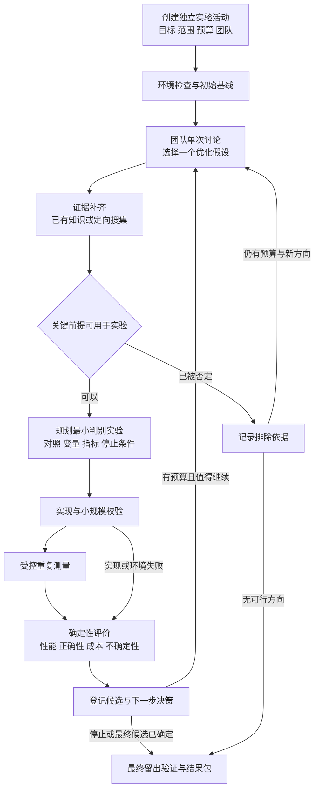

# 独立算子优化实验流程搭建方案

> 日期：2026-09-05
>
> 状态：开发中；2026-09-08 正在并行修复和集成审查，尚未通过完整真实实验验收。
>
> 版本：V1.1（纳入接口、投影与执行链审查）
>
> 文档用途：对齐产品行为、实验方法、复用边界和实施顺序，供后续开发与验收使用。
>
> 当前完成范围：方案已获准实施；独立活动、基线、轮次、测量和讨论桥已进入代码与本地测试阶段。当前实现与剩余缺口见第 17 节；未启动付费模型调用或真实 GPU 实验。
>
> 本地代码观察基线：初稿 `7a109dea3`；本次审查以 `ec9eb46a4` 为起点，核对至 `0101f9225`，修订时确认 `21b29e25a` 的相关差异未消除第 4.2 节六项发现。代码与隔离测试证据不等于真实运行验收；实施前核对届时版本。
>
> 关闭条件：本方案被替代，或功能、真实实验和交付验收完成后，更新状态并移入 `docs/archive/plans/`，同步移除在研索引。本文不覆盖根 AGENTS.md 和现行规范。

## 1. 目标与已经对齐的需求

搭建一条独立于挑战杯方向 A 的算子优化实验数据流。研究方向固定，团队每轮根据当前实现、真实测量和失败记录提出值得验证的优化假设，补齐证据，规划和执行实验，再把结果带回团队讨论。

系统的主要产出是可复现的优化实现、优化适用范围、失败原因及连续实验记录。假设生成服务于改进指定算子，不承担开放科学选题和 125 题批量假说生产。

已确认的产品要求：

1. 单独的实验入口和数据流，不依赖方向 A 的 125 题生成、整包审批和整包知识发布。
2. 复用现有团队、单次讨论、知识搜集、实验规划、执行和反馈能力；有具体不适配再作有界改造。
3. 每轮只有一次有明确结束点的优化讨论，输出下一项值得测试的优化假设。
4. 讨论后围绕假设补齐资料，随后规划实验；每次实验结束后，真实结果必须进入下一轮讨论。
5. 优先选择高 ROI 的改进；既记录性能收益，也记录模型、编译、搜索和测量成本。
6. 固定初始基线，保留当前最佳实现和失败候选，不把最近运行的候选自动当成下一轮基线。

本方案不把“算子更快”表述为证明 SCI-091 的计算绝对上限。方向 B 的核心是一个真实、可解释、可复现的实验反馈闭环。

## 2. 建议默认值与仍需确定的事项

下表用于让方案具体可审阅，尚未回复的选择不是已批准配置。批准方案也不等于已授权其中的付费调用、依赖安装或真实实验。

| 项目 | V1 建议 | 状态与影响 |
| --- | --- | --- |
| 首个算子 | Softmax，后续再扩展 LayerNorm、逐元素融合等 | 首例建议；不要求一次完成三类算子 |
| 主要目标 | 在正确性和精度约束内降低延迟；同工作量下附带报告吞吐 | 待确认；多目标会改变候选比较与晋升规则 |
| 可改动范围 | 参数、分块、并行布局、融合与数学等价的计算实现 | 待确认；不默认放宽精度或改变算子语义 |
| 每轮选择 | 最多 3 个简短候选，选 1 个主假设执行 | 方案建议，避免候选数量失控 |
| 团队讨论 | 复用已有成员和角色，每轮一次受限会议并形成结构化结论 | “一次会议”不承诺等于一次模型调用 |
| 首期执行并发 | 单 GPU 串行测量，每轮 1 个主候选族 | 方案建议，避免相互干扰和显存竞争 |
| 模型 | 使用符合方向 B 要求、可提供调用凭证的 Qwen 路由 | 具体型号、账号路由和额度在运行前确定 |
| 自动推进 | 在明确批准的活动预算及动作范围内自动推进 | 未批准预算时只可保存方案，不能派发真实调用 |
| 设备环境 | 先评估本机 RTX 4060 Laptop 8GB 的 Linux/WSL2 CUDA 路径 | GPU 型号此前已实查；WSL 发行版与依赖可用性尚未验收 |
| 产品界面 | 团队科研工作区增加“算子优化实验”独立入口 | 本文定义信息与行为，视觉方案需后续预览验收 |

运行预算建议见第 11 节。具体币种金额、GPU 时间和有效模型路由必须显式填写，不以空值或无限值代替授权。

## 3. 成熟项目调研与复用裁决

调研方式为官方文档、GitHub 元数据与固定提交源码只读核对，没有安装、运行或复制外部框架。以下仓库在调研时均未归档；近期提交只表明维护活动，不证明与本项目兼容或科学结果可靠。

### 3.1 方法与项目对照

| 来源 | 实际设计与代码证据 | 本方案借鉴 | 不采用或暂缓的部分 |
| --- | --- | --- | --- |
| NIST 实验设计手册 | 先确定比较、筛选、优化等实验目的，再选择因素、响应和设计；考虑交互效应、随机顺序与区组 | 实验单先写本轮问题，再写变量、对照与评价；按干扰因素组织测量 | 不机械要求每次只改一个因素；不把所有实验都升级为完整统计建模 |
| Microsoft RD-Agent | `Hypothesis2Experiment.convert` 将假设变为具体实验；`Experiment2Feedback` 消费执行结果；`Trace` 保存实验和反馈关系；优化策略区分初始解、改进和组合 | 工作假设、计划、执行、反馈分离；每轮有来源和父候选；讨论使用实际历史 | 不导入整个金融/数据科学场景、路由器和代码生成框架；首期不做多树搜索或候选合并 |
| Ax | 分开配置参数空间、目标和结果约束；用 Trial 记录参数及运行状态；`complete_trial` 不要求全部指标齐全；停止策略综合已完成试验与收益窗口 | 试验身份、指标完整性与优化结论分离；参数范围和停止条件提前确定 | 不直接采用“COMPLETED 即可评估”；首期不引入贝叶斯优化依赖，不照搬 IQR 停止阈值 |
| Kernel Tuner | `tune_kernel` 接收参数、限制、正确答案/校验器、计时配置；串行 runner 预热并分别记录编译、验证、测量时间；限制试验次数和时间 | 正确性优先、参数合法性、测量成本分账、重复配置复用、设备身份记录 | 不把缓存中的旧性能作为新鲜实测；其多后端支持不等于当前 Triton 路径已适配，首期只借结构 |
| AI Scientist-v2 | 实验经理划分可运行实现、基线调优、研究改进、消融四阶段，保留节点日志和阶段预算 | 先建立可信基线，成功改进后补必要消融与复验 | 不导入自动写论文和完整树搜索；不采用“运行太快便扩大模型/数据”的启发式，这不符合成本导向 |

### 3.2 固定源码证据

| 项目 | 核对提交与许可证 | 已核对位置 |
| --- | --- | --- |
| RD-Agent | `32b3d395e73d9db5eee3fe9063d69aec0fdc83bd`；2026-09-04；MIT | [proposal.py](https://github.com/microsoft/RD-Agent/blob/32b3d395e73d9db5eee3fe9063d69aec0fdc83bd/rdagent/core/proposal.py)、[rd_loop.py](https://github.com/microsoft/RD-Agent/blob/32b3d395e73d9db5eee3fe9063d69aec0fdc83bd/rdagent/components/workflow/rd_loop.py)、[优化策略说明](https://github.com/microsoft/RD-Agent/blob/32b3d395e73d9db5eee3fe9063d69aec0fdc83bd/rdagent/scenarios/data_science/proposal/exp_gen/README.md) |
| Ax | `778e22ffdb05fb8a0a5e8527c283d102a598f7da`；2026-09-03；MIT | [client.py](https://github.com/facebook/Ax/blob/778e22ffdb05fb8a0a5e8527c283d102a598f7da/ax/api/client.py)、[收益停止策略](https://github.com/facebook/Ax/blob/778e22ffdb05fb8a0a5e8527c283d102a598f7da/ax/global_stopping/strategies/improvement.py) |
| Kernel Tuner | `24d7c23d7ed86b77153ca2a7079a245a225875b3`；2026-08-21；Apache-2.0 | [interface.py](https://github.com/KernelTuner/kernel_tuner/blob/24d7c23d7ed86b77153ca2a7079a245a225875b3/kernel_tuner/interface.py)、[core.py](https://github.com/KernelTuner/kernel_tuner/blob/24d7c23d7ed86b77153ca2a7079a245a225875b3/kernel_tuner/core.py)、[sequential.py](https://github.com/KernelTuner/kernel_tuner/blob/24d7c23d7ed86b77153ca2a7079a245a225875b3/kernel_tuner/runners/sequential.py)、[策略预算](https://github.com/KernelTuner/kernel_tuner/blob/24d7c23d7ed86b77153ca2a7079a245a225875b3/kernel_tuner/strategies/common.py) |
| AI Scientist-v2 | `96bd51617cfdbb494a9fc283af00fe090edfae48`；2025-12-19；自定义 The AI Scientist Source Code License | [agent_manager.py](https://github.com/SakanaAI/AI-Scientist-v2/blob/96bd51617cfdbb494a9fc283af00fe090edfae48/ai_scientist/treesearch/agent_manager.py)、[预算配置](https://github.com/SakanaAI/AI-Scientist-v2/blob/96bd51617cfdbb494a9fc283af00fe090edfae48/bfts_config.yaml)、[许可证](https://github.com/SakanaAI/AI-Scientist-v2/blob/96bd51617cfdbb494a9fc283af00fe090edfae48/LICENSE) |

NIST 对应依据：[实验目标](https://www.itl.nist.gov/div898/handbook/pri/section3/pri31.htm)、[因素与交互作用](https://www.itl.nist.gov/div898/handbook/pri/section3/pri32.htm)、[随机化](https://www.itl.nist.gov/div898/handbook/pri/section3/pri331.htm)、[区组控制](https://www.itl.nist.gov/div898/handbook/pri/section3/pri332.htm)。

复用结论：优先复用 Vibelution 的运行、讨论、知识和实验合同；参考 RD-Agent 的反馈结构及 Kernel Tuner 的测量设计；Ax 作为未来参数搜索可选能力；AI Scientist-v2 仅参考阶段组织。新流程不新增这些完整框架依赖。真实 GPU runner 所需 PyTorch、Triton 和剖析工具另行做环境准备与版本固定。

## 4. 当前项目能力与准确缺口

### 4.1 能力与复用边界

| 能力 | 当前证据 | 需要做的工作 |
| --- | --- | --- |
| 实验与反馈模式 | [experiment_contract.py](../../core/research/experiment_contract.py) 已有 `experiment_feedback`，目的包括对照、证伪、消融、复现和稳健性 | 新算子优化配置复用这些语义，不另建相同实验合同 |
| 单轮团队讨论 | [meeting_rounds.py](../../core/web/services/team_workflow/meeting_rounds.py) 有会议创建/闭合和探索草案身份；[chat_room_service.py](../../core/web/services/chat_room_service.py) 可启动一轮群聊 | 增加算子优化议程、上下文与结构化结论，复用现有执行链 |
| 独立知识搜集 | [knowledge_sideflow_definition.py](../../core/research/workflow/knowledge_sideflow_definition.py) 已定义搜集、提炼、关系、入库与交接 | 接受本轮假设和证据缺口；允许复用已有知识快照 |
| 现有自动搜集触发 | [knowledge_sideflow_trigger.py](../../core/web/services/team_workflow/research_runtime/knowledge_sideflow_trigger.py) 在问题理解完成后触发，面向后续假说设计 | 新流程从优化讨论输出触发，不能直接复用该硬编码顺序 |
| 正式假说与规划交接 | [experiment_stage_bootstrap.py](../../core/web/services/team_workflow/research_runtime/experiment_stage_bootstrap.py) 在 `hypothesis_design` 建立实验轮次，要求知识包；[agent_task_artifact_builder.py](../../core/web/services/team_workflow/research_runtime/agent_task_artifact_builder.py) 要求原假说任务聚合产物 | 为优化假设增加合法的结构化交接，不伪造原有假说任务完成 |
| 工作流定义与账本 | [definition_registry.py](../../core/research/workflow/definition_registry.py) 以工作流 ID、版本和结构哈希固定定义 | 复用版本固定与账本；创建入口、Agent 绑定、readiness 和分派目前含旧流限制，须按第 10.2 节贯通 |
| 方向 A/B 阶段依赖 | [challenge_phase_boundary.py](../../core/web/services/team_workflow/challenge_phase_boundary.py)、[research_loop.py](../../core/web/services/team_workflow/research_loop.py)、[experiment_api/plan.py](../../core/web/services/team_workflow/experiment_api/plan.py) 检查方向 A 整包状态 | 新流按服务端保存的实验身份和运行策略进入，不靠遗漏字段或伪造题目 ID 绕过旧入口 |
| 实验执行与结果登记 | [experiment_api/full_run.py](../../core/web/services/team_workflow/experiment_api/full_run.py) 有准备、执行、登记；[iteration_decisions.py](../../core/research/workflow/iteration_decisions.py) 有重跑、修订、晋升、回滚、停止 | 复用生命周期与决策语义；旧 full-run 的项目定位和适配器白名单不能直接服务新流，接入裁决见第 10.6 节 |
| GPU 适配器 | [gpu_operator.py](../../core/research/experiment_adapters/gpu_operator.py) 当前为 CPU fixture，明确不产生真实性能结论 | 开发可核验的真实 GPU adapter；DEV fixture 保持明确身份，不能作为运行失败后的性能替代 |

主要缺口是独立入口、优化假设合同、讨论后知识交接、活动级循环和真实 GPU 执行。没有必要重写普通 Session、群聊引擎、知识检索引擎或全部科研框架。

### 4.2 接口与投影审查发现及处理清单

F1 是已复现的现有接口缺陷；F2–F6 主要是新流程与既有合同的接入差异。下表全部为待实施项，纳入方案不代表代码问题已解决。

| 编号 | 已核对事实与影响 | 必须落地的修订 | 完成判据与阶段 |
| --- | --- | --- | --- |
| F1 项目身份丢失 | 前端 [useTeamExperimentLoopMutations.ts](../../web/src/routes/teams/useTeamExperimentLoopMutations.ts) 发送 `researchProjectId`，但 [_models.py](../../core/web/routes/team_workflows/_models.py) 的创建/执行请求模型未声明该字段；Pydantic 将其丢弃。`full_run.py` 准备/执行时又按当前活动项目加载计划，切换项目后可找不到原计划 | 修正 HTTP DTO、服务参数、计划定位及结果回写的项目身份；既存计划按其保存的归属解析，禁止以当前页面选择代替 | P0：字段穿透实际请求模型；计划创建后切换项目仍能准备、执行、登记到原项目，伪造归属被拒绝 |
| F2 新定义无法直接派发 | [run_creation.py](../../core/web/services/team_workflow/research_runtime/run_creation.py) 的公共入口拒绝新 workflow ID；[bindings.py](../../core/research/workflow/bindings.py) 仍按挑战杯定义生成绑定；[readiness/service.py](../../core/web/services/team_workflow/research_runtime/readiness/service.py) 默认只有旧流和知识侧流 | 独立创建入口使用服务端目标配置，绑定与执行能力检查消费 run 固定的定义；补齐新节点分派和产物写回 | P0–P1：没有 125 题结果也能创建、显示、派发新节点；绑定归属与节点集合正确，旧流回归通过 |
| F3 前端工作区与缓存绑定旧流 | [ResearchProcessWorkspace.tsx](../../web/src/routes/teams/research-workflow/ResearchProcessWorkspace.tsx) 固定加载挑战杯目录并拼入原假说区域；[useTeamResearchSecondaryQueries.ts](../../web/src/routes/teams/useTeamResearchSecondaryQueries.ts) 的实验缓存按团队区分 | 独立活动控制器和汇总投影；复用基础画布、单 run 快照与事件订阅；活动/轮次身份进入 URL、查询键和失效处理 | P1/P6：刷新、切换活动、乱序回包和断线恢复不串数据；新流不渲染原批量假说区域 |
| F4 活动对象语义冲突 | [ExperimentCampaign](../../core/research/workflow/contracts/experiment_campaign.py) 绑定一个 run、一项假说与一份协议；[run_domain_queries.py](../../core/web/services/team_workflow/research_runtime/run_domain_queries.py) 也是单 run 投影，不能直接承担跨轮次活动总账 | 明确外层 `OptimizationCampaign`、轮次、WorkflowRun、内层 ExperimentCampaign 和 trial 的映射；外层统一管理预算上限与最佳候选引用 | P0/P4：两轮不同 run/协议归于同一外层活动；费用去重累计，重复终态只创建一次下一轮 |
| F5 讨论到规划缺少可消费交接 | [agent_task_artifact_builder.py](../../core/web/services/team_workflow/research_runtime/agent_task_artifact_builder.py) 要求原 TaskBundle 聚合；知识自动触发只消费问题理解产物；会议自动闭合仍经原 hypothesis-first 策略 | 增加有版本和 hash 的优化假设转换、讨论后知识调用及接受回执、规划输入转换；活动策略只接管本活动动作，不冒充原流程完成 | P3：一轮会议产生一个主优化假设，资料可复用或补齐，随后冻结计划；缺产物、反证和重复回调均有明确结果 |
| F6 GPU 入口与评价不连通 | [gpu_operator.py](../../core/research/experiment_adapters/gpu_operator.py) 属 DEV dispatcher；[experiment_kernel.py](../../core/web/services/team_workflow/experiment_kernel.py) 的正式入口只接受两个既有适配器；[real_domain_ports.py](../../core/web/services/team_workflow/research_runtime/real_domain_ports.py) 的 bounded 评价含固定评分/覆盖率 | 采用第 10.6 节明确的新流执行口，接入真实 kernel runner 与数值评价；保留失败证据回流，不能只加一个 registry 条目便宣称可运行 | P2/P4：从冻结输入到真实设备、原始 timing、正确性及终态回执可追溯；错误 kernel 无加速结论，失败仍能进入下一轮讨论 |

### 4.3 审查证据与未验证范围

本轮前置审查通过了工作流定义/readiness 注册、实验请求响应合同、DEV dispatcher/GPU fixture、后端快照、前端快照/上下文/URL/运行 hook，以及会议和知识子流的部分身份、重放和复用测试。它们证明已有基础能力在相应测试条件下成立，不覆盖新活动端到端。

隔离检查还确认：两个请求模型均丢弃 `researchProjectId`；显式项目准备调用仍以空项目参数查找并报 `Experiment plan not found.`；新 ID 报 `unknown_workflow`；绑定工厂仍返回 `challenge-cup-research`；GPU adapter 被正式 full-run 白名单拒绝。检查未连接真实模型、GPU 或产品运行数据。本次文档修订复用这些证据，不将它们写成已修复或新流验收通过。

## 5. 产品流程与每一步的输入输出



### 5.1 创建与基线

输入包括算子语义、工作负载范围、目标设备、主要指标、正确性要求、可变范围、预算以及参与团队。首次运行先建立可信基线；已有基线也必须检查代码和环境指纹是否仍适用。

基线准备失败时产出环境/复现诊断，不能继续生成性能优化结论。此时的局部修复只恢复已定实验条件，不扩展研究方向。

初始基线使用活动内独立的 `baselineSetup` 记录与冻结测量协议，不要求先存在优化假设或原 `hypothesis_design` 产物；它仍须有候选代码、环境、输入、预算和真实执行回执。此切口在 P2 提前验证，避免先完成多轮编排后才发现 GPU 路径无法使用。

### 5.2 单次优化讨论

讨论上下文包含：目标与限制、初始基线、当前最佳实现、上一轮原始测量摘要、错误与剖析证据、历史已尝试改动、已有知识和剩余预算。首次讨论使用初始基线报告。

复用团队角色能力，按议程承担瓶颈解释、实现可行性、反证与评价、结论汇总；不为角色名称新建多个常驻 Agent。会议发言次数、输入上下文和模型调用上限可计量，结束后产出结构化记录。

每轮最多保留 3 个简短候选，只选择 1 个主假设。其余只保留理由和是否值得后续考虑，不能在后台自行启动。单次讨论结束后不追加一套多轮假说评分和 Pareto 评审。

### 5.3 补齐资料

先检索本活动和已授权知识来源，已有证据足够则绑定快照直接交接；不足时按缺口定向搜集成熟实现、硬件约束、边界与反证。不是每轮重搜完整课题。

每个检索请求都必须对应一项待判断主张。知识条目区分外部先验和本活动实测，保留来源、适用设备/版本、支持或反对关系及不确定性。

关键前提已被反证时记录该假设被排除，终结当前轮的准备阶段，再由下一轮讨论选择方向；这类记录计入讨论和搜集成本，不计作已执行实验。证据不充分但实验本身能够区分解释时，可以规划验证，不要求先“证明假设成立”。

### 5.4 实验规划

输入为选定假设、证据快照、当前最佳实现和约束。输出具体实验单：目的、对照、变化因素、固定因素、配置组合、输入集合、正确性容差、计时方法、重复方式、预算、停止条件及结果分支。

规划阶段将探索草案整理为可检验的优化假设，不再调用原有开放式假说生成流程。实验组与对照必须能回答本轮问题；因素交互显著时允许小规模组合设计。

计划可先用小样验证可执行性，再锁定正式测量版本。调整语义、容差、主要指标或输入分布属于契约变更，不得为过关静默修改。

### 5.5 实现、运行与评价

候选代码在任务专属工作区生成，保留源代码和编译配置哈希。先校验和编译，再正确性检查，最后运行性能测量；失败留下真实记录，不能用预制数字补齐。

执行器采集原始值，确定性程序计算比较结果。LLM 负责解释和下一轮建议，不生成替代测量数字。一个假设可能需要多个参数配置；每个配置是独立试验，试验完成不等于假设得到支持。

### 5.6 下一轮与最终验证

每轮结束形成三类独立判断：执行是否成功、假设获得支持/反驳/仍不确定、候选是否可成为当前最佳实现。失败也必须回到下一轮讨论；重复已知失败需有新的理由或证据。

相同协议重跑用于确认噪声或可复现性，不是新的优化发现；变更算法或协议则产生新候选/计划版本。预算内的普通下一轮自动推进，具体授权与停止边界见第 11 节。

## 6. 优化假设与 ROI 选择

### 6.1 优化假设最小字段

| 字段 | 内容 |
| --- | --- |
| `hypothesisId / revision` | 唯一身份与修订版本 |
| `optimizationCampaignId / roundId / parentCandidateRef` | 外层优化活动、轮次与起始实现；不与内层 ExperimentCampaign 的 `campaignId` 混用 |
| `observationRefs` | 触发改进的实测、错误或已有证据 |
| `proposedChange` | 准备改变的参数、布局、融合或计算方式 |
| `mechanism` | 为什么预计有效，哪些步骤构成因果解释 |
| `prediction / scope` | 预期哪一指标在何种输入和环境下怎样变化 |
| `alternativeExplanations / falsifiers` | 竞争解释和削弱该假设的结果 |
| `evidenceGaps` | 需要补齐的资料与判断用途 |
| `estimatedCost / roiRationale` | 成本区间、粗粒度收益预期、依据与不确定性 |
| `selected / rejectionReason` | 本轮选择及未选择的原因 |

示例：大行宽上检测到寄存器使用量上升和吞吐下降；假设采用分块归约可降低单程序资源占用，在指定行宽区间抵消额外读写并改善延迟。竞争解释是额外访存主导、或性能变化来自频率波动。上述数字和现象须由实际基线补齐，目前仅为方案示例。

### 6.2 ROI 排序方法

先排除超范围、不可测、没有可执行路径或已被相同证据否定的候选。对剩余候选比较：观测依据、预期影响范围、实现/验证成本、成熟实现可复用程度、失败后的信息价值。

V1 使用高/中/低与简短依据，不做任意加权总分，不把 LLM 猜测的成功率乘入一个看似精确的收益数值。性能收益优先时，纯诊断实验需说明它会解除哪项阻塞，且不应持续吞噬优化预算。

实验后记录实际模型使用量、编译时间、测量时间、候选收益和覆盖范围。成本不完整时标为未知，不记作零成本。高 ROI 的选择质量由后续结果审计，而不是由讨论结论自我认证。

## 7. 独立数据流与唯一事实源

### 7.1 独立身份

为新流程注册独立的工作流类型，例如 `operator-optimization`，并保存服务端配置的实验模式与版本。名称为拟定，不是已存在 API。

外层新增 `OptimizationCampaign`，固定目标、预算、团队、研究项目、设备与初始基线；活动下有连续讨论/实验轮次。现有 `ExperimentCampaign` 继续表达单次计划的执行合同，不能直接改成外层活动或把一份协议覆盖成下一轮协议。

| 对象 | 归属与身份 | 权威边界 |
| --- | --- | --- |
| 外层优化活动 | `teamId / researchProjectId / optimizationCampaignId` | 配置版本、预算授权、初始基线、当前最佳、轮次引用；由新活动服务写入 |
| 基线准备 | `optimizationCampaignId / baselineSetupId / runId` | 新定义中的基线准备入口，使用独立冻结协议和执行回执；不占优化轮次，不要求先生成假设 |
| 优化轮次 | `optimizationCampaignId / roundId / runId` | 固定开始时的最佳候选；关联会议、假设、知识快照、计划；节点状态读 Workflow Ledger |
| 单计划实验合同 | 现有 `ExperimentCampaign.campaignId / runId / protocolHash` | 一个 run 和冻结协议的执行合同；外层通过明确引用关联，不改写旧字段语义 |
| 配置试验 | `roundId / planId / trialId / attempt` | 候选配置与执行回执；重试属于原试验，改算法或协议产生新版本 |

`ResearchScopeEnvelope.campaign` 在新流中绑定外层 `optimizationCampaignId`，与内层 `ExperimentCampaign.campaignId` 分字段保存。新流的研究目标身份由服务端配置导出，不借用 `SCI-091` 编号或补造方向 A 的 `catalogScope`。固定方向与“科学题目包”在入口合同中区分。

```
实验活动
  ├─ 初始基线与当前最佳候选引用
  ├─ 第 1 轮 → 会议 → 假设 → 知识快照 → 计划 → 试验与评价
  ├─ 第 2 轮 → 消费第 1 轮评价与新观测
  └─ 最终候选 → 留出验证 → 可复现结果包
```

普通会话 Session/Journal/SSE 继续是讨论文本与实时输出的权威。活动对象只保存会话和会议引用，不建立第二份聊天全文。

### 7.2 数据所有权

| 数据 | 唯一写入者与权威 | 其他模块的使用方式 |
| --- | --- | --- |
| 活动配置、预算授权、初始基线、轮次引用、当前最佳 | 新活动服务，复用研究项目身份与存储定位 | 不可变配置版本；最佳引用和下一轮安排按活动版本更新；投影读取 |
| 节点状态、调度命令、取消与恢复 | 现有 Workflow Ledger 和 command service | 活动投影组合活动控制状态与各 run 账本，不双写另一套节点状态 |
| 会议文本与结构化结论 | 原生会话链及 MeetingRound 服务 | 保存引用和有界摘要 |
| 优化假设 | 会议闭合后的专属结构化 artifact | 搜集和规划按版本/hash 读取 |
| 知识内容 | 现有 Team Knowledge 写入与来源机制 | 实验使用不可变证据快照与本轮关联 |
| 计划与协议 | 现有实验计划服务，增加优化配置扩展 | runner 只消费冻结版本 |
| 原始测量与环境回执 | 真实实验 adapter 输出 artifact | 评价程序读取；LLM 无权覆盖原始值 |
| 评价与活动级候选选择 | 数值评价器写不可变评价；活动服务提交选择命令 | 会议只提出建议；评价器不直接改最佳候选指针 |
| 实际成本 | 已发生调用/设备试验的原始费用与时间回执 | 外层按回执身份去重汇总；讨论、知识子 run、执行和最终验证均计入同一预算 |

存储路径必须由当前研究项目/实例的 resolver 生成。新实验有独立 namespace 和 artifact 根，不硬编码用户名或 Documents 路径，不在 checkout 写真实实验数据。具体布局在实现时落到现有 locator，不增加平行的通用存储框架。

现有实验计划是项目目录中的 JSON 领域记录，节点运行状态是 Ledger 权威。复用时由一个计划领域写入者登记产物，再经现有受管回执/事务与恢复机制关联到 run；HTTP、活动协调器和投影不能分别写同一份计划。只有完成内容 hash、所属项目/活动/run 和回执的关联校验，节点才可交接。不得把“JSON 中有计划”直接投影为“账本节点已完成”。

复用同一团队成员不复用同一运行会话和可变上下文。方向 A 的内容只在显式选择后作为有来源的参考输入，不能自动成为新实验的成功证据。

### 7.3 版本、幂等与恢复

每次真实派发绑定 `teamId / researchProjectId / optimizationCampaignId / runId` 和策略版本；基线准备关联 `baselineSetupId`，优化轮次关联 `roundId`。具体试验再绑定 `trialId / attempt / protocolHash / candidateHash / environmentHash / workloadHash`；讨论和知识步骤绑定已有父产物，不补造尚未生成的计划或试验身份。同一命令重试不能产生第二次会议或第二次付费实验；已有回执能恢复时，继续读取原回执。

每轮使用开始时固定的最佳候选引用，不能在运行中被另一轮悄悄替换。活动级选择采用现有命令/CAS 思路验证预期旧版本；不新建全局锁服务。

外层活动与单 run 有各自的版本号：活动命令检查 `expectedCampaignVersion`，节点命令检查 `expectedRunVersion`。活动服务按本轮终态事件和评价回执登记一次选择与下一轮意图，重放同一事件只能返回原结果；不能因为两次回调分别创建两场付费会议。预算先在活动内预留，再绑定到实际子任务；累计投影不另行产生扣费。

活动级“暂停/恢复”由新服务承担：暂停表示不再派发下一项工作，已经开始的工作按既定策略结束并留下回执；立即终止使用取消并等待执行器终态。现有 run 命令集不等于已有活动暂停能力，不能在前端改一个状态字段冒充暂停成功。

取消通过现有认证命令与可追踪执行器传递。取消或超时留下终态与已发生的成本，不产生成功评价；待执行任务不再派发。恢复时重新检查设备与输入指纹，不能把旧设备测量拼进新环境比较。

## 8. 科学评价和候选晋升

### 8.1 三个独立层次

| 层次 | 示例状态 | 判断依据 |
| --- | --- | --- |
| 执行 | 成功、编译失败、正确性失败、测量无效、取消 | 程序与设备回执 |
| 假设判断 | 支持、反驳、不确定 | 预先声明的预测、对照、反证和不确定性 |
| 候选价值 | 暂定最佳、未优于最佳、适用范围较窄、不可接受 | 同条件比较和固定约束 |

只有必要指标齐全、正确性合格、比较有效时才进入候选选择。`succeeded`、群聊完成或试验结束均不能替代上述判断。

### 8.2 输入集合与调优偏差

至少分开：调优/诊断输入，以及最终审计留出输入。调优集的结果允许反馈给团队并用于更新“当前最佳”；它不是独立泛化验证。

最终候选和评价协议锁定后，才使用留出输入。该结果不得再反馈到同一轮搜索并继续宣称留出集未被使用；若需要据此修订，创建新的研究版本并重新准备独立验证。所有集合都保存版本、种子、shape/dtype 和来源规则。

### 8.3 正确性和测量

- 算子数学语义、layout、边界输入、累加精度与容差在协议中明确；不同 dtype 不机械使用同一个容差。
- 参考输出使用可信实现或更高精度计算，并检查数值范围、极端但合法的有限输入和结构性质。NaN/Inf、任意 stride 等只有声明支持时才纳入，不无边界扩展语义。
- 错误候选不能计入加速收益。参数搜索不能修改验证器、测试输入或计时脚本来获得分数。
- GPU 测量要预热、同步；基线与候选交错或随机安排。记录设备、驱动、运行时、温度/频率观测和其他负载；不可读字段明确缺失。
- 记录独立测量块中的原始样本，报告 median、P95、效应量与适当的不确定性。连续 launch 不是许多独立设备重复；统计以独立块或配对批次为单位。
- 编译、搜索、数据准备、剖析和稳定运行耗时分别报告。能耗无法可靠测量时仅作缺失项，不从功率上限推算实际能耗。

### 8.4 当前最佳与最终结论

初始基线永久固定。当前最佳是通过调优集评价后的活动级候选引用，允许在确认范围内更新；候选既对比当前最佳，也报告相对初始基线的累计改进。

建议在预实验后固定实用收益门槛与退化上限，不预先把任意 10% 当成科学事实。逐 shape 报告，汇总可用延迟比几何平均，但不能隐藏关键工作负载退化。若汇总输入带权重，权重必须在测量前确定。

短期未改善不自动否定机制假设；机制被反证也不妨碍保留独立测得的工程收益，但结论必须分开。更换目标 GPU、精度、主要指标或工作负载分布时，建立新的比较协议，不把分数混入旧榜单。

## 9. 首个 Softmax 实验配置

首例采用按行 Softmax：`y[i,j] = exp(x[i,j] - max(x[i,:])) / sum(exp(x[i,:] - max(x[i,:])))`。首期建议连续二维输入，FP16/FP32，明确归约累加精度；更复杂布局后续扩展。

基线包括 PyTorch 原生实现和适用的 Triton 官方融合示例；`torch.compile` 在环境支持并事先登记时加入。基础融合已有成熟先例，本活动的研究对象是具体硬件、输入范围和优化决策的有效性。

可从行数与行宽组合中选择小型冻结集合。行宽应覆盖 2 的幂及其附近尺寸，以及可能进入不同资源区间的较宽输入。完整组合数量由显存、预实验波动和预算决定，不能只选择最有利的 shape。

候选方向示例包括程序并行度、分块归约、数据布局、减少中间读写、按输入特征选择实现。每轮只能选择其中一个有依据的主假设；候选内部可做受限参数试验。

示例两轮闭环：

| 环节 | 第 1 轮 | 第 2 轮 |
| --- | --- | --- |
| 输入 | 初始性能和资源剖析 | 第 1 轮真实成功/失败、开销与参数记录 |
| 假设 | 分块可能改善大行宽资源压力 | 仅在第 1 轮有依据时，检验另一块大小或并行策略 |
| 证据补齐 | 官方 kernel、资源约束、分块额外读写 | 补第 1 轮仍无法解释的具体缺口 |
| 实验 | 同一语义和输入下对照实现 | 保持评价协议，改变所声明的实现因素 |
| 输出 | 支持/反驳/不确定及候选价值 | 解释改善或未改善，并决定继续或停止 |

此表是待执行路径，不预设第 1 轮必然遇到某个问题，也不为展示反馈而人为制造失败。

## 10. 系统结构、API 与界面

### 10.1 推荐结构

独立注册一份算子优化工作流定义，复用现有版本注册、账本、命令、任务派发和事件投影。活动协调服务只负责固定配置、组织连续轮次和推进最佳候选引用；每轮状态仍来自已有账本。

原科研流程继续按原合同运行。新入口的服务端身份决定所用定义与权限，不通过 `SCI-091` 等题目编号推断类型，也不删除旧流的整包门禁来放行所有实验。

复用模块时引入明确的调用上下文，不复制完整服务。对原 `hypothesis_design` 的知识包和任务聚合要求，新流应提供独立合法产物转换路径；不能伪造已通过的旧节点或建立“缺少就自动成功”的分支。

### 10.2 拟定影响面

以下新增文件名和 API 为方案落点，尚未创建；实施前按当前 owner 和 claim 核对。

| 责任 | 现有落点/拟新增位置 | 边界 |
| --- | --- | --- |
| 优化领域合同（F4） | `core/research/` 新增紧凑优化合同；对照 `core/research/workflow/contracts/experiment_campaign.py` | 外层活动、轮次与单计划合同分开；不改变已有 `campaignId` 的含义 |
| 项目身份贯通（F1） | `core/web/routes/team_workflows/_models.py`、服务层 `experiment_api/plan.py`、`experiment_api/full_run.py`、`workflow_ops.py`、`research_projects.py` | DTO 接收并校验项目字段；后续定位使用记录归属；修正根因，不靠页面不许切换规避 |
| 定义与绑定（F2） | `core/research/workflow/definition_registry.py`、`core/research/workflow/bindings.py` 及新定义/版本快照 | 绑定消费所选定义；创建后按 run 固定版本解析，不从旧工作流定义取节点 |
| 创建、readiness 与分派（F2） | `research_runtime/run_creation.py`、`research_runtime/service.py`、`research_runtime/readiness/service.py` 及对应节点执行映射 | 公共入口接受新身份；检查目标配置与本轮产物；节点分派、artifact 写回及快照使用同一固定定义 |
| 活动与轮次编排（F4） | `core/web/services/team_workflow/` 新增优化 pack，对照 `research_runtime/run_domain_queries.py` | 单一活动写入者；汇总预算、最佳候选和轮次引用；单 run 投影仍读原 Ledger |
| 讨论与产物转换（F5） | `meeting_rounds.py`、`meeting_runtime.py`、`research_runtime/automation_policy_executor.py`、`research_runtime/agent_task_artifact_builder.py` | 新议程和优化产物转换；闭合 hook 按活动策略路由，不修改普通 Session 语义或伪造 TaskBundle |
| 知识侧流与规划交接（F5） | `research_runtime/knowledge_sideflow_trigger.py`、`research_runtime/knowledge_sideflow_service.py`、`research_runtime/experiment_stage_bootstrap.py` | 接受讨论后的缺口或快照引用；新增合法规划输入，保留来源与删除重建语义 |
| 计划和结果权威（F1/F4/F6） | `experiment_api/plan.py`、计划存储、结果服务及 `core/research/workflow/iteration_decisions.py` | 项目 JSON 计划与 Ledger 回执关联；活动只提交领域命令，不绕过服务直接写文件 |
| 真实执行与数值评价（F6） | `core/research/experiment_adapters/`、新算子领域执行桥；对照 `experiment_kernel.py`、`core/research/formal_runner.py`、`research_runtime/real_domain_ports.py` | 按第 10.6 节接入受控 runner；成功和失败均有回执；不使用 bounded 固定分数评价 GPU |
| 活动 HTTP API（F1/F4） | `core/web/routes/team_workflows/` 新薄入口与显式 DTO | 请求模型、服务参数、存储定位及响应身份一致；业务和授权归服务 |
| 前端 API 与缓存（F1/F3） | `web/src/api/`、`useTeamExperimentLoopMutations.ts`、`useTeamResearchSecondaryQueries.ts` | 复用请求层；活动查询按团队/项目/活动区分，失效范围随真实归属确定 |
| 独立控制器与投影（F3） | `ResearchProcessWorkspace.tsx`、`useResearchWorkflowCatalog.ts` 的旧流耦合点；`web/src/routes/teams/` 新活动控制器 | 新入口不自动加载题库/HF 区域；复用画布、快照、单 run SSE 与 VUI 页面 recipe |

表中未写全的后端文件位于 `core/web/services/team_workflow/`，前端控制器位于 `web/src/routes/teams/` 及其 `research-workflow/` 子目录。这是责任划分，不要求把所有旧文件同时改造；先消除实际阻断新入口的耦合，再通过现有接口复用其余能力。

### 10.3 API 行为合同

拟提供活动创建/读取、启动、暂停、恢复、取消、轮次列表/详情、结果包读取。具体 URL 在 DTO 阶段确定；以下字段是待实现合同，不表示已有接口支持。

| 调用范围 | 必须保留的身份与版本 | 服务端约束 |
| --- | --- | --- |
| 创建活动 | `teamId / researchProjectId`、目标配置与策略版本；返回 `optimizationCampaignId` | 创建时解析并固定项目，校验其团队归属；后续不随当前活动项目切换 |
| 活动命令 | `optimizationCampaignId / expectedCampaignVersion / idempotencyKey`，携带所属团队/项目 | 按记录读取目标、预算和策略；检查版本后写入；客户端不能把自己声明为审批人 |
| 基线准备/执行 | `baselineSetupId / runId / expectedRunVersion`、冻结协议及代码/环境/workload 引用，绑定外层活动 | 使用明确的基线准备合同；同样校验预算和回执，不填虚假的优化假设或 `roundId` |
| 轮次/节点命令 | `roundId / runId / expectedRunVersion`，绑定外层活动 | run 必须属于该轮次和活动；定义及节点来源于该 run 的固定版本 |
| 计划准备、执行及登记 | `researchProjectId / planId`，关联 `roundId / runId / trialId / attempt` 及冻结产物 hash | HTTP DTO → 服务参数 → 计划存储 → 执行回执 → 结果关联全程保留项目和父引用 |
| 读取概览/详情 | 活动或轮次身份，响应带归属和投影版本 | 概览只含汇总与引用；原始产物按需读取；不存在和归属不匹配明确返回错误 |

F1 先修复现有创建/执行 DTO 吞掉 `researchProjectId` 的问题，再修复 `full_run.py` 准备和执行入口未向计划存储传递项目的问题。已创建记录按其保存的身份定位；若不能唯一确定归属，返回明确的缺身份错误，不以团队当前项目代替。跨项目提交的 `planId`、run 或活动引用必须校验，不能仅凭客户端字段迁移记录。

活动命令与 run 命令分开校验版本；同一动作重试返回原命令/回执，不重新派发付费工作。计划领域记录写入成功与 Ledger 节点完成是两项事实：由领域服务提交带产物引用的受管回执后才推进节点，恢复时按同一关联读取，不用前端状态补写。

服务端错误应明确为缺配置、缺证据、待设备、预算不足或执行失败。暂停/取消接口返回请求接受状态，界面分别展示“不再派发后续工作”和执行器确认的实际终态，不能将请求接受直接显示为设备已经停止。

### 10.4 界面与前端投影合同

#### 10.4.1 团队画布、详情与展开工作区（2026-09-06 已对齐）

用户已确认补充“团队画布中的活动入口 → 活动详情 → 展开实验工作区”的关系。独立指实验数据流与运行身份独立，不意味着脱离团队研究项目另建产品。现有隔离预览定位为活动展开后的工作区。

| 展示位置 | 展示时机与职责 | 导航和状态要求 |
| --- | --- | --- |
| 团队画布的实验活动入口 | 活动创建后展示算子、当前轮次、活动状态、当前最佳与待处理事项；未创建时提供新建入口 | 团队成员仍表达协作关系，实验活动表达研究任务；不要把每次测量扩展成团队成员节点 |
| 活动详情 | 用户点击已有活动时打开，优先展示当前轮次、最近结果与阻塞原因 | 保留团队画布上下文；提供“展开实验工作区”和关闭详情动作 |
| 展开的实验工作区 | 用户需要规划、查看原始证据或比较多轮时主动展开；新建活动时可直接进入配置起点 | 显示团队、项目、活动归属；提供“收起到活动详情”和“返回团队画布” |

三处消费同一个活动投影。展开、收起、返回与浏览器前进后退仅改变视图，不创建运行、不重新讨论、不扣费、不重置轮次。返回保留原画布选择与视口，重新展开保留已选轮次、节点与详情标签。运行自动推进时只更新摘要和当前状态，不强制把用户从历史轮次跳到下一轮；提供“查看当前轮次”动作。

URL 可恢复团队、项目、活动、轮次、run 与展示模式；深链接缺少画布历史时，返回活动所属团队项目。跨项目切换先更换查询身份并丢弃旧请求响应，不能把前一项目活动短暂投影到新项目。活动暂停与内层 run 执行中可以同时存在，应分别说明；失败轮次保留原因和真实费用，无有效测量时不显示性能分数。

新增验收：从画布打开详情、展开、选择历史轮次、收起、重新展开，选择保持一致；浏览器返回与刷新恢复相同活动；收到新轮次事件不抢走历史查看位置；空活动无完成记录；桌面详情与窄屏详情均可关闭和返回。

#### 10.4.2 成熟项目依据与借鉴边界

- [RD-Agent 的 PlaygroundPage](https://github.com/microsoft/RD-Agent/blob/32b3d395e73d9db5eee3fe9063d69aec0fdc83bd/web/src/views/PlaygroundPage.vue)提供轮次选择与 Process/Result 视图；同目录 Playground.vue 提供新运行和历史 trace 入口。借鉴运行、轮次、过程和结果的分层；其 Web UI 与数据科学 Streamlit 界面适用场景不同，不能混为一套已验证产品。
- [AIDE 的 Web UI](https://github.com/WecoAI/aideml/blob/60b3978ddf65b71f86eb7c64506965048a1398cf/aide/webui/app.py)提供目标/指标配置和实验树、最佳代码视图。借鉴候选与结果追溯，不引入其 Streamlit 技术栈。
- [AI Scientist-v2 的实验树模板](https://github.com/SakanaAI/AI-Scientist-v2/blob/96bd51617cfdbb494a9fc283af00fe090edfae48/ai_scientist/treesearch/utils/viz_templates/template.html)按阶段展示节点指标、分析、代码和图表，主要是研究运行的可视化产物。

上述项目支持实验运行视图及谱系追溯，不能证明必须采用独立整页，也不直接提供本项目的团队画布关系。画布入口、详情及展开是结合 Vibelution 既有团队上下文作出的产品适配；继续复用本地 VUI、Ledger、投影和 SSE，不复制外部界面实现。以下技术合同同时适用于三种展示位置。

独立入口展示目标算子、实验目标、设备和预算。运行页展示当前步骤、上一轮结论、当前最佳、累计成本及停止/恢复动作；轮次详情按“观测 → 假设 → 资料 → 计划 → 执行 → 结果”查看。

用户应能看懂：当前为什么做这个实验，和哪个版本比较，获得了什么真实证据，下一轮为什么继续。源码哈希、内部 ID 等保留在详情或导出，不堆入主流程。

新入口使用独立活动控制器，不在 `ResearchProcessWorkspace` 上简单替换标题：该组件当前会取挑战杯目录、固定 workflow ID 并拼入 HF 区域。新控制器消费服务端活动身份，复用已有画布、快照解析、事件 reducer 和单 run SSE；独立流不显示原批量假说区域。

| 投影层 | 内容与更新方式 | 验收约束 |
| --- | --- | --- |
| 活动概览 | 初始基线、当前最佳、轮次摘要、累计/剩余预算、活动状态、`activeRunId` 与活动 revision | 由活动服务只读汇总，单 run 完成不等于活动完成；不另存节点执行状态 |
| 当前轮次 | 选中轮次的 run 快照、节点、产物引用和执行终态 | 继续使用团队/run 身份的现有快照和 SSE；新活动引用必须与服务端归属一致 |
| 查询与失效 | 活动查询键含 `teamId / researchProjectId / optimizationCampaignId`，轮次详情再含 `roundId / runId` | 修正仅按 team 缓存实验的范围；写命令失效原活动的缓存，不依赖用户当前页面 |
| URL 与切换 | 保存项目、活动和所选轮次/run；缺省时由服务端概览选择当前轮次 | 刷新可恢复；切换时清除旧的活动绑定和订阅，旧请求即使晚返回也不能覆盖新选择 |
| 连续轮次与重连 | 活动运行期间有界刷新概览，revision 或 `activeRunId` 变化后连接对应 run；重连补拉快照 | 复用既有单 run 事件通道；切换到历史轮次时保持用户选择，不强制跳回；不复制 transcript 或建立第二套运行权威 |

P1 先提供创建/读取与最小快照投影，让后端链路可观察；P6 再闭合完整交互和真实浏览器验证。前端必须遵循 VUI 与页面 recipe，涉及的新 VUI 能力须登记 designs；布局记忆使用 `WORKBENCH_LAYOUT_IDS` 与共享 pane persistence。各阶段涉及界面时先做隔离预览，相关 route、API、VUI 契约和 TypeScript build 在该阶段交付前通过。

### 10.5 讨论、资料与实验规划的产物交接

新流的交接不能只靠修改会议 Prompt。现有 TaskBundle 聚合、问题理解后触发知识搜集，以及 `hypothesis_design` 实验 bootstrap 都有具体上游合同；新增转换必须接受本活动产物，而不是制造旧节点已经成功的记录。

| 交接 | 本活动的输入与产出 | 缺失或失败时的结果 |
| --- | --- | --- |
| 会议闭合 → 优化假设 | 读取真实会议 digest、候选及选定理由，生成一个有版本的 `OptimizationHypothesis` | 未闭合、无主假设或结构不合法时不创建计划；返回明确的讨论结果/修订原因 |
| 优化假设 → 资料准备 | 从主假设提取证据缺口；已有快照适用时复用，否则启动定向知识子 run | 资料不可得留下缺口；反证可驳回或修订假设，不能为了连通流程强制接受 |
| 资料准备 → 实验规划 | 回读有来源、hash 匹配的知识快照与接受回执，绑定假设版本和本轮身份 | 草稿、未接受快照或来源已失效时不能冒充已入库；无需方向 A 整包回执 |
| 实验规划 → 冻结输入 | 转成现有计划服务可消费的优化实验单，保存干预、对照、预测、评价、预算和协议版本 | 缺少可执行变量或评价条件时只返回修订意见，不派发设备 |
| 执行/评价 → 下一轮 | 原始执行回执、数值评价、失败类型、成本、父候选和选择理由组成反馈引用 | 编译失败、正确性失败或测量无效也能形成反馈；用户取消、预算耗尽等停止条件禁止再开一轮 |

每段交接携带 schema 版本、产物 ID/hash、生产者引用、团队/项目/活动/轮次/run 归属和父产物引用。知识快照可以共享，但本轮的接受与消费关联必须单独登记。重复闭合/发布回调复用原产物和命令；修订生成新版本，不覆盖已经被计划冻结的输入。

会议自动闭合当前会调用 `automation_policy_executor.py` 的旧 hypothesis-first 推进 hook；新活动需在该边界按保存的工作流/策略身份派发新的交接动作。是否自动接受知识、冻结计划由第 11.2 节已授权策略决定，不能以一个通用“自动完成”开关代替这些合同。

### 10.6 真实 runner 与数值评价的接入裁决

推荐新流复用 `experiment_adapters` 的受控生命周期，增加真实算子 adapter 和算子领域执行桥，将执行回执写入现有 Workflow Ledger。旧 `experiment_kernel.py` 经 `formal_runner.py` 的 full-run 入口目前只支持两个既有场景，不能把新活动直接送入该白名单，也不能只在 DEV registry 登记 GPU 名称便宣称接通。

具体接入合同如下：

1. 复用 prepare、validate、execute、collect、evaluate 与回执登记的职责划分，以及现有受控产物定位方式；新桥只转换算子输入和结果，不另建通用执行框架。P2 的 `baselineSetup` 使用独立的基线准备合同进入同一 runner，无需伪造优化假设或内层 ExperimentCampaign。
2. 候选代码先登记为受管 artifact，冻结代码 hash、协议、环境、workload 和允许改动范围。runner 及设备配置由后端选择；客户端不提交任意 shell 命令或不受管脚本路径。实现候选只能修改获准 kernel 范围，不能改验证器、计时器或评价规则。
3. 真实 adapter 必须在批准环境产生实际设备回执、正确性结果、原始 timing、编译/测量开销、受管日志引用和执行终态。复用已核实适用的进程管理、超时和取消能力；跨 WSL/Linux 的启动、退出和无可见控制台行为也在 P2 验证，不能仅凭 Python 函数可调用认定可运行。
4. 算子数值评价按第 8 节从原始记录计算有效样本、逐 shape 结果、不确定性和候选比较；不调用 `real_domain_ports.py` 中含固定评分/覆盖率的 bounded 评价作为 kernel 指标。LLM 可以解释或质疑结果，无权填补缺失数值。
5. 现有 `_ledger_controlled_run` 以执行完成回执为前提，不能假设执行失败会自动走到正常评价节点。新桥登记真实失败终态和成本，由活动服务消费成功/失败回执生成反馈或停止决定；失败执行不改写为成功，也不经成功评价路径晋升候选。

DEV fixture 只用于接口和控制流测试，保留清晰身份；真实设备不可用时返回待环境/执行失败及诊断，不用 CPU fixture 产出性能结论。P2 必须先证明一条基线输入到真实测量回执的最小路径，再扩大会议、搜索和多轮自动化的验证投入。

## 11. 预算、自动推进与人工边界

### 11.1 预算建议

| 维度 | 建议初始值/方式 | 原因 |
| --- | --- | --- |
| 活动轮次 | 首个 pilot 最多 3 个优化轮次 | 足以观察真实反馈，不承诺三轮必然提升 |
| 每轮候选 | 最多 3 个讨论候选，1 个主假设 | 控制讨论与实验分叉 |
| 参数配置试验 | 每轮最多 12 个；以计划实际需要为准 | 避免自动穷举，不要求凑满 |
| 小型实现修复 | 相同候选允许 1 次有界修复；再次失败登记并回讨论 | 不反复维持失败候选 |
| 重测 | 仅因预先定义的不确定性或测量问题追加，计入预算 | 不通过反复重测挑选幸运分数 |
| 资金与设备时间 | 启动前填写总模型/搜索额度、GPU 总时间和单试验超时 | 当前未授权，不能给默认无限额度 |
| 最终验证预留 | 建议预留至少 20% 可用预算 | 防止搜索耗尽后无法独立复验 |

预算检查和费用回执复用现有设施；预留与实际结算绑定外层活动及具体轮次/子任务。初始基线、会议、知识搜集、失败执行、重测与最终验证都计入活动预算；重放同一回执不重复累计。缓存命中等费用事实以实际 provider usage 为依据，未知明确记为未知。

### 11.2 自动推进范围

一次真实运行授权应覆盖活动内已冻结范围的讨论、定向检索、候选实现、受控设备执行、评价与后续轮次。执行范围内无需每个问题、每次讨论、每条资料都重复人工点击。

当前会议自动闭合后的推进 hook 仍面向旧 hypothesis-first 链，知识交接与协议冻结也存在人工行为语义。因此，“复用团队讨论”不代表已经拥有新活动的自动闭环。活动策略须逐项覆盖会议结论接受、优化产物转换、知识准备/接受、计划冻结和下一轮安排，并通过第 10.5 节的真实产物交接执行。

新流若采用活动级策略自动接受本活动知识快照和符合模板的计划，必须有独立、可审计的策略身份和真实写入回执，明确允许的 namespace、动作和上限。不得把 Agent 伪装成 operator，也不得制造人工审批回执；未授予相应策略时停在具体待授权动作，已获授权的范围不重复询问。

需要用户重新决定的情况限于改变算子语义/精度/主要目标、超出设备或费用授权、需要新增不在范围内的外部副作用，以及实验条件无法满足。预算耗尽、用户取消、没有可行高价值候选或计划声明的收敛条件触发时停止。

新流程也应提供只运行一轮和在下一轮前暂停的操作，以便调试和审阅。此功能不等于默认要求每轮人工审批。

## 12. 实施顺序与阶段验收

方案涉及明确依赖，采用同一主 owner 的串行里程碑；不因模块数量自动派遣并行 worker。下列各项包含所属代码、文档、测试和有界修复。

| 阶段 | 可观察产出 | 依赖与主要责任 | 验收证据 |
| --- | --- | --- | --- |
| P0 身份合同与接口根因修复 | 明确外层活动、轮次、内层计划合同的映射；修复项目字段在 DTO 和计划查找中丢失；确认已接受的目标/动作边界及预算合同 | F1/F4，识别 F2 接入点；领域合同、HTTP 和计划服务 | 请求模型保留字段；创建后切换项目仍按原归属准备/执行/登记；跨范围请求拒绝；活动/run 版本不混用 |
| P1 独立入口与最小投影 | 新研究项目可创建活动、基线准备记录和轮次；贯通新定义的创建、绑定、readiness、节点分派与快照；提供最小创建/读取界面 | P0，F2/F3；活动服务、运行层和前端 | 不需要 125 题结果；run 固定定义和节点正确；API/快照可观察；独立入口不注入旧 HF 区域，旧流回归通过 |
| P2 最小真实 GPU 基线 | 从冻结 `baselineSetup` 经新执行桥完成基线编译、正确性、计时和回执登记 | P1，F6；受控 adapter/设备执行；实际环境与预算授权已具备 | 无优化假设也能建立真实基线；设备/代码/环境/workload/协议/原始 timing 可回读；不走旧 full-run 白名单或 CPU 性能替代；超时/取消终态可核验 |
| P3 单次讨论、知识与冻结计划 | 使用 P2 基线开一次讨论，形成 1 个主优化假设；复用或补齐资料并转成冻结实验单 | P2，F5；meeting、知识和计划服务；相应模型/搜索与策略授权 | 结论来自真实会议，资料与反证可回读，产物版本/hash 贯通；不伪造 TaskBundle；重复闭合不再开会，无法形成计划时有明确结果 |
| P4 单轮优化与失败反馈 | 实现候选、受控执行、数值评价、最佳引用更新和下一轮意图登记；补齐活动预算和停止/恢复 | P2/P3，F4/F6；活动编排、计划与评价 | 一轮真实输入到结果可追溯；失败也能形成反馈；错误候选不晋升；费用和下一轮去重；DEV 分支覆盖不替代真实执行证据 |
| P5 连续真实反馈 | 至少两轮真实闭环，第二轮读取第一轮证据和当前最佳，并说明调整理由 | P4；活动编排与研究执行 | 终态重放、预算和暂停不产生重复派发；正/负结果均保留；第二轮上下文能定位第一轮回执；真实 Qwen/知识/设备证据关联 |
| P6 完整界面与交付 | 完整轮次链、比较、预算/停止操作；同预算固定策略对照、最终留出与可复现结果包 | P1–P5；VUI frontend 与研究执行 | URL 恢复、切换/乱序/重连、历史轮次浏览与下一轮显示通过；API/页面/VUI tests 和 TypeScript build；真实浏览器读取真实结果；对照与留出结论在声明范围内成立 |

P2 提前解决真实执行不确定性，其环境、依赖安装和实际调用授权不能由文档、代码或 DEV fixture 验收替代。设备暂不可用时可继续独立的合同/fixture 开发，但 P2 的真实验收保持未完成，不宣称后续真实阶段完成。P5 要求反馈真正影响下一轮行动，不要求两轮都实现性能提升。

每个实施阶段按项目规则在任务 worktree 中完成，先核对本地复用，再按实现范围记录复用证据；需要引用上述外部方案时按 active registry 记录 EXTERNAL 证据，不手填失真候选元数据。自审与验证后合入本地 main；远端 push、PR、发布和提交另需授权。

## 13. 验证方案

### 13.1 必须覆盖的行为

1. **项目身份回归（F1）**：通过实际 HTTP DTO 创建计划，切换团队当前项目后仍可准备、执行和登记到原项目；验证两个请求模型都保留 `researchProjectId`，存储调用不丢字段，跨项目计划/run 引用被拒绝。
2. **独立运行接入（F2）**：无 125 题结果也可创建新流；公共入口、固定定义、Agent 绑定、readiness、dispatch、artifact 和快照全链一致；原方向 A/B 入口仍遵守原合同。
3. **活动隔离与前端恢复（F3/F4）**：同一团队不同项目/活动切换、刷新、乱序响应和断线重连不串数据；URL 恢复所选轮次；活动运行到下一 run 后概览能更新，历史轮次浏览不被强制跳转，新入口不渲染旧 HF 区域。
4. **两层活动合同（F4）**：两轮不同 run/协议关联同一外层活动，内层 `ExperimentCampaign` 不被覆盖；快照是只读投影，JSON 计划存在不代表节点已完成。
5. **一次讨论与策略交接（F5）**：单次讨论有界结束并形成一个主假设；重复命令/闭合回调不再付费开会；自动闭合进入本活动 hook，未授予的动作不冒充已授权。
6. **资料与计划输入（F5）**：知识足够时复用快照，缺口时定向搜集；反证可排除主张；不可回读/缺 hash/未接受的资料不能伪造已发布状态；冻结计划引用正确假设版本，不依赖假造的旧 TaskBundle。
7. **提前真实基线（F6）**：没有优化假设时，`baselineSetup` 仍能通过新桥在批准设备运行并回读测量；DEV fixture 名称不触发真实成功，旧 full-run 的限制不会被误当成新流已支持。
8. **评价与失败回流（F6）**：编译失败、正确性失败、指标缺失、测量无效分别留痕和成本；数值评价从原始 timing 计算，禁止 bounded 固定评分进入 GPU 结论；失败终态能进入反馈，不必伪装成功评价。
9. 初始基线不变，失败候选不晋升；当前最佳更新时验证活动旧版本、评价来源和比较条件，不能修改被冻结验证器或评价脚本取巧。
10. 取消、预算耗尽、暂停与恢复不会重复产生会议、试验或扣费；基线、知识子 run、失败和最终验证的实际费用统一累计，活动版本与 run 版本分开检查。
11. 第二轮输入包含第一轮真实结果，能追溯调整理由；同一终态/评价重放只生成一个下一轮意图；用户停止或没有新证据的重复失败不会无限派发。
12. 最终留出数据不进入调优上下文；检查输入分组、同预算对照和泛化声明一致。

### 13.2 可复用的现有检查入口

实施时在当前代码基线上选取相关测试，不机械重复全量套件。现有入口包括：

- [test_experiment_route_contract.py](../../tests/test_experiment_route_contract.py)：F1 的 HTTP DTO、项目穿透与计划定位回归应从这里补齐。
- [test_research_workflow_readiness_registry.py](../../tests/test_research_workflow_readiness_registry.py)：F2 的能力注册；另外补公共创建入口及固定定义绑定的联动检查，不能只测 registry。
- [test_research_experiment_contract.py](../../tests/test_research_experiment_contract.py)：实验目的、方法和协议。
- [test_research_workflow_meeting_rounds.py](../../tests/test_research_workflow_meeting_rounds.py)：会议来源与闭合。
- [test_knowledge_sideflow_run.py](../../tests/test_knowledge_sideflow_run.py)、[test_research_workflow_experiment_stage_bootstrap.py](../../tests/test_research_workflow_experiment_stage_bootstrap.py)：知识与原规划交接；新优化产物需独立用例。
- [test_experiment_adapter_dispatcher.py](../../tests/test_experiment_adapter_dispatcher.py)、[test_experiment_adapter_gpu_operator.py](../../tests/test_experiment_adapter_gpu_operator.py)：已有受控 dispatcher 和 GPU DEV fixture；不能替代新桥、真实设备及失败回流测试。
- [test_challenge_phase_boundary.py](../../tests/test_challenge_phase_boundary.py)：旧阶段依赖回归。
- [researchWorkflowSnapshotProjection.test.ts](../../web/src/routes/teams/research-workflow/researchWorkflowSnapshotProjection.test.ts)、[researchWorkflowUrlMatrix.test.ts](../../web/src/routes/teams/research-workflow/researchWorkflowUrlMatrix.test.ts)、[useResearchWorkflowRun.test.tsx](../../web/src/routes/teams/research-workflow/useResearchWorkflowRun.test.tsx) 与 [useTeamResearchSecondaryQueries.contract.test.ts](../../web/src/routes/teams/useTeamResearchSecondaryQueries.contract.test.ts)：复用基础投影；新增活动缓存、下一轮切换、乱序及重连用例。
- 新增外层活动/内层合同映射、版本/预算幂等、假设交接、真实 GPU 桥和数值评价的针对性测试；名称在实施时确定。前端至少覆盖 VUI 路由契约与新增设计契约，交付前运行 `npx tsc -b --pretty false` 或构建。

本节是后续测试落点，不表示上述新增用例已经编写或执行。本次纯文档修订仅校验文件差异、链接、章节引用和发现项到实施/验收的对应关系；无需刷新产品运行时（refresh=`not needed`），无产品版本影响。

### 13.3 产品与科学证据分层

| 验收层 | 证明什么 | 不证明什么 |
| --- | --- | --- |
| 合同与自动测试 | 数据隔离、控制流、权限、确定性评价正确 | 不证明模型实际规划质量 |
| DEV fixture | 新入口到多轮反馈可以连通 | 不证明 GPU 性能或真实资料搜集 |
| 真实基线 | 无优化假设也能由新入口获得批准设备上的正确性、原始测量与回执 | 不证明模型讨论、知识交接或优化闭环可运行 |
| 真实单轮 | Qwen/知识/编译/测量能产生可核验产物 | 不证明迭代有效或可泛化 |
| 真实连续轮次 | 实验结果改变后续计划，并保留负结果 | 不保证每轮性能单调提升 |
| 同预算对照与留出 | 在声明范围内比较反馈策略与固定策略的效果 | 不代表所有算子/GPU 或普遍科学能力 |

固定策略对照使用相同算子、可变范围、总试验数或设备时间、评价协议及初始基线；模型成本另行列出。策略自身有随机性时，重复独立活动预算允许的次数并报告差异；单次案例不足以宣称 AI 策略普遍更优。

## 14. 交付物与完成定义

开发交付包括身份贯通的 API、独立活动及可追踪轮次、新定义运行接入、优化讨论与知识交接、冻结实验合同、真实 adapter/执行桥、数值评价、预算/停止能力和用户界面。六项审查发现必须有对应实现和回归证据，不能以“已登记定义”“DEV 测试通过”或“页面能打开”代替接入完成。

每个真实活动的结果包包含：目标与约束、团队/项目/外层活动到轮次/run/内层合同/试验的映射、参与模型与调用凭证引用、初始基线、每轮假设和证据、冻结计划、候选源码与环境、原始测量、评价及反馈、累计成本、最终候选、失败清单、留出验证与复现说明。产物版本/hash 与终态回执可相互回读，密钥和完整敏感 Prompt 不进入导出。

方向 B 展示需要一条真实的“计划 → 执行 → 数据分析 → 调整 → 再执行”链，可调用测试 API 和交互入口。官网要求的页数、材料与提交渠道在正式交付时重新核对；本文不修改方向 A 的提交候选或替代官方提交回执。

文档完成、代码完成、DEV 连通、真实运行、优化收益和赛事提交分别报告，不合并成一个“全部完成”。

## 15. 主要风险与范围收敛

| 具体风险 | 对应设计 |
| --- | --- |
| 再次被方向 A 整包门禁绑定 | 新流拥有服务端身份、独立定义与启动条件，旧入口保留原合同 |
| 项目切换后丢计划或写错结果 | P0 修复 DTO 与存储参数；按记录归属查找并校验，不依赖当前活动项目 |
| 只注册定义，创建/绑定/投影仍走旧流 | P1 贯通固定定义的完整调用链；独立控制器复用基础投影；按活动隔离缓存 |
| 外层活动覆盖单轮合同或重复下一轮 | 分开两层身份与版本，领域服务单写入，按终态回执去重预算和调度 |
| 每轮搜集和讨论消耗过高 | 单次受限会议、1 个主假设、按缺口搜集、实际使用量入账 |
| 只有调参得分，没有科学解释 | 实验单包含预测、竞争解释和结果分支，必要时安排机制对照 |
| 用反复测量或修改口径制造提升 | 协议版本固定、原始样本保留、独立留出与总成本报告 |
| GPU 接入过晚、环境不可用或测量受干扰 | P2 先验证新执行桥与真实基线；串行设备测量；环境无效时标记不可比较 |
| DEV 评分冒充实测或失败无法反馈 | 新数值评价器只消费原始记录；执行桥登记失败和成本，活动服务据此形成反馈 |
| 旧代码顺序与新流程混用 | 独立优化产物、资料接受及策略 hook，明确交接边界，不伪造旧节点完成 |

首期不做多 GPU、跨设备性能迁移、无限树搜索、多候选并行演化、降低精度的近似算法或自动论文生成。后续有实测证据表明它们值得投入时再扩展。

不迁移或删除已有研究历史，不保留新流的重复旧实现；开发中实际替换的任务内路径应清理，不建立兼容分支长期并存。本文提出的新工作流使用新身份启动，已有运行仍由其固定定义解释。

## 16. 下一步对齐与实施入口

开发已获准，按 P0 的身份合同、项目字段缺陷和活动对象映射进入实现，再做 P1 的独立运行接入与最小投影；P2 提前验证真实基线。设备、模型路由和可计量预算在实际调用前固定。已经对齐的独立数据流、单次讨论和实验反馈要求不重复确认。

全流程完成仍要求真实产物贯通、前端操作验收和实际环境的受控实验；单模块测试通过不能替代这些条件。

## 17. 2026-09-08 并行开发与集成检查

### 本轮责任面

- 实验契约：分开活动固定测量协议和每轮实验计划，保存可重建的受控候选实现及参数。
- GPU 执行：设备繁忙、进程启动失败时解除或结算预留；执行状态未知时保留未结算事实。
- 独立审查：核对讨论消息与原生 Turn、模型回执的对应关系，以及假设和来源的发布顺序。
- 主集成：恢复到有效工作区，保留主线近期预算、租约和证据回读修复；验收公共接口和相关回归。

### 已核验的集成连接

独立基线图进入原生 SYSTEM 分派，成功测量后进入 `baseline_measured` 终态，不启动挑战杯成果交付流程。工作流定义、Agent 绑定读写、准备状态和产物回读按所选流程解析。实验 full-run 接口保留研究项目字段；执行期间切换项目时，终态仍写回原计划归属。这些已取得本地测试证据，尚无真实 GPU 运行证据。

复用采用原生 Ledger、工作流产物存储、Session、Chat Room 和隐藏进程工具。对照本地登记的 RD-Agent 源码，借鉴其提案、实验、运行和反馈的职责划分，不引入第二套编排框架。

本轮契约已把 `operator_measurement_protocol` 与 `optimization_plan` 分开；候选引用保存受控实现、参数、源码 hash 与所属运行，协议引用的 JSON 往返保留 `runId`。历史记录不因当前源码变化而无法读取，执行前必须确认当前实现与冻结源码一致。原始测量继续作为独立证据，不能代替候选代码身份。

GPU 设备忙时释放尚未执行的预留；进程启动失败写入零用量失败回执；真正未知的执行仍保留预留等待核对。上述路径已通过主集成复验，未进行真实 CUDA 测量。

讨论房配置和参与者 Session 携带原生讨论 scope，固定角色快照及最终汇总会话；收集按准确参与者 Turn 查询成功模型回执，不再取消息列表末项。来源在假设附着前持久化，来源或假设写入中断均可重放。回归测试包含原生房间 scope 识别及真实 authority 构建接口的拒绝行为，成功讨论测试仍使用模拟模型/房间端口。

### 仍阻塞全流程验收的工作

1. `optimization_discussion` 已接通正式会议任务与完成回收；`optimization_plan` 的规划 Agent 尚未接入。资料复用与计划冻结进度见第 20 节，付费搜集、候选执行、数值评价、反馈和下一轮调度尚未全部接通。
   原生 `meeting_receipt_authority` 的构建、发言回执及上下文仍限定 Challenge Cup，且默认聊天室结构化输出不是 `OptimizationHypothesis`。目前调用原生 authority 构建接口会在创建 Session 或调用模型之前明确报出不支持；必须补齐算子专属 authority 和结构化输出合同，不能手工伪造 authority 或冒用第一阶段 meeting type。
2. 模型预算需要累计准入和费用结算；供应商估价与缺少币种的回执不能作为实际支出，`unsettled` 不得投影为已结算。
3. 独立预览仍不能证明正式入口、团队画布、详情页共享生产 API/SSE 状态。前端接入验收须覆盖切换、回退和历史轮次查看。
4. 真实环境、正确性、配对计时、失败与取消、留出验证均需获得实际执行证据；当前本地契约测试不能支持性能提升结论。
5. 当时原任务目录的 Git 管理信息缺失，代码恢复在 `codex/operator-recovery` 进行；2026-09-08 主线未跟踪文件阻止了合入。该阻塞是历史状态，继续开发须重新核对现场。

## 18. 2026-09-12 第二阶段恢复审查

本轮只继续独立算子优化第二阶段，沿用既定方向、知识搜集与单次团队讨论，不扩展第一阶段功能。审查时主线干净，但尚未包含 `operator_optimization` 实现；前述开发成果仍在恢复分支，不能把已有提交等同于产品已可用。

已将恢复分支对齐本轮读取的最新主线。两处冲突分别保留主线的显式工作流定义选择语义和产物路径清洗，同时接回算子定义与产物类型；增加显式定义不得被默认定义替换的回归测试。对齐后独立入口、创建、基线分派、讨论拒绝边界及项目归属的聚焦测试通过。恢复代码与设备锁修复已经完成受管验证并合入本地 main；该结果不代表真实模型、设备或前端运行验收。

当前边界：活动、轮次、冻结候选/协议、GPU 预算、基线桥和单次讨论已有代码及本地测试；资料复用和计划冻结服务见第 20 节，付费搜集、规划 Agent、优化执行、评价反馈和下一轮尚未组成可执行闭环。团队画布、详情和展开工作区仍须接同一生产投影。真实模型、GPU 和性能收益均未验收。

并行验证另复现了设备锁问题：Windows 原生锁争用抛出 `PermissionError`，原预算回收只识别 `BlockingIOError`，导致未启动执行也留下预留。修复仅在算子执行器的锁获取边界统一“尚未启动”的失败，不改变锁取得后的异常语义；以真实文件锁争用验证预留释放。模拟执行测试使用每个测试自己的临时设备锁，避免并行测试之间或与产品设备锁相互干扰。

本地复用复核了 RD-Agent 的 `rdagent/components/workflow/rd_loop.py::RDLoop`：提案、假设转实验、开发、执行与反馈各有职责。继续借鉴该分工，复用本项目 Ledger、Session、Chat Room 和来源存储，不移植外部调度引擎。

后续开发顺序：

1. 完成算子讨论的原生来源 authority、专属结构化输出与 Agent 节点执行/回收接入；参与者调用须绑定本轮精确 Turn，并接累计预算准入与结算。
2. 将讨论中的资料缺口交给现有知识搜集流程，回读资料快照，再产出可执行的冻结实验计划。
3. 将计划中的受控候选接入现有 runner，连通评价、失败反馈和下一轮输入；正负结果都形成证据。
4. 接通团队画布、详情和展开工作区的同一活动投影；真实环境具备时依次验收基线、单轮与两轮反馈。

第 1 项不能通过把算子节点映射到第一阶段 `hypothesis_design` 或冒用会议类型实现；原生 `meeting_receipt_authority` 的当前不支持行为已有回归证据，应在专属合同完成后再替换该拒绝行为。

## 19. 下一步实施方案：单次优化讨论正式接入

### 19.1 本轮交付与范围

目标：一个已建立并验证基线的活动，能由原生 Workflow Ledger 派发一次团队讨论，产出一个有来源、有可测量预测的 `OptimizationHypothesis`，并留下下一步资料搜集所需的完整输入。用户不需要先执行第一阶段或选择 125 题。

本节是待开发方案，不是已接通能力清单。本次规划只修改文档；下一开发批次完成“讨论节点”的真实代码路径、预算约束和本地集成测试。真实模型验收须具备实际路由与预算。知识搜集执行、实验计划冻结、CUDA 优化执行及前端界面属于随后批次，不因讨论函数存在而宣称整个第二阶段完成。

成功路径：

```text
已验证基线 / 上一轮反馈
  → 冻结本轮证据、参与席位、汇总席位、模型路由和预算
  → 原生 Agent 节点派发 → 一个 Chat Room 讨论轮次
  → 各参与者的原生 Session / Turn → 原生模型调用回执
  → 汇总席位输出一个优化假设，服务端验证
  → 讨论来源产物 → 假设产物 → 本轮 hypothesisRef
  → 节点完成回执 → optimization_knowledge 的资料缺口输入
```

默认成功产物只包含一个主假设。各席位可比较备选做法，汇总必须说明选择理由，不自动扩大为多分支搜索。没有合理可检验方案时允许返回“无可行假设”，保留讨论和成本，暂停本活动；不编造假设，不反复重新开会。

### 19.2 已查明的接入点与根因

以下路径相对仓库根，均为本次读取的源码，而非从第一阶段名称推测的接口。

| 接入点 | 当前约束 | 本轮处理 |
| --- | --- | --- |
| `research_runtime/task_adapter_registry.py` | 仅有资料搜集和研究项目任务族，未登记两个优化节点 | 为讨论增加有明确职责的会议任务适配；不将团队会议登记成单 Agent `hypothesis_design` |
| `research_runtime/meeting_receipt_authority.py` | builder 限定 Challenge Cup；speaker context 使用 `QuestionStageBinding` 和第一阶段 meeting type | 添加算子专属服务端来源绑定分支，读取实际活动、run、node attempt 和冻结输入；保留既有 Challenge Cup 语义 |
| `core/llm/client.py` | `_model_invocation_receipt_context` 解析第一阶段 binding/outcome，错误绑定可能返回空 context | 接受明确区分的算子 binding，沿用原生 receipt context、调用及写入通道；不能只修改上层 builder |
| `core/web/services/chat_room_service.py` | 设置通用 `meeting_message_structured_output_contract()`，消息展示内容不等于算子结果 | 仅在已验证的算子 meeting scope 下选用专属输出合同和解析器 |
| `research_runtime/completion_dependency.py` | 完成等待查询单个 handle 的 session/turn 与回执投递 | 按本次讨论冻结的参与者执行集合等待/核对，不能把房间已创建或一个参与者已完成当节点完成 |
| `operator_optimization/discussion_runtime.py` | 直接读最终消息 JSON，成本写 `unsettled`，尚无正式任务回收入口 | 保留房间去重及来源发布顺序，改读服务端校验后的结构化结果，并接原生完成回收 |
| `research_runtime/model_invocation_receipt_registry.py` | 当前正式结果索引只接收 succeeded/retried 回执，outcome 有白名单 | 成功证据索引与全部调用成本分开；不能用这个成功集合计算失败、超时和重试总成本 |

`research_runtime/*` 与 `operator_optimization/*` 在表中分别指 `core/web/services/team_workflow/` 下的同名包。公共文件只添加算子专属分派入口，领域校验放回算子模块，不把算子逻辑散落到 Session 核心或修改第一阶段流程。

### 19.3 复用裁决

继续采用本项目的 Ledger / Outbox、`AgentActionAdapter`、`CompletionDependencyPending`、原生 Session / Chat Room、规范产物写入及 `update_campaign`。异步会议要接入现有任务句柄、完成等待和回收机制，不另建轮询调度器、运行状态表或聊天记录库。

本地成熟项目对照：RD-Agent（MIT，已登记快照 `32b3d395e73d9db5eee3fe9063d69aec0fdc83bd`）的 `rdagent/components/workflow/rd_loop.py::RDLoop` 区分 hypothesis generator、hypothesis-to-experiment、coder、runner、feedback；`rdagent/core/proposal.py::ExperimentFeedback` 保留决策和执行异常。本项目借鉴“假设与实验计划分离、失败成为下一轮证据”，不复制它的执行框架或把异常当作优化成功。

### 19.4 冻结输入与输出合同

**输入权威**来自 `discussion_input()` 和 Ledger，不接受客户端声称某轮已完成、某产物已验证：

- 活动/项目/run/业务 round 与实际 node attempt 的身份；初始 baseline、当前 parent candidate、测量协议、允许修改范围和 tuning 观察引用。
- 参与者从本活动使用的团队研究席位及绑定中解析、去重、冻结；汇总席位由 `experiment_planner` 的实际绑定确定，显式排在最后。不再以团队成员数组的最后一项推定负责人；缺少已绑定汇总席位或少于两名参与者时在模型调用前阻止启动。
- 模型路由、允许重试和每次调用上限在启动前冻结。一次讨论指一个逻辑 Chat Room round；原生有界重试仍计入调用数与成本，不视为免费调用。
- 输入摘要可压缩原始计时，但保留可回读引用；不读取留出结果，外部材料作为数据隔离，不执行其中指令。

**新增薄合同**建议放在 `core/research/operator_optimization/discussion_contracts.py`，不是新的通用会议框架：

| 合同 | 必须表达的内容 |
| --- | --- |
| 算子调用 binding | team、project、campaign、round、workflow/run/version、父节点 attempt、参与者执行身份、session/turn、模型策略 hash；清楚区分父节点执行与发言执行，禁止相互冒充 |
| 单席位输出 | 提议的改动、所据观察、机制、反对理由或风险、资料缺口；普通席位不发布最终假设 |
| 最终讨论结果 | 明确 `selected` 或 `no_viable_hypothesis`；前者携带现有 `OptimizationHypothesis`，后者携带理由与阻断证据，不伪造空假设 |
| 讨论来源 | 冻结输入 hash、房间/轮次、预期参与者及汇总席位、精确消息/Turn/模型回执引用、输出 hash、成本状态引用 |

`OptimizationHypothesis` 的身份、parent candidate 与 observation refs 必须由服务端核对；输出至少说明改什么、为什么可能有效、在固定 workload 上如何测量、什么结果反驳它，以及 ROI 理由。`roi=high` 只是解释性判断，不是性能证据，也不触发自动晋升候选。无需为了给出收益预测强行编造数值。

Chat Room 的专属结构化输出应复用现有 `set_turn_structured_output_contract` 能力。不得从通用消息的 `audit.rawModelOutput` 或 UI 展示文本恢复正式结果。模型不给出合法结果时保留原始回执引用和失败原因，不用宽松字符串修补成“成功”。

### 19.5 调用、完成与中断语义

1. **准备与准入**：确认 active campaign/run、冻结证据和席位、模型策略、预算；服务端构造 authority 后才可创建参与者会话和调用模型。
2. **开始**：复用现有稳定 room identity 与锁。先持久化会议句柄/执行关联；“模型已启动但响应丢失”通过原生执行身份恢复，不能重新付费开会。
3. **等待**：节点保持执行中或已有依赖等待状态。利用原生完成通知/Outbox 推进回收，等待每个预期参与者的终态及回执落盘；不把 `start_chat_room_round()` 返回视为完成。
4. **收集**：检查汇总席位的专属结果、全部预期席位的对应 Turn、实际模型身份与 receipt hash。乱序消息不改变汇总席位，其他轮次或旧 attempt 回执不能补位。
5. **发布**：保留已有顺序——来源产物先落盘，再写假设产物，最后附着 `hypothesisRef`。内容 hash 与稳定 identity 使任一步中断可重放；同一 identity 内容变化必须报冲突。
6. **完成**：只有规范产物可回读且调用用量已归集或明确保留未结算责任，才通过原生节点完成口；账务未结算不得自动放行下一次付费操作。下一节点尚未实现时由现有 readiness 明确展示资料补齐待接入，不伪造知识快照或成功结束整个活动。
7. **失败/暂停**：无可行假设、格式失败、预算不足或不可恢复调用失败保留讨论/费用证据，使用已有 Ledger blocker 与 campaign 暂停/阻断语义。取消后禁止新增调用，已执行的调用仍须回收；恢复优先消费现有结果，不默认重开讨论。原生重试只能在冻结范围和剩余额度内执行。

首批不新增独立的 `/discussion/start`、`/discussion/poll` HTTP 控制系统。沿用活动/轮次创建和工作流启动/重试入口；若现有 projection 缺少 room/round/结果引用，补充现有节点锚点与快照 DTO。正式 VUI 的画布、详情和展开视图随后共同消费该投影。

### 19.6 预算与证据的共同约束

调用前必须同时满足活动总额、已消费、在途预留和本次调用上界；目前 `modelCostLimit > 0` 不足以构成准入。复用原生调用前预算钩子及 Ledger 预留/结算，活动只保存归属和查询关联，不维护第二套可独立修改的模型余额。

当前 `build_operator_run_input()` 虽把活动预算放入 `budgetPolicy`，`reserve_budget_authority()` 实际只消费 token/tool-call/wall-clock/retry 限额，未消费 `modelCostLimit/currency`；缺少 token 合同时还会落入通用的 2,000,000 token 默认值。本轮必须显式生成算子讨论的 token/调用上界并接货币准入，不能让这个默认值代替活动授权。

具体复用顺序：`budget_authority_adapter.reserve_budget_authority()` 为实际讨论 NodeRun 建立一次预留，沿用 `reservation-{node_run_id}` 身份；`receipt_persistence.enqueue_question_model_invocation_receipt()` 所在事务已能通过 `record_budget_usage_in_uow()` 按 invocation 去重累计 token；最终由 `settle_budget_authority_in_uow()` 幂等结算。扩展现有 `budget_receipts` 的 reserved/settled JSON 合同记录 amount、currency、价格/费用来源和状态，不新建算子费用表。参与者的发言执行身份与父 NodeRun 预算归属必须显式关联，否则多席位调用可能落到不存在的预留。

`receipt_persistence` 当前主要归集 token，尚未把 receipt.cost 变成金额事实；该共享文件及预算权威适配器由主 Agent 单一写入，C worker 只交付算子金额规范化/准入计算模块和测试。活动余额从所属所有轮次/子任务的原生预算事实汇总，事务内判定新增预留，避免并发席位各自读到相同余额而超额。

冻结费用单位/币种、价格版本和上界估算依据；token 限额与货币限额分开，不将 token 数当费用。所有尝试、失败、超时、检索调用均计入所属活动；用稳定 invocation/attempt/receipt 身份去重结算。模型返回内容中的自报费用不可作为实际账单。

估算费用、供应商报告的费用、未知实际费用必须可区分。缺币种或只有估价时保留未结算责任，不记零费用或静默释放全部预留；需要消耗新预算的下一动作等待可审计的结算/上界处理。讨论结果是否有效与账务是否已结清是两个独立事实，不能为解决其中一个伪造另一个。

### 19.7 与后续知识搜集、实验计划的交接

本轮发布的假设已经包含 `evidenceGaps`，后续 knowledge owner 消费同一个 `hypothesisRef`，不再调用第一阶段假说生成：

- 通过 `knowledge_sideflow_service.ensure_knowledge_invocation()` 建立/复用 invocation，以 parent run、`optimization_knowledge` 节点和实际 node attempt 关联。第 20 节将来源语义指纹与本轮消费身份分开：来源 scope/requirements 约束团队、项目、根目录、主张和协议；consumer context 将活动、轮次、假设引用绑定进请求 hash，既允许同条件资料复用，也不混淆本轮归属。
- 先查匹配的规范知识包，确有缺口才调用搜集；已有资料也要落可回读快照。`evidenceGaps=[]` 不等于可伪造“知识完成”，应产出明确的已有证据复用决定。
- `ensure_knowledge_child_run()` 是复用候选入口；真正接入时必须验证其来源范围、模型回执、预算和 scope 是否支持 operator 身份，不能以创建 child run 成功代替整个搜集链验收。
- 资料能支持、削弱或否定主假设。被否定时停止该计划并保留理由，不能将不支持的假设强行转成实验。
- 后续 `OptimizationPlan` 应补齐 `hypothesisRef`、`knowledgeRef`、主要预测/反证条件和试验预算绑定，同时保持已有 protocol、baseline/parent/candidate refs。当前只有文本 objective/evaluation 的合同不足以证明知识已进入规划；候选引用必须指向实际受管实现，不能在讨论阶段虚构。

本轮保证上述输入能从讨论产物重建，并测试身份/hash 不丢失；下一批才执行知识子流和计划生成。无资料缺口时不强制外部检索，外部检索若发生则计入活动授权。

### 19.8 开发任务与并行边界

核心依赖：A →（B 与 C 在文件不重叠时并行）→ D → E。主 Agent 始终负责共享合同、热文件集成和最终验收；最多两个独立实现 worker，不为填满槽位拆分任务。

| 任务 | 可观察产出与负责面 | 依赖/验证 |
| --- | --- | --- |
| A 来源与数据合同 | 主 Agent：`discussion_contracts.py`（拟新增）、算子来源构造器、现有 `contracts.py`；冻结 binding、结果、成本归属字段 | 先完成交叉项目/轮次、错误席位、非法来源与无可行假设的合同测试；之后才派 B/C |
| B 单次会议输出 | Worker：`operator_optimization/discussion.py`、`discussion_runtime.py`、专属输出解析模块及对应测试 | 依赖 A；验证一轮会议、固定汇总席位、来源先发布、乱序/中断重放。不独自修改 `chat_room_service.py` 或 LLM client |
| C 模型预算桥 | Worker：算子模型预算适配模块及对应测试；不改已有 GPU 预算语义 | 依赖 A；验证跨轮累计、并发准入、失败消耗、未知费用、结算去重。公共预算钩子由主 Agent 集成 |
| D 正式节点接入 | 主 Agent：`task_adapter_registry.py`、`real_domain_ports.py`、必要的 `domain_adapters.py`、Chat Room/LLM receipt 入口、完成依赖与回收 | 依赖 B/C；统一实现 operator 分支，验证 native dispatcher → room → receipts → artifact → node complete，不能只 mock 整个 authority 或 dispatcher |
| E 集成验收与交接 | 主 Agent复验；一个只读 reviewer核对来源/预算/异步失败边界 | D 完成后运行有针对性的端到端合同测试与既有共享模块回归；回写方案事实。真实调用单列验收，随后进入知识搜集批次 |

这些任务涉及来源、公共合同和并发行为，使用先失败后修复的针对性行为测试；不为字段搬运或文档新增机械测试。共享 DTO、`core/llm/client.py`、`chat_room_service.py`、`tests/test_matrix.yaml` 均为主 Agent 单一 writer，worker 禁止继续派遣。若需要修改不在其合同内的文件，先回传主 Agent，避免两个 writer 修改同一事实源。

### 19.9 验收用例与命令

必须覆盖：无第一阶段数据也能进入讨论；模型调用前拒绝伪造 authority/预算不足；固定席位各有精确 Turn；一个逻辑 round；消息乱序与重复完成通知；结果与回执延迟落盘；发布中断；部分席位失败；真实锁下重复启动；无可行假设；暂停/取消；跨项目/历史轮次不串用；失败与重试计费；未知费用不放行新消费；假设和资料缺口可以作为下一节点输入回读。

本地集成用原生 dispatcher、真实本地 Ledger/产物存储、Chat Room scope 和专属解析器，替换 provider transport 为可控返回；CPU 测试不得使用生产模型和生产 GPU 锁。至少有测试实际经过 `core/llm/client.py` 的 receipt context/写入链，不能用伪造成功回执替代所有模型边界测试。当前“真实 authority 拒绝 operator”用例，在新路径完成后替换成“合法算子来源可用、伪造来源仍拒绝”。

已有测试入口（按改动选择，新增模块测试并入所属任务）：

```powershell
<PYTHON> -m pytest tests/test_operator_optimization_discussion.py tests/test_operator_optimization_discussion_runtime.py tests/test_operator_optimization_definition.py -q
<PYTHON> -m pytest tests/test_meeting_receipt_authority.py tests/test_model_invocation_receipt.py tests/test_model_invocation_receipt_registry.py tests/test_completion_dependency_recovery.py tests/test_research_workflow_t51_task_adapters.py -q
```

`<PYTHON>` 使用项目共享环境经工具解析的解释器；现有及新增的 LLM receipt、预算回归由 selector 按实际文件选择。稳定实现批次跑聚焦验证，最终从根目录调用 `scripts/task_closeout.py` 一次完成必要验证与本地集成。不因改了文档跑全量产品测试；本次方案交付检查链接、源码落点、任务依赖与 diff。

真实单次讨论验收需已验证 GPU 基线（或明确标注的开发 fixture，不能混称）、用户已授权的模型/搜索额度、可用模型路由；记录会议、Session/Turn、模型回执、主假设、来源及费用状态。真实输入为 fixture 时只能证明讨论接入，不能认定基于真实基线的科研阶段已通过。没有这些条件时完成代码和本地验证，保留真实验收未完成状态，不自动消费。

### 19.10 保护与回退

不修改第一阶段的审批/收敛、普通 Session admission/Journal 或 GPU 计时口径；仅扩展显式 operator 来源下的公共接入点。既有第一阶段回执继续由原合同验证，这是并存业务边界，不是给算子旧草稿建立兼容层。

替换当前未接通的讨论解析路径后删除其原始文本 JSON 发布入口，避免出现两个最终结果来源。新增合同若改变已有开发数据结构，先检查是否存在正式活动记录；无正式数据则直接更新合同和 fixture，不搭建双版本运行分支。若发现真实历史需要迁移，暂停该写入并给出明确迁移方案，不删除研究证据。

回退先停止本活动新派发并保存已有模型费用、讨论和产物，再撤回代码；不能通过删除回执、取消预留事实或重建同 ID 活动制造“从未执行”。只回退任务内修改，不推送、不发布或重启无关运行时。

### 19.11 实施检查点（2026-09-12）

第二阶段单次讨论已接入原生任务适配、Chat Room 与 Ledger，保持独立活动数据流。聊天室修改已由用户交给当前任务，旧占用已解除。最终合入由项目收口流程验证，不以本节记录代替合入结果。

- 服务端冻结真实 attempt、证据输入、团队席位、最后汇总者、模型路由与显式价目；单席位结构化消息仅从 `operatorDiscussionPayload` 进入领域产物。删除旧保存入口、通用输出字段兼容读取及第二份聊天正文。
- `RealDomainPorts` 为 `optimization_discussion` 预留专属模型预算，建立原生会议句柄与执行投影。原生完成依赖保存所有 speaker Turn，会议执行中等待，结束通知与迟到回执唤醒原 action，不重复开会或调用模型。房间锁内再次检查单轮约束。
- invoke/stream 每次 transport 重试独立准入；失败、取消与未知消耗通过回执持久化入口记入同一 Ledger。普通调用不改变重试身份和准入次数。未知消耗在失败清理、取消和释放时仍保留预算，未发生调用的预留可以释放。
- 费用按 provider token 用量乘冻结价目归集，来源产物引用预算 receipt 和结算状态；这不等于供应商实际账单。费用未明确时阻断节点推进。真实用量超出预估时仍保存费用事实与回执，阻止后续超额调用，不丢弃已发生消费。无可行假设时保留讨论来源并暂停活动。
- 未接入的 `optimization_knowledge` 明确给出 readiness blocker。本批没有执行知识子流、实验规划、生产模型调用、GPU 实验或产品重启。

新增 `tests/test_operator_discussion_native_integration.py` 使用真实 dispatcher、Ledger、来源冻结、Chat Room、LLMClient、receipt Outbox 和产物回读，控制 provider 返回及预建会话；已通过 selected/no_viable 两条 CPU 集成路径。它验证回执等待恢复不重复消费，且无需第一阶段输入。共享 LLM、适配器、完成依赖及讨论专项回归已通过；真实配置、真实模型和运行中的产品界面仍未验收。

集成测试发现并修复的接口问题：旧聊天正文参数残留；重试调用编号重复拼接；失败回执缺少持久化回调；预留金额 Decimal 不能放入恢复 JSON；会议执行投影未推进 attempt 状态；产物引用缺少校验哈希。算子 round 不再填入旧 `MeetingRound` 的 `meetingRoundId`，避免错误进入第一阶段会议收尾逻辑。

继续复用 RD-Agent 固定版本的假设/实验职责分离与失败反馈方式，调度、回执和会话仍由本项目原生设施负责。后续资料与计划交接进度见第 20 节；本批产物中的假设引用与 `evidenceGaps` 是其输入。

## 20. 资料复用与计划冻结（2026-09-12）

### 20.1 本批落地范围

接通 `optimization_knowledge` 的**零调用复用路径**，以及独立的计划输入回读和计划冻结服务。尚不启动新知识 child run，不调用规划模型，不运行 GPU，也不修改正式前端。

- `OperatorKnowledgeRequest` 冻结活动、轮次、假设引用、已有观测、具体资料缺口、来源策略版本和受管来源根；请求保存为 `optimization_knowledge_request`。活动或假设、缺口、根目录改变都会改变 invocation 指纹。该服务只准备请求，不会隐式启动搜集。
- 无资料缺口时仍保存 `optimization_knowledge` 快照，显式记录 `existing_observations` 及可回读观测，不能用空成功占位。
- 有缺口时先查本轮已绑定的接受包，否则按相同主张、观测、协议及允许来源寻找已有接受包。新增 `reuse_only` 准入复用原 sideflow 事务：匹配时为本轮创建独立 invocation 与交付事件，不匹配时在任何写入之前退出，绝不自动开 child。本轮 invocation 必须匹配完整消费请求 hash；新执行 child 的费用归属尚未完成，因此不会被当作本轮的零费用复用。
- 读取知识快照时再次校验规范知识包；撤销接受或来源不可回读，会阻止计划读取。知识包入库不代表假设成立，原始 `evidenceGaps` 保留给规划判断。
- 正式 system executor 已调用该复用服务并返回规范产物；readiness 对有缺口但无匹配知识包的情况返回明确的付费搜集预算阻断。
- `OptimizationPlan` 升为 v2，必填 `hypothesisRef`、`knowledgeRef`、预测、反证、证据判断及试验数量/时限；`gapChecks` 必须逐项保留知识快照中的缺口并声明实验如何检查，不能仅靠自由文本将其抹去。旧的无来源 v1 合同不再接受。
- `planning_input()` 回读假设、知识快照、来源内容、观测、固定协议与候选；`freeze_optimization_plan()` 检查引用一致、真实候选归属/代码 hash、非 holdout 协议和剩余调优预算，然后先保存规范产物再绑定本轮。它不预占 GPU；实际执行仍须重新准入。

### 20.2 本次查明的限制与下一批顺序

1. 知识 child 仅复制部分 parent 输入，当前没有完整继承算子货币预算；普通 reserve 缺配置时可能进入通用 token 默认值。下一批需冻结 source roles 的模型价目、逐次准入和失败回执，将费用归回同一活动后才能打开新搜集入口。
2. 子流请求内容传递已按第 21 节补齐：完整消费请求进入 child 冻结快照与 collection scope，缺口进入查询词。算子专属费用身份及原生 source task 的回执接入仍未完成，不能因此开启付费搜集。
3. 既有知识快照消费事件属于第一阶段 hypothesis fan-out。本批使用独立 `optimization_knowledge` 产物作为本轮消费关联，不伪造旧 selection 或第一阶段节点完成。
4. 原 `experiment_api.create_experiment_plan()` 依赖旧 stage round/candidate 与阶段激活。本批复用底层合同/产物设施，不把独立算子流送入旧入口。
5. 当前 runner 只接受受管的 `torch_softmax` / `triton_row_softmax` 与 warp 参数。计划不能将不存在的生成代码伪装成 `candidateRef`。规划 Agent 的生成、受管候选物化和完成回收尚未接入；readiness 对该节点明确阻断。

顺序：先完成知识 child 的请求传递与货币预算桥 → 验收搜集、交付、恢复 → 接规划 Agent 与真实候选物化 → 接执行/评价/反馈。执行接入时必须重新回读 plan 绑定的知识快照并做来源有效性校验，不能仅凭旧 planRef 运行；冻结计划后来源撤销仍须阻断执行。不得用本批零调用测试证明付费子流或完整研究闭环已经可用。

### 20.3 复用与验证证据

已对照本地知识库 `microsoft/RD-Agent` 固定版本 `32b3d395e73d9db5eee3fe9063d69aec0fdc83bd` 的 `RDLoop`，借鉴 hypothesis conversion 与 experiment execution 的职责分离。仍使用本项目 invocation 指纹、已接受知识包回读、规范 artifact store 和原生 system executor，未复制外部调度器。

专项测试 `tests/test_operator_knowledge_plan.py` 使用真实本地规范产物与 SQLite Ledger 的 invocation/交付事件；知识内容回读为受控 fixture。覆盖无缺口复用、有缺口阻断、发现旧接受包并真实创建本轮复用 invocation、不同请求隔离、未交付、来源撤销、新付费 child 不被零费用接收、计划来源/预算/缺口拒绝、重复冻结、原生 system dispatcher 完成回执、产物回读及 readiness。既有 sideflow 回归仍验证普通建 child 的原语义。该证据不包含生产模型、真实知识搜集、GPU 或产品页面验收。

## 21. 新资料搜集输入与回执接入检查点（2026-09-12）

### 21.1 已实现的请求传递

此前 `ensure_knowledge_invocation()` 接收完整 scope、search envelope、requirements 和 consumer context，但调用建 child 时仅传来源根；child 快照因此只保留指纹。`RealDomainPorts` 又只用父课题标题启动 collection，使本轮缺口没有进入检索计划。这是本批修复的实际断点。

现在 child 创建前校验完整请求与 invocation 四个指纹相符，然后将 `knowledgeRequest` 纳入 child 快照 hash。消费上下文中已有本轮假设引用与内容 hash；不从消息 metadata 重建请求。重放使用同一 child，创建新 child 缺少完整请求时明确拒绝，不为旧 hash-only 创建行为加兼容分支。

原生 source adapter 将该内容传入现有 collection scope，复用现有 `searchEnvelope`、`requirements` 和 `seedQueries`：证据缺口与检索关键词进入实际查询词生成函数，各 source role 的 assignment scope 继承同一请求。请求仅作为研究输入，不能覆盖真实 workflowRunId、项目身份或模型准入权限。

### 21.2 仍需接通的费用与恢复路径

- `session.worker._model_invocation_receipt_context()` 会回读规范 source stage task，是四个 source role 的统一服务端回执入口。source task factory 当前不保留一般任务的 receipt seed；只在 `_formal_task_authorities()` 添加字段不足以接通真实调用。
- 保留 child 的 `challenge-cup-knowledge-sideflow` 身份及真实 Session/Task/Turn。现有 discussion binding 硬编码 `operator-optimization` / `optimization_discussion`，不得拿它冒充 source child；需要独立的、经服务端谱系校验的算子费用归属合同。
- 每个真实 child NodeRun 使用现有货币账本独立预留，同一 campaign 汇总。不能把所有 source 节点绑在父节点一个 reservation 上，导致首个 source 完成就提前结算全体费用。需明确冻结知识搜集限额、价目及授权，不能落入通用 token 默认值。
- 同时接入 LLM 每次重试准入、失败/未知消耗回执、成功 stream capture、receipt persistence 的算子账本路由，费用未明确时不得推进下一付费节点。普通第一阶段 source 任务沿用现有合同。
- 现有 knowledge result recheck 在父 attempt 仍活动时只追加 revision event；还需接原 action 的持久化完成依赖和交付唤醒，不能重新创建 child 代替恢复。人工知识接受仍走既有 handoff。

### 21.3 本批验收边界

`tests/test_knowledge_request_snapshot.py` 使用真实 SQLite child 创建与重放，并检验原生 source adapter 输出到现有查询词生成函数；覆盖内容冻结、指纹不符、缺失输入及原生 collection scope 传递。复用本地 `source_collection.facade` 的 scope 设计与 `residual` 查询词入口，没有引入新的搜集调度器。

本批不开放算子付费 child，不修改 readiness 费用阻断；模型费用桥、原生 source 完整会话、人工交付唤醒及真实模型/GPU 验收仍未完成。
