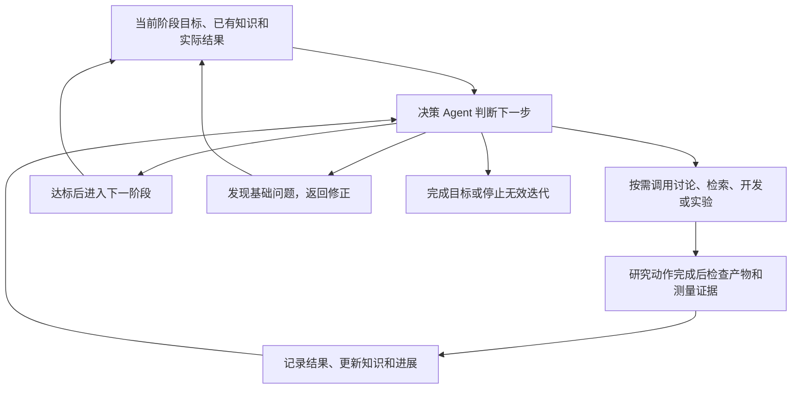
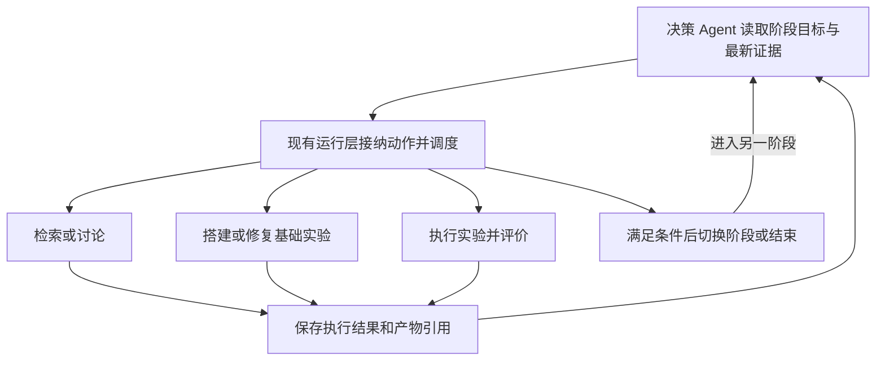

# 三阶段科研流程与自主决策方案 V2

> 日期：2026-09-14
>
> Status：产品方向与 LangGraph 动态决策改造路线已获用户确认；2026-09-14 已接通轮间单一决策边界、真实决策 Agent Session、独立预算与回执，并将算子图终点移到决策节点。2026-09-15 已完成第二阶段的真实资料与 GPU 闭环；第三阶段已实现首个服务端闭环切片：显式 Seed、v2 多动作决定和 discuss / collect_knowledge / plan_candidate / retest / stop 路由已接通，repair_baseline 在基础版本修订流实现前明确拒绝。
>
> 评估修订：2026-09-14 已纳入可行性审查的五项实施缺口、改造要求与效果验证方法；用户已要求继续按评估建议完善方案。
>
> 用途：集中保存当前任务已确认的需求、知识链路审查、精简原则和后续实施顺序，作为继续优化流程的入口。
>
> 范围：挑战杯独立科研/算子实验流程；复用现有讨论、检索、知识存储和实验执行能力。本文不是全局规范，不覆盖 AGENTS.md 与 docs/standards。

## 1. 本轮已确认的决策

1. 按研究目标和交付成果划分三个业务阶段；阶段不能简单等同于代码中的单个节点或现有 stage 字段。
2. 第一阶段确定研究方向与核心假说；方向已经明确时，可以直接进入第二阶段，不依赖方向 A 的 125 题生成和整包审批。
3. 第二阶段根据讨论及资料搜集搭建基础实验，必须实际跑通基线并具备可复现方法；只交付方案或代码不足以完成本阶段。
4. 第三阶段基于第二阶段的基础实验开展优化迭代，按需补资料、讨论、修改、运行、评价并保留结论。
5. 三个阶段共享讨论和资料搜集能力，但任务目的、输入上下文和完成条件不同。
6. 精简固定串行步骤；资料充分时直接行动，缺资料时定向检索，有实质分歧时才追加讨论。
7. 决策 Agent 根据进展决定下一步，可以在已确定目标和资源授权内自动跨阶段推进、返回修正、停止无效迭代，无须逐次请求确认。
8. 决策 Agent 决定做什么；实际产物、程序验证和实验测量决定是否做成，不能通过自我总结宣布成功。
9. 普通知识自动保存、去重并保留来源；不要求每条资料额外开展一轮 Agent 入库审批。已保存和实验已验证必须区分。
10. 失败、无提升和不确定结果保留并可被后续检索，不能只沉淀成功案例。
11. 用户已选定“决策 Agent 决定动作与阶段切换、LangGraph 执行动态路由、现有账本记录真实进展”的改造路线；后续实施以此为准，不重复讨论是否采用该架构。
12. 2026-09-15 已完成一轮真实资料、模型决策与 GPU 实验：资料子流程 run-ea8e875f3335 与算子流程 run-0be5500e9fd3 均已成功结束。该事实只证明第二阶段的基础链路及一个候选的真实负结果已闭环；不等于第三阶段的按证据动态迭代已交付。

## 2. 三个阶段的职责和完成条件

| 阶段 | 要解决的问题 | 主要动作 | 交付成果及完成依据 |
| --- | --- | --- | --- |
| 第一阶段：方向与假说形成 | 研究什么，为什么值得研究 | 按需查资料、讨论价值与机制、选择方向 | 研究目标、核心假说、支持依据、尚未确定的问题；不能将猜想当已证实事实 |
| 第二阶段：基础实验搭建 | 如何把问题变成可靠、可执行的实验 | 查已有实现、讨论实验方法、配置环境、准备数据、实现基线及评价程序、运行验证 | 可运行的基础实现、环境和依赖记录、输入/数据版本、评价协议、正确性检查、真实基线结果及复跑方法 |
| 第三阶段：实验迭代优化 | 哪项改进值得验证，实际是否有效 | 分析结果、按需讨论与检索、选择改动、执行实验、比较并记录结论 | 每轮改动与证据、候选决策、当前最佳方案、适用条件、失败经验和继续/停止理由 |

第二阶段允许执行实验，目的是验证基础实验已经搭建成功。第三阶段执行实验，目的是验证具体改进是否有效。阶段完成与单个节点成功、一次闭环成功、多轮研究成熟度分别报告。

以 Softmax 为例：第二阶段跑通 Torch 基线、输入生成、正确性检查及计时；第三阶段比较 Triton 实现或 numWarps 等改动，并依据真实结果决定是否保留。基线修复后必须重新判断旧结果可比性，不能直接沿用旧排行。

## 3. 决策 Agent 驱动的最小流程



不增加额外审批会议或审批 Agent。复用现有主控角色承担决策职责，通过既有执行能力实际驱动流程；具体角色绑定与内部接口在实施时细化，不能把决策 Agent 降为仅给建议而无法推进的角色。

| 进展情况 | 建议动作 |
| --- | --- |
| 已有资料和测量足以指导改动 | 直接修改并实验 |
| 缺少实现细节或来源证据 | 先检索已有知识，缺什么补什么 |
| 结果有多种解释或涉及重要机制分歧 | 调用一次有明确问题的团队讨论，选有区分力的实验 |
| 基线、环境或评价程序有问题 | 返回第二阶段定位并修正，再验证可比性 |
| 重复失败且没有新理由 | 更换候选、补充诊断或停止；不机械重跑 |
| 达到目标 | 记录成果及证据，结束活动 |

### 决策权限

- 自主决定：检索范围内的资料补齐、是否讨论、选用可复用实现、任务顺序、范围内的运行修复、优化假设、实验安排、继续/暂停/停止，以及符合完成条件的跨阶段切换。
- 第二阶段达标可自动进入第三阶段；第三阶段发现基础问题可自动退回第二阶段。已有明确方向可以直接从第二阶段开始。
- 改变研究目标、核心评价标准、精度要求，或超出当前资源授权，交由用户决定。已有授权范围内的动作不重复确认。
- 该权限属于产品内科研调度，不自动扩大开发 Agent 的权限，不授权远端发布、破坏性操作、修改账户或任意读取其他团队数据。
- 记录授权来源与适用活动，沿用仍有效的授权。历史“5 元 / 10 分钟 / 1 轮”之后用户已要求提高预算、优先闭环；不得把旧额度当作当前最终上限，也不得把“提高预算”推导成无限额度。本文不设置新的金额或时限。

每次动作只保留必要的简短决策记录：选择理由、预期产物、实际结果、下一步判断；关联所依据的产物和当前阶段。保存可审阅的结论与证据引用，不保存完整内部推理过程，不额外复制整份讨论和实验日志。

“动作”指有独立研究产出的工作，例如修改候选并运行正确性及性能测试；不是每次文件读取、保存或日志更新。确定性子步骤连续执行，仅在有选择价值的边界再次调用决策模型，见 §5.2。

### 3.1 已选定的 LangGraph 控制方式

| 负责面 | 权责与写入边界 |
| --- | --- |
| 决策 Agent | 读取阶段目标、相关知识和最新执行证据；选择检索、讨论、搭建/修复、实验、切换阶段或结束，输出简短理由与依据引用；可更新计划和研究判断 |
| 现有命令/执行层 | 接收结构化决策，复用当前身份、资源授权和必要完成条件检查；条件满足即执行，不新增人工确认或模型审批环节 |
| LangGraph | 根据已接纳的决策执行条件路由，保存控制位置并处理中断/恢复；不直接宣告业务任务成功 |
| 实验执行器与评价程序 | 提供执行成败、正确性和性能测量等事实，按已冻结的评价规则判断候选是否达标 |
| 现有 Workflow Ledger 与产物存储 | 记录已接受命令、执行尝试、回执、产物和业务进展；前端读取其投影，不另建状态写入者 |



这里的状态区分为“计划与下一动作”“图控制位置”“真实执行进展”。Agent 可以决定从第二阶段进入第三阶段，但阶段完成必须有基线产物；它不能写入虚构的 succeeded、正确性通过或加速比。达标检查失败时返回具体缺口供其选择下一动作，不默认组织讨论或要求用户审批。

### 3.2 最小实施边界

- 直接复用 LangGraph 的条件边；需要同时更新图控制状态和路由时，可由节点代码返回 `Command(update=..., goto=...)`。Agent 输出结构化业务动作，现有运行层映射到受支持节点；不暴露任意 SQL、checkpoint 编辑或任意节点跳转工具。
- 决策通过现有 Session/任务路径完成并持久化，再将已确认的决策结果交给图控制节点。可重放的控制节点不直接重复发起付费模型调用或 GPU 实验。
- 动态路由替换相同源节点的旧固定后继，不同时保留固定链和另一条动态跳转。`Command(goto=...)` 不会自动取消 `add_edge` 定义的静态边；项目中原有线性条件路由也要同步替换。
- 图定义、实际后继解析和 worker 的后继调度必须使用同一决策语义；不能只改图的连线而让 worker 继续采用旧固定顺序。
- 保持现有命令入口、执行回执与恢复机制。相同任务恢复时复用已经保存的决策和结果；新的进展触发新决策，避免重放同一模型调用或同一实验。
- 第二阶段基线完成后自动进入第三阶段；第三阶段基础错误自动退回修复；正常动作和状态切换在原资源授权内连续执行。
- 采用同一运行体系承载三个业务阶段，不引入第二套状态机或强制建设三个独立引擎。后续若采用子图，只作为内部组织方式，不能新增业务事实权威。
- 不新增 `langgraph-supervisor`、AIDE 或 Open Deep Research 运行依赖；借其局部设计，复用当前工具与调度能力。

### 3.3 官方文档与开源源码调研（2026-09-14）

| 来源 | 本轮核实内容 | 采用范围与限制 |
| --- | --- | --- |
| [LangGraph Graph API](https://docs.langchain.com/oss/python/langgraph/graph-api#command) | 条件边可动态选路；`Command` 支持同时更新状态和跳转；动态跳转不取消静态边 | 直接复用原生路由能力；不能仅加 goto 而保留旧后继 |
| [LangGraph Interrupts](https://docs.langchain.com/oss/python/langgraph/interrupts) | 恢复会从中断节点开头重新执行；中断前副作用需要避免重复 | 复用既有回执和幂等机制；不在可重放控制节点里重新调用模型或启动实验 |
| [Open Deep Research / deep_researcher.py](https://github.com/langchain-ai/open_deep_research/blob/main/src/open_deep_research/deep_researcher.py) | `supervisor` 选择工具；`supervisor_tools` 执行并使用 Command 继续或结束；支持 ConductResearch 与 ResearchComplete | 借鉴主控、工具、结果回流的循环；资料研究的完成信号不能替代 GPU 正确性和性能验收 |
| [AIDE / agent.py](https://github.com/WecoAI/aideml/blob/main/aide/agent.py) | `search_policy` 与 `step` 根据已有记录选择 draft/debug/improve，执行后更新 journal；选择策略含程序规则 | 只借实验进展驱动的动作选择；它不是 LangGraph 示例，也不是完全由模型决定路线，不照搬其指标解析为本项目测量权威 |
| [LangGraph Supervisor README](https://github.com/langchain-ai/langgraph-supervisor-py) | 维护者当前推荐多数场景直接用工具实现 supervisor，而不是采用专门的 supervisor 库 | 使用现有主控加工具，不增加专用编排依赖 |

LangGraph、Open Deep Research、AIDE 的仓库 LICENSE 已核实为 MIT。本轮仅阅读官方文档和源码，未安装、复制或执行外部代码；GitHub 元数据 API 限流，未核实最新提交活跃度，不将这些参考等同于本项目生产验收。

### 3.4 当前项目复用入口

- [challenge_cup_runtime.py](../../core/research/workflow/challenge_cup_runtime.py)：`route_after_iteration_decision` 已有按 branch_decision 路由能力；`build_formal_graph` 构图，控制节点通过 PendingAction/ExecutionReceipt 中断与恢复。
- [iteration_route.py](../../core/web/services/team_workflow/research_runtime/iteration_route.py)：`branch_decision_from_run` 从持久化决策产物读取分支，`routed_successors` 解析真实后继；目前主要绑定既有 iteration_decision/version_governance，需定向适配科研决策。
- [command_service.py](../../core/web/services/team_workflow/research_runtime/command_service.py)：复用命令接纳、版本检查及持久化入口，避免模型或前端直接改写业务进展。
- [adapter_dispatch_worker.py](../../core/web/services/team_workflow/research_runtime/adapter_dispatch_worker.py) 与 [graph_dispatch_worker.py](../../core/web/services/team_workflow/research_runtime/graph_dispatch_worker.py)：沿用执行结果回写及图恢复，适配真实后继而非新增调度器。
- [operator_optimization_definition.py](../../core/research/workflow/operator_optimization_definition.py)：当前六节点通过 pairwise 形成固定顺序，是本次动态路由的直接改造面。共享运行层变化须限定到新科研定义/版本，避免改变普通会话及无关工作流行为。

## 4. 讨论、检索和知识管理如何精简

### 4.1 按需调用共享能力

| 使用场景 | 讨论目的 | 资料重点 |
| --- | --- | --- |
| 第一阶段 | 研究价值、创新空间、假说依据 | 理论、已有研究、反例与空白 |
| 第二阶段 | 选择可执行且可比较的实验方法 | 成熟实现、环境依赖、输入数据、基线与测量方法 |
| 第三阶段 | 解释结果、排序优化假设和预期收益 | 性能瓶颈、实现细节、历史失败、支持与反驳证据 |

不强制“讨论 → 搜集 → 再讨论”；讨论中可按需检索，已有证据充分时可跳过讨论或外部搜索。默认一次有明确结束点的讨论，只有实际分歧才追加。一次讨论不等于一次模型调用。

### 4.2 知识使用与保存

```text
使用前：检索已有知识 → 选择适用正文及来源 → 缺少时补充外部资料
任务后：保存新增资料与实验记录 → 自动更新检索入口 → 后续任务复用
```

- 共用现有知识存储和检索能力，不按三个阶段复制三套库；共享仍受现有团队、项目和来源权限约束。
- 同一来源保持唯一可引用身份和内容版本；三个阶段按用途引用，避免重复保存整包内容。
- 普通资料保存时完成必要的来源记录、内容清洗、去重和状态标记。存在冲突或证据不足时标明问题，不用串行审批阻塞其他工作，也不当作已证实结论。
- 模型输入必须包含实际使用的正文片段及来源引用，不能只传知识 ID、哈希和审核凭据。
- 以已有产物引用记录该任务实际使用的知识版本，保证复跑与追溯；不为此新增层层知识草稿、入库提案和摘要包。
- 实验结论关联原始测量及实现版本，说明环境、输入、改动、结果和适用范围；区分测量事实与机制解释，负结果同样可检索。
- 自动保存属于正常执行收尾，不新增独立审批阶段；持久化失败必须如实显示未保存，不能声明后续已可复用。是否异步排队、具体存储模型和异常呈现留待实现设计。

“保存状态”“证据是否支持某条结论”分别表达。引用资料已入库，不意味着假说已被实验验证；正确性通过也不意味着性能提升。

### 4.3 两种复用不能混淆

1. 相同请求可以复用已有知识包与执行凭据，避免重复工作。
2. 新问题必须能够检索已有相关条目，选择适用部分，再补充缺口。

保留现有身份/哈希校验；不靠放宽精确匹配把旧结论强行套入新实验。检索排序策略、片段长度和每次资料上限尚待具体设计。

## 5. 当前实现核查与关键缺口

以下来自本次讨论中的代码只读检查；描述代码契约，不代表重新运行过整个产品。

| 观察 | 依据 | 对本方案的影响 |
| --- | --- | --- |
| 独立算子流程将讨论、知识、规划、执行、评价、反馈放在同一 workflow | [operator_optimization_definition.py](../../core/research/workflow/operator_optimization_definition.py) | 业务阶段和执行节点混在一起；需要明确阶段职责，不能只更改文案宣布拆分完成 |
| 正式资料已有候选、质量审核、来源/知识入库、哈希回读与去重能力 | [writeback_materialize.py](../../core/web/services/team_workflow/source_collection/writeback_materialize.py)、[source_inbox.py](../../core/web/services/team_knowledge/source_inbox.py) | 复用底层来源和存储能力；普通资料自动保存仍需改造现有治理调用，不能假定现在就会自动入库 |
| 规划显式输入传入 accepted package；包内条目主要是 ID 和正文哈希，没有展开正文 | [planning.py](../../core/web/services/team_workflow/operator_optimization/planning.py)、[knowledge_artifact_authority.py](../../core/web/services/team_workflow/research_runtime/knowledge_artifact_authority.py) | 高优先级：交接契约未保证规划消费知识正文；不能由入库成功推断资料已影响设计。其他 Session 上下文是否额外补充正文尚未运行核实 |
| 算子知识包复用依赖来源范围、检索要求和假设相关条件的指纹 | [operator_optimization/knowledge.py](../../core/web/services/team_workflow/operator_optimization/knowledge.py) | 相同请求复用已有基础；跨阶段、跨问题的相关条目检索不能由此替代 |
| 反馈产物有评价、候选决策和失败证据；下一轮默认带基线及上一轮证据 | [feedback.py](../../core/web/services/team_workflow/operator_optimization/feedback.py)、[rounds.py](../../core/web/services/team_workflow/operator_optimization/rounds.py) | 已支持相邻轮次衔接；在该独立链路未见正式知识回存调用，不能视为长期失败经验已可跨实验检索 |
| 当前知识请求绑定活动、轮次和假设，未建立本方案的三阶段用途契约 | [research/operator_optimization/knowledge.py](../../core/research/operator_optimization/knowledge.py) | 应补阶段用途及消费上下文；不为三个阶段复制执行引擎 |

可直接评估的本地复用点：

- [team_knowledge_service.py](../../core/web/services/team_knowledge_service.py) 的 `search_knowledge_items`：已有项目、来源、标签过滤和 BM25 检索。
- [experiment_kernel.py](../../core/web/services/team_workflow/experiment_kernel.py) 的 `_notify_knowledge_steward_for_experiment_result`：已有实验结果包进入知识处理的思路；只借来源与结果映射，不把旧流程的审批、阶段绑定整体搬入新链路。
- 现有 Workflow Ledger、Session、候选/测量产物和内容哈希继续作为执行证据来源；界面只展示服务端状态，不另建一套事实。

历史实验证据：前序任务记录首轮 `run-a55ea63bb831` 已完成六节点闭环，候选 `triton_row_softmax / numWarps=4` 正确性通过，速度约 Torch 的 0.44–0.48 倍，决策为 `retain_parent`。此为前序记录，本轮未重跑核验；只能说明一次真实路径已验证，不能证明本 V2、第二阶段整体或连续多轮能力已完成。

### 5.1 可行性与预期效果评估

结论：方向合理、动态路由可行；完整自主实验能力仍需实质改造，不能把接通路由视为整套科研流程完成。最有把握的目标是减少重复搜集、无效讨论和人工推进；算子性能收益必须由真实对照实验检验。

| 改造面 | 当前判断 | 预期收益与限制 |
| --- | --- | --- |
| 动态选路、按需讨论和检索 | 已有 LangGraph、命令和账本基础，改造量中等 | 有望减少固定步骤；图与跨轮调度都需要改造 |
| 知识正文消费、相关资料复用 | 已有存储检索能力，需要补消费和回存路径 | 改善决策依据、减少重复搜索；只传 ID/哈希达不到目标 |
| 自动跨阶段与回退修复 | 可行，但当前初始基线模型不直接支持版本切换 | 降低人工介入；需先明确基线重跑与修订语义 |
| 自主搭建实验、修改算子实现 | 当前受管候选能力较窄，需要独立补齐 | 决定是否能超出预置实现与少量参数；不能用调参验收替代代码改造能力 |
| 优化效果及运行效率 | 架构本身不能保证 | 决策增加的成本需与省下的步骤比较，不能预先承诺加速倍数或节省比例 |

### 5.2 五项缺口与实施要求

**一、决策与实验开发能力分别建设。** [CudaCandidate](../../core/research/operator_optimization/candidate.py) 当前只接受 torch_softmax/triton_row_softmax 与 numWarps=4/8/16，不能据此宣称支持自主编写算子。先在这个范围验证自主选路，再补齐候选代码开发能力；前者是局部验证，后者属于本方案完整交付范围，不可静默删减。

- 实验开发动作应明确目标实现、允许修改的文件/工作目录、输入基础版本、预期候选产物和验证方式。
- 候选形成独立且可回读的代码版本，记录实际执行代码的来源/内容身份；不得只保留模型给出的说明或参数。
- 正确性、测量程序和原始证据继续由相应执行能力负责；普通候选优化不能改写验证器来取得通过。
- 候选代码如何接入现有执行器、隔离目录与产物表示需在该能力实施前做定向复用评估，不把当前只运行预置函数的 runner 当成通用开发执行器。

**二、跳过会议必须有可替代的真实输入来源。** [知识准备](../../core/web/services/team_workflow/operator_optimization/knowledge.py) 当前强制要求 hypothesisRef，[计划契约](../../core/research/operator_optimization/plan.py) 又强制绑定 hypothesisRef 和 knowledgeRef。只删讨论/知识节点会让下游缺少输入。

| 决策动作 | 最小输入来源 | 必须保留的输出 |
| --- | --- | --- |
| 不开团队会议，直接规划候选实验 | 决策 Agent 提出或引用的具体优化假设、当前版本、已有证据 | 改动目的、预期影响与判别方式，记录真实提出者及来源，不伪造会议产物 |
| 不进行外部搜索，直接利用已有资料 | 实际选用的知识正文及引用，或足够的已有实验观察 | 可回读的消费引用/版本；不伪造新搜集或新入库记录 |
| 第二阶段搭建基础实验 | 已明确研究方向、所需基线/数据/评价方法 | 可执行实验内容与基线验证；不为满足旧轮次接口硬造优化假设 |

复用现有产物类型能够表达的部分，定向调整与固定生产节点绑定的约束；不一律将必需字段改成可空，不新增与原产物内容重复的兼容包。

**三、一个决策入口同时控制轮内与轮间推进。** [advance_iteration](../../core/web/services/team_workflow/operator_optimization/iteration.py) 当前在上一轮完成后准备下一轮，并直接启动 optimization_discussion。它与新决策循环并存会形成第二个推进者。

- 轮次结束通知交给同一科研决策入口，决定继续、补资料、回退或停止；现有事件机制只承担可靠通知和执行已接纳动作。
- 删除新流程内“结束即自动开下一轮讨论”的旧决策规则；保留可复用的轮次创建、命令与回执机制。
- 同一结果重复到达不得产生第二轮创建；决定停止后，旧事件不能额外开会或启动实验。图路由与 worker 后继解析、跨轮入口需一起验证。

**四、回退修复必须处理基线版本。** [prepare_baseline](../../core/web/services/team_workflow/operator_optimization/baseline.py) 当前只允许初始创建；[OptimizationCampaign](../../core/research/operator_optimization/contracts.py) 当前只有一组基线引用。阶段切换不足以表达基线修订。

- 同一实现、同一协议下的暂时执行失败：保留基础版本，创建新的执行尝试，记录真实环境；是否可比较仍按环境与测量条件判断。
- 基线实现或评价程序纠错：保留旧版本与旧结果，形成新基础版本并重新测量；当前最佳方案和后续比较绑定到新版本，不能直接沿用旧排行。
- 修复既定标准的程序实现与改变标准本身分别处理。研究目标、核心指标或精度要求改变仍按既有权限交用户决定，不能借“基线修复”自行放宽要求。
- 最小基础版本包括实现、环境/依赖、输入数据、评价协议/程序、正确性和基线结果及复跑方法的引用；如何映射存储字段属于后续设计，不建立重复账本。

**五、仅在有选择价值的边界调用决策模型。** 调用时机为任务启动、一次实验/讨论产生新证据、出现影响后续的失败或资料缺口、判断阶段完成或研究结束。文件读写、知识持久化、回执确认、结果数值解析等确定性步骤由程序连续完成。

- 一次决策可调度完整的“修改候选 → 正确性检查 → 性能测量”动作；触及影响后续的问题时提前返回实际结果，再作决策。
- 仅新增日志或无变化状态不触发重决策，恢复时复用已有决定；真正的新证据才触发新决定。
- 将决策模型本身的调用、token、费用和耗时计入活动统计，与讨论、搜集和实验成本一起评估；具体预算字段适配现有模型用量机制，不新建平行计费系统。
- 达标完成、没有值得继续的改进而停止、资源耗尽或执行阻塞分别记录，不能把所有终止都投影成研究成功。

## 6. 数据与界面边界

已确定需要关联研究目标、业务阶段、基础实验版本、实验轮次、候选实现、评价协议、使用的知识及决策结果；具体 DTO/字段命名仍待接口设计，本文不虚构已存在 API。

已选定复用同一运行体系与执行账本承载动作和产物，显式记录业务阶段，由决策 Agent 驱动 LangGraph 动态路由。阶段是否在代码内组织为子图属于实现细节，不能借阶段拆分引入三个独立引擎或重复账本。

前端建议围绕“当前阶段、目标、正在做什么、决策理由、实际结果”展示；讨论和资料按需展开。团队画布与实验详情引用同一活动/阶段/轮次状态，不产生第二写入者。页面布局、入口与阶段投影尚未确认，不属于本次已实施成果。

Windows 环境优先延续已有本机 PyTorch/CUDA 路径，不因旧方案默认 Linux/WSL 而迁移。目录与文件名保持简短有界，完整生成路径含临时/锁后缀遵守 240 UTF-16 代码单元的项目保守预算及工具链更严格限制；240 并非 Windows 统一上限。沿用现有 resolver，不用开启长路径支持替代简化，不据此迁移历史数据。

## 7. 推荐实施顺序与验收场景

| 顺序 | 交付目标 | 主要影响面 | 验收依据 |
| --- | --- | --- | --- |
| 1 | 定义最小研究动作与阶段完成契约，解除固定生产节点依赖 | operator 契约、主控输入、knowledge/planning、命令接纳 | 不开会仍有真实假设来源；无新搜索仍可使用已有证据；第二阶段从已知方向搭建不需要伪造优化假设 |
| 2 | 补知识正文消费及相关条目检索 | knowledge、planning、team_knowledge、共享讨论输入 | 实际决策输入包含可追溯正文；相关旧资料被选用，不适用资料不强行复用 |
| 3 | 建立轮内/轮间唯一动态决策入口，并计入决策成本 | graph runtime、iteration_route、operator iteration、adapter/graph workers | 无双重推进；停止不启动下一轮；中断不重复调用；确定性子步骤不逐个调用主控 |
| 4 | 完成 Softmax 受管范围内的真实自主决策验证 | 现有候选、模型、GPU 和上述决策入口 | 自主选择动作、执行并根据结果改变下一步；记录收益与成本；仅验收编排，不冒充自主代码开发完成 |
| 5 | 补齐基础实验版本和候选代码开发/执行能力 | baseline、campaign/round 契约、candidate、规划/开发执行接入 | 同版本重跑与新版本修复区分；实际修改代码可回读并执行；验证器保持既定标准；能自主回退修复并恢复迭代 |
| 6 | 简化自动保存并形成可复用实验经验 | 来源/知识入库与 operator feedback | 正常资料无额外逐条审批；失败及无提升结果可检索；保存状态不冒充验证状态 |
| 7 | 完整三阶段真实验证与界面呈现 | 同一活动的服务端状态及前端投影 | 基线达标自动进入迭代；历史经验可用；回退与停止符合证据；分别展示阶段状态、运行结果及活动终止原因 |

### 9.1 已落地的首个切片（2026-09-14）

- `operator_round_completed` 事件只生成一个与反馈、评价引用绑定的持久化决策请求，不再直接创建下一轮。
- `operator-optimization@1.1.0` 的历史决策使用二值 `continue / stop` 契约；同一请求只能接受一个不可改写的结果。
- 旧版 `stop` 不创建轮次，`continue` 固定复用 `prepare_round` 并启动讨论。该语义只用于解释历史记录，不进入第三阶段 v2 动作路由。
- 首个切片先建立服务层决策接纳边界，解决旧自动续轮与新主控并存的问题；后续 §9.2 已在该边界上接入真实决策任务。轮内“讨论、检索、规划、实验、回退”多动作条件路由仍未完成，因此不能据此宣称动态科研流程整体完成。
- 第二个底层切片增加独立 `decision` 模型调用预算，以及绑定完整反馈、评价正文和引用的 `optimization_iteration_decision` 结构化产物。决策模型输出不能自行指定活动、轮次、证据引用、决策者或产物 ID；这些身份由服务端按冻结输入生成。

### 9.2 已落地的真实决策 Agent 切片（2026-09-14）

- 算子工作流升级为 `1.1.0`，新增 `optimization_decision` Agent 节点；旧 `operator-optimization@1.0.0.json` 保持冻结，新快照单独保存。
- `optimization_feedback` 只整理反馈并把证据交给决策节点，不再结束本轮；只有决策节点成功且其产物通过回读校验后，运行才以 `operator_round_completed` 关闭。
- 终点由每个 Run 冻结的 `workflowVersionId` 对应定义决定：既有 `1.0.0` Run 仍在 `optimization_feedback` 按旧语义收口，`1.1.0` Run 在 `optimization_decision` 收口，运行中升级不会改写历史图。
- 决策任务复用现有原生 Session 生命周期，但使用独立 `operator_decision_task`、`OperatorDecisionInvocationBinding`、`decision` 预算和 `operator_decision` 回执身份；模型不能调用工具，也不能直接修改 Ledger 或启动实验。
- 决策输入哈希覆盖完整反馈、评价正文和双方引用；服务端生成决策 ID、证据范围及决策者。回执未送达、费用未知、Session/Turn/NodeRun 不匹配或证据漂移时，决策节点不能完成。
- 本轮关闭事件只读取已落盘的唯一决策产物并调用 `apply_iteration_decision`。事件、Session 提交和决策应用均可重放；恢复不会再次调用模型。
- 聚焦自动化已覆盖图版本/终点、任务适配、原生 Session、严格输出、独立回执、未知费用拒绝、证据漂移和继续/停止幂等。2026-09-15 已用真实资料、模型决策与 CUDA 执行验证一轮端到端闭环；第三阶段的下一验收关口改为“从冻结第二阶段输入创建独立迭代流，并按不同决策动作走到唯一合法后继”。

每个能力连同相关验证一起实施，先形成最小可运行路径再扩展算子；不创建新的通用编排框架，不预设大量角色、异步队列或重试层。发现异常先定位根因。旧的固定流程调用在切换后清理，不长期保留双轨兼容；历史实验记录与引用不得因清理代码而丢失，具体迁移方法需另行确认。

应覆盖的行为场景：

- 同一资料可被三个阶段按不同目的使用，不重复搜集整包资料。
- 资料充分可直接实验；资料不足定向补齐；有分歧才讨论。
- 普通资料自动保存，来源中的指令不被执行，未验证的判断有明确标记。
- 基线未跑通不能宣称第二阶段完成；决策文字不能代替执行证据。
- 第三阶段正确但更慢的候选保留负结果，不晋升；下一轮能使用失败经验。
- 发现基线问题自动回退，旧结果仍可回读并重新判断可比性。
- 目标/精度/评价标准变化和资源超授权时交由用户决策；既有授权范围内不重复阻塞。
- 知识更新不静默改变旧实验使用的版本；来源撤回或内容不再可用需真实表达。
- 同一决策只调度其选定动作，图与 worker 不继续执行旧固定后继；选择停止后不会额外启动实验。
- 中断、重启或回执重放不重复同一决策调用或同一 GPU 实验；新结果触发新决策。
- Agent 的阶段切换请求不直接改写成功、正确性或性能事实；缺少基线时返回具体缺口。
- 普通 Session 和其他冻结版本的工作流不因独立算子路由改造而改变行为。
- 不召开会议仍可规划有效实验；记录假设真实来源，不要求空跑会议来满足旧字段。
- 旧自动轮次事件不会与新主控各创建一轮；停止决定能阻止后续新实验启动。
- 基线修复后新旧结果可回读，新版本下的最佳候选不沿用未经重测的旧排行。
- 实际候选代码改动、执行代码身份和测量结果对应，有限参数选择不替代代码开发验收。
- 文件保存、日志或轮询不增加决策模型调用；决策费用和耗时纳入总成本。

定向回归入口包括 [test_operator_optimization_definition.py](../../tests/test_operator_optimization_definition.py)、[test_operator_optimization_dispatch.py](../../tests/test_operator_optimization_dispatch.py)、[test_research_workflow_graph_iteration_routes.py](../../tests/test_research_workflow_graph_iteration_routes.py) 与 [test_research_workflow_challenge_cup_runtime.py](../../tests/test_research_workflow_challenge_cup_runtime.py)。新增行为用这些现有测试面补覆盖；真实自主选路、阶段切换和模型/GPU 重复执行仍需独立运行证据。

阶段标准的代码验证、真实模型/GPU 行为、前端显示验收分别提供证据；本轮文档检查不替代上述验收。

### 7.1 效果验证方法

先用少量有代表性的真实任务检验效果，不先搭建通用评分平台。对照采用相同目标、初始实现、输入、评价条件、模型配置与资源上限，注明知识缓存是否一致；用先前固定流程版本/已保存记录作为对照，不为测评在正式产品长期保留旧执行分支。旧记录条件不匹配时只描述个案，不能据此量化收益。

| 维度 | 记录内容 | 判断方式 |
| --- | --- | --- |
| 完成效率 | 从开始到可用结果的总耗时、各类模型调用和总费用 | 包含新增决策开销及所有失败尝试；不能只比较被省掉的讨论步骤 |
| 自主程度 | 人工介入次数、按需跳步、跨阶段推进与回退 | 能自主完成合理动作；阻塞或资源耗尽不计为任务完成 |
| 无效工作 | 重复搜索、无新理由的重复实验、额外启动的轮次 | 结合输入/结果与决策理由检查，不把有目的复测当重复浪费 |
| 实验质量 | 正确性、可比性、复现条件和候选实际性能 | 保持既定质量条件；性能提升必须来自可比较测量 |
| 知识使用 | 决策实际读到的正文与来源、失败经验复用 | 有引用与消费证据；入库量不是效果指标 |

首批覆盖“资料充分直接实验”“缺资料定向补齐”“无提升后调整策略或停止”“基础错误回退修复”。一次跑通仅证明对应路径可执行；重复次数和统计要求随任务噪声确定，不用单次时延或单轮候选效果声称稳定提升。若没有旧流程同条件对照，先报告行为验收结果，不声称效率已提高。收益不足时优先减少不必要决策调用、检查知识输入和实验动作能力，避免继续堆叠审批或角色。

## 8. 下一轮继续讨论的事项

产品方向和 §3 的动态路由架构已经确认，后续细化以下事项；常规实现选择由当前 owner 按已确认边界处理，仅实质产品分歧再对齐：

1. 决策 Agent 具体复用哪个现有角色、读取多长的历史与简短记录的界面呈现；决策调用边界按 §5.2，常规子步骤不再另加模型判断。
2. §5.2 中基础版本、候选代码产物与开发执行能力的具体存储/工具接入；最小内容及重跑/修订原则已明确，不把当前预置候选能力视为完整支持。
3. 何种情况视为无效重复、没有值得继续的候选或达到研究目标；不预设任意固定失败次数。
4. 自动入库如何映射现有来源与正式知识状态，如何表示冲突、适用范围和未验证结论。
5. 已选定架构下的具体动作字段/子图组织、前端入口与团队画布投影、旧数据迁移范围；不重新争论是否由决策 Agent 控制动态路由。

资源额度沿用活动的有效授权；若后续启动实验时不存在可判定的有效额度，再补齐具体数值。本轮不请求新额度，也不恢复已过时的初始预算。

## 9. 与旧方案的关系和维护方式

[独立算子实验原方案](2026-09-05-independent-operator-experiment-flow-plan.md) 保留成熟项目调研、技术实施记录和早期证据供参考。其“每轮固定讨论、随后固定搜集、把完整闭环称作第二阶段”等产品流程口径由本文替代；历史参数、运行状态和默认环境不作为当前事实。

LangGraph 与自主决策相关的最新一轮调研见 §3.3，已于 2026-09-14 纳入用户确认的改造路线。原方案其他外部调研仍作为历史研究线索，不将其写成最新验证结论；新的真实实现分歧出现时再定向核验高 ROI 复用方案。

继续讨论时优先修改本文对应章节，明确哪些是用户确认、建议或待定，更新日期与状态；不逐轮另建重复方案。完成实现并验收后再更新状态和归档，不把文档落盘计为功能交付。

## 10. 第三阶段独立实验迭代流设计（2026-09-15）

### 10.1 启动条件与现有输入

第三阶段可以开始设计。第二阶段已经留下可复现基础实验、资料包和可比较的真实负结果，因而不应重新运行相同的 Triton numWarps=4：

| 事实 | 已验证证据 | 第三阶段含义 |
| --- | --- | --- |
| 资料链完成 | run-ea8e875f3335 已成功，资料包已交接 | 先复用已有资料；只有出现具体证据缺口才搜索 |
| 基础算子实验完成 | run-0be5500e9fd3 在 RTX 4060 Laptop GPU 上完成正确性与性能测量 | 冻结 Torch 基线、环境、输入和协议作为初始比较条件 |
| 候选未晋升 | triton_row_softmax / numWarps=4 的 source hash 不同于父候选，3 个可比 trial 都未晋升，原因是 improvement_not_established 与 shape_regression | 保留这个负结果和 torch_softmax 父候选；禁止把相同候选、相同协议和相同目的再当成新实验 |
| 仍有判别价值 | 已保存的 continue 决策要求统一计时、提高样本，并扫描 numWarps=8/16 | 首轮迭代先区分“测量噪声/口径问题”和“实现不适配”，不要盲目增加候选 |

第三阶段以不可变的 Stage 2 Seed 启动。Seed 只引用基础版本、已尝试候选与负结果、资料包、讨论结论、测量协议、环境指纹、预算授权和目标；不复制正文、不重写第二阶段记录，也不改变旧 Run 的完成状态。

### 10.2 推荐架构

第三阶段创建一个带 stage=experiment_iteration 标记的新活动实例，复用现有 Workflow Ledger、Campaign/Round、Artifact、Outbox、Session 和预算回执。它是一条独立数据流，不是第二套状态机：

~~~mermaid
flowchart LR
  S[冻结 Stage 2 Seed] --> D[服务端构造决策输入]
  D --> A{Decision Artifact}
  A -->|讨论| H[优化假设]
  A -->|补资料| K[定向检索并回读正文]
  A -->|规划新候选| P[受管规划]
  A -->|复测| X[正确性和 GPU 测量]
  A -->|修复基础实验| B[新基础版本]
  H --> K --> P --> X
  X --> E[评价与反馈] --> D
  B --> D
  A -->|停止| T[记录停止原因]
~~~

每轮只接受一个不可变的 Decision Artifact。Agent 可以选择下一动作，但不能直接写 Ledger、预算、产物引用、图位置或测量结论。服务端校验输入哈希、阶段、预算、候选允许范围和前置产物后，才生成命令并将 LangGraph 路由到唯一合法后继。恢复时只重放该产物及其命令，既不重新调用模型，也不重跑 GPU。

首个版本仍限制在受管 CudaCandidate 与既有验证器范围内。模型不能任意修改源码或执行 shell；“候选代码自主开发”是 §5.2 已列出的独立后续能力，不混入本次迭代编排改造。

### 10.3 多动作决策契约

| 动作 | 选择条件 | 服务端前置条件 | 合法后继 |
| --- | --- | --- | --- |
| discuss | 多种机制解释需要判别 | 有明确未解决机制问题 | optimization_discussion |
| collect_knowledge | 缺实现、测量或反证资料 | 有 evidenceGaps，且没有语义范围匹配的已验收包 | 受管资料子流 |
| plan_candidate | 假设与知识足以产生新候选 | 有可回读假设、正文消费引用、父候选和协议 | optimization_planning |
| retest | 需要区分噪声、热状态或偶发执行失败 | 已有可复用计划、协议和新测量 attempt | optimization_execution |
| repair_baseline | 基线、评价程序、环境或数据让旧比较失效 | 有具体故障证据；不改变目标、精度或核心指标 | 基础实验修复子流 |
| stop | 达标、预算耗尽、无高信息价值候选或无法恢复阻塞 | 有原因及证据 | 终止，不创建空轮次 |

新版不再把 continue 解释为“固定从讨论开始”。历史 operator-optimization@1.1.0 只读展示；第三阶段使用新工作流版本和显式 Seed，不以兼容别名把旧二值契约解释成新版多动作语义。

### 10.4 单一事实来源

| 事实 | Canonical source | Writer | 读取者与处理 |
| --- | --- | --- | --- |
| Stage 2 Seed | 新活动的 Seed artifact，引用第二阶段 artifact | 服务端启动命令 | 决策与轮次准备；只读、不变 |
| 活动、轮次、预算、活跃 Run、父候选 | 现有 Campaign/Round | command service、prepare_round、预算服务 | worker 和 UI 投影；CAS 更新 |
| 图位置和命令回执 | Workflow Ledger 的 run、command、attempt | graph/adapter worker | 恢复与真实后继解析 |
| 假设、知识、计划、候选、测量、评价、反馈 | 不可变 workflow artifact store | 对应领域节点与验证器 | 每轮创建新引用，禁止覆盖 |
| 决策及证据范围 | optimization_iteration_decision artifact | 决策接纳服务 | iteration 与路由层；同一请求只能接受一个 |
| 可检索资料和负结果 | 现有 team knowledge/source storage | 资料与结果写回服务 | discussion、planning、decision；已保存不等于已验证 |
| 团队画布与实验详情 | 上述服务端事实的只读 projection | 无 | 只刷新显示，不另建前端写入者 |

基础实验修复必须创建新基础版本；旧测量可读，但不能混入新版本的排行。

### 10.5 实施顺序与验收

1. 增加 Stage 2 Seed、显式阶段字段和新版工作流定义；只有已完成的第二阶段输入能启动第三阶段。
2. 将二值决策扩展为上述受管动作，修改 decision.py、operator iteration service 与 operator workflow definition；删除新版中“continue 固定启动 optimization_discussion”的分支。
3. 让 iteration_route、dispatch worker 和 command service 使用同一动作映射。未知动作、输入漂移、预算不足和缺前置产物必须拒绝，不增加第二个推进者。
4. 补齐跳过会议或搜索时所需的真实假设与知识正文消费契约；不能为适配旧接口伪造会议或资料产物。
5. 实现基础版本修订和已验证负结果写回；最后再运行一条真实的 Windows CUDA 第三阶段实验，优先使用统一 CUDA-event 口径、足够样本的 numWarps=8/16 判别试验。

验收要求包括：Seed 能回读本轮负结果；每个决策与输入哈希、阶段、预算绑定；各动作只进入自己的合法后继；停止不会生成轮次；恢复不产生额外模型或 GPU 调用；基线修订后旧排行不再参与新版本比较。后续 UI 在后端稳定后再按 VUI 契约独立验收。

### 10.6 成熟项目的高 ROI 借鉴

- LangGraph 的持久状态与 Command 模型适合由服务端接纳的结构化决定驱动条件路由，但不替代本项目 Ledger、回执和证据验证。
- Microsoft AutoGen 的 team runtime 提供运行、暂停、恢复与保存 team state 的生命周期边界；它不提供实验资产、预算和测量权威，因此不引入其运行时。
- Sakana AI Scientist 的 perform_experiments.py 以既有 baseline、有限 run 次数、顺序执行和结果反馈收束实验。只借鉴“基线不重复跑、每轮有上限、以结果决定下一步”，不采用其模型直接写代码并执行 shell 的模式。

本项目采用“受限候选 + 不可变实验产物 + 服务端接纳的决策路由”。这能减少固定会议链中的无效动作，同时保留可复现、可审计的实验边界。

### 10.7 第一批实现状态（2026-09-15）

`operator-optimization@1.2.0` 与 `operator_iteration_decision_proposal_v2` 已建立。服务端为下一轮写入 `operator_stage2_seed`，Seed 绑定来源 Run、基础版本、协议、假设、资料、计划、评价、反馈和已尝试候选；新 Run 的 `experimentStage=experiment_iteration` 只保存 Seed 引用。

当前动作行为如下：

| 动作 | 当前行为 |
| --- | --- |
| discuss | 创建新轮次并只启动 `optimization_discussion` |
| collect_knowledge | 复用 Seed 中按 hash 回读的原假设，只启动 `optimization_knowledge` |
| plan_candidate | 复用原假设与已验收资料正文，只启动 `optimization_plan`；拒绝再次规划 Seed 中已尝试的候选配置 |
| retest | 将 Seed 中的冻结计划绑定为新轮次复测计划，只启动 `operator_execution`；不重新调用规划 Agent |
| stop | 保存原因，不创建轮次 |
| repair_baseline | 当前明确返回 `baseline_repair_flow_not_connected`，不创建轮次；待新基础版本及排行隔离完成后开放 |

预算检查已按实际动作收窄：decision task 在调用前独立预留并结算自己的预算；终点事件不重复预留 decision，讨论、资料和规划分别检查自己的后继预算，retest 不再被无关模型预算阻塞。恢复仍复用同一 decision、round key 和 start command key。
