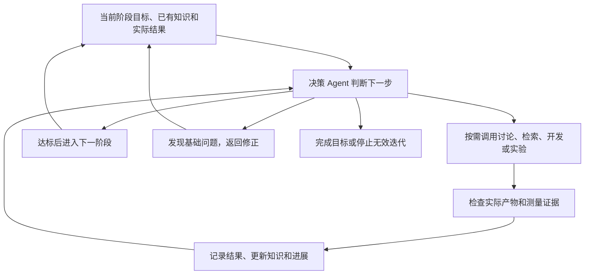
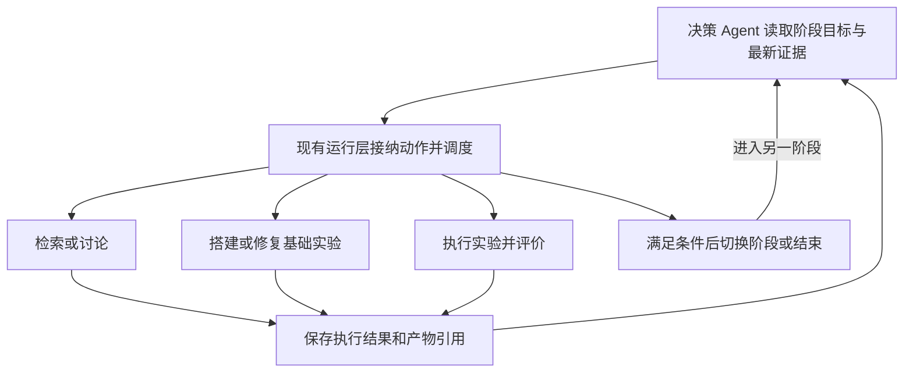

# 三阶段科研流程与自主决策方案 V2

> 日期：2026-09-14
>
> Status：产品方向与 LangGraph 动态决策改造路线已获用户确认；具体接口与界面细节继续细化；改造尚未实施。
>
> 用途：集中保存当前任务已确认的需求、知识链路审查、精简原则和后续实施顺序，作为继续优化流程的入口。
>
> 范围：挑战杯独立科研/算子实验流程；复用现有讨论、检索、知识存储和实验执行能力。本文不是全局规范，不覆盖 AGENTS.md 与 docs/standards。

## 1. 本轮已确认的决策

1. 按研究目标和交付成果划分三个业务阶段；阶段不能简单等同于代码中的单个节点或现有 stage 字段。
2. 第一阶段确定研究方向与核心假说；方向已经明确时，可以直接进入第二阶段，不依赖方向 A 的 125 题生成和整包审批。
3. 第二阶段根据讨论及资料搜集搭建基础实验，必须实际跑通基线并具备可复现方法；只交付方案或代码不足以完成本阶段。
4. 第三阶段基于第二阶段的基础实验开展优化迭代，按需补资料、讨论、修改、运行、评价并保留结论。
5. 三个阶段共享讨论和资料搜集能力，但任务目的、输入上下文和完成条件不同。
6. 精简固定串行步骤；资料充分时直接行动，缺资料时定向检索，有实质分歧时才追加讨论。
7. 决策 Agent 根据进展决定下一步，可以在已确定目标和资源授权内自动跨阶段推进、返回修正、停止无效迭代，无须逐次请求确认。
8. 决策 Agent 决定做什么；实际产物、程序验证和实验测量决定是否做成，不能通过自我总结宣布成功。
9. 普通知识自动保存、去重并保留来源；不要求每条资料额外开展一轮 Agent 入库审批。已保存和实验已验证必须区分。
10. 失败、无提升和不确定结果保留并可被后续检索，不能只沉淀成功案例。
11. 用户已选定“决策 Agent 决定动作与阶段切换、LangGraph 执行动态路由、现有账本记录真实进展”的改造路线；后续实施以此为准，不重复讨论是否采用该架构。
12. 当前交付为更新方案，未修改业务代码、启动付费调用、GPU 实验或产品刷新；文档落盘不等于改造已完成。

## 2. 三个阶段的职责和完成条件

| 阶段 | 要解决的问题 | 主要动作 | 交付成果及完成依据 |
| --- | --- | --- | --- |
| 第一阶段：方向与假说形成 | 研究什么，为什么值得研究 | 按需查资料、讨论价值与机制、选择方向 | 研究目标、核心假说、支持依据、尚未确定的问题；不能将猜想当已证实事实 |
| 第二阶段：基础实验搭建 | 如何把问题变成可靠、可执行的实验 | 查已有实现、讨论实验方法、配置环境、准备数据、实现基线及评价程序、运行验证 | 可运行的基础实现、环境和依赖记录、输入/数据版本、评价协议、正确性检查、真实基线结果及复跑方法 |
| 第三阶段：实验迭代优化 | 哪项改进值得验证，实际是否有效 | 分析结果、按需讨论与检索、选择改动、执行实验、比较并记录结论 | 每轮改动与证据、候选决策、当前最佳方案、适用条件、失败经验和继续/停止理由 |

第二阶段允许执行实验，目的是验证基础实验已经搭建成功。第三阶段执行实验，目的是验证具体改进是否有效。阶段完成与单个节点成功、一次闭环成功、多轮研究成熟度分别报告。

以 Softmax 为例：第二阶段跑通 Torch 基线、输入生成、正确性检查及计时；第三阶段比较 Triton 实现或 numWarps 等改动，并依据真实结果决定是否保留。基线修复后必须重新判断旧结果可比性，不能直接沿用旧排行。

## 3. 决策 Agent 驱动的最小流程



不增加额外审批会议或审批 Agent。复用现有主控角色承担决策职责，通过既有执行能力实际驱动流程；具体角色绑定与内部接口在实施时细化，不能把决策 Agent 降为仅给建议而无法推进的角色。

| 进展情况 | 建议动作 |
| --- | --- |
| 已有资料和测量足以指导改动 | 直接修改并实验 |
| 缺少实现细节或来源证据 | 先检索已有知识，缺什么补什么 |
| 结果有多种解释或涉及重要机制分歧 | 调用一次有明确问题的团队讨论，选有区分力的实验 |
| 基线、环境或评价程序有问题 | 返回第二阶段定位并修正，再验证可比性 |
| 重复失败且没有新理由 | 更换候选、补充诊断或停止；不机械重跑 |
| 达到目标 | 记录成果及证据，结束活动 |

### 决策权限

- 自主决定：检索范围内的资料补齐、是否讨论、选用可复用实现、任务顺序、范围内的运行修复、优化假设、实验安排、继续/暂停/停止，以及符合完成条件的跨阶段切换。
- 第二阶段达标可自动进入第三阶段；第三阶段发现基础问题可自动退回第二阶段。已有明确方向可以直接从第二阶段开始。
- 改变研究目标、核心评价标准、精度要求，或超出当前资源授权，交由用户决定。已有授权范围内的动作不重复确认。
- 该权限属于产品内科研调度，不自动扩大开发 Agent 的权限，不授权远端发布、破坏性操作、修改账户或任意读取其他团队数据。
- 记录授权来源与适用活动，沿用仍有效的授权。历史“5 元 / 10 分钟 / 1 轮”之后用户已要求提高预算、优先闭环；不得把旧额度当作当前最终上限，也不得把“提高预算”推导成无限额度。本文不设置新的金额或时限。

每次动作只保留必要的简短决策记录：选择理由、预期产物、实际结果、下一步判断；关联所依据的产物和当前阶段。保存可审阅的结论与证据引用，不保存完整内部推理过程，不额外复制整份讨论和实验日志。

### 3.1 已选定的 LangGraph 控制方式

| 负责面 | 权责与写入边界 |
| --- | --- |
| 决策 Agent | 读取阶段目标、相关知识和最新执行证据；选择检索、讨论、搭建/修复、实验、切换阶段或结束，输出简短理由与依据引用；可更新计划和研究判断 |
| 现有命令/执行层 | 接收结构化决策，复用当前身份、资源授权和必要完成条件检查；条件满足即执行，不新增人工确认或模型审批环节 |
| LangGraph | 根据已接纳的决策执行条件路由，保存控制位置并处理中断/恢复；不直接宣告业务任务成功 |
| 实验执行器与评价程序 | 提供执行成败、正确性和性能测量等事实，按已冻结的评价规则判断候选是否达标 |
| 现有 Workflow Ledger 与产物存储 | 记录已接受命令、执行尝试、回执、产物和业务进展；前端读取其投影，不另建状态写入者 |



这里的状态区分为“计划与下一动作”“图控制位置”“真实执行进展”。Agent 可以决定从第二阶段进入第三阶段，但阶段完成必须有基线产物；它不能写入虚构的 succeeded、正确性通过或加速比。达标检查失败时返回具体缺口供其选择下一动作，不默认组织讨论或要求用户审批。

### 3.2 最小实施边界

- 直接复用 LangGraph 的条件边；需要同时更新图控制状态和路由时，可由节点代码返回 `Command(update=..., goto=...)`。Agent 输出结构化业务动作，现有运行层映射到受支持节点；不暴露任意 SQL、checkpoint 编辑或任意节点跳转工具。
- 决策通过现有 Session/任务路径完成并持久化，再将已确认的决策结果交给图控制节点。可重放的控制节点不直接重复发起付费模型调用或 GPU 实验。
- 动态路由替换相同源节点的旧固定后继，不同时保留固定链和另一条动态跳转。`Command(goto=...)` 不会自动取消 `add_edge` 定义的静态边；项目中原有线性条件路由也要同步替换。
- 图定义、实际后继解析和 worker 的后继调度必须使用同一决策语义；不能只改图的连线而让 worker 继续采用旧固定顺序。
- 保持现有命令入口、执行回执与恢复机制。相同任务恢复时复用已经保存的决策和结果；新的进展触发新决策，避免重放同一模型调用或同一实验。
- 第二阶段基线完成后自动进入第三阶段；第三阶段基础错误自动退回修复；正常动作和状态切换在原资源授权内连续执行。
- 采用同一运行体系承载三个业务阶段，不引入第二套状态机或强制建设三个独立引擎。后续若采用子图，只作为内部组织方式，不能新增业务事实权威。
- 不新增 `langgraph-supervisor`、AIDE 或 Open Deep Research 运行依赖；借其局部设计，复用当前工具与调度能力。

### 3.3 官方文档与开源源码调研（2026-09-14）

| 来源 | 本轮核实内容 | 采用范围与限制 |
| --- | --- | --- |
| [LangGraph Graph API](https://docs.langchain.com/oss/python/langgraph/graph-api#command) | 条件边可动态选路；`Command` 支持同时更新状态和跳转；动态跳转不取消静态边 | 直接复用原生路由能力；不能仅加 goto 而保留旧后继 |
| [LangGraph Interrupts](https://docs.langchain.com/oss/python/langgraph/interrupts) | 恢复会从中断节点开头重新执行；中断前副作用需要避免重复 | 复用既有回执和幂等机制；不在可重放控制节点里重新调用模型或启动实验 |
| [Open Deep Research / deep_researcher.py](https://github.com/langchain-ai/open_deep_research/blob/main/src/open_deep_research/deep_researcher.py) | `supervisor` 选择工具；`supervisor_tools` 执行并使用 Command 继续或结束；支持 ConductResearch 与 ResearchComplete | 借鉴主控、工具、结果回流的循环；资料研究的完成信号不能替代 GPU 正确性和性能验收 |
| [AIDE / agent.py](https://github.com/WecoAI/aideml/blob/main/aide/agent.py) | `search_policy` 与 `step` 根据已有记录选择 draft/debug/improve，执行后更新 journal；选择策略含程序规则 | 只借实验进展驱动的动作选择；它不是 LangGraph 示例，也不是完全由模型决定路线，不照搬其指标解析为本项目测量权威 |
| [LangGraph Supervisor README](https://github.com/langchain-ai/langgraph-supervisor-py) | 维护者当前推荐多数场景直接用工具实现 supervisor，而不是采用专门的 supervisor 库 | 使用现有主控加工具，不增加专用编排依赖 |

LangGraph、Open Deep Research、AIDE 的仓库 LICENSE 已核实为 MIT。本轮仅阅读官方文档和源码，未安装、复制或执行外部代码；GitHub 元数据 API 限流，未核实最新提交活跃度，不将这些参考等同于本项目生产验收。

### 3.4 当前项目复用入口

- [challenge_cup_runtime.py](../../core/research/workflow/challenge_cup_runtime.py)：`route_after_iteration_decision` 已有按 branch_decision 路由能力；`build_formal_graph` 构图，控制节点通过 PendingAction/ExecutionReceipt 中断与恢复。
- [iteration_route.py](../../core/web/services/team_workflow/research_runtime/iteration_route.py)：`branch_decision_from_run` 从持久化决策产物读取分支，`routed_successors` 解析真实后继；目前主要绑定既有 iteration_decision/version_governance，需定向适配科研决策。
- [command_service.py](../../core/web/services/team_workflow/research_runtime/command_service.py)：复用命令接纳、版本检查及持久化入口，避免模型或前端直接改写业务进展。
- [adapter_dispatch_worker.py](../../core/web/services/team_workflow/research_runtime/adapter_dispatch_worker.py) 与 [graph_dispatch_worker.py](../../core/web/services/team_workflow/research_runtime/graph_dispatch_worker.py)：沿用执行结果回写及图恢复，适配真实后继而非新增调度器。
- [operator_optimization_definition.py](../../core/research/workflow/operator_optimization_definition.py)：当前六节点通过 pairwise 形成固定顺序，是本次动态路由的直接改造面。共享运行层变化须限定到新科研定义/版本，避免改变普通会话及无关工作流行为。

## 4. 讨论、检索和知识管理如何精简

### 4.1 按需调用共享能力

| 使用场景 | 讨论目的 | 资料重点 |
| --- | --- | --- |
| 第一阶段 | 研究价值、创新空间、假说依据 | 理论、已有研究、反例与空白 |
| 第二阶段 | 选择可执行且可比较的实验方法 | 成熟实现、环境依赖、输入数据、基线与测量方法 |
| 第三阶段 | 解释结果、排序优化假设和预期收益 | 性能瓶颈、实现细节、历史失败、支持与反驳证据 |

不强制“讨论 → 搜集 → 再讨论”；讨论中可按需检索，已有证据充分时可跳过讨论或外部搜索。默认一次有明确结束点的讨论，只有实际分歧才追加。一次讨论不等于一次模型调用。

### 4.2 知识使用与保存

```text
使用前：检索已有知识 → 选择适用正文及来源 → 缺少时补充外部资料
任务后：保存新增资料与实验记录 → 自动更新检索入口 → 后续任务复用
```

- 共用现有知识存储和检索能力，不按三个阶段复制三套库；共享仍受现有团队、项目和来源权限约束。
- 同一来源保持唯一可引用身份和内容版本；三个阶段按用途引用，避免重复保存整包内容。
- 普通资料保存时完成必要的来源记录、内容清洗、去重和状态标记。存在冲突或证据不足时标明问题，不用串行审批阻塞其他工作，也不当作已证实结论。
- 模型输入必须包含实际使用的正文片段及来源引用，不能只传知识 ID、哈希和审核凭据。
- 以已有产物引用记录该任务实际使用的知识版本，保证复跑与追溯；不为此新增层层知识草稿、入库提案和摘要包。
- 实验结论关联原始测量及实现版本，说明环境、输入、改动、结果和适用范围；区分测量事实与机制解释，负结果同样可检索。
- 自动保存属于正常执行收尾，不新增独立审批阶段；持久化失败必须如实显示未保存，不能声明后续已可复用。是否异步排队、具体存储模型和异常呈现留待实现设计。

“保存状态”“证据是否支持某条结论”分别表达。引用资料已入库，不意味着假说已被实验验证；正确性通过也不意味着性能提升。

### 4.3 两种复用不能混淆

1. 相同请求可以复用已有知识包与执行凭据，避免重复工作。
2. 新问题必须能够检索已有相关条目，选择适用部分，再补充缺口。

保留现有身份/哈希校验；不靠放宽精确匹配把旧结论强行套入新实验。检索排序策略、片段长度和每次资料上限尚待具体设计。

## 5. 当前实现核查与关键缺口

以下来自本次讨论中的代码只读检查；描述代码契约，不代表重新运行过整个产品。

| 观察 | 依据 | 对本方案的影响 |
| --- | --- | --- |
| 独立算子流程将讨论、知识、规划、执行、评价、反馈放在同一 workflow | [operator_optimization_definition.py](../../core/research/workflow/operator_optimization_definition.py) | 业务阶段和执行节点混在一起；需要明确阶段职责，不能只更改文案宣布拆分完成 |
| 正式资料已有候选、质量审核、来源/知识入库、哈希回读与去重能力 | [writeback_materialize.py](../../core/web/services/team_workflow/source_collection/writeback_materialize.py)、[source_inbox.py](../../core/web/services/team_knowledge/source_inbox.py) | 复用底层来源和存储能力；普通资料自动保存仍需改造现有治理调用，不能假定现在就会自动入库 |
| 规划显式输入传入 accepted package；包内条目主要是 ID 和正文哈希，没有展开正文 | [planning.py](../../core/web/services/team_workflow/operator_optimization/planning.py)、[knowledge_artifact_authority.py](../../core/web/services/team_workflow/research_runtime/knowledge_artifact_authority.py) | 高优先级：交接契约未保证规划消费知识正文；不能由入库成功推断资料已影响设计。其他 Session 上下文是否额外补充正文尚未运行核实 |
| 算子知识包复用依赖来源范围、检索要求和假设相关条件的指纹 | [operator_optimization/knowledge.py](../../core/web/services/team_workflow/operator_optimization/knowledge.py) | 相同请求复用已有基础；跨阶段、跨问题的相关条目检索不能由此替代 |
| 反馈产物有评价、候选决策和失败证据；下一轮默认带基线及上一轮证据 | [feedback.py](../../core/web/services/team_workflow/operator_optimization/feedback.py)、[rounds.py](../../core/web/services/team_workflow/operator_optimization/rounds.py) | 已支持相邻轮次衔接；在该独立链路未见正式知识回存调用，不能视为长期失败经验已可跨实验检索 |
| 当前知识请求绑定活动、轮次和假设，未建立本方案的三阶段用途契约 | [research/operator_optimization/knowledge.py](../../core/research/operator_optimization/knowledge.py) | 应补阶段用途及消费上下文；不为三个阶段复制执行引擎 |

可直接评估的本地复用点：

- [team_knowledge_service.py](../../core/web/services/team_knowledge_service.py) 的 `search_knowledge_items`：已有项目、来源、标签过滤和 BM25 检索。
- [experiment_kernel.py](../../core/web/services/team_workflow/experiment_kernel.py) 的 `_notify_knowledge_steward_for_experiment_result`：已有实验结果包进入知识处理的思路；只借来源与结果映射，不把旧流程的审批、阶段绑定整体搬入新链路。
- 现有 Workflow Ledger、Session、候选/测量产物和内容哈希继续作为执行证据来源；界面只展示服务端状态，不另建一套事实。

历史实验证据：前序任务记录首轮 `run-a55ea63bb831` 已完成六节点闭环，候选 `triton_row_softmax / numWarps=4` 正确性通过，速度约 Torch 的 0.44–0.48 倍，决策为 `retain_parent`。此为前序记录，本轮未重跑核验；只能说明一次真实路径已验证，不能证明本 V2、第二阶段整体或连续多轮能力已完成。

## 6. 数据与界面边界

已确定需要关联研究目标、业务阶段、基础实验版本、实验轮次、候选实现、评价协议、使用的知识及决策结果；具体 DTO/字段命名仍待接口设计，本文不虚构已存在 API。

已选定复用同一运行体系与执行账本承载动作和产物，显式记录业务阶段，由决策 Agent 驱动 LangGraph 动态路由。阶段是否在代码内组织为子图属于实现细节，不能借阶段拆分引入三个独立引擎或重复账本。

前端建议围绕“当前阶段、目标、正在做什么、决策理由、实际结果”展示；讨论和资料按需展开。团队画布与实验详情引用同一活动/阶段/轮次状态，不产生第二写入者。页面布局、入口与阶段投影尚未确认，不属于本次已实施成果。

Windows 环境优先延续已有本机 PyTorch/CUDA 路径，不因旧方案默认 Linux/WSL 而迁移。目录与文件名保持简短有界，完整生成路径含临时/锁后缀遵守 240 UTF-16 代码单元的项目保守预算及工具链更严格限制；240 并非 Windows 统一上限。沿用现有 resolver，不用开启长路径支持替代简化，不据此迁移历史数据。

## 7. 推荐实施顺序与验收场景（尚未启动）

| 顺序 | 交付目标 | 主要影响面 | 验收依据 |
| --- | --- | --- | --- |
| 1 | 落实三阶段与结构化决策契约 | operator 定义、现有主控角色、命令接纳、阶段完成判断 | 方向已明确可进入第二阶段；只有真实基线完成才能进入第三阶段；决策结果可保存和回读 |
| 2 | 知识正文可用及新问题检索复用 | knowledge、planning、team_knowledge、共享讨论输入 | 已存相关条目可被新任务选用；输入包含可追溯正文；不适用来源不被强行复用 |
| 3 | 以动态路由替换旧固定链并连通现有执行层 | challenge_cup_runtime、iteration_route、operator 定义、adapter/graph workers | 资料充分能跳过检索/讨论；实际后继与图一致；无固定边和动态路由重复执行；跨阶段推进无需重复确认 |
| 4 | 自动保存资料及实验结论 | 来源/知识入库与 operator feedback | 正常资料无额外逐条审批；失败与无提升结果可检索；保存状态不冒充验证状态 |
| 5 | 三阶段真实验证与界面呈现 | 同一活动的服务端状态及前端投影 | 第二阶段基线达标后自动进入第三阶段；多轮读取历史证据；基础错误可回退；用户要求结束能停止 |

每个能力连同相关验证一起实施，先形成最小可运行路径再扩展算子；不创建新的通用编排框架，不预设大量角色、异步队列或重试层。发现异常先定位根因。旧的固定流程调用在切换后清理，不长期保留双轨兼容；历史实验记录与引用不得因清理代码而丢失，具体迁移方法需另行确认。

应覆盖的行为场景：

- 同一资料可被三个阶段按不同目的使用，不重复搜集整包资料。
- 资料充分可直接实验；资料不足定向补齐；有分歧才讨论。
- 普通资料自动保存，来源中的指令不被执行，未验证的判断有明确标记。
- 基线未跑通不能宣称第二阶段完成；决策文字不能代替执行证据。
- 第三阶段正确但更慢的候选保留负结果，不晋升；下一轮能使用失败经验。
- 发现基线问题自动回退，旧结果仍可回读并重新判断可比性。
- 目标/精度/评价标准变化和资源超授权时交由用户决策；既有授权范围内不重复阻塞。
- 知识更新不静默改变旧实验使用的版本；来源撤回或内容不再可用需真实表达。
- 同一决策只调度其选定动作，图与 worker 不继续执行旧固定后继；选择停止后不会额外启动实验。
- 中断、重启或回执重放不重复同一决策调用或同一 GPU 实验；新结果触发新决策。
- Agent 的阶段切换请求不直接改写成功、正确性或性能事实；缺少基线时返回具体缺口。
- 普通 Session 和其他冻结版本的工作流不因独立算子路由改造而改变行为。

定向回归入口包括 [test_operator_optimization_definition.py](../../tests/test_operator_optimization_definition.py)、[test_operator_optimization_dispatch.py](../../tests/test_operator_optimization_dispatch.py)、[test_research_workflow_graph_iteration_routes.py](../../tests/test_research_workflow_graph_iteration_routes.py) 与 [test_research_workflow_challenge_cup_runtime.py](../../tests/test_research_workflow_challenge_cup_runtime.py)。新增行为用这些现有测试面补覆盖；真实自主选路、阶段切换和模型/GPU 重复执行仍需独立运行证据。

阶段标准的代码验证、真实模型/GPU 行为、前端显示验收分别提供证据；本轮文档检查不替代上述验收。

## 8. 下一轮继续讨论的事项

产品方向和 §3 的动态路由架构已经确认，后续细化以下事项；常规实现选择由当前 owner 按已确认边界处理，仅实质产品分歧再对齐：

1. 决策 Agent 具体复用哪个现有角色，读取多长的历史、何时调用团队讨论，如何展示其简短决策记录。
2. 第二阶段基础实验成果的最小内容及复跑要求，哪些改变形成新基础版本。
3. 何种情况视为无效重复、没有值得继续的候选或达到研究目标；不预设任意固定失败次数。
4. 自动入库如何映射现有来源与正式知识状态，如何表示冲突、适用范围和未验证结论。
5. 已选定架构下的具体动作字段/子图组织、前端入口与团队画布投影、旧数据迁移范围；不重新争论是否由决策 Agent 控制动态路由。

资源额度沿用活动的有效授权；若后续启动实验时不存在可判定的有效额度，再补齐具体数值。本轮不请求新额度，也不恢复已过时的初始预算。

## 9. 与旧方案的关系和维护方式

[独立算子实验原方案](2026-09-05-independent-operator-experiment-flow-plan.md) 保留成熟项目调研、技术实施记录和早期证据供参考。其“每轮固定讨论、随后固定搜集、把完整闭环称作第二阶段”等产品流程口径由本文替代；历史参数、运行状态和默认环境不作为当前事实。

LangGraph 与自主决策相关的最新一轮调研见 §3.3，已于 2026-09-14 纳入用户确认的改造路线。原方案其他外部调研仍作为历史研究线索，不将其写成最新验证结论；新的真实实现分歧出现时再定向核验高 ROI 复用方案。

继续讨论时优先修改本文对应章节，明确哪些是用户确认、建议或待定，更新日期与状态；不逐轮另建重复方案。完成实现并验收后再更新状态和归档，不把文档落盘计为功能交付。
