# PRD · 挑战杯科研流程单画布工作台

Status: **Accepted**

Decision date: 2026-08-07

Implementation owner: 后续开发 Agent

Product authority: 本文记录的用户对齐结果；实现与安全边界仍以 `AGENTS.md`、现行 standards、ADR 和 owning README 为准。

Technical decision: [ADR 0006](../adr/0006-challenge-cup-workflow-runtime-and-single-canvas.md)

Handoff and Agent session decision: [ADR 0007](../adr/0007-research-workflow-handoff-and-agent-session-binding.md)

Implementation handoff: [归档任务图](../archive/plans/2026-08-07/challenge-cup-workflow-implementation-plan.md)

Legacy surface disposition: [旧页面与导航处置表](../archive/plans/2026-08-07/challenge-cup-legacy-surface-disposition.md)

## 1. 决策摘要

挑战杯科研工作台改为**以流程节点为主的单画布工作流**。

- 知识搜集、实验设计、执行迭代三个阶段必须同时存在于一张连续画布中。
- 三个阶段通过画布内的 `StageRegion` 分区、阶段标题、分隔线和空间层级明确区分。
- 三阶段不是三个页面、三个 Tab、三个独立画布，也不是只能看到当前阶段的横向步骤条。
- 流程定义、运行实例、节点执行、人工等待和产物必须由同一运行事实源投影。
- LangGraph 负责工作流运行、checkpoint、恢复和人工中断；前端只消费运行投影。
- 第一版是固定科研流程模板，不提供自由拖拽连线或任意新增节点的低代码编辑器。
- UI 继续遵循 VUI + shadcn/Radix 开发边界；React Flow 只能封装在 VUI renderer 内。
- 桌面端优先，本 PRD 不包含移动端适配。

## 2. 问题

当前科研功能被拆在多种互不连续的页面结构中：

- 总览使用团队列表、推荐下一步和阶段卡片；
- 知识搜集使用独立三栏工作台；
- 实验设计使用另一套长表单和步骤条；
- 执行迭代、组织拓扑、证据关系和 Agent 配置又各自占用独立表面；
- 用户无法在操作过程中持续看见完整科研流程及其运行状态。

当前 `/api/research/flow-canvas` 还存在事实源分裂：查询结果由组织拓扑生成，执行接口读取另一份保存流程。继续只改前端会把这种分裂包装得更漂亮，而不会形成可靠工作流。

## 3. 产品目标

用户进入挑战杯科研项目后，应在一个工作台内完成以下任务：

1. 一眼看懂三个科研阶段、阶段边界、当前运行位置和下一门禁。
2. 选择任意节点查看输入、输出、Agent、错误、产物和可执行操作。
3. 回看已完成节点或预览下游节点时，不丢失运行当前节点。
4. 在人工确认节点完成审核、修改、批准或驳回，并从原 checkpoint 继续。
5. 切换历史运行，理解失败、重试、分叉和最终产物的来源。
6. 在同一工作台中配置节点 Agent，但不把组织关系图误认为科研执行图。

## 4. 非目标

第一版不包含：

- 自由新增、删除、拖拽、连线的通用低代码流程编辑器；
- 将组织拓扑直接作为科研运行图；
- 将证据关系图直接作为科研运行图；
- 消息 token 级动画或完整 LLM trace 可视化；
- 移动端工作台；
- 用前端本地状态模拟后端运行进度；
- 在 Route 中直接使用 `@xyflow/react` 或 `renderers/shadcn/*`；
- 为三个阶段继续保留三套并行主页面。

## 5. 权威科研生命周期

```text
知识搜集
  → Knowledge Package
  → 人工交接
实验设计
  → Frozen Experiment Protocol
  → 人工放行
执行迭代
  → Research Result Package
```

不得继续把历史 Challenge Cup 交付标签或后端合规批次名称复用为科研运行阶段。

### 5.1 单画布阶段关系

```mermaid
flowchart LR
    subgraph K["01 · 知识搜集"]
        K1["寻找资料"] --> K2["提炼"]
        K2 --> K3["整理关系"]
        K3 --> K4["知识入库"]
    end
    KH["Knowledge Package<br/>人工交接"]
    subgraph E["02 · 实验设计"]
        E1["假设设计"] --> E2["协议设计"]
        E2 --> E3["协议审查"]
        E3 --> E4["协议冻结"]
        E4 --> E5["Smoke Gate"]
    end
    EH["Frozen Protocol<br/>人工放行"]
    subgraph I["03 · 执行迭代"]
        I1["Controlled Run"] --> I2["结果评价"]
        I2 --> I3["迭代决策"]
        I3 --> I4["候选晋升"]
        I4 --> I5["Result Package"]
    end
    K4 --> KH --> E1
    E5 --> EH --> I1
```



该图表达一张画布中的三个分区。实现不得把 Mermaid 的三个 `subgraph` 解释为三个独立页面或独立 viewport。

## 6. 单画布信息架构

```text
ResearchProcessWorkspace
├── WorkspaceHeader
│   ├── 项目 / Workflow Version
│   ├── RunSwitcher
│   ├── RunStatus
│   └── PrimaryRunCommand
├── ResearchProcessCanvas
│   ├── StageRegion · 知识搜集
│   ├── StageBoundary · Knowledge Package / 人工交接
│   ├── StageRegion · 实验设计
│   ├── StageBoundary · Frozen Protocol / 人工放行
│   └── StageRegion · 执行迭代
├── NodeInspector
│   ├── Summary
│   ├── Inputs / Outputs
│   ├── Agent Binding
│   ├── Artifacts / Evidence
│   ├── Error / Blocker
│   └── Node Commands
└── RunTimeline（可折叠）
```

### 6.1 三阶段画布分区

三个阶段共享同一个坐标系、同一个 viewport 和同一组连线。

每个 `StageRegion` 必须具备：

- 稳定阶段标题、序号、阶段状态和阶段级进度；
- 低对比度背景带或边界面，不使用嵌套大卡片制造层层边框；
- 清晰的垂直分隔线和 16–24px 阶段间距；
- 跨阶段连线可见，人工交接节点位于分区边界；
- 阶段宽度按节点数量决定，不强制三等分；
- 首次 `fitView` 能同时看见三个阶段；
- 页面本身不得横向滚动；平移和缩放只发生在画布内部。

画布采用层级细节（LOD）：

- 全局视图至少保留阶段标题、节点名称、状态图标和跨阶段门禁；
- 低缩放时隐藏 Agent 名称、指标和补充数量，不把节点缩成不可读的密集卡片；
- 聚焦阶段后显示完整节点内容；
- 工具栏提供“查看全局”恢复三阶段 `fitView`；
- v1 不增加 MiniMap，避免引入第二个缩略流程表面。

画布分区不是 Tab：

- 点阶段标题只执行“聚焦此区域”，不切换路由；
- 点节点只改变 `selectedNodeId` 和检查器内容；
- `runtimeCurrentNodeIds` 由服务端运行投影决定，不能被点选行为覆盖。

### 6.2 节点目录

#### 阶段一：知识搜集

1. `source_finding`：寻找可追溯资料。
2. `source_extraction`：提炼主张、方法、指标和限制。
3. `evidence_relations`：整理主题和证据关系。
4. `knowledge_ingestion`：写入正式 Team Knowledge。
5. `knowledge_handoff`：人工审核 Knowledge Package。

#### 阶段二：实验设计

1. `hypothesis_design`：形成可证伪假设。
2. `protocol_design`：定义数据、方法、指标、seed、预算和停止条件。
3. `protocol_review`：检查公平基线、证据完整性和执行能力。
4. `protocol_freeze`：生成不可变 Frozen Experiment Protocol。
5. `smoke_gate`：运行 smoke 并等待人工放行。

#### 阶段三：执行迭代

1. `controlled_run`：按冻结协议执行正式运行。
2. `result_evaluation`：登记指标、置信范围、失败和产物。
3. `iteration_decision`：继续、修改、回滚或停止。
4. `candidate_promotion`：选择可晋升候选，不直接覆盖 baseline。
5. `result_package`：生成 Research Result Package。

节点目录是 v1 固定模板。Agent、参数、输入数据和运行次数可配置，拓扑不可由终端用户自由改写。

### 6.3 节点执行主体

节点必须明确区分三类执行主体：

- `agent`：由稳定 `agentId` 绑定的 Agent 任务；
- `system`：由受控 service / runner 执行，不创建伪 Agent；
- `human`：通过持久 `HumanTask` 等待人工确认。

节点主责：

| 阶段 | Agent 节点 | System / Human 节点 |
| --- | --- | --- |
| 知识搜集 | finding、extraction、relations、ingestion | `knowledge_handoff` 为人工 |
| 实验设计 | hypothesis、protocol design、protocol review | freeze 为人工；smoke 为 system + human |
| 执行迭代 | evaluation、decision、promotion proposal | controlled run / result package 为 system；promotion 需人工确认 |

科研协调 Agent 作为 workflow-level coordinator 和异常升级对象，不重复占据每个节点的主责位置。

## 7. 主界面契约

### 7.1 WorkspaceHeader

首屏只保留执行所需信息：

- 项目名；
- Workflow Version；
- 当前 Run；
- 运行状态；
- 一个主要命令；
- 次要命令收进菜单。

不在标题区放研究理念、设计说明或“该界面如何使用”的长文案。

### 7.2 节点

默认节点只显示：

- 节点名称；
- 状态图标和短标签；
- 最多一个主责 Agent 头像；有协作者时只追加人数，不横排完整 Agent 卡片；
- 阻塞数、产物数或待人工数中的必要一项。

补充信息通过 `VTooltip`、检查器或节点详情展示，不常驻灰色说明文字。

Agent 排布遵循以下规则：

- `agent` 节点显示主责 Agent 头像；`system` / `human` 节点显示对应语义图标，不伪装为 Agent；
- 完整 Agent 卡片只出现在 `NodeInspector` 的 Agent 区和同页 `panel=agents` 抽屉；
- Agent 抽屉按知识搜集、实验设计、执行迭代三阶段分组，但读取同一套 node-effective binding，不维护第二份配置；
- 节点卡片、检查器和 Agent 抽屉必须指向同一个 `RunAgentBindingSnapshot`，不得因入口不同显示不同负责人；
- 调整绑定后明确提示“仅影响新运行”或要求创建新 workflow version，不让历史运行头像和会话发生漂移。

节点状态不得只依赖颜色：

| 状态 | 表达 |
| --- | --- |
| pending / ready | 中性描边 + 状态图标 |
| running | 蓝色强调环 + 运行图标 |
| waiting_human | 琥珀提示 + 人工图标 |
| succeeded | 石墨中性色 + 完成图标，不使用绿色按钮 |
| failed / blocked | 红色错误图标 + 明确错误标签 |
| skipped / cancelled | 弱化描边 + 对应图标 |

### 7.3 NodeInspector

检查器是唯一主要节点详情面，不跳转到独立阶段页。

- 默认宽度 340–400px；
- 使用 `WORKBENCH_LAYOUT_IDS` 和 shared pane persistence；
- 可折叠，不得覆盖画布主操作；
- 打开或关闭检查器不得重置画布 viewport；
- 长输入输出以摘要和 Artifact 链接展示，不把大 payload 全塞进 DOM；
- 危险命令使用确认浮层；
- Agent 区显示有效绑定、配置来源、本次运行快照和会话状态；
- “继续会话”进入本节点对应的 `session + task + turn`；
- “配置 Agent”进入 Agent Center，并带回当前 `runId + node` 的返回路径；
- Agent 配置复用现有 Agent 卡片与配置入口，不在检查器复制完整配置表单。

### 7.4 RunTimeline

时间线默认折叠，展开后显示：

- run 创建、开始、等待、恢复、完成和失败；
- 节点执行顺序；
- checkpoint 和 fork 来源；
- 人工任务的提交者与结果；
- 重试生成的新 run / node run lineage。

时间线不是第二张流程图。

## 8. 导航与深链

主路由仍保持 Teams 工作台语境，但流程页面收敛为一个壳。

推荐查询参数：

```text
?team=research-team
&researchView=workflow
&workflowId=challenge-cup-research
&runId=<run-id>
&node=<node-id>
&panel=<node|agents|team|timeline>
```

规则：

- `node` 只设置选中节点；
- `runId` 选择运行实例；
- `panel=agents` 打开同页 Agent 分工抽屉，不创建第二个 Agent 配置页面；
- 旧 `researchView=knowledge_collection|experiment|iteration` 映射到 workflow 壳并聚焦对应阶段；
- 旧 `collectionStage` 映射到对应节点；
- 兼容层不得启动第二套状态写入；
- `/research`、旧 overview/canvas 和全部 legacy view 必须有唯一 canonical 结果；
- 旧 `/research/flow-canvas` 进入 workflow `panel=agents`，不得继续挂载独立科研主页面；
- 不允许保留未被 router/navigation 使用的孤儿页面；
- 具体处置与删除门见[旧页面与导航处置表](../archive/plans/2026-08-07/challenge-cup-legacy-surface-disposition.md)。

## 9. Agent、交接、证据与产物边界

### Agent 绑定

- `researchStageAgentBindings` 可作为现有角色绑定投影输入；
- 节点绑定必须落到稳定 `agentId`，显示名和头像只是展示；
- 一个节点允许主责 Agent、协作 Agent 和人工 owner；
- 配置按 workflow default → stage override → node override 解析；
- 创建 run 时保存 `RunAgentBindingSnapshot`，历史运行不读取当前配置代替快照；
- Agent 配置改变只影响新运行或显式创建的新 workflow version，不静默改写历史运行。
- 运行中换绑必须走受控 `rebind_node`，创建新 node attempt 和 lineage。

### Agent 会话点

- 同一研究项目中的同一 Agent 默认复用连续 session；
- 每个 Agent 节点运行必须保存 `nodeRunId + agentId + sessionId + taskId + turnId + checkpointId`；
- 节点卡片和检查器不得链接到 Agent 默认直聊，必须打开该节点对应的 task / turn；
- 普通继续复用当前 session attempt；正式重试创建新 attempt 并保留 `retryOfSessionId`；
- 历史记录只有 session、没有 task/turn 时可显示 degraded 状态，但不得伪造精确定位。

### 节点交接

- 每条运行边保存 `NodeHandoffRecord`；
- 上游成功不等于下游已接收，下游只消费 `accepted` handoff；
- 同阶段交接绑定不可变 input snapshot 和 ArtifactRef；
- 跨阶段交接必须关联 HumanTask；
- Knowledge → Experiment 只消费人工接受的 `KnowledgePackageRef`；
- Experiment → Iteration 只消费冻结协议、smoke artifact 和人工放行；
- 拒绝/修订创建新 artifact version 和新 handoff，不覆盖原记录；
- `iteration_decision` 的 rerun、revise、rollback、stop 都必须生成结构化 lineage。

### 证据关系

- 证据图是节点产物视图；
- 它回答“结论由哪些资料支撑”，不回答“流程运行到哪里”；
- 从节点检查器打开，不替代流程画布。

### Artifact

- 大输入、输出、日志、数据集、图表和报告通过 `ArtifactRef` 引用；
- 节点投影只返回摘要、类型、来源、校验信息和打开动作；
- 历史运行引用不可变 artifact version。

## 10. 状态与反馈

必须覆盖：

- loading：保留画布骨架和三个阶段分区，不使用整面蓝灰遮罩；
- empty：没有 run 时仍显示固定流程定义，并提供“创建运行”；
- running：当前节点与当前阶段同时清晰标记；
- waiting_human：人工任务直接出现在检查器和顶部主要动作；
- failed：失败节点、错误摘要、可恢复 checkpoint 和重试命令同处；
- disconnected：保留最后一次可信投影并标记连接中断，不伪装为当前状态；
- permission denied：节点仍可查看，但命令不可执行并说明权限；
- success：保留结果图和 lineage，不自动跳回空白总览。

## 11. 视觉与交互原则

- 苹果式克制：清楚的层级、对齐、留白、轻边界和稳定尺寸。
- shadcn 思想：可组合 primitive、明确 variant、状态由组件 API 表达。
- VUI 是产品唯一入口；routes 不接触 renderer。
- 不使用绿色作为默认成功或候选按钮颜色。
- 不放开发组件名、英文设计说明、解释性图例和“推荐下一步”式 AI 文案。
- Hover 只承载补充信息，关键状态和主要操作必须直接可见。
- 桌面目标视口：1280×720、1440×900、1920×1080。
- 键盘可选择节点、切换相邻节点、打开检查器和执行获准命令。
- 画布缩放、焦点和状态不能只靠鼠标或颜色。

## 12. 验收标准

### 产品与导航

- [ ] 首屏同一画布同时显示三个阶段及明确分区。
- [ ] 任意时刻只存在一个科研流程主导航。
- [ ] 选择历史或下游节点不会改变运行当前节点。
- [ ] 点选节点只更新同页检查器，不离开 workflow 壳。
- [ ] 旧阶段深链进入同一 workflow 壳并聚焦正确区域。
- [ ] Agent 配置、证据图和组织图均作为次级表面进入。
- [ ] `/research`、`/research/flow-canvas` 和全部 legacy query 都映射到唯一 canonical URL。
- [ ] router 与产品导航不存在孤儿科研页面或重复阶段主导航。

### 视觉与布局

- [ ] 1280、1440、1920 三个桌面视口都能识别三阶段边界。
- [ ] 页面无横向滚动，画布平移只发生于画布内部。
- [ ] NodeInspector 开关不改变节点坐标或运行选择。
- [ ] 节点没有常驻灰色解释段落。
- [ ] 状态不用绿色按钮表达，且非颜色信号完整。
- [ ] loading、empty、waiting、failed、success 均有稳定布局。

### 运行真实性

- [ ] 页面定义图和执行图来自同一 `WorkflowDefinitionVersion`。
- [ ] 每次运行拥有独立 `runId`、`threadId` 和 checkpoint lineage。
- [ ] 刷新或 Launcher 重启后可从持久 checkpoint 恢复。
- [ ] 人工中断在重启后仍为 waiting，提交后从原节点继续。
- [ ] retry / fork 不覆盖原运行，副作用不重复执行。
- [ ] 产物可追溯到 workflow version、run、node run 和来源。
- [ ] 每个 Agent node run 可追溯到准确 `sessionId + taskId + turnId`。
- [ ] “继续会话”定位到该节点任务并能返回原 `runId + node`。
- [ ] 下游 NodeRun 只消费 accepted handoff 的不可变 artifact snapshot。
- [ ] 有资料进度但无 Knowledge Package 时不能进入实验；有计划但无 Frozen Protocol + smoke 放行时不能进入正式执行。

## 13. 发布与迁移

采用可回滚迁移：

1. 先建立新的定义、运行和事件投影，不改正式 UI。
2. 用最小三节点垂直切片验证 checkpoint、HITL 和 SSE。
3. 增加 VUI 画布和固定三阶段布局。
4. 将现有阶段面板挂载到节点检查器。
5. 新壳成为默认入口，旧深链继续适配。
6. 将 Agent stage binding 迁移为 node-effective binding 和 run snapshot。
7. 将 Agent 节点任务绑定到具体 session task / turn。
8. 按处置表重定向全部旧页面和 query。
9. 停止旧运行写入，删除孤儿页面、重复主导航、重复流程图和专属样式/测试。
10. 完成无死链、无重复入口、无 legacy writer 的正式验收。

旧 `/api/research/flow-canvas` 在迁移期只能作为 legacy adapter；不得继续同时承担组织图、流程定义和执行状态。

清理不是可选优化。只有[旧页面与导航处置表](../archive/plans/2026-08-07/challenge-cup-legacy-surface-disposition.md)的删除门全部通过，迁移才算完成。

## 14. 完成定义

本 PRD 完成的含义是：

- 产品分叉已锁定；
- 三阶段同画布契约已锁定；
- 运行 ADR、交接/会话 ADR、开发任务图和旧页面处置表已存在；
- 后续开发 Agent 无需重新猜测流程含义、状态权威、Agent 会话、旧页面归宿、组件边界或验收口径。

它不代表代码已实现、Launcher 已刷新或真实运行已验收。
