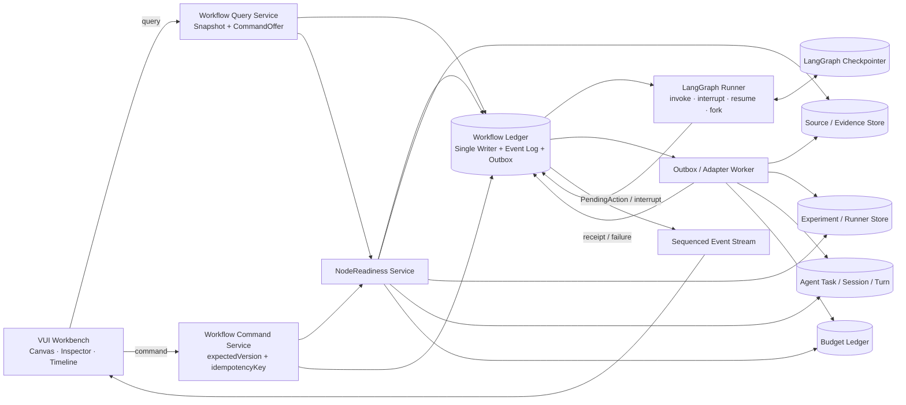
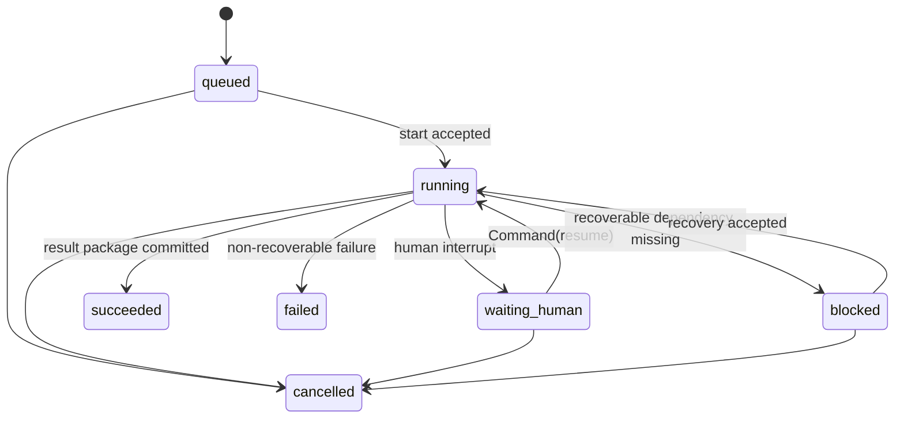
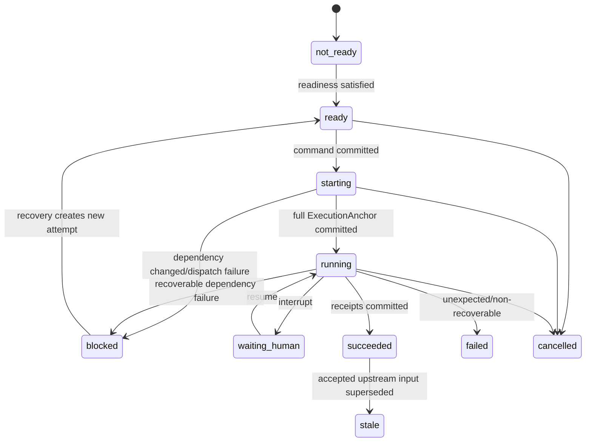

# 挑战杯科研工作流运行架构与实施方案

**状态：** Proposed for implementation

**日期：** 2026-08-12

**适用范围：** `challenge-cup-research`、Teams 科研工作台、科研 Agent 会话、资料/证据、实验与迭代链路

**决策依据：** [ADR 0006](../adr/0006-challenge-cup-workflow-runtime-and-single-canvas.md)、[ADR 0007](../adr/0007-research-workflow-handoff-and-agent-session-binding.md)

**替代关系：** 本文细化现行 ADR 的实现架构和迁移路径，不创建第二套产品流程；与旧计划冲突时，以 ADR 和本文的单一事实源、失败显式化、无兼容执行层为准。

## 1. 执行摘要

挑战杯科研工作流继续采用现有 LangGraph，不引入 CrewAI、Dify、n8n、AutoGen 或其他第二编排运行时。目标不是再画一张更漂亮的流程图，而是让用户从题目启动到结果打包的每次点击都对应一个可恢复、可审计、不会互相矛盾的状态转移。

推荐架构由五个核心部分组成：

1. **LangGraph Runtime**：唯一控制流运行时，负责节点顺序、条件分支、循环、人工中断、恢复与 fork。
2. **Workflow Ledger**：工作流领域的唯一写入面，记录 Run、NodeAttempt、Handoff、Command、ArtifactReceipt、Recovery lineage 和单调事件序列。
3. **NodeReadiness**：节点是否可执行的唯一判定服务，同时驱动后端命令校验和前端按钮；禁止前端或 adapter 自行复算。
4. **Canonical Domain Stores**：资料、证据、实验、预算、Agent 会话继续由各自唯一领域事实源持有；Ledger 只保存不可变引用和收据，不复制业务内容。
5. **Read Projection**：Canvas、Inspector、Timeline、Agent/Team 面板只消费同一 Snapshot + Event Stream，不写回状态，不猜测下一步。

最关键的行为变化：

- `preflight` 失败时不得创建预算预留、TaskBundle、Session、Turn 或“已接受”交接；
- Artifact 只有在领域事实源中已物化、可读取且 hash/版本校验通过后，才能生成 `ArtifactReceipt` 并接受 Handoff；
- Agent 节点只有在 `sessionId + taskId + turnId` 完整且权威会话可解析后才进入 `running`；
- 所有命令都带 `expectedVersion + idempotencyKey`，重复点击返回同一结果，过期命令明确冲突；
- 旧 JSON writer、旧 stage route、静默 fallback 和双写路径在迁移验证后物理删除，不保留兼容执行层。

## 2. 现状问题与根因

### 2.1 已观察到的失败

SCI-096 的纯点击验收暴露了同一类架构问题：画布显示 `evidence_relations` 可执行，但实际启动时 Source Collection 权威存储中没有可整理的候选资料；与此同时，预算预留和 TaskBundle 已经产生。其他可见问题还包括：

- 已接受的 Handoff 引用了 `evidence_card_batch`，但下游领域存储读不到对应内容；
- 历史运行可显示“重试”，执行时才发现 `failed_agent_task_missing`；
- 切换 Run 后仍展示上一个 Run 的命令错误；
- 选中任意 Run 后“创建运行”入口消失；
- “Agent 已配置”和“会话未绑定”没有区分配置态与执行态；
- 团队协调者可能从节点绑定推导成 `research_coordinator`，与团队角色权威不一致。

这些不是单独的按钮 Bug。它们共同说明：**多个组件在不同时间、根据不同存储自行判断“当前发生了什么”和“下一步能做什么”。**

### 2.2 当前技术债

当前实现具备重要基础，但职责尚未闭合：

- [`challenge_cup_graph.py`](../../core/research/workflow/challenge_cup_graph.py) 明确是“without business side effects”的控制图，外部 adapter 通过 `update_state(..., as_node=...)` 推进 checkpoint；因此 LangGraph 仍接近旁路控制图，而不是完整运行协调者。
- [`runtime.py`](../../core/research/workflow/runtime.py) 仍是三节点 HITL vertical slice，未承担 16 节点正式运行。
- [`agent_node_execution.py`](../../core/web/services/team_workflow/research_runtime/agent_node_execution.py) 当前先选择模型、预留预算、创建 TaskBundle，再调用 Source Collection 的真实 preflight；失败会留下不应存在的中间状态。
- [`stage_session.py`](../../core/web/services/team_workflow/source_collection/stage_session.py) 才读取 Source Collection 的真实 records/candidates/graph 指标，说明 readiness 判定发生得过晚。
- [`node_command_adapter.py`](../../core/web/services/team_workflow/research_runtime/node_command_adapter.py) 暴露的 capability 与 Source Collection 的正式 readiness 并非同一计算结果。
- 前端 Toolbar、命令错误和 Team/Agent 投影仍存在局部状态推导。

## 3. 目标、非目标与成功标准

### 3.1 目标

- 一个题目从创建 Run 到 `ResearchResultPackage` 可纯鼠标点击完成；
- 任意时刻只有一个组件有权写工作流状态；
- UI 可执行性与后端实际可执行性使用同一个 `NodeReadiness` 结果；
- 节点、Artifact、Agent task、Session、Turn、预算、人工任务和 Run lineage 可相互追溯；
- crash/restart 后恢复到最后一个已提交状态，不出现重复任务、重复扣费或假成功；
- 所有阻塞都给出用户可执行的恢复动作，不显示内部错误码作为主文案；
- 三个科研阶段保留在同一画布，以前端分区表达阶段，不把阶段做成三个互不相干的运行时。

### 3.2 非目标

- 不建设自由拖拽的低代码工作流编辑器；
- 不替换 LangGraph；
- 不把 CrewAI/Dify/RD-Agent 直接嵌入产品运行时；
- 不把 Canvas 或 React local state 变成运行事实源；
- 不复制 Source Collection、Evidence、Experiment 或 Session 的完整数据到 Workflow Ledger；
- 不为历史不一致数据提供静默 fallback 或长期双写兼容层。

### 3.3 成功标准

1. 同一 `runId + nodeId` 的“可点击”与后端执行结果不再矛盾。
2. preflight 拒绝时，预算、TaskBundle、Session、Turn、Handoff 接受数均不增加。
3. 任意重复命令只产生一个 NodeAttempt 和一个副作用结果。
4. 运行切换后 Canvas、Inspector、Timeline、错误和命令均属于新 Run。
5. Launcher 重启后 Run、节点状态、人工任务、会话锚点、预算和 lineage 一致。
6. SCI-096 全流程纯点击通过，验收过程中不调用 API 注入、DOM 脚本或直接改存储。

## 4. 成熟项目研究结论与复用决策

| 项目 | 借鉴内容 | Vibelution 的取舍 |
| --- | --- | --- |
| [CrewAI Flows](https://docs.crewai.com/v1.15.15/en/concepts/flows) | 结构化 state、唯一执行 ID、事件驱动 start/listen/router、持久化、resume/fork、全流程 usage 聚合 | 借鉴契约和可观测性；不引入运行时。明确拒绝其“找不到 persisted state 时静默回退”的语义。 |
| [LangGraph Persistence](https://docs.langchain.com/oss/python/langgraph/persistence) / [Interrupts](https://docs.langchain.com/oss/python/langgraph/interrupts) | thread/checkpoint、fault tolerance、time travel、interrupt、`Command(resume=...)`、节点边界恢复 | 直接采用；把现有旁路 `update_state` 改为由正式 Runner 通过 invoke/resume 推进。 |
| [Dify Workflow model](https://github.com/langgenius/dify/blob/main/api/models/workflow.py) | WorkflowRun 与 WorkflowNodeExecution 分离、运行级与节点级记录分开、暂停/恢复可投影 | 借鉴读模型和事件粒度；不复制其运行时或许可受限代码。 |
| [AI Scientist](https://github.com/SakanaAI/AI-Scientist) | baseline、run 目录、实验输出、图表、论文与评审形成可复现实验包 | 借鉴 Artifact/实验可复现合同；不允许 Agent 生成代码后未经受控 runner 与人工门直接执行。 |
| [RD-Agent](https://github.com/microsoft/RD-Agent) | Research 与 Development 分工、迭代反馈、执行 trace、场景化研发循环 | 借鉴研究/实现分工与 trace；不复制 Linux/场景特定运行层。 |

复用结论：**ADAPT，不 REPLACE。** 现有 LangGraph、Source Collection、Agent Session、Budget、Experiment/Evidence 资产继续使用；新增的只是让这些资产遵循一个可验证的工作流合同。

## 5. 架构原则与不可破坏约束

1. **Single writer**：Workflow Ledger 是工作流状态唯一 writer；projection、UI、adapter 不得直接改 Run/Node 状态。
2. **One fact, one authority**：每类事实只能归属一个权威存储；其他组件只保存 ID、版本、hash 和 receipt。
3. **Readiness before side effects**：任何预算、TaskBundle、Session、Turn、Runner lease 之前先完成 readiness。
4. **Materialization before handoff**：Artifact 未在领域事实源物化并通过 canonical read-back，Handoff 不得 accepted。
5. **Anchor before running**：Agent 节点无完整会话锚点不得 `running`；System/Human 使用各自完整 ExecutionAnchor。
6. **Append-only lineage**：重试创建新 attempt，修订创建 child run；不覆盖已接受输入和历史执行。
7. **Versioned commands**：写命令必须带 `expectedVersion` 和 `idempotencyKey`。
8. **Event after commit**：只有持久事务提交后才能发布事件；每次状态变化有唯一 sequence。
9. **Fail closed**：缺失 team、Artifact、Agent、Session、Task、checkpoint 或版本时明确失败，不选默认值。
10. **Projection is disposable**：Canvas/Inspector/Timeline 可从 Ledger + Domain Stores 重建。
11. **Budget is a safety fence**：预算用于阻止无限循环，不用于压缩正常 Agent 工作；默认值保持宽松。
12. **No compatibility runtime**：迁移采用一次性验证和硬切换，不保留旧 writer、双写或静默读取 fallback。

## 6. 单一事实源矩阵

| 事实 | 唯一权威 | Workflow Ledger 保存 | 禁止 |
| --- | --- | --- | --- |
| 固定拓扑、节点类型、边、版本 | `WorkflowDefinition / WorkflowVersion` | `workflowVersionId`、definition hash | 前端硬编码另一份流程；运行中改拓扑 |
| Run/NodeAttempt 状态、Handoff、命令、recovery lineage | `Workflow Ledger` | 完整领域记录 | JSON snapshot、Canvas 或 checkpoint 直接成为产品状态 |
| LangGraph 执行位置与恢复 | LangGraph Checkpointer | `threadId/checkpointId` 引用 | 从 checkpoint 反推业务 Artifact 或预算 |
| 资料候选、筛选、提炼 | Source Collection Store | `CanonicalResourceRef` + receipt | 在 Handoff 内复制候选列表并当真源 |
| Claim、Evidence、关系图 | Evidence Store | artifact/version/hash + quality receipt | 前端关系图写回 Run 状态 |
| 协议、实验、指标、结果 | Experiment/Runner Store | immutable artifact refs + execution receipt | Agent 文本输出直接宣称实验完成 |
| Token/tool/time/compute 消耗 | Budget Ledger | reservation/ref/settlement event | 前端估算余额；preflight 前预留 |
| Agent 配置 | Agent Directory + Run binding snapshot | immutable `RunAgentBindingSnapshot` | 运行中读取可变显示名决定授权 |
| Task/Session/Turn | Session/Agent Task authority | `NodeAgentSessionBinding` | session 缺失时跳到 Agent 默认会话 |
| 用户界面 | Read Projection | 无写权限 | local state 决定后端 command availability |

`teamId` 是所有上述资源的强制 scope。URL、API、Ledger、Domain Store 和 Session binding 必须一致；缺失或不匹配返回明确错误，不兼容 `team_id`、selected-team 或默认 `research-team`。

## 7. 组件架构



### 7.1 Workflow Command Service

唯一公共写入口，职责只包括：

- 验证 `teamId/runId/nodeId/expectedVersion/idempotencyKey`；
- 读取 NodeReadiness；
- 在一个 Ledger 事务中追加 command、状态变化和 outbox；
- 返回已提交结果或明确冲突；
- 不直接执行外部 Agent、LLM、runner 或 Source Collection 副作用。

### 7.2 Workflow Ledger

推荐使用单独的 SQLite/WAL store，单写入者、有界队列、只读查询连接。低层连接、APSW 安全版本检查、writer actor 和只读连接模式应复用或提炼现有 `core/chat/conversation_store/` 的成熟实现，但研究领域使用独立 schema/repository，不导入 Chat repository。LangGraph checkpoint 可位于同一 durable data root，但使用独立 schema/repository；两者职责不同，不通过共享表耦合。

Ledger 最小表：

```text
workflow_runs
node_attempts
workflow_commands
workflow_events
human_tasks
handoffs
artifact_receipts
execution_anchors
recovery_records
outbox_actions
projection_cursors
```

不建立分布式事务。Ledger 与外部领域存储通过 transactional outbox、idempotent adapter、read-back verification 和 reconciliation 收敛。

本文的 **Workflow Ledger** 是工作流领域写模型；现有名称相近的 **ResearchLedger** 继续作为科研事实的只读聚合投影。ResearchLedger 不得回写 WorkflowRun，也不得替代 Evidence/Experiment 等领域事实源。

### 7.3 LangGraph Runner

正式 Runner 取代 adapter 直接 `update_state(..., as_node=...)` 的旁路方式：

1. Command Service 提交 `WorkflowCommandAccepted` 和 `graph_dispatch` outbox；
2. Runner 消费 `graph_dispatch`，以固定 `thread_id = runId` invoke/resume；
3. Agent/System 节点产出结构化 `PendingAction`，自动 interrupt；
4. Coordinator 把 PendingAction 以 `adapter_dispatch` outbox 写回 Ledger；
5. Adapter 完成后返回 `ExecutionReceipt`；
6. Runner 使用同一 thread 的 `Command(resume=receipt)` 继续；
7. Human 节点同样 interrupt，但等待真实操作者点击后 resume；
8. 修订从明确 checkpoint fork 新 run，原 thread 历史不改。

节点函数保持小、确定、可重放。interrupt 之前的任何逻辑必须幂等；外部副作用不得藏在会被重新执行的代码中。

## 8. 核心领域合同

### 8.1 NodeReadiness

```text
NodeReadiness {
  teamId
  workflowId
  workflowVersionId
  runId
  runVersion
  nodeId
  nodeAttempt?
  status: not_ready | ready | blocked
  canStart: boolean
  requiredArtifacts: ArtifactRequirement[]
  canonicalResourceRefs: CanonicalResourceRef[]
  actorReadiness: ActorReadiness
  budgetReadiness: BudgetReadiness
  blockedCode?
  blockedReason?
  recoveryAction?: RecoveryAction
  checkedAt
  ledgerSequence
}
```

规则：

- 由后端唯一服务计算，结果带 `ledgerSequence`；
- Source Collection 节点必须查询真实 records/candidates/evidence graph；
- `ready` 必须意味着同一版本下 command 立即可被接受；
- 前端只能渲染 `CommandOffer`，不得根据 NodeRun status 或 Artifact 数量自行开启按钮；
- command 提交后若 `expectedVersion` 已过期，返回 `workflow_version_conflict` 并刷新 Snapshot。

### 8.2 CommandOffer 与 CommandRequest

```text
CommandOffer {
  command
  available
  reason?
  recoveryAction?
  requiresConfirmation
  expectedVersion
  expiresAt?
}

CommandRequest {
  teamId
  runId
  nodeId?
  command
  expectedVersion
  idempotencyKey
  payload
  requestedBy
}
```

禁止由 UI 传入 `available=true`、下一节点或目标状态。后端根据 WorkflowDefinition、NodeReadiness 和权限决定。

### 8.3 NodeAttempt 与 ExecutionAnchor

```text
NodeAttempt {
  nodeRunId
  runId
  nodeId
  attempt
  actorKind
  status
  bindingSnapshotRef?
  executionAnchor?
  startedAt?
  finishedAt?
  failure?
  retryOfNodeRunId?
}

ExecutionAnchor =
  AgentAnchor  { agentId, sessionId, sessionAttempt, taskId, turnId }
  SystemAnchor { actionId, leaseId, runnerId }
  HumanAnchor  { humanTaskId }
```

Agent `running` 的必要条件是 AgentAnchor 所有字段存在，且 Session authority 可按 `sessionId` 解析到冻结 `agentId`。配置已绑定但尚未执行时只显示“Agent 已配置”；不得显示“会话已绑定”。

### 8.4 ArtifactReceipt 与 Handoff

```text
ArtifactReceipt {
  receiptId
  teamId
  runId
  producerNodeRunId
  artifactType
  canonicalRef
  version
  sha256
  materializedAt
  verifiedAt
  verifier
}

NodeHandoffRecord {
  handoffId
  runId
  fromNodeRunId
  toNodeId
  gateKind
  artifactReceiptIds[]
  inputSnapshotHash
  status: pending | ready | waiting_human | accepted | rejected | superseded | failed
  offeredAt
  acceptedAt?
  acceptedBy?
  supersedesHandoffId?
}
```

`ArtifactManifest` 只是索引；`ArtifactReceipt` 是“领域存储已物化且可读”的收据。Handoff 接受事务必须验证所有 receipt 仍可读取并匹配 version/hash。

### 8.5 WorkflowEventEnvelope

```text
WorkflowEventEnvelope {
  eventId
  sequence
  teamId
  workflowId
  workflowVersionId
  runId
  runVersion
  type
  occurredAt
  actor
  correlationId
  causationId?
  payload
}
```

事件不得携带 secret、完整 Prompt、长文本 Artifact 或模型原始输出；只传裁剪摘要和 canonical refs。

## 9. 状态机

### 9.1 WorkflowRun



`blocked` 是非终态但不可自动前进；必须有 `RecoveryAction`。`failed` 是当前 Run 不能继续，修复输入时通常 fork 新 run。

### 9.2 NodeAttempt



`retry` 不把同一 attempt 从 `failed/blocked` 改回 `running`，而是创建 `attempt + 1`，保留 `retryOfNodeRunId`。

### 9.3 预算预留

```text
planned -> reserved -> charged
                   -> released
                   -> voided
```

- readiness 前只有 planned estimate，不写 reservation；
- command 已提交但任务未建立时可以 reserved；
- AgentAnchor/SystemAnchor 建立后按真实 usage 结算 charged；
- 用户取消且未消费为 released；
- 异常补偿为 voided，并记录 reason/correlationId；
- 每个 reservation 必须且只能进入一个终态。

默认安全预算保持当前推荐档：每阶段 `250000` tokens、全流程 `300` tool calls、`21600` 秒、`2` 次自动重试；它是防无限循环的上限，不是必须消耗完的配额，也不用于降低 Agent 的正常推理质量。所有 Run 冻结预算快照，人工扩容走显式 command/event。

## 10. 端到端命令事务

以 `start_agent_task` 为例：

1. UI 从 Snapshot 收到可用 `CommandOffer`；
2. 点击后提交 `CommandRequest(expectedVersion, idempotencyKey)`；
3. Command Service 重算 NodeReadiness；
4. 不 ready：返回结构化 `WorkflowProblem`，预算、TaskBundle、Session、Turn、Handoff 均不变化；
5. ready：Ledger 单事务创建 command、NodeAttempt=`starting`、`graph_dispatch` outbox 和事件；此时不预留预算；
6. Runner 消费 `graph_dispatch`，图节点产出 PendingAction，Coordinator 事务性写入 `adapter_dispatch`；
7. Worker 先按 CommandOffer 中的 canonical refs/version/hash 重新 read-back；依赖已变化则阻塞 attempt，仍不预留预算；
8. Worker 向 Budget Ledger 发起幂等 reservation，成功后把 BudgetReservationReceipt 写回 Workflow Ledger；
9. Worker 创建/复用 Agent task 和项目级 Session；
10. Session authority 返回 `sessionId + taskId + turnId`；
11. Ledger 校验冻结 agentId 后提交 AgentAnchor、NodeAttempt=`running`、`node_started`；
12. Agent 完成后 adapter 在领域存储物化 Artifact；
13. read-back verifier 生成 ArtifactReceipt；
14. Ledger 提交 NodeAttempt=`succeeded`、Handoff=`ready/accepted` 和 `node_completed`；
15. Runner 以 receipt resume，推进下一节点；
16. SSE 发布已提交 sequence，前端增量更新；断线时用 `Last-Event-ID` 续传。

任何步骤 crash 后，reconciler 根据 command/outbox/anchor/receipt 状态幂等继续；不得重新创建不同任务或重复扣费。

## 11. 错误分类与恢复合同

```text
WorkflowProblem {
  code
  category: transient | llm_recoverable | user_fixable | evidence_insufficient |
            stale_version | historical_missing | non_recoverable
  title
  userMessage
  technicalSummary?
  recoveryAction?
  retryable
  correlationId
}
```

| 类别 | 状态与处理 | 前端动作 |
| --- | --- | --- |
| transient | 保留当前 attempt 或创建受控 retry；指数退避、有上限 | “重试”并显示下次尝试时间 |
| llm_recoverable | 由图回到明确校验/修订节点，携带结构化错误 | “继续修订” |
| user_fixable | Run/Node `blocked` 或 `waiting_human` | 展示缺什么和唯一修复入口 |
| evidence_insufficient | 创建 Evidence Remediation child run | “补充证据”并跳到 child run |
| stale_version | 不执行；刷新 Snapshot | 自动刷新后提示“状态已更新” |
| historical_missing | 原 Run 保持不可变，fork 新 Run | “基于当前资料重新开始” |
| non_recoverable | 当前 Run `failed`，保留诊断 | “查看诊断 / 创建新运行” |

错误 UI 必须 scope 到 `runId + nodeId + commandId`。切换 Run/节点时旧错误移出当前视图；Timeline 仍可查看历史失败。原始 stack、内部 ID 和英文 code 放在折叠“技术详情”，不作为用户主文案。

## 12. 前端交互与投影

### 12.1 页面结构

- 单一 canonical Teams URL：`/teams?teamId=...&researchView=workflow&workflowId=...`；
- 三阶段同一画布，以 compound section 分区；section 只负责视觉分隔和布局，不持有运行状态；
- Workspace Header 始终提供“创建运行”，Run 切换器使用题目/创建时间/状态等用户语义，内部 `run-*` ID 仅在技术详情显示；
- Canvas 展示结构与运行 overlay；Inspector 展示所选节点的 readiness、Agent、会话、Artifact、命令和恢复动作；Timeline 展示按 sequence 排序的事件；
- Agent 配置入口只有一个写事实源：节点检查器可跳 Agent Center，返回时保持 `runId + nodeId`；运行快照只读，换绑走 `rebind_node`。

### 12.2 状态文案

| 后端状态 | 用户文案 | 主操作 |
| --- | --- | --- |
| not_ready | 等待前置条件 | 查看缺失条件 |
| ready | 可以开始 | 开始任务 |
| starting | 正在准备 | 无重复按钮 |
| running | 正在执行 | 打开会话/查看运行 |
| waiting_human | 等待确认 | 审核并决定 |
| blocked | 需要处理 | 执行 recoveryAction |
| failed | 本次未完成 | 查看原因/创建新运行 |
| succeeded | 已完成 | 查看产物 |
| cancelled | 已取消 | 创建新运行 |

“Agent 已配置”只说明 Run binding snapshot 完整；“会话已建立”只在 AgentAnchor 完整时显示。不能再用“未绑定 Agent”概括 session 尚未创建。

### 12.3 查询与事件

- 首次加载：`GET snapshot`，返回 `snapshotSequence`；
- 建立 SSE：从 `snapshotSequence + 1` 开始；
- 事件按 `eventId + sequence` 去重；
- 切换 Run 必须清空 cursor、pending request、局部错误和旧详情；
- 慢响应按 request generation 丢弃，不能覆盖新 Run；
- snapshot 空事件不触发无条件全量刷新；
- 不允许静默 polling fallback。SSE 不可用时显示连接状态与手动刷新。

最小事件集：

```text
workflow_created
workflow_started
workflow_waiting_human
workflow_blocked
workflow_resumed
workflow_succeeded
workflow_failed
workflow_cancelled
node_readiness_changed
node_starting
node_started
node_waiting_human
node_blocked
node_completed
node_failed
handoff_offered
handoff_accepted
handoff_rejected
artifact_materialized
budget_reserved
budget_settled
session_bound
run_forked
```

## 13. 数据一致性、并发与恢复

### 13.1 并发控制

- `workflow_runs.runVersion` 单调递增；
- command 用 optimistic concurrency；
- `idempotencyKey` 在 `teamId + runId + command` 范围唯一；
- NodeAttempt 唯一键：`runId + nodeId + attempt`；
- outbox worker 以 actionId 单飞；
- adapter 对外部副作用使用同一 idempotency identity；
- Handoff 唯一业务身份：`runId + fromNodeRunId + toNodeId + inputSnapshotHash`。

### 13.2 Crash-safe 持久化

- Ledger transaction：command、状态、outbox、event 同事务；
- SQLite WAL + fsync/transaction durability；
- projection 可重建，不参与提交；
- checkpoint 和 Ledger 通过 `runId/threadId + checkpointId + correlationId` 对账；
- checkpoint 已推进但 Ledger 未提交或相反时，reconciler 明确标记 `reconciliation_required`，禁止猜测成功。

### 13.3 Reconciliation

定时与启动时执行只读对账：

- starting 超时但无 outbox lease；
- reservation 无 active command；
- Agent task 有 session 但 Ledger 无 anchor；
- receipt 指向不可读 canonical ref；
- accepted Handoff 缺 receipt；
- checkpoint next node 与 Ledger active node 不一致；
- terminal Run 仍有未决 HumanTask/Reservation。

自动修复仅限可证明幂等的补登记或释放；任何可能改变科研结论的情况进入 `reconciliation_required`，由操作者确认。

## 14. 安全、权限与可观测性

- 所有 command 校验 team membership、workflow role 和 Agent 工具授权；
- HumanTask 决策记录操作者、时间、输入 hash、决策和理由；
- System runner 使用受控 adapter，Agent 不能通过对话文本直接启动正式实验；
- imported document、URL、Agent output 均为不可信输入，进入 Prompt/索引前走来源、清洗和隔离；
- 事件和日志只记录裁剪 metadata、correlationId 和 canonical refs；
- runtime scene 至少记录 command accepted/rejected、readiness blocked、outbox dispatch/result、anchor bound、artifact verified、reconciliation finding；
- 每个用户可见失败都能通过 correlationId 对应到一个结构化 `WorkflowProblem`。

关键指标：

```text
command_accept_latency_ms
node_start_anchor_latency_ms
node_duration_ms
readiness_block_count{code,node}
outbox_retry_count{adapter}
duplicate_command_suppressed_total
artifact_verification_failure_total
reconciliation_finding_total{kind}
workflow_recovery_success_total{action}
budget_reserved / charged / voided
```

## 15. 无兼容迁移与硬切换

迁移不采用长期 dual-write、fallback read 或 legacy resolver。

### T0 · 现场冻结与审计

- 停止创建新的正式科研 Run；
- 备份现有 WorkflowRun JSON、checkpoint、source collection、budget、task/session 索引；
- 输出 run-by-run 对账报告；
- 对 orphan reservation、missing task/session、假 Handoff、不可读 Artifact 分类，不静默修补。

### T1 · 合同与 Ledger

- 建立 Workflow Ledger schema/repository/single writer；
- 固化 NodeReadiness、CommandRequest、WorkflowProblem、ArtifactReceipt、ExecutionAnchor；
- 用 contract/property tests 锁定状态转移和不变量；
- 现有 JSON store 只作为迁移输入，不再扩展。

### T2 · 事务命令与 Adapter

- 所有 node command 进入 Command Service；
- readiness 前移到任何副作用之前；
- 增加 outbox、worker、idempotent receipt；
- Source Collection、Agent Session、Experiment Runner、Budget 接入 canonical adapter。

### T3 · LangGraph 正式运行

- 将 16 节点图接入正式 Runner；
- Agent/System 使用 PendingAction 自动 interrupt/resume；
- Human 使用 `interrupt()` + `Command(resume=...)`；
- 删除 adapter 直接 `update_state(as_node=...)` 的正常执行路径；
- retry、loop、fork 和 recovery 均通过正式图语义。

### T4 · Query/Event/VUI

- 建立 Snapshot + sequenced SSE；
- Canvas/Inspector/Timeline/Agent/Team 使用同一 projection；
- 后端 CommandOffer 替代前端 capability 推导；
- 修复创建 Run 永久入口、Run 切换清理、用户语义标签和错误 scope。

### T5 · 一次性数据迁移

- validator 将可证明一致的历史 Run 写入 Ledger；
- 不一致 Run 标记 `reconciliation_required` 或只读 archived；
- 验证记录数、hash、lineage、预算、session/task anchor；
- 通过切换门后停旧 writer；
- 删除旧 JSON 写路径、legacy route/resolver、fallback、重复页面和未连接入口。

### T6 · 正式验收与收尾

- backend/frontend/build/contract 门全绿；
- Launcher refresh 后进行 SCI-096 纯鼠标全流程；
- crash/restart、重复点击、断流恢复、blocked recovery、fork、结果打包均实机验证；
- 清理迁移脚本临时文件、测试 Run、orphan Session/Task、旧页面、旧 design 注册和过期文档；
- 更新 ADR 状态、模块 README、测试矩阵和版本影响。

切换闸：T1-T4 全绿、迁移 dry-run 零未知错误、回滚备份验证可读、active work 为 0。切换后若失败，恢复整个数据目录和旧版本二进制；不在新旧 writer 间动态 fallback。

## 16. 实施任务图

### Critical Path

```text
T0 现场审计
  -> T1 Ledger + contracts
    -> T2 transactional command/outbox
      -> T3 LangGraph formal runtime
        -> T4 projection/VUI
          -> T5 hard cutover migration
            -> T6 Launcher pure-click acceptance
```

### Task 1: Workflow Ledger 与核心合同

- **Owner/Boundary：** `core/research/workflow/contracts/`、新 Ledger repository、focused tests；不改 UI。
- **Dependency：** T0 对账清单。
- **Mode：** BDD_TDD。
- **Verification/Stop：** 状态机 property tests、单写入/并发/idempotency/crash-safe；任一事实无法归权威时停止。

### Task 2: NodeReadiness 与命令事务

- **Owner/Boundary：** `team_workflow/research_runtime` service pack、Source/Evidence/Budget/Session adapters。
- **Dependency：** Task 1 contracts。
- **Mode：** BDD_TDD。
- **Verification/Stop：** preflight failure 零副作用；同一 Offer/command 版本一致；重复点击唯一结果。

### Task 3: LangGraph 正式 Runner

- **Owner/Boundary：** `core/research/workflow/` graph/runtime/checkpoint integration；不改领域 store。
- **Dependency：** Task 2 PendingAction/receipt contract。
- **Mode：** BDD_TDD。
- **Verification/Stop：** 16 节点、interrupt/resume、retry、loop、fork、restart 恢复通过；无正常路径 `update_state(as_node=...)`。

### Task 4: Query/Event 与 VUI 工作台

- **Owner/Boundary：** typed API、SSE reducer、VUI product/recipe、Teams workflow route；不写运行状态。
- **Dependency：** Task 1-3 snapshot/event/command contract。
- **Mode：** BDD_TDD。
- **Verification/Stop：** VUI contracts、route/layout tests、slow-response/run-switch tests、`tsc -b`、build、浏览器点击路径。

### Task 5: 数据迁移与旧路径删除

- **Owner/Boundary：** one-shot migrator、validator、legacy 文件/route/writer 清理。
- **Dependency：** Task 1-4 全绿；active work=0；备份授权。
- **Mode：** BDD_TDD。
- **Verification/Stop：** dry-run、record/hash/count reconciliation、rollback rehearsal；存在 unknown classification 时禁止 cutover。

### Task 6: 正式运行验收与清理

- **Owner/Boundary：** Launcher/Workbench 实机、测试数据与任务资源清理、文档/版本收口。
- **Dependency：** Task 5 cutover。
- **Mode：** SIMPLE + runtime acceptance。
- **Verification/Stop：** SCI-096 纯点击、重启恢复、无 console error、activeWork 回零、无 orphan 资源。

Task 1-3 共享核心 contract，必须串行；Task 4 可在 Task 1 合同冻结后并行开发 mock projection，但正式合并必须等待 Task 2-3。Task 5-6 是高风险独立闸门，不能与 active production work 并行。

## 17. 文件影响面

以下是实施定位，不要求一个任务一次修改全部文件：

| 领域 | 主要路径 |
| --- | --- |
| Graph/runtime/checkpoint | `core/research/workflow/challenge_cup_graph.py`、`runtime.py`、`checkpoint_store.py` |
| Contracts | `core/research/workflow/contracts/`、`models.py` |
| Workflow service pack | `core/web/services/team_workflow/research_runtime/` |
| Source authority | `core/web/services/team_workflow/source_collection/` |
| Thin HTTP | `core/web/routes/team_workflows/research_runtime.py` |
| Typed frontend API | `web/src/api/researchWorkflow.ts`、`web/src/api/types/researchWorkflow.ts` |
| Workbench | `web/src/routes/teams/research-workflow/` |
| VUI | 仅在缺少公共能力时扩展 `web/src/components/vui/` 并登记 designs |
| Backend tests | `tests/test_research_workflow_*`、`tests/test_team_workflow_*` |
| Frontend tests | research-workflow colocated tests、Teams route/layout、VUI contracts |

保持“一个功能一个文件/模块”的现有约束：Ledger repository、readiness evaluator、command service、outbox worker、event reducer、projection builder、migration validator 分开；不得把新职责重新堆入单一 facade 或 Route。

## 18. 验收矩阵

### 18.1 合同与单元测试

- 所有非法状态转移被拒绝；
- NodeReadiness 与 command acceptance 使用同一 evaluator；
- preflight failure 零副作用；
- accepted Handoff 必须有 verified receipt；
- Agent running 必须有 canonical AgentAnchor；
- reservation 只有一个终态；
- retry/fork lineage append-only；
- teamId 缺失/不匹配明确失败。

### 18.2 并发与故障注入

- 双击、网络重试、乱序事件、慢响应；
- outbox dispatch 前/后 crash；
- session 创建后、anchor 提交前 crash；
- Artifact 写入后、receipt 提交前 crash；
- checkpoint/ledger 单边提交；
- SSE 断开和 `Last-Event-ID` 恢复；
- Launcher 重启后无重复任务/扣费。

### 18.3 前端门禁

- `vuiShadcnRouteContract`、`vuiComponentDesignContract`；
- Teams workflow route/layout/interaction tests；
- Run 切换清空 cursor/error/pending request；
- 创建运行始终可达；
- raw ID/技术错误默认不暴露；
- `npx tsc -b --pretty false` 与 `npm run build` 通过。

### 18.4 纯点击用户验收

验收员只能进行可见鼠标/键盘操作：

1. 选择 SCI-096；
2. 创建新 Run；
3. 查看冻结题目、Agent 分工和宽松安全预算；
4. 依次完成资料寻找、提炼、证据关系、知识入库；
5. 在人工门审阅并交接 Knowledge Package；
6. 完成假设、协议、评审、冻结和 Smoke 放行；
7. 启动受控实验、查看运行和 Agent 会话；
8. 查看评价、做迭代决策、完成版本治理/候选提升；
9. 生成 Research Result Package；
10. 重启 Launcher，重新打开同一 Run，状态、Timeline、Artifact、会话与预算一致。

禁止：直接请求 API、执行 DOM script、编辑 URL 跳过门禁、修改 JSON/SQLite、注入测试状态。任一步只能靠这些方式继续即验收失败。

## 19. 风险与控制

| 风险 | 控制 |
| --- | --- |
| Ledger 与 checkpoint 双持久化产生漂移 | 明确职责、correlation/checkpoint 引用、reconciler、失败显式化 |
| 一次切换风险高 | dry-run + backup + record/hash 对账 + activeWork=0 + rollback rehearsal |
| 状态/DTO 变更影响前后端 | 先合同 tests，typed API，同一 version gate，分任务串行 |
| 外部 adapter 重复副作用 | transactional outbox + stable idempotency identity + receipt read-back |
| Agent 会话历史缺失 | 原 Run 不伪修；明确 historical_missing，fork 新 Run |
| 预算误伤科研质量 | 250k/阶段推荐上限，预算仅防循环，可显式扩容，不做隐式降级 |
| UI 再次自行推导 | CommandOffer/NodeReadiness 后端唯一计算，route contract 禁止本地 capability |
| 大文件重新膨胀 | 按 Ledger/readiness/command/outbox/projection/reducer 独立模块与 owner 边界实施 |

## 20. 完成定义

只有同时满足以下条件，才可以宣称架构落地完成：

- Workflow Ledger、NodeReadiness、事务命令、outbox、正式 LangGraph Runner 已接入；
- 旧 JSON writer、旧 route/resolver、fallback、重复页面已删除；
- 迁移报告无 unknown，不一致历史 Run 已显式归档或待人工对账；
- 所有 contract/test/build 门通过；
- Launcher 运行当前 HEAD，runtime/frontend provenance 一致；
- SCI-096 纯点击全流程和重启恢复通过；
- 测试 Run、orphan Task/Session/reservation、临时迁移文件和旧页面入口已清理；
- ADR/README/测试矩阵/版本影响已同步。

任何 “degraded / partial / compatibility / fallback” 均不能作为本方案的完成状态。
