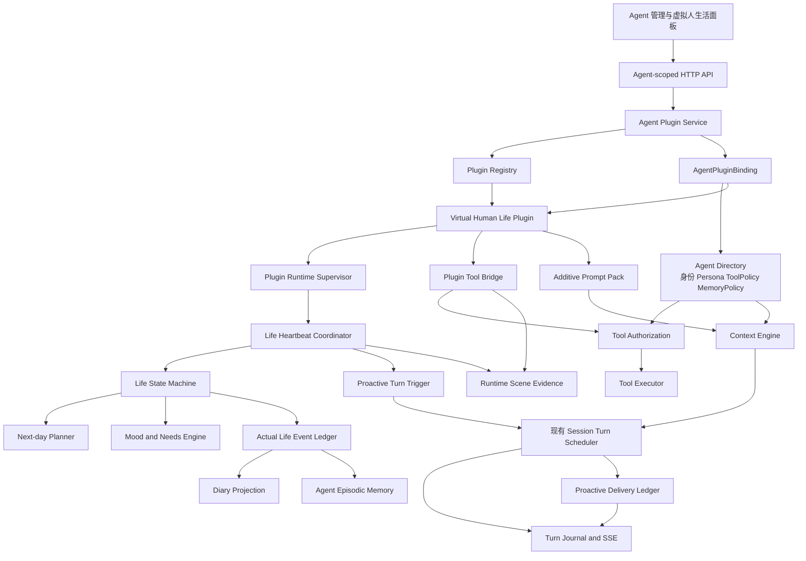
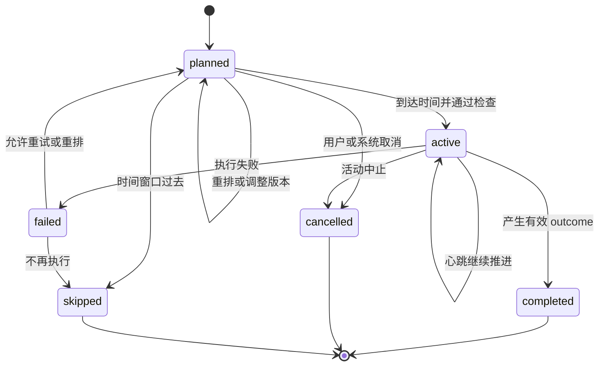
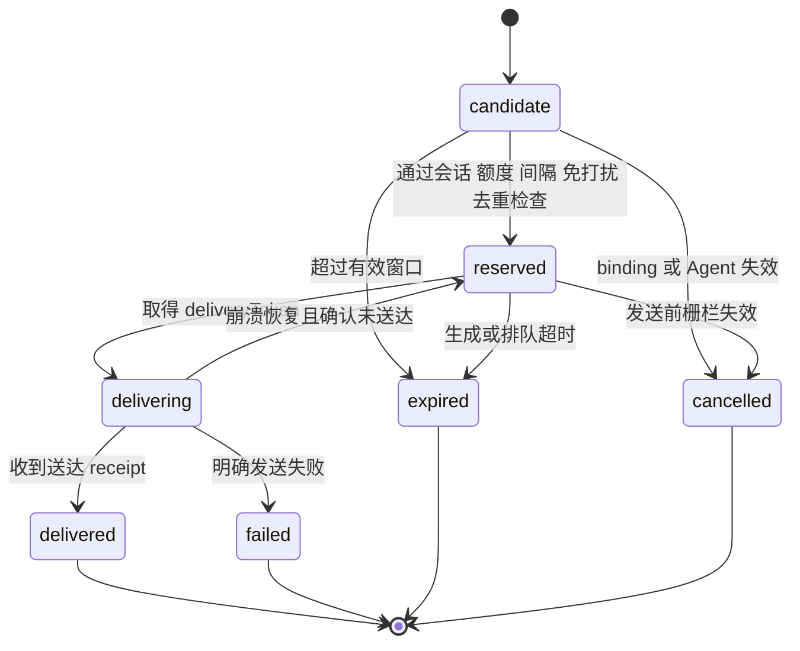
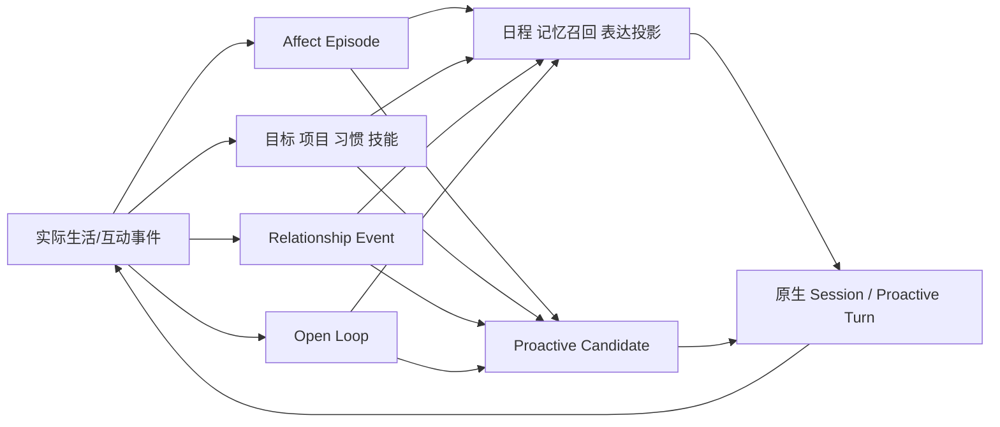
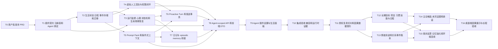

# 虚拟人生活插件 PRD 与实施规划

- Status: `active-plan`
- Owner: Vibelution product planning
- Scope: 按单个 Agent 启用的独立虚构人物生活插件；包含生活心跳、主动活动、心情、次日规划、日记、长期记忆、工具包、提示词包、主动消息、因果连续的长期目标/情绪余波/关系账本/未完话题和隔离验收
- Planning snapshot: Vibelution `main@3d7d11dc529a36dd9717c5f78ac26e390c439e40`；首版外部参考固定到 `menglimi/astrbot_plugin_private_companion@8c2d982b1148d521e0a4889f4ba1b8309b011d5e`；拟人化第二阶段研究快照为 `main@85cc366ee6e1ccf08b357e8b9e396c3abb842ff4`
- Supersedes: 无
- Implementation link: 首版实现已合入本地 `main`；用户于 2026-08-29 批准第二阶段因果连续性改造，并确认已与 AstrBot Private Companion 上游沟通，允许在 Vibelution 中选择性复用和改造其代码
- Validation: 用户决策复核、本地 owning surface 核查、外部参考代码切片核查、插件/API/工具/主动轮次测试、生命周期回归、前端合同与构建、浏览器运行时验收、`git diff --check`
- Close condition: 用户批准后转为 `user-approved`；实施开始后转为 `active-plan`；实施完成、被替代或放弃时转为 `implemented`、`superseded` 或 `historical` 并按项目规则归档

## 1. 文档边界

本文件是产品需求、架构和任务图的实施基线，不覆盖 `AGENTS.md`、`docs/standards/`、ADR、模块 README 或现有代码事实。用户已批准按本方案开发，并于桌面端隔离预览后确认当前人物大厅、人物栏和原生 Chat 复用结果；生产前端可按已批准结构完成收口，不再扩张到移动端或第二套聊天界面。

## 2. 已冻结的产品决策

1. 虚拟人是独立存在的虚构人物，不是用户替身，也不是附属电子宠物。
2. 能力以真实 Vibelution 插件形式存在，并按 `agentId` 显式绑定；未绑定 Agent 必须零影响。
3. 插件启用时，生活心跳和主动消息同时开启；主动消息仍受次数、间隔、免打扰和会话可用性约束。
4. 默认自主等级为 `autonomous`：可主动选择纯模拟活动、调整日程并使用已授权工具，但不能绕过 ToolPolicy。
5. 第一版交付可信第一方插件包和可扩展插件契约，不开放任意第三方 Python 动态加载、插件市场或不可信代码沙箱。
6. 旧 `pet_info.json` 不自动绑定给任何 Agent；只能通过带预览和 receipt 的显式导入操作迁移到用户指定 Agent。
7. 计划与实际经历严格分离。只有实际完成且具有有效 outcome 的活动可以进入日记；长期记忆还需通过重要性晋升。
8. 应用关闭期间不宣称实时运行。启动后只允许合并漏掉的心跳；纯模拟活动仅在规则能产生有效 outcome 时形成 `simulatedAfterRestart=true` 事件，工具型活动不得推定完成。
9. 主动生活触发使用正式的 `proactive_turn` 内部来源，不通过普通 `submit_session_message()` 伪造用户消息。
10. 插件启用或后端重启会恢复生活心跳和主动消息能力，但不等于立即发送“启动问候”；任何实际发送仍需通过有效期、额度、间隔、免打扰、会话和权限门。
11. 拟人化第二阶段以“实际事件 → 情绪/目标/关系/未完事项 → 计划/表达/主动联系 → 新实际事件”为唯一因果闭环，不增加无来源的人设或数值漂移。
12. 默认保留原生实时会话，不通过人为延迟来伪造真实感；忙碌、休息和睡眠默认只影响状态、语气和主动联系。可选沉浸延迟须作为后续独立产品开关。
13. AstrBot Private Companion 的上游代码可在用户确认的授权范围内选择性复用和改造；每个实现切片必须固定上游 commit、记录来源与改造边界，且不得引入第二套 Agent、Session、Memory、ToolPolicy 或运行时权威。

## 3. 产品定位

插件使一个既有 Vibelution Agent 获得持续生活能力。身份、Persona、头像、LLM、Session、ToolPolicy 和 MemoryPolicy 继续由 Vibelution 现有 Agent 系统管理；插件只拥有生活状态、日程、活动、心情、关系投影、日记投影和生活运行时。

启用后，该 Agent 拥有自己的：

- 人格延续、背景和生活偏好；
- 心情、体力、睡眠状态、社交需求和当前位置；
- 今日安排和次日计划；
- 正在进行、完成、取消、跳过或失败的活动；
- 实际生活事件、日记和长期记忆；
- 对用户及其他角色的关系状态；
- 虚拟人工具包和附加提示词包；
- 低频、受控、默认开启的主动消息能力。

## 4. 目标与非目标

### 4.1 目标

- 一个 Agent 可独立启用、禁用和恢复虚拟人插件。
- 每晚生成次日计划，白天由生活心跳推进。
- Agent 能根据心情、体力、活动结果和突发事件主动调整生活。
- 纯模拟活动不需要外部工具；真实动作必须经过 Agent 工具权限。
- 实际事件、日记、长期记忆形成可追踪证据链。
- 当前生活状态可以影响聊天语气和行为选择，但不能覆盖稳定 Persona 或权限。
- 普通 Agent 的 Prompt、工具、存储、会话和后台任务完全不变。

### 4.2 第一版非目标

- 任意第三方插件市场或不可信 Python 插件沙箱；
- 应用完全关闭后的真实后台常驻；
- 多 Agent 城镇级社会模拟；
- 自动操作用户文件、账号或外部服务；
- SillyTavern 完整角色卡兼容；
- 整仓复制外部参考仓库、引入 AstrBot 运行时或脱离来源 receipt 的无边界复制；
- 将全部现有 Agent 自动转换为虚拟人；
- 让计划本身成为日记或长期记忆。

## 5. 术语

| 术语 | 定义 |
| --- | --- |
| Agent Plugin | 可安装、可发现、可按 Agent 绑定并具有明确生命周期的 Vibelution 扩展包 |
| AgentPluginBinding | `agentId + pluginId` 的启用状态、配置、版本和权限引用 |
| 生活心跳 | 推进日程和活动状态的后台调度脉冲，不等同于 UI 心跳动画 |
| 纯模拟活动 | 只改变虚拟世界状态、不调用真实工具的活动，例如睡觉、散步、做饭、思考 |
| 工具型活动 | 需要调用搜索、文件、图片、消息等 Vibelution 工具的活动 |
| Plan Item | 日程中的意图记录，不代表实际发生 |
| Life Event | 带实际起止时间、outcome 和来源引用的已发生事件 |
| Outcome | 活动产生的可信结果；没有 outcome 不能完成活动 |
| Prompt Pack | 插件声明的稳定规则和动态生活上下文，以附加段注入而不替换 Agent 原提示词 |
| Tool Bundle | 插件声明的工具集合；最终可见和可执行范围是 Tool Registry、Agent ToolPolicy、插件绑定和当前活动授权的交集 |
| Proactive Turn | 由插件内部事实触发、没有用户消息的 Agent Turn；触发记录不投影为 `user_message`，可见结果仍按 assistant 消息进入现有会话 |
| Delivery Attempt | 一次主动消息发送事务；具有稳定 attempt ID、预留令牌、有效期和最终送达 receipt |
| Life Drive | 人物的长期目标、个人项目、习惯和技能；只能由已完成活动和可追溯事件推进 |
| Affect Episode | 一次有来源、对象、强度、置信度、余波和恢复语义的情绪事件；`state.mood` 只是其当前投影 |
| Relationship Event | 对一次互动、边界、冲突或修复的幂等账本记录；关系阶段和表达档位由账本派生 |
| Open Loop | 尚未解决的话题、承诺、稍后追问或等待条件；具有下次检查时间和明确终态 |
| Proactive Candidate | 由生活事件、Life Drive、Affect Episode、Relationship Event 或 Open Loop 形成的可分享意图；通过评分、抑制和发送前复核后才能进入 Delivery Attempt |
| Reflection Proposal | 夜间反思产生的待校验偏好、目标、技能或自我叙事更新；未通过来源、冲突和边界校验前不得写入稳定上下文 |

## 6. 用户故事

### 6.1 启用独立虚拟人

用户在 Agent 设置中启用插件。启用事务完成后，该 Agent 初始化生活状态、开始生活心跳并开启受控主动消息；其他 Agent 不发生任何变化。

### 6.2 每晚规划次日

虚拟人在配置的本地时间生成次日计划，例如起床、吃饭、阅读、散步、创作、休息和写日记。计划必须通过时间重叠、持续时间、体力预算和工具权限预检；同一 `agentId + localDate` 只能存在一个有效计划版本。

### 6.3 主动生活

心跳到达活动时间时，虚拟人可以开始计划活动、因状态变化推迟活动、取消或跳过活动、插入纯模拟活动，或重排后续日程。默认 `autonomous` 不代表无限权限：工具型活动仍需通过 ToolPolicy 和最终执行授权。

### 6.4 拥有自己的心情

心情是跨会话持久状态，由睡眠、活动结果、关系互动、计划失败和自然恢复共同影响。心情影响活动权重、计划选择和聊天语气，但不能直接修改 Persona、权限或事实记忆。

### 6.5 记录真实经历

活动完成后形成实际事件，例如：

```text
计划：下午阅读小说
实际：14:10 开始，15:05 结束
结果：读完两章，记录了一个有趣的人物设定
情绪变化：平静 +12
体力变化：-4
```

日记和长期记忆必须引用该实际事件，而不是只引用原计划。

### 6.6 主动联系用户

插件启用后主动消息默认开启。Agent 可以分享活动结果、在重要日期表达关心、询问用户是否愿意聊天或分享日记片段。主动消息必须服从每日次数、最小间隔、免打扰时间、会话可用性、插件绑定状态和消息工具授权。

### 6.7 拥有长期人生线

虚拟人可以有自己的长期目标、个人项目、习惯和技能。次日计划需从这些 Life Drive、当前需求、已有承诺和环境事实中选择下一步；只有具有 outcome 的完成事件能推进进度。

### 6.8 保留情绪余波与关系修复

情绪变化必须指向具体事件和对象，并按余波与恢复规则渐变，不得每轮对话立即回归默认心情。关系变化记入幂等事件账本，经过单次/每日上限、阶段迟滞、自然回落和道歉修复后，再投影为当前表达档位。

### 6.9 记得未说完的事

用户或虚拟人提到“稍后再说”、“完成后告诉你”或可验证的承诺时，形成 Open Loop。它可以在后续被解决、取消、过期或转化为主动候选，但不能每次对话重复追问。

### 6.10 经过生活再主动分享

生活事件先形成 Proactive Candidate，再综合价值、时效、新颖度、可分享性、用户未回复、主题重复、忙碌/睡眠、关系和免打扰决定是否发送。未进入 Delivery Attempt 的候选必须保留抑制原因和终态。

## 7. 功能需求

| 编号 | 功能 | 优先级 | 验收结果 |
| --- | --- | --- | --- |
| FR-01 | 插件安装、启用、禁用和卸载 | P0 | 可对单个 Agent 独立控制 |
| FR-02 | Agent 独立身份绑定 | P0 | 身份继续来自 Agent Directory |
| FR-03 | 心情、体力、睡眠、位置状态 | P0 | 状态跨会话、跨重启保存 |
| FR-04 | 每晚生成次日计划 | P0 | 同一日期幂等，不重复生成 |
| FR-05 | 活动状态机 | P0 | 支持计划、开始、完成、取消、跳过、失败和重排 |
| FR-06 | 生活心跳 | P0 | 只推进已启用 Agent，不为每次心跳调用 LLM |
| FR-07 | 主动模拟活动 | P0 | `autonomous` 可自主开始和调整纯模拟活动 |
| FR-08 | 工具型活动 | P0 | 经过 Agent ToolPolicy，拒绝越权 |
| FR-09 | 虚拟人工具包 | P0 | 只有绑定 Agent 能看到和调用 |
| FR-10 | 虚拟人提示词包 | P0 | 以附加段注入，不覆盖原提示词 |
| FR-11 | 实际事件账本 | P0 | outcome、时间和来源计划可追踪 |
| FR-12 | 日记生成 | P0 | 只从实际事件派生 |
| FR-13 | 长期记忆晋升 | P0 | 只晋升已完成且重要的事件 |
| FR-14 | 重启补算 | P0 | 补算事件带 `simulatedAfterRestart` |
| FR-15 | 主动消息 | P0 | 插件启用即开启，并受次数、间隔和免打扰控制 |
| FR-16 | Proactive Turn | P0 | 内部触发不写 `user_message`，复用现有 Turn 调度、Journal、SSE 和 assistant 投影 |
| FR-17 | 主动发送事务 | P0 | 仅送达确认后计入额度和互动；失败、过期、取消不算成功 |
| FR-18 | 插件运行生命周期 | P0 | 重启恢复、禁用、归档、purge 和宿主关闭时任务可取消、可等待、无残留发送 |
| FR-19 | 关系状态 | P1 | 按对象记录亲密度、信任和最近互动 |
| FR-20 | 梦境/夜间反思 | P1 | 从近期真实经历派生 |
| FR-21 | 多 Agent 社交活动 | P2 | 后续复用 ChatRoom，不进入首版 |
| FR-22 | 酒馆式分支和角色卡导入 | P2 | 后续阶段，不阻塞生活 MVP |
| FR-23 | 长期目标、项目、习惯和技能 | P0 / 拟人化二阶段 | 日程有长期动因；进度只由实际完成事件推进 |
| FR-24 | 事件化情绪与余波 | P0 / 拟人化二阶段 | Affect Episode 可追溯、可恢复、可去重；数值状态只是投影 |
| FR-25 | 关系事件账本 | P0 / 拟人化二阶段 | 阶段迟滞、变化上限、自然回落和修复语义稳定 |
| FR-26 | 主动候选生命周期 | P0 / 拟人化二阶段 | 来源、评分、时间窗、抑制原因、发送前复核和终态可审计 |
| FR-27 | 未完话题与承诺 | P1 / 拟人化二阶段 | Open Loop 有下次检查时间、去重和明确终态 |
| FR-28 | 夜间反思与记忆强化 | P1 / 拟人化二阶段 | Reflection Proposal 通过来源、冲突和边界校验后才合并 |
| FR-29 | 环境与位置连续性 | P1 / 拟人化二阶段 | 天气、位置和工具事实有来源；移动过程不跳变 |
| FR-30 | 可选语音、表情和桌面存在感 | P2 | 作为可选表现层，不接管生活、记忆或会话权威 |

## 8. 非功能需求

### 8.1 隔离性

未绑定插件的 Agent 必须满足：

- 拼装后的 Prompt 与改造前一致；
- 可见工具集合与改造前一致；
- 不创建插件数据目录；
- 不生成生活心跳运行记录；
- 不接收插件主动消息；
- 不读取其他 Agent 的生活状态。

### 8.2 性能和成本

- 心跳默认每 60 秒执行一次轻量扫描；
- 心跳本身只运行确定性状态机；
- LLM 仅用于次日规划、重要重排、日记叙事和主动消息；
- 同一 Agent 同时只能存在一个生活心跳执行；
- 每个 Agent 每天默认最多一次正式次日规划；
- 单个 Agent 的 LLM 或插件失败不能阻塞其他 Agent；
- 重启时同一 Agent 的漏跑心跳必须 coalesce，不逐分钟回放，不补发过期主动消息。

### 8.3 安全

- 插件不能绕过 Tool Registry、ToolPolicy 和 ToolExecutor 最终授权；
- 插件工具默认 fail-closed；
- 未知、缺失或损坏的 ToolPolicy 视为禁止；
- 启用插件不得静默修改共享 ToolPolicy；需要独立权限时创建 Agent 专属策略或使用绑定级交集，不影响复用同一 policyId 的其他 Agent；
- 日记、外部网页和用户内容不得作为系统指令重新注入；
- 日志不记录完整 Prompt、隐私内容或工具密钥。

### 8.4 Windows 生命周期

插件使用 Vibelution 现有 lifespan 后台协程和统一任务监督器，不创建独立 PowerShell、CMD、裸 Python 或 npm 后台进程，不产生可见控制台窗口。所有插件后台任务必须登记 owner、binding revision 和取消句柄；宿主关闭时先撤销新工作，再 bounded cancel/await 已登记任务。

## 9. 总体架构



有效工具集合必须满足：

```text
插件已安装
∩ Agent 已绑定
∩ 插件功能已启用
∩ Tool Bundle 已声明
∩ Agent ToolPolicy 允许
∩ 当前运行环境授权
∩ 当前活动授权
```

任何一项不满足，工具都不进入模型可见集合，也不能执行。插件启用事务只绑定 Tool Bundle，不直接改写 Agent ToolPolicy；若用户选择创建专属虚拟人工具策略，必须先预览受影响 Agent，并通过现有 policy fingerprint 和共享策略确认门。

## 10. 插件契约

### 10.1 Manifest

```yaml
pluginId: virtual-human-life
displayName: 虚拟人生活
version: 1.0.0
minimumHostVersion: 1
storageSchemaVersion: 1

capabilities:
  - life.state
  - life.schedule
  - life.activity
  - life.mood
  - life.diary
  - life.proactive_message

hooks:
  - onHostStart
  - onHostStop
  - onEnable
  - onDisable
  - onAgentArchive
  - onAgentPurgePrepare
  - onAgentPurgeCommit
  - onAgentPurgeRollback
  - onHeartbeat
  - beforeTurnContext
  - afterActivityOutcome

toolBundleId: virtual_human_life
promptPackId: virtual_human_life_v1
```

### 10.2 Agent 绑定

```json
{
  "agentId": "agent-123",
  "pluginId": "virtual-human-life",
  "enabled": true,
  "configVersion": 1,
  "timezone": "Asia/Shanghai",
  "nightlyPlanningTime": "22:30",
  "heartbeatIntervalSeconds": 60,
  "autonomyLevel": "autonomous",
  "proactiveMessagesEnabled": true,
  "proactiveDailyLimit": 2,
  "proactiveMinimumIntervalMinutes": 180,
  "quietHours": {
    "start": "23:00",
    "end": "08:00"
  }
}
```

### 10.3 生命周期

- 插件包加载只注册 manifest、hook、Tool Bundle 和 Prompt Pack provider；不为未绑定 Agent 创建状态、任务或上下文；
- `onHostStart`：扫描 active Agent 的 enabled binding，按 `agentId` 恢复监督器；漏跑心跳 coalesce，过期主动候选直接失效；
- `onEnable`：以乐观版本写入 binding，创建 Agent 隔离存储，登记监督任务并开启心跳和主动消息能力；不强制立即发送启动消息；
- `onDisable`：先递增 binding revision 并撤销 trigger/delivery token，再取消 queued/running 插件任务，最后停止 Prompt 和工具注入，保留数据；
- `onAgentArchive`：执行与禁用相同的即时失效门，不生成新活动或消息；每次心跳提交和消息发送前仍须复查 Agent active 状态与 binding revision；
- `onAgentPurgePrepare`：作为既有 Agent purge 补偿事务的一个参与者，阻止新工作、取消并等待插件任务、冻结 delivery ledger，并为 workspace 外的可恢复注册状态返回 restore token；
- `onAgentPurgeCommit`：在既有 Agent purge 成功后确认 workspace 外注册项已清理；MVP 生活数据全部位于 Agent workspace，只随 `purge_archived_agent_instance()` 的既有安全路径删除；
- `onAgentPurgeRollback`：既有 purge staging 失败时只按 restore token 恢复 binding 和任务登记等可恢复状态，不重建已物理删除的 workspace，也不恢复已确认送达的消息；
- `onHeartbeat`：推进生活状态；
- `beforeTurnContext`：添加生活 Prompt 上下文；
- `afterActivityOutcome`：写实际事件、更新心情并判断日记/记忆晋升；
- `onHostStop`：先停止接受新 trigger，再 bounded cancel/await 监督器、心跳、规划、主动 Turn 和发送任务。

禁用、归档、purge、宿主停止与正常发送并发时，以最新 `bindingRevision` 和 Agent active 状态为最终栅栏。预检通过但发送前栅栏失效的任务必须进入 `cancelled`，不得继续投递。

## 11. 数据模型

### 11.1 LifeState

```text
agentId
localDate
timezone
currentLocation
currentActivityId
mood
energy
sleepState
socialNeed
relationshipSummary
scheduleVersion
lastHeartbeatAt
updatedAt
```

### 11.2 MoodState

```text
label              calm / happy / tired / sad / anxious / excited ...
valence            -100 .. 100
arousal             0 .. 100
stability           0 .. 100
causeEventIds
updatedAt
```

数值由规则引擎更新。LLM 可以提出叙事描述和有限变化建议，但最终变化必须经过范围校验并引用事件原因。

### 11.3 DailySchedule

```text
agentId
localDate
scheduleId
version
planningSource
generatedAt
items[]
```

### 11.4 ScheduleItem

```text
itemId
title
category
plannedStart
plannedEnd
flexibility
energyCost
requiredToolNames
status
actualEventId
cancelReason
createdAt
updatedAt
```

状态至少包括 `planned`、`active`、`completed`、`cancelled`、`skipped` 和 `failed`。

### 11.5 LifeEvent

```text
eventId
agentId
sourceScheduleItemId
activityType
startedAt
finishedAt
outcome
moodBefore
moodAfter
energyBefore
energyAfter
toolReceipts
simulatedAfterRestart
failureReason
createdAt
```

### 11.6 ProactiveTurnTrigger 与 DeliveryAttempt

`ProactiveTurnTrigger` 是内部事实，不是用户消息：

```text
triggerId
agentId
pluginId
bindingRevision
reason
sourceEventIds
targetSessionId
createdAt
expiresAt
idempotencyKey
status              queued / leased / generating / generated / cancelled / expired / failed
assistantTurnId
```

`DeliveryAttempt` 记录真正的主动发送事务：

```text
attemptId
triggerId
agentId
targetSessionId
deliveryToken
status              candidate / reserved / delivering / delivered / failed / expired / cancelled
reservedAt
expiresAt
deliveredAt
deliveryReceipt
attemptCount
failureReason
```

`triggerId`、`attemptId` 和 `deliveryToken` 必须稳定且可幂等恢复。额度、最小间隔、`lastProactiveSentAt`、互动结果和“今日已发”只在 `delivered` receipt 提交后更新。

### 11.7 DiaryEntry 与 MemoryPromotionReceipt

日记是 `LifeEvent` 的叙事投影，必须保留来源事件 ID。长期记忆 receipt 至少包含 `episodeId`、`sourceEventIds`、`promotionReason`、`salienceScore`、`occurredAt` 和 `writtenAt`。

## 12. 活动状态机



硬规则：

```text
status == completed => outcome 非空且通过验证
```

不能因为到达计划结束时间就自动完成。

## 13. 心跳与主动活动

### 13.1 低成本心跳

每次心跳只执行：

1. 查询启用插件的 Agent；
2. 为每个 Agent 获取 single-flight 锁；
3. 检查 Agent active 状态、binding revision、本地时间与当前活动；
4. 推进无需 LLM 的确定性状态；
5. 检查需要执行或重排的活动；
6. 必要时创建有预算的规划、叙事或 `ProactiveTurnTrigger`；
7. 写入 runtime-scene 证据；
8. 释放锁。

调度器只保存下一次应运行时间和最近成功 checkpoint。宿主恢复时把同一 Agent 的多个漏跑 tick 合并成一次 reconciliation：

- 仍处于有效窗口的纯模拟活动可以按规则补算，但必须产生明确 outcome 并标记 `simulatedAfterRestart=true`；
- 工具型活动不得推定已执行，只能重排、跳过或标记 `unknown`；
- 过期的主动消息、问候和短时提醒直接进入 `expired`，不得补发；
- 长时间离线只生成离线状态摘要，摘要本身不是 Life Event，不进入日记或长期记忆。

### 13.2 活动分类

纯模拟活动不使用外部工具，例如睡觉、休息、散步、吃饭、做家务、思考、写私人日记或进行背景社交。

工具型活动包括联网阅读、搜索新闻、生成图片、写入文件、创建作品、给用户或其他 Agent 发消息以及访问外部服务。它们必须经过工具可见性和最终执行授权。

### 13.3 Autonomous 边界

默认 `autonomous` 允许 Agent：

- 自主选择纯模拟活动；
- 根据心情和体力插入或重排活动；
- 在免打扰和额度范围内主动联系用户；
- 提出工具型活动并在权限允许时执行。

它不允许 Agent 自动扩权、修改 ToolPolicy、绕过最终授权、对外发布内容或执行未授权的文件/网络/账号操作。

### 13.4 Proactive Turn 与发送事务

现有 `submit_session_message()` 的语义是“持久化用户消息并启动 Turn”，不能作为主动生活入口。推荐新增内部 Turn 请求：

```text
SessionTurnRequest
origin = proactive_plugin
sourceKind = virtual_human_life
triggerId = <stable id>
agentId = <bound agent>
sessionId = <validated direct session>
userMessage = absent
```

Turn Journal 记录不可冒充对话内容的 `internal_turn_trigger`，设置 `visibleInModel=false`，并在 turn metadata 中保留 `triggerId`、`pluginId`、`bindingRevision` 和来源事件。模型输入通过 Prompt Pack 的动态段获得触发事实；最终可见内容仍以正常 assistant item/message 写入既有 Journal 和 SSE。这里的 `delivered` 指宿主 Session 服务已将 assistant item 和对应 Journal/outbox 投影持久化并返回可按 `deliveryToken` 查询的 receipt，不代表用户已经在线查看，也不能只以 SSE 客户端连接或前端 ACK 作为送达依据。

发送状态机：



`delivering` 崩溃恢复必须先按 delivery token 查询或重建 receipt；无法证明未送达时不得盲目重发。用户在生成或发送前刚发来新消息、目标 Session 正忙、binding revision 改变或 Agent 被归档时，本次候选取消或延后，不改变已确认送达历史。

## 14. 虚拟人工具包

| 工具 | 行为 | 默认权限 |
| --- | --- | --- |
| `virtual_human_status_tool` | 查询当前状态 | 允许 |
| `virtual_human_schedule_tool` | 查询或提出计划调整 | 允许 |
| `virtual_human_activity_tool` | 开始、完成、取消、跳过活动 | 允许 |
| `virtual_human_diary_tool` | 查询日记 | 允许 |
| `virtual_human_relationship_tool` | 查询或记录关系互动 | 允许 |
| `virtual_human_proactive_message_tool` | 主动向用户发消息 | 随插件启用，但仍经过消息权限和额度门 |
| 搜索、文件、图片等现有工具 | 执行真实活动 | 沿用 Agent 原权限 |

工具不直接写长期记忆。长期记忆由可信 outcome 管线统一判断和提交。

插件启用不自动把上述工具写入共享 ToolPolicy。绑定只声明所需 Tool Bundle；Context/Tool Registry 的最终投影按交集计算。用户选择扩展权限时复用现有 `validate → preview impact → confirmed conditional update` 流程；共享 policyId 必须显示全部受影响 Agent，默认推荐为目标 Agent 派生专属策略。

## 15. 提示词包

插件提示词采用附加式分段，不替换 Agent 的现有 `promptTemplateId`：

```text
01_identity_invariants.md
02_life_autonomy.md
03_schedule_protocol.md
04_mood_and_expression.md
05_tool_boundaries.md
06_diary_memory_rules.md
07_relationship_rules.md
08_proactive_message_rules.md
```

每轮只注入稳定规则摘要、当前生活状态、当前活动、今日剩余计划、明日计划摘要、与当前用户相关的关系状态和当前有效工具，不把完整日记或全部计划塞入每轮 Prompt。

Prompt Pack 复用 `ContextEngine` 的 `PromptSegment`/`PromptSectionResolver`：稳定插件规则使用 `cache_prefix + agent_static`，当前生活状态和触发事实使用 `volatile_turn + turn_dynamic`。稳定规则属于可信第一方插件配置；日记、网页、用户内容和工具输出仍标记为 derived/untrusted runtime，不得提升为系统权限。binding 未启用、Agent 非 active 或插件 provider 失败时返回空段，不留下占位 Prompt，也不改写会话的 `promptTemplateId`。

建议上下文顺序：

```text
核心系统规则
→ Agent Persona
→ Agent 原提示词模板
→ 虚拟人插件稳定规则
→ 虚拟人当前状态
→ 相关记忆
→ 当前用户消息
```

## 16. 日记和长期记忆

### 16.1 日记条件

- 至少存在一个已完成生活事件；
- 来源事件有有效 outcome；
- 生成失败时保留事件并允许以后重试；
- 日记失败不能回滚生活事件完成状态。

### 16.2 长期记忆晋升

建议综合情绪强度、新颖程度、对人格或关系的影响、是否产生长期作品或承诺、是否被多次提及以及用户是否明确要求记住。

仅存在于计划、已取消、已跳过、无有效结果或无法追踪来源的内容不得晋升。

## 17. API 草案

### 17.1 插件管理

```text
GET  /api/agent-plugins/catalog
GET  /api/agents/{agentId}/plugins
PUT  /api/agents/{agentId}/plugins/{pluginId}/binding
```

### 17.2 虚拟人生活

```text
GET  /api/agents/{agentId}/plugins/virtual-human-life/snapshot
GET  /api/agents/{agentId}/plugins/virtual-human-life/schedule
GET  /api/agents/{agentId}/plugins/virtual-human-life/events
GET  /api/agents/{agentId}/plugins/virtual-human-life/diary
POST /api/agents/{agentId}/plugins/virtual-human-life/commands
POST /api/agents/{agentId}/plugins/virtual-human-life/import-legacy-pet
```

写命令必须携带 `agentId`、`command`、`expectedVersion`、`idempotencyKey` 和 `arguments`。命令至少包括 `planTomorrow`、`cancelActivity`、`skipActivity`、`replan`、`pauseLife`、`resumeLife` 和 `triggerDiaryReview`。

所有 JSON 路由必须有明确 Pydantic `response_model`；前端通过 `web/src/api/` 访问，Route 不直接拼 API 地址。

## 18. UI 信息架构

### 18.1 Agent 管理页

单个 Agent 设置增加插件区域：已安装插件、启用/禁用、工具包、提示词包、自主等级、规划时间、主动消息、免打扰设置以及存储/迁移状态。

### 18.2 桌面端人物大厅与对话工作台

桌面端新增 `/companions` 人物大厅，只展示已启用 `virtual-human-life` 插件的 active Agent。每张卡片展示人物形象、独立身份、当前活动和心情；大厅不是普通联系人列表。

点击人物卡片必须调用唯一 Chat route writer，进入 `/chat?session=<directSessionId>&companion=<agentId>&returnTo=/companions`。大厅不得自行拼接第二条聊天 URL，不得创建第二个 composer、消息历史或 EventSource。

人物对话工作台沿用原生 Chat 三栏：

- 左侧只展示当前人物的卡片、身份与返回大厅入口，不提供人物选择器；切换人物必须返回大厅；
- 中间完整复用原生 direct Session、消息历史、composer、Turn Journal 和唯一 SSE，回复不增加伪造延迟；
- 右侧使用“现在 / 今天 / 记忆”三个页签，展示实时生活状态、日程与实际经历、关系和由实际事件生成的日记；
- 只有 URL 同时包含匹配的 `session` 与 `companion` 身份时进入人物模式；普通 `/chat?session=...` 不被隐式改造成虚拟人界面。

第一版只交付桌面端布局，不新增移动端导航或响应式产品承诺。

### 18.3 旧 PetRoute

`/pet` 在第一版保持现有旧宠物入口和行为，不作为虚拟人的第二个页面，也不改造成 Agent 选择器。新插件只借鉴 `pet_system` 的部分状态思想；旧 `pet_info.json` 只能在用户明确选择目标 Agent 后，通过插件导入预览与 receipt 显式迁移。后续若退役 `/pet`，必须作为独立兼容清理任务处理，不能在本插件上线时静默重定向或自动迁移。

产品 UI 必须使用 VUI 与现有 page recipe，不建立第二套组件系统。

## 19. 存储和迁移

### 19.1 新存储布局

```text
workspace/agents/{agentId}/plugins/virtual-human-life/
├── binding.json
├── state.json
├── drives/
│   ├── goals.json
│   ├── projects.json
│   ├── habits.json
│   └── skills.json
├── schedules/
│   └── YYYY-MM-DD.json
├── events/
│   └── YYYY-MM-DD.jsonl
├── affect/
│   └── episodes.jsonl
├── relationships/
│   ├── events.jsonl
│   └── projections.json
├── conversation/
│   └── open_loops.jsonl
├── diary/
├── proactive/
│   ├── candidates.jsonl
│   ├── triggers.jsonl
│   └── deliveries.jsonl
├── reflection/
│   ├── proposals.jsonl
│   └── receipts.jsonl
├── runs/
└── migration_receipts/
```

最终路径由 Agent `MemoryPolicy.privateMemoryRoot` 或 workspace resolver 解析，不能硬编码相对当前工作目录。MVP 的 binding、运行快照、trigger、delivery ledger 和迁移 receipt 全部位于 Agent workspace 安全边界内；若后续引入 workspace 外 outbox，必须先接入 Agent purge 的 prepare/commit/rollback 注册表。拟人化二阶段中，`state.json`、`relationships/projections.json` 和页面展示都是可重建投影；Life Event、Affect Episode、Relationship Event、Open Loop 和 delivery/reflection receipt 才是可追溯事实。原生 Agent episodic memory 仍是长期记忆文本的唯一权威，插件只保留晋升 receipt，不建第二套长期记忆库。

### 19.2 旧宠物数据迁移

1. 用户选择目标 Agent；
2. 系统展示迁移预览；
3. 转换心情、体力、关系、日记等可解释字段；
4. 不导入无法解释的 Token 饥饿语义；
5. 写入目标 Agent 插件目录；
6. 生成迁移 receipt；
7. 保留旧文件，不立即删除；
8. 验收后再单独讨论旧数据清理。

### 19.3 禁用与卸载

禁用插件先使 binding revision 失效，再停止心跳、主动消息、工具和 Prompt 注入，但保留数据。卸载插件包使绑定进入不可运行状态，仍保留数据；宿主重启不能偷偷恢复未安装包的任务。清除数据必须是单独的破坏性操作；Agent purge 必须接入现有 staging、compensation 和 workspace 删除边界，不新增第二条删除路径。

## 20. 故障与恢复

| 故障 | 处理 |
| --- | --- |
| 单个 Agent 心跳失败 | 隔离该 Agent，不影响其他 Agent |
| 状态文件损坏 | 隔离损坏文件，读取最后有效快照 |
| LLM 规划失败 | 保留旧计划或进入明确的无计划状态 |
| 工具执行失败 | 活动进入 `failed`，记录失败原因 |
| 应用长时间关闭 | 启动后有界补算并标记来源 |
| 重复或漏跑心跳 | single-flight + 幂等键 + misfire coalescing；不逐 tick 回放 |
| 插件被禁用或 Agent 被归档 | binding revision 失效，停止心跳、主动消息、工具和 Prompt 注入，queued attempt 取消 |
| ToolPolicy 缺失 | fail-closed |
| 主动消息发送失败 | attempt 进入 `failed`，不扣额度、不记成功互动 |
| 主动发送中崩溃 | 按 delivery token 对账；无法证明未送达时不盲目重发 |
| 宿主关闭 | 停止接收新 trigger，bounded cancel/await 全部插件任务 |
| Agent purge 中途失败 | 复用既有补偿事务恢复可恢复绑定状态，不恢复已经送达的消息 |

建议补算最多覆盖最近 24 小时；更长离线时间只生成离线状态摘要，避免逐分钟回放。任何补算都不能把无证据计划变成已完成经历，也不能追发已经失去语境的主动消息。

## 21. 预计 owning surface

### 21.1 直接复用

- Agent 身份和配置：`core/web/services/agent_directory/`；
- Agent 工具包和权限：`core/web/services/tool_catalog.py`、`core/authorization/`、`core/infrastructure/tool_executor.py`；
- Prompt 和动态上下文：`core/web/services/prompt_template_service.py`、`core/orchestration/context_engine.py` 的 segment 装配、稳定性和 trust 语义；
- Session/Chat/SSE：复用现有 Turn scheduler、worker、Turn Journal、assistant projection 和 SSE，不复用“持久化用户消息”的普通提交入口；
- 长期记忆：`core/web/services/agent_directory/episodic_memory.py`；
- 后台生命周期：`core/web/lifecycle.py` 的宿主协程、取消和关闭顺序；
- 原子快照和恢复：`core/runtime_manager/work_run_store.py`；
- Agent archive/purge：`core/web/services/agent_directory/lifecycle.py` 和 `core/web/routes/agents.py` 的 staging、compensation 与安全 workspace 删除边界；
- UI 基础：`web/src/components/vui/`。

### 21.2 改造复用

- `core/pet_system/` 中心情、体力、日记、梦境等纯状态思路；
- `core/web/services/pet_service.py` 的兼容投影；
- `web/src/routes/PetRoute.tsx` 的 VUI 页面入口。

`core/pet_system/` 不是新生活域的 owner。它的全局单例和 `pet_info.json` 只能作为显式导入来源；新状态机、绑定和写入权威不得继续扩展在 pet 全局模型上。

### 21.3 预计新增

具体文件名在实施 planning/preflight 时最终确认，推荐责任边界为：

```text
core/agent_plugins/                         插件契约、注册、绑定和生命周期
core/agent_plugins/virtual_human_life/      第一方虚拟人插件包
core/web/services/agent_plugin_service.py   插件管理公共 facade
core/web/services/virtual_human_life_service.py 生活域 HTTP facade
core/web/services/session/                  内部 proactive Turn admission 与 Journal 投影扩展
core/web/routes/agent_plugins.py            插件管理薄路由
core/web/routes/virtual_human_life.py        生活域薄路由
web/src/api/agentPlugins.ts                 插件管理 API
web/src/api/virtualHumanLife.ts             生活域 API
web/src/api/types/                          对应 DTO
web/src/routes/                             Agent 插件设置和生活面板
```

不得创建第二套 service 树、第二套 Agent 身份源、第二套聊天服务或第二套设计系统。

## 22. 外部参考与复用裁决

### 22.1 主要参考

- [`menglimi/astrbot_plugin_private_companion`](https://github.com/menglimi/astrbot_plugin_private_companion/tree/85cc366ee6e1ccf08b357e8b9e396c3abb842ff4)：首版研究保留 `8c2d982b1148d521e0a4889f4ba1b8309b011d5e`快照；拟人化第二阶段固定 `main@85cc366ee6e1ccf08b357e8b9e396c3abb842ff4`，重点复用/改造主动候选、情绪余波、关系账本、未完话题、个人目标和 Bot 自我时间线。
- 用户于 2026-08-29 明确声明已与上游沟通并获得代码复用许可。该声明将 AstrBot 裁决从“许可证不明时只参考”更新为“可在许可范围内选择性复用”；上游仍无 GitHub 可识别的公开许可证，因此权限依据是权利人单独许可，不得外推为任意用途的公开开源授权。
- [SillyTavern](https://github.com/SillyTavern/SillyTavern)：参考角色卡、World Info、群聊和分支交互。
- [Generative Agents](https://arxiv.org/abs/2304.03442)：参考 observation、planning、reflection 和 memory retrieval。
- [Letta Code](https://github.com/letta-ai/letta-code)：参考周期反思、记忆分层、显式合并与可审计记忆改写；不引入其 Agent Runtime 或自改写 harness。
- [Graphiti](https://github.com/getzep/graphiti)：参考时态事实、来源、有效窗口、冲突失效和历史保留；不引入 Neo4j、FalkorDB 或第二套记忆图。
- [Project AIRI](https://github.com/moeru-ai/airi)：参考遗忘/强化、情绪参与记忆召回、语音生命周期和 Live2D 表现层；不作为生活或记忆权威。
- [APScheduler](https://apscheduler.readthedocs.io/)：参考 persistent scheduling、misfire、coalescing 和并发语义，不作为 MVP 必选依赖。
- [AI Town](https://github.com/a16z-infra/ai-town)：参考共享世界状态和多角色社交，首版不接入其技术栈。

### 22.2 AstrBot 代码切片裁决

| 参考切片 | 借鉴内容 | Vibelution 落点 | 不借内容 |
| --- | --- | --- | --- |
| `main.py`、`plugin_bootstrap.py`、`tests/test_background_task_lifecycle.py` | manifest、初始化/终止、后台任务登记与取消 | Plugin Runtime Supervisor、`onHostStart/onHostStop`、binding revision 栅栏 | AstrBot decorator、事件总线和巨型 Plugin class |
| `daily_state_tick.py`、`agenda_runtime.py`、`tests/test_agenda_contracts_policy.py`、`tests/test_schedule_reconciler_semantics.py` | 计划不是事实、时区窗口、状态 reconciliation、无证据不得完成 | Life State Machine、Life Event outcome 门、重启补算 | 与 AstrBot 用户/群聊状态耦合的数据模型 |
| `proactive_engine.py`、`proactive.py`、`proactive_message.py` 及对应生命周期/去重测试 | 生活事件形成候选、价值与时间窗评分、未回应降速、免打扰/忙碌/关系门、发送前复核、终态和审计 | `proactive/candidates.jsonl` →现有 Trigger/DeliveryAttempt；原生 Proactive Turn admission 和 Session 串行不变 | AstrBot 平台 UMO、装饰发送链、群聊/社交平台专属策略 |
| `domains/affect/` 及关系/边界修复相关测试 | 情绪事件、来源与对象、短期余波、表达档位、关系账本、变化上限、阶段迟滞和道歉修复 | `affect/episodes.jsonl`、`relationships/events.jsonl`、可重建关系投影和 Prompt 表达段 | 主要/次要用户的平台角色架构、成人内容策略和群聊私聊耦合 |
| `daily_state.py` 中技能/目标、`user_memory.py` 中未完话题和 Bot 自我时间线 | 长期目标只由完成日程推进；未完话题的去重、过期与追问条件；自我叙事从真实事件派生 | `drives/*`、`conversation/open_loops.jsonl`、Reflection Proposal 与原生 episodic memory receipt | AstrBot 用户画像存储、平台身份归并和内容扩展数据 |
| `identity_namespace.py`、`scoped_domain_contract.py` | 显式 namespace、contract fingerprint、缺失上下文 fail-closed、禁止把权限字段混入内容 | `agentId + pluginId` binding、Agent workspace、Prompt/工具/记忆作用域校验 | 原文件代码和 AstrBot 私聊/群聊身份枚举 |
| `config_migration.py`、migration/storage tests | 预览、版本、receipt、失败恢复 | 旧 `pet_info.json` 显式导入和 Agent purge saga | 自动迁移、双写或兼容 AstrBot 存储格式 |

直接复用不等于整仓照搬。实施时必须以 Vibelution owning surface 为单一写入者，逐切片记录 `sourceRepo/sourceCommit/sourcePaths/permissionBasis/adaptationBoundary/verification`；保留授权要求的署名或来源声明。若授权原文含私人信息，只在安全的非仓库位置保留原文，仓库 receipt 记摘要/引用；未获得明确分发和署名条款前，不把该单独许可作为远端推送或公开发布依据。

### 22.3 决策

主决策为 `ADAPT` Vibelution 本地 Agent、Session、Memory、ToolPolicy、lifespan 和 VUI；AstrBot Private Companion 为 `REUSE_WITH_EXPLICIT_PERMISSION`，其他外部项目为 `ADAPT` 或 `REFERENCE_ONLY`。复用单位是经审查的领域算法、数据契约和测试思路，不是 AstrBot 插件运行时、平台身份或页面框架。实施前按 Vibelution 复用证据流程固定候选 commit、permission/readiness、来源切片和改造边界。

实现优先级为：

```text
PROJECT_REUSE
→ 新增最薄的第一方插件契约和 proactive Turn admission
→ 复用现有授权、上下文、会话、Journal、内存与 VUI
→ 仅在现有宿主能力无法表达时新增生活域状态机
```

不引入 AstrBot、APScheduler、SillyTavern 或 AI Town 作为运行时依赖。外部参考变化快，实施时必须继续以本节固定 commit 为证据，不跟随未经审查的默认分支漂移。

### 22.4 拟人化二阶段的因果闭环



这个闭环只消费已有事件和经授权环境事实。模型可以提议 Affect Episode、Life Drive 调整、Open Loop 或 Reflection Proposal，但不能越过 schema、冲突、幂等、作用域和权限校验直接改写稳定 Persona、长期记忆、关系阶段或现实事实。

## 23. 实施任务图



Critical Path：

```text
用户批准
→ 插件与 Agent 绑定
→ 生活状态和存储
→ 运行监督与心跳恢复
→ Proactive Turn 与发送事务
→ API
→ UI
→ 首版集成验收
→ 授权复用与因果数据契约
→ 长期生活线和情绪/关系账本
→ 主动候选和未完事项
→ 反思、桌面端因果展示与长程验收
```

工具权限和 Prompt Pack 可在生活数据契约稳定后并行设计；Proactive Turn 必须等待监督器、工具权限和 Prompt 段契约汇合，不能先以普通用户消息入口占位。第二阶段先固定授权切片和事件/投影契约；长期生活线与情绪/关系账本可在不重叠的存储文件上并行实现，主动候选必须消费两者已稳定的投影。

## 24. 任务卡

### Task 0：批准产品契约

- Owner/Boundary: 用户与产品规划；只确定需求、默认配置、MVP 和非目标。
- Dependency: 本文档。
- Mode: review only。
- Verification/Stop: 用户明确批准；未批准前不得开始实现。

### Task 1：建立插件契约和 per-Agent 绑定

- Owner/Boundary: plugin registry、manifest、binding、启停生命周期；Agent Directory 继续拥有身份。
- Dependency: Task 0。
- Mode: BDD/TDD。
- Verification/Stop: 未绑定 Agent 的 Prompt、工具、存储和后台任务均无变化；任何默认全局注入都必须停止。

### Task 2：建立生活域和隔离存储

- Owner/Boundary: 心情、体力、日程、活动、事件账本、原子存储、schema migration。
- Dependency: Task 1 的 binding 与路径契约。
- Mode: BDD/TDD。
- Verification/Stop: 跨 Agent 隔离、并发写入安全、损坏恢复可追踪；禁止以全局 `pet_info.json` 为新事实源。

### Task 3：建立运行监督、生活心跳和状态机

- Owner/Boundary: Plugin Runtime Supervisor、lifespan coordinator、任务登记/取消、single-flight、misfire coalescing、计划执行、补算、archive/purge/host-stop 栅栏和运行证据。
- Dependency: Task 1 的生命周期 hook 与 Task 2 的状态契约。
- Mode: BDD/TDD。
- Verification/Stop: 无 outcome 不能完成；重启不逐 tick 回放、不补发过期消息；禁用/归档后 queued/running 工作失效；purge 补偿闭合；无可见控制台进程。

### Task 4：建立虚拟人工具包和权限闭环

- Owner/Boundary: 工具描述、ToolPolicy、可见性、最终执行授权。
- Dependency: Task 2 的状态和活动契约。
- Mode: BDD/TDD。
- Verification/Stop: 绑定但未授权、未绑定但工具存在、权限撤回和损坏策略全部拒绝；启用不改共享 ToolPolicy；不得直接 shell/network/file 执行。

### Task 5：建立 Prompt Pack 与条件式上下文

- Owner/Boundary: Prompt Segment provider、稳定规则、动态生活上下文、trust/stability、Prompt token 预算和上下文顺序。
- Dependency: Task 2。
- Mode: BDD/TDD。
- Verification/Stop: 只对 enabled/active binding 注入；跨 Agent、跨 Session 不泄漏；provider 失败返回空段；不得替换原 `promptTemplateId`。

### Task 6：建立 Proactive Turn 与发送事务

- Owner/Boundary: 内部 Turn admission、`internal_turn_trigger` Journal 事件、assistant projection、候选有效期、delivery token、额度/免打扰/碰撞门、送达 receipt 和 stale recovery。
- Dependency: Task 3、4、5。
- Mode: BDD/TDD。
- Verification/Stop: 不产生 `user_message`；仅 `delivered` 扣额度并记互动；失败、过期、禁用、归档和重启均不重复发送；现有普通 Session 行为不变。

### Task 7：建立日记与长期记忆桥

- Owner/Boundary: 完成事件到日记和 episodic memory 的晋升与 receipt。
- Dependency: Task 3 和 Task 5。
- Mode: BDD/TDD。
- Verification/Stop: 取消、跳过、无 outcome 不写长期记忆；每条记忆可追溯到实际事件。

### Task 8：建立 Agent-scoped API

- Owner/Boundary: service facade、薄 FastAPI route、Pydantic DTO、TypeScript DTO、query keys。
- Dependency: Task 3、4、5、6、7。
- Mode: BDD/TDD。
- Verification/Stop: OpenAPI、后端响应和 TypeScript 字段一致；无 route 内业务写入或 route 内 `fetchJson`。

### Task 9：建立插件设置和生活面板

- Owner/Boundary: Agent 管理页、PetRoute 兼容入口、生活状态和日程交互。
- Dependency: Task 8。
- Mode: SIMPLE，并配套交互和 VUI 合同测试。
- Verification/Stop: VUI 合同、加载/空/错误/禁用/长文本状态、中英文布局和浏览器行为均闭合。

### Task 10：全链路验收和迁移

- Owner/Boundary: Launcher 生命周期、运行时场景、旧数据迁移、禁用、恢复和回滚。
- Dependency: Task 9。
- Mode: BDD/TDD + 浏览器验收。
- Verification/Stop: 启用 Agent 正常生活并通过 `proactive_turn` 主动发消息；普通 Agent 零变化；禁用/归档后立即停止影响；重启无重复发送；未获远端授权不得 push/发布。

### Task 11：固定授权复用切片和因果数据契约

- Owner/Boundary: 上游来源 receipt、固定 commit、事件/投影 SSOT 表、schema version 和 migration 边界；不写业务功能。
- Dependency: Task 10 首版基线和用户的代码复用许可。
- Mode: BDD/TDD（schema/迁移契约）。
- Verification/Stop: 每个直接复用切片有 `sourceRepo/sourceCommit/sourcePaths/permissionBasis/adaptationBoundary/verification`；无来源或会形成第二权威的切片不实施；远端发布仍需单独授权和分发/署名条款。

### Task 12：建立长期目标、项目、习惯和技能闭环

- Owner/Boundary: `drives/*`、完成事件到进度投影、次日规划候选和 Prompt 摘要；不改 Session 或原生记忆写入。
- Dependency: Task 11。
- Mode: BDD/TDD。
- Verification/Stop: 未完成、取消、失败或重复事件不推进目标；规划能说明活动与 Life Drive 的来源关系；长期目标不改写 Persona 核心不变量。

### Task 13：建立情绪余波和关系事件账本

- Owner/Boundary: `affect/episodes.jsonl`、`relationships/events.jsonl`、可重建投影、恢复/回落和表达档位；不增加平台帐号角色或成人内容例外。
- Dependency: Task 11。
- Mode: BDD/TDD。
- Verification/Stop: 事件幂等、单次/每日变化有界、阶段迟滞、自然回落和道歉修复可重放；没有来源时不允许关系跳变。

### Task 14：建立主动候选、未完话题和承诺

- Owner/Boundary: `proactive/candidates.jsonl`、`conversation/open_loops.jsonl`、评分/抑制/过期、发送前复核和现有 DeliveryAttempt 衔接；不改原生 Session 串行。
- Dependency: Task 12 和 Task 13。
- Mode: BDD/TDD。
- Verification/Stop: 用户未回复、主题重复、免打扰、忙碌/睡眠和关系边界有可解释抑制结果；候选未出队不创建 Turn；最终回复后无残留“正在输入”。

### Task 15：建立夜间反思、记忆强化和环境连续

- Owner/Boundary: Reflection Proposal、记忆重要度/时间/情绪/未解决度投影、位置移动和授权环境事实；原生 Agent episodic memory 仍为唯一长期记忆权威。
- Dependency: Task 12 和 Task 13。
- Mode: BDD/TDD。
- Verification/Stop: 反思失败不改生活事实；冲突事实通过 supersession 保留历史；梦境不能晋升为外部事实；地点转换有时间与来源。

### Task 16：完成桌面端因果展示和长程验收

- Owner/Boundary: `/companions` 右侧生活投影和人物卡片中的当前原因、长期人生线、自然关系描述与主动诊断；不新建聊天页或移动端范围。
- Dependency: Task 14 和 Task 15。
- Mode: BDD/TDD + VUI/desktop 浏览器验收。
- Verification/Stop: 使用可注入时钟在一次自动化验收中加速覆盖跨午夜与次日计划、连续活动与目标推进、情绪余波恢复、关系阶段迟滞和修复、候选去重/未回复降速/免打扰、记忆溯源及跨 Agent/Session 隔离；不等待真实 7 天，默认实时对话不人为降速。

## 25. 验证矩阵

### 25.1 隔离

- 两个 Agent 只有一个启用插件；
- 未启用 Agent 的 Prompt 快照完全不含插件段；
- 未启用 Agent 的工具列表不含虚拟人工具；
- 未启用 Agent 没有插件存储、心跳运行或主动消息；
- 两个启用 Agent 的状态、锁、日程和事件互不覆盖。

### 25.2 状态机

- 无 outcome 不得 `completed`；
- `cancelled`、`skipped` 不进入日记和长期记忆；
- `failed` 可重排，但不能伪装成功；
- 重复命令和重复心跳保持幂等；
- 夜间规划按 `agentId + localDate` 幂等；
- 离线工具型计划不得自动完成；长时间离线摘要不得进入事实事件账本。

### 25.3 权限

- 工具允许和拒绝路径；
- 插件禁用后的拒绝路径；
- ToolPolicy 损坏后的 fail-closed；
- 后台工具执行不能绕过最终授权；
- 主动消息服从消息工具授权、额度和免打扰；
- 插件启用不改变共享 ToolPolicy；专属策略更新必须走 fingerprint、影响预览和确认门；
- 最终工具集合同时受 Tool Bundle、binding revision 和当前活动授权约束。

### 25.4 Prompt

- 插件 Prompt 是附加而非替换；
- 当前 Agent 状态注入正确；
- 其他 Agent 状态不泄漏；
- 日记或外部文本不能覆盖系统规则；
- Prompt token 预算有上限；
- 稳定插件段和动态生活段的 placement/stability/trust 正确；
- binding 禁用、Agent 归档或 provider 失败时没有残留占位段，也不改变 `promptTemplateId`。

### 25.5 恢复

- 启动后补算；
- 长时间离线有界压缩且不补发过期主动消息；
- 活动执行中崩溃后的恢复；
- 损坏快照隔离和最后有效状态恢复；
- 禁用和重新启用后的状态延续；
- 宿主关闭会 cancel/await 已登记插件任务；
- Agent archive/purge 与心跳、生成、发送并发时，最新 binding revision 栅栏生效；
- purge staging 失败执行补偿，不留下不可解释的半删除状态。

### 25.6 Proactive Turn 与发送

- 内部触发写 `internal_turn_trigger`，不写 `user_message`；
- assistant 最终内容继续进入既有 Turn Journal、SSE 和 Session 投影；
- 同一 trigger/attempt 重复调度只产生一次已确认发送；
- `candidate/reserved` 过期、取消和明确失败不扣额度；
- `delivered` receipt 原子更新额度、间隔和互动记录；
- `delivering` 崩溃先按 delivery token 对账，不能盲目重发；
- 用户新消息、Session busy、quiet hours、Agent 归档或 binding 变化能在发送前阻止投递。

### 25.7 API、UI 和运行时

- Pydantic response model 与 TypeScript DTO 对齐；
- React Query key、失效和回滚策略；
- `fullStackApiBoundary`、VUI route/design contract 和 TypeScript build；
- 浏览器中的人物大厅、显式人物身份参数、当前人物栏、原生实时会话，以及实时心情、日程、生活事件、日记和关系投影；
- runtime-scene 能重建心跳、计划、执行、失败、恢复和主动消息分支；
- Launcher 环境下无可见控制台窗口。

### 25.8 拟人化因果连续性

- 固定时钟和固定事件输入产生可重放的 Life Drive、Affect Episode、Relationship Event 和 Open Loop 投影；
- 目标、项目、习惯和技能只由具有 outcome 的完成事件推进；失败、取消、跳过、重复和计划不推进；
- 情绪余波按来源、强度、置信度和恢复规则演化，不在心跳中无来源跳变；
- 关系变化幂等，满足单次/每日上限、阶段迟滞、自然回落和道歉修复；
- 主动候选同时验证价值、时间窗、主题去重、未回应降速和发送前复核；抑制和过期不创建 Turn；
- Open Loop 只能进入 `open/resolved/cancelled/expired`终态，同一话题不重复追问；
- Reflection Proposal 在合并前校验来源、冲突、作用域和 Persona 不变量；梦境不成为事实；
- 通过可注入时钟压缩执行关键确定性场景：跨午夜与次日计划、连续活动与目标推进、情绪余波恢复、关系迟滞/修复、主动候选去重/未回复降速/免打扰、记忆溯源和跨 Agent/Session 隔离；不等待真实 7 天，并验证不刷屏、不记忆泛滥且默认对话不人为变慢。

## 26. 主要风险和控制

| 风险 | 控制 |
| --- | --- |
| 插件变成第二套 Agent 系统 | 身份、会话、权限和记忆继续复用现有权威 |
| 心跳成本过高 | 心跳不调用 LLM；LLM 只在语义节点调用 |
| 普通 Agent 被污染 | per-Agent binding + Prompt/工具/存储/任务四层隔离 |
| Autonomous 误执行高风险动作 | ToolPolicy + ToolExecutor 最终授权，禁止自动扩权 |
| 内部触发伪装成用户消息 | 新增 `proactive_turn` admission 和非对话 `internal_turn_trigger`；禁止调用普通用户消息提交入口 |
| 主动消息造成打扰 | 每日上限、最小间隔、免打扰、有效期和发送前 binding 栅栏 |
| 主动消息重复发送 | 稳定 trigger/attempt/delivery token、预留事务、送达 receipt 和 stale 对账 |
| 共享 ToolPolicy 被意外扩权 | 启用只绑定 Tool Bundle；共享策略修改必须预览影响并确认，默认派生专属策略 |
| 计划被当成真实经历 | 独立实际事件账本和 outcome 门 |
| 应用关闭时生活中断 | misfire coalescing、有界补算、工具活动不推定完成、过期消息不补发 |
| 禁用/归档后残留任务继续发送 | binding revision 栅栏、统一任务登记、先撤销新工作再 cancel/await |
| Agent purge 半清理 | 接入既有 prepare/commit/rollback 补偿和安全 workspace 删除边界 |
| 宠物旧数据污染新模型 | 显式选择目标 Agent 后才导入 |
| 插件故障拖垮后端 | Agent 级隔离、超时、熔断和 bounded logs |
| 上游无公开许可证，单独许可范围被误解 | 每个复用切片固定 commit 并记录 permission basis、来源、改造边界和署名要求；推送/发布前单独确认分发条款 |
| 复用 AstrBot 引入第二套事实源 | 只复用领域机制和经审查切片；Vibelution Agent、Session、Memory、ToolPolicy、workspace 和 VUI 仍为唯一权威 |
| 为拟人故意延迟回复 | 默认保留实时对话和单一“正在输入”；忙碌/睡眠只影响状态、语气和主动联系，沉浸延迟需独立开关 |
| 插件生态范围失控 | MVP 只交付可信第一方插件和最小通用契约 |

## 27. 回滚与停用

- 绑定级回滚：禁用指定 Agent 的插件，立即停止心跳、主动消息、Prompt 和工具注入；
- 插件级回滚：停止加载插件包，所有绑定进入不可运行但可恢复状态；
- 数据级回滚：读取最近有效快照，损坏数据进入隔离区；
- 发送级回滚：只能取消尚未送达的 attempt；已经确认送达的消息和 receipt 不伪造撤回或回滚；
- 迁移级回滚：旧 `pet_info.json` 始终保留到显式清理授权；
- API/UI 回滚：人物大厅与人物 Chat 投影可独立撤回；旧 `/pet` 始终保持独立，不承担新插件回滚或兼容路由；
- 数据删除不属于普通回滚，必须单独确认。

## 28. 用户批准门

用户已明确批准按本方案实施，并授权在独立 `codex/*` 分支连续开发至完成；批准范围包含 `proactive_turn` 非用户消息语义、送达后计数、共享 ToolPolicy 不自动修改、重启不补发过期消息和 Agent 生命周期栅栏。桌面端隔离预览已获批准，批准对象为 `/companions` 人物大厅、左侧当前人物栏、中间原生 Chat、右侧生活信息栏以及“切换人物必须返回大厅”的交互。

2026-08-29，用户进一步批准拟人化第二阶段的长期目标/项目/习惯/技能、事件化情绪余波、关系事件账本、主动候选、未完话题/承诺、夜间反思和因果展示；默认对话仍为实时。用户同时确认已与 AstrBot Private Companion 上游沟通，允许 Vibelution 选择性复用和改造其代码；该许可不自动授权远端 push、公开发布、越过署名/分发条款或整仓引入 AstrBot 运行时。若后续修改主动消息、自主边界、第三方插件范围、旧数据迁移、API、移动端范围或上述 UI 结果，应更新本文档并重新检查任务图后再实施。
