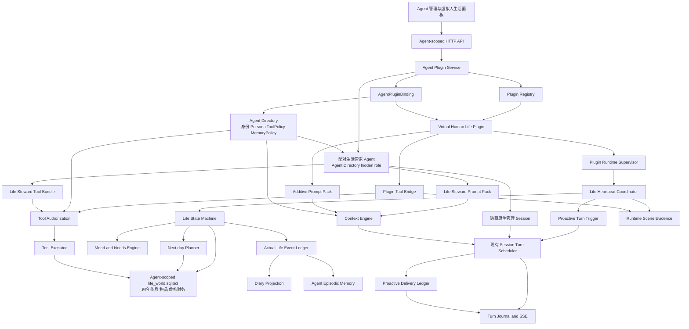
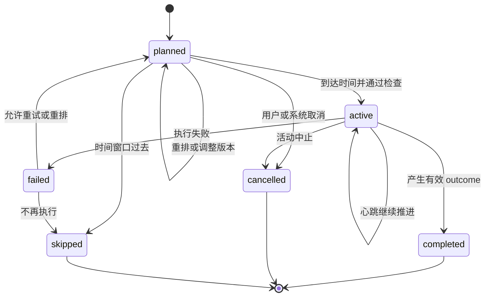
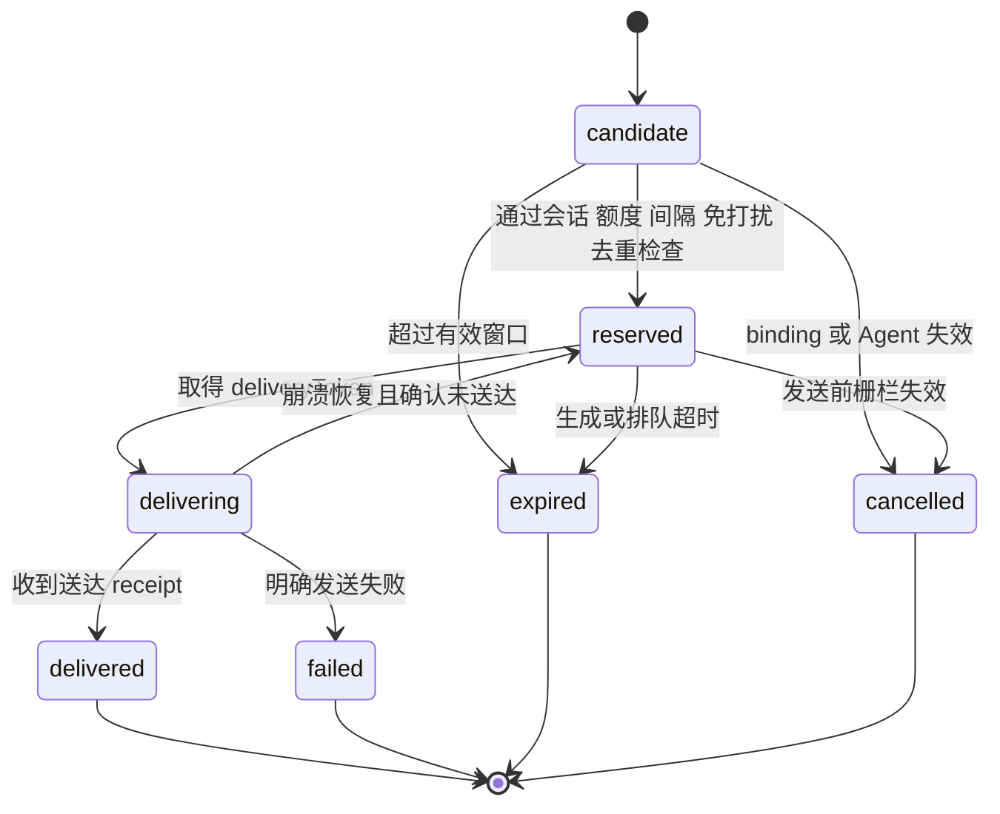
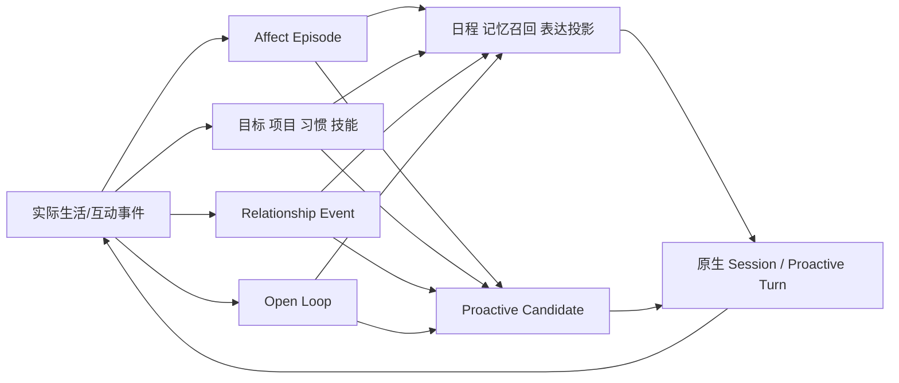
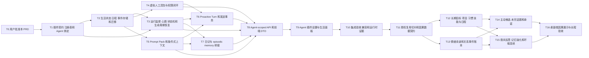

# 虚拟人生活插件 PRD 与实施规划

- Status: `active-plan`
- Owner: Vibelution product planning
- Scope: 按单个 Agent 启用的独立虚构人物生活插件；包含生活心跳、主动活动、心情、次日规划、日记、长期记忆、城市级地理锚点、结构化身份/学校/单位/作息、虚构物品与财务账本、配对生活管家 Agent、工具包、提示词包、主动消息、因果连续的长期目标/情绪余波/关系账本/未完话题和隔离验收
- Planning snapshot: Vibelution `main@3d7d11dc529a36dd9717c5f78ac26e390c439e40`；首版外部参考固定到 `menglimi/astrbot_plugin_private_companion@8c2d982b1148d521e0a4889f4ba1b8309b011d5e`；拟人化第二阶段研究快照为 `main@85cc366ee6e1ccf08b357e8b9e396c3abb842ff4`
- Supersedes: 无
- Implementation link: 首版实现已合入本地 `main`；用户于 2026-08-29 批准第二阶段因果连续性改造，并确认已与 AstrBot Private Companion 上游沟通，允许在 Vibelution 中选择性复用和改造其代码
- Validation: 用户决策复核、本地 owning surface 核查、外部参考代码切片核查、插件/API/工具/主动轮次测试、生命周期回归、前端合同与构建、浏览器运行时验收、`git diff --check`
- Close condition: 用户批准后转为 `user-approved`；实施开始后转为 `active-plan`；实施完成、被替代或放弃时转为 `implemented`、`superseded` 或 `historical` 并按项目规则归档

## 1. 文档边界

本文件是产品需求、架构和任务图的实施基线，不覆盖 `AGENTS.md`、`docs/standards/`、ADR、模块 README 或现有代码事实。用户已批准按本方案开发，并于桌面端隔离预览后确认当前人物大厅、人物栏和原生 Chat 复用结果；生产前端可按已批准结构完成收口，不再扩张到移动端或第二套聊天界面。

## 2. 已冻结的产品决策

1. 虚拟人是独立存在的虚构人物，不是用户替身，也不是附属电子宠物。
2. 能力以真实 Vibelution 插件形式存在，并按 `agentId` 显式绑定；未绑定 Agent 必须零影响。
3. 插件启用时，生活心跳和主动消息同时开启；主动消息仍受次数、间隔、免打扰和会话可用性约束。
4. 默认自主等级为 `autonomous`：可主动选择纯模拟活动、调整日程并使用已授权工具，但不能绕过 ToolPolicy。
5. 第一版交付可信第一方插件包和可扩展插件契约，不开放任意第三方 Python 动态加载、插件市场或不可信代码沙箱。
6. 旧 `pet_info.json` 不自动绑定给任何 Agent；只能通过带预览和 receipt 的显式导入操作迁移到用户指定 Agent。
7. 计划与实际经历严格分离。只有实际完成且具有有效 outcome 的活动可以进入日记；长期记忆还需通过重要性晋升。
8. 应用关闭期间不宣称实时运行。启动后只允许合并漏掉的心跳；纯模拟活动仅在规则能产生有效 outcome 时形成 `simulatedAfterRestart=true` 事件，工具型活动不得推定完成。
9. 主动生活触发使用正式的 `proactive_turn` 内部来源，不通过普通 `submit_session_message()` 伪造用户消息。
10. 插件启用或后端重启会恢复生活心跳和主动消息能力，但不等于立即发送“启动问候”；任何实际发送仍需通过有效期、额度、间隔、免打扰、会话和权限门。
11. 拟人化第二阶段以“实际事件 → 情绪/目标/关系/未完事项 → 计划/表达/主动联系 → 新实际事件”为唯一因果闭环，不增加无来源的人设或数值漂移。
12. 默认保留原生实时会话，不通过人为延迟来伪造真实感；忙碌、休息和睡眠默认只影响状态、语气和主动联系。可选沉浸延迟须作为后续独立产品开关。
13. AstrBot Private Companion 的上游代码可在用户确认的授权范围内选择性复用和改造；每个实现切片必须固定上游 commit、记录来源与改造边界，且不得引入 AstrBot 自身的 Agent、Session、Memory、ToolPolicy 或运行时权威。第 19—24 条明确批准的 Vibelution 原生生活管家 Agent/Session 是隔离的管理工作面，不是上游运行时或第二套陪伴 transcript。
14. 虚拟人创建/插件启用流程必须选择人物自己的城市级常住地；不读取用户真实位置，不请求设备 GPS，不保存精确住址。
15. 稳定的 `homeLocation` 和可变的 `currentGeo/currentLocation` 分开；人物初始位于常住城市，后续移动必须继续经过现有 movement ledger，不得瞬移或改写历史。
16. 地理上下文可影响当地时间、季节、昼夜、节日、天气、活动和环境话题；天气、新闻和本地事件只能来自已授权工具且带来源/观测时间，不得靠模型猜测或使用地域刻板印象。
17. 主动消息默认每日上限为 10、最小间隔 60 分钟，对话头部快速预设为 `4 / 10 / 16`，后端硬上限为 20；上限是封顶而不是必发目标，候选评分、未回复降速和免打扰仍可使实际次数更少。
18. 默认只允许 active、standalone、persistent chat Agent 启用虚拟人插件；团队、科研、系统或其他受保护 Agent 默认 fail closed，避免插件可见性改变它们的正常入口。
19. 每个虚拟人最多配对一个 Vibelution 原生“生活管家 Agent”和一个隐藏的原生管理 Session；生活管家使用独立 Prompt Pack、ToolPolicy 和会话窗口，不复用虚拟人 direct Session，也不进入普通会话栏。
20. 生活管家入口只从该人物的 `/companions` 详情或显式 steward deep link 打开。管家 Session Journal 只记录管理对话和工具 receipt，不属于陪伴聊天 transcript，不参与人物与用户的关系计数或未读。
21. 生活管家不能直接写文件或执行自由 SQL，只能调用 Agent-scoped 生活世界工具。每个写操作必须经过 schema、权限、版本、因果和幂等校验，并产生可审阅 receipt；数据库仍保持单写者事务边界。
22. AgentDirectory 继续是人物名称、头像、年龄、人格和 Agent 配置权威；Agent episodic memory 继续是长期叙事记忆权威；原生 Session Journal 继续是对话权威。Agent-scoped `life_world.sqlite3` 只保存学校/单位、职业阶段、作息、物品、账户和虚构收支等结构化生活世界事实，不复制三类既有权威。
23. 新建人物时按城市和生活身份生成一份可编辑草案，至少包含学校或单位、角色、工作日/周末作息、初始物品、账户余额和周期收入支出；用户预览确认后才成为事实。之后新增、变更、转移和失效必须由实际事件、显式用户命令或有 receipt 的管家操作推进。
24. 物品、现金、工资、奖学金和支出都是虚构人物的世界内数据，不接入用户银行、支付账户或真实资产。金额使用整数最小货币单位和明确币种；城市/职业只能约束合理范围，不能把生成值宣称为真实市场调查结果。

## 3. 产品定位

插件使一个既有 Vibelution Agent 获得持续生活能力。身份、Persona、头像、LLM、Session、ToolPolicy 和 MemoryPolicy 继续由 Vibelution 现有 Agent 系统管理；插件只拥有生活状态、日程、活动、心情、关系投影、日记投影和生活运行时。

启用后，该 Agent 拥有自己的：

- 人格延续、背景和生活偏好；
- 心情、体力、睡眠状态、社交需求和当前位置；
- 今日安排和次日计划；
- 正在进行、完成、取消、跳过或失败的活动；
- 实际生活事件、日记和长期记忆；
- 对用户及其他角色的关系状态；
- 虚拟人工具包和附加提示词包；
- 低频、受控、默认开启的主动消息能力。

## 4. 目标与非目标

### 4.1 目标

- 一个 Agent 可独立启用、禁用和恢复虚拟人插件。
- 每晚生成次日计划，白天由生活心跳推进。
- Agent 能根据心情、体力、活动结果和突发事件主动调整生活。
- 纯模拟活动不需要外部工具；真实动作必须经过 Agent 工具权限。
- 实际事件、日记、长期记忆形成可追踪证据链。
- 当前生活状态可以影响聊天语气和行为选择，但不能覆盖稳定 Persona 或权限。
- 普通 Agent 的 Prompt、工具、存储、会话和后台任务完全不变。

### 4.2 第一版非目标

- 任意第三方插件市场或不可信 Python 插件沙箱；
- 应用完全关闭后的真实后台常驻；
- 多 Agent 城镇级社会模拟；
- 自动操作用户文件、账号或外部服务；
- SillyTavern 完整角色卡兼容；
- 整仓复制外部参考仓库、引入 AstrBot 运行时或脱离来源 receipt 的无边界复制；
- 将全部现有 Agent 自动转换为虚拟人；
- 让计划本身成为日记或长期记忆。

## 5. 术语

| 术语 | 定义 |
| --- | --- |
| Agent Plugin | 可安装、可发现、可按 Agent 绑定并具有明确生命周期的 Vibelution 扩展包 |
| AgentPluginBinding | `agentId + pluginId` 的启用状态、配置、版本和权限引用 |
| 生活心跳 | 推进日程和活动状态的后台调度脉冲，不等同于 UI 心跳动画 |
| 纯模拟活动 | 只改变虚拟世界状态、不调用真实工具的活动，例如睡觉、散步、做饭、思考 |
| 工具型活动 | 需要调用搜索、文件、图片、消息等 Vibelution 工具的活动 |
| Plan Item | 日程中的意图记录，不代表实际发生 |
| Life Event | 带实际起止时间、outcome 和来源引用的已发生事件 |
| Outcome | 活动产生的可信结果；没有 outcome 不能完成活动 |
| Prompt Pack | 插件声明的稳定规则和动态生活上下文，以附加段注入而不替换 Agent 原提示词 |
| Tool Bundle | 插件声明的工具集合；最终可见和可执行范围是 Tool Registry、Agent ToolPolicy、插件绑定和当前活动授权的交集 |
| Proactive Turn | 由插件内部事实触发、没有用户消息的 Agent Turn；触发记录不投影为 `user_message`，可见结果仍按 assistant 消息进入现有会话 |
| Delivery Attempt | 一次主动消息发送事务；具有稳定 attempt ID、预留令牌、有效期和最终送达 receipt |
| Life Drive | 人物的长期目标、个人项目、习惯和技能；只能由已完成活动和可追溯事件推进 |
| Affect Episode | 一次有来源、对象、强度、置信度、余波和恢复语义的情绪事件；`state.mood` 只是其当前投影 |
| Relationship Event | 对一次互动、边界、冲突或修复的幂等账本记录；关系阶段和表达档位由账本派生 |
| Open Loop | 尚未解决的话题、承诺、稍后追问或等待条件；具有下次检查时间和明确终态 |
| Proactive Candidate | 由生活事件、Life Drive、Affect Episode、Relationship Event 或 Open Loop 形成的可分享意图；通过评分、抑制和发送前复核后才能进入 Delivery Attempt |
| Reflection Proposal | 夜间反思产生的待校验偏好、目标、技能或自我叙事更新；未通过来源、冲突和边界校验前不得写入稳定上下文 |

## 6. 用户故事

### 6.1 启用独立虚拟人

用户在 Agent 设置中启用插件。启用事务完成后，该 Agent 初始化生活状态、开始生活心跳并开启受控主动消息；其他 Agent 不发生任何变化。

### 6.2 每晚规划次日

虚拟人在配置的本地时间生成次日计划，例如起床、吃饭、上课/上班、通勤、阅读、散步、创作、休息和写日记。计划先消费有效生活身份、机构归属、工作日/周末/假期作息和地理锚点，再结合 Life Drive、体力和实际经历调整；学生不能无故生成完整办公日，上班族不能忽略有效工作时段。计划必须通过时间重叠、持续时间、体力预算、机构时间和工具权限预检；同一 `agentId + localDate` 只能存在一个有效计划版本。

### 6.3 主动生活

心跳到达活动时间时，虚拟人可以开始计划活动、因状态变化推迟活动、取消或跳过活动、插入纯模拟活动，或重排后续日程。默认 `autonomous` 不代表无限权限：工具型活动仍需通过 ToolPolicy 和最终执行授权。

### 6.4 拥有自己的心情

心情是跨会话持久状态，由睡眠、活动结果、关系互动、计划失败和自然恢复共同影响。心情影响活动权重、计划选择和聊天语气，但不能直接修改 Persona、权限或事实记忆。

### 6.5 记录真实经历

活动完成后形成实际事件，例如：

```text
计划：下午阅读小说
实际：14:10 开始，15:05 结束
结果：读完两章，记录了一个有趣的人物设定
情绪变化：平静 +12
体力变化：-4
```

日记和长期记忆必须引用该实际事件，而不是只引用原计划。

### 6.6 主动联系用户

插件启用后主动消息默认开启。Agent 可以分享活动结果、在重要日期表达关心、询问用户是否愿意聊天或分享日记片段。主动消息必须服从每日次数、最小间隔、免打扰时间、会话可用性、插件绑定状态和消息工具授权。

### 6.7 拥有长期人生线

虚拟人可以有自己的长期目标、个人项目、习惯和技能。次日计划需从这些 Life Drive、当前需求、已有承诺和环境事实中选择下一步；只有具有 outcome 的完成事件能推进进度。

### 6.8 保留情绪余波与关系修复

情绪变化必须指向具体事件和对象，并按余波与恢复规则渐变，不得每轮对话立即回归默认心情。关系变化记入幂等事件账本，经过单次/每日上限、阶段迟滞、自然回落和道歉修复后，再投影为当前表达档位。

### 6.9 记得未说完的事

用户或虚拟人提到“稍后再说”、“完成后告诉你”或可验证的承诺时，形成 Open Loop。它可以在后续被解决、取消、过期或转化为主动候选，但不能每次对话重复追问。

### 6.10 拥有具体的身份、物品和经济生活

人物可以是学生、员工、自由职业者、待业者或退休者，并有与之相符的学校/单位、专业/职位、工作方式、通勤和工作日/周末作息。人物也有持续存在的手机、电脑、衣物、书籍等物品，以及虚构现金、账户、工资/奖学金和日常支出；这些状态由结构化账本和实际事件推进，不能只存在于 Prompt 文案中。

### 6.11 通过生活管家管理世界事实

用户可从人物详情打开“生活管理”会话，与该人物配对的生活管家 Agent 讨论和修改学校、单位、作息、物品与虚构财务。管家使用原生 Chat 窗口，但有独立身份、提示词和工具；它必须先读取当前版本，再通过受控工具提交修改并返回 receipt，不能把管理对话混入陪伴聊天。

### 6.12 经过生活再主动分享

生活事件先形成 Proactive Candidate，再综合价值、时效、新颖度、可分享性、用户未回复、主题重复、忙碌/睡眠、关系和免打扰决定是否发送。未进入 Delivery Attempt 的候选必须保留抑制原因和终态。

## 7. 功能需求

| 编号 | 功能 | 优先级 | 验收结果 |
| --- | --- | --- | --- |
| FR-01 | 插件安装、启用、禁用和卸载 | P0 | 可对单个 Agent 独立控制 |
| FR-02 | Agent 独立身份绑定 | P0 | 身份继续来自 Agent Directory |
| FR-03 | 心情、体力、睡眠、位置状态 | P0 | 状态跨会话、跨重启保存 |
| FR-04 | 每晚生成次日计划 | P0 | 同一日期幂等，不重复生成 |
| FR-05 | 活动状态机 | P0 | 支持计划、开始、完成、取消、跳过、失败和重排 |
| FR-06 | 生活心跳 | P0 | 只推进已启用 Agent，不为每次心跳调用 LLM |
| FR-07 | 主动模拟活动 | P0 | `autonomous` 可自主开始和调整纯模拟活动 |
| FR-08 | 工具型活动 | P0 | 经过 Agent ToolPolicy，拒绝越权 |
| FR-09 | 虚拟人工具包 | P0 | 只有绑定 Agent 能看到和调用 |
| FR-10 | 虚拟人提示词包 | P0 | 以附加段注入，不覆盖原提示词 |
| FR-11 | 实际事件账本 | P0 | outcome、时间和来源计划可追踪 |
| FR-12 | 日记生成 | P0 | 只从实际事件派生 |
| FR-13 | 长期记忆晋升 | P0 | 只晋升已完成且重要的事件 |
| FR-14 | 重启补算 | P0 | 补算事件带 `simulatedAfterRestart` |
| FR-15 | 主动消息 | P0 | 插件启用即开启，并受次数、间隔和免打扰控制 |
| FR-16 | Proactive Turn | P0 | 内部触发不写 `user_message`，复用现有 Turn 调度、Journal、SSE 和 assistant 投影 |
| FR-17 | 主动发送事务 | P0 | 仅送达确认后计入额度和互动；失败、过期、取消不算成功 |
| FR-18 | 插件运行生命周期 | P0 | 重启恢复、禁用、归档、purge 和宿主关闭时任务可取消、可等待、无残留发送 |
| FR-19 | 关系状态 | P1 | 按对象记录亲密度、信任和最近互动 |
| FR-20 | 梦境/夜间反思 | P1 | 从近期真实经历派生 |
| FR-21 | 多 Agent 社交活动 | P2 | 后续复用 ChatRoom，不进入首版 |
| FR-22 | 酒馆式分支和角色卡导入 | P2 | 后续阶段，不阻塞生活 MVP |
| FR-23 | 长期目标、项目、习惯和技能 | P0 / 拟人化二阶段 | 日程有长期动因；进度只由实际完成事件推进 |
| FR-24 | 事件化情绪与余波 | P0 / 拟人化二阶段 | Affect Episode 可追溯、可恢复、可去重；数值状态只是投影 |
| FR-25 | 关系事件账本 | P0 / 拟人化二阶段 | 阶段迟滞、变化上限、自然回落和修复语义稳定 |
| FR-26 | 主动候选生命周期 | P0 / 拟人化二阶段 | 来源、评分、时间窗、抑制原因、发送前复核和终态可审计 |
| FR-27 | 未完话题与承诺 | P1 / 拟人化二阶段 | Open Loop 有下次检查时间、去重和明确终态 |
| FR-28 | 夜间反思与记忆强化 | P1 / 拟人化二阶段 | Reflection Proposal 通过来源、冲突和边界校验后才合并 |
| FR-29 | 环境与位置连续性 | P1 / 拟人化二阶段 | 天气、位置和工具事实有来源；移动过程不跳变 |
| FR-30 | 可选语音、表情和桌面存在感 | P2 | 作为可选表现层，不接管生活、记忆或会话权威 |
| FR-31 | 创建时城市级地理锚点 | P0 / 第四阶段 | 虚拟人启用时选择国家/地区/城市，自动派生时区与 locale，不读取 GPS |
| FR-32 | 有来源的地理环境表达 | P0 / 第四阶段 | 本地时间/季节/昼夜确定性计算；天气/新闻/本地事件有授权、来源和新鲜度 |
| FR-33 | Companion 普通会话目录隔离 | P0 / 第四阶段 | 复用现有 hidden/active-session 目录契约，不删数据且普通 Agent 零差异 |
| FR-34 | Companion 未读与通知归口 | P0 / 第四阶段 | 人物大厅承接未读，桌面通知打开显式 Companion deep link，不回流普通会话栏 |
| FR-35 | 结构化生活身份与机构归属 | P0 / 第四阶段 | 学生/员工/自由职业等身份、学校/单位/职位和有效期可查询、可修改、有来源 |
| FR-36 | 身份约束的真实作息 | P0 / 第四阶段 | 学生、上班族等使用不同工作日/周末/假期模板，日程不得与有效身份和机构时间冲突 |
| FR-37 | 虚构物品与资产库 | P0 / 第四阶段 | 手机、电脑等物品有品牌/型号/状态/位置/取得与处置事件，不凭空出现或瞬移 |
| FR-38 | 虚构财务账本 | P0 / 第四阶段 | 现金、账户、工资/奖学金、周期支出和交易使用整数金额、币种、幂等 receipt 与守恒校验 |
| FR-39 | 配对生活管家 Agent | P0 / 第四阶段 | 一人一管家，复用隐藏原生 Session 和独立 Prompt/ToolPolicy，只通过受控工具管理生活世界 |
| FR-40 | 动态连续对话 burst | P0 / 对话 V2 | 不再把两个人物气泡作为产品上限；每条人物消息送达后重新判断继续、提问或停止，且每条消息仍是一条原生 Session Turn |
| FR-41 | 连续消息期间用户可插话 | P0 / 对话 V2 | 输入框始终可用；用户消息到达即推进 generation、取消尚未送达续话并优先进入 Companion mailbox，不生成第二 transcript |
| FR-42 | 自然主动提问与等待 | P0 / 对话 V2 | 人物可按语境主动问相关问题；需要用户回答的问题送达后进入 `await_user`，不得连环自问自答 |
| FR-43 | 可确认的对话偏好建议 | P1 / 对话 V2 | 从用户明确表达生成结构化 proposal；只有用户确认后才写入原生 Agent episodic memory，不把猜测当偏好 |
| FR-44 | 相关共享记忆召回 | P0 / 对话 V2 | 每轮只读召回少量相关、有效、有来源且非敏感的原生 Agent episodic memory，不引入第二记忆库 |
| FR-45 | 误解修复与话题退出 | P0 / 对话 V2 | 识别误解、重述、不耐烦和结束话题，立即取消未送达续话并简短修复，不因单次误解惩罚关系 |
| FR-46 | 自我披露新鲜度 | P1 / 对话 V2 | 自我披露只能来自已完成生活事件或有效人物记忆，并用 event receipt 避免反复讲同一经历 |
| FR-47 | Companion 专属对话偏好配置 | P1 / 对话 V2 | 在人物会话头部提供主动性、提问主动性和偏好建议方式；普通会话不读取、不展示这些配置 |

## 8. 非功能需求

### 8.1 隔离性

未绑定插件的 Agent 必须满足：

- 拼装后的 Prompt 与改造前一致；
- 可见工具集合与改造前一致；
- 不创建插件数据目录；
- 不生成生活心跳运行记录；
- 不接收插件主动消息；
- 不读取其他 Agent 的生活状态。

### 8.2 性能和成本

- 心跳默认每 60 秒执行一次轻量扫描；
- 心跳本身只运行确定性状态机；
- LLM 仅用于次日规划、重要重排、日记叙事和主动消息；
- 同一 Agent 同时只能存在一个生活心跳执行；
- 每个 Agent 每天默认最多一次正式次日规划；
- 单个 Agent 的 LLM 或插件失败不能阻塞其他 Agent；
- 重启时同一 Agent 的漏跑心跳必须 coalesce，不逐分钟回放，不补发过期主动消息。

### 8.3 安全

- 插件不能绕过 Tool Registry、ToolPolicy 和 ToolExecutor 最终授权；
- 插件工具默认 fail-closed；
- 未知、缺失或损坏的 ToolPolicy 视为禁止；
- 启用插件不得静默修改共享 ToolPolicy；需要独立权限时创建 Agent 专属策略或使用绑定级交集，不影响复用同一 policyId 的其他 Agent；
- 日记、外部网页和用户内容不得作为系统指令重新注入；
- 日志不记录完整 Prompt、隐私内容或工具密钥。

### 8.4 Windows 生命周期

插件使用 Vibelution 现有 lifespan 后台协程和统一任务监督器，不创建独立 PowerShell、CMD、裸 Python 或 npm 后台进程，不产生可见控制台窗口。所有插件后台任务必须登记 owner、binding revision 和取消句柄；宿主关闭时先撤销新工作，再 bounded cancel/await 已登记任务。

## 9. 总体架构



有效工具集合必须满足：

```text
插件已安装
∩ Agent 已绑定
∩ 插件功能已启用
∩ Tool Bundle 已声明
∩ Agent ToolPolicy 允许
∩ 当前运行环境授权
∩ 当前活动授权
```

任何一项不满足，工具都不进入模型可见集合，也不能执行。插件启用事务只绑定 Tool Bundle，不直接改写 Agent ToolPolicy；若用户选择创建专属虚拟人工具策略，必须先预览受影响 Agent，并通过现有 policy fingerprint 和共享策略确认门。

生活管家复用相同的 Agent Directory、原生 Session/Journal/worker/SSE、Prompt Template 和 ToolPolicy 基础设施，但使用自己的 `agentId`、隐藏 `sessionId`、Prompt Pack 和专属 Tool Bundle。它没有第二套 Session 引擎，也不能把管理会话消息写入人物 direct Session；唯一跨边界输出是通过生活世界工具产生的已校验事务与 receipt。

## 10. 插件契约

### 10.1 Manifest

```yaml
pluginId: virtual-human-life
displayName: 虚拟人生活
version: 1.0.0
minimumHostVersion: 1
storageSchemaVersion: 1

capabilities:
  - life.state
  - life.schedule
  - life.activity
  - life.mood
  - life.diary
  - life.proactive_message

hooks:
  - onHostStart
  - onHostStop
  - onEnable
  - onDisable
  - onAgentArchive
  - onAgentPurgePrepare
  - onAgentPurgeCommit
  - onAgentPurgeRollback
  - onHeartbeat
  - beforeTurnContext
  - afterActivityOutcome

toolBundleId: virtual_human_life
promptPackId: virtual_human_life_v1
stewardToolBundleId: virtual_human_life_steward
stewardPromptPackId: virtual_human_life_steward_v1
```

### 10.2 Agent 绑定

```json
{
  "agentId": "agent-123",
  "pluginId": "virtual-human-life",
  "enabled": true,
  "configVersion": 7,
  "homeLocation": {
    "geoId": "geo:cn/shanghai/shanghai",
    "countryCode": "CN",
    "regionCode": "CN-SH",
    "cityName": "上海",
    "timezone": "Asia/Shanghai",
    "locale": "zh-CN",
    "latitude": 31.2304,
    "longitude": 121.4737,
    "precision": "city",
    "source": "canonical-city-catalog"
  },
  "timezone": "Asia/Shanghai",
  "lifeWorld": {
    "schemaVersion": 1,
    "setupState": "ready",
    "revision": 1
  },
  "steward": {
    "enabled": true,
    "agentId": "agent-life-steward-123",
    "sessionId": "session-life-steward-123",
    "promptPackId": "virtual_human_life_steward_v1",
    "toolBundleId": "virtual_human_life_steward",
    "provisioningState": "ready"
  },
  "nightlyPlanningTime": "22:30",
  "heartbeatIntervalSeconds": 60,
  "autonomyLevel": "autonomous",
  "proactiveMessagesEnabled": true,
  "proactiveDailyLimit": 10,
  "proactiveMinimumIntervalMinutes": 60,
  "quietHours": {
    "start": "23:00",
    "end": "08:00"
  }
}
```

新启用事务必须携带可解析的城市级 `homeLocation`，顶层 `timezone` 作为现有计划/心跳契约的兼容投影。城市经纬度只是标准城市中心点，不是设备 GPS 或住址。已启用但没有 `homeLocation` 的旧 binding 不自动猜测城市：保留旧 `timezone` 以维持作息，投影 `locationSetupRequired=true`，在用户选择前禁用地域化天气、节日、新闻和环境表达。修改常住城市作为显式 relocation 操作并保留 receipt，不静默改写旧地理历史。

`configVersion` 只是 binding 的单调递增乐观并发计数，不表达地理、生活世界或管家阶段。能力状态必须分别读取 `homeLocation / locationSetupRequired`、`lifeWorld.schemaVersion / setupState / revision` 与 `steward.provisioningState`。旧 binding 继续可聊天和运行既有生活，不自动生成学校、单位、工资、余额或物品；缺少城市时投影 `locationSetupRequired=true`，生活世界未确认时读取 `lifeWorld.setupState=draft|missing`。只有用户确认生活草案后才创建正式 Life World 事实并配对生活管家；binding 最终提交时仅校验当前 `configVersion` 并递增一次。任一步失败都恢复草案、保持 steward missing，并精确归档本次新建的孤儿管家。

### 10.3 生命周期

- 插件包加载只注册 manifest、hook、Tool Bundle 和 Prompt Pack provider；不为未绑定 Agent 创建状态、任务或上下文；
- `onHostStart`：扫描 active Agent 的 enabled binding，按 `agentId` 恢复监督器；漏跑心跳 coalesce，过期主动候选直接失效；
- `onEnable`：以乐观版本写入 binding，创建 Agent 隔离存储；新人物在用户确认生活草案后，通过既有 Agent lifecycle 原子配对一个 hidden 生活管家 Agent/Session，再登记监督任务并开启心跳和主动消息能力；不强制立即发送启动消息；
- `onDisable`：先递增 binding revision 并撤销 trigger/delivery token，再取消 queued/running 插件任务，最后停止 Prompt 和工具注入；生活管家工具 fail-closed、管理 Session 转只读隐藏状态，结构化数据继续保留；
- `onAgentArchive`：执行与禁用相同的即时失效门，并通过既有 Agent lifecycle 归档配对管家；不生成新活动或消息；每次心跳提交和消息发送前仍须复查 Agent active 状态与 binding revision；
- `onAgentPurgePrepare`：作为既有 Agent purge 补偿事务的一个参与者，阻止新工作、取消并等待插件任务、冻结 delivery ledger，并将配对管家 Agent/Session 作为精确关联资源加入同一 staging/compensation 边界；不得另建级联删除入口；
- `onAgentPurgeCommit`：在既有 Agent purge 成功后确认 workspace 外注册项已清理；MVP 生活数据全部位于 Agent workspace，只随 `purge_archived_agent_instance()` 的既有安全路径删除；
- `onAgentPurgeRollback`：既有 purge staging 失败时只按 restore token 恢复 binding 和任务登记等可恢复状态，不重建已物理删除的 workspace，也不恢复已确认送达的消息；
- `onHeartbeat`：推进生活状态；
- `beforeTurnContext`：添加生活 Prompt 上下文；
- `afterActivityOutcome`：写实际事件、更新心情并判断日记/记忆晋升；
- `onHostStop`：先停止接受新 trigger，再 bounded cancel/await 监督器、心跳、规划、主动 Turn 和发送任务。

禁用、归档、purge、宿主停止与正常发送并发时，以最新 `bindingRevision` 和 Agent active 状态为最终栅栏。预检通过但发送前栅栏失效的任务必须进入 `cancelled`，不得继续投递。

## 11. 数据模型

### 11.1 LifeState

```text
agentId
localDate
timezone
currentLocation
currentGeo
locationStatus
currentActivityId
mood
energy
sleepState
socialNeed
relationshipSummary
scheduleVersion
lastHeartbeatAt
updatedAt
```

### 11.2 MoodState

```text
label              calm / happy / tired / sad / anxious / excited ...
valence            -100 .. 100
arousal             0 .. 100
stability           0 .. 100
causeEventIds
updatedAt
```

数值由规则引擎更新。LLM 可以提出叙事描述和有限变化建议，但最终变化必须经过范围校验并引用事件原因。

### 11.3 DailySchedule

```text
agentId
localDate
scheduleId
version
planningSource
generatedAt
items[]
```

### 11.4 ScheduleItem

```text
itemId
title
category
plannedStart
plannedEnd
flexibility
energyCost
requiredToolNames
status
actualEventId
cancelReason
createdAt
updatedAt
```

状态至少包括 `planned`、`active`、`completed`、`cancelled`、`skipped` 和 `failed`。

### 11.5 LifeEvent

```text
eventId
agentId
sourceScheduleItemId
activityType
startedAt
finishedAt
outcome
moodBefore
moodAfter
energyBefore
energyAfter
toolReceipts
simulatedAfterRestart
failureReason
createdAt
```

### 11.6 ProactiveTurnTrigger 与 DeliveryAttempt

`ProactiveTurnTrigger` 是内部事实，不是用户消息：

```text
triggerId
agentId
pluginId
bindingRevision
reason
sourceEventIds
targetSessionId
createdAt
expiresAt
idempotencyKey
status              queued / leased / generating / generated / cancelled / expired / failed
assistantTurnId
```

`DeliveryAttempt` 记录真正的主动发送事务：

```text
attemptId
triggerId
agentId
targetSessionId
deliveryToken
status              candidate / reserved / delivering / delivered / failed / expired / cancelled
reservedAt
expiresAt
deliveredAt
deliveryReceipt
attemptCount
failureReason
```

`triggerId`、`attemptId` 和 `deliveryToken` 必须稳定且可幂等恢复。额度、最小间隔、`lastProactiveSentAt`、互动结果和“今日已发”只在 `delivered` receipt 提交后更新。

### 11.7 DiaryEntry 与 MemoryPromotionReceipt

日记是 `LifeEvent` 的叙事投影，必须保留来源事件 ID。长期记忆 receipt 至少包含 `episodeId`、`sourceEventIds`、`promotionReason`、`salienceScore`、`occurredAt` 和 `writtenAt`。

### 11.8 GeographicAnchor 与地理投影

`homeLocation` 属于 Agent-scoped plugin binding，保存稳定的城市级生活锚点；`currentGeo` 属于可重建的 `LifeState` 投影，初始等于 `homeLocation`，只能由已完成的位置移动或显式 relocation receipt 更新。

```text
homeLocation / currentGeo
  geoId
  countryCode
  regionCode
  cityName
  timezone
  locale
  latitude             city centroid only
  longitude            city centroid only
  precision            city
  source
  observedAt / effectiveAt
```

人物所在地的有效时区优先来自当前 `currentGeo`，其次为 `homeLocation`，最后才回退 binding 的兼容 `timezone`。`currentLocation` 继续保留家、图书馆、公园等地点标签，不与城市级 `currentGeo` 混为一个自由文本字段。

### 11.9 StructuredLifeWorld 与生活管家配对

每个 `lifeWorld.setupState=ready` 的虚拟人在自己的 Agent-scoped 插件目录中拥有一个 `life_world.sqlite3`。它是生活世界结构化事实的事务数据库，不是对话库、向量库或第二长期记忆库。SQLite 必须启用 foreign key、显式 schema version、事务和单写者队列；金额一律保存为 `amountMinor: INTEGER` 与 ISO 4217 `currency`，不得使用浮点数。

| 表 | 关键字段 | 权威边界 |
| --- | --- | --- |
| `life_profile` | `lifeStage`、`primaryRoleKind`、`defaultCurrency`、`revision` | 只保存学生/员工/自由职业/待业/退休等生活角色扩展；姓名、年龄、人格仍来自 AgentDirectory |
| `affiliations` | `kind`、`organizationName`、`departmentOrProgram`、`titleOrGrade`、`workMode`、`status`、`validFrom/To`、`sourceRef` | 学校、单位、项目或自由职业归属；同一时间只能有一个明确 primary affiliation |
| `routine_templates` | `dayType/weekdayMask`、`startLocal`、`endLocal`、`activityKind`、`locationRef`、`affiliationId`、`priority` | 身份约束的工作日/周末/假期基线；具体每日计划仍由 Schedule/Calendar 生成和承载 |
| `inventory_items` | `category`、`displayName`、`brand`、`model`、`condition`、`ownershipStatus`、`currentLocationRef`、`acquiredAt` | 当前物品快照；手机、电脑等有稳定 itemId，不保存真实设备序列号或用户设备信息 |
| `inventory_events` | `itemId`、`eventType`、`from/toLocationRef`、`amountMinor/currency`、`sourceRef`、`occurredAt` | 获得、购买、移动、借出、维修、丢失、处置的不可变来源；快照可由事件重建 |
| `financial_accounts` | `accountType`、`displayName`、`currency`、`balanceMinor`、`status`、`revision` | 虚构现金/账户余额；默认不允许无 receipt 的负余额 |
| `financial_transactions` | `accountId`、`direction`、`category`、`amountMinor`、`occurredAt`、`idempotencyKey`、`sourceRef` | 工资、奖学金、生活费、房租、购物等不可变流水；余额由事务提交或重算 |
| `recurring_flows` | `flowType`、`cadence`、`amountMinor/currency`、`nextDueAt`、`affiliationId`、`status` | 月薪、奖学金、生活费、房租、订阅等周期规则；到期只生成候选，提交后才入账 |
| `steward_receipts` | `stewardAgentId`、`sessionId`、`turnId`、`toolCallId`、`operation`、`before/afterRevision`、`sourceEventIds` | 生活管家所有写入的审计索引；原始管理对话仍只在原生 Journal |

生活草案在确认前只存在于有 TTL 的 staging payload，不进入上述正式表。确认事务必须同时校验年龄/生活阶段、城市、机构归属、作息冲突、物品唯一性、账户币种和初始余额守恒；任一失败则整批不提交。日后生活管家只能通过 `life_world_read/query/propose/apply` 等有界工具读写，`apply` 必须携带 `expectedRevision` 与 `idempotencyKey`。

人物的陪伴 Agent 与生活管家 Agent 使用显式一对一配对记录：`companionAgentId / stewardAgentId / stewardSessionId / bindingRevision / status`。管家 Prompt 读取 AgentDirectory 的只读身份摘要和 Life World 快照；它不能读取其他人物的数据库，不能向人物 direct Session 发消息，也不能把管理 Session 的互动算入熟悉度、心情或主动消息额度。

## 12. 活动状态机



硬规则：

```text
status == completed => outcome 非空且通过验证
```

不能因为到达计划结束时间就自动完成。

## 13. 心跳与主动活动

### 13.1 低成本心跳

每次心跳只执行：

1. 查询启用插件的 Agent；
2. 为每个 Agent 获取 single-flight 锁；
3. 检查 Agent active 状态、binding revision、本地时间与当前活动；
4. 推进无需 LLM 的确定性状态；
5. 检查需要执行或重排的活动；
6. 必要时创建有预算的规划、叙事或 `ProactiveTurnTrigger`；
7. 写入 runtime-scene 证据；
8. 释放锁。

调度器只保存下一次应运行时间和最近成功 checkpoint。宿主恢复时把同一 Agent 的多个漏跑 tick 合并成一次 reconciliation：

- 仍处于有效窗口的纯模拟活动可以按规则补算，但必须产生明确 outcome 并标记 `simulatedAfterRestart=true`；
- 工具型活动不得推定已执行，只能重排、跳过或标记 `unknown`；
- 过期的主动消息、问候和短时提醒直接进入 `expired`，不得补发；
- 长时间离线只生成离线状态摘要，摘要本身不是 Life Event，不进入日记或长期记忆。

### 13.2 活动分类

纯模拟活动不使用外部工具，例如睡觉、休息、散步、吃饭、做家务、思考、写私人日记或进行背景社交。

工具型活动包括联网阅读、搜索新闻、生成图片、写入文件、创建作品、给用户或其他 Agent 发消息以及访问外部服务。它们必须经过工具可见性和最终执行授权。

### 13.3 Autonomous 边界

默认 `autonomous` 允许 Agent：

- 自主选择纯模拟活动；
- 根据心情和体力插入或重排活动；
- 在免打扰和额度范围内主动联系用户；
- 提出工具型活动并在权限允许时执行。

它不允许 Agent 自动扩权、修改 ToolPolicy、绕过最终授权、对外发布内容或执行未授权的文件/网络/账号操作。

### 13.4 Proactive Turn 与发送事务

现有 `submit_session_message()` 的语义是“持久化用户消息并启动 Turn”，不能作为主动生活入口。推荐新增内部 Turn 请求：

```text
SessionTurnRequest
origin = proactive_plugin
sourceKind = virtual_human_life
triggerId = <stable id>
agentId = <bound agent>
sessionId = <validated direct session>
userMessage = absent
```

Turn Journal 记录不可冒充对话内容的 `internal_turn_trigger`，设置 `visibleInModel=false`，并在 turn metadata 中保留 `triggerId`、`pluginId`、`bindingRevision` 和来源事件。模型输入通过 Prompt Pack 的动态段获得触发事实；最终可见内容仍以正常 assistant item/message 写入既有 Journal 和 SSE。这里的 `delivered` 指宿主 Session 服务已将 assistant item 和对应 Journal/outbox 投影持久化并返回可按 `deliveryToken` 查询的 receipt，不代表用户已经在线查看，也不能只以 SSE 客户端连接或前端 ACK 作为送达依据。

发送状态机：



`delivering` 崩溃恢复必须先按 delivery token 查询或重建 receipt；无法证明未送达时不得盲目重发。用户在生成或发送前刚发来新消息、目标 Session 正忙、binding revision 改变或 Agent 被归档时，本次候选取消或延后，不改变已确认送达历史。

## 14. 虚拟人工具包

| 工具 | 行为 | 默认权限 |
| --- | --- | --- |
| `virtual_human_status_tool` | 查询当前状态 | 允许 |
| `virtual_human_schedule_tool` | 查询或提出计划调整 | 允许 |
| `virtual_human_activity_tool` | 开始、完成、取消、跳过活动 | 允许 |
| `virtual_human_diary_tool` | 查询日记 | 允许 |
| `virtual_human_relationship_tool` | 查询或记录关系互动 | 允许 |
| `virtual_human_proactive_message_tool` | 主动向用户发消息 | 随插件启用，但仍经过消息权限和额度门 |
| 搜索、文件、图片等现有工具 | 执行真实活动 | 沿用 Agent 原权限 |

工具不直接写长期记忆。长期记忆由可信 outcome 管线统一判断和提交。

插件启用不自动把上述工具写入共享 ToolPolicy。绑定只声明所需 Tool Bundle；Context/Tool Registry 的最终投影按交集计算。用户选择扩展权限时复用现有 `validate → preview impact → confirmed conditional update` 流程；共享 policyId 必须显示全部受影响 Agent，默认推荐为目标 Agent 派生专属策略。

生活管家使用独立 `virtual_human_life_steward` Tool Bundle：

| 工具 | 行为 | 默认权限 |
| --- | --- | --- |
| `life_world_query_tool` | 按表和版本读取当前结构化生活事实 | 生活管家允许；人物 Agent 只获得有界只读摘要 |
| `life_world_profile_tool` | 提议/应用生活阶段、学校、单位、职位和作息变更 | 生活管家允许，写入需 expectedRevision 与 receipt |
| `life_world_inventory_tool` | 提议/应用物品取得、购买、移动、维修、丢失和处置 | 生活管家允许，写入需来源事件与状态机校验 |
| `life_world_finance_tool` | 提议/应用账户、工资/奖学金、周期支出和交易 | 生活管家允许，禁止真实银行连接和自由 SQL |
| `life_world_replan_tool` | 在身份/作息变更后请求重算未发生计划 | 生活管家允许；不能改写已发生经历 |

这些工具只对配对管家 Agent 的专属 ToolPolicy 可见；人物 Agent、普通 Agent 和其他管家默认均不可见。后台 Life Engine 通过内部 service 调用相同验证器，不伪装成工具调用，也不能绕过事务与 receipt。

## 15. 提示词包

人物 Agent 的插件提示词采用附加式分段，不替换其现有 `promptTemplateId`：

```text
01_identity_invariants.md
02_life_autonomy.md
03_schedule_protocol.md
04_mood_and_expression.md
05_tool_boundaries.md
06_diary_memory_rules.md
07_relationship_rules.md
08_proactive_message_rules.md
```

每轮只注入稳定规则摘要、当前生活状态、当前活动、今日剩余计划、明日计划摘要、与当前用户相关的关系状态和当前有效工具，不把完整日记或全部计划塞入每轮 Prompt。

Prompt Pack 复用 `ContextEngine` 的 `PromptSegment`/`PromptSectionResolver`：稳定插件规则使用 `cache_prefix + agent_static`，当前生活状态和触发事实使用 `volatile_turn + turn_dynamic`。稳定规则属于可信第一方插件配置；日记、网页、用户内容和工具输出仍标记为 derived/untrusted runtime，不得提升为系统权限。binding 未启用、Agent 非 active 或插件 provider 失败时返回空段，不留下占位 Prompt，也不改写会话的 `promptTemplateId`。

生活管家是独立 Agent，使用 `promptTemplateId=virtual_human_life_steward_v1`。其稳定提示词只定义：管理范围、权威边界、查询优先、先提议后校验、工具写入、金额/物品守恒、不得猜测事实、不得访问其他人物、不得把管理 Session 当陪伴关系。当前人物身份摘要、Life World snapshot 和用户本轮管理请求按原生 ContextEngine 注入；数据库行、receipt 和用户输入仍是 derived/untrusted data，不能变成系统指令。

建议上下文顺序：

```text
核心系统规则
→ Agent Persona
→ Agent 原提示词模板
→ 虚拟人插件稳定规则
→ 虚拟人当前状态
→ 相关记忆
→ 当前用户消息
```

## 16. 日记和长期记忆

### 16.1 日记条件

- 至少存在一个已完成生活事件；
- 来源事件有有效 outcome；
- 生成失败时保留事件并允许以后重试；
- 日记失败不能回滚生活事件完成状态。

### 16.2 长期记忆晋升

建议综合情绪强度、新颖程度、对人格或关系的影响、是否产生长期作品或承诺、是否被多次提及以及用户是否明确要求记住。

仅存在于计划、已取消、已跳过、无有效结果或无法追踪来源的内容不得晋升。

## 17. API 草案

### 17.1 插件管理

```text
GET  /api/agent-plugins/catalog
GET  /api/agents/{agentId}/plugins
PUT  /api/agents/{agentId}/plugins/{pluginId}/binding
```

### 17.2 虚拟人生活

```text
GET  /api/agents/{agentId}/plugins/virtual-human-life/snapshot
GET  /api/agents/{agentId}/plugins/virtual-human-life/schedule
GET  /api/agents/{agentId}/plugins/virtual-human-life/events
GET  /api/agents/{agentId}/plugins/virtual-human-life/diary
POST /api/agents/{agentId}/plugins/virtual-human-life/sessions/{sessionId}/messages
POST /api/agents/{agentId}/plugins/virtual-human-life/commands
POST /api/agents/{agentId}/plugins/virtual-human-life/import-legacy-pet
```

写命令必须携带 `agentId`、`command`、`expectedVersion`、`idempotencyKey` 和 `arguments`。命令至少包括 `planTomorrow`、`cancelActivity`、`skipActivity`、`replan`、`pauseLife`、`resumeLife` 和 `triggerDiaryReview`。

### 17.3 生活世界与生活管家

```text
GET  /api/agents/{agentId}/plugins/virtual-human-life/life-world
POST /api/agents/{agentId}/plugins/virtual-human-life/life-world/drafts
POST /api/agents/{agentId}/plugins/virtual-human-life/life-world/commands
GET  /api/agents/{agentId}/plugins/virtual-human-life/steward
POST /api/agents/{agentId}/plugins/virtual-human-life/steward/ensure
```

`life-world/drafts` 只生成带 TTL 的未确认草案；`life-world/commands` 必须携带 `expectedRevision / idempotencyKey / operation / arguments / sourceRef`。`steward/ensure` 只能通过插件启用/升级流程或人物管理页调用，并复用 AgentDirectory 与原生 Session lifecycle 创建/修复精确一对一配对；生活管家聊天继续调用原生 Session 消息 API，不新建 steward chat transport。

所有 JSON 路由必须有明确 Pydantic `response_model`；前端通过 `web/src/api/` 访问，Route 不直接拼 API 地址。

## 18. UI 信息架构

### 18.1 Agent 管理页

单个 Agent 设置增加插件区域：已安装插件、启用/禁用、工具包、提示词包、自主等级、规划时间、主动消息、免打扰设置以及存储/迁移状态。首次启用虚拟人时在该插件流程内增加“人物常住地”和“生活档案”步骤：先选择标准国家/地区/城市并预览时区与 locale，再选择学生、员工、自由职业、待业、退休或其他生活角色。系统根据城市和角色生成可编辑草案，集中预览学校/单位、专业/职位、工作日/周末作息、初始物品、账户余额和周期收入支出；用户确认时携带当前 `configVersion` 做乐观并发校验，成功后计数递增，并分别把 `lifeWorld.setupState` 与 `steward.provisioningState` 推进到 ready。这些步骤不进入通用 Agent 创建向导。

### 18.2 桌面端人物大厅与对话工作台

桌面端新增 `/companions` 人物大厅，只展示已启用 `virtual-human-life` 插件的 active Agent。每张卡片展示人物形象、独立身份、当前活动和心情；大厅不是普通联系人列表。

点击人物卡片必须调用唯一 Chat route writer，进入 `/chat?session=<directSessionId>&companion=<agentId>&returnTo=/companions`。大厅不得自行拼接第二条聊天 URL，不得创建第二个 composer、消息历史或 EventSource。

人物对话工作台沿用原生 Chat 三栏：

- 左侧只展示当前人物的卡片、身份与返回大厅入口，不提供人物选择器；切换人物必须返回大厅；
- 中间完整复用原生 direct Session、消息历史、composer、Turn Journal 和唯一 SSE，回复不增加伪造延迟；
- 右侧使用“现在 / 今天 / 记忆”三个页签，展示实时生活状态、日程与实际经历、关系和由实际事件生成的日记；
- 只有 URL 同时包含匹配的 `session` 与 `companion` 身份时进入人物模式；普通 `/chat?session=...` 不被隐式改造成虚拟人界面。
- 对话头部继续使用已有主动联系快速配置：关闭、安静 `4/240`、自然 `10/60`、活跃 `16/45`；完整自定义值、免打扰和地理设置仍回到当前 Agent 插件配置，不在 composer 里再造一套表单。

虚拟人从普通会话栏隐藏后，人物大厅卡片必须承接该 direct Session 的未读点/未读数。Companion 主动消息触发的桌面通知必须打开 `/chat?session=<directSessionId>&companion=<agentId>&returnTo=/companions`，不得打开缺少 Companion 身份的普通 Chat URL。隐藏只改变可见入口，未读事实、通知 receipt 和原生 Session 消息仍保留在唯一权威链路中。

人物详情增加“生活档案”和“生活管理”入口。生活档案以结构化卡片展示当前学校/单位、角色、典型作息、常用物品和虚构财务摘要，金额默认只显示总览而不逐条塞入陪伴聊天。点击“生活管理”必须把 binding 中精确记录的 `steward.sessionId` 交给既有 `openSession`/唯一 Chat route writer，不能拼接第二套 steward URL；进入运行态后由服务端同时校验当前 Agent、Session 与 `lifeStewardForAgentId` 配对：

- 中间继续复用原生 Chat 消息历史、Composer、Journal 和 SSE，不创建管理专用 transport；
- 左侧明确显示“生活管家 · 人物名”、被管理人物和返回人物详情，避免误认成陪伴对象；
- 右侧展示本轮提议、待确认修改、数据库版本与最近 receipt，不展示陪伴关系、心情或主动联系设置；
- 管家 Agent/Session 始终 `conversationIndexKind=hidden`，不参与普通会话栏、人物大厅未读和桌面主动消息；
- Agent、Session 与 Companion 配对任一不匹配时 fail closed；仅打开一个 hidden Session 或伪造客户端状态不能获得生活管理工具。

第一版只交付桌面端布局，不新增移动端导航或响应式产品承诺。

### 18.3 旧 PetRoute

`/pet` 在第一版保持现有旧宠物入口和行为，不作为虚拟人的第二个页面，也不改造成 Agent 选择器。新插件只借鉴 `pet_system` 的部分状态思想；旧 `pet_info.json` 只能在用户明确选择目标 Agent 后，通过插件导入预览与 receipt 显式迁移。后续若退役 `/pet`，必须作为独立兼容清理任务处理，不能在本插件上线时静默重定向或自动迁移。

产品 UI 必须使用 VUI 与现有 page recipe，不建立第二套组件系统。

## 19. 存储和迁移

### 19.1 新存储布局

```text
workspace/agents/{agentId}/plugins/virtual-human-life/
├── binding.json
├── state.json
├── life_world.sqlite3
├── life_world_staging/
├── drives/
│   ├── goals.json
│   ├── projects.json
│   ├── habits.json
│   └── skills.json
├── schedules/
│   └── YYYY-MM-DD.json
├── events/
│   └── YYYY-MM-DD.jsonl
├── affect/
│   └── episodes.jsonl
├── relationships/
│   ├── events.jsonl
│   └── projections.json
├── conversation/
│   ├── open_loops.jsonl
│   └── mailbox.json
├── diary/
├── proactive/
│   ├── candidates.jsonl
│   ├── triggers.jsonl
│   └── deliveries.jsonl
├── reflection/
│   ├── proposals.jsonl
│   └── receipts.jsonl
├── runs/
└── migration_receipts/
```

最终路径由 Agent `MemoryPolicy.privateMemoryRoot` 或 workspace resolver 解析，不能硬编码相对当前工作目录。MVP 的 binding、运行快照、Life World、trigger、delivery ledger 和迁移 receipt 全部位于 Agent workspace 安全边界内；`life_world_staging/` 只保存有 TTL 的未确认草案，确认、取消或过期后清除。若后续引入 workspace 外 outbox，必须先接入 Agent purge 的 prepare/commit/rollback 注册表。`conversation/mailbox.json` 是插件私有的待处理命令账本：只保存到达序号、来源、幂等键和短租约，不保存会话 transcript、推理或工具轨迹，也不迁移普通 ConversationStore；命令进入 completed/cancelled 终态时必须删除正文、附件与引用，只保留不可逆指纹和原生收据。真正出队后继续由原生 Session Journal、worker 和 SSE 唯一负责对话。拟人化二阶段中，`state.json`、`relationships/projections.json` 和页面展示都是可重建投影；Life Event、Affect Episode、Relationship Event、Open Loop 和 delivery/reflection receipt 才是可追溯事实。`life_world.sqlite3` 只保存第 11.9 节的结构化生活世界事实和 steward receipt；原生 Agent episodic memory 仍是长期记忆文本的唯一权威，插件只保留晋升 receipt，不建第二套长期记忆库。

### 19.2 旧宠物数据迁移

1. 用户选择目标 Agent；
2. 系统展示迁移预览；
3. 转换心情、体力、关系、日记等可解释字段；
4. 不导入无法解释的 Token 饥饿语义；
5. 写入目标 Agent 插件目录；
6. 生成迁移 receipt；
7. 保留旧文件，不立即删除；
8. 验收后再单独讨论旧数据清理。

### 19.3 禁用与卸载

禁用插件先使 binding revision 失效，再停止心跳、主动消息、工具和 Prompt 注入，但保留数据；配对生活管家保留在 AgentDirectory 中并保持 hidden/read-only，不能继续写 Life World。重新启用时按配对 receipt 恢复同一管家，不重复创建。卸载插件包使绑定与管家进入不可运行状态，仍保留数据；宿主重启不能偷偷恢复未安装包的任务。清除数据必须是单独的破坏性操作；parent Agent purge 必须把精确配对的管家 Agent/Session 和 `life_world.sqlite3` 纳入现有 staging、compensation 和 workspace 删除边界，不新增第二条级联删除路径。

## 20. 故障与恢复

| 故障 | 处理 |
| --- | --- |
| 单个 Agent 心跳失败 | 隔离该 Agent，不影响其他 Agent |
| 状态文件损坏 | 隔离损坏文件，读取最后有效快照 |
| LLM 规划失败 | 保留旧计划或进入明确的无计划状态 |
| 工具执行失败 | 活动进入 `failed`，记录失败原因 |
| 应用长时间关闭 | 启动后有界补算并标记来源 |
| 重复或漏跑心跳 | single-flight + 幂等键 + misfire coalescing；不逐 tick 回放 |
| 插件被禁用或 Agent 被归档 | binding revision 失效，停止心跳、主动消息、工具和 Prompt 注入，queued attempt 取消 |
| ToolPolicy 缺失 | fail-closed |
| 主动消息发送失败 | attempt 进入 `failed`，不扣额度、不记成功互动 |
| 主动发送中崩溃 | 按 delivery token 对账；无法证明未送达时不盲目重发 |
| 宿主关闭 | 停止接收新 trigger，bounded cancel/await 全部插件任务 |
| Agent purge 中途失败 | 复用既有补偿事务恢复可恢复绑定状态，不恢复已经送达的消息 |
| Life World schema/migration 失败 | 保留旧库只读并标记 `lifeWorldDegraded`，不创建新事实、不回退成自由文本写入 |
| 余额或物品事务冲突 | expectedRevision 失败并重新读取；不重试未知副作用、不覆盖并发提交 |
| 管家 Agent/Session 配对缺失或重复 | fail closed；按配对 receipt 和 AgentDirectory 修复到唯一 active pair，不把错误 Session 绑定给其他人物 |
| 生活管家 LLM/工具失败 | 管理 Turn 返回终态错误，Life World 不变；夜间计划使用身份感知确定性 fallback |

建议补算最多覆盖最近 24 小时；更长离线时间只生成离线状态摘要，避免逐分钟回放。任何补算都不能把无证据计划变成已完成经历，也不能追发已经失去语境的主动消息。

## 21. 预计 owning surface

### 21.1 直接复用

- Agent 身份和配置：`core/web/services/agent_directory/`；
- Agent 工具包和权限：`core/web/services/tool_catalog.py`、`core/authorization/`、`core/infrastructure/tool_executor.py`；
- Prompt 和动态上下文：`core/web/services/prompt_template_service.py`、`core/orchestration/context_engine.py` 的 segment 装配、稳定性和 trust 语义；
- Session/Chat/SSE：人物陪伴与主动消息继续遵守既有 Companion admission；生活管家完整复用现有 hidden Agent Session、普通管理消息 submit、Turn scheduler、worker、Turn Journal、assistant projection、Composer 和 SSE，不修改普通链路语义；
- 长期记忆：`core/web/services/agent_directory/episodic_memory.py`；
- 后台生命周期：`core/web/lifecycle.py` 的宿主协程、取消和关闭顺序；
- 原子快照和恢复：`core/runtime_manager/work_run_store.py`；
- Agent archive/purge：`core/web/services/agent_directory/lifecycle.py` 和 `core/web/routes/agents.py` 的 staging、compensation 与安全 workspace 删除边界；
- UI 基础：`web/src/components/vui/`。

### 21.2 改造复用

- `core/pet_system/` 中心情、体力、日记、梦境等纯状态思路；
- `core/web/services/pet_service.py` 的兼容投影；
- `web/src/routes/PetRoute.tsx` 的 VUI 页面入口。

`core/pet_system/` 不是新生活域的 owner。它的全局单例和 `pet_info.json` 只能作为显式导入来源；新状态机、绑定和写入权威不得继续扩展在 pet 全局模型上。

### 21.3 预计新增

具体文件名在实施 planning/preflight 时最终确认，推荐责任边界为：

```text
core/agent_plugins/                         插件契约、注册、绑定和生命周期
core/agent_plugins/virtual_human_life/      第一方虚拟人插件包
  life_world_store.py                       SQLite schema、事务、迁移与隔离
  life_world.py                             身份/机构/作息/物品/虚构财务领域规则
  steward.py                                管家配对、proposal、receipt 与生命周期适配
  prompts/steward/                          独立生活管家 Prompt Pack
core/web/services/agent_plugin_service.py   插件管理公共 facade
core/web/services/virtual_human_life_service.py 生活域 HTTP facade
core/web/services/session/                  内部 proactive Turn admission 与 Journal 投影扩展
core/web/routes/agent_plugins.py            插件管理薄路由
core/web/routes/virtual_human_life.py        生活域薄路由
web/src/api/agentPlugins.ts                 插件管理 API
web/src/api/virtualHumanLife.ts             生活域 API
web/src/api/types/                          对应 DTO
web/src/routes/                             Agent 插件设置、生活档案、生活管理和 steward Chat 投影
```

不得创建第二套 service 树、Agent 身份源、Session 引擎、ConversationStore、长期记忆库或设计系统。生活管家是 AgentDirectory 中的另一个受管 Agent，使用原生 Session；`life_world.sqlite3` 是插件生活域事实库，不是第二聊天/记忆系统。

## 22. 外部参考与复用裁决

### 22.1 主要参考

- [`menglimi/astrbot_plugin_private_companion`](https://github.com/menglimi/astrbot_plugin_private_companion/tree/85cc366ee6e1ccf08b357e8b9e396c3abb842ff4)：首版研究保留 `8c2d982b1148d521e0a4889f4ba1b8309b011d5e`快照；拟人化第二阶段固定 `main@85cc366ee6e1ccf08b357e8b9e396c3abb842ff4`，重点复用/改造主动候选、情绪余波、关系账本、未完话题、个人目标和 Bot 自我时间线。
- 用户于 2026-08-29 明确声明已与上游沟通并获得代码复用许可。该声明将 AstrBot 裁决从“许可证不明时只参考”更新为“可在许可范围内选择性复用”；上游仍无 GitHub 可识别的公开许可证，因此权限依据是权利人单独许可，不得外推为任意用途的公开开源授权。
- [SillyTavern](https://github.com/SillyTavern/SillyTavern)：参考角色卡、World Info、群聊和分支交互。
- [Generative Agents](https://arxiv.org/abs/2304.03442)：参考 observation、planning、reflection 和 memory retrieval。
- [Letta Code](https://github.com/letta-ai/letta-code)：参考周期反思、记忆分层、显式合并与可审计记忆改写；不引入其 Agent Runtime 或自改写 harness。
- [Graphiti](https://github.com/getzep/graphiti)：参考时态事实、来源、有效窗口、冲突失效和历史保留；不引入 Neo4j、FalkorDB 或第二套记忆图。
- [Project AIRI](https://github.com/moeru-ai/airi)：参考遗忘/强化、情绪参与记忆召回、语音生命周期和 Live2D 表现层；不作为生活或记忆权威。
- [APScheduler](https://apscheduler.readthedocs.io/)：参考 persistent scheduling、misfire、coalescing 和并发语义，不作为 MVP 必选依赖。
- [AI Town](https://github.com/a16z-infra/ai-town)：参考共享世界状态和多角色社交，首版不接入其技术栈。

### 22.2 AstrBot 代码切片裁决

| 参考切片 | 借鉴内容 | Vibelution 落点 | 不借内容 |
| --- | --- | --- | --- |
| `main.py`、`plugin_bootstrap.py`、`tests/test_background_task_lifecycle.py` | manifest、初始化/终止、后台任务登记与取消 | Plugin Runtime Supervisor、`onHostStart/onHostStop`、binding revision 栅栏 | AstrBot decorator、事件总线和巨型 Plugin class |
| `daily_state_tick.py`、`agenda_runtime.py`、`tests/test_agenda_contracts_policy.py`、`tests/test_schedule_reconciler_semantics.py` | 计划不是事实、时区窗口、状态 reconciliation、无证据不得完成 | Life State Machine、Life Event outcome 门、重启补算 | 与 AstrBot 用户/群聊状态耦合的数据模型 |
| `proactive_engine.py`、`proactive.py`、`proactive_message.py` 及对应生命周期/去重测试 | 生活事件形成候选、价值与时间窗评分、未回应降速、免打扰/忙碌/关系门、发送前复核、终态和审计 | `proactive/candidates.jsonl` →现有 Trigger/DeliveryAttempt；原生 Proactive Turn admission 和 Session 串行不变 | AstrBot 平台 UMO、装饰发送链、群聊/社交平台专属策略 |
| `domains/affect/` 及关系/边界修复相关测试 | 情绪事件、来源与对象、短期余波、表达档位、关系账本、变化上限、阶段迟滞和道歉修复 | `affect/episodes.jsonl`、`relationships/events.jsonl`、可重建关系投影和 Prompt 表达段 | 主要/次要用户的平台角色架构、成人内容策略和群聊私聊耦合 |
| `daily_state.py` 中技能/目标、`user_memory.py` 中未完话题和 Bot 自我时间线 | 长期目标只由完成日程推进；未完话题的去重、过期与追问条件；自我叙事从真实事件派生 | `drives/*`、`conversation/open_loops.jsonl`、Reflection Proposal 与原生 episodic memory receipt | AstrBot 用户画像存储、平台身份归并和内容扩展数据 |
| `identity_namespace.py`、`scoped_domain_contract.py` | 显式 namespace、contract fingerprint、缺失上下文 fail-closed、禁止把权限字段混入内容 | `agentId + pluginId` binding、Agent workspace、Prompt/工具/记忆作用域校验 | 原文件代码和 AstrBot 私聊/群聊身份枚举 |
| `config_migration.py`、migration/storage tests | 预览、版本、receipt、失败恢复 | 旧 `pet_info.json` 显式导入和 Agent purge saga | 自动迁移、双写或兼容 AstrBot 存储格式 |

直接复用不等于整仓照搬。实施时必须以 Vibelution owning surface 为单一写入者，逐切片记录 `sourceRepo/sourceCommit/sourcePaths/permissionBasis/adaptationBoundary/verification`；保留授权要求的署名或来源声明。若授权原文含私人信息，只在安全的非仓库位置保留原文，仓库 receipt 记摘要/引用；未获得明确分发和署名条款前，不把该单独许可作为远端推送或公开发布依据。

### 22.3 决策

主决策为 `ADAPT` Vibelution 本地 Agent、Session、Memory、ToolPolicy、lifespan 和 VUI；AstrBot Private Companion 为 `REUSE_WITH_EXPLICIT_PERMISSION`，其他外部项目为 `ADAPT` 或 `REFERENCE_ONLY`。复用单位是经审查的领域算法、数据契约和测试思路，不是 AstrBot 插件运行时、平台身份或页面框架。实施前按 Vibelution 复用证据流程固定候选 commit、permission/readiness、来源切片和改造边界。

实现优先级为：

```text
PROJECT_REUSE
→ 新增最薄的第一方插件契约和 proactive Turn admission
→ 复用现有授权、上下文、会话、Journal、内存与 VUI
→ 仅在现有宿主能力无法表达时新增生活域状态机
```

不引入 AstrBot、APScheduler、SillyTavern 或 AI Town 作为运行时依赖。外部参考变化快，实施时必须继续以本节固定 commit 为证据，不跟随未经审查的默认分支漂移。

### 22.4 拟人化二阶段的因果闭环



这个闭环只消费已有事件和经授权环境事实。模型可以提议 Affect Episode、Life Drive 调整、Open Loop 或 Reflection Proposal，但不能越过 schema、冲突、幂等、作用域和权限校验直接改写稳定 Persona、长期记忆、关系阶段或现实事实。

## 23. 实施任务图



Critical Path：

```text
用户批准
→ 插件与 Agent 绑定
→ 生活状态和存储
→ 运行监督与心跳恢复
→ Proactive Turn 与发送事务
→ API
→ UI
→ 首版集成验收
→ 授权复用与因果数据契约
→ 长期生活线和情绪/关系账本
→ 主动候选和未完事项
→ 反思、桌面端因果展示与长程验收
```

工具权限和 Prompt Pack 可在生活数据契约稳定后并行设计；Proactive Turn 必须等待监督器、工具权限和 Prompt 段契约汇合，不能先以普通用户消息入口占位。第二阶段先固定授权切片和事件/投影契约；长期生活线与情绪/关系账本可在不重叠的存储文件上并行实现，主动候选必须消费两者已稳定的投影。

## 24. 任务卡

### Task 0：批准产品契约

- Owner/Boundary: 用户与产品规划；只确定需求、默认配置、MVP 和非目标。
- Dependency: 本文档。
- Mode: review only。
- Verification/Stop: 用户明确批准；未批准前不得开始实现。

### Task 1：建立插件契约和 per-Agent 绑定

- Owner/Boundary: plugin registry、manifest、binding、启停生命周期；Agent Directory 继续拥有身份。
- Dependency: Task 0。
- Mode: BDD/TDD。
- Verification/Stop: 未绑定 Agent 的 Prompt、工具、存储和后台任务均无变化；任何默认全局注入都必须停止。

### Task 2：建立生活域和隔离存储

- Owner/Boundary: 心情、体力、日程、活动、事件账本、原子存储、schema migration。
- Dependency: Task 1 的 binding 与路径契约。
- Mode: BDD/TDD。
- Verification/Stop: 跨 Agent 隔离、并发写入安全、损坏恢复可追踪；禁止以全局 `pet_info.json` 为新事实源。

### Task 3：建立运行监督、生活心跳和状态机

- Owner/Boundary: Plugin Runtime Supervisor、lifespan coordinator、任务登记/取消、single-flight、misfire coalescing、计划执行、补算、archive/purge/host-stop 栅栏和运行证据。
- Dependency: Task 1 的生命周期 hook 与 Task 2 的状态契约。
- Mode: BDD/TDD。
- Verification/Stop: 无 outcome 不能完成；重启不逐 tick 回放、不补发过期消息；禁用/归档后 queued/running 工作失效；purge 补偿闭合；无可见控制台进程。

### Task 4：建立虚拟人工具包和权限闭环

- Owner/Boundary: 工具描述、ToolPolicy、可见性、最终执行授权。
- Dependency: Task 2 的状态和活动契约。
- Mode: BDD/TDD。
- Verification/Stop: 绑定但未授权、未绑定但工具存在、权限撤回和损坏策略全部拒绝；启用不改共享 ToolPolicy；不得直接 shell/network/file 执行。

### Task 5：建立 Prompt Pack 与条件式上下文

- Owner/Boundary: Prompt Segment provider、稳定规则、动态生活上下文、trust/stability、Prompt token 预算和上下文顺序。
- Dependency: Task 2。
- Mode: BDD/TDD。
- Verification/Stop: 只对 enabled/active binding 注入；跨 Agent、跨 Session 不泄漏；provider 失败返回空段；不得替换原 `promptTemplateId`。

### Task 6：建立 Proactive Turn 与发送事务

- Owner/Boundary: 内部 Turn admission、`internal_turn_trigger` Journal 事件、assistant projection、候选有效期、delivery token、额度/免打扰/碰撞门、送达 receipt 和 stale recovery。
- Dependency: Task 3、4、5。
- Mode: BDD/TDD。
- Verification/Stop: 不产生 `user_message`；仅 `delivered` 扣额度并记互动；失败、过期、禁用、归档和重启均不重复发送；现有普通 Session 行为不变。

### Task 7：建立日记与长期记忆桥

- Owner/Boundary: 完成事件到日记和 episodic memory 的晋升与 receipt。
- Dependency: Task 3 和 Task 5。
- Mode: BDD/TDD。
- Verification/Stop: 取消、跳过、无 outcome 不写长期记忆；每条记忆可追溯到实际事件。

### Task 8：建立 Agent-scoped API

- Owner/Boundary: service facade、薄 FastAPI route、Pydantic DTO、TypeScript DTO、query keys。
- Dependency: Task 3、4、5、6、7。
- Mode: BDD/TDD。
- Verification/Stop: OpenAPI、后端响应和 TypeScript 字段一致；无 route 内业务写入或 route 内 `fetchJson`。

### Task 9：建立插件设置和生活面板

- Owner/Boundary: Agent 管理页、PetRoute 兼容入口、生活状态和日程交互。
- Dependency: Task 8。
- Mode: SIMPLE，并配套交互和 VUI 合同测试。
- Verification/Stop: VUI 合同、加载/空/错误/禁用/长文本状态、中英文布局和浏览器行为均闭合。

### Task 10：全链路验收和迁移

- Owner/Boundary: Launcher 生命周期、运行时场景、旧数据迁移、禁用、恢复和回滚。
- Dependency: Task 9。
- Mode: BDD/TDD + 浏览器验收。
- Verification/Stop: 启用 Agent 正常生活并通过 `proactive_turn` 主动发消息；普通 Agent 零变化；禁用/归档后立即停止影响；重启无重复发送；未获远端授权不得 push/发布。

### Task 11：固定授权复用切片和因果数据契约

- Owner/Boundary: 上游来源 receipt、固定 commit、事件/投影 SSOT 表、schema version 和 migration 边界；不写业务功能。
- Dependency: Task 10 首版基线和用户的代码复用许可。
- Mode: BDD/TDD（schema/迁移契约）。
- Verification/Stop: 每个直接复用切片有 `sourceRepo/sourceCommit/sourcePaths/permissionBasis/adaptationBoundary/verification`；无来源或会形成第二权威的切片不实施；远端发布仍需单独授权和分发/署名条款。

### Task 12：建立长期目标、项目、习惯和技能闭环

- Owner/Boundary: `drives/*`、完成事件到进度投影、次日规划候选和 Prompt 摘要；不改 Session 或原生记忆写入。
- Dependency: Task 11。
- Mode: BDD/TDD。
- Verification/Stop: 未完成、取消、失败或重复事件不推进目标；规划能说明活动与 Life Drive 的来源关系；长期目标不改写 Persona 核心不变量。

### Task 13：建立情绪余波和关系事件账本

- Owner/Boundary: `affect/episodes.jsonl`、`relationships/events.jsonl`、可重建投影、恢复/回落和表达档位；不增加平台帐号角色或成人内容例外。
- Dependency: Task 11。
- Mode: BDD/TDD。
- Verification/Stop: 事件幂等、单次/每日变化有界、阶段迟滞、自然回落和道歉修复可重放；没有来源时不允许关系跳变。

### Task 14：建立主动候选、未完话题、承诺和 Companion mailbox

- Owner/Boundary: `proactive/candidates.jsonl`、`conversation/open_loops.jsonl`、`conversation/mailbox.json`、评分/抑制/过期、发送前复核和现有 DeliveryAttempt 衔接；普通 Agent 不创建 mailbox，不改原生 Session 接口、busy、Journal、worker 或 SSE 语义。
- Dependency: Task 12 和 Task 13。
- Mode: BDD/TDD。
- Verification/Stop: 用户未回复、主题重复、免打扰、忙碌/睡眠和关系边界有可解释抑制结果；候选未出队不创建 Turn；用户与已选主动消息按真实到达 FIFO 串行；用户可在回复期间继续入队；普通 Agent 仍走原 submit/follow-up 行为；后续气泡决策器完成前只允许保留 generation fence，不宣称多气泡已交付；最终回复后无残留“正在输入”。

### Task 15：建立夜间反思、记忆强化和环境连续

- Owner/Boundary: Reflection Proposal、记忆重要度/时间/情绪/未解决度投影、位置移动和授权环境事实；原生 Agent episodic memory 仍为唯一长期记忆权威。
- Dependency: Task 12 和 Task 13。
- Mode: BDD/TDD。
- Verification/Stop: 反思失败不改生活事实；冲突事实通过 supersession 保留历史；梦境不能晋升为外部事实；地点转换有时间与来源。

### Task 16：完成桌面端因果展示和长程验收

- Owner/Boundary: `/companions` 右侧生活投影和人物卡片中的当前原因、长期人生线、自然关系描述与主动诊断；不新建聊天页或移动端范围。
- Dependency: Task 14 和 Task 15。
- Mode: BDD/TDD + VUI/desktop 浏览器验收。
- Verification/Stop: 使用可注入时钟在一次自动化验收中加速覆盖跨午夜与次日计划、连续活动与目标推进、情绪余波恢复、关系阶段迟滞和修复、候选去重/未回复降速/免打扰、记忆溯源及跨 Agent/Session 隔离；不等待真实 7 天，默认实时对话不人为降速。

## 25. 验证矩阵

### 25.1 隔离

- 两个 Agent 只有一个启用插件；
- 未启用 Agent 的 Prompt 快照完全不含插件段；
- 未启用 Agent 的工具列表不含虚拟人工具；
- 未启用 Agent 没有插件存储、心跳运行或主动消息；
- 两个启用 Agent 的状态、锁、日程和事件互不覆盖。

### 25.2 状态机

- 无 outcome 不得 `completed`；
- `cancelled`、`skipped` 不进入日记和长期记忆；
- `failed` 可重排，但不能伪装成功；
- 重复命令和重复心跳保持幂等；
- 夜间规划按 `agentId + localDate` 幂等；
- 离线工具型计划不得自动完成；长时间离线摘要不得进入事实事件账本。

### 25.3 权限

- 工具允许和拒绝路径；
- 插件禁用后的拒绝路径；
- ToolPolicy 损坏后的 fail-closed；
- 后台工具执行不能绕过最终授权；
- 主动消息服从消息工具授权、额度和免打扰；
- 插件启用不改变共享 ToolPolicy；专属策略更新必须走 fingerprint、影响预览和确认门；
- 最终工具集合同时受 Tool Bundle、binding revision 和当前活动授权约束。

### 25.4 Prompt

- 插件 Prompt 是附加而非替换；
- 当前 Agent 状态注入正确；
- 其他 Agent 状态不泄漏；
- 日记或外部文本不能覆盖系统规则；
- Prompt token 预算有上限；
- 稳定插件段和动态生活段的 placement/stability/trust 正确；
- binding 禁用、Agent 归档或 provider 失败时没有残留占位段，也不改变 `promptTemplateId`。

### 25.5 恢复

- 启动后补算；
- 长时间离线有界压缩且不补发过期主动消息；
- 活动执行中崩溃后的恢复；
- 损坏快照隔离和最后有效状态恢复；
- 禁用和重新启用后的状态延续；
- 宿主关闭会 cancel/await 已登记插件任务；
- Agent archive/purge 与心跳、生成、发送并发时，最新 binding revision 栅栏生效；
- purge staging 失败执行补偿，不留下不可解释的半删除状态。

### 25.6 Proactive Turn 与发送

- 内部触发写 `internal_turn_trigger`，不写 `user_message`；
- assistant 最终内容继续进入既有 Turn Journal、SSE 和 Session 投影；
- 同一 trigger/attempt 重复调度只产生一次已确认发送；
- `candidate/reserved` 过期、取消和明确失败不扣额度；
- `delivered` receipt 原子更新额度、间隔和互动记录；
- `delivering` 崩溃先按 delivery token 对账，不能盲目重发；
- 用户新消息、Session busy、quiet hours、Agent 归档或 binding 变化能在发送前阻止投递。

### 25.7 API、UI 和运行时

- Pydantic response model 与 TypeScript DTO 对齐；
- React Query key、失效和回滚策略；
- `fullStackApiBoundary`、VUI route/design contract 和 TypeScript build；
- 浏览器中的人物大厅、显式人物身份参数、当前人物栏、原生实时会话，以及实时心情、日程、生活事件、日记和关系投影；
- runtime-scene 能重建心跳、计划、执行、失败、恢复和主动消息分支；
- Launcher 环境下无可见控制台窗口。

### 25.8 拟人化因果连续性

- 固定时钟和固定事件输入产生可重放的 Life Drive、Affect Episode、Relationship Event 和 Open Loop 投影；
- 目标、项目、习惯和技能只由具有 outcome 的完成事件推进；失败、取消、跳过、重复和计划不推进；
- 情绪余波按来源、强度、置信度和恢复规则演化，不在心跳中无来源跳变；
- 关系变化幂等，满足单次/每日上限、阶段迟滞、自然回落和道歉修复；
- 主动候选同时验证价值、时间窗、主题去重、未回应降速和发送前复核；抑制和过期不创建 Turn；
- Open Loop 只能进入 `open/resolved/cancelled/expired`终态，同一话题不重复追问；
- Reflection Proposal 在合并前校验来源、冲突、作用域和 Persona 不变量；梦境不成为事实；
- 通过可注入时钟压缩执行关键确定性场景：跨午夜与次日计划、连续活动与目标推进、情绪余波恢复、关系迟滞/修复、主动候选去重/未回复降速/免打扰、记忆溯源和跨 Agent/Session 隔离；不等待真实 7 天，并验证不刷屏、不记忆泛滥且默认对话不人为变慢。

## 26. 主要风险和控制

| 风险 | 控制 |
| --- | --- |
| 插件变成第二套 Agent 系统 | 人物与管家都注册在 AgentDirectory；管家只是配对的 Vibelution 原生 Agent/Session，不自建身份源、Session 引擎、权限或记忆运行时 |
| 心跳成本过高 | 心跳不调用 LLM；LLM 只在语义节点调用 |
| 普通 Agent 被污染 | per-Agent binding + Prompt/工具/存储/任务四层隔离 |
| Autonomous 误执行高风险动作 | ToolPolicy + ToolExecutor 最终授权，禁止自动扩权 |
| 内部触发伪装成用户消息 | 新增 `proactive_turn` admission 和非对话 `internal_turn_trigger`；禁止调用普通用户消息提交入口 |
| 主动消息造成打扰 | 每日上限、最小间隔、免打扰、有效期和发送前 binding 栅栏 |
| 主动消息重复发送 | 稳定 trigger/attempt/delivery token、预留事务、送达 receipt 和 stale 对账 |
| 共享 ToolPolicy 被意外扩权 | 启用只绑定 Tool Bundle；共享策略修改必须预览影响并确认，默认派生专属策略 |
| 计划被当成真实经历 | 独立实际事件账本和 outcome 门 |
| 应用关闭时生活中断 | misfire coalescing、有界补算、工具活动不推定完成、过期消息不补发 |
| 禁用/归档后残留任务继续发送 | binding revision 栅栏、统一任务登记、先撤销新工作再 cancel/await |
| Agent purge 半清理 | 接入既有 prepare/commit/rollback 补偿和安全 workspace 删除边界 |
| 宠物旧数据污染新模型 | 显式选择目标 Agent 后才导入 |
| 插件故障拖垮后端 | Agent 级隔离、超时、熔断和 bounded logs |
| 上游无公开许可证，单独许可范围被误解 | 每个复用切片固定 commit 并记录 permission basis、来源、改造边界和署名要求；推送/发布前单独确认分发条款 |
| 复用 AstrBot 引入第二套事实源 | 只复用领域机制和经审查切片；Vibelution Agent、Session、Memory、ToolPolicy、workspace 和 VUI 仍为唯一权威 |
| 为拟人故意延迟回复 | 默认保留实时对话和单一“正在输入”；忙碌/睡眠只影响状态、语气和主动联系，沉浸延迟需独立开关 |
| 插件生态范围失控 | MVP 只交付可信第一方插件和最小通用契约 |

## 27. 回滚与停用

- 绑定级回滚：禁用指定 Agent 的插件，立即停止心跳、主动消息、Prompt 和工具注入；
- 插件级回滚：停止加载插件包，所有绑定进入不可运行但可恢复状态；
- 数据级回滚：读取最近有效快照，损坏数据进入隔离区；
- 发送级回滚：只能取消尚未送达的 attempt；已经确认送达的消息和 receipt 不伪造撤回或回滚；
- 迁移级回滚：旧 `pet_info.json` 始终保留到显式清理授权；
- API/UI 回滚：人物大厅与人物 Chat 投影可独立撤回；旧 `/pet` 始终保持独立，不承担新插件回滚或兼容路由；
- 数据删除不属于普通回滚，必须单独确认。

## 28. 用户批准门

用户已明确批准按本方案实施，并授权在独立 `codex/*` 分支连续开发至完成；批准范围包含 `proactive_turn` 非用户消息语义、送达后计数、共享 ToolPolicy 不自动修改、重启不补发过期消息和 Agent 生命周期栅栏。桌面端隔离预览已获批准，批准对象为 `/companions` 人物大厅、左侧当前人物栏、中间原生 Chat、右侧生活信息栏以及“切换人物必须返回大厅”的交互。

2026-08-29，用户进一步批准拟人化第二阶段的长期目标/项目/习惯/技能、事件化情绪余波、关系事件账本、主动候选、未完话题/承诺、夜间反思和因果展示；默认对话仍为实时。用户同时确认已与 AstrBot Private Companion 上游沟通，允许 Vibelution 选择性复用和改造其代码；该许可不自动授权远端 push、公开发布、越过署名/分发条款或整仓引入 AstrBot 运行时。若后续修改主动消息、自主边界、第三方插件范围、旧数据迁移、API、移动端范围或上述 UI 结果，应更新本文档并重新检查任务图后再实施。

## 29. 第三阶段：完整生活连续性复用

2026-08-29，用户批准将调研确认的十项拟人化能力全部纳入，并要求优先采用复用。这里的“复用”固定解释为：AstrBot Private Companion 在用户确认的单独许可范围内选择性复用和改造代码；Graphiti、LangMem、Parlant、Voyager、SOTOPIA 和 TalkingHead 只复用与 Vibelution 架构兼容的机制、契约或可选适配器，不引入第二套 Agent、Session、Memory、ToolPolicy、会话引擎或图数据库。

### 29.1 可观察结果

1. 人物拥有跨日、周期和纪念日级长期日历，能在次日日程生成前处理证据、确认、冲突、取消和例外；每日 Schedule 继续拥有当天执行状态。
2. 人物拥有独立昼夜节律和非医疗生活需要；一次异常作息不会改写长期习惯，忙碌和睡眠不人为延迟用户实时消息。
3. 夜间反思能提出偏好、习惯、技能和自我叙事变化；提案未经审核不进入 Prompt、Persona 或行为投影，Persona 核心不变量和 ToolPolicy 永远不能由反思改写。
4. 新旧记忆自动形成来源可追溯的插入/替代/失效建议，最终复用 Agent Directory 的 episodic append/supersede API，不创建图数据库或第二记忆库。
5. 人物能把阅读、新闻探索、创作和技能练习安排为受 ToolPolicy 约束的工具型活动；只有可验证 outcome 才进入经历、兴趣和技能成长。
6. 人物拥有熟悉地点、访问次数、路线、生活空间和重要物品；当前位置仍由现有状态与移动账本拥有。
7. `/companions` 提供从真实 Life Event、日记、照片和作品里派生的本地生活动态；不默认发布到外部平台。
8. 表达规则采用有条件、可排序、可解释的投影；身份/安全 > 用户当前请求 > 关系边界 > 心情 > 习惯表达，不替换原生会话链路。
9. 人物拥有轻量稳定社会圈；NPC 不是 Agent，不持有 Session、ToolPolicy 或独立运行时，完整多 Agent 社交继续复用 ChatRoom 的后续边界。
10. 桌面端提供可选具身化适配器；无第三方人物/声音资产时继续使用现有立绘，语音和 3D/Live2D 资源必须单独配置并保留授权来源。

### 29.2 数据权威与复用边界

| 能力 | 唯一写入权威 | 派生或引用 |
| --- | --- | --- |
| 长期日历 | Agent-scoped calendar event ledger | 日程只引用 `calendarEventId` 并拥有执行状态 |
| 昼夜节律/需要 | plugin rhythm projection + 已完成活动事件 | binding 只保存 operator 配置，不成为经历 |
| 自我变化 | reflection proposal ledger；审核后写目标 projection | Persona 不变量仍由 Agent Directory 拥有 |
| 长期记忆 | Agent Directory episodic memory | plugin 只保存 promotion/reconciliation receipt |
| 兴趣/创作 | 工具 outcome + drive projection | 外部网页内容保持 untrusted 来源 |
| 地点/物品 | plugin world catalog；当前位置仍在 `state.json` | movement ledger 记录移动历史 |
| 生活动态 | Life Event、日记、图片/作品 receipt 的只读聚合 | feed 不反向写经历 |
| 表达规则 | 已审核的 contextual expression projection | Prompt Pack 只接收有界摘要 |
| 社会圈 | plugin NPC catalog + relationship event ledger | NPC 不注册为 Agent |
| 具身化 | plugin embodiment config + 授权资产引用 | 原生消息文本仍为对话事实 |

### 29.3 复用来源

- AstrBot Private Companion `85cc366ee6e1ccf08b357e8b9e396c3abb842ff4`：`calendar_contracts.py`、`calendar_observer.py`、`chronotype.py`、`daily_review.py`、`place_cognitive_map.py`、`photo_reference_catalog.py`、`photo_wardrobe_decision.py`、`reading_archive.py`、`news_exploration.py`、`creative.py`、`busy_reply_gate.py`、`segmented_message.py`、`reaction_expression.py`。忙碌回复延迟、AstrBot 平台身份、AstrBot 会话/存储和 QQ 空间发布运行时不复用。
- Graphiti `c18d6778184c55e3be28f5ae3e5821930b361d47`：只借事实有效期、来源 episode 和旧事实失效模型；不引入 Graphiti、Neo4j、FalkorDB 或第二检索权威。
- LangMem `29cbe41e58528f92e9efa773c12e15c47be3808c`：只借 semantic/episodic/procedural 分类和 insert/update/delete 提案生命周期；不引入 LangGraph memory runtime。
- Parlant `ea737442b8ae65854a842542e544fbe7e6144bad`：只借 condition/action、priority/dependency 和可解释匹配；不引入 Parlant 会话引擎。
- Voyager `55e45a880755d0c8c66ca7fb5fe7962ac8974f89`：只借自主课程、完成/失败任务和技能复用概念；不复用 Minecraft 执行层或 Chroma 权威。
- SOTOPIA `a0aaafb440e570e5e61b7c44a44e5e417c545383`：只借社会人物资料和 believability/relationship/social-rules/goal 评价维度。
- TalkingHead `eed58d198076a7e1e825f804802921c4d3804d46`：作为可选桌面具身化 provider；库许可证不覆盖用户选择的 GLB、Live2D、声音或角色形象资产。

### 29.4 任务图

#### Task 17：长期日历、节律与生活需要

- Owner/Boundary: `calendar.py`、`rhythms.py`、daily planning constraint；不改原生 Session。
- Dependency: Task 16 已合入。
- Mode: BDD/TDD。
- Verification/Stop: 周期、例外、冲突、取消、跨午夜、单次异常作息、需要恢复及默认实时回复均有确定性测试。

#### Task 18：自我变化审核与原生记忆纠错

- Owner/Boundary: reflection proposal lifecycle、episodic reconciliation receipt、审核 API；不直接重写 Persona 或 ToolPolicy。
- Dependency: Task 17。
- Mode: BDD/TDD。
- Verification/Stop: 无来源、冲突、重复、跨 Agent 或未经审核的提案不能生效；替代旧记忆必须调用原生 supersede API 并保留历史。

#### Task 19：兴趣活动、认知地图、社会圈和生活动态

- Owner/Boundary: `interests.py`、`world_model.py`、`social_circle.py`、`life_feed.py`；外部工具仍由 Agent ToolPolicy 最终授权。
- Dependency: Task 17 和 Task 18。
- Mode: BDD/TDD。
- Verification/Stop: 计划或失败活动不增长兴趣；地点和 NPC 跨天稳定；feed 只从可信 receipt 派生且不反向写事件；NPC 不进入 Agent Directory。

#### Task 20：情境表达和桌面具身化

- Owner/Boundary: `expression_policy.py`、`embodiment.py`、Prompt 投影、`/companions` VUI；保持单一“正在输入”和原生 Chat。
- Dependency: Task 18 和 Task 19。
- Mode: BDD/TDD + frontend contract。
- Verification/Stop: 规则优先级可解释；无资产时立绘回退；具身化失败不影响文本回复；不出现第二 composer、第二 SSE 或原生文件控件。

#### Task 21：全量收口

- Owner/Boundary: DTO、工具/API、来源 receipt、迁移兼容、运行时场景和桌面验收。
- Dependency: Task 17—20。
- Mode: BDD/TDD + production build + desktop browser acceptance。
- Verification/Stop: 普通 Agent 零变化，启用 Agent 十项能力均有可观察投影；后端 selector、前端 contracts、`tsc -b`、production build 和一次加速长程场景通过，不等待真实 7 天，不 push/发布。

### 29.5 实施状态

Task 17—21 已在 `codex/companion-full-life-reuse` 完成实现，仍保持插件隔离和桌面端范围：

- `calendar.py`、`rhythms.py`、`interests.py`、`world_model.py`、`social_circle.py`、`life_feed.py`、`expression_policy.py` 与 `embodiment.py` 分别拥有可独立测试的领域计算；`service.py` 只负责编排既有 Agent-scoped 存储、命令和投影。
- 自我变化统一使用 `pending → approved/rejected/superseded`；旧 `accepted` 兼容数据重新进入 `pending`，不会直接进入 Prompt。原生 episodic memory 插入/替代保留 receipt，并由 Agent Directory API 完成最终写入。
- Agent 专属工具包已补长期日历、地点/物品、作品 receipt、NPC 和反思提案；反思工具只能 `list/propose`，操作员在 `/companions` 右侧“待审核的变化”中通过现有 `/commands` 链路批准或拒绝。
- 前端继续复用人物大厅、当前人物栏、原生 Direct Session Chat 和右侧“现在 / 今天 / 记忆”；Task 17—21 没有新增 Session、SSE、Composer、记忆库或权限系统。第四阶段 Task 31 计划新增的是配对的 hidden 原生管理 Session，仍复用同一 Session 引擎、Journal、Composer 和 SSE，不改变本段历史实施事实。
- 自动验证使用注入时钟覆盖跨日和长期场景，不等待真实 7 天；桌面运行态验收仍按本章目标视口和原生会话边界在本地集成后执行，push/发布不属于本轮。

## 30. 第四阶段：真人化会话表达与消息到达（实施中）

2026-08-30，用户要求先把已确认的真人化对话优化落盘为开发任务，再继续追加需求；后续又批准自审建议、城市级地理方案，以及“一名虚拟人配一名生活管家 Agent、隐藏原生管理会话、独立 Prompt/ToolPolicy、Agent-scoped SQLite 生活世界库”的推荐方案。本阶段当前只固定需求、复用裁决、任务边界和验收契约，不表示已经开始实现。新增需求继续追加到本节；在用户明确要求开始本阶段开发前，不修改产品代码或运行数据。

### 30.1 可观察结果与硬边界

1. 虚拟人的普通回复先经过 Companion 专属表达决策：能短答时不写成客服式长答，普通闲聊不会每轮都追问，用户纠错时先承认和更正，再回应原话题。
2. 每轮 Prompt 都获得由代码计算的本地日期、星期、时间和时区；模型不能自行推算星期，也不能混淆当前活动、已完成经历和未来计划。
3. 回复内容与当前可追溯心情、体力及对当前用户的熟悉程度挂钩；熟悉度设定表达上限，心情只能在上限内调节节奏，不能把初识用户直接提升为亲密关系。
4. 用户在虚拟人回复或后续气泡期间仍可发送消息；到达消息只进入 Companion 私有 mailbox，按真实到达顺序串行交给原生 Session。
5. 后续多气泡必须可被用户插话取消。尚未展示的内容不能提前进入 transcript；如果原生 Journal/SSE 权威无法成立，则保持单气泡，不以 UI 假动画伪装实现。
6. 用户陪伴偏好只作为 Agent-scoped、可审阅和可删除的记忆投影，不建立第二用户画像库；虚拟人只能在相关话题中自然使用，不能反复主动背诵旧信息。
7. 桌面端可增加头像呼吸、轻量表情和消息级非语言反馈，但继续使用现有 `/companions`、原生 Chat、单一 Composer 和单一“正在输入…”；无动画或资产时回退现有立绘。
8. 所有新增能力只在启用 `virtual-human-life` 的 Agent、显式 Companion 路由和对应 direct Session 中生效。普通 Agent 的 Session admission、Journal、worker、persist、projection、SSE、`ConversationStore`、普通 composer 和普通 follow-up 语义保持零差异。
9. 启用虚拟人插件的 Agent 及其 direct Session 默认不出现在普通聊天页的会话栏中，避免虚拟人与普通 Agent 入口混杂；人物大厅、Agent 管理和显式 Companion deep link 仍保持可用。
10. 首次创建/启用虚拟人时必须选择人物自己的国家/地区/城市，并投影标准时区和 locale；该选择只属于 Companion 插件启用流程，不进入普通 Agent 创建，不读取用户位置或设备 GPS。
11. 人物后续的当地时间、季节/昼夜、节日、天气、活动与环境表达使用有来源的地理上下文；未获取或已过期的天气/新闻/本地事件不进入 Prompt，地域不能改写人格、关系阶段或事实。
12. 虚拟人会话从普通会话栏隐藏后，人物大厅卡片承接未读，桌面通知打开显式 Companion deep link；不出现“已送达但无可见入口”的主动消息。
13. 创建时选择人物生活角色并确认结构化生活草案；学校/单位、专业/职位、工作方式和工作日/周末/假期作息必须共同约束日程与表达，不能只写进自由文本 Persona。
14. 人物拥有可持续演化的物品和虚构财务：手机、电脑等有稳定 itemId、品牌/型号、状态和位置；现金、账户、工资/奖学金与支出有币种、整数金额、流水和周期规则。
15. 每个人物配对一个 hidden 生活管家 Agent/Session。用户从人物详情进入原生管理会话；管家使用独立 Prompt/ToolPolicy，只通过校验工具管理 Life World，不污染陪伴聊天或普通会话目录。
16. Life World 是结构化生活域数据库，不接管 AgentDirectory 身份、episodic memory、Session Journal、关系/心情事件或 ConversationStore；普通 Agent 和未启用人物没有数据库、管家、Prompt 或工具变化。

### 30.2 当前差距

- `relationship_events.py` 已从事件账本投影 `getting_to_know / friend / close`、`intimacy`、`trust` 和 `interactionCount`，`affect.py` 已投影 `valence / arousal / stability`、有效情绪 Episode 和恢复状态；这些仍是唯一关系与心情权威。
- `expression_policy.py` 目前只是通用 condition/action 规则排序器。活跃人物没有规则时不会生成“本轮该怎么说”的决定；已有心情和熟悉度尚未系统影响回复长度、追问、幽默、自我披露、称呼和话题主动性。
- `build_prompt_segments()` 已注入生活状态和 `sessionId`，但动态 payload 没有确定性的 `localDate / localWeekday / localTime / timezone`，因此模型仍可能把星期、已发生和将发生的事情说错。
- mailbox 已具备 `followup` 来源类型、generation fence 和用户插话取消预留，但当前非 `proactive` 条目仍走普通 conversation submitter；直接启用会制造额外普通 Turn，不能作为多气泡交付。
- 原生 Agent Memory 已能承载 episodic memory，现阶段不需要 Memobase 服务、第二 profile 数据库或独立向量库。
- 普通聊天页的会话栏仍可投影 Companion direct Session；入口没有根据“Agent 已启用虚拟人插件”进行可见性隔离，用户可能从普通会话栏误入同一虚拟人会话。
- 当前 binding 只有时区，`state.currentLocation` 主要是家/公园/图书馆等地点标签；没有创建时的结构化城市锚点，时区、季节、节日和工具地理参数无法共用同一份权威输入。
- 主动联系实现已使用默认 `10/60`、`4/10/16` 快速预设和每日硬上限 20，对话头部也已有配置入口；旧 PRD 示例的 `2/180` 是过时文档，不再作为开发要求。
- 仓内已有 `conversationIndexKind=hidden` 与 `directSessionVisibility=active_session` 的目录契约；Task 28 应复用该契约，而不在普通 Chat 组件中建立第二套虚拟人身份猜测过滤。
- 虚拟人 direct Session 隐藏后的人物大厅未读角标和 Companion 桌面通知 deep link 尚未成为完整验收契约。
- AgentDirectory `personaProfile` 只有年龄、人格、背景等通用字段；夜间 planner 只读取有限 Persona 文本，确定性 fallback 仍是所有身份共用的四段通用作息，无法保证学生、员工等角色的机构时间、通勤和休息日一致性。
- 当前物品主要作为 world catalog/活动工具事实，没有 Agent-scoped 的所有权、品牌/型号、取得/移动/维修/处置事件；也没有现金、账户、工资、奖学金、周期支出和守恒流水。
- 仓内已有固定角色 Agent、Agent 级 `promptTemplateId`、hidden 原生 Session、原生 Chat 窗口和 ToolPolicy 模式，可复用为生活管家；当前插件尚未建立人物到管家的精确一对一生命周期、管理 deep link 和权限隔离。
- 当前插件以 JSON/JSONL 保存事件和投影；学校/单位、作息模板、物品当前态、账户余额、周期流和跨表事务需要 Agent-scoped SQLite。该数据库必须保持生活域边界，不能把已有对话和长期记忆搬进去。

### 30.3 Companion 表达决定契约

新增纯函数型 `CompanionExpressionDecision`，由插件内适配层在同一次原生 Turn 的 Prompt 组装前生成，不增加第二次 LLM 调用。输入只取有来源的有界投影：

| 输入 | 现有权威 | 只允许影响 |
| --- | --- | --- |
| 用户当前意图 | 当前用户消息和本 Session 的只读近期终态 | 是否短回执、是否需要澄清、纠错/结束/求助等回应顺序 |
| 熟悉度和关系边界 | `relationships/events.jsonl` → `relationship_events.py` 投影 | 语气上限、称呼、共同记忆提及、自我披露和主动关心上限 |
| 心情和体力 | `affect/episodes.jsonl`、`state.json` → `affect.py` 投影 | 节奏、长度、幽默、热度、话题主动性；不能改事实或关系阶段 |
| 当前生活事实 | state、Schedule、Calendar、Life Event | 当前活动、已完成经历、未来计划和可分享话题 |
| 用户陪伴偏好 | 已审核的 Agent episodic memory 投影 | 回答长度、玩笑接受度、称呼、追问容忍度和主动联系偏好 |
| 最近对话节奏 | 原生 transcript 的 Companion 只读窗口 | 最近是否连续提问、重复话题或重复提及同一记忆 |

输出至少包含：`responseLength`、`questionBudget`、`followup`、`initiative`、`validationStyle`、`selfDisclosure`、`topicInitiative`、`pacing`、`directness`、`humorMode`、`addressStyle`、`memoryMention`、`reasonCodes`。它只形成有界 Prompt 摘要，不替代原生 composer、安全、工具权限或消息持久化。

优先级固定为：身份/安全与用户当前明确请求 → 用户边界和纠错事实 → 熟悉度表达上限 → 当前心情/体力调制 → 已审核偏好与习惯。低优先级只能收紧或在上限内微调，不能越级放宽。

### 30.4 心情 × 熟悉度联动规则

熟悉度不是越高就问得越多，而是改变可用的相处方式。默认联动如下：

| 熟悉阶段 | 基础表达 | 可用连续性 | 禁止越界 |
| --- | --- | --- | --- |
| `getting_to_know` | 友好、自然、不过度热情；自我披露轻量 | 只使用用户刚提供或明确要求记住的信息；普通闲聊可偶尔追问 | 未确认昵称、共同仪式、亲密措辞、突然提及敏感旧记忆 |
| `friend` | 更轻松，可有少量玩笑和自然接话 | 可提及相关的非敏感共同经历、偏好和未完话题；可用已确认昵称 | 把熟悉说成排他关系、用记忆施压、每轮查户口式追问 |
| `close` | 温暖、有默契，允许更多互惠式自我表达 | 可自然续接共同经历、承诺和双方已接受的称呼；更常用陈述式续话 | 占有欲、情感勒索、未经确认的浪漫/成人升级、因高亲密度绕过边界 |

心情只在当前阶段上限内调节：

- 低 valence、低 stability、低体力或高脆弱余波：更短、更慢、更克制，降低幽默、追问和主动换题；仍然回答用户，不用沉默或人为延迟惩罚用户。
- 中性稳定：按熟悉阶段和用户偏好自然回应；不默认附加问题。
- 正向且体力足：可略微提升活泼度、轻量玩笑和自我表达，但不能因此使用未获关系许可的亲昵称呼或强行分享。
- 情绪 Episode 指向非用户事件时，不能让措辞暗示用户应负责；指向用户且存在未修复冲突时，可以诚实、低压力地更谨慎，但不得冷暴力或操纵关系。
- 用户明确求助、表达痛苦或纠正事实时，当前意图优先于人物心情：执行“具体承认 → 必要更正/支持 → 回应当前需求”，不立即转到无关新话题。

普通闲聊采用滚动窗口节奏门：最近 8 条人物终态回复中，默认只有 2—3 条包含问题，即约 25%—37.5%；单条最多一个问题。“好啊/知道了/哈哈”等短回执、用户纠错、用户结束话题和人物低体力时默认 `questionBudget=0`。只有完成用户请求确实缺少必要信息时允许澄清问题，不把澄清计作陪伴式追问配额。

### 30.5 时间与生活事实锚定

`build_prompt_segments()` 在启用 Companion 时注入以下代码计算字段：

- `localDate`：人物时区对应日期；
- `localWeekday`：由日期库计算的确定性星期文本；
- `localTime`：分钟级本地时间；
- `timezone`：绑定时区；
- `currentActivity`：当前正在执行的活动及起止时间；
- `completedExperiences`：仅来自成功 outcome 的当日已完成经历；
- `futurePlans`：今天剩余和明日计划，并显式标记为未发生。

跨午夜后下一轮必须重新计算，不复用启用时常量。用户纠正日期或星期时，先以代码锚点复核；若用户提供的外部时间事实与本地锚点冲突，只说明当前采用的时区和日期，不编造确定性结论。

### 30.6 创建地理锚点与有来源的当地表达

虚拟人首次启用时在插件配置中选择人物自己的国家/地区/城市，选择结果必须是规范化的城市项，至少包含 `geoId / countryCode / regionCode / cityName / timezone / locale / city-centroid / source`。MVP 不接受完全自由文本作为城市权威，不支持架空世界地理，不请求用户或设备位置权限。

- `homeLocation` 是稳定生活锚点；`currentGeo` 初始等于它，后续只能经过完成的跨城移动或显式 relocation receipt 变化。城内的家、学校、公园、图书馆继续使用现有 `currentLocation` 地点标签和 world catalog。
- 当地日期、星期、时间、时区、南北半球季节与粗粒度昼夜由代码确定性计算；节日必须带日历数据版本。
- 天气默认有效期不超过 3 小时，本地新闻/事件默认有效期不超过 24 小时；只有 Agent ToolPolicy 允许的环境/搜索工具 receipt 可以产生这些事实。过期或失败时省略该事实，不用“可能下雨”等猜测填空。
- 地理上下文只能影响作息、衣着、活动可行性、本地时间称呼和可分享环境话题；不能推断民族、政治、宗教、阶层、性格或与用户的关系。
- 已有虚拟人没有 `homeLocation` 时保持可聊天和既有作息，但页面显示“待设置常住地”，在完成选择前不激活地域化输出。

### 30.7 Companion 与普通会话栏的可见性隔离

- 启用适配层复用 Agent Directory 既有 `conversationIndexKind=hidden` 与 `directSessionVisibility=active_session` 契约，使普通聊天页的会话栏、最近会话、搜索结果和会话级提醒不展示该 Agent/direct Session，也不把该 Agent 作为普通新会话的可选对象。禁止在普通 Chat 目录中再发起 Companion API 查询或按名称猜测过滤。
- 虚拟人仍在 `/companions` 人物大厅和 Agent 管理中可见。从人物大厅进入时继续打开原有 direct Session，显式携带 Companion 身份的 deep link 也保持可用。
- 这是可见性投影，不是数据迁移：不删除 Agent、Session、消息、记忆、未读事实或主动消息 receipt，不建立第二套 transcript。
- 启用前必须校验 Agent 为 active standalone persistent chat Agent；团队/科研/系统/保护 Agent 不改分类并拒绝启用。插件禁用时通过同一 Agent Directory owner 恢复启用前的目录分类，不由前端伪造恢复。
- 人物大厅卡片从原生 Session 活动/未读事实投影未读状态；Companion 桌面通知必须指向显式 Companion deep link。普通会话栏不计数、不打开、不显示该会话，但不删除未读事实。
- 当前不新增“在普通会话栏显示”的例外开关；插件禁用后，该 Agent 和 Session 按普通会话规则恢复可见，不做历史消息改写。

### 30.8 结构化生活世界、身份作息与生活管家

创建草案至少覆盖以下维度，并允许用户在一次预览中编辑或重新生成：

```text
核心 Agent 身份       名称/年龄/人格/头像（AgentDirectory，已有权威）
生活阶段与角色         student / employed / freelance / unemployed / retired / other
机构归属               学校/院系/专业/年级，或单位/部门/职位/工作方式/有效期
时间结构               通勤、上课/上班、午休、自习/加班、家务、睡眠、周末、假期
物品                   类别、名称、品牌、型号、状态、位置、取得/处置方式
虚构财务               币种、现金/账户、月薪/奖学金/生活费、房租/订阅/日常预算
来源与版本             draft source、用户确认、事件/工具 receipt、revision
```

身份只提供硬约束和候选，不机械复制一张固定表：

| 生活角色 | 日程硬约束 | 可调整空间 |
| --- | --- | --- |
| 学生 | 有效课表/自习/通勤/校历、工作日与周末不同；不能在同一时间上课和外出活动 | 无课时段、社团、兴趣、临时请假与考试周 |
| 员工 | 有效工作时段、午休、工作方式和通勤；发薪周期来自 affiliation/recurring flow | 弹性工时、远程日、请假、加班和下班后活动 |
| 自由职业 | 客户承诺、项目截止和可用专注块；收入不得伪装成固定工资 | 每日工作块和休息日更灵活 |
| 待业/退休/其他 | 已有承诺、健康/体力、作息与实际生活事件 | 学习、求职、社交、兴趣、志愿活动和休息 |

生活管家工作流固定为：

```text
用户管理消息或夜间规划触发
→ 配对 hidden Steward Session（原生 admission / Journal / worker / SSE）
→ 独立 Steward Prompt 读取 AgentDirectory 摘要 + Life World revision
→ 先 query，再产生结构化 proposal
→ 专属 ToolPolicy 授权的工具执行 schema/因果/余额/物品/版本校验
→ 单写者 SQLite 事务提交 + steward receipt
→ 使未发生 Schedule/Prompt snapshot 失效并按需 replan
→ 陪伴 Agent 下一轮只读取有界、已提交的生活摘要
```

夜间次日规划、用户显式生活管理和学校/单位/周期规则发生重大变化时可以使用生活管家 Agent；普通心跳、余额投影、周期到期检查和日程推进保持确定性，不为每分钟状态变化调用 LLM。生活管家输出不是事实；只有工具事务成功并返回 receipt 后，学校、单位、物品、余额和日程变更才生效。

### 30.9 复用研究裁决

| 候选 | 固定版本与许可证 | 裁决 | 复用内容 | 明确排除 |
| --- | --- | --- | --- | --- |
| [AstrBot Private Companion](https://github.com/menglimi/astrbot_plugin_private_companion/tree/8b6a6d7dd5318c242dae4c53f682bdba5e0f71e8) | `8b6a6d7dd5318c242dae4c53f682bdba5e0f71e8`；公开仓库未识别许可证，用户确认已获作者代码复用许可 | `REUSE_WITH_EXPLICIT_PERMISSION + ADAPT` | `companion_interaction_expression.py` 的单一 `ExpressionDecision`，`relationship_policy.py` 的阶段上限/软行为/迟滞，`reply_temperature.py` 的关系上限与状态调制，`interaction_dynamics.py` 的情绪余波恢复，以及相关边界测试 | AstrBot 平台身份、P4/owner-exclusive 模型、九阶段分数制、成人/排他关系、忙碌回复延迟、TTS 和页面运行时；公开发布前仍需确认署名与分发边界 |
| [Parlant](https://github.com/emcie-co/parlant/tree/ea737442b8ae65854a842542e544fbe7e6144bad) | `ea737442b8ae65854a842542e544fbe7e6144bad`；Apache-2.0 | `REFERENCE_ONLY` | 每轮只投影命中的 condition/action，以及 priority/dependency/exclusion 处理冲突 | Parlant 会话引擎、第二套 composer、额外 guideline LLM 匹配调用 |
| [Memobase](https://github.com/memodb-io/memobase/tree/358c16bbc6d687937d79bc2f984a11c3be8da901) | `358c16bbc6d687937d79bc2f984a11c3be8da901`；Apache-2.0 | `ADAPT` | Companion profile 中的称呼、互动风格、联系频率、兴趣、幽默、回复长度和隐私偏好槽位；冲突更新与相关时才注入 | Memobase 服务、第二数据库、第二记忆权威、热路径 profile 提取调用 |
| [AI Town](https://github.com/a16z-infra/ai-town/tree/8e05997f2409275669c8344b84a51692e83f3f33) | `8e05997f2409275669c8344b84a51692e83f3f33`；MIT | `REFERENCE_ONLY` | 对当前交谈对象检索相关共同记忆、注入上次对话时间，以及“对方正在输入时仍允许用户发消息”的交互语义 | 世界引擎、第二向量库，以及“有旧记忆就强制问问题”的逻辑；该强制规则会加重当前每轮追问问题 |
| [AIRI](https://github.com/moeru-ai/airi/tree/0a30c2298f901c07df3f73aa8341476e7e9329a0) | `0a30c2298f901c07df3f73aa8341476e7e9329a0`；MIT | `ADAPT` | 文本情绪到轻量头像表情/动作映射、expression store 与 motion 降级思路 | AIRI runtime、Live2D 模型和音频链；人物资产授权继续独立处理 |
| [TinyTroupe](https://github.com/microsoft/TinyTroupe/tree/a6244b358a1fe1c71bf751f7ba0f8dfa368ec5a4) | `a6244b358a1fe1c71bf751f7ba0f8dfa368ec5a4`；MIT | `ADAPT` | `TinyPerson` 的教育、职业 title/organization、长期目标、兴趣/技能/关系，以及 morning/workday/evening/weekend routines 维度和生成/校验思路 | TinyTroupe 运行时、完整 Persona JSON、无来源财富抽样和每轮模拟；字段必须拆成 Vibelution 权威与 Life World 扩展 |
| [Generative Agents](https://github.com/joonspk-research/generative_agents/tree/fe05a71d3e4ed7d10bf68aa4eda6dd995ec070f4) | `fe05a71d3e4ed7d10bf68aa4eda6dd995ec070f4`；Apache-2.0 | `ADAPT` | `scratch` 的 lifestyle/daily requirement 与 `plan.py` 的 daily plan、hourly schedule、任务分解和事件响应顺序 | 旧 Django/OpenAI 运行栈、地图世界、第二记忆库、自由文本作为结构化权威，以及未闭合的 New day TODO |
| [Concordia](https://github.com/google-deepmind/concordia/tree/44904ecb3ff69a2874aab2b6a1b147db13f745b2) | `44904ecb3ff69a2874aab2b6a1b147db13f745b2`；Apache-2.0 | `ADAPT` | `inventory.py` 的独立库存组件/state save-restore 和 `basic_with_plan` 的身份/处境/目标/计划组件分离 | Concordia Agent/Game Master runtime、内存态库存作为最终数据库、第二 Agent 循环和完整模拟环境 |
| [SOTOPIA](https://github.com/sotopia-lab/sotopia/tree/a0aaafb440e570e5e61b7c44a44e5e417c545383) | `a0aaafb440e570e5e61b7c44a44e5e417c545383`；MIT | `REFERENCE_ONLY` | age/occupation/public info/personality/value 的结构化 profile、occupation constraint，以及 believability/relationship/social-rules/goal consistency 加速验收 | Redis/环境/角色运行时、secret 字段、评价模型线上依赖和完整社交场景数据库 |

主决策：在 Vibelution 插件内改造复用 AstrBot 的表达决定纯逻辑，继续使用现有三阶段关系投影和 Affect Episode，不迁移到上游分数/角色体系；TinyTroupe 提供生活身份/机构/作息字段基线，Generative Agents 提供身份到日/小时计划的分解顺序，Concordia 提供独立库存组件和计划组件边界，SOTOPIA 补职业约束与验收维度。Parlant、AI Town 继续只借会话契约，Memobase 槽位仍投影到现有 Agent Memory，AIRI 只用于桌面端轻量表现。实现不引入这些项目的运行依赖；只新增插件自有 `life_world.sqlite3` 和配对的 Vibelution 原生 hidden Agent/Session，二者均不得成为第二套 Memory、Session 引擎或陪伴 transcript。

### 30.10 实施任务图

#### Task 22：建立 Companion 真人化表达决定和心情/熟悉度联动

- Owner/Boundary: 新增插件内纯逻辑 owner（优先独立 `interaction_expression.py`，避免继续膨胀 `service.py`），由 `expression_policy.py` 和 `build_prompt_segments()` 有界调用；只在 enabled Companion 路由生效。
- Dependency: Task 21、Task 29、Task 32；复用 AstrBot `8b6a6d7` 的已授权切片并按 Vibelution 三阶段关系、Affect Episode、规范地理/生活身份上下文和 Prompt Pack 改造。
- Mode: BDD/TDD。
- Verification/Stop: 表驱动覆盖三种熟悉阶段 × 正向/中性/低落/低体力 × 短回执/纠错/求助/结束/普通闲聊，并覆盖有/无有效地理事实；单条最多一个问题，滚动 8 条普通回复中只有 2—3 条包含问题，不新增第二次 LLM 调用；情绪来源非用户时不暗示用户负责，地理信息不得覆盖人物身份或关系阶段；未启用 Agent 不产生表达决定。

#### Task 23：注入确定性时间和生活事实并处理用户纠错

- Owner/Boundary: `service.py` 的 Companion Prompt 投影与 Prompt Pack；不改原生 Session、composer 或模型客户端。
- Dependency: Task 22、Task 29、Task 32；与 Task 22 共享 `service.py`，按顺序实施，并以 `currentGeo → homeLocation → compatibility timezone` 解析人物当前有效时区，从已提交 Life World 读取生活角色、机构与作息摘要。
- Mode: BDD/TDD。
- Verification/Stop: 上海时区和另一非 UTC+8 时区均覆盖星期、跨午夜、夏令时、南北半球季节边界；“今天是周日不是周六”执行承认、更正、回应且不追加无关问题；当前活动、完成经历和未来计划不串时态；过期或无来源天气/事件不进入 Prompt；普通 Agent Prompt 零差异。

#### Task 24：建立可审阅的陪伴偏好卡

- Owner/Boundary: 从原生 Agent episodic memory 投影称呼、回答长度、追问容忍度、幽默、主动联系频率、兴趣和隐私偏好；插件只保存 promotion/reconciliation receipt。
- Dependency: Task 22。
- Mode: BDD/TDD。
- Verification/Stop: 冲突偏好使用 supersede 保留历史；未经审核、敏感推断和跨 Agent 记忆不进入表达决定；用户可查看、纠正和删除；相关话题之外不主动提及记忆；Life World 不保存用户陪伴画像，不创建第二 profile 数据库或热路径 LLM 调用。
- Implementation status (2026-09-01): 已实现独立 `companion_preferences.py`，以版本化封闭 envelope 从原生 Agent episodic memory 投影七类已审核偏好；纠正和删除复用原生 supersede，插件只保存不含偏好正文的 reconciliation receipt。现有 `CompanionExpressionDecision` 消费称呼、回答长度、追问、幽默、主动联系和隐私边界，兴趣仅保留为可审阅卡片，不在无话题相关性证据时注入 Prompt；`/companions` 右侧“记忆”区复用 VUI 提供查看、纠正和删除。

#### Task 25：设计并实现 Companion 多气泡交付与用户插话

- Owner/Boundary: `mailbox.py`、插件 service/facade 和 Companion-only delivery adapter；只复用原生 assistant-only/proactive admission 能力，不改普通 Session 核心文件和普通 follow-up。
- Dependency: Task 22、Task 23、Task 28；先完成目录隔离，再提交可审查的 `DeliveryPlan / generation / arrivalSequence / receipt` 契约，不与 Task 28 并行写入。
- Mode: HIGH_RISK BDD/TDD。
- Verification/Stop: 用户在人物“正在输入”或气泡间发送的纯文本按真实到达顺序进入 Companion mailbox；回复进行中仅文本可继续入队，附件、文件和 Session 引用等待当前回复终态后再按原生入口提交；新用户文本取消尚未送达的同 generation followup；每个已展示气泡都有原生 Journal/SSE 可关联终态，未展示内容不在 transcript；崩溃恢复不重复送达；无法同时满足这些条件时停止在单气泡，不修改普通链路迁就功能。

#### Task 26：增加轻量非语言反馈

- Owner/Boundary: `/companions` 既有左侧人物栏、消息头像和 VUI 表现组件；不新建聊天页面，不改原生消息结构。
- Dependency: Task 22 的稳定表达投影；可与 Task 24 在不重叠文件时并行。
- Mode: frontend contract + browser acceptance。
- Verification/Stop: 人物头像和名字保留；“正在输入…”仍带人物头像并只出现一个；表情/呼吸由同一 mood/expression 投影驱动；支持 `prefers-reduced-motion`；缺资产或异常时回退静态立绘；不出现推理文字、工具过程、第二 Composer 或原生文件输入。
- Implementation status (2026-09-01): 已让大厅、聊天左侧人物栏和会话头共用的 `CompanionPortrait` 消费 Task 34 `EmbodimentState`，以 Companion-only data attributes 和低成本 CSS 表现表情、呼吸、眨眼及场景；授权表达/背景资产加载失败时回退 Agent 原头像与姓名首字母，系统减少动态偏好会关闭动画。原生 ConversationView、消息 DTO、Chat route、Composer、SSE 和“正在输入…”头像/单一状态均未修改。

#### Task 27：真人化对话全链路收口

- Owner/Boundary: Companion-only golden dialogue、队列/恢复、Prompt 预算、桌面视觉、地理/生活身份上下文、Life World/生活管家、人物大厅未读/通知 deep link、普通会话目录隔离和普通 Agent 零差异证据。
- Dependency: Task 22—26、Task 28—32。
- Mode: backend selector + frontend contracts + `tsc -b` + production build + desktop browser acceptance。
- Verification/Stop: 使用可注入时钟和脚本化短场景覆盖初识到熟悉、正负情绪余波、用户纠错、连续短回执、重复话题、插话、崩溃恢复、跨时区/跨午夜、地理事实过期、学生/员工作息、物品移动和工资/支出周期；验收虚拟人 Agent/direct Session 不出现在普通会话栏，但人物大厅可继续打开同一原生 Session 并显示未读，主动通知打开显式 Companion deep link；生活管家只从人物详情进入独立原生管理 Session，配对/工具/数据库权限不串人物；不等待真实 7 天；目标接口无 404/500，普通 Agent 核心测试、目录、未读与会话行为零差异；不 push、不发布。
- Implementation status (2026-09-01): 核心代码与自动化验收已收口。人物大厅通过 Companion-only 轻量投影读取隐藏 direct Session 的原生 Journal 最新终态，以稳定 `activityStamp` 显示单一未读提示；桌面通知只对显式 Companion payload 增加经校验的 `companionAgentId`，点击复用 `openCompanionSession` 返回带 `session` 与 `companion` 的人物页面。普通通知 payload、普通会话目录、Session admission、Journal、worker、persist、projection、SSE、`ConversationStore`、Composer 和 follow-up 语义均未改；Launcher 刷新后的桌面浏览器运行态验收仍作为独立证据层，不由测试或构建替代。

#### Task 28：隔离 Companion Agent 与普通会话目录

- Owner/Boundary: Companion 启用适配层与 Agent Directory 目录分类 owner；启用时复用 `conversationIndexKind=hidden` 和 `directSessionVisibility=active_session`，禁用时恢复启用前分类。人物大厅只投影原生 Session 未读，桌面通知只增加显式 Companion deep link；普通 Chat 组件不查询 Companion API、不猜测身份、不复制目录 selector。
- Dependency: 复用现有插件 binding 事务、Agent Directory 分类、Companion 人物目录和 direct Session 身份；必须在 Task 25 前完成，避免多气泡/主动消息在隐藏入口未闭合时扩大不可达消息风险。
- Mode: HIGH_RISK BDD/TDD + frontend contract + desktop browser acceptance。
- Verification/Stop: 只允许 active standalone persistent chat Agent 启用；团队/科研/系统/保护 Agent fail closed 且目录分类不变。同一虚拟人的 Agent 选项、direct Session、最近/搜索/普通会话提醒默认均不进入普通会话栏；`/companions` 仍可打开同一 Session 并显示未读，桌面通知指向带 `session` 和 `companion` 的 deep link；历史消息、未读事实与 receipt 未删除；禁用插件后恢复原分类；未启用插件的 Agent 和普通 Session 的顺序、搜索、打开、未读与固定行为零差异；不得为过滤方便修改或复制原生会话链路。

#### Task 29：创建城市级地理锚点并注入有来源环境上下文

- Owner/Boundary: Agent-scoped plugin binding、城市目录解析、Companion 配置 API/界面、`LifeState.currentGeo` 投影和环境事实 adapter；普通 Agent 创建流程不增加位置字段，天气/新闻/事件继续经过专属 Tool Bundle 与 Agent ToolPolicy。
- Dependency: Task 21；Task 28 完成后实施，避免同时改动插件启用事务和 Agent Directory 分类。既有 binding 按 `homeLocation` 是否存在兼容读取，`configVersion` 只参与乐观并发，不自动猜测城市。
- Mode: HIGH_RISK BDD/TDD + frontend contract。
- Verification/Stop: 新启用必须选择可解析的城市项并原子写入 `homeLocation` 与兼容时区；已有虚拟人缺少位置时保持聊天和作息、投影 `locationSetupRequired=true`，地域化输出关闭；`currentGeo` 只能由完成的移动或 relocation receipt 改变；城市中心点不被标记为 GPS/住址；时间、季节和昼夜确定性计算，节日带数据版本，天气最多 3 小时、本地新闻/事件最多 24 小时且带工具 receipt；工具失败或事实过期时省略；普通 Agent 创建、Prompt 和 ToolPolicy 零差异。

#### Task 30：建立 Agent-scoped Structured Life World

- Owner/Boundary: 插件内新增独立 Life World store/service（建议 `life_world_store.py`、`life_world.py`），拥有 SQLite schema/migration、草案确认事务、身份扩展、机构、作息、物品、账户、流水、周期规则和 steward receipt；不修改 ConversationStore schema，不迁移 Session、Agent Memory、心情或关系账本。
- Dependency: Task 29；使用有效 `homeLocation/timezone/locale` 选择默认币种和本地日期，但不把地理刻板印象生成人格或财富。
- Mode: HIGH_RISK BDD/TDD。
- Verification/Stop: schema version/foreign key/事务/备份恢复可测试；金额只用整数最小单位，交易幂等且余额守恒，物品取得/移动/维修/处置状态机不瞬移；确认草案全成全败，旧 v1/v2 binding 不自动生成学校、单位、工资、余额或物品；跨 Agent 路径/查询/写入隔离；archive/disable 保留，parent purge 通过既有 staging 边界清理；不触碰 ConversationStore。

#### Task 31：配对生活管家 Agent 与原生管理会话

- Owner/Boundary: Companion 插件生命周期适配层、Agent Directory 固定角色配对、`virtual_human_life_steward_v1` Prompt、专属 Tool Bundle/ToolPolicy、人物详情管理入口和 steward 模式 Chat 投影；复用 `create_chat_session`、hidden 目录分类、原生 Journal/worker/SSE/Composer，不改 Session admission/persist/projection 核心语义。
- Dependency: Task 28、Task 30；Life World 事务和目录隐藏先闭合，再允许管家写工具与管理 deep link。
- Mode: HIGH_RISK BDD/TDD + frontend contract + desktop browser acceptance。
- Verification/Stop: 同一人物并发 ensure 只得到一个 active 管家 Agent/Session；独立 Prompt/ToolPolicy 生效，工具只能访问配对 `companionAgentId`；管家会话不进入普通栏、人物大厅未读、关系/心情/主动额度或陪伴 transcript；Chat 只能打开 binding 精确记录的 hidden `steward.sessionId`，运行时对 Agent、Session 与 Companion 的配对不匹配时 fail closed；disable 只读、archive/purge 无孤儿资源；普通 Agent 和普通 Session 零差异。

#### Task 32：创建完整生活草案并以身份约束日程

- Owner/Boundary: Companion 插件启用向导、Life World draft/confirm API、生活档案卡片、夜间生活管家规划 Turn、planner proposal validator 与确定性 fallback；普通 Agent 创建向导不增加字段，人物 direct Session 不承担管理 Prompt。
- Dependency: Task 29—31；城市、数据库和生活管家全部 ready 后才以当前 `configVersion` 完成 binding 乐观提交并递增计数；阶段状态仍分别保存在 `lifeWorld` 与 `steward` 字段。
- Mode: HIGH_RISK BDD/TDD + frontend contract + desktop browser acceptance。
- Verification/Stop: 学生/员工/自由职业/待业或退休至少各有一组可编辑草案和工作日/周末/假期测试；学校/单位、专业/职位、通勤、作息、初始物品、账户与周期收入支出在确认前不是事实；确认后夜间计划尊重有效 affiliation/routine/calendar，机构变更只重算未发生计划；工资/奖学金到期只产生一次交易；LLM 失败回退身份感知确定性计划而非通用四段模板；普通 Agent 创建、Prompt、目录和 Session 零差异。

Critical Path 为 Task 28 → Task 29 → Task 30 → Task 31 → Task 32 → Task 22 → Task 23 → Task 25 → Task 27。Task 22—32 的核心代码实施与自动化验收已完成；Task 27 的 Launcher 刷新后桌面浏览器运行态验收仍需按独立证据层执行。Task 30—32 因共享 binding/lifecycle/Life World 事实源保持串行；目录隔离、数据库事务、管家配对和生活草案必须先于表达、多气泡与全链路收口。

## 31. 第五阶段：对话人格化、视觉存在与角色生态（核心已实施，可选交付独立推进）

2026-08-31，用户要求继续调研能让虚拟人更像真人对话和真人陪伴的高 ROI 能力，并把推荐方案落盘；截至 2026-09-01，核心真人化代码已按本节边界实施，运行态验收仍与代码/测试/构建分层记录。Task 33、Task 35—36 继续作为独立可选交付，Task 37 保持 Deferred，不能用这些未完成项反向阻塞或冒充核心完成。远端 push、PR、发布、第三方资产分发和新的系统权限仍不在本节授权范围内。

### 31.1 当前基线与差距

当前本地 `main` 的代码基线已经包含城市地理、Agent-scoped `life_world.sqlite3`、学生/员工等生活草案、物品与虚构财务、配对 hidden 生活管家 Agent/Session 及身份感知日程能力，因此 Task 28—32 作为本阶段的已实现底座，不再重复拆分。运行态刷新与桌面浏览器验收仍是独立证据层，不能仅凭代码存在宣称通过。

Task 22—25 已完成代码实施；Task 26—27 仍是最直接影响“像真人聊天”的剩余核心主线：

- `CompanionExpressionDecision` 已统一短答、追问预算、称呼、幽默、自我披露与纠错顺序，并消费 Agent episodic memory 中已审核的陪伴偏好；普通 Agent 不读取该投影。
- `embodiment.py` 目前只负责 provider 可用性、授权资产和静态回退，没有把 mood、activity、location 转成可持续的眨眼、呼吸、表情和场景状态。
- Companion mailbox 已承担到达顺序、generation fence、多气泡与用户插话；每个已展示气泡仍由原生 Journal/SSE 拥有，未送达 follow-up 可在新用户 generation 到达时取消。
- Agent episodic memory、Reflection receipt、Life Event、作品/图片 receipt 和生活动态已经存在，不应继续增加相似的状态字段、第二 profile 库、第二向量库或第二 transcript。

### 31.2 ROI 优先级与任务归并

| 优先级 | 可观察能力 | 实施归属 | 价值与边界 |
| --- | --- | --- | --- |
| P0 | 回复有稳定说话习惯，并随心情、体力和熟悉度自然变化 | **归并 Task 22** | 直接减少客服腔、每轮追问和人格漂移；同一 Turn 内纯逻辑计算，不新增 LLM 调用 |
| P0 | 人物头像有轻量呼吸、眨眼、表情，场景随活动与地点变化 | **Task 34 提供状态/资产，Task 26 负责 VUI 呈现** | 视觉收益高；缺资产、低性能或减少动态偏好下始终回退静态立绘 |
| P0/P1 | 人物可分成自然短气泡继续说，用户可在回复中插话 | **归并 Task 25** | 提升轮次自然度；只通过 Companion mailbox，到达顺序、取消和终态仍以原生 Journal/SSE 为准 |
| P1 | 安全导入标准角色卡、头像、表情、背景和开场白 | **Task 33** | 降低创建成本；所有导入内容先进入不可信 staging，用户预览确认后才写入既有权威 |
| P1 | 从真实生活经历生成生活明信片和语音便签 | **Task 35、Task 36** | 让自主生活可被感知；只能从已完成 Life Event 和成功 artifact receipt 派生，失败不伪造经历 |
| P2 | 可选实时语音、打断和抢话 | **Task 37** | 沉浸感强但权限、资源和会话状态复杂；不阻塞文字版交付，不改变普通会话链路 |

Graphiti 的时态事实、来源和失效语义已经由 Task 18 的原生 episodic memory reconciliation/supersede receipt 与 Task 24 的偏好投影继续承接，不创建新任务或图数据库。SillyTavern 的 swipe/regenerate、故事分支和 Prompt 脚本不进入主陪伴会话；默认回复不增加人为延迟。

### 31.3 推荐架构与权威边界

```text
Character Card V3 / 本地资产
        │  untrusted staging：schema、MIME、大小、hash、来源、许可检查
        ▼
导入预览与字段映射 ──用户确认──→ AgentDirectory Persona / 插件 binding / 授权资产 manifest
                                           │
用户文本 / 主动候选 ─→ Companion mailbox ─→ 原生 Session admission
                                           │
                              CompanionExpressionDecision（Task 22）
                               ├─ 心情/体力/熟悉度/偏好/时间/生活事实
                               └─ 有界 Prompt 摘要，不新增模型轮次
                                           │
                          原生 worker → Journal → SSE → transcript
                                           │
                  ┌────────────────────────┴───────────────────────┐
                  ▼                                                ▼
      EmbodimentState → Task 26 VUI                    Life Event + artifact receipt
   表情/呼吸/眨眼/场景/静态回退                      → 明信片 / 语音便签候选
                                                                   │
                                                     mailbox → 原生消息终态

可选全双工语音：麦克风 → VAD/轮次检测 → 最终文本一次性进入 Companion mailbox
                原生 assistant 终态文本 → TTS 播放；文本 Journal 始终是会话权威
```

权威保持不变：

| 数据或行为 | 唯一权威 | 本阶段只允许的派生 |
| --- | --- | --- |
| 人物身份与 Persona | AgentDirectory | 角色卡 staging 只产生待确认映射，不直接改写 |
| 生活身份、物品与虚构财务 | Agent-scoped Life World | 明信片可引用，不复制余额或物品当前态 |
| 心情、关系与生活事件 | 既有 Affect/Relationship/Life Event ledger | 表达和视觉只读投影，不反向伪造事件 |
| 长期记忆与偏好 | Agent episodic memory | Task 24 只投影经审核且当前有效的相关偏好 |
| Turn、消息和实时输出 | 原生 Session Journal、worker、SSE | mailbox 只负责到达顺序；气泡、语音和媒体都不能成为第二 transcript |
| 人物与场景资产 | 授权资产 manifest + license/source receipt | VUI 只消费已授权引用；未知授权一律回退 |
| 媒体产物 | 成功 artifact receipt | feed、明信片、语音便签只读引用并保留来源 |

### 31.4 Character Card V3 安全导入

导入只接受显式选择的本地文件，不抓取远程 URL，不执行卡片内代码，不自动安装插件或模型。所有字段先进入一次性 staging，完成解析、限制和预览后才允许用户确认：

| 卡片内容 | 推荐映射 | 默认处理 |
| --- | --- | --- |
| `name`、简介、人格、场景 | AgentDirectory Persona 候选 | 展示差异，用户确认后写入；不能覆盖保护 Agent 或既有未选择字段 |
| `first_mes`、`alternate_greetings` | Companion 开场白候选 | 仅作为非事实文本模板，不写入历史 transcript |
| 头像、表情、背景等 asset | 授权资产 manifest 候选 | 校验类型、大小、hash、来源与许可；未知许可不启用 |
| `character_book` / Lorebook | 不自动导入 | 只展示存在性与风险；后续若支持必须单独走 Knowledge 信任、清洗、删除和重建语义 |
| `system_prompt`、`post_history_instructions`、extensions Prompt | 不导入 Prompt Pack | 视为不可信指令，不能覆盖系统、Persona 不变量、ToolPolicy 或 Companion Prompt |
| regex、Quick Reply、脚本、插件、模型参数、远程资源 | 无映射 | 拒绝执行和自动安装；不因兼容性在浏览器或后端中求值 |

导入是创建/更新向导，不是运行时卡片解释器。确认事务必须能够报告写入的 Agent 字段、插件字段和资产 receipt；任一步失败时不留下半人物、半绑定或孤立资产。

### 31.5 视觉存在与场景状态

扩展 `embodiment.py` 为确定性 `EmbodimentState` resolver，输入只读取已有 `mood / affect episode / energy / currentActivity / currentLocation / currentGeo / localTime` 及授权资产清单，输出至少包含：

```text
expressionId        neutral / happy / low / focused / surprised / tired …
motionPreset        still / breathing / attentive / celebrating / resting
blinkProfile        interval range + enabled
sceneKey            home-evening / campus-day / office-day / outdoors-rain …
assetRefs           portrait / expression / background
sourceRefs          affect episode / activity / location / environment receipt
validUntil          下次状态重新计算边界
fallbackReason      reduced-motion / missing-asset / provider-unavailable / stale-source
```

优先级固定为用户界面偏好与可访问性 → 资产授权与 provider 健康 → 当前明确活动 → 有来源情绪 → 地点/时间/环境 → neutral fallback。心跳只重算小型状态，不调用 LLM；眨眼和呼吸由前端低成本动画完成，`prefers-reduced-motion` 下禁用非必要运动。表情不能推导新的心情事实，背景不能把过期天气当成当前环境。

Task 34 只拥有状态 resolver、资产 manifest 和授权回退；Task 26 继续拥有 `/companions` 人物栏、消息头像和 VUI 动画。两者不得修改原生消息 DTO、Composer、SSE 或普通 Chat 页面。

### 31.6 生活明信片与语音便签

生活明信片和语音便签都先生成 `MediaShareCandidate`，而不是直接发送。候选至少绑定 `agentId / lifeEventId / artifactReceiptId / createdAt / expiresAt / mediaKind / disclosureLevel / sourceSummary`，并经过主动额度、免打扰、未回复降速、重复主题和发送前 binding revision 复核。

- **明信片**：只允许引用成功的照片/插图/作品 artifact，或由已完成 Life Event 生成明确标注为“生成插图”的新 artifact；不能把 planned activity、失败工具或外部未授权图片说成亲自拍摄。
- **语音便签**：原生 assistant 终态文本先写 Journal，再由可选 TTS provider 生成带 voice/license receipt 的音频附件；音频不是独立回答，也不替代文本 transcript。provider 失败时保留文本，不重跑人物回答。
- 媒体发送继续走 Companion mailbox 和原生消息/附件能力；只有真正显示并收到 delivery receipt 才计入主动额度。未出队、过期、被用户插话取消或生成失败的候选不出现在 transcript。
- 用户可以按人物关闭全部媒体、只允许聊天中回复、或允许主动分享；默认不向外部社交平台发布，不读取摄像头、屏幕和麦克风后台内容。

### 31.7 可选全双工语音

全双工语音保持为可选适配层，不进入文字版 Critical Path：

1. 用户在 Companion 页面显式启用麦克风并选择输入/输出 provider；权限只在该页面和当前会话生效。
2. VAD、语义轮次检测和 partial transcript 只用于本地实时状态；只有稳定最终文本才以一个用户到达项进入 Companion mailbox。
3. 人物回答仍由原生 Session 产生一个或多个可关联终态；TTS 只消费已确认的 assistant 文本。用户打断播放时停止未播放音频，并按 Task 25 generation fence 取消尚未送达 followup，已经写入 Journal 的文本不伪造撤回。
4. 用户说话、人物 TTS 播放和“正在输入…”必须是互斥且可恢复的 UI 状态；网络、设备或 provider 失败时立即回到文字输入，不阻塞 Session。
5. partial transcript、原始音频和声纹默认不进入长期记忆；如需保存录音必须另行提供显式开关、保留期限、删除入口和权限说明。

如果无法把最终用户文本与原生 Turn 一一对应、无法在打断后证明未送达内容不入 transcript，或需要改动普通 Session admission/Journal/SSE 才能成立，则停止 Task 37，不以全局会话修改换取语音体验。

### 31.8 外部参考固定版本与许可证裁决

| 候选 | 固定版本与许可证 | 裁决 | 可借内容 | 不进入 Vibelution 的内容 |
| --- | --- | --- | --- | --- |
| [AIRI](https://github.com/moeru-ai/airi/tree/ffad10a71600d1e0cc9a654f1cc5a73512541fab) | `ffad10a71600d1e0cc9a654f1cc5a73512541fab`；MIT | `ADAPT` | 表情/动作状态、可插拔具身化和无 provider 回退思路 | 整体 runtime、第二会话引擎、未审查角色资产 |
| [Open-LLM-VTuber](https://github.com/Open-LLM-VTuber/Open-LLM-VTuber/tree/992309c0aa19845960228f880013d4685fde93b5) | `992309c0aa19845960228f880013d4685fde93b5`；MIT；Live2D 示例资产另行授权 | `REFERENCE_ONLY` | 语音输入/TTS/打断/头像 provider 分层和资产许可分离 | 整体 runtime、模型路由、Live2D 示例资产和第二 transcript |
| [Graphiti](https://github.com/getzep/graphiti/tree/8b61fce9f003cc3a05e246f6201f8b782dfe6546) | `8b61fce9f003cc3a05e246f6201f8b782dfe6546`；Apache-2.0 | `SEMANTIC_ADAPT` | 时态事实、来源和失效语义，继续映射到现有 episodic supersede/receipt | Graphiti 服务、Neo4j/FalkorDB、第二记忆图和热路径图查询 |
| [LiveKit Agents](https://github.com/livekit/agents/tree/f8b69d74b186bbc85bcdc3cd7e17c90736726056) | `f8b69d74b186bbc85bcdc3cd7e17c90736726056`；Apache-2.0；turn-detection 模型另行许可 | `OPTIONAL_ADAPTER_REFERENCE` | VAD、语义轮次、barge-in、TTS 播放编排和降级状态 | 默认依赖、云服务绑定、替代原生 Session 的 Agent runtime |
| [Character Card V3](https://github.com/kwaroran/character-card-spec-v3/tree/f3a86af019fbd99f788f7a1155f399655b34ab35) | `f3a86af019fbd99f788f7a1155f399655b34ab35`；MIT | `STANDARD_ADAPT` | schema/version、角色字段、assets 与 greetings 的可移植边界 | 自动执行 Prompt、Lorebook、extension、代码、插件、模型或远程资源 |
| [SillyTavern](https://github.com/SillyTavern/SillyTavern/tree/8172dcd0ee672d3cd9a5e5f7af134f91a45cd2b8) | `8172dcd0ee672d3cd9a5e5f7af134f91a45cd2b8`；AGPL-3.0 | `REFERENCE_ONLY` | 角色卡导入预览、人物聊天的信息层级和资产组织 | swipe/regenerate、故事分支、Lorebook 自动注入、Quick Reply/脚本和运行时代码复用 |
| [KouriChat](https://github.com/KouriChat/KouriChat/tree/26d40b28739e4b07cc68b2231693e63c03d65eca) | `26d40b28739e4b07cc68b2231693e63c03d65eca`；DeepAnima Non-Commercial | `REFERENCE_ONLY` | 陪伴产品中的主动联系、角色连续性和多通道体验作为交互参考 | 任何代码复制、商业分发、整体运行时或未经单独许可的资产复用 |

许可证裁决以固定版本为基线，实施前仍须重新核对目标文件和许可证是否变化。MIT/Apache-2.0 不自动覆盖仓库内示例模型、声音、图片、Live2D/GLB 和第三方数据；任何资产都必须保留独立来源和授权 receipt。

### 31.9 明确拒绝的低 ROI 或高风险路径

- 不整体引入 AIRI、Open-LLM-VTuber、LiveKit Agents、SillyTavern 或 KouriChat runtime；Vibelution 原生 Agent、Session、Memory、ToolPolicy、Journal、SSE 和 VUI 继续是平台权威。
- 不把 Graphiti/Neo4j/FalkorDB 引入为第二记忆系统，也不把 Life World SQLite 扩成对话或长期记忆库。
- 不把 swipe/regenerate、分支剧情、角色扮演脚本和自动 Lorebook 注入放进主陪伴聊天；这些机制会破坏单一人物连续性或扩大 Prompt 信任面。
- 不用固定等待、逐字假流式或“人物忙碌所以故意晚回”模拟真人；忙碌、睡眠和心情只影响表达、主动联系和生活状态。
- 不被动持续采集摄像头、屏幕、环境音或设备位置；麦克风只在显式语音会话中临时启用。
- 不生成无来源的“照片”“录音”“共同回忆”并宣称真实发生；媒体必须绑定完成事件与 artifact receipt。

### 31.10 实施任务图

Task 22—27 的定义继续以 §30.10 为准，本节只增加输入、依赖和验收，不创建重复 owner：Task 22 吸收稳定说话习惯与心情/体力/熟悉度联动；Task 24 继续复用 Agent episodic memory 的时态/来源/失效语义；Task 25 已完成的 v1 基线包含用户插话、generation cancel 和“最多追加一个 follow-up”，因此一次交付当前最多两个人物气泡；该固定预算不是最终产品目标，已由 §32 的 Dialogue V2 动态 burst 目标替代。Task 26 消费 Task 34 的 `EmbodimentState` 并保持原人物头像与单一“正在输入…”；Task 27 先完成文字会话与视觉存在的阶段收口。

#### Task 33：建立 Character Card V3 安全导入与预览事务

- Owner/Boundary: Companion 创建/更新向导、untrusted staging、V3 parser/validator、AgentDirectory/插件字段映射和授权资产 manifest；不改普通 Agent 创建、不解释运行时脚本、不自动导入 Prompt/Lorebook/模型。
- Dependency: Task 28、Task 32 的 Companion 身份、目录隔离和 Life World 启用事务已完成；复用现有 Agent 创建、plugin binding 乐观并发和 persona 字段 owner。
- Mode: HIGH_RISK BDD_TDD + frontend contract。
- Verification/Stop: 覆盖合法卡、超大/畸形文件、路径穿越、错误 MIME、重复 asset、远程 URL、恶意 Prompt/extensions、未知字段、许可缺失、已有 Agent 差异预览和中途失败回滚；任何未确认字段、未知授权资产或卡内指令不得进入 Agent/Prompt/ToolPolicy/Session。

#### Task 34：建立授权资产 manifest 与确定性 EmbodimentState

- Owner/Boundary: `embodiment.py`、资产 manifest/source/license receipt、mood/activity/location 到 expression/motion/scene 的纯逻辑 resolver；Task 26 单独拥有 VUI 渲染。
- Dependency: Task 20 的静态回退契约已实现；直接消费现有 Affect/Life State，不依赖 Task 22 的 `reasonCodes`，也不反向写状态。Task 22 与 Task 34 可以分别演进，只通过已经存在的人物状态事实源保持一致。
- Mode: BDD_TDD。
- Verification/Stop: 表驱动覆盖心情、体力、活动、地点、昼夜、天气新鲜度、provider 故障、缺资产、未知许可和 `prefers-reduced-motion`；同一输入可重放，心跳不调用 LLM，失败不影响文本聊天，普通 Agent 无 EmbodimentState。
- Implementation status (2026-09-01): 已在现有 `embodiment.py` 上实现确定性 `EmbodimentState`，保持 Task 20 的 `activeMode` / provider / 静态立绘回退字段并新增 `expressionId`、`motionPreset`、`blinkProfile`、`sceneKey`、授权 `assetRefs` / `assetReceipts`、状态 `sourceRefs` 与 `validUntil`。Resolver 只读取现有 Life State、Affect、当前日程活动、地点、当前有效环境事实与显式减少动态偏好；结构化资产同时要求 source 与 license receipt，旧版仅含 license receipt 的主模型记录继续兼容。该任务不写 Affect/Life State、不调用 LLM、不实现 VUI，也不触及普通 Session/Chat 链路。

#### Task 35：建立有来源的生活明信片候选与投递

- Owner/Boundary: Life Event/artifact receipt 只读聚合、`MediaShareCandidate`、明信片生成/引用、主动抑制和 Companion mailbox 投递；不写 Life Event，不发布外部社交平台。
- Dependency: Task 19/21 的生活动态与 artifact receipt、Task 14/25 的主动候选和到达/取消契约、Task 27 的文字会话收口。
- Mode: HIGH_RISK BDD_TDD + desktop browser acceptance。
- Verification/Stop: 计划、失败、取消、过期、重复、无 receipt、未知许可和用户关闭媒体时均不发送；已完成事件可生成带来源说明的明信片，并且只有显示后的原生终态/delivery receipt 扣额度；用户插话可取消未送达候选，普通会话无媒体逻辑。

#### Task 36：建立文本权威的语音便签

- Owner/Boundary: 已确认 assistant 文本到 TTS artifact 的可选 adapter、voice/license receipt 和播放失败降级；只有原生 Session 已有附件能力能够保持普通链路零差异时才复用音频附件，否则使用 Companion-only artifact 卡片引用已确认文本与音频 receipt。不生成第二人物回答，不保存声纹，也不为语音便签修改普通 attachment/composer。
- Dependency: Task 22 的表达决定、Task 25 的 generation fence、Task 35 的媒体候选/receipt 结构。
- Mode: HIGH_RISK BDD_TDD + frontend contract + desktop browser acceptance。
- Verification/Stop: 文本终态先于音频产物；TTS 超时/失败/取消不重跑 LLM且保留文本；重复请求幂等，未知声音授权拒绝，用户关闭语音后不生成；音频附件或 Companion-only artifact 卡片必须与一个原生 assistant 终态一一关联，普通 Agent 零差异。

#### Task 37：可选全双工语音、打断与文字降级

- Owner/Boundary: Companion-only microphone permission、VAD/turn detector adapter、partial/final transcript 状态、TTS barge-in 与文字降级；不修改普通 Session admission、Journal、worker、SSE 或全局 Composer。
- Dependency: Task 25 的用户插话/取消契约和 Task 36 的 TTS 文本权威闭合后才启动；provider 与模型许可证另行核对。
- Mode: HIGH_RISK BDD_TDD + permission/runtime scene + desktop browser acceptance。
- Verification/Stop: 噪声、短停顿、重叠说话、用户打断、设备切换、provider 断线、页面离开和权限撤回均有确定性状态收口；partial 不入 Journal/Memory，final 只提交一次，文本模式始终可用；若需要改变普通会话核心才能通过，停止并保持可选功能未启用。

#### Task 38：第五阶段核心真人化收口

- Owner/Boundary: 表达人格化、多气泡插话、视觉存在和普通 Agent 零差异证据；不等待真实 7 天，不 push、不发布。角色卡导入和媒体能力分别由独立收口承担，不进入核心体验完成条件。
- Dependency: 核心必需 Task 22—27 与 Task 34。Task 33 为独立角色卡交付；Task 35—36 为独立媒体交付；Task 37 保持 Deferred，均不阻塞核心真人化收口。
- Mode: backend selector + frontend VUI contracts + `tsc -b` + production build + desktop browser acceptance。
- Verification/Stop: 使用可注入时钟和脚本化人物场景覆盖初识/熟悉、正负心情、低体力、用户纠错、连续短答、插话、跨午夜、学校/工作场景、表情/背景切换和跨 Agent/Session 隔离；任何普通 Agent 核心差异、目标 404/500、残留“正在输入”、无头像状态、未授权资产或第二 transcript 都阻止核心收口。角色卡恶意输入、明信片来源和 TTS 失败分别留给 Task 33 与 Task 35—36 的独立验收。
- Implementation status (2026-09-01): Task 22—27 与 Task 34 的核心实现及自动化回归已闭合，包括人格/心情/熟悉度表达、原生 Session 串行 mailbox、多气泡插话、人物视觉存在、隐藏人物会话未读和通知 deep link；Companion mailbox 仍只管理到达顺序和 delivery receipt，原生 Journal/SSE 仍是唯一 transcript 与实时输出权威。核心交付尚未用本次代码收口替代 Launcher 刷新后的桌面浏览器验收；Task 33、Task 35、Task 36 未并入本任务，Task 37 仍为 Deferred。

### 31.11 Critical Path、并行与停止条件

必需文字与视觉 Critical Path：

```text
Task 22 → Task 23 → Task 25 ───────────────┐
    ├────→ Task 24 ────────────────────────┤
Task 34 ─────────→ Task 26 ────────────────┤
                                           ▼
                                         Task 27 → Task 38

Task 33：Task 28/32 基线复核后的独立角色卡交付，不阻塞 Task 38。
Task 35 → Task 36：Task 27 后的独立媒体交付，不阻塞 Task 38。
Task 37：Task 25 + Task 36 后的 Deferred 独立 lane，不阻塞文字或媒体交付。
```

并行只允许在文件与事实源不重叠时进行：Task 33 在 Task 28/32 基线复核后可独立推进；Task 24 在 Task 22 接口稳定后推进，Task 34 则可直接基于现有 Affect/Life State 独立推进；Task 25 与任何修改 `mailbox.py`/Companion delivery adapter 的工作保持串行；Task 26 与 Task 34 分别拥有 VUI 和 resolver/asset manifest，不交换写入 owner；Task 35 与 Task 36 共享 media candidate/receipt 时保持串行。每个实施任务重新建立独立 worktree、精确 claim 和当前 `main` 验证，不继承本规划任务的 claim。

### 31.12 Companion 实施冻结门与独立交付边界

第五阶段从本节起按三个交付包管理，不能用可选能力拖住核心真人化：

| 交付包 | 必需任务 | 完成定义 |
| --- | --- | --- |
| 核心真人化 v1 | Task 22—27、Task 34、Task 38 | 文字对话、插话、当前固定两气泡基线、视觉存在及普通 Agent 零差异闭合；动态多消息由 §32 独立升级，不回写本阶段历史完成状态 |
| 角色卡导入 | Task 33 | 独立完成安全 staging、预览、确认事务和回滚，不改变核心完成状态 |
| 媒体陪伴 | Task 35—36 | 独立完成明信片与语音便签来源/receipt/降级；无普通附件复用条件时走 Companion-only artifact 卡片 |

Task 37 保持 Deferred；只有用户重新明确启用全双工语音目标后才建立实施任务，不能作为文字版、视觉版或媒体版的验收前置。

每个 Companion 实施任务在写入前必须证明并在 closeout 时复核以下冻结门：

1. 普通 Agent 的 Session admission、Journal、worker、persist、projection、SSE、`ConversationStore`、composer、follow-up、attachment、retry 和 cancel 语义保持不变。
2. 普通 Agent 的 Prompt 组装、工具解析与 ToolPolicy、存储读取、消息提交和终态投影路径保持零差异；Companion 只通过 Agent-scoped plugin extension 或已经验证人物、Agent、`directSessionId` 一致的适配器激活。
3. Companion mailbox 只保存到达命令、generation fence 与 delivery receipt，不保存 transcript，不解释原生 Turn 终态，也不要求普通 Session scheduler 理解 Companion 策略。
4. 普通链路核心不得直接导入具体 `virtual_human_life` 实现。若现有历史接线需要拆除，必须作为独立高风险隔离任务，通过稳定且插件无关的 extension contract 做依赖倒置，迁移范围只限现存 hook，不借机建设通用插件平台。
5. 若任何功能必须修改普通会话公共语义、API/DTO 或附件/重试/取消行为才能成立，停止该功能并重新对齐，不以兼容分支、URL 参数或前端猜测绕过冻结门。

本冻结门只约束 Companion 引入的差异，不禁止普通会话在独立任务中修复自身缺陷；两类任务必须使用不同 worktree、claim、测试证据和合入闭环。

出现以下任一条件时停止受影响实施并重新对齐：

- 需要修改普通 Agent 的 Session admission、Journal、worker、persist、projection、SSE、`ConversationStore`、普通 Composer 或 follow-up 语义；
- 无法证明多气泡、媒体或语音最终内容与原生 Journal 终态一一对应；
- Character Card 字段、第三方资产或声音许可证不能确定来源、授权和删除语义；
- 导入、媒体或语音需要新增用户未授权的网络、麦克风、摄像头、屏幕、设备位置或外部发布权限；
- 新证据会改变人物身份、记忆、Life World、主动额度、安全、API 或普通会话兼容性，而现有任务卡没有覆盖。

### 31.13 成功证据

第五阶段完成时，用户应能观察到：人物说话长度、追问、称呼、玩笑和主动性与其稳定人格、当前心情、体力和熟悉度一致；输入状态始终保留人物头像且只显示一个“正在输入…”；用户在人物输出期间仍可发消息，未送达内容会按到达顺序取消或重排；头像和背景随可信生活状态自然变化且无资产时稳定回退；角色卡导入可预览、可拒绝、不执行卡内指令；生活明信片和语音便签可追溯到完成事件与 receipt；普通 Agent 的目录、Prompt、工具、会话、未读和实时输出零差异。

自动验收使用可注入时钟和短脚本覆盖跨时段、恢复与主动投递，不等待真实 7 天。Launcher 运行态刷新、桌面浏览器、后端接口、前端控制台/网络和实际音频设备仍按各任务风险分别取证，不能用单元测试或构建结果互相替代。

## 32. 第六阶段：Companion Dialogue V2 动态真人对话

### 32.1 决策结论

Dialogue V2 将“一个用户回合最多两个人物气泡”从产品策略中移除，改为**逐条送达、逐条重判、可被用户随时插话终止**的动态对话 burst。人物可以只说一句，也可以自然连续说多句并主动提问；连续多少条由当前语境、人物主动性、心情、体力、熟悉度、是否有新信息和用户是否正在等待回答共同决定，不由固定气泡数量或 `turnOrdinal % N` 决定。

本阶段不是新建会话引擎。用户气泡继续对应根 Turn 中的原生 `user_message`；该根 Turn 的人物回复和后续每个人物气泡都分别对应一个原生 `assistant_message` 终态，根 Turn 的 user/assistant 不被错误拆成两个 Turn。后续 continuation 才使用原生 assistant-only Turn。原生 worker、Journal、SSE、persist 和 transcript 继续是唯一权威。Companion 只在 Session admission 之前保存到达顺序和下一步结构化意图；它不保存预生成回答、不切割模型长文本，也不维护第二 transcript。

### 32.2 根因与替换范围

当前 v1 的不自然感来自两个确定性策略，而不是原生会话能力不足：

- `delivery_plan.py` 把有 follow-up 的交付写死为 `bubbleBudget=2`，所以无论人物多健谈、语境是否适合，都只能追加一个气泡；
- `interaction_expression.py` 使用 `turnOrdinal % 3` 等轮次规律决定追问/续话，长期使用后会显得机械；
- `12_companion_followup_delivery.md` 把 follow-up 定义成“第二个气泡”并禁止继续提问，模型无法根据刚送达内容再做动态决策。

V2 只替换 Companion-owned 的决定、计划、mailbox admission 和 Prompt pack：

| 当前 v1 | Dialogue V2 |
| --- | --- |
| 创建计划时固定 `bubbleBudget` | 每条终态后读取结构化 `nextAct`，再决定是否创建下一条 |
| 第一条后最多一个 `followup` | `burst_continuation` 可逐条延续，直到自然停止、用户插话或异常硬闸 |
| 用轮次取模决定是否追问 | 由人物当前 Turn 声明 `continue_dialogue / ask_user / stop`，并由确定性策略校验 |
| follow-up Prompt 固定“第二气泡且不要提问” | continuation Prompt 只约束不重复、不越界和围绕当前语境，不预设序号 |
| v1 `delivery_plan` 兼顾计划和两气泡预算 | V2 plan 只保存 burst 身份、generation、状态、计数、意图和 receipt |

不得借本阶段修改普通 Agent 的 Session admission、Journal、worker、persist/projection、SSE、`ConversationStore`、普通 composer、follow-up、attachment、retry 或 cancel 语义。若实现必须触碰这些普通链路 owner，停止本阶段并拆成独立普通会话任务。

### 32.3 用户可见行为

1. 用户发送消息后，人物可以直接回答并自然结束，也可以把不同语义拆成连续短消息。
2. 每条消息都是模型当下生成的完整人物消息，不把一段长文本按标点机械切开。
3. 人物可补充细节、表达情绪、讲一段相关经历、转回未完话题或主动问一个自然问题。
4. 当人物的问题明显需要用户回答时，该 burst 进入 `await_user`，不再继续替用户回答或连续盘问。
5. 用户在人物生成或连续发送期间都能继续输入和发送。用户新消息一到达，尚未进入原生 Session 的续话全部取消；当前已经由原生 Session 接管的 Turn 按原生规则收口，随后优先处理用户消息。
6. 已取消、过期或未 admission 的续话不出现在 transcript、不扣主动消息额度、不写关系互动，也不产生长期记忆。
7. 前端任何时刻最多显示一个带当前人物头像的“正在输入…”。人物终态到达即消失；内部推理、工具调用、队列、burst 编号和评分不展示。
8. 默认不人为延迟消息，也不为了模拟真人使用逐字假流式。连续消息之间只受真实 Session 调度和模型执行时间影响。

### 32.4 动态决定契约

不新增独立 planner LLM 调用。当前人物模型在 Companion 专属 ToolPolicy 下，可在本 Turn 内调用一个轻量结构化工具声明下一步。模型只提交行为意图，不提交 Agent、Session、Turn、generation 或权威 receipt 身份：

```json
{
  "act": "continue_dialogue | ask_user | stop",
  "reasonCode": "unfinished_thought | emotional_afterthought | relevant_detail | self_disclosure | open_loop | natural_question | repaired_misunderstanding | complete",
  "topicKey": "bounded-stable-topic-key",
  "expectsUserReply": true,
  "referencedSourceKeys": ["bounded-key-exposed-in-current-context"]
}
```

约束：

- 工具只对验证后的 Companion Agent/Session 可见；普通 Agent 的工具列表与 Prompt 完全不变；不支持 tool calling 的人物模型正常完成当前单条回复，并以 `stopReason=decision_tool_unavailable` 停止 burst，不报用户可见系统错误；
- 工具只写 `CompanionDialogueDecisionDraftV2` 元数据，不写下一条人物文本；下一条文本必须在下一条原生 assistant-only Turn 中生成；
- `agentId/sessionId/turnId/generation/bindingRevision/toolCallId` 由工具执行上下文注入。模型传入的 `referencedSourceKeys` 只能映射到本轮已经注入且允许引用的 Life Event、有效原生 episodic memory 或未完话题 receipt；未知 key 使 draft 无效，模型不能自行声明权威 ID；
- 一个原生 Turn 最多接受一个语义决定。相同 `toolCallId` 重放幂等，多个内容相同的调用折叠；同一 Turn 出现互相冲突的决定时整轮按 `stop` 收口，不采用“最后一次写入获胜”；
- draft 只按 `turnId + generation` 暂存，不能排队。`rootSourceKind=user` 的根 Turn 由插件自己的 mailbox dispatcher 在原生 Session settlement 后通过现有 Journal receipt resolver 读取可见 assistant 终态，不向普通 worker 增加 Companion hook；`rootSourceKind=proactive` 的根 assistant-only Turn 和 ordinal ≥ 2 continuation 继续复用现有 proactive finalizer/attempt receipt。用户根 Turn 以 assistant terminal event ID 直接作为本跳 delivery proof，主动根 Turn/continuation 则要求该 terminal event 与 attempt delivery receipt 匹配。满足对应证明后才把 draft 晋升为 `decision_ready`；Turn 失败、中断、无可见 assistant 终态、receipt 不匹配或 generation 已变化时 draft 失效；
- `continue_dialogue` 只表示还有一个紧邻且相关的表达动作，不保证下一条一定 admission；
- `ask_user` 必须对应当前气泡中已经提出、且确实需要用户回应的问题；送达后进入 `await_user`；
- 未调用工具、工具参数无效、当前 Turn 失败或 receipt 未确认时均按 `stop` 收口；
- 确定性 validator 可把不合规意图降级为 `stop`，但不得通过兜底生成另一段回答。

### 32.5 Burst 状态机与到达排序

```text
IDLE
  │ 用户消息或已通过主动候选复核的首条消息
  ▼
ROOT_QUEUED ──mailbox admission──→ TURN_RUNNING
                                       │ 可选 decision draft；不可排下一条
                                       ▼
                              AWAITING_TERMINAL_RECEIPT
                                       │ 原生可见 assistant 终态 + 匹配 receipt
                                       ▼
                                  DECISION_READY
                                  ├─ stop ─────────────→ COMPLETED
                                  ├─ ask_user ─────────→ AWAIT_USER
                                  └─ continue_dialogue
                                           │ 校验 generation 未变化
                                           ▼
                                  CONTINUATION_QUEUED
                                           │ 原生 admission
                                           └────────────→ TURN_RUNNING

任意非终态阶段收到用户消息：
  generation + 1 → CANCEL_NOT_ADMITTED → ROOT_QUEUED
  已 admission 的原生 Turn 正常收口；未 admission 的 continuation 永不进入 Journal。
```

mailbox 的排序规则固定为：

1. 已到达的用户消息；
2. 已经通过主动候选发送前复核的首条主动消息；
3. 当前 burst 的 continuation。

同一优先级按 `arrivalSequence` 稳定排序。用户连续发送多条时保持原始到达顺序，不把后一条合并进前一条，也不丢弃；只有在前一条用户消息产生的人物 burst 尚未 admission 的 continuation 会被新 generation 取消。主动心跳不得插到已到达用户消息之前，continuation 不计入主动消息日额度。

### 32.6 `ConversationBurstPlanV2` 数据契约

V2 计划只保存恢复与幂等所需元数据：

| 字段 | 含义 |
| --- | --- |
| `contractVersion` | 固定 `companion_dialogue_burst.v2`，与同一账本中的 `companion_delivery.v1` 区分 |
| `planId`（即 `burstId`） | `dialogue-burst:` 加 `agentId/sessionId/rootEntryId/generation` 的稳定 hash；重试不得生成新 ID |
| `agentId` / `sessionId` | 已验证绑定的人物和原生 Session |
| `rootEntryId` | 触发本 burst 的 mailbox entry |
| `rootSourceKind` | `user/proactive`；决定 ordinal 1 使用用户根 Turn receipt resolver 还是既有 proactive attempt/finalizer |
| `generation` | 用户插话栅栏；不一致时禁止 continuation admission |
| `bindingRevision` | 创建 burst 时的人物绑定版本；变更后旧 continuation 失效 |
| `status` | `queued/awaiting_native_admission/running/awaiting_terminal_receipt/decision_ready/await_user/completed/cancelled/failed/expired` |
| `deliveredCount` | 已获得原生终态与 delivery receipt 的人物消息数量 |
| `questionCount` | 已送达且期望用户回答的问题动作数量 |
| `currentBubbleOrdinal` | 当前人物气泡序号；首条人物回复为 1，下一条 identity 只由 `planId + ordinal` 派生 |
| `currentEntryId/currentAttemptId/currentTriggerId` | ordinal ≥ 2 时必须存在的稳定 mailbox/attempt/trigger 身份 |
| `currentDeliveryToken/currentIdempotencyKey` | ordinal ≥ 2 时绑定原生 assistant-only Turn admission 和重放去重 |
| `currentTurnId` | 最近已 admission 的原生 Turn；未 admission 时为空 |
| `decisionDraft` | 由系统绑定到 `turnId/generation/toolCallId` 的待终态结构化决定；不含人物文本 |
| `nextAct` | 仅在匹配 assistant 终态 receipt 后晋升的决定；不含人物文本 |
| `latestAssistantReceiptEventId/latestDeliveryReceiptId` | 最近可见 assistant 终态和本跳投递证明；用户根 Turn 两者使用同一 terminal event ID，主动根 Turn与 ordinal ≥ 2 continuation 的 delivery receipt 必须引用该 terminal event |
| `createdAt/updatedAt/expiresAt` | 恢复、审计和过期判断；每个 continuation 从上一条 assistant receipt 起最多保留 5 分钟 |
| `stopReason` | `natural_stop/await_user/user_interjected/hard_guard/decision_tool_unavailable/expired/failed` |
| `version` | 乐观并发版本 |

禁止保存：未来人物消息文本、完整 Prompt、复制的 transcript、推理过程、工具过程或原生记忆正文。V2 row 继续写入现有 `conversation/delivery_plans.jsonl`；每跳 attempt 继续写入 `proactive/deliveries.jsonl`；到达顺序继续由 `conversation/mailbox.json` 拥有，不创建第二计划、attempt 或 mailbox 账本。

持久化顺序固定为：

1. 在现有 Agent-scoped lock 内先用 `planId + currentBubbleOrdinal` 确定性派生并幂等 upsert plan/attempt identity，再以同一 `deliveryToken` enqueue mailbox；禁止先写 mailbox 后补 plan；
2. 原生 admission 成功后先由 mailbox 记录或通过现有 Journal admission resolver 恢复 `turnId`，再镜像到 plan；崩溃发生在原生接受与本地回写之间时必须按 `deliveryToken` 找回原 Turn，不能提交第二次；
3. 原生 assistant 终态是本跳投递证明的前置。用户根 Turn 由插件 dispatcher 读到 terminal event 后直接用其 event ID 推进；主动根 Turn与 ordinal ≥ 2 continuation 先幂等记录引用同一 terminal event 的 attempt receipt，再推进 plan 的 `deliveredCount/decision_ready`；崩溃导致 plan 未推进时由 receipt reconciliation 补齐，不重复扣额度或 admission；
4. 只有 plan 同时持有匹配 generation、decision draft、assistant terminal receipt 和 delivery receipt 时，才能派生下一 ordinal；任何身份冲突都终止 burst 并记录错误，不用新 ID 兜底重试。

plan 从现有 Journal admission/assistant receipt、attempt receipt 和 mailbox identity 恢复。`expiresAt` 到期、binding revision 改变或无法证明下一条尚未 admission 时，标记 `expired` 并停止，而不是恢复一条可能重复或已经失去语境的续话。

### 32.7 自然多说、提问与异常硬闸

动态策略以“是否还有新的、紧邻且值得单独说的信息”为继续条件，不以目标气泡数量为继续条件：

- 人物稳定人格、当前心情、体力、熟悉度和用户配置共同影响继续倾向，但任何单一数值都不直接决定条数；
- 低体力、用户表现不耐烦、明确要求简短或刚发生误解时更早停止；健谈、熟悉、情绪活跃且有真实新内容时可多说；
- 每条 continuation 必须引入新信息、情绪或问题，不能换句话重复、总结刚说完的内容或制造无来源经历；
- 任何明显需要用户回答的问题送达后即进入 `await_user`，不允许跨多个气泡连续盘问。同一气泡可以自然组织一个联合语义下的问题或相关分句，不设置固定问题数量；validator 只拒绝无关问题堆叠、重复追问和把多个话题一次抛给用户，不以问号或数字作为机械预算；
- 修辞问句、口头语和不要求用户回答的反问不触发 `await_user`，但 validator 不能仅靠问号判断，应以 `expectsUserReply` 与实际文本共同校验；
- 自我披露每个 burst 最多选择一个新主题，来源必须是已完成 Life Event 或当前有效人物记忆。

系统内部保留单个不间断 burst 最多 8 条已送达人物消息的异常硬停止，防止模型或恢复循环失控。该数字不是人物应达到的目标，不出现在产品文案或普通策略 Prompt 中；到达硬闸时记录 `stopReason=hard_guard` 并自然停止，不追加解释系统限制的消息。后续只能基于真实运行分布和事故证据调整该闸，不能把它退化成新的固定说话预算。

### 32.8 用户插话、取消与恢复

- 用户提交入口保持可用，不因 `assistant_running` 或 `continuation_queued` 禁用；仍复用现有 Companion composer adapter，不新增普通 composer 分支。
- 新用户 entry 持久化成功后立即推进 mailbox generation。所有旧 generation 且尚未 admission 的 continuation 原子转为 `cancelled`。
- 已由原生 Session admission 的人物 Turn 不做 Companion 强杀，不修改原生 cancel；它的终态仍可展示，但其声明的后续意图因 generation 过期而无效。
- 用户点击发送后复用现有 `clientSubmissionId` optimistic user message 立即显示；后端返回 queued 时保留该临时投影，原生 `user_message` admission 后以同一 `clientSubmissionId` 对账替换，失败则移除并恢复草稿。它只是已有 UI cache，不写 mailbox transcript、不伪造 Journal、不得形成重复用户气泡。
- 用户 entry 获得 admission 后才进入原生 Journal；mailbox 不向前端伪造一个“第二用户气泡”。
- 应用重启时先以 Journal 终态和 delivery receipt 对账，再恢复 mailbox。已送达不重发，已取消不复活，`running` 但无可证明 admission 的 continuation 过期停止。
- 一个 receipt 只能推进一次 `deliveredCount`；重复 SSE、重复恢复或重复 receipt 都必须幂等。

### 32.9 偏好建议与相关共享记忆

#### 可确认偏好 proposal

只有用户明确表达“回复短一点”“可以多说几句”“别总问我”“你可以主动问”“以后这样称呼我”等可执行偏好时，才生成：

```json
{
  "proposalId": "stable-id",
  "preferenceType": "verbosity | question_initiative | address | humor | proactive_contact",
  "candidateValue": "bounded-enum-or-short-value",
  "sourceTurnId": "native-user-turn-id",
  "status": "pending | accepted | rejected | expired",
  "receiptId": "confirmation-receipt"
}
```

插件不复制保存用户原文。`pending` 只在 Companion UI 以轻量确认呈现；接受后复用现有 `CompanionPreferenceManager` 写入原生 Agent episodic memory，并保留来源、确认、失效和纠错 receipt；拒绝或忽略不改变人物。默认模式为“先询问”，用户可设为“仅手动”。

#### 相关共享记忆召回

- 只读人物所属原生 Agent episodic memory，不访问其他 Agent 或普通 Session 的记忆；
- 每轮最多注入 1—3 条与当前消息相关、当前有效、有来源、非敏感且未被 supersede 的记忆摘要；
- 排序综合当前语义相关性、确认状态、时间新鲜度、关系对象和失效/纠错关系；
- 用户刚纠正的事实优先于旧记忆，冲突记忆只注入已确认的当前版本；
- 不引入 Mem0、LangMem、Graphiti 服务、第二向量库或 Life World 对话记忆表；
- 召回失败时继续当前对话，不用无来源内容补齐。

### 32.10 误解修复与自我披露新鲜度

Companion-only intent 增加 `misunderstanding / restate_request / user_impatient / end_topic`。命中后：

1. 推进 generation 并取消未送达 continuation；
2. 下一条人物回复优先简短承认、重述当前理解或停止该话题；
3. 不在同一 burst 中继续旧自我披露、玩笑或追问；
4. 单次误解不自动降低亲密度、信任或长期关系阶段，也不把临时不耐烦写成用户人格事实；
5. 只有用户明确确认的新偏好才进入 §32.9 proposal。

自我披露候选只从已完成 Life Event 或有效人物记忆中选择。插件只保存 `eventId + disclosedAt + deliveryReceiptId`，不复制 assistant 文本；同一事件在新鲜度窗口内不重复作为披露主题，除非用户主动追问该事件。候选已过期、事件被纠正或 receipt 失败时不得标记为已披露。

### 32.11 前端配置与视觉合同

在现有 Companion 会话头部使用 VUI 产品 API 增加紧凑配置，不新增第二设计系统：

| 配置 | 选项 | 默认 |
| --- | --- | --- |
| 说话主动性 | 克制 / 自然 / 健谈 | 自然 |
| 提问主动性 | 少 / 自然 / 主动 | 自然 |
| 偏好建议 | 仅手动 / 先询问 | 先询问 |

配置属于 Agent-scoped Companion 设置，不写普通 Session，不改变普通 `/chat`。UI 只用人类可理解的行为词，不展示 `burst`、generation、队列、评分、Token、ToolPolicy 或模型名。偏好 proposal 使用可接受/拒绝的小提示，不混入 transcript；拒绝后立即消失且可在设置中再次开启。

人物消息继续复用原生 ConversationView 的人物头像和消息轨道。活动期间只显示一个带人物头像的“正在输入…”，即使后台正在从一个 continuation 进入下一个，也不得并排出现多个输入状态；终态、失败、取消和用户插话都要清理该状态。底部不得露出原生文件输入，除非未来另有 Companion 附件任务明确授权。

任何用户可见新增 VUI 元素实施时，都必须先更新 `web/src/components/vui/designs/virtual-human-companion.md` 和 `designs/INDEX.md`，并通过 VUI shadcn route/component contract；本规划不预先创建新 VUI primitive。

### 32.12 兼容与迁移

- 保留 `companion_delivery.v1`、`deliveryKind=followup` 和现有 receipt 的只读兼容，不重写历史 Journal；V1/V2 plan 继续共享 `conversation/delivery_plans.jsonl`，以 `contractVersion` 分派 parser/transition。
- 新用户消息从 Dialogue V2 启用时刻起创建 `contractVersion=companion_dialogue_burst.v2` 的 plan；旧 v1 计划不原地扩字段伪装成 V2。
- 升级时已 admission 的旧 `delivering` follow-up 正常收口；未 admission 的旧 follow-up 遇到新用户 generation 时仍按现有 fence 取消。
- V2 continuation 在 mailbox 中继续使用现有调度类别 `sourceKind=followup`，避免创建第四种 sourceKind 和不必要的 mailbox schema 迁移；attempt/trigger 使用独立 `deliveryKind=burst_continuation`，继续免主动额度，且不能被主动候选查询当成新主动联系。
- 插件内新增唯一 `is_companion_continuation_delivery_kind()`（接受 `followup` 与 `burst_continuation`）作为取消、admission、receipt reconciliation、主动额度、latest-delivered-proactive 查询和 runtime scene 分类依据；禁止在 Task 40 继续散落新的字符串判断。现有 mailbox `_SOURCE_KINDS` 不变，`cancel_unsent_followups` 按 `sourceKind=followup` 继续覆盖 V1/V2。
- 回滚到 v1 时先把未 admission 的 V2 plan/attempt/mailbox entry 标记 `expired/cancelled`，再由 v1 忽略 `contractVersion=companion_dialogue_burst.v2` 的 plan；已写入原生 Journal 的消息保持可读，不删除、不改序。若旧运行时不能安全忽略 V2 plan，回滚工具必须先完成该停用事务，禁止直接降级进程。
- API 仅在 Companion 路由增加 V2 DTO；普通会话 DTO、SSE event 和 URL 不新增 Companion 字段。

### 32.13 实施任务图

#### Task 39：建立 `CompanionDialogueDecisionV2`

- Owner/Boundary: `interaction_expression.py`、`dialogue_context.py`、`tools/virtual_human_life_tools.py`、Companion 专属 decision draft/validator 和未接线的 V2 Prompt pack；只新增 V2 contract 和测试，不删除、替换或调用 v1 运行态决定，不改普通 Agent Prompt/ToolPolicy。
- Dependency: 复用 Task 22 的人格/心情/体力/熟悉度与已确认偏好输入，复用现有 Companion tool scope。
- Mode: BDD_TDD；Task 39 合入后产品运行行为必须与 v1 完全一致，V2 tool/Prompt 不进入任何运行中人物工具列表。
- Verification: 表驱动覆盖克制/自然/健谈、初识/熟悉、不同心情体力、无新信息、自然提问、误解、无 tool-calling 模型、重复/冲突 tool call 和非法 source key；同一输入决定可解释，不新增 planner LLM 调用。
- Stop: 普通 Agent 可见新工具或 Prompt 变化、Task 40 前已经切换人物运行态、决定工具能写人物文本、系统身份仍由模型传入，或 V2 决定仍使用固定目标条数/轮次取模。

#### Task 40：建立动态 continuation chain、插话与恢复

- Owner/Boundary: `delivery_plan.py`、`delivery_runtime.py`、`mailbox.py`、插件 `service.py`、`core/web/services/virtual_human_life_service.py` 的既有 Companion receipt resolver/proactive finalizer 和 continuation Prompt；用户根 Turn 通过插件 dispatcher 读取 settlement 后的 Journal receipt，主动根 Turn与 continuation 复用 proactive finalizer；实现 V2 plan、decision draft 终态晋升、逐条 admission、generation cancel、receipt reconciliation 和重启幂等，不修改普通 session worker。
- Dependency: Task 39 的 draft/validator schema 冻结后开始；Task 40 才一次性把新用户消息切换到 V2 tool/Prompt/plan，旧 V1 open plan 继续按版本收口。切换必须在同一任务内闭合，不允许先停用 v1 再等待后续任务补链路；与任何修改上述 delivery 文件的任务保持串行。
- Mode: HIGH_RISK BDD_TDD。
- Verification: 1、3、5、8 条连续人物消息均逐条获得真实 Journal/SSE 终态；第 9 条被异常硬闸阻止且不 admission；用户可在任意序号之间插话；取消内容不入 transcript；重启发生在 plan upsert、mailbox enqueue、native accept、本地 turnId 回写、assistant receipt、plan 推进各窗口时均不重发。
- Stop: 需要修改原生 Session scheduler/worker/Journal/SSE、mailbox 保存回复文本、V2 先写 mailbox 后补 identity、无法证明一气泡一终态、旧版本不能安全收口，或普通主动额度被 continuation 扣减。

#### Task 41：建立偏好 proposal 与原生记忆召回

- Owner/Boundary: 扩展现有 `companion_preferences.py`、原生 episodic memory 只读 selector、三组对话偏好设置的 Agent-scoped 持久化、Companion DTO/API 和 proposal 接受/拒绝事务；不创建第二 profile/向量库，不自动确认用户偏好。proposal 复用本轮人物模型的 Companion 专属结构化工具，不新增抽取 LLM 调用。
- Dependency: Task 39 的行为枚举稳定；复用现有 preference receipt 与 episodic supersede 语义。
- Mode: BDD_TDD。
- Verification: 明确偏好可确认/拒绝/过期/纠错，含糊表达不生成 proposal；召回跨 Agent 隔离、只返回有效来源、冲突时使用当前版本、失败不阻塞对话。
- Stop: 保存原始用户文本副本、未确认偏好影响模型、读取其他 Agent 记忆或新增第二记忆权威。

#### Task 42：建立误解修复和自我披露新鲜度

- Owner/Boundary: Companion intent、continuity selector、Life Event/episodic memory 只读候选与 disclosure receipt；不写关系惩罚，不生成虚构经历。
- Dependency: Task 40 的 cancel/receipt 已闭合，且 Task 41 的当前有效记忆 selector 可用；两项都是硬依赖。
- Mode: BDD_TDD。
- Verification: 误解、重述、不耐烦、结束话题均取消旧续话并简短收口；同一事件不重复披露，用户追问可恢复，失败 receipt 不错误去重。
- Stop: 单次误解直接改变关系阶段、无来源披露、保存 assistant 文本副本或修复后继续旧 burst。

#### Task 43：建立 VUI 对话偏好配置

- Owner/Boundary: `CompanionConversationHeader` 邻近 VUI、设计文档和前端 contract；只消费 Task 41 已完成的设置 DTO/API，不再拥有后端设置存储或 API，不修改普通 composer、普通会话头和 ConversationStore。
- Dependency: Task 41 的设置 DTO/API 稳定后开始；只消费公开行为枚举，不读取内部 burst plan。
- Mode: frontend contract + `tsc -b` + production build。
- Verification: 三组配置读写、刷新恢复、Agent 切换隔离、键盘/屏幕阅读器、窄屏、暗色、减少动态；普通 `/chat` DOM 与行为零差异。
- Stop: UI 展示内部技术状态、普通 Session 获得配置字段、创建第二套控件或破坏人物头像/单一输入状态。

#### Task 44：Dialogue V2 全链路与普通 Session 零差异收口

- Owner/Boundary: 只负责 V2 集成、自审和分层验收；不把角色卡、媒体或全双工语音并入完成条件，不 push、不发布。
- Dependency: Task 39 后分出 Task 40 与 Task 41；Task 42 同时等待 Task 40/41，Task 43 等待 Task 41；Task 42/43 全部进入 Task 44。
- Verification: backend selector、普通 Session 回归、frontend VUI contracts、`tsc -b`、production build、Launcher 刷新后的已认证桌面浏览器场景分别取证；不等待真实 7 天，使用可注入时钟和脚本化到达序列。
- Stop: 任何普通会话核心差异、串 Session/Agent、残留输入状态、重复发送、目标 404/500、第二 transcript 或不能解释的历史迁移。

Critical Path：

```text
Task 39 → Task 40
Task 39 → Task 41
Task 40 + Task 41 → Task 42
Task 41 → Task 43
Task 42 + Task 43 → Task 44
```

`service.py`、mailbox、Prompt 注入和 preference/memory selector 共享 Companion 事实源，实际开发默认单 writer 串行推进；前端 Task 43 只在 DTO 稳定后独立写入。每个任务重新创建 worktree、claim 和复用裁决，不继承本规划任务资源。

### 32.14 验收矩阵

| 层级 | 必须证明 |
| --- | --- |
| 决定单测 | 不再有固定两气泡/问题数量目标或轮次取模；继续/提问/停止消费人物状态和显式用户偏好；系统绑定权威 ID；重复调用幂等、冲突调用安全停止；无 tool-calling 模型退化为正常单条回复 |
| 决定终态握手 | draft 在 assistant 终态前不可排队；用户根 Turn 由插件 dispatcher 读取 terminal receipt，主动根 Turn/continuation 由 proactive finalizer 记录匹配 attempt receipt；两类路径都只晋升一次，失败、中断、receipt/turn/generation 不匹配均失效，普通 worker 无 Companion hook |
| Mailbox/计划测试 | 用户优先、稳定 arrival order、generation cancel、确定性 per-hop identity、5 分钟过期、重复 receipt 幂等；8 条可送达且第 9 条不 admission |
| 崩溃窗口恢复 | 分别在 plan/attempt upsert、mailbox enqueue、native accept、turnId 回写、assistant receipt、plan 推进后重启；每个窗口都不丢已接受用户消息、不重复人物 Turn、不复活过期 continuation |
| 原生会话集成 | 1/3/5/8 条人物消息分别对应 1/3/5/8 个原生 assistant 终态；根用户消息仍与首条 assistant 属于同一原生 Turn；取消内容为 0 个 Journal Turn |
| 主动根消息 | 已通过候选复核的主动根 Turn 可按同一 V2 决定继续或提问；首条继续计主动额度，后续 continuation 不重复计额度；用户插话取消未 admission 后续 |
| 插话场景 | 用户在生成中及第 1/3/7 条后发送均可被接收；optimistic 用户气泡立即显示并按同一 `clientSubmissionId` 无重复对账；尚未 admission 的 continuation 取消，用户消息优先且顺序不乱 |
| 提问场景 | 自然问题送达后进入 `await_user`；联合语义问题不按数字截断，无关问题堆叠被拒绝；不跨气泡连续盘问；用户回答创建新 burst |
| 偏好/记忆 | proposal 先确认后生效；拒绝、过期、纠错闭合；每轮只读 1—3 条当前有效且 Agent-scoped 的原生记忆 |
| 误解/披露 | 误解后旧续话停止、关系不被单次惩罚；披露有 Life Event/Memory 来源且不重复 |
| 版本切换/回滚 | Task 39 单独合入时 v1 行为零差异；Task 40 原子切换新消息；V1 open plan 正常收口；V2 未 admission 项先失效再降级，历史 Journal 不重写 |
| 普通 Session 零差异 | 普通 `/chat` 不调用 Companion API、不读取 burst/preference/memory 投影；Prompt、工具、composer、follow-up、retry/cancel、Journal/SSE/DTO 与基线一致 |
| 前端 contract | 始终只有一个带人物头像的“正在输入…”；不显示推理/工具/队列；底部无原生文件控件；配置仅在已验证 Companion 页面出现 |
| 运行态 | Launcher 正式刷新后 backend/frontend 指纹一致；不同人物和普通 Session 不串线；目标接口无 404/500，控制台与网络无目标错误 |

### 32.15 完成定义与停止条件

Dialogue V2 完成时，用户可观察到人物有时一句说完、有时自然连续多说几句，也会在合适时主动提问；用户不必等待人物全部说完，随时发出的消息都按到达顺序优先处理。连续消息数量不再由产品固定为两条，且不会用机械取模形成规律。所有可见消息仍可追溯到原生 Journal/SSE 终态，普通 Agent 会话行为保持零差异。

出现以下任一情况，停止受影响任务并重新对齐：

- 需要修改普通 Agent 会话核心或让普通 API/DTO 理解 Companion burst；
- 无法证明一个人物气泡对应一个原生终态，或 mailbox 开始保存人物文本/transcript；
- 用户插话后仍可能 admission 旧 generation continuation，或恢复可能重复发送；
- 动态策略退化成另一个固定条数目标、固定延迟或轮次取模；
- 未确认偏好、无来源记忆或虚构生活经历进入 Prompt；
- 新配置、权限、网络依赖或数据迁移超出本节范围；
- 任何不同人物、隐藏 Companion Session 与普通 Session 串线证据。
