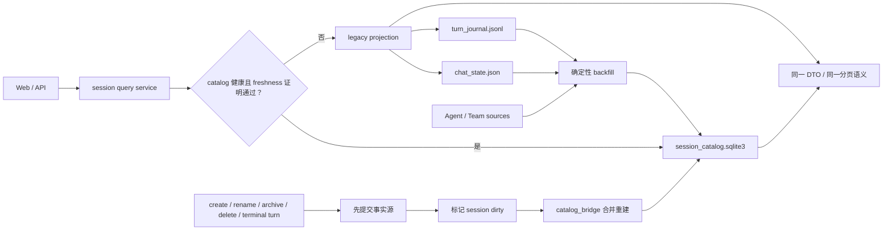
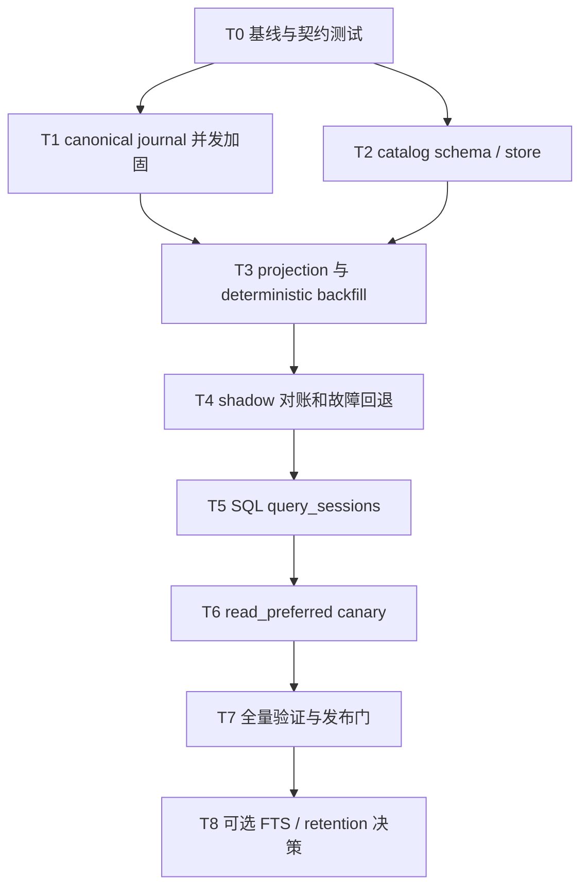

# Vibelution 会话存储混合适配方案

> **Status:** user-approved / implementation-active
> **Owner:** agent-codex-session-catalog-implementation
> **Claim:** T0 claim released; T1-T4 checkpoint scopes completed on the task worktree
> **Branch:** `codex/session-catalog-implementation`
> **Worktree:** `C:\Users\Administrator\Desktop\Vibelution-worktrees\session-catalog-implementation`
> **Scope:** 会话事实账本加固、可重建 SQLite catalog、迁移/回退、查询切流、容量与故障治理
> **Replaces:** 本文件 2026-07-23 初稿
> **Implementation link:** T0-T2 complete; T3 reconcile/freshness bridge, T4 fail-safe runtime shadow with incremental rebuild and T5 SQL candidate provider complete; real shadow canary remains
> **Validation:** 主流项目源码/官方文档复核、项目 owning surface 复核、source-of-truth/迁移/回滚/性能门自审、`git diff --check`
> **Close condition:** shadow 零差异、故障自动回退、性能晋级门通过、`read_preferred` runtime verification 通过

## 1. 决策摘要

- **决策：ADAPT，不照搬。**
- 保留 Vibelution 现有 `turn_journal.jsonl` 作为会话事件的唯一事实源。
- 保留 `chat_state.json` 作为会话元数据和当前选择状态的事实源；Agent 身份、团队关系和运行中状态继续由各自现有所有者负责。
- 新增一个可删除、可重建的 `session_catalog.sqlite3`，只承担会话列表、过滤、排序、分页、诊断和后续可选搜索的派生查询能力。
- 采用 Codex CLI 的“JSONL 事实流 + SQLite metadata index + scan/read repair”边界，吸收 Hermes 的 WAL、谱系和迁移经验，以及 OpenCode 的显式 schema、复合索引和稳定分页经验。
- v1 不把完整消息正文、reasoning、原始 tool output 或 prompt 复制进 SQLite；确有全文搜索需求时再进入单独的安全评审阶段。
- v1 catalog 只能放在本地文件系统；如果运行目录是 UNC、网络盘或不支持 WAL 的 VFS，强制退回 `off/legacy`，不得尝试共享 WAL。

该方案优先解决当前会话列表全量装载、Python 过滤/排序、短时内存缓存和多来源重建带来的扩展性问题，同时避免一次性把稳定的事件账本迁成数据库事实源。

### 1.1 当前实现快照（2026-07-28）

- T0：查询合同、100/1,000/10,000 baseline 和正式数据隔离门禁已提交。
- T1：每会话跨进程锁、sequence 原子分配、append flush/fsync、唯一临时文件 rewrite 和 Windows 子进程回归已提交。
- T2：本地 runtime cache 路由、WAL/local-filesystem fail closed、schema v1、migration checksum、参数化查询、quick_check、lease/watermark 和错误分类已提交。
- T3 核心：canonical snapshot 投影、孤儿 journal 隔离、TEMP candidate、源 revision 二次校验、原子发布、删除重建和 stale lease takeover 已提交。`chat_state.state_revision` 在所有 state 写入（含 legacy-message cleanup）中以持锁磁盘状态单调推进；state 写入以全局 dirty、journal append 以会话 dirty 通知 catalog。dirty 记录和 `catalog.untrusted` 只会在成功 reconcile 时条件清除，晚到 mutation 会保留；runtime 以去抖、最多 3 次的后台重建恢复候选，失败或 shutdown 一律保持 legacy。
- T4：typed `off|shadow`、有界 comparator、实际 SQLite candidate startup registration、受控增量 rebuild、runtime-scene 事件和异常时 exact legacy fallback 已提交。每次 shadow query 仅记录 match/mismatch/degraded、数量、filter/sort 与差异类别，不记录 session ID、标题或消息内容；只有显式 `shadow` 才以 non-repair legacy summary 异步重建并注册 provider。dirty/sentinel/source failure 时 candidate 禁用并保留 legacy。默认生产配置仍为 `off`。10k 无 journal synthetic startup rebuild 为 1,076.59ms（专用 temp root/sentinel，正式数据快照不变）。
- T5：参数化 SQL filter/sort/pagination、稳定 cursor、DTO adapter 和 10k 临时数据 profile 已提交；p95 7.5–19.3ms，较 T0 legacy 144–345ms 快约 8–46 倍。它只在显式 `shadow` 下注册为 runtime candidate，且从不接管正式 `query_sessions`。
- T6 未开始：不得启用 `read_preferred`；必须先完成真实 shadow 零差异和 Launcher canary 证据。

## 主流 Agent 复用结论

| 项目 | 当前存储策略 | 借鉴点 | 明确不照搬 |
| --- | --- | --- | --- |
| [Codex CLI](https://github.com/openai/codex) | canonical rollout JSONL；SQLite 保存可查询 metadata；默认 list 可扫描 JSONL 修复；backfill 有 lease/watermark | 主架构：history/index 分离、SQLite-less read、read repair、stale lease takeover、稳定复合排序 | 不复制 Rust/sqlx/schema；不允许 SQLite metadata 成为唯一恢复载体 |
| [Hermes Agent](https://github.com/NousResearch/hermes-agent/blob/main/website/docs/developer-guide/session-storage.md) | `state.db` 保存 session、full messages、model config；WAL、schema version、FTS5/trigram、lineage | WAL、migration 幂等性、parent lineage、未来搜索的 role filter/CJK 设计 | v1 不存 full message/system prompt/reasoning/tool output，不创建 FTS trigger |
| [OpenCode](https://github.com/anomalyco/opencode/blob/dev/packages/opencode/src/session/session.sql.ts) | SQLite canonical store；`session/message/part/todo` 规范化；FK cascade、复合索引、bundled migrations | `(session_id,time,id)` 稳定排序、父子关系、参数化查询、删除级联与容量治理意识 | 不做 big-bang canonical migration；不在网络/NFS 上共享 WAL；不保留无界 event/message snapshot |
| [Aider](https://aider.chat/docs/faq.html#can-i-share-my-aider-chat-transcript) | `.aider.chat.history.md` 人可读历史 | 保留文件历史的可查看、可导出、可恢复属性 | 单文件 history 不适合多会话、Agent/Team 可见性与分页 |

复用研究结论为 `ADAPT`：

- **主模式来自 Codex CLI**：JSONL 是历史事实，SQLite 是可重建目录。
- **Hermes 只提供未来能力参考**：谱系、FTS5、归档和迁移；全文消息入库不是 v1 目标。
- **OpenCode 提供 SQL 数据建模参考和反例**：索引与 FK 值得借鉴，但集中 canonical DB、NFS/WAL 和无界增长风险必须规避。
- **Aider 提醒保留人可读出口**：数据库优化不能牺牲 JSONL 的审计、导出和恢复。

详细研究记录：`<agent-research-root>\search-results\2026-07-27-mainstream-agent-session-storage-adaptation.md`。

## 2. 规划元数据

- **工作分类：** `HIGH_RISK`
- **执行路由：** `TASK_GRAPH`
- **性能分类：** `PROFILE`；本规划轮未运行产品 benchmark，因此不声称 SQLite 已经更快
- **建议工作方式：** BDD/TDD + migration gate + profile gate
- **当前状态：** user-approved，T0 contract/guard/profile complete
- **当前 T0 claim：** `claim-fb6bcce7c6e8`；只覆盖本文档、契约测试、fixture 和 benchmark，不覆盖后续生产 hot files
- **规划范围：** 会话事实账本加固、SQLite 派生目录、迁移/回退、服务读路径、诊断与测试
- **明确不在本轮直接实现：** 完整消息数据库化、向量检索、跨项目云同步、会话加密格式重写、现有 JSONL 清理
- **协作边界：** 当前 `research-project-agent-sessions` 工作占用 `conversation_index.py`、`projection.py` 和部分 session tests；T4/T5 实施必须等待其释放、明确拆分或协调 handoff
- **复用研究：** `<agent-research-root>\search-results\2026-07-27-mainstream-agent-session-storage-adaptation.md`

### 2.1 排除方案

| 方案 | 结论 | 原因 |
| --- | --- | --- |
| 全量迁成 Hermes/OpenCode 式 canonical SQLite | reject for v1 | 改变恢复、删除、并发和隐私边界；收益尚无 baseline 支撑 |
| JSONL + 继续增加 TTL/in-memory cache | reject | 不能提供跨进程持久索引、SQL 过滤/分页、schema/migration 和损坏诊断 |
| JSONL 与 SQLite 双 canonical write | reject | 会形成不可判定冲突，违背单一事实源 |
| 每个 session 一个 SQLite | reject | 文件/连接/WAL sidecar 数量膨胀，跨 session 查询仍需聚合 |
| 直接在 operator workspace 放共享 WAL DB | reject | 容易进入同步盘/网络盘，复刻 OpenCode NFS 风险 |
| Codex 式 derived catalog | recommend | 与现有事实边界最贴合，能渐进切流并保持可删除重建 |

### 2.2 SQLite 的实际收益与启用条件

SQLite 的收益不在“把 JSON 换成 SQL”本身，而在于把高频的跨会话查询从“装载全部对象后用 Python 过滤”变成有索引、可分页、跨重启复用的本地查询：

| 收益 | 对 Vibelution 的价值 | 边界 |
| --- | --- | --- |
| 复合索引和 SQL 过滤 | 按 visibility、kind、agent、team、状态、更新时间直接筛选和排序 | 只优化 session metadata；正文仍读 JSONL |
| 数据库级分页和稳定排序 | 避免每次创建全量 Python 列表，减少大规模会话下的内存和首屏延迟 | v1 保持现有 cursor 契约，不顺带改 API |
| WAL 下的读写隔离 | reconciler 短事务更新时，列表查询仍可读取上一份一致快照 | 只支持本地文件系统；不承诺网络盘共享 |
| schema、索引和 migration | 查询字段、版本与升级规则显式可测，不再依赖隐式 dict 形状 | 未知 schema 必须 fail closed |
| 跨进程持久目录 | Launcher 重启后不必依赖 4 秒进程内 cache 才获得查询收益 | freshness 失败仍回退 legacy |
| 可诊断、可重建 | 能检查版本、锁、损坏、行数和 WAL 体积；删库后可由事实源恢复 | catalog 绝不能承载唯一历史 |

代价是新增 schema/migration、失效协议、锁竞争、WAL 容量和故障恢复复杂度。因此 SQLite 不是无条件启用：如果 T0 证明实际规模下没有稳定收益，或 shadow 无法长期零差异，就保留 `off`，只交付 journal 并发加固，不为“用了数据库”而承担长期维护成本。

## 3. 目标与成功标准

### 3.1 目标

1. 会话历史在进程崩溃、SQLite 锁冲突、catalog 损坏时仍然可恢复。
2. 会话查询不再依赖每次构造完整 Python 列表后再过滤和分页。
3. 新旧读路径可以逐会话、逐环境对账，并能在一次请求内自动回退。
4. catalog 可以从事实源确定性重建；删除 catalog 不得造成用户会话丢失。
5. 多进程并发追加 JSONL 时不出现重复 sequence、交错重写或半行。
6. 诊断只记录有界元数据，不泄露消息、prompt、reasoning、tool output 或密钥。

### 3.2 发布门槛

- shadow 对账样本中会话集合、可见性、排序键、分页结果和生命周期状态 **零差异**。
- 并发子进程测试中 sequence 唯一且连续，所有 JSONL 行都可解析。
- catalog 被锁、只读、删除、损坏或 schema 不兼容时，请求自动退回 legacy 路径，事实写入不失败。
- T0 先记录测量噪声并冻结 SLO；当前实际规模下 SQLite 路径 p95 不劣于 legacy 10%，在 1,000/10,000 会话下收益必须同时超过测量噪声和复杂度成本。
- 建议晋级线：10,000 会话的 indexed filter/page p95 不高于 100ms，且至少比 legacy 快 2 倍；若 T0 证明该绝对阈值不适合本机，必须在写代码前以 baseline 证据改写门槛。
- catalog 行数保持 `O(session_count)`；v1 不允许随 token、delta 或 message count 线性膨胀。
- 所有 focused tests、相关回归测试和运行时场景验证通过。
- 只有在上述门槛通过后，operator config 才能从 `shadow` 切到 `read_preferred`。

## 4. 事实源与所有权

| 事实 | 唯一事实源 | 唯一写入者 | SQLite 中的状态 | 失效依据 |
| --- | --- | --- | --- | --- |
| 会话事件、turn 边界、可见消息 | `sessions/<session-id>/turn_journal.jsonl` | `core/chat/turn_journal.py` / `conversation_ledger.py` | 只存派生计数、最新 sequence、最新 turn 状态 | journal size、mtime、尾部 sequence、projection version |
| 会话标题、创建时间、归档状态、当前选择 | `chat/chat_state.json` | 现有 chat state transaction 和 session mutation 路径 | 复制为查询投影 | chat state signature |
| Agent 身份和团队关系 | Agent Directory / team workflow 现有事实源 | 对应领域服务 | 复制稳定外键和查询字段，或查询时补充 | registry/team signature |
| turn 正在运行、排队或中断 | 现有 runtime/turn lifecycle | 现有运行时服务 | 只作短期投影，不反向写事实源 | runtime generation / terminal event |
| 会话列表排序、过滤、分页结果 | 上述事实的投影 | `catalog_bridge` reconciler | catalog 的主要职责 | catalog source signature |
| catalog schema 和投影版本 | SQLite `catalog_meta` | migration/reconcile 代码 | 自身元数据 | schema/projection version |

红线：

- SQLite 不是第二份会话真相；任何代码不得只写 SQLite 而不先提交事实源。
- catalog 写失败不能令用户 turn 写入失败。
- catalog 行比事实源旧时不能对外返回；必须先回退 legacy 或完成对账。
- 删除、重建或隔离 catalog 不需要用户数据恢复流程。

## 5. 目标架构



### 5.1 新模块边界

1. `core/chat/session_catalog.py`
   - 路径路由、连接参数、schema migration、事务、upsert、查询、quick check 和隔离。
   - 不依赖 Web DTO，不读取运行时全局对象。

2. `core/web/services/session/catalog_bridge.py`
   - 从 chat state、Agent Directory、team source 和 journal 投影构造 catalog row。
   - 管理 source signature、dirty session、coalesced reconcile、shadow compare 和 legacy fallback。
   - 不拥有事实写入。

3. 现有 slice 模块
   - `conversation_index.py`：SQL 过滤、排序和分页入口。
   - `projection.py`：保持 DTO 兼容和 legacy 投影。
   - `session_ops.py`：启动预热、重建调度。
   - `events.py`：有界 runtime-scene 事件。
   - `agent_sessions.py`：仅在已有生命周期提交成功后发出 dirty/invalidate 信号。
   - `journal_bridge.py`：仅在 canonical append 成功后发出里程碑级 dirty 信号。

`session_service.py` 继续只是 facade；不得把 catalog 主体逻辑堆回 facade。

## 6. SQLite v1 设计

### 6.1 路径与连接

- 默认路径：`%LOCALAPPDATA%\Vibelution\session-catalogs\<workspace-key>\session_catalog.sqlite3`。
- `workspace-key` 是“规范化 canonical workspace path + formal/developer mode”的稳定短 hash；数据库不保存或暴露该绝对路径。
- 如果 `LOCALAPPDATA` 不可用，开发环境可退到 `<project-root>\.runtime\session-catalogs\<workspace-key>\`；正式环境不得静默退到 operator workspace。
- catalog 是派生 runtime cache，不放入 `%USERPROFILE%\Documents\Vibelution` 的 canonical workspace，也不进入备份/同步目录。
- 初始化时验证目标是本地文件系统且 SQLite VFS 实际接受 WAL；UNC、network drive、只读盘或 WAL 设置未返回 `wal` 时，将 catalog 状态标为 `unavailable` 并强制 legacy。
- Python 标准库 `sqlite3`；复用项目中 usage ledger 和 launcher stores 的连接模式，不新增 ORM 或数据库依赖。
- 连接设置：
  - `PRAGMA journal_mode=WAL`
  - `PRAGMA synchronous=NORMAL`
  - `PRAGMA foreign_keys=ON`
  - `PRAGMA busy_timeout=5000`
- 初始化完成后验证实际 pragma 值，不把执行 SQL 无异常等同于 WAL 已启用。
- 写事务保持短小；reconcile 使用 `BEGIN IMMEDIATE`。
- 连接不得跨线程隐式共享；每个有界操作自己获取/关闭连接，或使用项目已验证的连接封装。
- 完整 backfill 后执行受控 `wal_checkpoint(TRUNCATE)`；普通请求不执行 blocking checkpoint。

### 6.2 表

`catalog_meta`

| 字段 | 说明 |
| --- | --- |
| `id INTEGER PRIMARY KEY CHECK(id=1)` | 单例状态 |
| `schema_version INTEGER NOT NULL` | 数据库 schema |
| `projection_version INTEGER NOT NULL` | summary 投影合同 |
| `source_revision TEXT NOT NULL` | chat/agent/team/journal milestone 的组合版本 |
| `backfill_status TEXT NOT NULL` | pending/running/complete/failed |
| `lease_owner TEXT` | backfill single-writer owner |
| `lease_expires_at TEXT` | stale takeover 时间 |
| `watermark TEXT` | 最近已扫描 journal 相对位置 |
| `last_reconciled_at TEXT` | 最近成功时间 |
| `last_quick_check_at TEXT` | 最近 integrity evidence |
| `last_error_type TEXT` | 有界错误类型，不存错误正文 |

`schema_migrations`

| 字段 | 说明 |
| --- | --- |
| `version INTEGER PRIMARY KEY` | 单调版本 |
| `applied_at TEXT NOT NULL` | 应用时间 |
| `checksum TEXT NOT NULL` | migration 内容校验 |

迁移必须在事务中按版本执行；未知更高版本 fail closed，不尝试降级写入。

`sessions`

| 字段 | 说明 |
| --- | --- |
| `session_id TEXT PRIMARY KEY` | 会话 ID |
| `title TEXT` | 标题投影 |
| `task_title TEXT` / `task_summary TEXT` | 现有 q 查询需要的有界任务元数据 |
| `session_kind TEXT NOT NULL` | 普通、agent、team、child 等稳定枚举 |
| `visibility TEXT NOT NULL` | normal/hidden/archived 等 |
| `agent_id TEXT` | Agent 外键投影 |
| `agent_code TEXT` / `agent_display_name TEXT` | 现有查询字段 |
| `team_id TEXT` | Team 外键投影 |
| `parent_session_id TEXT` | 谱系父会话 |
| `source_session_id TEXT` | fork/import 来源 |
| `workspace_key TEXT` | 工作区 hash，不存任意绝对路径 |
| `dialogue_model_id TEXT` | 现有查询字段 |
| `status TEXT` / `current_phase TEXT` / `child_status TEXT` | 状态查询字段 |
| `created_at TEXT` | ISO 时间 |
| `updated_at TEXT` | 最后可见更新时间 |
| `last_active_at TEXT` | 排序用时间 |
| `last_turn_status TEXT` | 最新 turn 状态 |
| `open_turn_id TEXT` | 若有未结束 turn |
| `latest_sequence INTEGER NOT NULL` | 最新事件 sequence |
| `event_count INTEGER NOT NULL` | 事件计数 |
| `message_count INTEGER NOT NULL` | 可见消息计数 |
| `journal_rel_path TEXT` | 相对路径，不存任意绝对路径 |
| `journal_size INTEGER NOT NULL` | freshness 输入 |
| `journal_mtime_ns INTEGER NOT NULL` | freshness 输入 |
| `source_revision TEXT NOT NULL` | 单行来源版本 |
| `indexed_at TEXT NOT NULL` | 投影时间 |

T0 必须把当前 `_session_query_matches()` 的字段冻结成 schema 清单；不允许为了“以后可能搜索”继续复制 detail DTO。允许存 title/task summary 等既有 session metadata，但不存消息正文、reasoning、system prompt 或原始 tool output。

建议索引：

- `(last_active_at DESC, session_id DESC)`
- `(visibility, last_active_at DESC, session_id DESC)`
- `(session_kind, last_active_at DESC, session_id DESC)`
- `(agent_id, last_active_at DESC, session_id DESC)`
- `(team_id, last_active_at DESC, session_id DESC)`
- `(parent_session_id)`
- title sort 使用 `(title COLLATE NOCASE, session_id)`；不得为 substring `q` 在 v1 偷加 FTS

`catalog_dirty_sessions`

| 字段 | 说明 |
| --- | --- |
| `session_id TEXT PRIMARY KEY` | 待重建会话 |
| `reason TEXT NOT NULL` | 枚举原因 |
| `source_revision TEXT NOT NULL` | 观察到的来源版本 |
| `observed_at TEXT NOT NULL` | 标记时间 |

它只是工作队列，不是事实源。数据库不可写时，以进程内 degraded 标志和 canonical source revision 强制回退；恢复后可由启动扫描重建 dirty 集合。

v1 **不创建** `turns`、`messages`、`parts` 或 FTS 表。turn 定位仍由 JSONL ledger 完成；只有产品需求和 profile 证明需要按 turn 查询时，才在新 ADR 中评估 `turns` 投影。

### 6.3 Backfill lease 与原子发布

1. 用短事务领取 `lease_owner/lease_expires_at`；未过期 owner 存在时不启动第二个 worker。
2. 在数据库写锁之外读取稳定 source snapshot，按 watermark 构造内存/临时表 rows。
3. 再次验证 source revision；发生变化则放弃本轮，不发布 stale rows。
4. 在同一连接的 TEMP `sessions_next` 中完成唯一性、必填字段、计数和索引字段校验。
5. `BEGIN IMMEDIATE` 后原子替换 `sessions` 内容，并在同一提交中写入 `source_revision/backfill_status=complete`。
6. 失败时事务回滚，旧 catalog 保持可读；若旧 revision 已不 fresh，则读路径回退 legacy。
7. worker 崩溃后，其他进程只能在 lease 过期后 takeover；checkpoint watermark 仅用于诊断和下次扫描起点，不能绕过 source revision 验证。

SQLite MVCC 会让并发 reader 在提交前继续看到旧快照，不需要让每行携带 `generation_id`。这比首稿的多代次主键更小，也避免所有查询永久增加 generation 条件。

## 7. 一致性与写入策略

### 7.1 Canonical-first

所有 mutation 遵循：

1. 在 catalog 层预先标记受影响 `session_id` 为 dirty；如果 DB 不可写，则创建本地 `catalog.untrusted` sentinel 并把当前进程读模式降为 legacy。
2. 在现有事实源完成提交。预失效成功但事实提交失败只会造成一次多余 reconcile，不影响正确性。
3. chat state mutation 在同一文件事务中递增通用 `stateRevision`；journal-only milestone 由 service bridge 提交 append receipt 并保留 dirty 标记。
4. reconciler 合并短时间内重复 dirty 信号，成功更新 session row 和 source revision 后才能清除 dirty/sentinel。
5. SQLite 写失败只记录 degraded 状态；不得回滚已经成功的事实提交，也不得尝试从 catalog 反向补写 JSONL/chat state。

`catalog.untrusted` 不是第二事实源，只是“禁止相信 catalog”的安全闩。它可以从 facts 重建，但只能在 reconcile 验证完成后移除。

### 7.2 不按 token/delta 写 SQLite

下列事件触发 catalog 更新：

- session create、rename、archive、unarchive、delete
- agent/team bind 或 visibility 变化
- turn started
- turn terminal：completed、failed、interrupted
- 启动时 source signature 不匹配

流式 assistant delta、reasoning delta、tool output chunk 不逐条更新 catalog。它们仍追加 JSONL，catalog 在里程碑或请求前 freshness 检查时合并投影。

### 7.3 Freshness 证明

SQLite 读路径必须同时满足：

- schema version 可读；
- projection version 等于当前代码版本；
- `PRAGMA quick_check` 的最近一次结果为 `ok`；
- backfill status 为 complete，lease 不处于冲突状态；
- catalog 不存在 `catalog.untrusted` sentinel；
- chat state `stateRevision`、Agent Directory signature、team visibility signature 与 `catalog_meta.source_revision` 一致；
- `catalog_dirty_sessions` 为空；
- 进程内没有尚未落盘的 session-list-affecting mutation。

无法证明 fresh 即视为 stale。stale 不等于损坏：先回退，后台重建。

为了避免“验证索引却再次扫描全部 JSONL”：

- 普通 query 只比较小型 revision/signature，不遍历 `sessions/`；
- Launcher 启动、非正常退出恢复、schema/projection 变化时做一次完整 journal inventory scan；
- 运行中按低频、可取消的 reconciliation interval 扫描，间隔由 T0 profile 决定；
- create/delete/archive/visibility/Agent/Team 绑定等可能改变可见性或授权的 mutation 必须同步递增 revision，未完成失效前不允许返回 catalog 结果；
- turn 计数和非权限状态可以合并更新，但 shadow parity 必须证明其延迟没有破坏现有 API 契约。

如果未来允许项目外进程绕过 Vibelution service 直接写 journal，则 `read_preferred` 必须保持关闭；跨进程锁只能防止文件损坏，不能替代 catalog invalidation 协议。

### 7.4 并发安全先决条件

在引入 catalog 前先加固 canonical journal：

- 每个 session 使用独立跨进程锁文件；
- 锁内完成尾部 sequence 读取、下一 sequence 分配、单行 append、flush 和必要的 `fsync`；
- `rewrite_turn_events` 使用同一锁和唯一临时文件，flush/fsync 后 atomic replace；
- catalog 操作不得在持有 journal 锁时执行；
- 锁等待有明确超时和结构化错误，不能无限阻塞；
- 通过真实子进程测试覆盖 Windows 并发行为。
- 所有受支持写入进程都必须经过同一个 catalog invalidation bridge；绕过 bridge 的外部 writer 只保证 JSONL 安全，不保证 catalog freshness。

是否对每一个 delta 都 `fsync` 要在 profile 后决定。最低门槛是 turn 边界和终态事件必须 fsync；若合并刷盘，崩溃窗口必须被文档化并有恢复测试。

## 8. 读路径与兼容性

### 8.1 模式

在 `config/models.py` 增加 typed config：

```toml
[session_catalog]
mode = "off" # off | shadow | read_preferred
reconcile_on_startup = true
busy_timeout_ms = 5000
```

- `off`：完全使用现有路径；允许手工重建/诊断。
- `shadow`：对外仍返回 legacy 结果，后台运行 SQL 查询并比较。
- `read_preferred`：fresh 时返回 SQL 结果，否则在同一请求内回退 legacy。

不要把三态模式塞进现有 boolean feature gate。运行环境只允许把 operator 配置降级，不能越权从 `off` 提升到 `read_preferred`。

### 8.2 API 保持

- 首轮保持现有 session DTO、过滤字段、排序、cursor 语义和错误契约。
- `query_sessions()` 优先切到 SQL；`get_session_detail()` 继续从 JSONL/现有投影读取。
- 可在诊断响应或内部状态中增加：
  - `source: "catalog" | "legacy"`
  - `catalogStatus: "healthy" | "stale" | "degraded" | "disabled"`
  - `lastReconciledAt`
- 不要求前端为首次切流新增复杂 UI；运行日志和现有诊断面板先可见即可。

### 8.3 SQL 查询规则

- 所有过滤值参数化；禁止拼接 SQL。
- 排序字段使用白名单映射。
- 稳定排序始终追加 `session_id` 作为 tie-breaker。
- `q` 首轮使用参数化 `LIKE ... ESCAPE` 覆盖 T0 冻结的 session metadata 字段；不搜索消息正文，不因为 substring 查询直接启用 FTS。
- v1 保留当前 cursor 契约；若后续改为 keyset cursor，必须单独做 API 兼容迁移。
- visibility、agent/team 权限条件必须进入 SQL 或在 SQL 结果返回前执行等价且有测试的授权过滤，不能因分页后过滤导致数量和 cursor 漂移。

## 9. 迁移、故障检测与回滚

### 9.1 首次 backfill

1. 读取稳定的 chat state 快照和 Agent/Team signature。
2. 枚举已知会话，不把任意孤儿目录自动变成可见会话。
3. 对每个 journal 做容错读取；坏行按现有 ledger 规则隔离并记录计数。
4. 在写锁之外构造完整 `sessions_next` rows，并持续记录 watermark。
5. 验证会话 ID 集合、visibility、排序键、最新 sequence、open turn 和计数。
6. 再次检查 source revision；期间有变化则丢弃临时结果并退避重试。
7. 用单个短事务原子替换 `sessions` 并提交新的 `catalog_meta.source_revision`。

孤儿 journal 只记录 `orphan_count` 和有界诊断，不出现在普通列表。后续恢复工具必须由用户或明确策略决定是否重新挂载。

### 9.2 Schema migration

- schema version 单调递增，每个迁移函数可重复检测但只执行一次。
- migration checksum 不一致视为不支持，禁止继续写。
- 迁移失败保留旧数据库用于诊断并禁用新读路径；不把半迁移 schema 当成 healthy。
- 新代码只能读取明确支持的版本；未知更高版本必须 fail closed 到 legacy。
- v1 不导入任何外部 Codex/Hermes/OpenCode 数据文件。

### 9.3 故障分类

| 故障 | 检测 | 行为 | 恢复 |
| --- | --- | --- | --- |
| DB busy/locked | sqlite error / timeout | 当前请求回退 legacy，不隔离 DB | 后台重试，统计持续时间 |
| 只读或权限失败 | open/write error | 保持事实写入，catalog degraded | 修复权限后重建 |
| stale signature | freshness check | 回退 legacy | 合并 reconcile |
| schema 不支持 | version check | 禁止 SQL read | 迁移或回退版本 |
| `SQLITE_CORRUPT` / `NOTADB` | quick check / sqlite error code | 关闭连接并隔离 db/wal/shm | 新建空 catalog 并 backfill |
| reconcile 中源发生变化 | 双重 revision 检查 | 丢弃 `sessions_next` | 退避后重试 |
| canonical journal 写失败 | append/rewrite error | turn 写入失败并保留明确错误 | 不能用 SQLite 掩盖或补写 |
| shadow 结果不一致 | parity comparator | 不允许晋级 read_preferred | 保存有界差异类型并修复 |
| catalog 位于 network/unsupported VFS | drive/VFS/WAL result check | 状态 unavailable，强制 legacy | 移到本地 runtime cache |
| DB/WAL 无界增长 | size/row/checkpoint budgets | degraded 并停止 shadow 重建风暴 | checkpoint、诊断、重建；不自动删除 facts |

隔离文件名使用 UTC 时间戳，例如 `session_catalog.sqlite3.corrupt-<utc>`。只有明确的 corruption/not-a-database 才隔离；普通锁冲突不得重命名数据库。

### 9.4 回滚

逻辑回滚只需把 operator config 改为 `shadow` 或 `off` 并 Launcher refresh：

- JSONL 和 chat state 始终完整，因此不需要反向数据迁移。
- 保留 catalog 文件用于诊断；除非确认损坏，不自动删除。
- 如果新 journal lock 导致回归，可回滚锁实现代码，但不得回滚已产生的 canonical events。
- 发布回滚不删除新 schema，旧代码必须忽略未知 catalog 文件。

授权门槛：

- 修改正式 operator config、Launcher refresh、删除/隔离非损坏 catalog、清理旧代次，均由实现任务按项目规则执行。
- 从 `shadow` 升到 `read_preferred` 需要性能、对账、故障注入和 runtime-scene 证据。
- 推送、PR、发布和版本文件更新仍需用户明确授权。

### 9.5 容量与维护

- v1 每个 session 只允许一行 catalog summary；`event_count/message_count` 是整数投影，不展开 event。
- 监控 main DB、`-wal`、`-shm` 大小和 row count；阈值由 T0 实测写入 config/常量，不拍脑袋设置自动删除。
- 完整 backfill、批量删除或迁移后执行受控 checkpoint；`VACUUM` 只允许在无 active work、持有 maintenance claim 且有空间预检时执行。
- catalog 重建前不要求备份，因为 facts 可恢复；corrupt DB 隔离文件有保留数量/时间预算，清理属于显式 maintenance action。
- session hard-delete 必须先按现有 canonical 删除合同处理 JSONL/chat state，再删除 catalog row；失败时保持 dirty/untrusted，不能显示为普通成功。

## 10. Runtime Scene 与可观测性

新增或复用以下有界事件：

- `session.catalog.init`
- `session.catalog.reconcile_started`
- `session.catalog.reconcile_completed`
- `session.catalog.reconcile_failed`
- `session.catalog.shadow_mismatch`
- `session.catalog.read_served`
- `session.catalog.fallback`
- `session.catalog.quarantined`

允许字段：

- mode、schemaVersion、projectionVersion、backfillStatus、leaseState、watermark
- sourceSignature 的短 hash
- sessionCount、changedCount、orphanCount、badLineCount
- durationMs、fallbackReason、errorType、retryCount、dbBytes、walBytes
- SQL/legacy 路径和分页参数的有界枚举/数值

禁止字段：

- session title、消息正文、prompt、reasoning、tool output
- API key、环境变量值、完整绝对路径
- SQL 参数中的用户文本或大块 diff

高频 `read_served` 需要采样或聚合，避免日志反过来成为性能问题。

## 11. 执行任务图



每个任务都必须单独 claim 精确文件范围；热文件有重叠时串行执行。

### T0：冻结兼容契约并建立基线

**依赖：** 无
**产物：**

- 为现有 `list_sessions()`、`query_sessions()`、visibility、排序、cursor 和 lifecycle 行为补契约测试。
- 生成 100/1,000/10,000 会话的合成 profile fixture。
- 记录当前实际数据量、legacy p50/p95、内存峰值、journal 扫描次数和 cache hit。
- 分开记录 cold build、warm cache、filtered page、title sort、state/agent filter，并输出方差/分位数。warm/filter/sort 至少 5 次 warmup + 30 次样本；10,000 会话 cold build 因实测单进程重复重建会使 RSS 超过 1 GiB，改为每样本独立进程、1 次 warmup + 5 次样本，禁止把 allocator 累积误当成稳定生产负载。
- benchmark 只在临时 workspace 上运行，不压测正式 operator 数据，不把脆弱时间阈值放入普通 pytest。

**主要文件：**

- `tests/test_session_service.py`
- `tests/test_web_session_routes.py`
- 新建 `tests/session_catalog_fixtures.py` 或等价测试 helper
- 新建 `scripts/benchmark_session_query.py`，输出有界 JSON 结果到未跟踪的性能 evidence 目录
- 新建 `scripts/session_benchmark_isolation.py`，独立拥有 data-root/sentinel/Launcher mount/operator fingerprint 门禁，避免性能编排脚本继续累积安全职责

**退出条件：** 当前行为和性能数据可复现，所有后续 parity 有固定 oracle。

#### T0 完整基线（2026-07-28）

有效 manifest：`d35e3a8b0385be3b23b642fff27c18bb324618a57585eb21ae561debba2f2789`。100/1,000 使用 5 warmup + 30 samples；10,000 cold 使用每样本独立进程、1 warmup + 5 samples，其他 10,000 场景仍为 5 + 30。原始 JSON 仅保留在 sentinel 临时 evidence root，不提交包含 operator hash/本机路径的产物。

| 会话数 | cold p95 | warm p95 | text p95 | agent p95 | state p95 | title sort p95 |
| ---: | ---: | ---: | ---: | ---: | ---: | ---: |
| 100 | 1,589.35 ms | 0.09 ms | 0.31 ms | 0.15 ms | 0.14 ms | 0.23 ms |
| 1,000 | 15,092.83 ms | 0.77 ms | 2.93 ms | 1.51 ms | 1.83 ms | 1.02 ms |
| 10,000 | 148,632.96 ms | 144.24 ms | 226.07 ms | 256.78 ms | 305.80 ms | 345.07 ms |

结论：

- legacy cold projection 近似线性增长，10,000 会话约 146.8 秒均值，必须从请求热路径移到后台 reconcile；
- 10,000 warm/filter/sort p95 已全部超过 100 ms 晋级线，SQL 下推至少需要达到既定 `p95 <= 100ms` 且相对 legacy `>= 2x`；
- 默认 4 秒 cache TTL 小于 10,000 会话 cold build 时间，若不固定 warm profile TTL，会把持续 cold rebuild 误标为 warm query；
- 重复 10,000 cold rebuild 的单进程 RSS 可超过 1 GiB，因此正式 backfill/reconcile 必须分批、可取消，并验证进程 RSS；普通 pytest 只保留 8-session shape 与污染门禁；
- 最终 operator `chat_state.json`、`agents.json`、`mode_bindings.json`、tool/memory policy、Agent/session 目录 hash/count 前后完全一致，`session-NNNNN=0`、`createdBy=session_repair=0`。

#### T0 运行数据隔离门（事故后强制）

代码 worktree 隔离与运行数据隔离是两道独立门。所有 benchmark、repair、migration 和 backfill 工具必须复用以下 fail-closed 契约，不能因为代码位于任务分支就推断数据也是隔离的：

- 强制显式 `data_root`；只允许带专用 sentinel 的 system-temp 子目录，缺参、符号链接、正式 operator data root、其父/子目录、源码 checkout 或 Launcher 当前挂载根均拒绝；
- 只读解析 Launcher state 判断挂载根；benchmark 使用 in-process 隔离依赖或独立临时端口/进程，不连接、不重启、不复用 Launcher 管理的正式服务；
- dry-run 先输出目标路径、对象数、ID 模式、预期 operator 状态 hash 和 manifest hash；apply 必须提交完全匹配的 manifest hash，目标文件只在临时 root 内原子替换；
- benchmark 禁止调用 `save_chat_state()` 或任何 Agent/Policy 持久化入口；异常退出也必须在 `finally` 中复核正式状态；
- 大规模 cold profile 每个样本使用独立子进程，进程退出即释放投影对象；10,000 会话默认跳过 `tracemalloc`，allocation probe 与 latency probe 分离，完整 profile 不进入普通 CI；
- warm/filter/sort 场景在隔离上下文固定足够长的 cache TTL，确保 30 个样本真的是 warm query；默认 4 秒 TTL 下 10,000 会话投影会在单次重建完成前过期，不能把反复 cold rebuild 误标为 warm query；
- 前后同时核对 `chat_state.json`、`agents.json`、`mode_bindings.json`、tool/memory policy 内容、Agent/session 目录名的 hash 与数量，并显式统计 `session-NNNNN` 和 `createdBy=session_repair` 异常；
- repair 必须逐条证明 journal/direct-session 来源并设置新增上限；高数量 repair 默认失败，无法证明来源的对象只能进入 quarantine，不能进入正式索引；
- repair/migration 使用 backup + quarantine + 可幂等重跑 manifest，不直接永久删除；在这些门禁测试全绿前，禁止对正式运行态执行 catalog benchmark/repair 或 Launcher 写入型验收。

### T1：加固 canonical journal

**依赖：** T0
**产物：**

- 在 `turn_journal.py` 引入每会话跨进程锁、原子 rewrite 和明确 flush/fsync 策略。
- 失败时保留原文件，不留下会被读取的半成品。
- 子进程并发 append/rewrite 测试覆盖 Windows。

**主要文件：**

- `core/chat/turn_journal.py`
- 可选新建 `core/infrastructure/file_lock.py`；只有两个以上领域需要复用时才抽取
- `tests/test_turn_journal.py`

**退出条件：** 多进程 sequence 唯一连续，kill/failure injection 后 JSONL 仍可解析和恢复。

### T2：实现最小 catalog store

**依赖：** T0
**产物：**

- 新建 `core/chat/session_catalog.py`。
- 实现本地 runtime cache 路由、local-filesystem/WAL capability check、schema v1、migration checksum、lease/watermark、参数化查询、quick check 和明确错误分类。
- typed config 仅接入 `off`/`shadow`，不启用生产 SQL read。

**主要文件：**

- `core/chat/session_catalog.py`
- `config/models.py`
- 对应 config loader/API tests
- 新建 `tests/test_session_catalog.py`

**退出条件：** schema/migration/idempotence/formal-developer workspace key 隔离/network VFS fail-closed/锁冲突/损坏测试通过。

### T3：实现 projection 与 deterministic backfill

**依赖：** T1、T2
**产物：**

- 新建 `catalog_bridge.py`，从已有事实源构造 rows。
- 实现 `stateRevision`、dirty/sentinel coalescing、startup reconcile、增量 reconcile、stale lease takeover 和 TEMP-table 原子发布。
- 明确处理 orphan、坏行、运行中 turn、删除和 Agent/Team 变化。

**主要文件：**

- `core/web/services/session/catalog_bridge.py`
- `core/web/services/session/session_ops.py`
- `core/web/services/session/journal_bridge.py`
- `core/web/services/session/agent_sessions.py`
- `core/web/services/session/events.py`
- `core/web/services/session/README.md`

**退出条件：** 删除 catalog 后能从事实源重建出相同投影；重建中源变化不会发布 stale rows；worker 崩溃后 lease 可安全接管。

### T4：shadow 对账与自动回退

**依赖：** T3
**产物：**

- legacy 为实际响应，catalog 并行产生候选结果。
- comparator 比较 ID、可见性、排序键、状态、分页和计数，不记录用户内容。
- 故障注入覆盖 locked、readonly、corrupt、unsupported schema、reconcile crash。

**主要文件：**

- `core/web/services/session/projection.py`
- `core/web/services/session/conversation_index.py`
- `core/web/services/session/events.py`
- `tests/test_session_service.py`
- `tests/test_web_session_routes.py`

**退出条件：** 全部 fixture 零 mismatch；所有 catalog 故障均返回正确 legacy 结果。

### T5：SQL 化 `query_sessions`

**依赖：** T4
**产物：**

- 把过滤、白名单排序和分页下推到 SQLite。
- 保持 API DTO、cursor 和授权语义。
- list cache 只缓存正确层级的结果，避免再缓存全量对象掩盖 stale catalog。

**主要文件：**

- `core/web/services/session/conversation_index.py`
- `core/web/services/session/list_cache.py`
- `core/web/services/session/projection.py`
- 相关 route/service tests

**退出条件：** SQL 与 legacy 契约一致，profile 达到晋级门槛。

### T6：`read_preferred` canary

**依赖：** T5
**产物：**

- typed config 支持 `read_preferred`，且配置解析 fail closed。
- fresh 证明失败时单请求内回退。
- 启动、切换、回退和 Launcher refresh 场景有 runtime-scene 证据。

**退出条件：** canary 期间无数据差异、无事实写入失败、fallback 原因可诊断。

### T7：集成、文档与发布门

**依赖：** T6
**产物：**

- 更新 conversation flow map、session slice README，并新增 ADR。
- 跑 focused suite、相关回归、local quality gate 和 Launcher runtime verification。
- 记录版本影响、回滚命令和 operator config 变更。

**主要文档：**

- `docs/agents/conversation-flow-map.md`
- `core/web/services/session/README.md`
- 新建 `docs/adr/0002-session-catalog-is-a-rebuildable-projection.md`
- 项目 memory 的相关 lane 更新

**退出条件：** release gate 全过，root main 状态和 project memory/claims 已收敛。

### T8：可选全文搜索与保留策略

**依赖：** T7，且必须有明确产品需求
**默认：** deferred

如果确需搜索：

- 先定义允许索引的可见内容类别和删除/reindex 语义。
- 优先使用独立的 `session_search.sqlite3` 派生索引，避免 FTS 损坏、体积增长或重建阻断 session catalog。
- FTS5 只索引用户可见的 user/assistant 文本和安全工具名称/摘要。
- 不索引 reasoning、隐藏事件、原始 tool output、系统 prompt 或 secret-bearing metadata。
- 做 prompt-injection 隔离、内容归属、访问控制和删除测试。
- 借鉴 Hermes 的 trigram/CJK 与 role filter，但不复制其 raw reasoning/system prompt 存储范围。

没有这些安全契约，不创建 `session_fts` 表。

## 12. 测试矩阵

| 类别 | 必测场景 |
| --- | --- |
| Canonical durability | 并发 append、并发 rewrite、进程终止、尾部半行、重复 event id、sequence cache 失效 |
| Migration | 空库、已有库、重复启动、低版本升级、未知高版本、迁移中失败 |
| Backfill | 普通/agent/team/child/hidden/archived、orphan journal、坏 JSON 行、无 journal 会话 |
| Lifecycle | create、rename、select、archive、unarchive、delete、purge、fork、agent bind |
| Turn state | queued、running、completed、failed、interrupted、stale open turn |
| Query parity | filter、sort、stable tie-break、numeric cursor、page size、empty page、权限/visibility |
| Failure fallback | locked、timeout、readonly、disk full mock、corrupt、NOTADB、stale signature |
| Privacy | runtime logs 不含标题/正文/prompt/reasoning/tool output/绝对路径 |
| Performance | current、100、1k、10k 会话的 p50/p95、RSS、scan/query count、reconcile duration、测量方差 |
| Capacity | session rows 为 O(session)、无 delta rows、DB/WAL 大小、checkpoint、重复 backfill 不增长 |
| Routing | formal/developer workspace key 分离，数据库不串环境 |
| Filesystem | local disk、UNC/network drive、WAL VFS refusal、只读 runtime cache |

优先运行的测试文件：

- `tests/test_turn_journal.py`
- `tests/test_session_catalog.py`
- `tests/test_session_service.py`
- `tests/test_web_session_routes.py`
- `tests/test_multi_agent_conversations.py`
- `tests/test_agent_lifecycle_create_delete.py`
- 受改动影响的 config 和 runtime-scene tests

## 13. 文件变更预算

首轮实现建议控制为：

- 新增 2 个生产模块：`session_catalog.py`、`catalog_bridge.py`
- 新增 1 个核心测试模块：`test_session_catalog.py`
- 新增 1 个可重复 benchmark CLI：`scripts/benchmark_session_query.py`
- 新增 1 个 benchmark 隔离模块：`scripts/session_benchmark_isolation.py`；只承载 fail-closed 路径与正式状态指纹，不演化为通用数据库框架
- 修改不超过 7 个既有生产模块，且 `session_service.py` 只允许 re-export
- 新增 1 个 ADR，更新 2 个已有说明文档
- 不新增第三方 Python/Node 依赖
- 不在首轮修改前端，除非现有诊断入口无法表达 catalog degraded 状态

如实现需要超出该预算，应先做结构复核，确认不是把消息存储、全文搜索或通用数据库框架偷带进 v1。

## 14. 集成、刷新与版本影响

- 普通实现必须在 `<project-root-parent>\Vibelution-worktrees\<task-slug>` 的 `codex/<task-slug>` 分支完成，不能直接在 root main 开发。
- `projection.py`、`conversation_index.py`、`journal_bridge.py`、`agent_sessions.py`、`config/models.py` 属于需要精确 claim 的共享/热范围。
- 当前另一个 active task 已 claim `conversation_index.py`、`projection.py` 和相关 tests；T4/T5 不得并行写这些文件。
- 合并前检查 active claims、root main 状态、commit/diff、测试和 runtime scenes。
- 后端会话读写、配置和启动行为发生变化，Launcher refresh 在运行时验证前 **required**。
- **版本影响：minor candidate。** 新增持久化组件、typed rollout config 和诊断能力；最终是否升级版本由 release owner 在实际启用 `read_preferred` 时决定。本任务实现者不自行编辑 `VERSION`、`CHANGELOG.md` 或前端 package 版本。

## 15. 风险与控制

| 风险 | 控制 |
| --- | --- |
| 双写形成双事实源 | canonical-first；catalog 可删除；freshness 不通过即回退 |
| JSONL 多进程 sequence 冲突 | T1 必须先完成跨进程锁和原子 rewrite |
| SQLite 反而拖慢 turn | 不按 delta 更新；短事务；后台合并 reconcile |
| stale catalog 显示已删除/无权会话 | 全局与每会话 signature；授权过滤在分页前；stale fail closed |
| 损坏处理误删可恢复 DB | 仅 corruption/NOTADB 隔离；锁和权限问题只 degraded |
| 网络/同步盘破坏 WAL 假设 | catalog 放 LOCALAPPDATA；drive/VFS 检测不通过就禁用 |
| DB/WAL 无界增长 | v1 一会话一行；容量日志、checkpoint budget、无 message/event snapshot |
| FTS 泄露隐藏内容 | v1 不存正文；FTS 单独安全门 |
| 计划与现有 session hot-file 工作冲突 | 每任务重新 guard check/claim，按依赖串行合并 |
| 过度设计成通用数据库层 | stdlib sqlite3、会话领域专用模块、文件预算和 ADR 边界 |
| worktree 进程误用共享 operator config | 显式临时 data root + sentinel + realpath/Launcher mount 拒绝 + dry-run manifest |
| benchmark/repair 批量制造会话与 Agent | synthetic/repair ID 数量门禁、来源证明、新增上限、正式文件/目录/policy 前后指纹 |

## 16. 完成定义

只有同时满足以下条件，适配才算完成：

- canonical journal 并发与崩溃恢复通过；
- catalog 可从事实源完全重建；
- shadow 零差异；
- SQL 查询达到性能门槛；
- 所有故障均能自动回退且不影响事实写入；
- runtime scene 和文档足以解释当前读源、健康状态和回滚方法；
- Launcher runtime verification 通过；
- claims、project memory、版本影响和 main 集成状态已收敛；
- FTS 若未通过安全评审，明确保持 deferred。

下一步建议: 保持默认 `off`；在获得 operator config/Launcher 验收授权后，以 `shadow` 完成真实对账和 runtime-scene 证据，再决定是否进入 `read_preferred` 评审。
