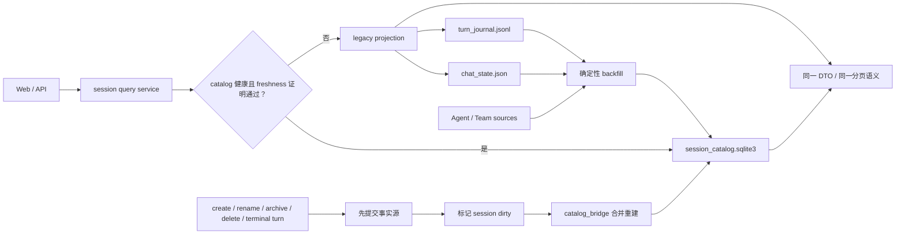
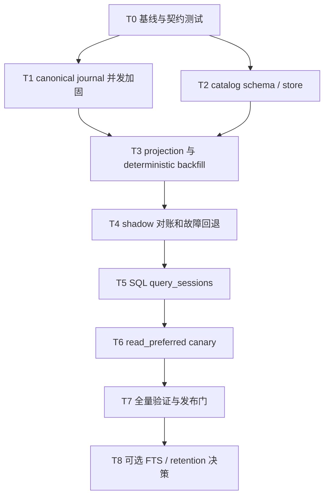

# Vibelution 会话存储混合适配方案

## 1. 决策摘要

- **决策：ADAPT，不照搬。**
- 保留 Vibelution 现有 `turn_journal.jsonl` 作为会话事件的唯一事实源。
- 保留 `chat_state.json` 作为会话元数据和当前选择状态的事实源；Agent 身份、团队关系和运行中状态继续由各自现有所有者负责。
- 新增一个可删除、可重建的 `session_catalog.sqlite3`，只承担会话列表、过滤、排序、分页、诊断和后续可选搜索的派生查询能力。
- 采用 Codex CLI 的“JSONL 事实流 + SQLite 目录索引”边界，吸收 Hermes 的 WAL、FTS5、谱系和迁移经验，以及 OpenCode 的显式 schema 版本、索引设计和稳定分页经验。
- v1 不把完整消息正文、reasoning、原始 tool output 或 prompt 复制进 SQLite；确有全文搜索需求时再进入单独的安全评审阶段。

该方案优先解决当前会话列表全量装载、Python 过滤/排序、短时内存缓存和多来源重建带来的扩展性问题，同时避免一次性把稳定的事件账本迁成数据库事实源。

## 2. 规划元数据

- **工作分类：** `HIGH_RISK`
- **执行路由：** `TASK_GRAPH`
- **建议工作方式：** BDD/TDD + migration gate + profile gate
- **当前状态：** plan-ready，未开始实现
- **当前规划 claim：** `claim-fa776f2ab123`
- **规划范围：** 会话事实账本加固、SQLite 派生目录、迁移/回退、服务读路径、诊断与测试
- **明确不在本轮直接实现：** 完整消息数据库化、向量检索、跨项目云同步、会话加密格式重写、现有 JSONL 清理
- **复用研究：** `C:\Users\Administrator\Desktop\Agent论文\search-results\2026-07-23-agent-session-storage-codex-hermes-opencode.md`

## 3. 目标与成功标准

### 3.1 目标

1. 会话历史在进程崩溃、SQLite 锁冲突、catalog 损坏时仍然可恢复。
2. 会话查询不再依赖每次构造完整 Python 列表后再过滤和分页。
3. 新旧读路径可以逐会话、逐环境对账，并能在一次请求内自动回退。
4. catalog 可以从事实源确定性重建；删除 catalog 不得造成用户会话丢失。
5. 多进程并发追加 JSONL 时不出现重复 sequence、交错重写或半行。
6. 诊断只记录有界元数据，不泄露消息、prompt、reasoning、tool output 或密钥。

### 3.2 发布门槛

- shadow 对账样本中会话集合、可见性、排序键、分页结果和生命周期状态 **零差异**。
- 并发子进程测试中 sequence 唯一且连续，所有 JSONL 行都可解析。
- catalog 被锁、只读、删除、损坏或 schema 不兼容时，请求自动退回 legacy 路径，事实写入不失败。
- 当前实际规模下 SQLite 路径 p95 不劣于 legacy 路径 10%；在 1,000 和 10,000 个合成会话下 p95 至少快 3 倍，或达到双方确认的等价绝对延迟预算。
- 所有 focused tests、相关回归测试和运行时场景验证通过。
- 只有在上述门槛通过后，operator config 才能从 `shadow` 切到 `read_preferred`。

## 4. 事实源与所有权

| 事实 | 唯一事实源 | 唯一写入者 | SQLite 中的状态 | 失效依据 |
| --- | --- | --- | --- | --- |
| 会话事件、turn 边界、可见消息 | `sessions/<session-id>/turn_journal.jsonl` | `core/chat/turn_journal.py` / `conversation_ledger.py` | 只存派生计数、最新 sequence、最新 turn 状态 | journal size、mtime、尾部 sequence、projection version |
| 会话标题、创建时间、归档状态、当前选择 | `chat/chat_state.json` | 现有 chat state transaction 和 session mutation 路径 | 复制为查询投影 | chat state signature |
| Agent 身份和团队关系 | Agent Directory / team workflow 现有事实源 | 对应领域服务 | 复制稳定外键和查询字段，或查询时补充 | registry/team signature |
| turn 正在运行、排队或中断 | 现有 runtime/turn lifecycle | 现有运行时服务 | 只作短期投影，不反向写事实源 | runtime generation / terminal event |
| 会话列表排序、过滤、分页结果 | 上述事实的投影 | `catalog_bridge` reconciler | catalog 的主要职责 | catalog source signature |
| catalog schema 和投影版本 | SQLite `catalog_meta` | migration/reconcile 代码 | 自身元数据 | schema/projection version |

红线：

- SQLite 不是第二份会话真相；任何代码不得只写 SQLite 而不先提交事实源。
- catalog 写失败不能令用户 turn 写入失败。
- catalog 行比事实源旧时不能对外返回；必须先回退 legacy 或完成对账。
- 删除、重建或隔离 catalog 不需要用户数据恢复流程。

## 5. 目标架构



### 5.1 新模块边界

1. `core/chat/session_catalog.py`
   - 路径路由、连接参数、schema migration、事务、upsert、查询、quick check 和隔离。
   - 不依赖 Web DTO，不读取运行时全局对象。

2. `core/web/services/session/catalog_bridge.py`
   - 从 chat state、Agent Directory、team source 和 journal 投影构造 catalog row。
   - 管理 source signature、dirty session、coalesced reconcile、shadow compare 和 legacy fallback。
   - 不拥有事实写入。

3. 现有 slice 模块
   - `conversation_index.py`：SQL 过滤、排序和分页入口。
   - `projection.py`：保持 DTO 兼容和 legacy 投影。
   - `session_ops.py`：启动预热、重建调度。
   - `events.py`：有界 runtime-scene 事件。
   - `agent_sessions.py`：仅在已有生命周期提交成功后发出 dirty/invalidate 信号。
   - `journal_bridge.py`：仅在 canonical append 成功后发出里程碑级 dirty 信号。

`session_service.py` 继续只是 facade；不得把 catalog 主体逻辑堆回 facade。

## 6. SQLite v1 设计

### 6.1 路径与连接

- 路径：通过 developer sandbox 路由到 `<workspace>/chat/session_catalog.sqlite3`。
- Python 标准库 `sqlite3`；复用项目中 usage ledger 和 launcher stores 的连接模式，不新增 ORM 或数据库依赖。
- 连接设置：
  - `PRAGMA journal_mode=WAL`
  - `PRAGMA synchronous=NORMAL`
  - `PRAGMA foreign_keys=ON`
  - `PRAGMA busy_timeout=5000`
- 写事务保持短小；reconcile 使用 `BEGIN IMMEDIATE`。
- 连接不得跨线程隐式共享；每个有界操作自己获取/关闭连接，或使用项目已验证的连接封装。

### 6.2 表

`catalog_meta`

| 字段 | 说明 |
| --- | --- |
| `key TEXT PRIMARY KEY` | 元数据键 |
| `value TEXT NOT NULL` | JSON 或标量字符串 |

至少保存：

- `schema_version`
- `projection_version`
- `active_generation`
- `source_signature`
- `last_reconciled_at`
- `last_quick_check_at`
- `last_reconcile_status`

`sessions`

| 字段 | 说明 |
| --- | --- |
| `generation_id INTEGER NOT NULL` | 有效投影代次 |
| `session_id TEXT NOT NULL` | 会话 ID |
| `title TEXT` | 标题投影 |
| `session_kind TEXT NOT NULL` | 普通、agent、team、child 等稳定枚举 |
| `visibility TEXT NOT NULL` | normal/hidden/archived 等 |
| `agent_id TEXT` | Agent 外键投影 |
| `team_id TEXT` | Team 外键投影 |
| `parent_session_id TEXT` | 谱系父会话 |
| `source_session_id TEXT` | fork/import 来源 |
| `workspace_path TEXT` | 规范化工作区标识；日志中不直接输出 |
| `created_at TEXT` | ISO 时间 |
| `updated_at TEXT` | 最后可见更新时间 |
| `last_active_at TEXT` | 排序用时间 |
| `last_turn_status TEXT` | 最新 turn 状态 |
| `open_turn_id TEXT` | 若有未结束 turn |
| `latest_sequence INTEGER NOT NULL` | 最新事件 sequence |
| `event_count INTEGER NOT NULL` | 事件计数 |
| `message_count INTEGER NOT NULL` | 可见消息计数 |
| `journal_rel_path TEXT` | 相对路径，不存任意绝对路径 |
| `journal_size INTEGER NOT NULL` | freshness 输入 |
| `journal_mtime_ns INTEGER NOT NULL` | freshness 输入 |
| `indexed_at TEXT NOT NULL` | 投影时间 |

主键为 `(generation_id, session_id)`。建议索引：

- `(generation_id, last_active_at DESC, session_id DESC)`
- `(generation_id, visibility, last_active_at DESC)`
- `(generation_id, session_kind, last_active_at DESC)`
- `(generation_id, agent_id, last_active_at DESC)`
- `(generation_id, team_id, last_active_at DESC)`
- `(generation_id, parent_session_id)`

`turns`

| 字段 | 说明 |
| --- | --- |
| `generation_id` / `session_id` / `turn_id` | 联合主键 |
| `status` | queued/running/completed/failed/interrupted |
| `first_sequence` / `last_sequence` | journal 定位 |
| `started_at` / `ended_at` | 时间投影 |
| `visible_message_count` | 有界计数 |

v1 的 `turns` 不存正文；它服务于谱系、恢复诊断和后续按 turn 增量重建。

### 6.3 代次切换

完整 backfill 不原地清空有效数据：

1. 在同一数据库中创建新 `generation_id`。
2. 把新投影写入该代次。
3. 校验唯一性、必填字段、计数、引用完整性和 source signature。
4. 在一个短事务内将 `catalog_meta.active_generation` 指向新代次。
5. 提交后异步清理旧代次。

任何失败都会保留旧代次；旧代次若不再 fresh，查询回退 legacy，而不是返回陈旧数据。

## 7. 一致性与写入策略

### 7.1 Canonical-first

所有 mutation 遵循：

1. 先在现有事实源完成提交。
2. 提交成功后标记受影响的 `session_id` 为 dirty。
3. reconciler 合并短时间内重复 dirty 信号。
4. SQLite 写失败只记录 degraded 状态；不得回滚已经成功的事实提交。

### 7.2 不按 token/delta 写 SQLite

下列事件触发 catalog 更新：

- session create、rename、archive、unarchive、delete
- agent/team bind 或 visibility 变化
- turn started
- turn terminal：completed、failed、interrupted
- 启动时 source signature 不匹配

流式 assistant delta、reasoning delta、tool output chunk 不逐条更新 catalog。它们仍追加 JSONL，catalog 在里程碑或请求前 freshness 检查时合并投影。

### 7.3 Freshness 证明

SQLite 读路径必须同时满足：

- schema version 可读；
- projection version 等于当前代码版本；
- `PRAGMA quick_check` 的最近一次结果为 `ok`；
- active generation 为 completed；
- chat state、Agent Directory、team source 的 signature 一致；
- 查询涉及的 journal signature 不比 catalog 更新。

无法证明 fresh 即视为 stale。stale 不等于损坏：先回退，后台重建。

### 7.4 并发安全先决条件

在引入 catalog 前先加固 canonical journal：

- 每个 session 使用独立跨进程锁文件；
- 锁内完成尾部 sequence 读取、下一 sequence 分配、单行 append、flush 和必要的 `fsync`；
- `rewrite_turn_events` 使用同一锁和唯一临时文件，flush/fsync 后 atomic replace；
- catalog 操作不得在持有 journal 锁时执行；
- 锁等待有明确超时和结构化错误，不能无限阻塞；
- 通过真实子进程测试覆盖 Windows 并发行为。

是否对每一个 delta 都 `fsync` 要在 profile 后决定。最低门槛是 turn 边界和终态事件必须 fsync；若合并刷盘，崩溃窗口必须被文档化并有恢复测试。

## 8. 读路径与兼容性

### 8.1 模式

在 `config/models.py` 增加 typed config：

```toml
[session_catalog]
mode = "off" # off | shadow | read_preferred
reconcile_on_startup = true
busy_timeout_ms = 5000
```

- `off`：完全使用现有路径；允许手工重建/诊断。
- `shadow`：对外仍返回 legacy 结果，后台运行 SQL 查询并比较。
- `read_preferred`：fresh 时返回 SQL 结果，否则在同一请求内回退 legacy。

不要把三态模式塞进现有 boolean feature gate。运行环境只允许把 operator 配置降级，不能越权从 `off` 提升到 `read_preferred`。

### 8.2 API 保持

- 首轮保持现有 session DTO、过滤字段、排序、cursor 语义和错误契约。
- `query_sessions()` 优先切到 SQL；`get_session_detail()` 继续从 JSONL/现有投影读取。
- 可在诊断响应或内部状态中增加：
  - `source: "catalog" | "legacy"`
  - `catalogStatus: "healthy" | "stale" | "degraded" | "disabled"`
  - `lastReconciledAt`
- 不要求前端为首次切流新增复杂 UI；运行日志和现有诊断面板先可见即可。

### 8.3 SQL 查询规则

- 所有过滤值参数化；禁止拼接 SQL。
- 排序字段使用白名单映射。
- 稳定排序始终追加 `session_id` 作为 tie-breaker。
- v1 保留当前 cursor 契约；若后续改为 keyset cursor，必须单独做 API 兼容迁移。
- visibility、agent/team 权限条件必须进入 SQL 或在 SQL 结果返回前执行等价且有测试的授权过滤，不能因分页后过滤导致数量和 cursor 漂移。

## 9. 迁移、故障检测与回滚

### 9.1 首次 backfill

1. 读取稳定的 chat state 快照和 Agent/Team signature。
2. 枚举已知会话，不把任意孤儿目录自动变成可见会话。
3. 对每个 journal 做容错读取；坏行按现有 ledger 规则隔离并记录计数。
4. 生成新 catalog generation。
5. 验证会话 ID 集合、visibility、排序键、最新 sequence、open turn 和计数。
6. 再次检查源 signature；期间有变化则丢弃该 generation 并重试。
7. 原子激活 generation。

孤儿 journal 只记录 `orphan_count` 和有界诊断，不出现在普通列表。后续恢复工具必须由用户或明确策略决定是否重新挂载。

### 9.2 Schema migration

- schema version 单调递增，每个迁移函数可重复检测但只执行一次。
- 迁移前保留旧 active generation；迁移失败则不启用新代码路径。
- 新代码只能读取明确支持的版本；未知更高版本必须 fail closed 到 legacy。
- v1 不导入任何外部 Codex/Hermes/OpenCode 数据文件。

### 9.3 故障分类

| 故障 | 检测 | 行为 | 恢复 |
| --- | --- | --- | --- |
| DB busy/locked | sqlite error / timeout | 当前请求回退 legacy，不隔离 DB | 后台重试，统计持续时间 |
| 只读或权限失败 | open/write error | 保持事实写入，catalog degraded | 修复权限后重建 |
| stale signature | freshness check | 回退 legacy | 合并 reconcile |
| schema 不支持 | version check | 禁止 SQL read | 迁移或回退版本 |
| `SQLITE_CORRUPT` / `NOTADB` | quick check / sqlite error code | 关闭连接并隔离 db/wal/shm | 新建空 catalog 并 backfill |
| reconcile 中源发生变化 | 双重 signature 检查 | 丢弃新 generation | 退避后重试 |
| canonical journal 写失败 | append/rewrite error | turn 写入失败并保留明确错误 | 不能用 SQLite 掩盖或补写 |
| shadow 结果不一致 | parity comparator | 不允许晋级 read_preferred | 保存有界差异类型并修复 |

隔离文件名使用 UTC 时间戳，例如 `session_catalog.sqlite3.corrupt-<utc>`。只有明确的 corruption/not-a-database 才隔离；普通锁冲突不得重命名数据库。

### 9.4 回滚

逻辑回滚只需把 operator config 改为 `shadow` 或 `off` 并 Launcher refresh：

- JSONL 和 chat state 始终完整，因此不需要反向数据迁移。
- 保留 catalog 文件用于诊断；除非确认损坏，不自动删除。
- 如果新 journal lock 导致回归，可回滚锁实现代码，但不得回滚已产生的 canonical events。
- 发布回滚不删除新 schema，旧代码必须忽略未知 catalog 文件。

授权门槛：

- 修改正式 operator config、Launcher refresh、删除/隔离非损坏 catalog、清理旧代次，均由实现任务按项目规则执行。
- 从 `shadow` 升到 `read_preferred` 需要性能、对账、故障注入和 runtime-scene 证据。
- 推送、PR、发布和版本文件更新仍需用户明确授权。

## 10. Runtime Scene 与可观测性

新增或复用以下有界事件：

- `session.catalog.init`
- `session.catalog.reconcile_started`
- `session.catalog.reconcile_completed`
- `session.catalog.reconcile_failed`
- `session.catalog.shadow_mismatch`
- `session.catalog.read_served`
- `session.catalog.fallback`
- `session.catalog.quarantined`

允许字段：

- mode、schemaVersion、projectionVersion、activeGeneration
- sourceSignature 的短 hash
- sessionCount、changedCount、orphanCount、badLineCount
- durationMs、fallbackReason、errorType、retryCount
- SQL/legacy 路径和分页参数的有界枚举/数值

禁止字段：

- session title、消息正文、prompt、reasoning、tool output
- API key、环境变量值、完整绝对路径
- SQL 参数中的用户文本或大块 diff

高频 `read_served` 需要采样或聚合，避免日志反过来成为性能问题。

## 11. 执行任务图



每个任务都必须单独 claim 精确文件范围；热文件有重叠时串行执行。

### T0：冻结兼容契约并建立基线

**依赖：** 无
**产物：**

- 为现有 `list_sessions()`、`query_sessions()`、visibility、排序、cursor 和 lifecycle 行为补契约测试。
- 生成 100/1,000/10,000 会话的合成 profile fixture。
- 记录当前实际数据量、legacy p50/p95、内存峰值、journal 扫描次数和 cache hit。

**主要文件：**

- `tests/test_session_service.py`
- `tests/test_web_session_routes.py`
- 新建 `tests/session_catalog_fixtures.py` 或等价测试 helper

**退出条件：** 当前行为和性能数据可复现，所有后续 parity 有固定 oracle。

### T1：加固 canonical journal

**依赖：** T0
**产物：**

- 在 `turn_journal.py` 引入每会话跨进程锁、原子 rewrite 和明确 flush/fsync 策略。
- 失败时保留原文件，不留下会被读取的半成品。
- 子进程并发 append/rewrite 测试覆盖 Windows。

**主要文件：**

- `core/chat/turn_journal.py`
- 可选新建 `core/infrastructure/file_lock.py`；只有两个以上领域需要复用时才抽取
- `tests/test_turn_journal.py`

**退出条件：** 多进程 sequence 唯一连续，kill/failure injection 后 JSONL 仍可解析和恢复。

### T2：实现最小 catalog store

**依赖：** T0
**产物：**

- 新建 `core/chat/session_catalog.py`。
- 实现路径路由、schema v1、连接设置、generation 事务、参数化查询、quick check、明确错误分类。
- typed config 仅接入 `off`/`shadow`，不启用生产 SQL read。

**主要文件：**

- `core/chat/session_catalog.py`
- `config/models.py`
- 对应 config loader/API tests
- 新建 `tests/test_session_catalog.py`

**退出条件：** schema/migration/idempotence/开发沙箱路由/锁冲突/损坏测试通过。

### T3：实现 projection 与 deterministic backfill

**依赖：** T1、T2
**产物：**

- 新建 `catalog_bridge.py`，从已有事实源构造 rows。
- 实现 source signature、dirty coalescing、startup reconcile、增量 reconcile 和 generation 激活。
- 明确处理 orphan、坏行、运行中 turn、删除和 Agent/Team 变化。

**主要文件：**

- `core/web/services/session/catalog_bridge.py`
- `core/web/services/session/session_ops.py`
- `core/web/services/session/journal_bridge.py`
- `core/web/services/session/agent_sessions.py`
- `core/web/services/session/events.py`
- `core/web/services/session/README.md`

**退出条件：** 删除 catalog 后能从事实源重建出相同投影；重建中源变化不会激活 stale generation。

### T4：shadow 对账与自动回退

**依赖：** T3
**产物：**

- legacy 为实际响应，catalog 并行产生候选结果。
- comparator 比较 ID、可见性、排序键、状态、分页和计数，不记录用户内容。
- 故障注入覆盖 locked、readonly、corrupt、unsupported schema、reconcile crash。

**主要文件：**

- `core/web/services/session/projection.py`
- `core/web/services/session/conversation_index.py`
- `core/web/services/session/events.py`
- `tests/test_session_service.py`
- `tests/test_web_session_routes.py`

**退出条件：** 全部 fixture 零 mismatch；所有 catalog 故障均返回正确 legacy 结果。

### T5：SQL 化 `query_sessions`

**依赖：** T4
**产物：**

- 把过滤、白名单排序和分页下推到 SQLite。
- 保持 API DTO、cursor 和授权语义。
- list cache 只缓存正确层级的结果，避免再缓存全量对象掩盖 stale catalog。

**主要文件：**

- `core/web/services/session/conversation_index.py`
- `core/web/services/session/list_cache.py`
- `core/web/services/session/projection.py`
- 相关 route/service tests

**退出条件：** SQL 与 legacy 契约一致，profile 达到晋级门槛。

### T6：`read_preferred` canary

**依赖：** T5
**产物：**

- typed config 支持 `read_preferred`，且配置解析 fail closed。
- fresh 证明失败时单请求内回退。
- 启动、切换、回退和 Launcher refresh 场景有 runtime-scene 证据。

**退出条件：** canary 期间无数据差异、无事实写入失败、fallback 原因可诊断。

### T7：集成、文档与发布门

**依赖：** T6
**产物：**

- 更新 conversation flow map、session slice README，并新增 ADR。
- 跑 focused suite、相关回归、local quality gate 和 Launcher runtime verification。
- 记录版本影响、回滚命令和 operator config 变更。

**主要文档：**

- `docs/agents/conversation-flow-map.md`
- `core/web/services/session/README.md`
- 新建 `docs/adr/0002-session-catalog-is-a-rebuildable-projection.md`
- 项目 memory 的相关 lane 更新

**退出条件：** release gate 全过，root main 状态和 project memory/claims 已收敛。

### T8：可选全文搜索与保留策略

**依赖：** T7，且必须有明确产品需求
**默认：** deferred

如果确需搜索：

- 先定义允许索引的可见内容类别和删除/reindex 语义。
- FTS5 只索引用户可见的 user/assistant 文本和安全工具名称/摘要。
- 不索引 reasoning、隐藏事件、原始 tool output、系统 prompt 或 secret-bearing metadata。
- 做 prompt-injection 隔离、内容归属、访问控制和删除测试。

没有这些安全契约，不创建 `session_fts` 表。

## 12. 测试矩阵

| 类别 | 必测场景 |
| --- | --- |
| Canonical durability | 并发 append、并发 rewrite、进程终止、尾部半行、重复 event id、sequence cache 失效 |
| Migration | 空库、已有库、重复启动、低版本升级、未知高版本、迁移中失败 |
| Backfill | 普通/agent/team/child/hidden/archived、orphan journal、坏 JSON 行、无 journal 会话 |
| Lifecycle | create、rename、select、archive、unarchive、delete、purge、fork、agent bind |
| Turn state | queued、running、completed、failed、interrupted、stale open turn |
| Query parity | filter、sort、stable tie-break、numeric cursor、page size、empty page、权限/visibility |
| Failure fallback | locked、timeout、readonly、disk full mock、corrupt、NOTADB、stale signature |
| Privacy | runtime logs 不含标题/正文/prompt/reasoning/tool output/绝对路径 |
| Performance | current、100、1k、10k 会话的 p50/p95、RSS、DB query count、reconcile duration |
| Routing | formal/developer workspace 分离，数据库不串环境 |

优先运行的测试文件：

- `tests/test_turn_journal.py`
- `tests/test_session_catalog.py`
- `tests/test_session_service.py`
- `tests/test_web_session_routes.py`
- `tests/test_multi_agent_conversations.py`
- `tests/test_agent_lifecycle_create_delete.py`
- 受改动影响的 config 和 runtime-scene tests

## 13. 文件变更预算

首轮实现建议控制为：

- 新增 2 个生产模块：`session_catalog.py`、`catalog_bridge.py`
- 新增 1 个核心测试模块：`test_session_catalog.py`
- 修改不超过 7 个既有生产模块，且 `session_service.py` 只允许 re-export
- 新增 1 个 ADR，更新 2 个已有说明文档
- 不新增第三方 Python/Node 依赖
- 不在首轮修改前端，除非现有诊断入口无法表达 catalog degraded 状态

如实现需要超出该预算，应先做结构复核，确认不是把消息存储、全文搜索或通用数据库框架偷带进 v1。

## 14. 集成、刷新与版本影响

- 普通实现必须在 `C:\Users\Administrator\Desktop\Vibelution-worktrees\<task-slug>` 的 `codex/<task-slug>` 分支完成，不能直接在 root main 开发。
- `projection.py`、`conversation_index.py`、`journal_bridge.py`、`agent_sessions.py`、`config/models.py` 属于需要精确 claim 的共享/热范围。
- 合并前检查 active claims、root main 状态、commit/diff、测试和 runtime scenes。
- 后端会话读写、配置和启动行为发生变化，Launcher refresh 在运行时验证前 **required**。
- **版本影响：minor candidate。** 新增持久化组件、typed rollout config 和诊断能力；最终是否升级版本由 release owner 在实际启用 `read_preferred` 时决定。本任务实现者不自行编辑 `VERSION`、`CHANGELOG.md` 或前端 package 版本。

## 15. 风险与控制

| 风险 | 控制 |
| --- | --- |
| 双写形成双事实源 | canonical-first；catalog 可删除；freshness 不通过即回退 |
| JSONL 多进程 sequence 冲突 | T1 必须先完成跨进程锁和原子 rewrite |
| SQLite 反而拖慢 turn | 不按 delta 更新；短事务；后台合并 reconcile |
| stale catalog 显示已删除/无权会话 | 全局与每会话 signature；授权过滤在分页前；stale fail closed |
| 损坏处理误删可恢复 DB | 仅 corruption/NOTADB 隔离；锁和权限问题只 degraded |
| FTS 泄露隐藏内容 | v1 不存正文；FTS 单独安全门 |
| 计划与现有 session hot-file 工作冲突 | 每任务重新 guard check/claim，按依赖串行合并 |
| 过度设计成通用数据库层 | stdlib sqlite3、会话领域专用模块、文件预算和 ADR 边界 |

## 16. 完成定义

只有同时满足以下条件，适配才算完成：

- canonical journal 并发与崩溃恢复通过；
- catalog 可从事实源完全重建；
- shadow 零差异；
- SQL 查询达到性能门槛；
- 所有故障均能自动回退且不影响事实写入；
- runtime scene 和文档足以解释当前读源、健康状态和回滚方法；
- Launcher runtime verification 通过；
- claims、project memory、版本影响和 main 集成状态已收敛；
- FTS 若未通过安全评审，明确保持 deferred。

下一步建议: 先执行 T0，冻结现有 `query_sessions()` 契约并建立 100/1,000/10,000 会话性能基线。
