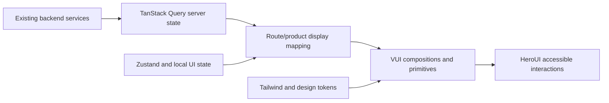

# HeroUI Frontend Unification Design

## Status Metadata

- **Status:** user-approved — converted into the Phase 1 implementation plan
- **Owner:** `codex-heroui-frontend-unification`
- **Claim:** `claim-1d2ef8a22871`
- **Branch:** `codex/heroui-frontend-unification`
- **Worktree:** `C:\Users\17533\Desktop\Vibelution-worktrees\heroui-frontend-unification`
- **Scope:** unify the complete desktop frontend through existing VUI/HeroUI/Tailwind ownership, with `AppShell + Chat` as the first implementation stage
- **Supersedes:** none
- **Implementation link:** `docs/superpowers/plans/2026-07-10-heroui-frontend-unification-phase-1.md`
- **Validation:** written-spec self-review, scoped Markdown/diff checks, then phase-specific frontend tests, builds, and browser evidence during implementation
- **Close condition:** satisfied on 2026-07-10 when the user approved the written design and it was converted into the bounded Phase 1 implementation plan

## Goal

Make the Vibelution desktop workbench easier to scan and operate while giving the product one coherent visual character.

The user-visible result is a stable desktop application that keeps its current routes, three-column Chat workspace, business workflows, and data contracts, while achieving these outcomes:

- buttons consistently fit their labels or use fixed square icon geometry;
- cards and panels communicate real hierarchy instead of forming nested card walls;
- explanatory prose is removed from primary operational surfaces unless it is critical;
- primary panels use a restrained soft-layer visual treatment with coherent radius, material, border, and shadow rules;
- loading, empty, error, disabled, busy, focus, and long-content states share one layout and interaction language;
- HeroUI remains the accessible interaction primitive layer behind project-owned VUI components;
- every migration phase remains runnable and independently verifiable.

## Confirmed User Decisions

The design conversation locked the following decisions:

1. Information clarity and operating efficiency take priority over decorative novelty.
2. The complete frontend is in scope, but delivery is phased rather than a single big-bang rewrite.
3. `AppShell + Chat` is the first implementation stage.
4. Existing macro layouts remain stable. Chat keeps its three-column desktop structure.
5. The main improvement target is button geometry, card/panel hierarchy, copy reduction, and visual consistency.
6. The visual direction is a restrained soft-layer system: the material quality of the selected soft-floating direction combined with the structural clarity of grouped operational cards.
7. Vibelution is treated as a desktop-only application. Mobile, touch, and phone drawer design are out of scope.
8. `1440×900` is the design baseline; `1280×720` must remain fully usable; narrower desktop windows may enter a compact desktop mode.

## Current Evidence

The current frontend already contains the correct reuse foundation:

- `@heroui/react` 3.2.1 is installed.
- Direct HeroUI imports are already concentrated in VUI wrappers such as `VButton`, `VChip`, `VTooltip`, `VInput`, `VSelect`, `VTextarea`, and `VCheckbox`.
- The frontend contains approximately 26 route entry components, 67 VUI TypeScript files, and 158 typed style maps.
- Existing VUI contract tests already protect import boundaries, theme foundations, primitives, forms, layout templates, native controls, CSS ownership, and legacy removal.
- Recent frontend rounds already fixed content-width buttons, route overflow, loading stability, compact density, and HeroUI/VUI boundaries on multiple routes.
- Rendered inspection at `1280×720` showed that the remaining problem is not missing HeroUI installation. It is uneven hierarchy: repeated bordered surfaces, competing card levels, verbose explanations, inconsistent action grouping, and route-specific visual decisions.

The reuse decision is therefore **ADAPT**:

- reuse the installed HeroUI package and existing VUI ownership layer;
- extend VUI instead of introducing route-level HeroUI imports;
- reuse current route layouts, query/state ownership, and layout tests;
- adapt existing tokens and typed style maps into one coherent hierarchy;
- do not run the HeroUI remote installer or replace npm/package-lock ownership;
- use official HeroUI agent documentation only as review input, generated to scratch when planning or implementation needs an API check.

## Non-Goals

- Do not redesign mobile or touch interfaces.
- Do not replace the stable three-column Chat workspace with a new navigation model.
- Do not rewrite the router or rename routes.
- Do not change backend APIs, DTOs, query keys, cache semantics, message protocols, permissions, or business state machines by default.
- Do not make HeroUI the owner of Agent, Team, memory, task, runtime, validation, or permission semantics.
- Do not add a second design system beside VUI.
- Do not replace npm, `package-lock.json`, Vite, Tailwind, or the Launcher build path.
- Do not remove all existing style maps in one migration.
- Do not hide errors, permission blockers, destructive consequences, or irreversible-operation warnings inside tooltips.
- Do not use large shadows, glass effects, rounded cards, or motion on every nested element merely to make the interface look softer.

## Design Principles

### 1. Operational hierarchy before decoration

Every surface must answer four questions without explanatory prose:

- What object is this?
- What state is it in?
- Which value matters now?
- What can the user do next?

Typography, spacing, alignment, grouping, and state treatment establish that hierarchy before borders, shadows, gradients, or motion are added.

### 2. Soft layers, not a card wall

The selected visual direction applies softness at meaningful hierarchy boundaries:

- the application shell;
- route-level workspaces;
- primary rails and panels;
- menus, popovers, drawers, and modal surfaces;
- a small number of independently actionable secondary groups.

Repeated records, metrics, settings, statuses, and tool actions should normally render as rows, strips, segmented controls, dividers, or compact groups inside those surfaces. A child receives its own bordered card only when it has an independent interaction, state boundary, or selection meaning.

### 3. One component owns one visual decision

Route code provides content and product state. VUI components decide geometry and product visual semantics. HeroUI provides accessible interaction behavior. Tailwind and typed style maps provide final styling.

### 4. Desktop density remains intentional

Soft material does not imply oversized controls or marketing-page spacing. Vibelution remains a dense desktop operations console with compact scanning, stable alignment, and bounded panels.

## Architecture

### Layer 1: visual foundation

The visual foundation owns:

- canvas, shell, panel, raised, overlay, input, selected, hover, and code surfaces;
- restrained elevation levels;
- control, panel, and overlay radii;
- text hierarchy and line-height;
- compact and comfortable control heights;
- spacing rhythm;
- focus rings;
- light/dark theme parity;
- bounded transitions and reduced-motion behavior.

Primary files are expected to remain under:

- `web/src/design/tokens.css`
- `web/src/design/heroui-theme.css`
- `web/src/design/tailwind.css`
- `web/src/design/workbench-shell.css`

The implementation should evolve existing tokens instead of creating route-specific token sets.

### Layer 2: VUI primitives

VUI primitives remain the only normal HeroUI import boundary. The first phase should review and extend the existing primitives rather than replacing them:

- `VButton`
- `VIconButton`
- `VChip`
- `VTooltip`
- `VInput`
- `VSelect`
- `VTextarea`
- `VCheckbox`
- `VSurface`
- `VPanel`

The primitive API must expose project-owned values such as `variant`, `tone`, `density`, and semantic slots. Routes must not receive package-specific styling responsibilities.

### Layer 3: workbench compositions

Shared compositions own repeated operational patterns:

- route headers;
- panel headers;
- toolbars and action groups;
- metric and status strips;
- filter/search rows;
- dense entity rows and tables;
- loading, empty, error, unavailable, disabled, and busy surfaces;
- confirmation dialogs and detail disclosures.

Existing components such as `VRouteHeader`, `VPanelHeader`, `VToolbar`, `VActionGroup`, `VStatusStrip`, `VStateSurface`, `VDenseTable`, and `VSplitWorkspace` should be adapted before a new composition is introduced.

### Layer 4: product pages

Routes compose VUI and product components, map domain state into product-owned display values, and retain data orchestration. They do not directly customize HeroUI internals or invent new visual state vocabularies.

## Source Of Truth

| Fact | Canonical source | Writer | Readers / derived surfaces | Refresh or invalidation | Old source cleanup |
| --- | --- | --- | --- | --- | --- |
| Visual tokens and elevation/radius rules | `web/src/design/tokens.css` and focused design CSS | visual foundation | VUI primitives, workbench compositions, typed route style maps | frontend rebuild and theme switch | migrate duplicated route literals during the phase that touches them |
| HeroUI interaction adaptation | `web/src/components/vui/**` | VUI primitive/component owner | product components and routes | normal React render | route-level HeroUI imports remain forbidden except a reviewed narrow exception |
| Product status/tone mapping | product-owned view models and route/domain helpers | owning product module | VUI component props | query/store updates | remove package-color or raw-status styling when the route is migrated |
| Server state | existing backend services and TanStack Query contracts | existing service/API owners | routes and product components | existing query invalidation | unchanged by this design |
| Local UI state | existing Zustand stores and component state | existing frontend state owners | shell, tabs, rails, drawers, panels | existing store transitions | unchanged unless a phase explicitly proves a UI-state need |
| Route composition | route and product component modules | route owner | rendered workbench | React render | retire duplicated wrappers and route-specific visual contracts incrementally |

## Visual System Contract

### Surfaces and elevation

- The page canvas is visually quiet and does not compete with content.
- Primary rails and workspaces use a soft, readable surface with one restrained elevation level.
- Menus, popovers, dialogs, and drawers may use a stronger elevation level.
- Inner rows and groups are generally flat. They use spacing, separators, subtle selected backgrounds, and type hierarchy.
- Transparency is allowed only when text remains readable over custom backgrounds. A solid readable fallback is required.
- A surface must not stack multiple visible shadow levels inside another raised surface without an independent overlay or interaction reason.

### Radius

- Controls use a consistent compact control radius.
- Primary panels use a consistent soft panel radius.
- Overlays may use a slightly stronger radius.
- Pills remain reserved for statuses, compact filters, and true pill-shaped controls.
- Arbitrary route-specific radius values should be migrated to shared tokens when their route is touched.

### Buttons

- Compact buttons use the existing `30px` class of control height; comfortable form/primary actions may use `34px`.
- Text buttons default to `width: fit-content`, stable horizontal padding, and no wrapping.
- Icon-only buttons use the same height and width, an accessible name, and a concise Tooltip.
- Each local action group should expose one primary action at most.
- Secondary, ghost, destructive, selected, disabled, and busy states must preserve geometry.
- Loading indicators, badges, and state labels must not resize the surrounding layout.
- Full-width buttons require an explicit semantic reason and are not normal inside desktop toolbars, cards, lists, or dense panels.

### Cards, panels, and rows

- A route normally has one page/workbench surface and a small number of primary panels.
- A bordered child card requires an independent interaction, selection, state, or ownership boundary.
- Repeated entities use dense rows, lists, or tables rather than independent floating cards.
- Metrics use strips or aligned metric cells rather than decorative dashboard cards when comparison is the task.
- Headers, filters, actions, and status belong near the object they control.
- Empty space must communicate hierarchy, not create marketing-style hero bands.

### Copy reduction

Primary operational surfaces retain only:

- object identity;
- current state;
- key value or count;
- next action;
- critical blocking information.

Supplemental explanation moves to:

- HeroUI/VUI Tooltip for local definitions and disabled reasons;
- details disclosure for multi-line context;
- a side panel, drawer, or modal for source, provenance, formulas, or history;
- help documentation for tutorial content.

Tooltips must work by hover and keyboard focus. They remain concise. Full errors, permission blockers, destructive consequences, and secret-handling warnings remain directly visible.

## AppShell Design

The AppShell keeps its current macro layout and organizes the top bar into three clear groups:

1. brand, version, and workspace identity;
2. high-frequency primary navigation;
3. system status summary and utility actions.

Low-frequency tools remain in the existing utility menu. Theme, refresh, lifecycle, and configuration actions use consistent icon-button geometry and tooltips. The system status chip remains visible but does not compete with the primary navigation.

The shell must reserve dimensions for changing status content, avoid label-driven width jumps, preserve keyboard reachability, and maintain light/dark theme parity.

## Chat Design

Chat keeps the stable three-column desktop model:

- left: session search, creation, grouping, and index;
- center: session tabs, conversation transcript, active progress, and composer;
- right: current session, modes, token/context facts, mind state, pet/Agent state, and related operational context.

The first phase changes visual organization rather than product behavior:

- each rail receives one clear header/action hierarchy;
- repeated right-rail facts become aligned rows, strips, or compact groups;
- mode controls use the correct control type instead of generic button pills where practical;
- verbose status explanation moves to tooltips or details;
- the conversation rail remains the dominant visual surface;
- running, failed, degraded, and blocking states remain directly distinguishable;
- resize and collapse handles retain their current behavior but use coherent geometry and focus states.

## Desktop Window Contract

- `1440×900` is the reference design viewport.
- `1280×720` is the minimum fully supported validation viewport.
- `1920×1080` validates wide-screen spacing and maximum-width behavior.
- At and above `1280px`, the three Chat columns remain available.
- Below `1280px`, compact desktop mode may collapse the right status rail by default while preserving an explicit reopen control. The session rail and central conversation remain available.
- No phone, touch, or mobile drawer contract is added.
- Existing mobile compatibility code is not removed merely because it is out of scope; it is left untouched unless it blocks the desktop implementation.
- Normal desktop resizing must not create page-level horizontal scrolling, clipped actions, or fixed controls covering content.

## Data Flow

The design does not introduce a new state path:

Business state is mapped into project-owned tone, intent, and status values before it reaches VUI. HeroUI props do not become a second source of truth.

## State And Error Design

### Loading

- Reserve the final panel, list, toolbar, and action dimensions.
- Prefer skeletons or stable placeholders inside the actual destination layout.
- Do not replace the whole route with a large empty loading canvas when shell and section structure are already known.

### Empty

- State why the surface is empty.
- Provide one recommended next action when an action exists.
- Avoid tutorial prose and multiple competing calls to action.

### Error and unavailable

- Identify the failed scope and user impact.
- Preserve usable adjacent data when it is trustworthy.
- Provide a retry or recovery action when available.
- Label fallback, partial, degraded, or unavailable states honestly.

### Disabled and busy

- Preserve button geometry.
- Keep directly visible blockers visible when the action cannot proceed.
- Use a Tooltip for concise local disabled reasons.
- Prevent duplicate actions without replacing stable labels with layout-shifting text.

### Destructive actions

- Keep destructive actions visually separated from primary actions.
- Preserve existing confirmation and backend convergence semantics.
- Show irreversible consequences directly rather than hiding them in a Tooltip.

## Delivery Phases

### Phase 1: foundation, AppShell, and Chat

- converge tokens, elevation, radius, button, panel, row, Tooltip, and state contracts;
- update the AppShell visual/action hierarchy;
- migrate the Chat three-column surfaces without changing transport or business behavior;
- establish focused component and route validation that later phases reuse.

### Phase 2: Agent, Teams, and Memory

- apply the shared foundation to the densest management surfaces;
- replace nested card walls with rows, strips, tables, and independently meaningful panels;
- preserve lifecycle, source-of-truth, optimistic state, and permission behavior.

### Phase 3: Evolution and operational routes

- migrate Evolution, Config, Kernel, Logs, Git, and Usage;
- preserve workflow, diagnostics, config source, and runtime semantics;
- serialize any changes to shared DTOs, query keys, or hot dictionary files if they become necessary.

### Phase 4: remaining routes and reconciliation

- migrate remaining Pet, Reset, Research, Skills, Tools, Prompt, review, and legacy-adjacent surfaces;
- remove superseded visual contracts and duplicated style rules;
- run the cross-route consistency review and final desktop evidence pass.

Each phase requires its own implementation plan or bounded plan section, exact guard claim, scoped diff review, validation evidence, and completion decision. Later phases must reuse the proven foundation rather than redesigning it.

## Testing And Visual Verification

### Component contracts

- keep `vuiImportBoundary` protection passing;
- extend VUI primitive tests for content-width buttons, icon geometry, disabled/busy stability, accessible naming, and Tooltip reachability;
- test surface/radius/elevation ownership through focused class and rendering contracts;
- avoid tests that merely restate mocked HeroUI implementation details.

### Route tests

- update focused AppShell and Chat layout tests for action grouping, stable rails, compact desktop mode, and loading/error/empty structures;
- preserve existing stream, cache, composer, timeline, resize, and session behavior tests;
- add only the smallest route-specific assertions needed to prevent regression into stretched buttons, nested card walls, or permanent explanatory copy.

### Build and browser evidence

Every user-visible implementation phase requires:

- the narrowest relevant Vitest suite;
- `npm --prefix web run build`;
- scoped `git diff --check`;
- rendered checks at `1280×720`, `1440×900`, and `1920×1080`;
- light and dark theme inspection;
- longest realistic Chinese and English labels;
- normal, hover/focus, disabled, loading, empty, error, busy, and long-content states where relevant;
- page-level horizontal-overflow and overlap inspection;
- browser console error review.

No mobile screenshot gate is required for this desktop-only design.

## Logging, Launcher, Memory, And Version Decisions

- **Logging:** visual-only layout and styling changes do not add runtime-scene logs. If a phase changes an action, failure branch, state transition, or runtime behavior, that phase must add or justify the matching bounded logging and behavioral tests.
- **Launcher:** frontend implementation requires a Launcher refresh decision. Refresh is recommended before user visual acceptance and required before release/runtime verification, subject to active-work guards.
- **Project memory:** this design document alone does not change durable runtime state. Each implementation phase must update or propose the `web-workbench-surface` lane when its durable status changes.
- **Version:** the design-document commit has version impact `none`. A completed coherent frontend unification is expected to recommend a compatible `minor` version impact; individual localized migration phases may be `patch` until the unified capability is complete.
- **Developer mode:** visual contracts should preserve parity between developer and formal modes unless a route is provably unreachable in one mode. Any intentional divergence must be recorded in that phase.

## Risks And Mitigations

- **Risk: soft layers reduce density.** Limit elevation and rounded surfaces to meaningful hierarchy boundaries; keep repeated content flat and compact.
- **Risk: visual migration changes business behavior accidentally.** Preserve API, query, store, route, and domain contracts; review behavior tests before editing each route.
- **Risk: route-local styles continue to drift.** Move reusable geometry and state rules into VUI/tokens; keep route style maps narrow and typed.
- **Risk: copy reduction hides important information.** Keep critical failures, permission blockers, destructive consequences, and recovery actions directly visible.
- **Risk: shared hot-file conflict.** Check and claim `web/src/i18n/dictionary.ts`, shared DTOs, or cross-route contracts before any phase that touches them; use scoped staging and explicit reconciliation.
- **Risk: large multi-route diff becomes unverifiable.** Commit and validate one migration phase at a time; do not start the next phase until current evidence is fresh.
- **Risk: existing custom backgrounds reduce readability.** Require solid readable fallbacks and verify light/dark/custom-background contrast on affected routes.

## Recovery Strategy

- Keep each phase in a scoped worktree and commit independently.
- Preserve existing product state and transport contracts so visual phases remain reversible.
- If a new VUI contract causes cross-route regressions, restore the previous primitive contract within the task branch and defer the affected route instead of adding route-specific exceptions.
- Do not keep compatibility aliases or duplicate VUI paths indefinitely. Any temporary adapter must name its owner and removal trigger in the implementation plan.

## Completion Criteria

The complete frontend-unification program is done only when:

- all in-scope desktop routes use the shared visual foundation and VUI ownership model;
- route code does not add unreviewed direct HeroUI imports;
- buttons, icon actions, panels, rows, metrics, and status surfaces follow the shared geometry contract;
- explanatory prose is removed from primary operational surfaces without hiding critical information;
- AppShell and Chat preserve their existing macro layout and business behavior;
- normal and boundary states remain stable at `1280×720`, `1440×900`, and `1920×1080`;
- focused tests, production build, browser evidence, console checks, and scoped diff review pass for every phase;
- Launcher refresh, project memory, developer-mode parity, and version impact decisions are recorded;
- superseded visual contracts and temporary migration adapters have been removed or have an explicit bounded follow-up.

The first implementation plan should cover only Phase 1: visual foundation, AppShell, and Chat. Later route groups should receive their own bounded plan sections or follow-up plans after Phase 1 is validated.
