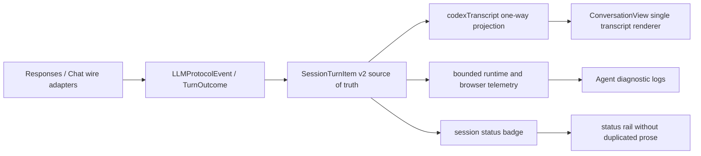

# Codex 对话前端对齐设计

日期：2026-07-13  
状态：待用户审查  
任务等级：`HIGH_RISK`，原因是同时涉及共享 DTO、会话终态投影、流式 active layer、热文件 `ConversationView.tsx`、工作台布局和用户可见错误行为。

## 1. 目标

让 Chat/Coding 前端以一个有序、可追踪的 canonical transcript 展示完整回合，并达到以下用户可观察结果：

- `commentary -> reasoning/tool/status -> final_answer` 保持原始顺序和不同视觉层级。
- provider、配置、网络、中断和超时失败只在主对话中展示一个错误单元。
- 完整诊断仍保留在折叠详情和 Agent 可分析日志中，不因前端降噪而丢失。
- 完成态工具默认折叠，最终回答成为回合内最高视觉权重内容。
- 桌面端对话是主区域；窄屏端不再保留不可用的桌面三栏最小宽度。
- `390px` 视口可完整阅读、滚动、输入和展开详情，页面不存在横向溢出。

## 2. 已确认事实

- `SessionTurnItem[]` 已包含 `channel`、`phase`、`provisional`、`terminal`、`diagnosticSummary` 和 `metadata`，足以表达 canonical v2 链路。
- 当前 `chatTurnProtocol.ts` 已让 canonical v2 优先于 native transcript 和 legacy delta。
- 当前 canonical transcript 转换会把 final 写成 `markdown`，但 DTO、`visibleNativeAssistantMarkdownText` 和 native renderer 使用 `text`。
- 当前 commentary 被降格为普通 `status` cell，导致 commentary 与运行状态无法稳定区分。
- provider 失败消息可以持久化为 `turn_error`，但当前可见失败路径没有稳定生成 terminal canonical error item。
- `ConversationView` 可以同时渲染回答正文、`turnErrorNotice` 和诊断行；`ChatCodingRoute` 的状态栏还能再次展示相同错误正文。
- native tool detail 使用 `<details open>`，完成工具默认展开。
- 当前窄屏布局仍保留至少 `260px` 会话栏和 `420px` 正文栏，`390px` 实测不可用。
- 现有统一协议设计明确规定 `SessionTurnItem[]` 是 UI item source，`codexTranscript` 是单向派生兼容投影，不得成为第二份事实源。

## 3. 范围

本轮包含：

- 修复 canonical turn item 到 transcript cell 的字段映射。
- 为 terminal error 建立 canonical item 和唯一可见投影。
- 保留 commentary、reasoning、tool、status、error、final 的顺序和视觉语义。
- 收敛回答正文、错误卡片和状态栏之间的重复所有权。
- 调整工具、思考、错误详情的默认展开策略。
- 调整 Chat/Coding 三栏信息层级和响应式行为。
- 修复 Chat 页面在移动视口中的 AppShell 导航溢出。
- 增加有界日志字段、行为测试、构建检查、Launcher 刷新决策和截图验收。

本轮不包含：

- 不改变 Responses、Chat Completions、Hermes 或其他 wire adapter 的标准请求与响应协议。
- 不重写 `agent.py`、工具业务逻辑、审批策略、会话存储格式或历史事件日志。
- 不删除 legacy history 兼容读取。
- 不展示 raw reasoning。
- 不复制 Codex TUI 或未公开的 Codex Desktop React 组件。
- 不对连续历史错误做跨回合聚合；每个回合仍独立可追踪，只压缩单回合视觉高度。
- 不在本轮修改 provider 配置、模型配置、API Key 或运行环境。
- 不顺手重构整个 `ConversationView.tsx` 或 `ChatCodingRoute.tsx`。

## 4. 推荐路径与备选方案

| 方案 | 做法 | 优点 | 风险 | 结论 |
| --- | --- | --- | --- | --- |
| A：canonical item 驱动，两阶段落地 | 先修 item/cell/错误所有权，再修视觉层级和响应式 | 根因明确，兼容现有架构，可分阶段回滚 | 需要跨 Python、DTO、React 串行修改 | 推荐 |
| B：仅前端隐藏重复内容 | 保留现有数据链，只在 JSX 中去重 | 文件少，见效快 | provider 失败仍绕过 canonical transcript，后续继续分叉 | 拒绝 |
| C：整体替换 ConversationView | 新建全新 transcript 页面并迁移 | 视觉自由度高 | 双系统、迁移面过大、热文件风险和回归风险最高 | 拒绝 |

复用决策：`ADAPT + REFERENCE_ONLY`。

- 适配本项目已有 `SessionTurnItem[]`、`codexTranscript`、SSE router、active layer 和 browser telemetry。
- 参考本地 OpenAI Codex 的单一有序 item stream、delta/final 合并、紧凑工具行和单错误单元规则。
- 不复制 Codex 源码，因此本轮不新增第三方许可证文件。

## 5. 目标架构



所有权规则：

- Wire adapter 只负责各自标准协议。
- `SessionTurnItem[]` 负责 item 身份、顺序、channel、phase、status 和 terminal 语义。
- `codexTranscript` 只负责向现有 transcript renderer 提供一份派生视图。
- `ConversationView` 是对话正文的唯一可见所有者。
- `ChatCodingRoute` 状态栏只显示状态、短代码和入口，不重复对话正文。
- `message.content` 和 `lastTurnError` 只承担旧历史兼容；canonical cells 存在时不得再次成为正文所有者。

## 6. Canonical 数据契约

### 6.1 `SessionTurnItem[]`

保留现有 v2 结构，不新建平行 DTO。terminal error 使用已有字段表达：

| 字段 | terminal error 值 |
| --- | --- |
| `version` | `2` |
| `type` / `kind` | `error` |
| `status` | `failed` |
| `terminal` | `true` |
| `provisional` | `false` |
| `text` | 经过清洗的用户可见错误摘要 |
| `diagnosticSummary` | 有界的 `reasonCode/httpStatus/providerErrorType/retryable` 等字段 |
| `metadata` | 仅保留关联用 `turnId/traceId/provider/model` 等有界字段 |

raw provider error 仍只写入运行日志，不进入前端 DTO。

### 6.2 `CodexTranscriptCell`

`text` 成为唯一 canonical 文本字段。迁移期读取器可以兼容历史 `markdown`，但所有新生产者必须只写 `text`。

在现有 cell 上增加以下派生字段，不增加第二套 cell 类型：

| 字段 | 用途 |
| --- | --- |
| `channel` | 区分 `commentary/analysis/answer/tool/status` |
| `phase` | 区分 `commentary/reasoning/tool_call/final_answer/turn_failed` |
| `terminal` | 标记回合终态 |
| `provisional` | 防止 provisional 文本被提升为最终回答 |
| `diagnosticSummary` | 为折叠诊断详情提供有界数据 |

### 6.3 映射规则

| SessionTurnItem | transcript cell | 可见行为 |
| --- | --- | --- |
| `assistant_message + commentary` | `assistant_markdown`，保留 commentary phase | 工具前短说明，弱于 final，强于内部 status |
| `reasoning + analysis` | `reasoning_summary` | 只显示安全摘要，默认折叠 |
| `tool_call` | `tool_call` | 运行中可见，完成后默认折叠 |
| runtime `status` | `status` | 只显示有用户价值的状态；内部 pipeline 状态继续过滤 |
| `error` | `error_notice` | 单一错误行，terminal，可展开诊断 |
| `assistant_message + answer + final_answer` | `assistant_markdown`，保留 final phase | 唯一最终回答，最高视觉权重 |

### 6.4 兼容规则

- canonical v2 items 存在时，canonical v2 始终优先。
- 只有旧历史没有 v2 items 时才读取原有 native transcript。
- 只有 native transcript 也不存在时才进入 legacy assistant delta/process fallback。
- canonical terminal error 存在时，`message.content`、`turnErrorNotice` 和页面级 `lastTurnError` 不得重复渲染。
- 旧历史 `markdown` 兼容只存在于 normalization boundary，不允许继续向下游传播。

## 7. 前端展示设计

### 7.1 回合层级

| 内容 | 视觉层级 | 默认状态 |
| --- | --- | --- |
| 用户消息 | 右侧紧凑气泡 | 展开 |
| commentary | 左侧低装饰短行 | 展开 |
| reasoning summary | 次级 disclosure | 折叠 |
| 运行中 tool/status | 单行活动状态 | 展开当前项 |
| 完成 tool | 单行完成记录 | 详情折叠 |
| final answer | 无重卡片的主 Markdown 正文 | 展开 |
| terminal error | 单行错误摘要和操作 | 诊断折叠 |

最终回答与 commentary 使用相同 Markdown 能力，但必须通过 `phase` 使用不同样式和间距。

### 7.2 错误单元

主对话示例：

```text
上游服务暂不可用 · HTTP 502                 [重试] [诊断详情]
```

诊断详情默认关闭，可展示：

- 原因代码。
- HTTP 状态。
- provider error type。
- provider/model 标识。
- `turnId` 和 `traceId`。
- 日志分析入口。

状态栏只显示 `失败 · 502` 或 `失败 · upstream_unavailable`，不显示完整错误句子。

### 7.3 工具和思考

- `<details>` 不再默认 `open`。
- 运行中的当前工具可展示一行摘要、状态和时长。
- 完成、失败、取消后的详情都默认折叠。
- reasoning 只展示安全 summary，不展示 raw reasoning 或 provider-private payload。
- 同一个 item revision 替换原单元，不新增重复行。

### 7.4 身份与消息头

- Agent 名称和头像保留，作为 Vibelution 的产品身份。
- 用户名称不得直接显示纯数字内部 ID；无有效名称时显示 `操作者`。
- 时间戳弱化，编辑重发入口只在可操作的最新用户消息上出现。

## 8. 响应式布局契约

| 视口 | 会话索引 | 状态检查器 | 对话区 | AppShell |
| --- | --- | --- | --- | --- |
| `>=1280px` | 默认可见，宽 `260-300px` | 默认收起，可手动打开 | 居中主区域，最小可读宽度 `640px` | 完整导航 |
| `960-1279px` | 默认可见，宽约 `248px` | overlay drawer | 占剩余宽度 | 完整或紧凑导航 |
| `<960px` | overlay drawer，默认关闭 | overlay drawer，默认关闭 | `100%` 宽 | 紧凑导航 |
| `<640px` | overlay drawer | overlay drawer | `100%` 宽，composer 固定底部 | 主导航进入菜单，不横向滚动 |

响应式状态规则：

- 自动响应式收起是 derived layout state，不能覆盖用户在宽屏保存的折叠偏好。
- overlay 打开时需要遮罩、焦点约束、Escape 关闭和明确 `aria-expanded/aria-controls`。
- 页面、主区域、时间线和 composer 均不得产生视口级横向滚动。
- 长代码、URL、provider 名称只允许在内容容器内部滚动或换行。

## 9. 逐文件影响面

### 9.1 Canonical 链路和错误终态

| 文件 | 计划修改 |
| --- | --- |
| `core/web/services/session_service.py` | 在 provider/配置/网络等 terminal failure 持久化和 detail projection 中产生 canonical v2 error item；继续保留清洗后的兼容 `message.content`；不把 raw provider error 放入 DTO。 |
| `tests/test_session_codex_transcript_projection.py` | 增加 terminal error item、error cell、channel/phase 保留、`text` 字段和 canonical 优先级用例。 |
| `tests/test_provider_error_recovery.py` | 证明 provider 失败只产生一个 terminal error owner，partial reply 不会成为 final，诊断有界且 raw error 仍只在日志。 |
| `tests/test_session_detail_contract.py` | 证明窗口化 detail 和重启恢复仍携带 canonical error item，并保持旧历史兼容。 |
| `web/src/api/types/chat.ts` | 为 `CodexTranscriptCell` 增加 `channel/phase/terminal/provisional/diagnosticSummary`；明确 `text` 为 canonical 字段。 |
| `web/src/routes/chatTurnProtocol.ts` | 把 canonical cells 的 `markdown` 改为 `text`；保留 channel/phase；commentary 不再映射为普通 status；映射 terminal error；final 仍是 `content` 的唯一来源。 |
| `web/src/routes/chatTurnProtocol.test.ts` | 把现有 `markdown` 断言改为 `text`；覆盖 commentary/tool/error/final 顺序及单 final owner。 |
| `web/src/routes/chatSessionStreamProtocol.ts` | 保持纯 SSE router；扩展有界 trace 统计，记录 canonical item/cell 类型数量和 terminal error 是否存在，不记录正文。 |
| `web/src/routes/chatSessionStreamProtocol.test.ts` | 覆盖 terminal error 路由和新增有界 trace 字段。 |
| `web/src/routes/chatActiveTurnLayer.ts` | 保留 commentary/error item revision；terminal error 可结算 active layer；process-only item 仍不得错误结算。 |
| `web/src/routes/chatActiveTurnLayer.test.ts` | 覆盖 commentary -> tool -> error、commentary -> tool -> final 和 reconnect revision 替换。 |
| `web/src/components/conversation/codexNativeTranscriptSurface.ts` | normalization boundary 兼容旧 `markdown`，内部统一为 `text`；terminal error cell 抑制 legacy response/status/error 投影。 |
| `web/src/components/conversation/codexNativeTranscriptSurface.test.ts` | 覆盖旧 `markdown` 兼容、新 `text` 生产、terminal error suppression 和 projection gap。 |
| `web/src/components/conversation/ConversationView.tsx` | 让 transcript cells 成为唯一正文；canonical error cell 存在时不再渲染重复 response/turnErrorNotice；final/commentary 使用 phase-specific branch；工具详情默认关闭。 |
| `web/src/components/conversation/ConversationView.nativeTranscript.test.tsx` | 增加 provider error 单一可见 owner、commentary/tool/final 顺序、默认折叠和旧历史 fallback 用例。 |
| `web/src/components/conversation/ConversationView.test.tsx` | 保留页面级 `lastTurnError` 仅作为无 canonical message 时的 fallback，并证明不会与 message error 共存。 |
| `web/src/components/conversation/conversationTurnErrorPresentation.ts` | 继续负责有界诊断字段格式化，但不再决定第二份可见错误正文。 |
| `web/src/components/conversation/conversationTurnErrorPresentation.test.ts` | 覆盖折叠详情字段、缺失字段和安全文本边界。 |
| `web/src/routes/ChatCodingRoute.tsx` | 状态栏错误改为短状态；复用现有 stream/render telemetry 增加 bounded transcript 字段；不得记录正文。 |

### 9.2 视觉层级和响应式

| 文件 | 计划修改 |
| --- | --- |
| `web/src/components/conversation/ConversationView.styles.ts` | 建立 commentary、final、tool、error 的明确视觉层级；控制正文宽度、间距、长内容换行和移动 composer。 |
| `web/src/components/conversation/AgentMessageTurnView.tsx` | 保持回合骨架，压缩 header；避免内部数字 ID 成为可见用户名称。 |
| `web/src/components/conversation/AgentMessageTurnView.styles.ts` | 弱化元信息和装饰，确保内容区优先。 |
| `web/src/routes/ChatCodingRoute.tsx` | 将 status inspector 默认状态和 responsive drawer 状态分离；不覆盖宽屏用户偏好；给左右 drawer 增加可访问控制。 |
| `web/src/routes/ChatCodingRoute.styles.ts` | 移除窄屏 `260px + 420px` 强制网格；实现 wide/two-column/drawer/full-width 四级布局。 |
| `web/src/routes/ChatCodingRoute.layout.test.ts` | 删除锁定错误最小宽度的断言；增加 `1280/1024/768/390` 结构契约、drawer 和无横向溢出锚点。 |
| `web/src/routes/ChatCodingLeftStatus.layout.test.ts` | 保证状态栏短状态不重新扩张为长错误正文。 |
| `web/src/app/AppShell.tsx` | 在 `<640px` 提供紧凑主导航入口，保留当前桌面导航行为。 |
| `web/src/app/AppShell.styles.ts` | 防止顶部栏和主导航横向溢出，确保 chat 主区域获得完整视口宽度。 |
| `web/src/app/AppShell.layout.test.ts` | 覆盖移动导航折叠和桌面导航不回归。 |

明确不改：

- `core/llm/protocols/*` 和 provider wire adapter。
- `agent.py` 的工具循环与业务完成逻辑。
- provider/model 配置文件。
- 会话存储 schema 和历史事件格式。
- `ConversationIndexTree.tsx` 的数据模型；它只被放入 drawer，不在本轮重构。
- `VERSION`、`CHANGELOG.md`、`web/package.json` 和 `web/package-lock.json`。

## 10. 日志与 Agent 排查契约

后端继续复用 canonical item/outcome 日志，不新增逐 delta 日志。需要保证以下事件可关联同一回合：

- `llm.protocol.item_finalized`
- `llm.turn_outcome.finalized`
- provider failure runtime-scene event

前端复用现有事件：

- `browser.session_stream.assistant_delta_applied`
- `browser.conversation_stream.frame_painted`

新增或补齐的有界字段：

- `turnRenderProtocol`
- `turnId`
- `itemCount`
- `finalAnswerItemCount`
- `commentaryItemCount`
- `toolItemCount`
- `terminalErrorItemCount`
- `projectionGapReason`

禁止记录：

- 用户正文。
- assistant 正文。
- raw reasoning。
- 工具完整参数或输出。
- provider raw payload。
- API Key、Authorization 或 replay blob。

## 11. 验证策略

### 11.1 后端聚焦验证

```powershell
C:\Users\17533\Desktop\Vibelution\.venv\Scripts\python.exe -m pytest tests/test_session_codex_transcript_projection.py tests/test_provider_error_recovery.py tests/test_session_detail_contract.py -q
```

必须证明：

- canonical final 只出现一次。
- commentary 不能完成回合。
- terminal error 可以完成失败回合且不产生 final answer。
- provider 诊断经过清洗并可由日志关联。
- 旧历史仍能加载。

### 11.2 前端聚焦验证

```powershell
npm --prefix web test -- src/routes/chatTurnProtocol.test.ts src/routes/chatSessionStreamProtocol.test.ts src/routes/chatActiveTurnLayer.test.ts src/components/conversation/codexNativeTranscriptSurface.test.ts src/components/conversation/ConversationView.nativeTranscript.test.tsx src/components/conversation/ConversationView.test.tsx src/components/conversation/conversationTurnErrorPresentation.test.ts src/routes/ChatCodingRoute.layout.test.ts src/routes/ChatCodingLeftStatus.layout.test.ts src/app/AppShell.layout.test.ts
```

必须证明：

- producer 写 `text`，旧 `markdown` 只在 normalization boundary 被读取。
- cell 顺序为 commentary/reasoning/tool/status/error/final 的原始顺序。
- error 与 final 互斥为 terminal visible owner。
- native/canonical 存在时 legacy response、process 和 error notice 不重复。
- active layer 在 reconnect/revision replacement 后不重复。
- tool/error details 默认关闭并可键盘展开。

### 11.3 构建

```powershell
npm --prefix web run build
```

### 11.4 Launcher 与运行时

前端、API DTO 和 session projection 都会变化，因此用户手工验收前必须通过 Launcher refresh。存在活动任务时停止并报告：

```text
有进行中的任务，无法重启 Vibelution。请等待任务完成或先停止任务。
```

## 12. 截图验收规范

所有截图使用同一测试会话数据，禁止用不同内容掩盖布局差异。截图前记录 viewport、主题、sessionId、turnId、模型和场景编号，但不记录正文或密钥。

| 编号 | 文件名 | 视口 | 场景 | 必须满足 |
| --- | --- | --- | --- | --- |
| S1 | `01-wide-canonical-chain-1440x900.png` | `1440x900` | commentary -> reasoning -> 两个工具 -> final | 左侧索引可见；状态检查器默认收起；final 最突出；完成工具折叠；一屏可看到链路主干 |
| S2 | `02-desktop-provider-error-1280x720.png` | `1280x720` | HTTP 502 provider failure | 主对话错误摘要只出现一次；状态栏不重复正文；诊断默认关闭；composer 可见 |
| S3 | `03-compact-desktop-1024x768.png` | `1024x768` | 正常长回答和代码块 | 对话区可读；状态检查器为 drawer；代码块只在自身内部滚动；无页面横向滚动 |
| S4 | `04-tablet-drawers-768x1024.png` | `768x1024` | 打开会话 drawer | drawer 有遮罩；正文不被永久压缩；关闭后对话恢复全宽；顶部导航不溢出 |
| S5 | `05-mobile-canonical-chain-390x844.png` | `390x844` | commentary -> tool -> final | 两侧栏默认关闭；对话和 composer 全宽；工具可展开；无裁切和横向滚动 |
| S6 | `06-mobile-provider-error-390x844.png` | `390x844` | provider failure | 单错误摘要、重试和详情按钮可触达；诊断展开后仍不突破视口 |
| S7 | `07-streaming-tool-1280x720.png` | `1280x720` | 工具运行中并持续输出 | 只有当前工具显示活动状态；历史完成工具保持折叠；没有重复 stream tail 或 final |

每个场景同时保存 DOM/语义证据：

- `document.documentElement.scrollWidth <= window.innerWidth`。
- `data-codex-transcript-cell-kind` 顺序符合输入 items。
- final answer 文本节点计数为 `1`。
- terminal error 摘要在 transcript 中计数为 `1`，在状态栏正文中计数为 `0`。
- 完成工具的 disclosure `open == false`。
- drawer 按钮具有正确 `aria-expanded` 和 `aria-controls`。
- 用户可见名称不是纯数字内部 ID。

运行时证据包建议保存到：

```text
logs/runtime_scenes/<timestamp>-codex-chat-frontend-alignment/
```

证据包包含：

- `manifest.json`：场景、viewport、sessionId、turnId、构建版本和时间。
- 七张截图。
- 对应 DOM snapshot 或语义断言结果。
- 有界 backend/frontend event 摘要。
- 验证命令和退出码。

## 13. 风险与保护边界

| 风险 | 决策 |
| --- | --- |
| 旧历史只有 `message.content` 或旧 `markdown` | 保留 normalization fallback；新 producer 禁止继续写 `markdown` |
| terminal error 错误结算 active layer | 用 `terminal/status/item identity/revision` 联合判断，不按可见文本判断 |
| partial reply 被提升为 final | 只接受 `channel=answer + phase=final_answer` |
| 同一错误再次由页面级 fallback 展示 | canonical error cell 存在时显式抑制 message/page error projection |
| 自动响应式收起覆盖用户偏好 | 区分 stored preference 与 effective responsive state |
| 热文件改动冲突 | 实施前 claim；窄范围 staging；链路阶段与布局阶段串行 |
| 日志泄露正文或 provider payload | 只记录计数、身份、phase/status 和有界诊断枚举 |
| UI 单测通过但实际仍裁切 | 强制七场景浏览器截图和 DOM overflow 断言 |

回滚边界：

- Canonical 链路阶段和视觉布局阶段分别形成独立可回滚变更。
- 回滚视觉阶段不得回滚 canonical error/item 修复。
- 回滚 canonical 阶段时保留旧历史读取，不删除已写入的 v2 items。

## 14. 方案审查循环

| 视角 | 挑战 | 证据 | 结论 |
| --- | --- | --- | --- |
| 用户意图 | 是否仍会出现短说明、工具和 final 混在一起 | channel/phase 已在 v2 items 中存在，方案要求投影保留并分层渲染 | PASS |
| 前置审查 | 是否只隐藏重复 UI 而未修根因 | 方案让 terminal error 进入 canonical item，并取消三份可见 owner | PASS |
| 实施者 | 是否会新增第二套 transcript | 继续使用 `SessionTurnItem[] -> codexTranscript -> ConversationView` | PASS |
| 测试验证 | 单测是否可能掩盖真实移动端裁切 | 增加七场景截图、DOM overflow 和可访问 drawer 断言 | PASS |
| 维护者 | 是否顺手重构两个超大热文件 | 文件表限定到当前行为，明确不重写整个组件 | PASS |
| 风险边界 | 是否会丢失历史、raw diagnostics 或用户偏好 | 保留 legacy read、日志事实和 stored/effective layout state 分离 | PASS |
| 复用架构 | 是否误称可复用 Codex React 组件 | 本地 checkout 仅参考协议/TUI 行为，不复制未知前端实现 | PASS |

方案修正：

- 已把最初的“新增 commentary/final 类型”收敛为保留现有 `SessionTurnItem.channel/phase`，避免重复建模。
- 已把 `markdown/text` 不一致提升为第一阶段契约修复，而不是视觉阶段兼容补丁。
- 已把跨回合重复错误聚合移出范围，避免破坏历史可追踪性。
- 已把 AppShell 移动导航限定为防溢出和紧凑入口，不扩成全站导航重设计。

闸门：`PASS`，等待用户审查。

## 15. 工作流账本

| 字段 | 当前值 |
| --- | --- |
| 当前阶段 | `PLANNING` |
| 已确认意图 | 对齐 Codex 的可见对话链路，修复当前较差的对话展示，并提供逐文件方案和截图门禁 |
| 已接受方向 | 两阶段、一个 canonical contract；先链路和错误所有权，后视觉层级和响应式 |
| 复用决策 | `ADAPT + REFERENCE_ONLY` |
| 保护边界 | wire adapter、工具业务、存储 schema、配置、版本文件和全量 UI 重构不在范围 |
| 未解决风险 | 无需求级阻塞；实施时需重新确认 claims、工作树和运行时刷新条件 |
| Task Graph | 未判定，留给 `ccdawn-task-splitting` |
| 推荐下一阶段 | 用户批准本设计后进入详细 implementation plan 和任务拆分判定 |

版本影响判断：用户可见行为和兼容 DTO 扩展，属于 `minor candidate`；本规划阶段不修改版本文件，由集成/发布负责人最终决定。

